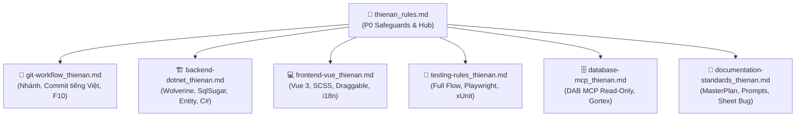

# 📌 Quy Định Chung Phòng Phần Mềm: Thiên Ân (Single Source of Truth)

> 🔴 **NGUỒN SỰ THẬT DUY NHẤT (SSOT): `.agents/rules/`**  
> Toàn bộ quy tắc kiến trúc, quy chuẩn code, quy trình Git và an toàn vận hành AI được chuẩn hóa tại đây.
> Các quy tắc trong file này có độ ưu tiên **CAO HƠN (P0)** so với `universal-rules.md` và mọi rule generic khác của AG-Kit.

---

## 🛑 BẢNG QUY TẮC CỐT LÕI BẮT BUỘC (P0 SAFEGUARDS)

Mọi AI Agent (Antigravity, Claude Code, Cursor, Codex...) **BẮT BUỘC** tuân thủ tuyệt đối 15 quy tắc sống còn sau:

| STT | Quy Tắc Cốt Lõi (P0) | Yêu Cầu Chi Tiết |
| :---: | :--- | :--- |
| **1** | **Gortex-First Protocol** (Rule 19.62) | Mọi thao tác tìm kiếm, đọc, phân tích đồ thị và sửa mã nguồn (C#, Vue, TS, SQL) **BẮT BUỘC dùng Gortex MCP** (`call_mcp_tool` server `gortex`). Chỉ dùng công cụ mặc định khi Gortex không khả dụng hoặc khi sửa file Markdown. |
| **2** | **Bộ Test Hợp Nhất** (Rule 19.63) | Test Frontend **BẮT BUỘC** viết bằng Playwright tại `tests/FE/` (`pnpm test:e2e`). Test Backend **BẮT BUỘC** viết bằng xUnit tại `tests/BE/` (`dotnet test tests/BE/test.csproj`). ⛔ **CẤM** tạo script test ad-hoc rải rác ngoài 2 thư mục này. |
| **3** | **Cấm Tự Ý Git Stage / Commit** (Mục 4.2, Rule 19.58) | ⛔ **TUYỆT ĐỐI CẤM** tự ý chạy `git add`, `git reset`, `git commit`, `git push`. Mọi thay đổi mã nguồn BẮT BUỘC để nguyên ở trạng thái Working Tree (Unstaged) để lập trình viên tự review qua Git Diff. |
| **4** | **Cấm Auto-Build Frontend** (Rule 19.13) | Phía Frontend đã có Vite Dev Server chạy nền tích hợp sẵn Hot-Reload (HMR). Sau khi sửa code FE, AI ⛔ **CẤM tự ý chạy `npm run build` / `pnpm build`**. |
| **5** | **CSDL Test Local Bắt Buộc** (Mục 11) | Mọi bài test Backend BẮT BUỘC chạy trên SQL Server Local (`localhost` / `127.0.0.1`). `Host.GuardAllConnectionsLocal` chặn cứng kết nối ra ngoài. ⛔ **CẤM** dùng cờ `--no-build` khi chạy `dotnet test`. |
| **6** | **Cấm Dùng Thư Viện Mock Ngoài** (Mục 15, Rule 19.18) | ⛔ **CẤM** dùng Moq, NSubstitute hoặc tự tạo class fake mock nội bộ cho service nghiệp vụ và NATS. BẮT BUỘC lấy service thật từ `host.Services` và test trên CSDL test local. Ngoại lệ duy nhất: giả lập server HTTP ngoài bằng `HttpListener` trên `127.0.0.1`. |
| **7** | **Strict AAA — Cấm Try-Catch Trong Test** (Rule 19.43) | ⛔ **CẤM** bọc `try-catch` hoặc `try-finally` quanh các khối Act và Assert trong test method. Luồng test phải phẳng và tuần tự theo AAA để test fail tự nhiên khi có lỗi. |
| **8** | **Không Tự Xóa DB Trong Test Method** (Rule 19.45) | ⛔ **CẤM** tự viết câu lệnh xóa bảng DB trong từng test method. Dọn dẹp tập trung tại `Host.ClearAllData()` và mỗi test method tự cô lập dữ liệu bằng **Unique ID**. |
| **9** | **Cấm Lạm Dụng `!important` Trong CSS** (Rule 20.6) | ⛔ **CẤM** dùng `!important` trong CSS/SCSS. Nâng cao độ ưu tiên tự nhiên (specificity) bằng lồng selector hoặc class định danh. |
| **10** | **CSS-First Cho Mọi Sửa Đổi Giao Diện** (Rule 20.7, 19.27) | Mọi lỗi hiển thị, responsive BẮT BUỘC xử lý bằng CSS/SCSS. ⛔ **CẤM** tự ý xóa props/thuộc tính của Element Plus (`show-word-limit`, `clearable`, `filterable`...) để "né" căn chỉnh CSS. |
| **11** | **Cấm Toán Tử Phủ Định Kép `!!`** (Rule 20.8) | ⛔ **CẤM** viết toán tử `!!` trong TypeScript/JavaScript. BẮT BUỘC dùng `Boolean(val)` hoặc so sánh tường minh (`val != null && val !== ''`). |
| **12** | **Quy Tắc Sinh ID SnowFlake** (Rule 19.44) | WebAPI được AOP tự động sinh Snowflake ID khi Insert (⛔ CẤM gán tay `entity.ID`). Background Worker BẮT BUỘC gán thủ công `entity.ID = YitIdHelper.NextId()`. |
| **13** | **Can Thiệp Tối Thiểu (Minimal Diff)** (Rule 19.6, 19.35) | Chỉ sửa đúng file và dòng code trực tiếp phục vụ yêu cầu. ⛔ **CẤM** tự ý format lại toàn bộ file, đổi namespace, upgrade package hoặc sửa file ngoài phạm vi. |
| **14** | **Duy Nhất 1 MasterPlan & Giữ Lại Prompt** (Rule 19.52, Mục 13) | Mỗi phân hệ CHỈ CÓ DUY NHẤT 1 file MasterPlan sống (`<PhânHệ>_MasterPlan.md`). ⛔ **CẤM** tự động xóa file prompt sau khi hoàn thành task. |
| **15** | **Tự Động Dọn Dẹp Test Artifacts** (Rule 19.64) | Sau khi test pass 100%, AI **BẮT BUỘC tự động dọn dẹp các tệp/thư mục tạm** sinh ra do test runner (như `test-results/`, `playwright-report/`, traces, screenshots, log tạm) để giữ sạch Working Tree. Chỉ giữ lại khi test fail để chẩn đoán. |

---

## 🗺️ BẢNG ĐIỀU HƯỚNG QUY CHUẨN THEO MIỀN (DOMAIN MODULES)

Để tránh phình to ngữ cảnh, các quy định kỹ thuật chuyên sâu được phân tách thành các module độc lập bên dưới. AI hãy tra cứu trực tiếp theo đúng nghiệp vụ đang xử lý:

### 1. [🌿 Quy Chuẩn Git Workflow & Commit](file:///Users/hoangquydat/ThienAn/.agents/rules/git-workflow_thienan.md)
- **Tên nhánh:** `feat/20260922-XD1.2.2.5_map-location`, `fix/20261007-sharedata-issue`. CẤM lặp `fix-`, `feat-` trong slug.
- **Commit Message:** Dòng 1 `[type]([scope]): [nội dung tiếng Việt có dấu]`. Dòng 2 lặp lại Dòng 1. Dòng 3 gạch đầu dòng chi tiết.
- **Pre-commit Checklist:** 10 bước tự kiểm tra bắt buộc trước khi commit.

### 2. [🏗️ Quy Chuẩn Backend .NET & Clean Architecture](file:///Users/hoangquydat/ThienAn/.agents/rules/backend-dotnet_thienan.md)
- **Wolverine CQRS:** Thin Controller (`MessBus.InvokeAsync()`), CommandHandler `IWolverineHandler`, FluentValidation, Mapster.
- **SqlSugar & Entity:** Kế thừa `EntityTenant`, `EntityConst.Length*` (cấm gán Length vào kiểu số), cấm raw SQL DML, worker dùng `baseClient.CopyNew()`.
- **C# Conventions:** Zero unnecessary usings (IDE0005), cấm hậu tố `-Async`, ưu tiên `var`, auto-properties `{ get; set; }`.

### 3. [💻 Quy Chuẩn Frontend Vue 3 / TypeScript](file:///Users/hoangquydat/ThienAn/.agents/rules/frontend-vue_thienan.md)
- **CSS / SCSS:** CẤM hardcode mã màu (dùng CSS vars Element Plus), block comment `/* */`, CẤM `!important`.
- **Draggable Dialog:** Dùng `dialogRef.value?.resetPosition?.()`, CẤM sửa tay `style.transform` (tránh giật toạ độ).
- **TypeScript:** CẤM toán tử `!!`, ngắt dòng thuộc tính template, cấm sửa tay `src/api-services/`.

### 4. [🧪 Quy Chuẩn Kiểm Thử (Testing Suite)](file:///Users/hoangquydat/ThienAn/.agents/rules/testing-rules_thienan.md)
- **Triết lý:** Test toàn trình nghiệp vụ (Full Business Flow), cấm micro unit test rời rạc, tái hiện bug bằng test fail trước (TDD).
- **Backend Test:** Chạy xUnit trên CSDL local, cấm Moq, cấm mock service nội bộ & NATS, cấm bọc `try-catch` quanh Act/Assert.
- **Frontend Test:** Playwright E2E tại `tests/FE/`, timeout mặc định $\le$ 5s.
- **Dọn dẹp Artifacts (Rule 19.64):** Sau khi test pass 100%, BẮT BUỘC tự động dọn dẹp xóa bỏ `test-results/` và các file artifacts tạm.

### 5. [🗄️ Quy Chuẩn Database & MCP Tooling](file:///Users/hoangquydat/ThienAn/.agents/rules/database-mcp_thienan.md)
- **Dual Source of Truth:** Gortex MCP cho code, DAB MCP Staging (`10.10.8.30/DEV_ITS10`) read-only cho DB schema/dữ liệu thực tế.
- **An toàn CSDL:** CẤM tự ý chạy DDL (`ALTER TABLE`), cấm hàm tạo bảng `EnsureTablesCreated()`. Script DDL/DML viết ra file `.sql`.

### 6. [📄 Quy Chuẩn Tài Liệu, Plan & Báo Cáo Nghiệp Vụ](file:///Users/hoangquydat/ThienAn/.agents/rules/documentation-standards_thienan.md)
- **MasterPlan & Prompt:** Duy nhất 1 MasterPlan sống per phân hệ. File prompt đặt tại `Prompt/`, có mục cuối cập nhật tài liệu gốc.
- **Báo cáo rà soát:** Viết hướng về người đọc, cấm phụ lục, trạng thái chỉ có "Đã làm" hoặc "Chưa làm".
- **Phản hồi Sheet Bug:** Cú pháp `[ddMMyyyy]-[TênDev]: [Bị gì / Fix như nào cụ thể]`, cấm từ ngữ mơ hồ, cấm gộp issue.
