# Video Wall Controller — Quick Start Guide

> Converted from `Controller phần cứng.pdf` (40 pages). Applicable models: **Hikvision DS-C66S series** video wall controller.
> Figures are extracted to `images/`; connection topologies are additionally redrawn as Mermaid graphs.

---

## Table of Contents

- [Preface](#preface)
- [Safety Instructions](#safety-instructions)
- [Chapter 1 Introduction](#chapter-1-introduction)
  - [1.1 Overview](#11-overview)
  - [1.2 Appearance](#12-appearance)
    - [1.2.1 Host System](#121-host-system)
    - [1.2.2 Main Control Board](#122-main-control-board)
    - [1.2.3 Input Boards](#123-input-boards)
    - [1.2.4 Output Boards](#124-output-boards)
- [Chapter 2 Installation](#chapter-2-installation)
  - [2.1 Safety Precautions](#21-safety-precautions)
  - [2.2 Open Package and Check Items](#22-open-package-and-check-items)
  - [2.3 Install Modules](#23-install-modules)
  - [2.4 Install the Device in the Rack](#24-install-the-device-in-the-rack)
  - [2.5 Connect the Ground Wire](#25-connect-the-ground-wire)
  - [2.6 Connect Display and Device](#26-connect-display-and-device)
  - [2.7 Connect the Power Cord](#27-connect-the-power-cord)
- [Chapter 3 Configuration](#chapter-3-configuration)
  - [3.1 Activate Device](#31-activate-device)
  - [3.2 More Configuration](#32-more-configuration)
- [Appendix — Figure Index](#appendix--figure-index)

---

## Preface

### Applicable Models

This manual is applicable to the **DS-C66S series** video wall controller.

### Default Parameters

| Type | Default Parameter |
| --- | --- |
| Device | Login user name: `admin` — IP address: `192.0.0.64` |
| SSH connection | (disabled by default) |

> [!NOTE]
> To improve system security, it is highly recommended to change the password regularly. In order to protect your privacy and corporate data and avoid network security issues, it is recommended to set a strong password that meets security requirements.

### Symbol Conventions

| Symbol | Description |
| --- | --- |
| **Note** | Provides additional information to emphasize or supplement important points of the main text. |
| **Caution** | Indicates a potentially hazardous situation, which if not avoided, could result in equipment damage, data loss, performance degradation, or unexpected results. |
| **Danger** | Indicates a hazard with a high level of risk, which if not avoided, will result in death or serious injury. |

---

## Safety Instructions

### ⚠️ Danger

- The device must be connected to an earthed mains socket-outlet.
- The socket-outlet shall be installed near the device and shall be easily accessible.
- Do not touch the bare components (such as the metal contacts of the inlets) and wait for at least **5 minutes**, since electricity may still exist after the device is powered off.
- Never place the device in an unstable location. The device may fall, causing serious personal injury or death.
- This device is not suitable for use in locations where children are likely to be present.

### ⚠️ Caution — Battery

**Risk of explosion if the battery is replaced by an incorrect type.**

- Improper replacement of the battery with an incorrect type may defeat a safeguard (for example, in the case of some lithium battery types).
- Do not dispose of the battery into fire or a hot oven, or mechanically crush or cut the battery, which may result in an explosion.
- Do not leave the battery in an extremely high temperature surrounding environment, which may result in an explosion or the leakage of flammable liquid or gas.
- Do not subject the battery to extremely low air pressure, which may result in an explosion or the leakage of flammable liquid or gas.
- Dispose of used batteries according to the instructions.
- Keep body parts away from fan blades. Disconnect the power source during servicing.

### ⚠️ Caution — Laser

Class 1 laser product used with compatible Class 1 fiber optical transceivers according to IEC 60825-1:2014 and EN 60825-1:2014+A11:2021, and hazard level 1 based on IEC 60825-2:2021 and EN 60825-2:2004+A1:2007+A2:2010. Make sure that the power has been disconnected before you wire, install, maintain, or repair. When any laser equipment is in use, make sure that the device lens is not exposed to the laser beam, or it may burn out. The laser radiation emitted from the device can cause eye injuries, burning of skin or inflammable substances. Before enabling the laser ranging function, make sure no human or inflammable substances are in front of the laser lens. Do not place the device where minors can fetch it.

### ⚠️ Caution — General

- This device is suitable for use in equipment room only.
- Make sure that the power has been disconnected before you wire, install, or disassemble the device.
- The device shall not be exposed to water dripping or splashing, and no objects filled with liquids, such as vases, shall be placed on the device.
- No naked flame sources, such as lighted candles, should be placed on the device.
- If smoke, odor, or noise arises from the device, immediately turn off the power, unplug the power cable, and contact the service center.
- Install the device according to the instructions in this Quick Start Guide.
- To prevent injury, this device must be securely attached to the installation surface in accordance with the installation instructions.
- The ventilation should not be impeded by covering the ventilation openings with items, such as newspapers, table-cloths, curtains. The openings shall never be blocked by placing the device on a bed, sofa, rug, or other similar surface.

---

# Chapter 1 Introduction

## 1.1 Overview

The video wall controller (hereinafter referred to as *the device*) is the core control device of the screen splicing control system. As a new-generation **FPGA-based pure hardware image processing device**, it adopts the structure of a **main control board + service boards** to provide the following advantages:

- Supports the video input and video output via various ports.
- Supports the network encoding and real-time preview of signal sources.
- Supports the decoding and output of various network signal sources.
- Supports the high-definition (HD) video splicing and fusion.
- Supports the window splicing, roaming window, and other operations.
- Supports the management on users, network, operation, alarm and logs.

### System Architecture (graph)

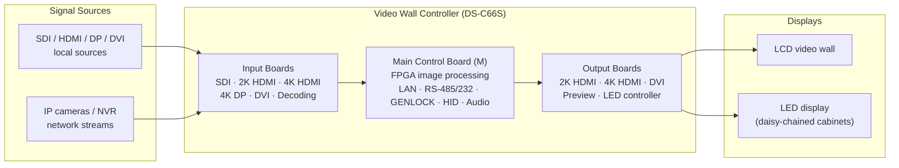
```mermaid
graph LR
    subgraph SRC["Signal Sources"]
        S1["SDI / HDMI / DP / DVI<br/>local sources"]
        S2["IP cameras / NVR<br/>network streams"]
    end

    subgraph DEV["Video Wall Controller (DS-C66S)"]
        IN["Input Boards<br/>SDI · 2K HDMI · 4K HDMI<br/>4K DP · DVI · Decoding"]
        MC["Main Control Board (M)<br/>FPGA image processing<br/>LAN · RS-485/232 · GENLOCK · HID · Audio"]
        OUT["Output Boards<br/>2K HDMI · 4K HDMI · DVI<br/>Preview · LED controller"]
        IN --> MC --> OUT
    end

    subgraph DISP["Displays"]
        L1["LCD video wall"]
        L2["LED display<br/>(daisy-chained cabinets)"]
    end

    S1 --> IN
    S2 --> IN
    OUT --> L1
    OUT --> L2
```

## 1.2 Appearance

The device adopts a **plug-and-play modular design**, and the host system achieves different functions by being equipped with various service boards.

### 1.2.1 Host System

#### Front Panel

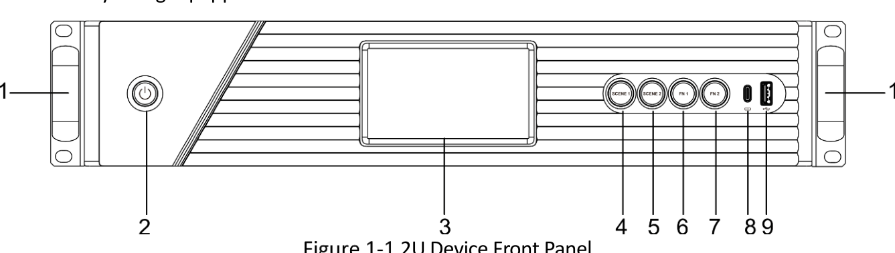
*Figure 1-1 — 2U Device Front Panel*

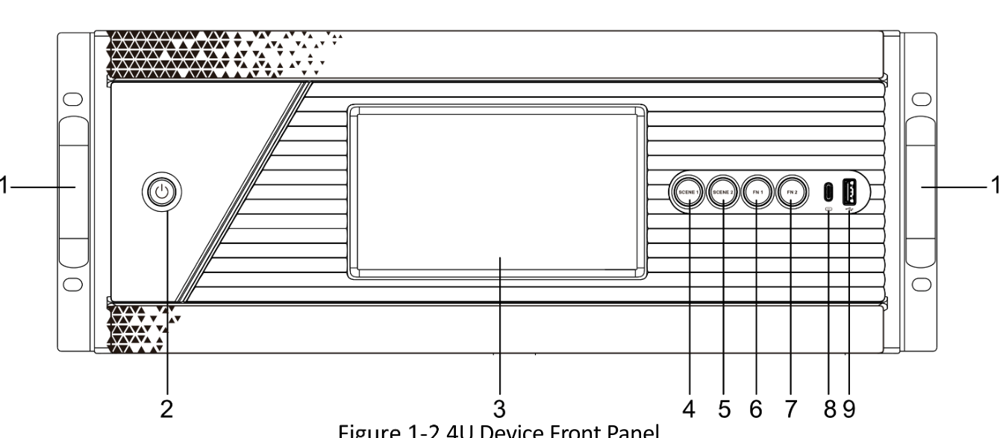
*Figure 1-2 — 4U Device Front Panel*

**Table 1-1 Front Panel Description**

| No. | Name | Description |
| --- | --- | --- |
| 1 | Mounting ears | Hold the handles on the mounting ears with both hands to move the device. |
| 2 | Power button / power indicator | **Power button:** • Default: the device starts automatically upon power connection (including after reconnection). • Power off: press and hold for **3 seconds** to force shutdown (effective in any state). • Power on: press briefly (**1 second**) to power on the device (effective only when powered off). **Power indicator:** On = device powered on; Off = device powered off. |
| 3 | LCD touch panel | **Status monitoring:** displays real-time device operation status and board status. **Function configuration:** supports scene changing, USB upgrade, debugging information export, and quick self-test. |
| 4 | Scene switch button (SCENE 1) | One-key switch to Scene 1 of Video Wall 1. |
| 5 | Scene switch button (SCENE 2) | One-key switch to Scene 2 of Video Wall 1. |
| 6 | Custom scene switch button (FN 1) | One-key switch to the video wall scene configured via the web interface. |
| 7 | Custom scene switch button (FN 2) | One-key switch to the video wall scene configured via the web interface. |
| 8 | Type-C port | Reserved. |
| 9 | USB 2.0 port | Connect a USB drive to support USB upgrade, debugging information export, and quick self-test. |

#### 2U Rear Panel

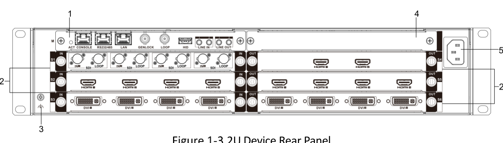
*Figure 1-3 — 2U Device Rear Panel*

**Table 1-2 2U Device Rear Panel Description**

| No. | Name | Description |
| --- | --- | --- |
| 1 | Main control board slot (M) | Supports the main control board. |
| 2 | Service board slot (S1 to S6) | Supports the input boards and output boards. |
| 3 | Grounding point | Connect the ground wire. |
| 4 | Empty slot | Keep the blank panel in the slot. |
| 5 | AC power input | Connects to the AC power cord. |

**2U slot layout (graph)**

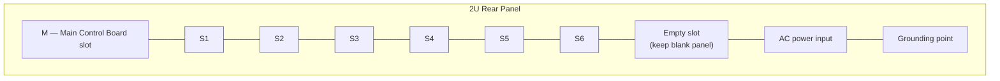
```mermaid
graph TD
    subgraph U2["2U Rear Panel"]
        M["M — Main Control Board slot"]
        S1["S1"]:::any
        S2["S2"]:::any
        S3["S3"]:::any
        S4["S4"]:::any
        S5["S5"]:::any
        S6["S6"]:::any
        E["Empty slot<br/>(keep blank panel)"]
        AC["AC power input"]
        GND["Grounding point"]
    end
    classDef any fill:#eef,stroke:#557;
    M --- S1 --- S2 --- S3 --- S4 --- S5 --- S6 --- E --- AC --- GND
```

> [!NOTE]
> All service board slots in the 2U device (S1–S6) are compatible with **both input boards and output boards**.

#### 4U Rear Panel

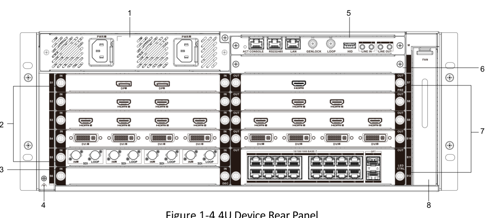
*Figure 1-4 — 4U Device Rear Panel*

**Table 1-3 4U Device Rear Panel Description**

| No. | Name | Description |
| --- | --- | --- |
| 1 | Power module slot (PWR1 and PWR2) | Supports the power modules. Provides two power slots (one power module is provided). Supports power redundancy by adding an optional power module. |
| 2 | Service board slot (S1 to S5) | Supports the **input boards**. |
| 3 | Service board slot (S6) | Supports the input board, preview board, electrical LED controller board, and optical LED controller board. |
| 4 | Grounding point | Connect the ground wire. |
| 5 | Main control board slot (M) | Supports the main control board. |
| 6 | Empty slot | Keep the blank panel in the slot. |
| 7 | Service board slot (S7 to S12) | Supports the **output boards**. |
| 8 | Fan slot | Supports the fan module. |

**4U slot layout (graph)**

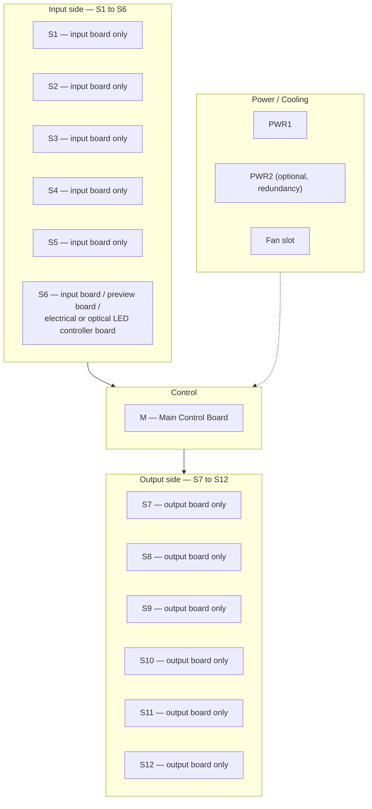
```mermaid
graph TB
    subgraph PWR["Power / Cooling"]
        P1["PWR1"]
        P2["PWR2 (optional, redundancy)"]
        FAN["Fan slot"]
    end
    subgraph LEFT["Input side — S1 to S6"]
        A1["S1 — input board only"]
        A2["S2 — input board only"]
        A3["S3 — input board only"]
        A4["S4 — input board only"]
        A5["S5 — input board only"]
        A6["S6 — input board / preview board /<br/>electrical or optical LED controller board"]
    end
    subgraph CTRL["Control"]
        MM["M — Main Control Board"]
    end
    subgraph RIGHT["Output side — S7 to S12"]
        B7["S7 — output board only"]
        B8["S8 — output board only"]
        B9["S9 — output board only"]
        B10["S10 — output board only"]
        B11["S11 — output board only"]
        B12["S12 — output board only"]
    end
    LEFT --> CTRL --> RIGHT
    PWR -.-> CTRL
```

### 1.2.2 Main Control Board

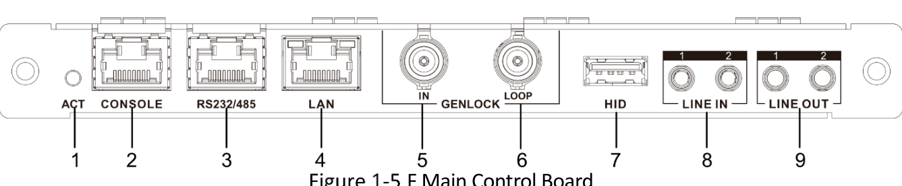
*Figure 1-5 — Main Control Board*

**Table 1-4 Main Control Board Description**

| No. | Name | Description |
| --- | --- | --- |
| 1 | ACT indicator | Flashing green: the board runs normally. |
| 2 | Console port | Connect an RJ-45 serial cable for device debugging, parameter configuration, etc. |
| 3 | RS-485 / RS-232 port | Connect an RJ-45 serial cable to an external device that supports RS-485 or RS-232 protocols. |
| 4 | Gigabit Ethernet port (LAN) | Connect a network cable. |
| 5 | Genlock input port (GENLOCK IN) | Connect to the GENLOCK port of other devices of the same type. |
| 6 | Genlock loop output port (GENLOCK LOOP) | Connect to the LOOP port of other devices of the same type for signal looping. |
| 7 | USB port (HID) | Connect to the USB port of the controlled device (such as computers, ultra-high-resolution servers, etc.) for transmitting keyboard and mouse data. |
| 8 | Audio input port (LINE IN) | Provides two audio input ports for connecting active audio sources, such as an active microphone. |
| 9 | Audio output port (LINE OUT) | Provides two audio output ports for connecting to amplified audio playback devices. |

**Main control board port map (graph)**

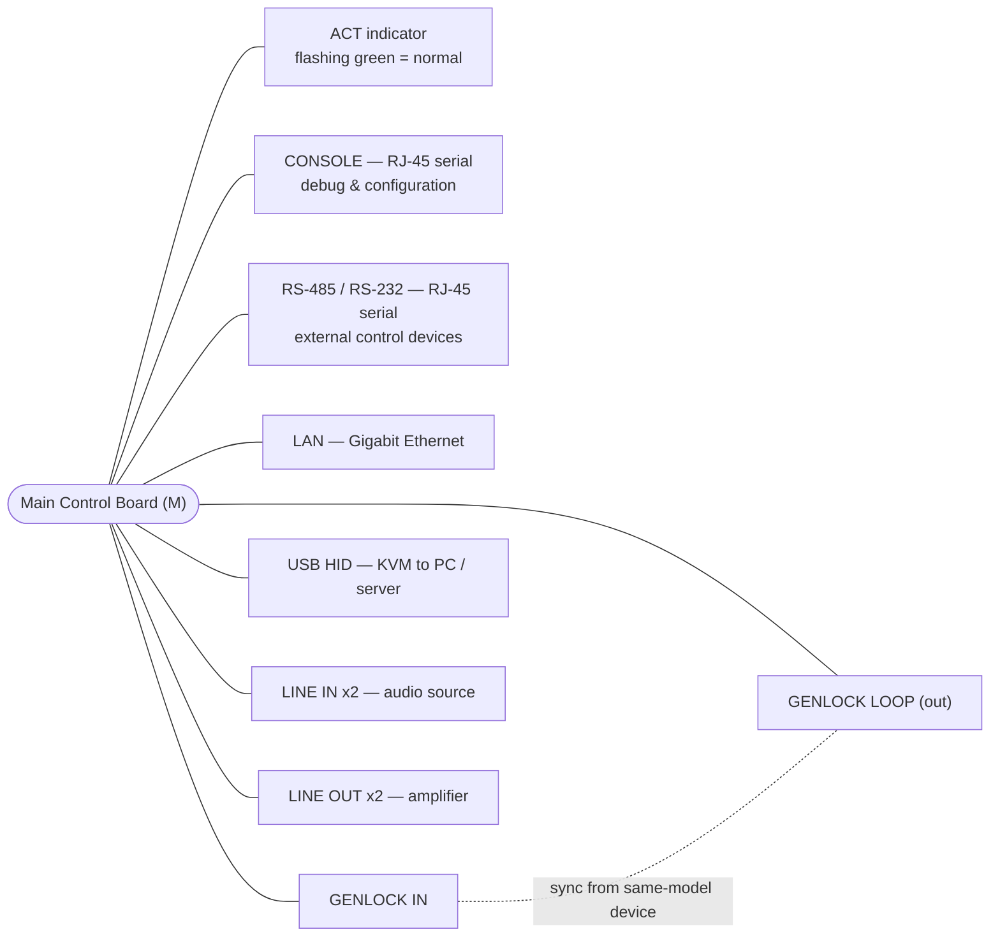
```mermaid
graph LR
    MCB(["Main Control Board (M)"])
    MCB --- C1["ACT indicator<br/>flashing green = normal"]
    MCB --- C2["CONSOLE — RJ-45 serial<br/>debug & configuration"]
    MCB --- C3["RS-485 / RS-232 — RJ-45 serial<br/>external control devices"]
    MCB --- C4["LAN — Gigabit Ethernet"]
    MCB --- C5["GENLOCK IN"]
    MCB --- C6["GENLOCK LOOP (out)"]
    MCB --- C7["USB HID — KVM to PC / server"]
    MCB --- C8["LINE IN x2 — audio source"]
    MCB --- C9["LINE OUT x2 — amplifier"]
    C5 -. "sync from same-model device" .- C6
```

### 1.2.3 Input Boards

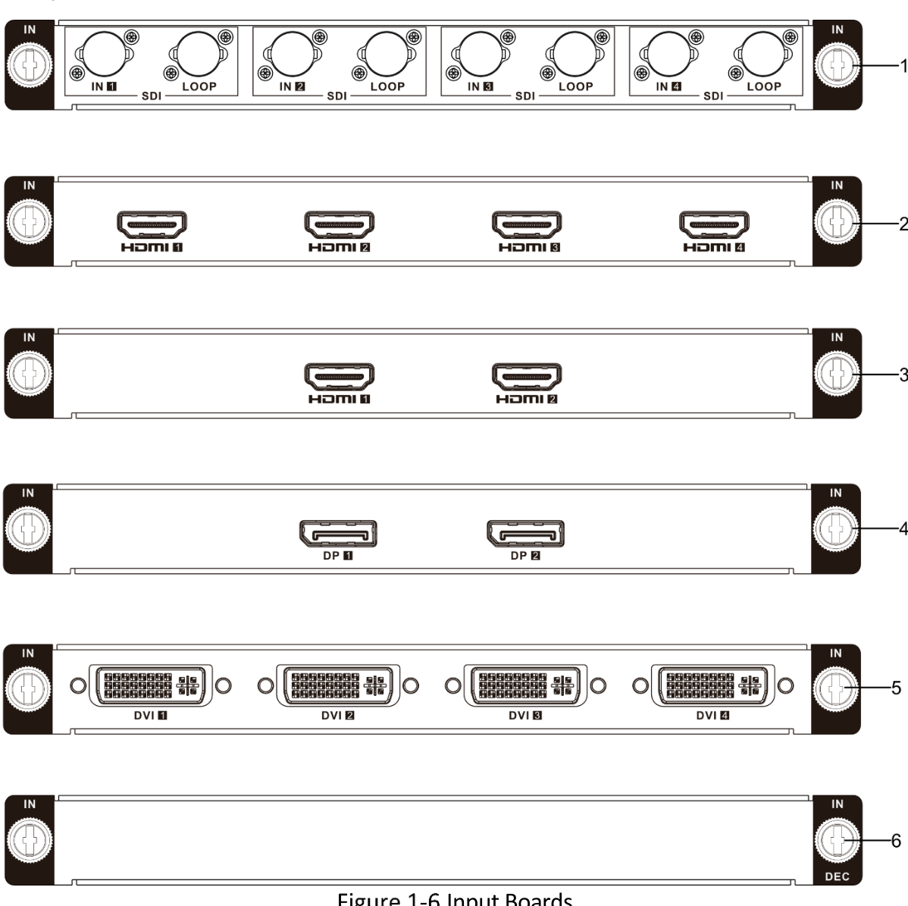
*Figure 1-6 — Input Boards*

**Table 1-5 Input Board Description**

| No. | Name | Description |
| --- | --- | --- |
| 1 | SDI input board | Supports **4 channels** of SDI input, max input resolution **4096 × 2160 @ 60 Hz**. Supports 4 channels of SDI loop-through output, max output resolution 4096 × 2160 @ 60 Hz. |
| 2 | 2K HDMI input board | Supports **4 channels** of HDMI input, max input resolution **1920 × 1200 @ 60 Hz**. |
| 3 | 4K HDMI input board | Supports **2 channels** of 4K HDMI input, max input resolution **4096 × 2160 @ 60 Hz**. |
| 4 | 4K DP input board | Supports **2 channels** of 4K DP input, max input resolution **4096 × 2160 @ 60 Hz**. |
| 5 | DVI input board | Supports **4 channels** of DVI input, max input resolution **1920 × 1200 @ 60 Hz**. |
| 6 | Decoding board | Provides **24 channels** of 1080p @ 30 fps video decoding capacity. |

### 1.2.4 Output Boards

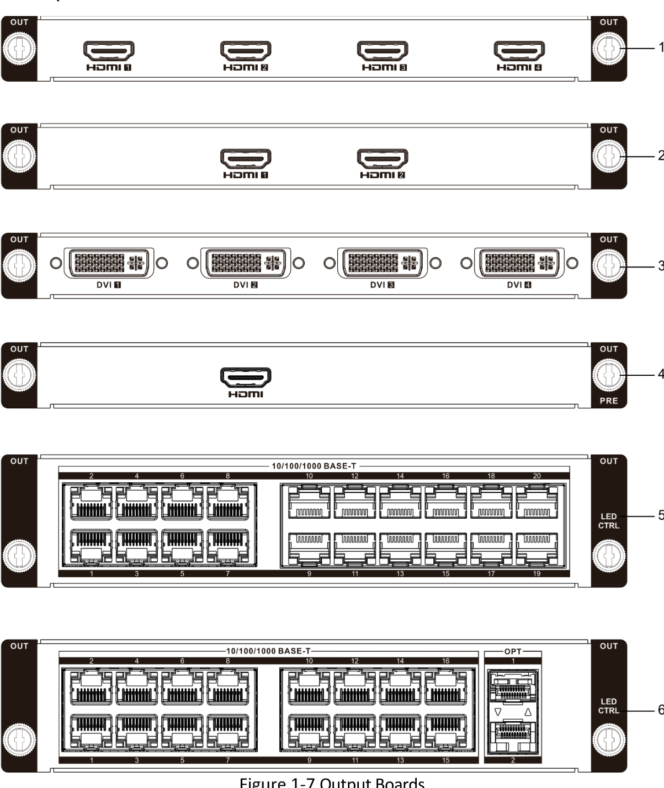
*Figure 1-7 — Output Boards*

**Table 1-6 Output Board Description**

| No. | Name | Description |
| --- | --- | --- |
| 1 | 2K HDMI output board | Provides **4 HDMI output ports**, max output resolution **1920 × 1200 @ 60 Hz**. |
| 2 | 4K HDMI output board | Provides **2 HDMI output ports**, max output resolution **4096 × 2160 @ 60 Hz**. |
| 3 | DVI output board | Provides **4 DVI output ports**, max output resolution **1920 × 1200 @ 60 Hz**. |
| 4 | Preview board | Provides **1 HDMI output port**, max output resolution **1920 × 1080 @ 60 Hz**. Supports previewing a single video wall remotely via the client. |
| 5 | Electrical LED controller board | Provides **20 Gigabit Ethernet ports** for direct connection to LED cabinets via network cables. Each port supports a max load of **0.65 MP**; the entire board supports a total load of up to **10.4 MP**. **Occupies 2 slots.** |
| 6 | Optical LED controller board | Provides **16 Gigabit Ethernet ports** for direct connection to LED cabinets via network cables. Each port supports a max load of **0.65 MP**; total board load up to **10.4 MP**. Supported image width 64–16,384 px (multiple of 4), height 64–8,192 px. Provides **two 10G optical ports** — insert a 10G optical transceiver module and connect via fiber to an external LED controller: **OPT 1** replicates data from Gigabit Ethernet ports 1–8, **OPT 2** replicates data from ports 9–16. **Occupies 2 slots.** Optical and electrical ports are **mutually exclusive**. |

**Optical LED controller board port mapping (graph)**

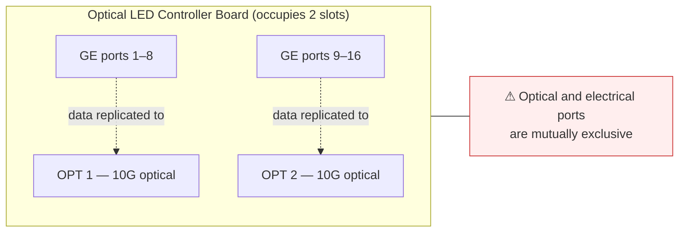
```mermaid
graph LR
    subgraph OLC["Optical LED Controller Board (occupies 2 slots)"]
        GE1["GE ports 1–8"]
        GE2["GE ports 9–16"]
        OPT1["OPT 1 — 10G optical"]
        OPT2["OPT 2 — 10G optical"]
    end
    GE1 -. "data replicated to" .-> OPT1
    GE2 -. "data replicated to" .-> OPT2
    NOTE["⚠ Optical and electrical ports<br/>are mutually exclusive"]:::warn
    classDef warn fill:#fee,stroke:#c33;
    OLC --- NOTE
```

---

# Chapter 2 Installation

## 2.1 Safety Precautions

> [!CAUTION]
> As a high-precision, system-level electronic product, the device should be installed and maintained by professionals. In order to avoid personal and property injury, please read the safety precautions in this section carefully before installation. The following safety recommendations do not cover all possible dangerous situations.

### Electricity Safety

- During installation, wiring, disassembly, and maintenance of the device, disconnect the power supply and do not operate with electricity (except for hot-plug operations).
- In the installation and use of the device, make sure to follow local electrical safety regulations.
- In case of abnormal phenomena such as smoke or odor during use, cut off the power immediately, unplug the power cord from the socket, and contact the after-sales service center in time.

### Anti-Static Measures

The equipment is a precision electronic device. In addition to anti-static measures in the equipment room:

- During the installation process (especially when installing the main control board and service board), you must wear **anti-static gloves or an anti-static wrist strap**.
- When holding the main control board or the service board, avoid touching the components or printed circuits.

### Grounding Requirements

In order to ensure personal safety and device safety, the device **must be grounded**.

### Power Supply Requirements

The device supports **90 VAC to 264 VAC @ 50/60 Hz** power supply. To ensure stable operation, it is recommended to install a **UPS**.

### Anti-Interference Requirements

- The on-site power supply system must have effective measures to prevent grid interference.
- Do not use the working ground together with the grounding device or lightning protection grounding device of power equipment, and keep the two as far away as possible.
- Keep away from high-power radio transmitters, radar transmitters, and high-frequency/high-current equipment.
- When necessary, electromagnetic shielding can be used for anti-interference.

### Environmental Requirements

The device is a standard rack-mounted, system-level monitoring equipment, generally placed in the central equipment room. Site selection should comply with the relevant equipment-room construction standards of the country/region of use.

| Requirement | Value |
| --- | --- |
| Rack temperature | 0 °C to 50 °C |
| Equipment room humidity | 10% RH to 90% RH (no condensation) |
| Rack strength | Strong enough to support the device and its accessories; avoid uneven mechanical load |
| Cable bending radius | ≥ 5 × cable outer diameter |
| Horizontal distance to other devices | ≥ 50 cm for sufficient ventilation |

## 2.2 Open Package and Check Items

Open the device package to verify that all items in the package are intact according to the packing list.

**Table 2-1 Packing List**

| Item | Quantity |
| --- | --- |
| Device | 1 |
| AC power cord | 1 |
| Ground wire | 1 |
| Rubber feet | 4 |
| Regulatory compliance and safety information manual | 1 |

## 2.3 Install Modules

The device adopts a plug-and-play modular design, with the main control board managing all service boards. The factory configuration varies by model:

- **2U Model:** 1 main control board + 7 blank panels.
- **4U Model:** 1 main control board + 1 power module + 1 fan module + 13 blank panels.

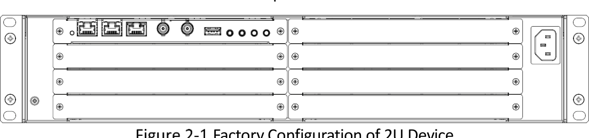
*Figure 2-1 — Factory Configuration of 2U Device*

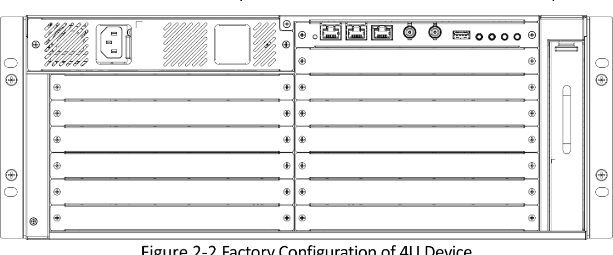
*Figure 2-2 — Factory Configuration of 4U Device*

> [!NOTE]
> - All service board slots in the **2U** device are compatible with both input boards and output boards. In the **4U** device, slots **S1–S5** support only input boards, slot **S6** is compatible with an input board, a preview board, or an electrical/optical LED controller board, and slots **S7–S12** support only output boards.
> - To improve heat dissipation while maintaining low noise levels, when installing a small number of service boards, prioritize slots near the **center** of the device and adopt a **vertically adjacent** layout.

**Slot compatibility (graph)**

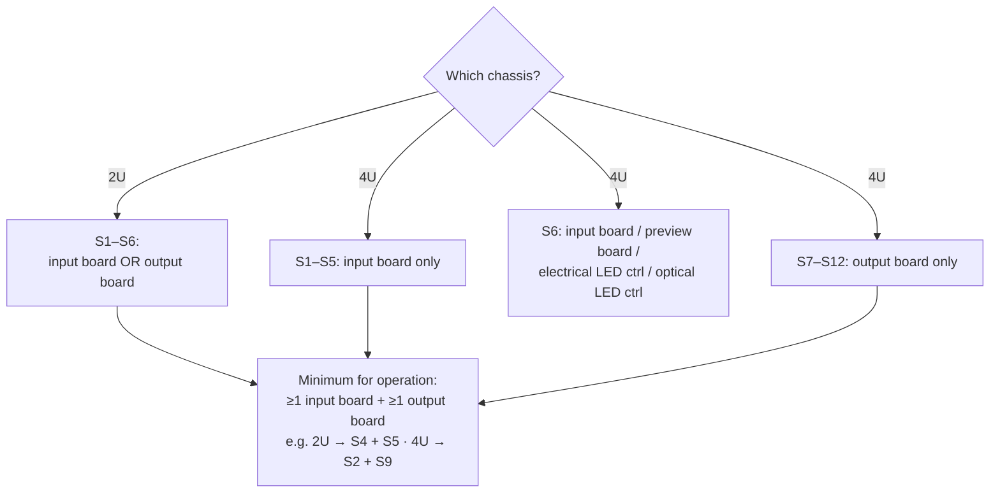
```mermaid
graph TD
    Q{"Which chassis?"}
    Q -->|2U| T2["S1–S6:<br/>input board OR output board"]
    Q -->|4U| T4A["S1–S5: input board only"]
    Q -->|4U| T4B["S6: input board / preview board /<br/>electrical LED ctrl / optical LED ctrl"]
    Q -->|4U| T4C["S7–S12: output board only"]
    T2 --> R["Minimum for operation:<br/>≥1 input board + ≥1 output board<br/>e.g. 2U → S4 + S5 · 4U → S2 + S9"]
    T4A --> R
    T4C --> R
```

### 2.3.1 Install Service Boards

1. Use a Phillips screwdriver compatible with **M3 screws** to remove the fixing screws (1) on both sides of the blank panel, and then pull out the two blank panels from the middle slots.

   > [!NOTE]
   > For normal operation, install **at least one input board and one output board**. For example, use slots **S4 and S5** in a 2U device, or slots **S2 and S9** in a 4U device.

   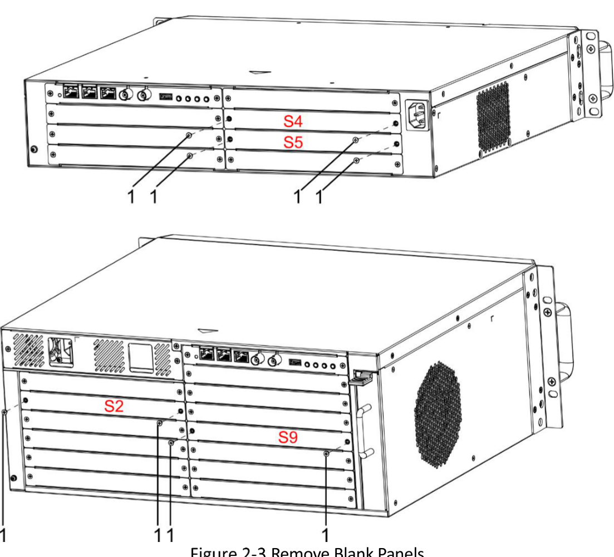
   *Figure 2-3 — Remove Blank Panels*

2. Insert the input board (2) and output board (3) into the corresponding slots of the device.

   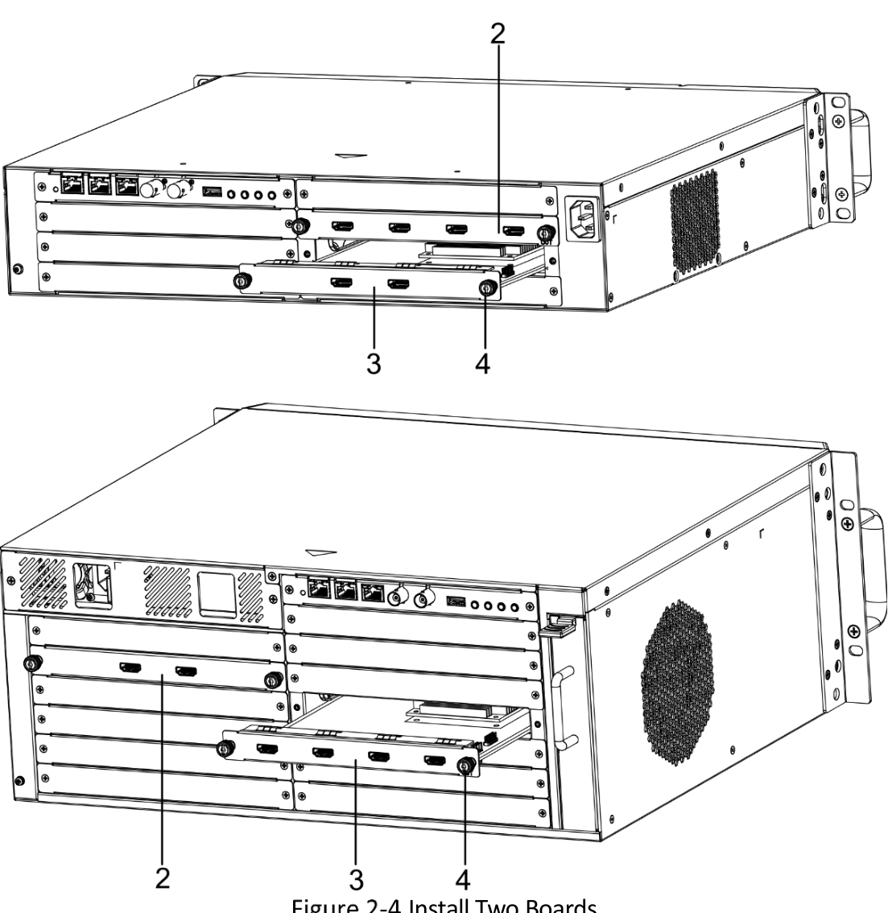
   *Figure 2-4 — Install Two Boards*

3. Use the screwdriver to tighten the captive screws (4) provided with the boards clockwise, securing them on both sides of the slots.

4. To install additional service boards, use the screwdriver to remove the fixing screws (1) on both sides of the corresponding blank panel, and then pull out the blank panel.

   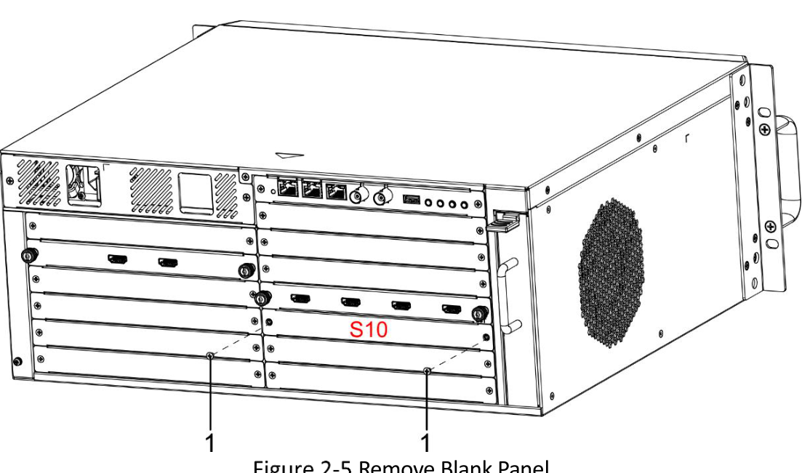
   *Figure 2-5 — Remove Blank Panel*

   > [!NOTE]
   > Unused slots **must retain blank panels** to avoid disrupting the cooling airflow.

5. Insert the service board (5) into the slot along the guide, and then use the screwdriver to tighten the captive screws on both sides of the board clockwise.

   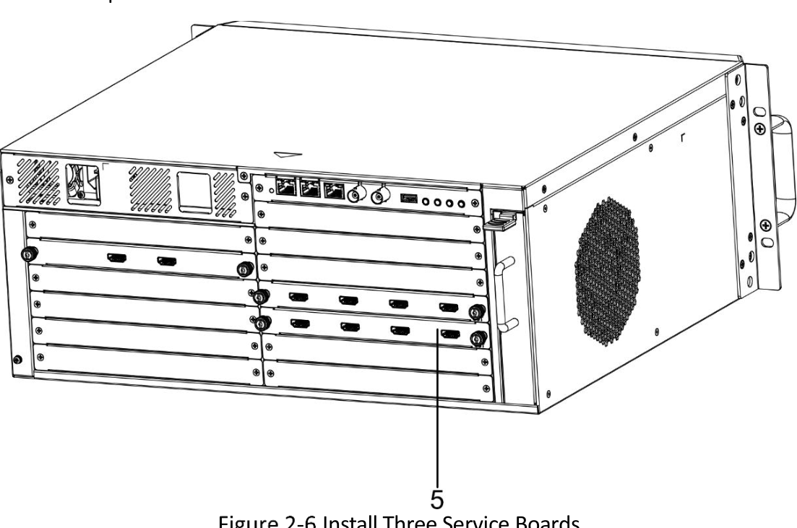
   *Figure 2-6 — Install Three Service Boards*

**Service board installation flow (graph)**

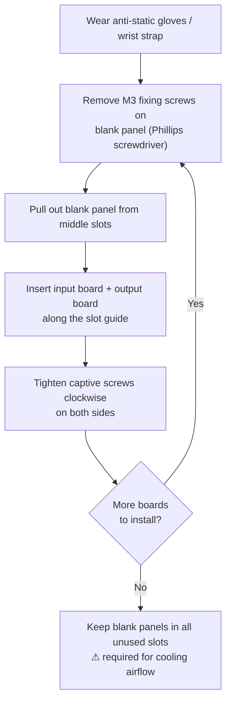
```mermaid
flowchart TD
    A["Wear anti-static gloves / wrist strap"] --> B["Remove M3 fixing screws on<br/>blank panel (Phillips screwdriver)"]
    B --> C["Pull out blank panel from middle slots"]
    C --> D["Insert input board + output board<br/>along the slot guide"]
    D --> E["Tighten captive screws clockwise<br/>on both sides"]
    E --> F{"More boards<br/>to install?"}
    F -->|Yes| B
    F -->|No| G["Keep blank panels in all unused slots<br/>⚠ required for cooling airflow"]
```

### 2.3.2 Install Power Module

The 4U device comes with one power module and supports **power redundancy** by adding an additional power module.

1. Use a Phillips screwdriver compatible with M3 screws to remove the fixing screws (1) on both sides of the power panel.

   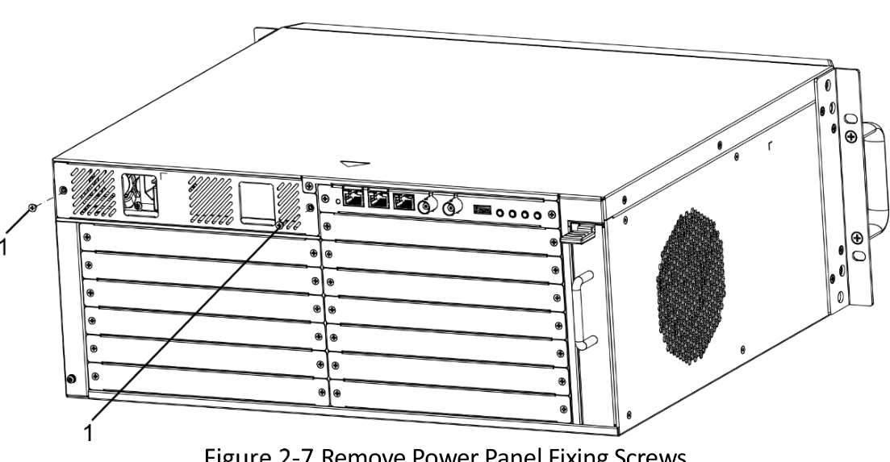
   *Figure 2-7 — Remove Power Panel Fixing Screws*

2. Remove the power panel (2).

   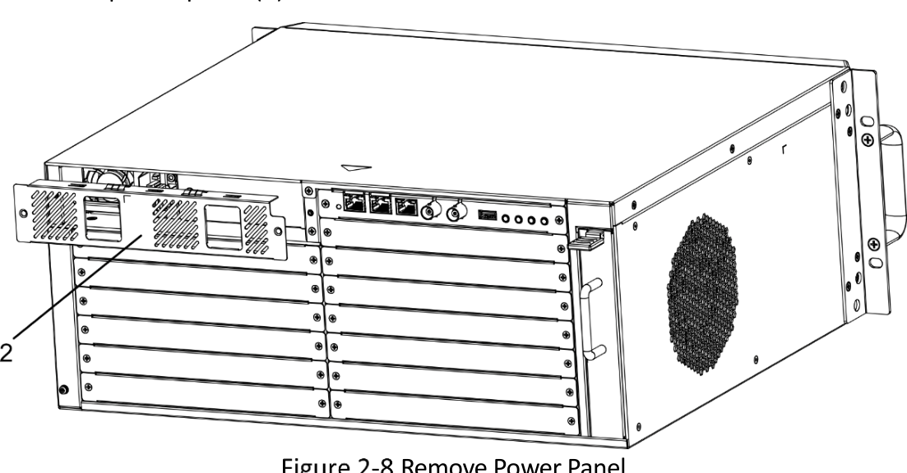
   *Figure 2-8 — Remove Power Panel*

3. Use the screwdriver to remove the fixing screws (3) on both sides of the power filler panel (4), and then remove the power filler panel.

   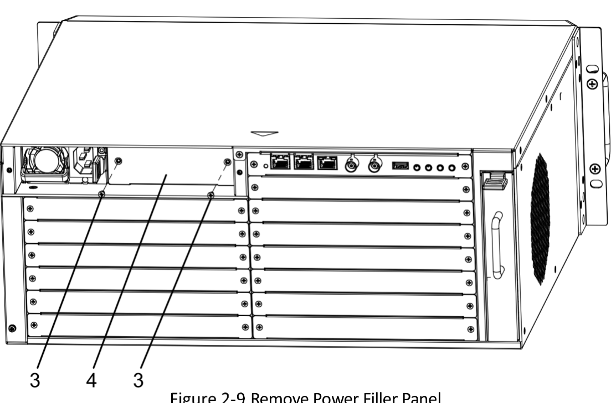
   *Figure 2-9 — Remove Power Filler Panel*

4. Insert the power module (5) into the power slot of the device.

   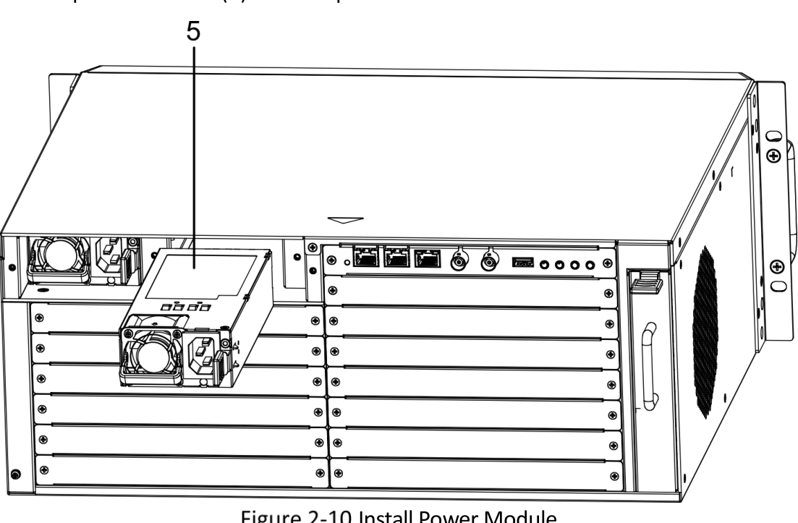
   *Figure 2-10 — Install Power Module*

5. Align the power panel with the power slots, and then use the screwdriver to tighten the captive screws on both sides of the panel clockwise, securing it to the device.

   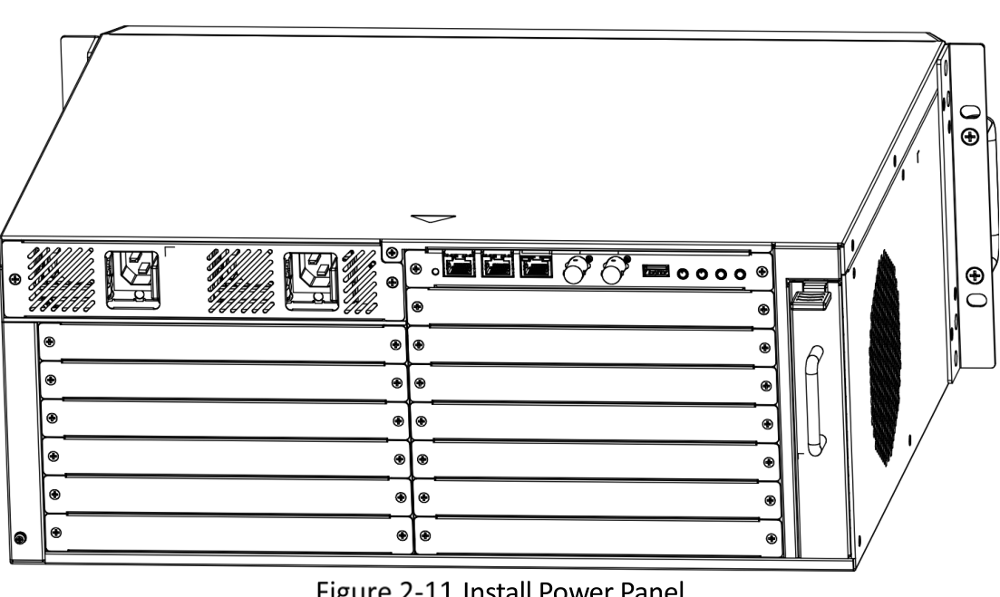
   *Figure 2-11 — Install Power Panel*

**Power module installation flow (graph)**

```mermaid
flowchart LR
    S1["1. Remove fixing screws (1)<br/>on power panel"] --> S2["2. Remove power panel (2)"]
    S2 --> S3["3. Remove screws (3) +<br/>power filler panel (4)"]
    S3 --> S4["4. Insert power module (5)<br/>into PWR slot"]
    S4 --> S5["5. Refit power panel,<br/>tighten captive screws"]
```

## 2.4 Install the Device in the Rack

Both the 2U and 4U devices come with mounting ears pre-installed. Please prepare your own rack. Use the screws (2) provided with the rack to secure the device to the rack posts (1).

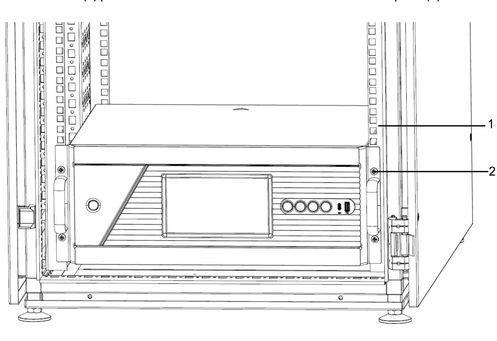
*Figure 2-12 — Install the 4U Device in the Rack*

## 2.5 Connect the Ground Wire

Connecting the ground wire can release the excessive voltage and current induced by lightning shock. Please select the most suitable connection mode to protect the ground wire according to the installation environment.

**Grounding method selection (graph)**

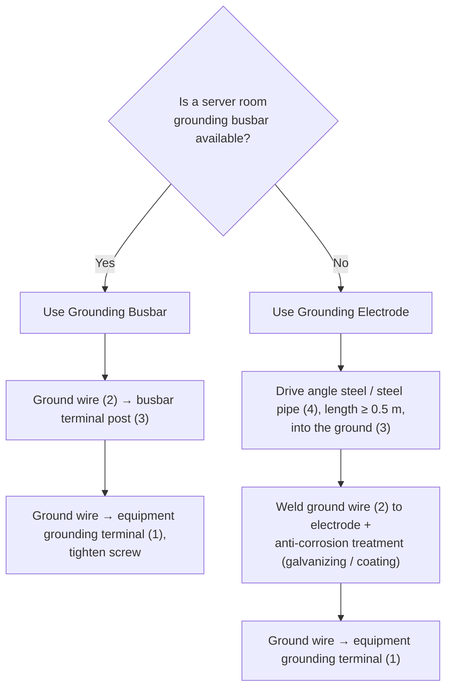
```mermaid
graph TD
    G{"Is a server room<br/>grounding busbar available?"}
    G -->|Yes| A["Use Grounding Busbar"]
    G -->|No| B["Use Grounding Electrode"]
    A --> A1["Ground wire (2) → busbar terminal post (3)"]
    A1 --> A2["Ground wire → equipment grounding terminal (1),<br/>tighten screw"]
    B --> B1["Drive angle steel / steel pipe (4), length ≥ 0.5 m,<br/>into the ground (3)"]
    B1 --> B2["Weld ground wire (2) to electrode +<br/>anti-corrosion treatment (galvanizing / coating)"]
    B2 --> B3["Ground wire → equipment grounding terminal (1)"]
```

### Use Grounding Busbar

1. Connect one end of the ground wire (2) to the terminal post of the server room grounding busbar (3).
2. Connect the other end of the ground wire to the equipment grounding terminal (1) and tighten the screw.

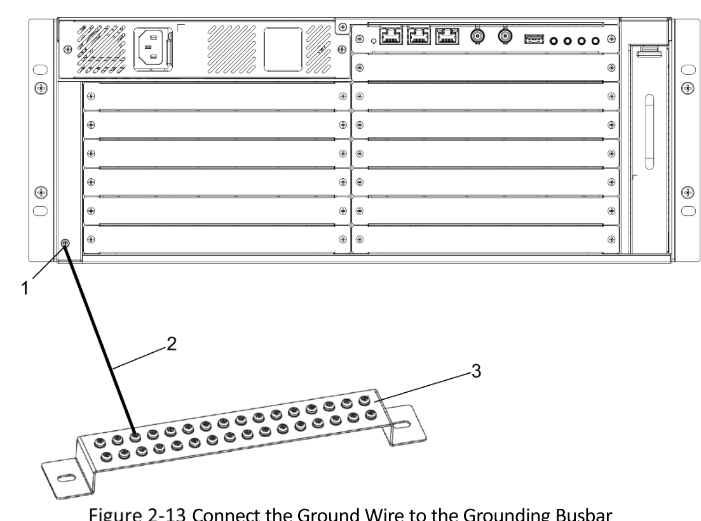
*Figure 2-13 — Connect the Ground Wire to the Grounding Busbar*

### Use Grounding Electrode

1. Drive an angle steel or steel pipe (4) with a length **≥ 0.5 m** into the ground (3) as a grounding electrode.
2. Weld one end of the ground wire (2) to the grounding electrode and then apply anti-corrosion treatment (e.g., galvanizing or coating) to the welded joint.
3. Connect the other end of the ground wire to the equipment grounding terminal (1).

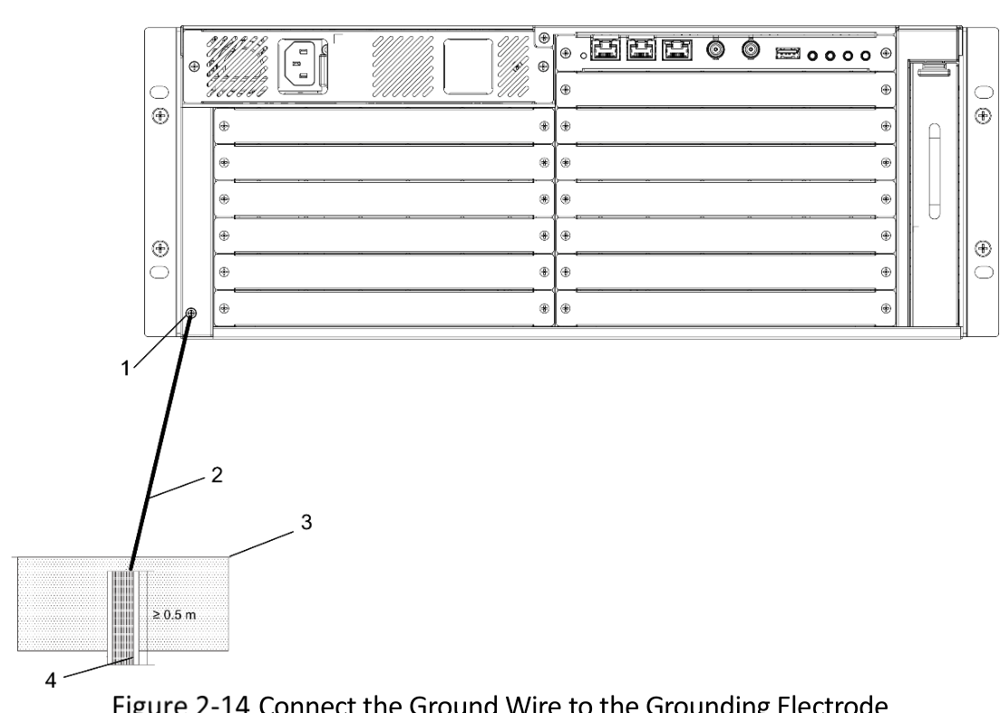
*Figure 2-14 — Connect the Ground Wire to the Grounding Electrode*

## 2.6 Connect Display and Device

### 2.6.1 Overview

The device can be connected to both an **LCD screen** and an **LED display** simultaneously.

- **Connecting an LCD screen:** use the corresponding video cable based on the type of output board installed:
  - HDMI output board → HDMI cable
  - DVI output board → DVI cable
- **Connecting an LED display:** select the appropriate connection method based on whether an LED controller board is installed and its type:
  - **No LED controller board installed:** connection must be made via an external LED controller — see [2.6.2](#262-connection-via-external-led-controller).
  - **LED controller board installed:** select the corresponding method based on board type and the distance between the display and the device — see [2.6.3](#263-connection-via-electrical-led-controller-board) and [2.6.4](#264-connection-via-optical-led-controller-board).

**Connection method decision tree (graph)**

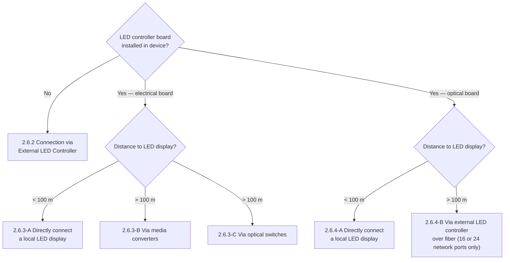
```mermaid
graph TD
    START{"LED controller board<br/>installed in device?"}
    START -->|No| EXT["2.6.2 Connection via<br/>External LED Controller"]
    START -->|"Yes — electrical board"| E{"Distance to LED display?"}
    START -->|"Yes — optical board"| O{"Distance to LED display?"}

    E -->|"< 100 m"| E1["2.6.3-A Directly connect<br/>a local LED display"]
    E -->|"> 100 m"| E2["2.6.3-B Via media converters"]
    E -->|"> 100 m"| E3["2.6.3-C Via optical switches"]

    O -->|"< 100 m"| O1["2.6.4-A Directly connect<br/>a local LED display"]
    O -->|"> 100 m"| O2["2.6.4-B Via external LED controller<br/>over fiber (16 or 24 network ports only)"]
```

### 2.6.2 Connection via External LED Controller

**Applicable Scenario**

The LED display consists of multiple LED cabinets. Use an external LED controller to connect the LED display when the device is **not equipped** with an LED controller board. Ensure the number of Ethernet ports on the external LED controller is **not less than** the number required for the LED display's daisy-chained links.

**Steps**

1. Prepare one LED controller.
2. Based on the site layout, divide the LED cabinets into several daisy-chained links. Each link corresponds to one **DATA OUT** port on the LED controller.
3. Use Ethernet cables (**CAT 6 recommended**) to connect the DATA OUT ports of the external LED controller to the Ethernet ports of the first LED cabinet in each respective link. Daisy-chain the subsequent cabinets within each link using Ethernet cables.
4. Use a video cable (HDMI or DVI) to connect the signal output port of the device's output board to the signal input port of the external LED controller.

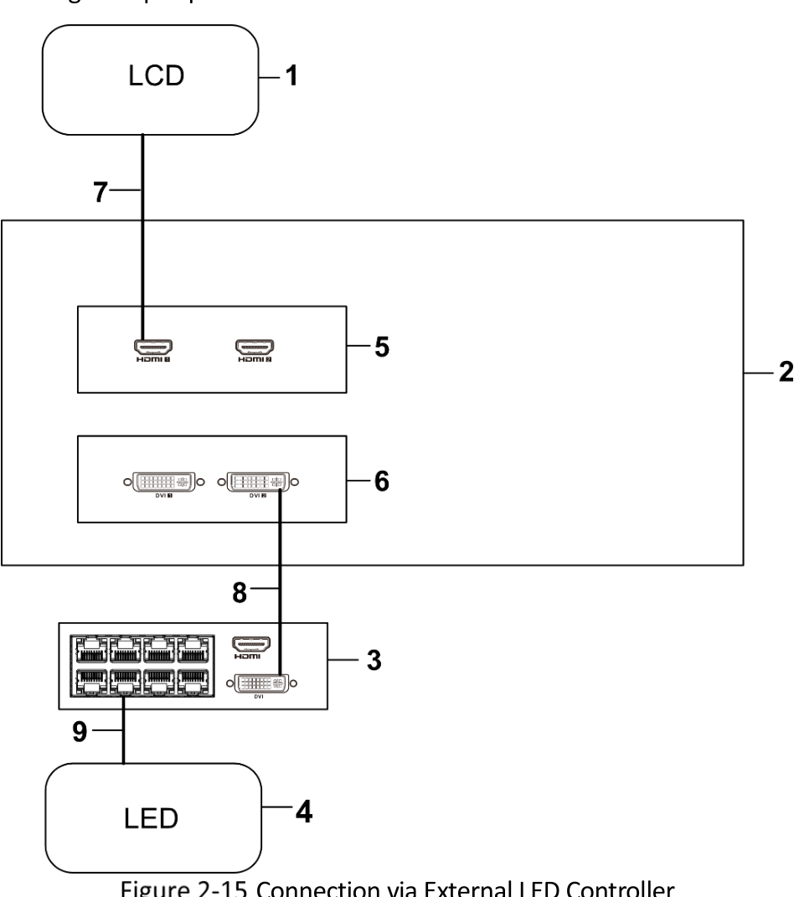
*Figure 2-15 — Connection via External LED Controller*

**Legend:** 1. LCD screen · 2. Device · 3. External LED controller · 4. LED display · 5. HDMI output board · 6. DVI output board · 7. HDMI cable · 8. DVI cable · 9. Ethernet cable

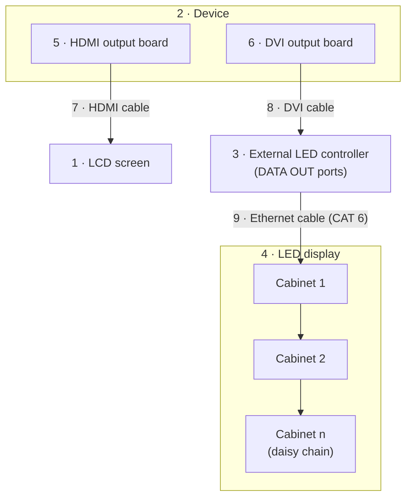
```mermaid
graph TD
    LCD["1 · LCD screen"]
    subgraph DEV["2 · Device"]
        HOB["5 · HDMI output board"]
        DOB["6 · DVI output board"]
    end
    ELC["3 · External LED controller<br/>(DATA OUT ports)"]
    subgraph LED["4 · LED display"]
        C1["Cabinet 1"] --> C2["Cabinet 2"] --> C3["Cabinet n<br/>(daisy chain)"]
    end

    HOB -->|"7 · HDMI cable"| LCD
    DOB -->|"8 · DVI cable"| ELC
    ELC -->|"9 · Ethernet cable (CAT 6)"| C1
```

### 2.6.3 Connection via Electrical LED Controller Board

#### A. Directly Connect a Local LED Display

**Applicable Scenario**

Directly connect when the device is equipped with an **electrical LED controller board** and the LED display is deployed near the device (within the effective transmission distance of an Ethernet cable, typically **< 100 meters**).

**Steps**

1. Based on the site layout, divide the LED cabinets into several daisy-chained links. Each link corresponds to one Ethernet port on the electrical LED controller board.
2. Use Ethernet cables (CAT 6 recommended) to connect the Ethernet ports of the electrical LED controller board to the Ethernet ports of the first LED cabinet in each respective link. Daisy-chain the subsequent cabinets within each link using Ethernet cables.

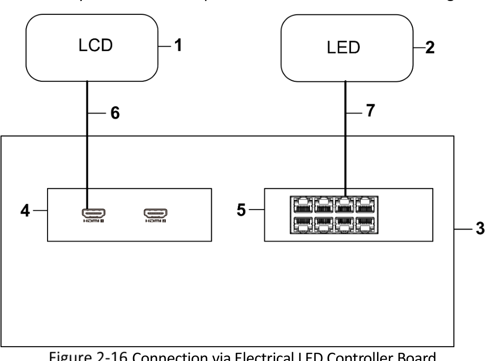
*Figure 2-16 — Connection via Electrical LED Controller Board*

**Legend:** 1. LCD screen · 2. LED display · 3. Device · 4. HDMI output board · 5. Electrical LED controller board · 6. HDMI cable · 7. Ethernet cable

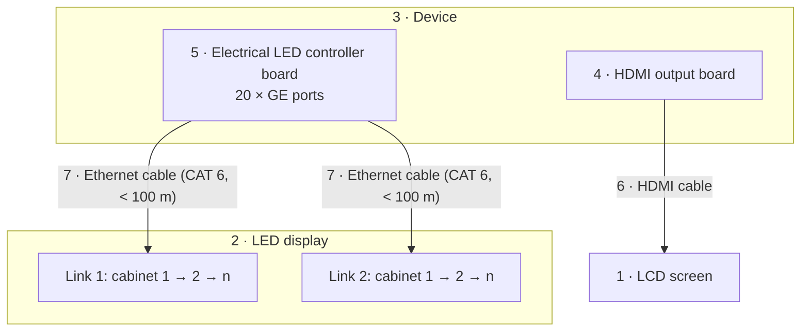
```mermaid
graph TD
    LCD["1 · LCD screen"]
    subgraph DEV["3 · Device"]
        HOB["4 · HDMI output board"]
        ELCB["5 · Electrical LED controller board<br/>20 × GE ports"]
    end
    subgraph LED["2 · LED display"]
        L1["Link 1: cabinet 1 → 2 → n"]
        L2["Link 2: cabinet 1 → 2 → n"]
    end

    HOB -->|"6 · HDMI cable"| LCD
    ELCB -->|"7 · Ethernet cable (CAT 6, < 100 m)"| L1
    ELCB -->|"7 · Ethernet cable (CAT 6, < 100 m)"| L2
```

#### B. Connect a Remote LED Display via Media Converters

**Applicable Scenario**

Use media converters to extend the connection when the device is equipped with an electrical LED controller board, but the LED display is located far from the device (**> 100 meters**). Ensure the number of Ethernet ports on the media converters (transmitter and receiver units) is not less than the number required for the LED display's daisy-chained links.

**Steps**

1. Based on the site layout, divide the LED cabinets into several daisy-chained links. Each link corresponds to one Ethernet port on the media converter (receiver unit).
2. Use Ethernet cables (CAT 6 recommended) to connect the Ethernet ports of the media converter (receiver unit) to the Ethernet ports of the first LED cabinet in each respective link. Daisy-chain the subsequent cabinets within each link using Ethernet cables.
3. Use Ethernet cables to connect each Ethernet port of the electrical LED controller board to the Ethernet ports of the media converter (transmitter unit).
4. Use fiber optic patch cords to connect the optical ports of the media converter (transmitter unit) to the optical ports of the media converter (receiver unit).

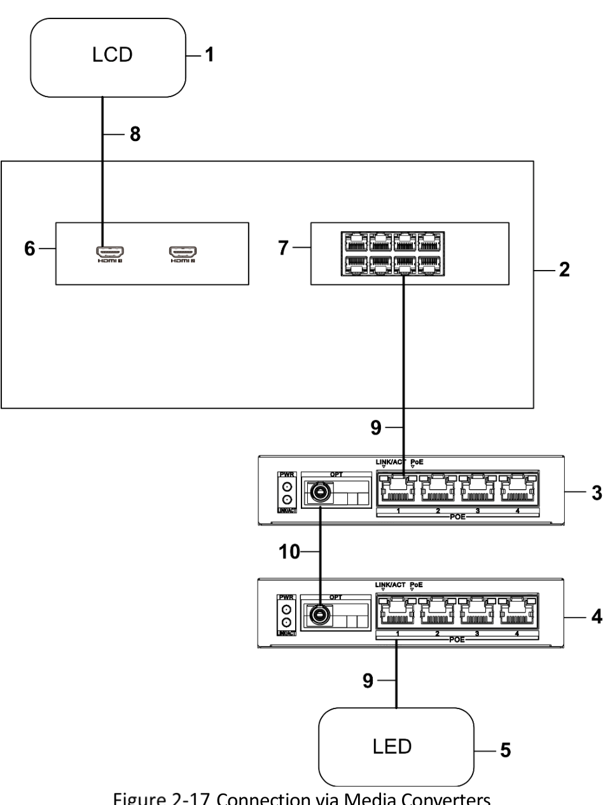
*Figure 2-17 — Connection via Media Converters*

**Legend:** 1. LCD screen · 2. Device · 3. Media converter (transmitter unit) · 4. Media converter (receiver unit) · 5. LED display · 6. HDMI output board · 7. Electrical LED controller board · 8. HDMI cable · 9. Ethernet cable · 10. Fiber optic patch cord

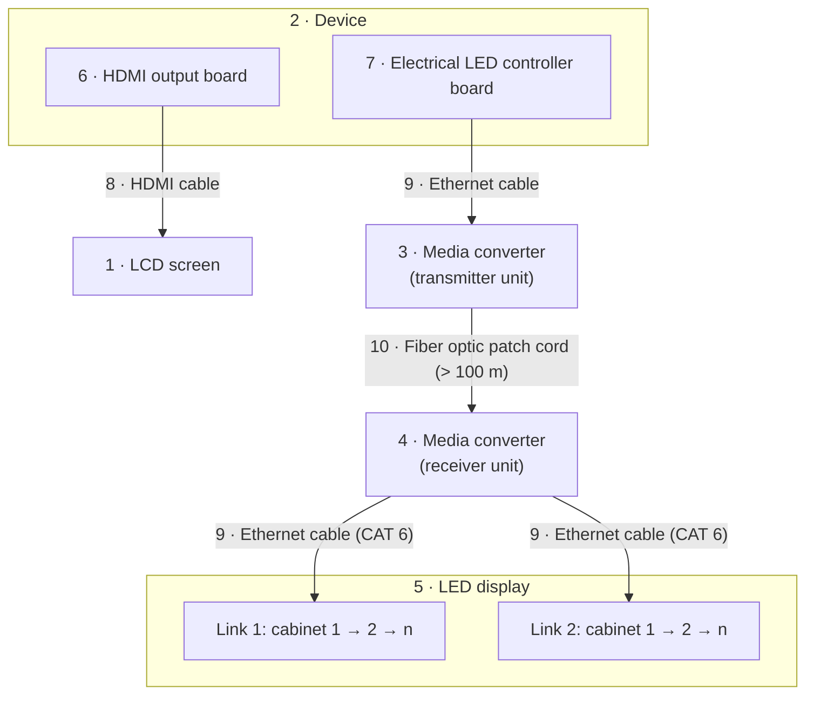
```mermaid
graph TD
    LCD["1 · LCD screen"]
    subgraph DEV["2 · Device"]
        HOB["6 · HDMI output board"]
        ELCB["7 · Electrical LED controller board"]
    end
    TX["3 · Media converter<br/>(transmitter unit)"]
    RX["4 · Media converter<br/>(receiver unit)"]
    subgraph LED["5 · LED display"]
        L1["Link 1: cabinet 1 → 2 → n"]
        L2["Link 2: cabinet 1 → 2 → n"]
    end

    HOB -->|"8 · HDMI cable"| LCD
    ELCB -->|"9 · Ethernet cable"| TX
    TX -->|"10 · Fiber optic patch cord (> 100 m)"| RX
    RX -->|"9 · Ethernet cable (CAT 6)"| L1
    RX -->|"9 · Ethernet cable (CAT 6)"| L2
```

#### C. Connect a Remote LED Display via Optical Switches

**Applicable Scenario**

Use optical switches to extend the connection when the device is equipped with an electrical LED controller board, but the LED display is located far from the device (**> 100 meters**). Ensure the number of Ethernet ports on the optical switches is not less than the number required for the LED display's daisy-chained links.

**Steps**

1. Based on the site layout, divide the LED cabinets into several daisy-chained links. Each link corresponds to one Ethernet port on the remote optical switch.
2. Use Ethernet cables (CAT 6 recommended) to connect the Ethernet ports of the remote optical switch to the Ethernet ports of the first LED cabinet in each respective link. Daisy-chain the subsequent cabinets within each link using Ethernet cables.
3. Use Ethernet cables to connect each Ethernet port of the electrical LED controller board to the Ethernet ports of the local optical switch.
4. Use fiber optic patch cords to connect the optical ports of the local optical switch to the optical ports of the remote optical switch.

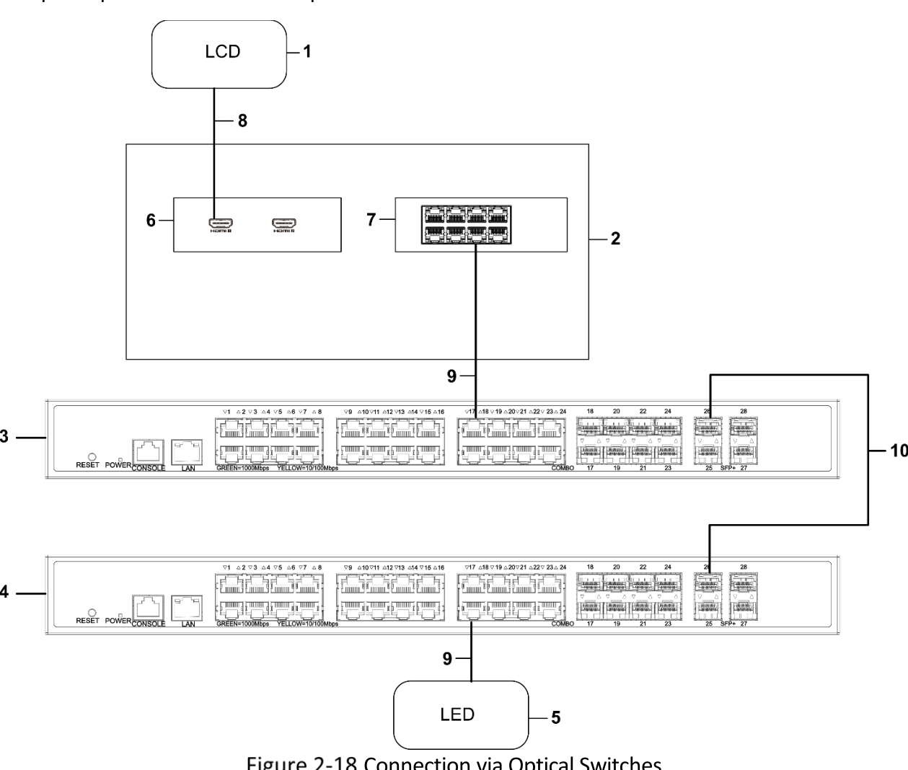
*Figure 2-18 — Connection via Optical Switches*

**Legend:** 1. LCD screen · 2. Device · 3. Local optical switch · 4. Remote optical switch · 5. LED display · 6. HDMI output board · 7. Electrical LED controller board · 8. HDMI cable · 9. Ethernet cable · 10. Fiber optic patch cord

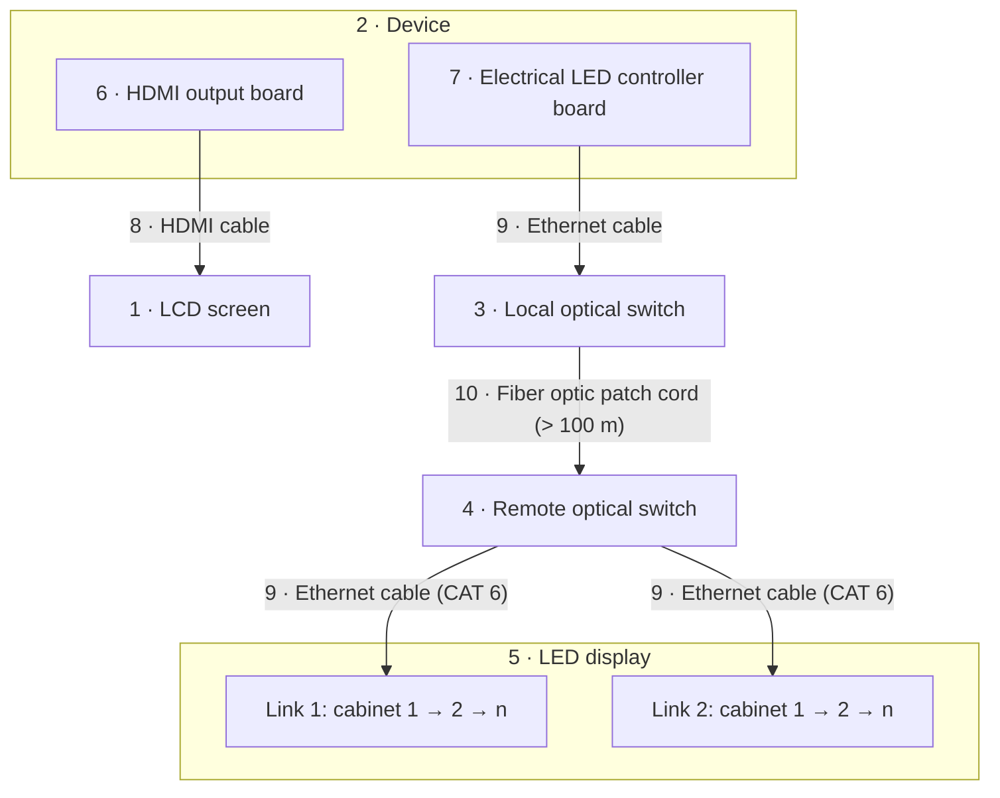
```mermaid
graph TD
    LCD["1 · LCD screen"]
    subgraph DEV["2 · Device"]
        HOB["6 · HDMI output board"]
        ELCB["7 · Electrical LED controller board"]
    end
    SW1["3 · Local optical switch"]
    SW2["4 · Remote optical switch"]
    subgraph LED["5 · LED display"]
        L1["Link 1: cabinet 1 → 2 → n"]
        L2["Link 2: cabinet 1 → 2 → n"]
    end

    HOB -->|"8 · HDMI cable"| LCD
    ELCB -->|"9 · Ethernet cable"| SW1
    SW1 -->|"10 · Fiber optic patch cord (> 100 m)"| SW2
    SW2 -->|"9 · Ethernet cable (CAT 6)"| L1
    SW2 -->|"9 · Ethernet cable (CAT 6)"| L2
```

### 2.6.4 Connection via Optical LED Controller Board

#### A. Directly Connect a Local LED Display

**Applicable Scenario**

Directly connect when the device is equipped with an **optical LED controller board** and the LED display is deployed near the device (within the effective transmission distance of an Ethernet cable, typically **< 100 meters**).

> [!IMPORTANT]
> The optical ports and electrical ports on the optical LED controller board are **mutually exclusive** options and cannot be used simultaneously.

**Steps**

1. Based on the site layout, divide the LED cabinets into several daisy-chained links. Each link corresponds to one Ethernet port on the optical LED controller board.
2. Use Ethernet cables (CAT 6 recommended) to connect the Ethernet ports of the optical LED controller board to the Ethernet ports of the first LED cabinet in each respective link. Daisy-chain the subsequent cabinets within each link using Ethernet cables.

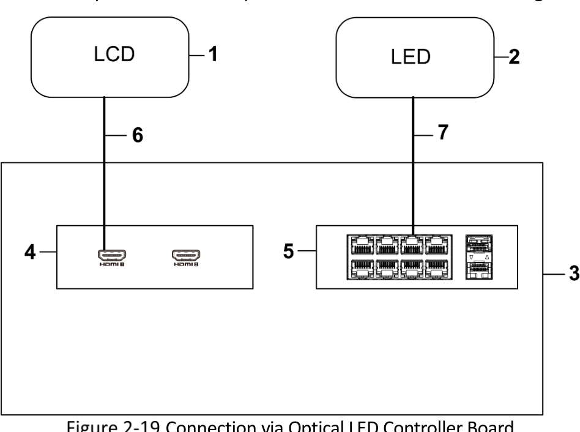
*Figure 2-19 — Connection via Optical LED Controller Board*

**Legend:** 1. LCD screen · 2. LED display · 3. Device · 4. HDMI output board · 5. Optical LED controller board · 6. HDMI cable · 7. Ethernet cable

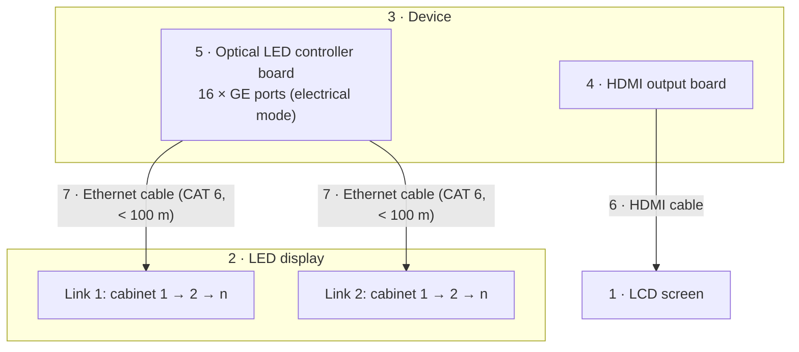
```mermaid
graph TD
    LCD["1 · LCD screen"]
    subgraph DEV["3 · Device"]
        HOB["4 · HDMI output board"]
        OLCB["5 · Optical LED controller board<br/>16 × GE ports (electrical mode)"]
    end
    subgraph LED["2 · LED display"]
        L1["Link 1: cabinet 1 → 2 → n"]
        L2["Link 2: cabinet 1 → 2 → n"]
    end

    HOB -->|"6 · HDMI cable"| LCD
    OLCB -->|"7 · Ethernet cable (CAT 6, < 100 m)"| L1
    OLCB -->|"7 · Ethernet cable (CAT 6, < 100 m)"| L2
```

#### B. Connect a Remote LED Display via External LED Controller

**Applicable Scenario**

Use a fiber optic connection between the device (equipped with an optical LED controller board) and an external LED controller to extend the signal transmission distance when the LED display is far from the device (**> 100 meters**). Ensure the number of Ethernet ports on the external LED controller is not less than the number required for the LED display's daisy-chained links.

> [!IMPORTANT]
> - The optical ports and electrical ports on the optical LED controller board are **mutually exclusive** and cannot be used simultaneously.
> - Only external LED controllers with **16 or 24 network ports** are supported.

**Steps**

1. Prepare one LED controller equipped with optical ports.
2. Based on the site layout, divide the LED cabinets into several daisy-chained links. Each link corresponds to one **DATA OUT** port on the LED controller.
3. Use Ethernet cables (CAT 6 recommended) to connect the DATA OUT ports of the external LED controller to the Ethernet ports of the first LED cabinet in each respective link. Daisy-chain the subsequent cabinets within each link using Ethernet cables.
4. Use a fiber optic patch cord to connect the optical port of the device's optical LED controller board to the optical port of the external LED controller.

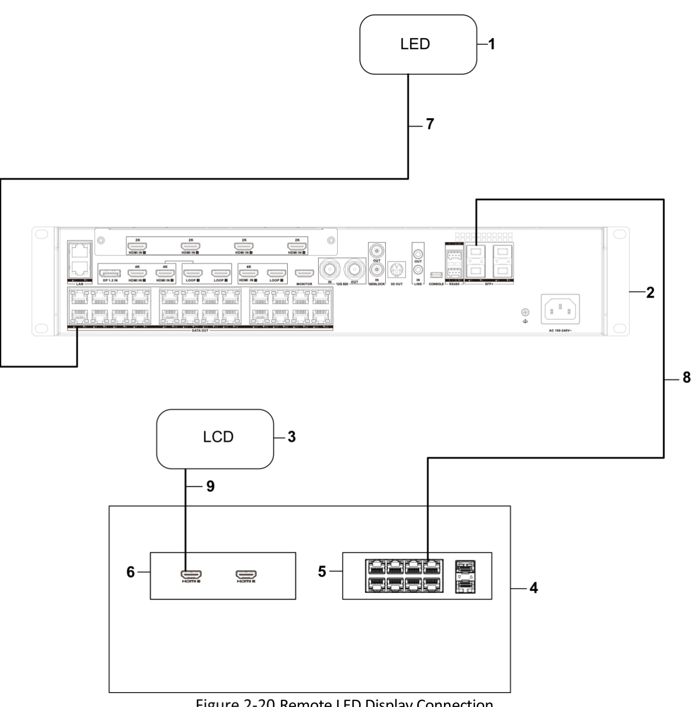
*Figure 2-20 — Remote LED Display Connection*

**Legend:** 1. LED display · 2. External LED controller · 3. LCD screen · 4. Device · 5. Optical LED controller board · 6. HDMI output board · 7. Ethernet cable · 8. Fiber optic patch cord · 9. HDMI cable

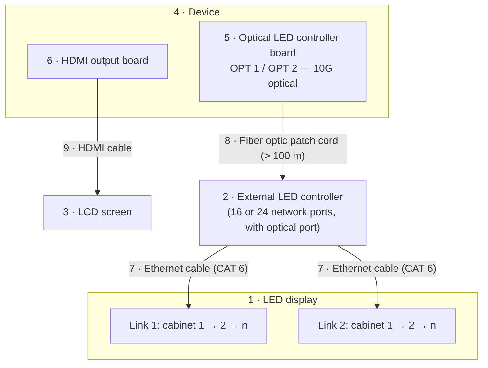
```mermaid
graph TD
    subgraph DEV["4 · Device"]
        OLCB["5 · Optical LED controller board<br/>OPT 1 / OPT 2 — 10G optical"]
        HOB["6 · HDMI output board"]
    end
    LCD["3 · LCD screen"]
    ELC["2 · External LED controller<br/>(16 or 24 network ports, with optical port)"]
    subgraph LED["1 · LED display"]
        L1["Link 1: cabinet 1 → 2 → n"]
        L2["Link 2: cabinet 1 → 2 → n"]
    end

    HOB -->|"9 · HDMI cable"| LCD
    OLCB -->|"8 · Fiber optic patch cord (> 100 m)"| ELC
    ELC -->|"7 · Ethernet cable (CAT 6)"| L1
    ELC -->|"7 · Ethernet cable (CAT 6)"| L2
```

## 2.7 Connect the Power Cord

Use a power cord to connect the power supply socket of the device to the power supply in the equipment room. **After the power cord is connected, the device is powered on.**

---

# Chapter 3 Configuration

## 3.1 Activate Device

You should activate the device before using it for the first time. You can use the **SADP client**, the **HiTools Delivery client**, or the **device web page** to activate the device.

> [!NOTE]
> To improve system security, it is highly recommended to change the password regularly. In order to protect your privacy and corporate data, and avoid network security issues, it is recommended to set a strong password that meets security requirements.

**Password requirements**

- Password should contain **8 to 16 characters** and at least **2** of the following types: digits, lowercase letters, uppercase letters, and special characters.
- Password **cannot** contain the user name, `123`, `admin` (case insensitive), 4 or more continuously ascending or descending digits, or 4 or more consecutive repeated characters.

**Activation method overview (graph)**

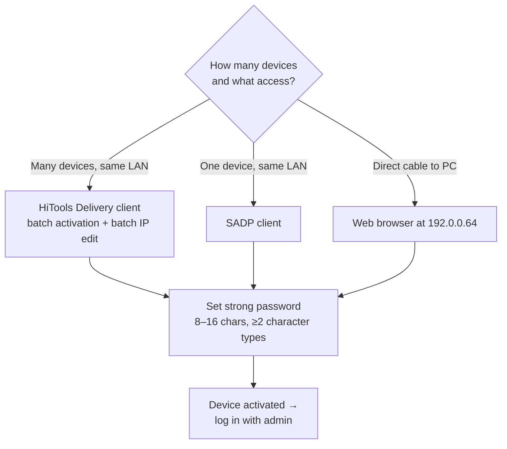
```mermaid
graph TD
    A{"How many devices<br/>and what access?"}
    A -->|"Many devices, same LAN"| H["HiTools Delivery client<br/>batch activation + batch IP edit"]
    A -->|"One device, same LAN"| S["SADP client"]
    A -->|"Direct cable to PC"| W["Web browser at 192.0.0.64"]
    H --> P["Set strong password<br/>8–16 chars, ≥2 character types"]
    S --> P
    W --> P
    P --> DONE["Device activated →<br/>log in with admin"]
```

### Activate Devices via HiTools Delivery Client

1. Connect all devices and the computer to the same LAN, ensuring they are on the same IP subnet.
2. Install and launch the **HiTools Delivery** client on the computer.
3. Navigate to **Device Management → Current Subnet**, and click **Refresh**.
4. Select the inactive devices, set the activation password, confirm the password, and click **Activation**.

   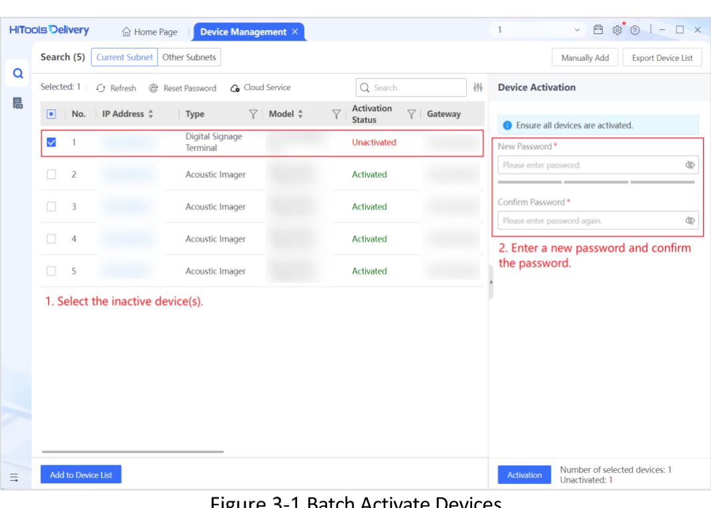
   *Figure 3-1 — Batch Activate Devices*

5. Edit device IP addresses in batch:
   1. Check multiple activated devices.
   2. Choose one of the following methods to set IP addresses:
      - **Manual assignment:** set the start IP address, port No., IPv4 subnet mask, IPv4 gateway, etc., and the selected devices will be automatically assigned increasing IP addresses.
      - **Dynamic acquisition:** check **Enable DHCP** to assign dynamic IP addresses.
   3. Enter the admin password and click **OK**.

   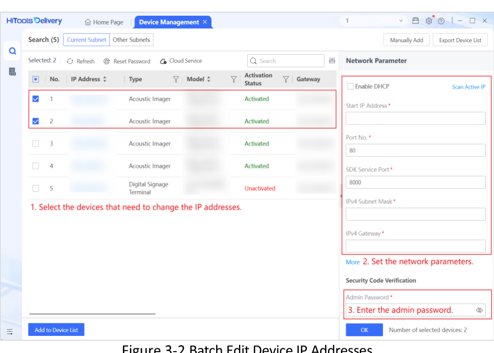
   *Figure 3-2 — Batch Edit Device IP Addresses*

### Activate the Device via SADP Client

1. Connect the device and computer to the same LAN. Make sure the device and computer are in the same network segment.
2. Download and install the **SADP** client on the computer.
3. Open the SADP client.
4. Select the device that is not activated, enter the activation password and confirm it, and click **Activate**.

   > [!NOTE]
   > If the device cannot be found, you can restart the SADP client.

   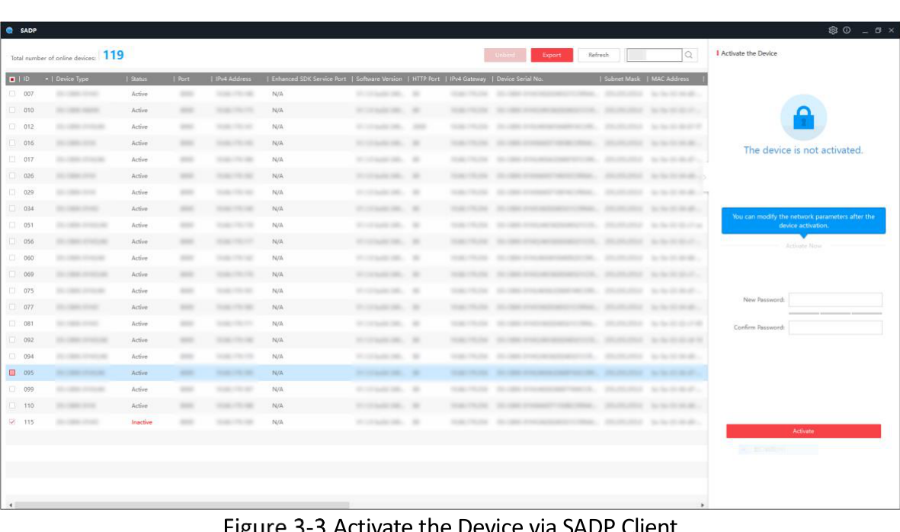
   *Figure 3-3 — Activate the Device via SADP Client*

5. View the device IP address in the SADP client and enter the device IP address in the computer browser.

### Activate the Device via Web Browser

1. Use a network cable to connect a computer to the device.
2. Set the computer IP address to any IP address in the range **192.0.0.2 to 192.0.0.253** (excluding `192.0.0.64`) and set the computer gateway address to `192.0.0.1`.

   > [!NOTE]
   > By default, the device IP address is `192.0.0.64` and the gateway address is `192.0.0.1`.

3. Enter `192.0.0.64` in the computer browser to enter the device activation page.
4. Set the activation password, and then click **Activate**.

   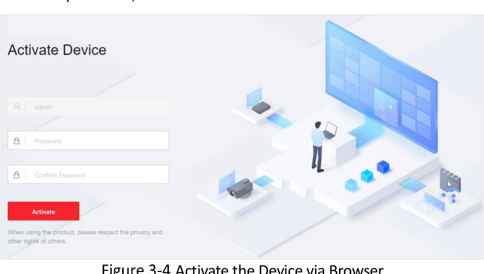
   *Figure 3-4 — Activate the Device via Browser*

## 3.2 More Configuration

Scan the QR code below to view the user manual to configure the device.

*Figure 3-5 — User Manual*

> [!NOTE]
> Obtaining the manual requires network data traffic. It is recommended to be performed in a Wi-Fi environment.

---

## Appendix — Figure Index

| File | Figure | Source page |
| --- | --- | --- |
| `images/fig-01-2u-front-panel.png` | Figure 1-1 2U Device Front Panel | p.8 |
| `images/fig-02-4u-front-panel.png` | Figure 1-2 4U Device Front Panel | p.9 |
| `images/fig-03-2u-rear-panel.png` | Figure 1-3 2U Device Rear Panel | p.10 |
| `images/fig-04-4u-rear-panel.png` | Figure 1-4 4U Device Rear Panel | p.11 |
| `images/fig-05-main-control-board.png` | Figure 1-5 Main Control Board | p.12 |
| `images/fig-06-input-boards.png` | Figure 1-6 Input Boards | p.13 |
| `images/fig-07-output-boards.png` | Figure 1-7 Output Boards | p.14 |
| `images/fig-08-factory-config-2u.png` | Figure 2-1 Factory Configuration of 2U Device | p.18 |
| `images/fig-09-factory-config-4u.png` | Figure 2-2 Factory Configuration of 4U Device | p.18 |
| `images/fig-10-remove-blank-panels.png` | Figure 2-3 Remove Blank Panels | p.19 |
| `images/fig-11-install-two-boards.png` | Figure 2-4 Install Two Boards | p.20 |
| `images/fig-12-remove-blank-panel.png` | Figure 2-5 Remove Blank Panel | p.21 |
| `images/fig-13-install-three-service-boards.png` | Figure 2-6 Install Three Service Boards | p.21 |
| `images/fig-14-remove-power-panel-screws.png` | Figure 2-7 Remove Power Panel Fixing Screws | p.22 |
| `images/fig-15-remove-power-panel.png` | Figure 2-8 Remove Power Panel | p.22 |
| `images/fig-16-remove-power-filler-panel.png` | Figure 2-9 Remove Power Filler Panel | p.23 |
| `images/fig-17-install-power-module.png` | Figure 2-10 Install Power Module | p.23 |
| `images/fig-18-install-power-panel.png` | Figure 2-11 Install Power Panel | p.24 |
| `images/fig-19-install-4u-in-rack.png` | Figure 2-12 Install the 4U Device in the Rack | p.24 |
| `images/fig-20-ground-wire-busbar.png` | Figure 2-13 Connect the Ground Wire to the Grounding Busbar | p.25 |
| `images/fig-21-ground-wire-electrode.png` | Figure 2-14 Connect the Ground Wire to the Grounding Electrode | p.26 |
| `images/fig-22-connection-external-led-controller.png` | Figure 2-15 Connection via External LED Controller | p.27 |
| `images/fig-23-connection-electrical-led-controller-board.png` | Figure 2-16 Connection via Electrical LED Controller Board | p.28 |
| `images/fig-24-connection-media-converters.png` | Figure 2-17 Connection via Media Converters | p.30 |
| `images/fig-25-connection-optical-switches.png` | Figure 2-18 Connection via Optical Switches | p.31 |
| `images/fig-26-connection-optical-led-controller-board.png` | Figure 2-19 Connection via Optical LED Controller Board | p.32 |
| `images/fig-27-remote-led-display-connection.png` | Figure 2-20 Remote LED Display Connection | p.34 |
| `images/fig-28-hitools-batch-activate.png` | Figure 3-1 Batch Activate Devices | p.36 |
| `images/fig-29-hitools-batch-edit-ip.png` | Figure 3-2 Batch Edit Device IP Addresses | p.37 |
| `images/fig-30-sadp-activate.png` | Figure 3-3 Activate the Device via SADP Client | p.38 |
| `images/fig-31-web-activate.png` | Figure 3-4 Activate the Device via Browser | p.38 |
| `images/fig-32-user-manual-qr.png` | Figure 3-5 User Manual (QR code) | p.39 |

---

© Hangzhou Hikvision Digital Technology Co., Ltd. All rights reserved. Legal information, disclaimers, and intellectual property notices from pages I–II of the original PDF apply to this converted document.
