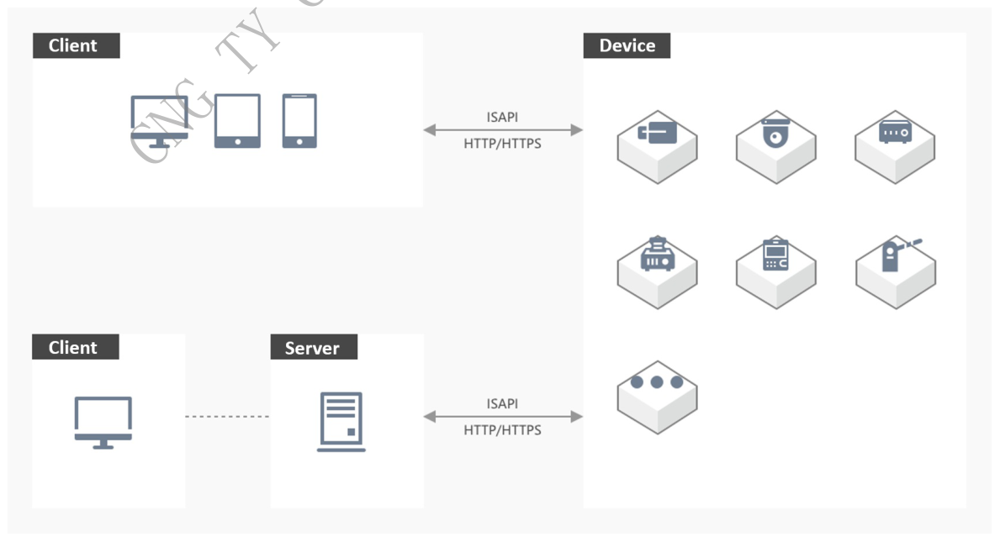
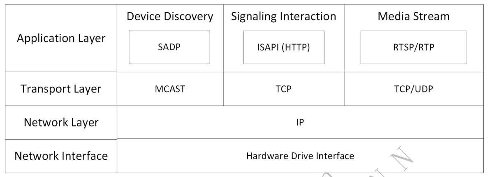

# 2. Overview

> Part of the **ISAPI — Videowall Controller** developer guide. See [README.md](README.md) for the full index.

## Contents

- [2.1 Introduction](#21-introduction)
  - [2.1.1 Application Scenario](#211-application-scenario)
  - [2.1.2 Layers in the Network Model](#212-layers-in-the-network-model)
- [2.2 Product Scope](#22-product-scope)
- [2.3 Terms And Definitions](#23-terms-and-definitions)
  - [2.3.2 Device Operation Log](#232-device-operation-log)
- [2.4 Symbols And Acronyms](#24-symbols-and-acronyms)
- [2.5 Update History](#25-update-history)

---

### 2.1 Introduction

Intelligent Security API (hereinafter referred to as ISAPI) is an application layer protocol based on HTTP (Hypertext Transfer Protocol) and adopts the REST (Representational State Transfer) architecture for communication between security devices (cameras, DVRs, NVRs, etc.) and the platform or client software. Since established in 2013, ISAPI has included more than 11,000 APIs for different functions, including device management, vehicle recognition, parking lot management, intelligent facial application, access control management, interrogation management, and recording management. It is applicable to industries such as traffic, fire protection, education, and security inspection.

#### 2.1.1 Application Scenario

When you integrate devices via ISAPI, the device acts as the server to listen on the fixed port and the user's application acts as the client to actively log in to the device for communication. To achieve the above goals, the device should be configured with a fixed IP address and the requests from the client can reach the server.

*Figure 2 — source page 3*

#### 2.1.2 Layers in the Network Model

ISAPI is an application layer protocol based on HTTP, thereby it inherits all specifications and properties from HTTP. Protocols frequently used along with ISAPI include SADP (Search Active Device Protocol) based on multicast for discovering and activating devices, RTSP (Real-Time Streaming Protocol) based on TCP/UDP for live view and video playback of devices, etc.

*Figure 3 — source page 4*

### 2.2 Product Scope

Controller

Videowall Controller

DS-C30S-02DPI/4K, DS-C30S-02HI/4K, DS-C30S-02HO/4K, DS-C30S-04DI, DS-C30S-04DO, DS-C30S-04HI, DS-C30S-04HO, DS-C30S-04VI, DS-C30S-DEC, DS-C30S-L104, DS-C30S-MCU, DS-C30S-PWR, DS-C30S-S11, DS-C30S-S23, DS-C30S-SW, DS-C60S-02DPI/4K , DS-C60S-02HI/4K, DS-C60S-02HO/4K, DS-C60S-04DI, DS-C60S-04DO, DS-C60S-04HI, DS-C60S-04HO, DS-C60S-16NO/2FO, DS-C60S-20NO, DS-C60S-DEC, DS- C60S-MCU, DS-C60S-PRE, DS-C60S-S6, DS-C66S-02DPI/4K, DS-C66S-02HI/4K, DS-C66S-02HO/4K, DS- C66S-04DI, DS-C66S-04DO, DS-C66S-04HI, DS-C66S-04HO, DS-C66S-04SDI/4K, DS-C66S-16NO/2FO, DS- C66S-20NO, DS-C66S-DEC, DS-C66S-MCU, DS-C66S-PRE, DS-C66S-PWR, DS-C66S-S12, DS-C66S-S6

### 2.3 Terms And Definitions

#### 2.3.2 Device Operation Log

Logs generated during the operation of the device's firmware. These logs are recorded in log files or log systems in text format, and are primarily used by device developers and maintenance personnel to identify device issues. #

### 2.4 Symbols And Acronyms

admin: administrator HC: Connect Mobile Client HPP: Partner Pro NVR: Network Video Recorder IPC: IP Camera

### 2.5 Update History

No update record

---

← [1. Reading Guide](01-reading-guide.md) · [Index](README.md) · [3. ISAPI Framework](03-isapi-framework.md) →
