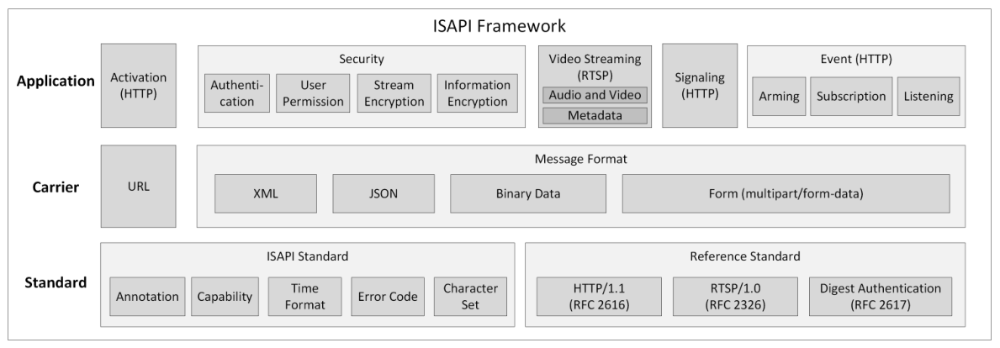
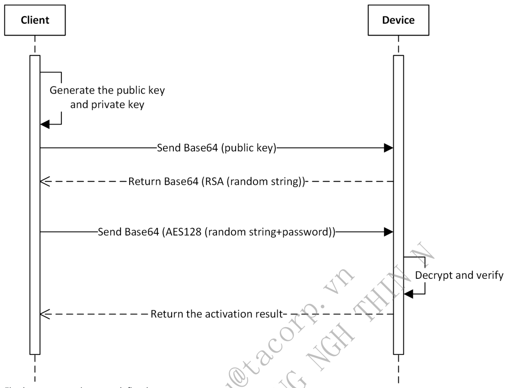
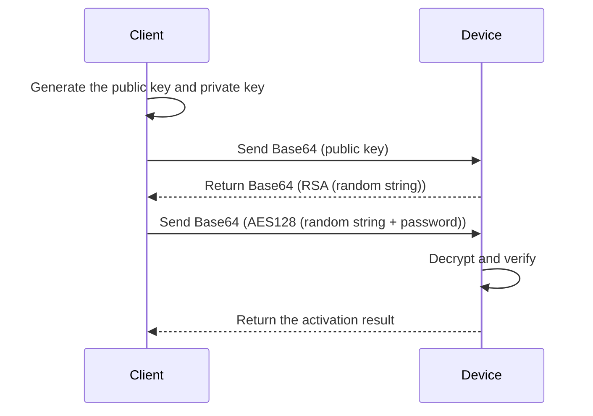

# 3. ISAPI Framework

> Part of the **ISAPI — Videowall Controller** developer guide. See [README.md](README.md) for the full index.

## Contents

- [3.1 Overview](#31-overview)
- [3.2 Activation](#32-activation)
- [3.3 Security Mechanism](#33-security-mechanism)
  - [3.3.1 Authentication](#331-authentication)
  - [3.3.2 User Permission](#332-user-permission)
  - [3.3.3 Information Encryption](#333-information-encryption)
- [3.4 Video Streaming](#34-video-streaming)
  - [3.4.1 Audio and Video Stream](#341-audio-and-video-stream)
  - [3.4.2 Metadata](#342-metadata)

---

### 3.1 Overview

*Figure 4 — source page 5*

**Notes:**

In general, ISAPI refers to the communication protocol based on the HTTP standard. As ISAPI is usually used along with RTSP (Real-Time Streaming Protocol), the RTSP standard is brought into the ISAPI system. The metadata scheme for transmitting additional information of the stream is extended based on the RTSP standard to transmit the video stream and the structured intelligent information of the stream simultaneously. It is compatible with the RTSP standard.

### 3.2 Activation

The purpose of activation is to ensure that the user can set the password for the device and the password meets the security requirement. After the device is activated, you can use the related functions. ISAPI is a communication protocol running on the application layer. When activating the device via ISAPI, you should know the device's IP address and make sure that the device is connected to the client. The web application built in the device supports activating the device via ISAPI. When you enter the device's IP address in the address bar of the web browser on the PC, you can activate the device according to the activation guide. If you want to activate the device on your own application, you need to integrate the activation function via ISAPI. The API calling flow and related APIs are shown below.

*Figure 5 — source page 6*

**Figure 5 redrawn — Device activation handshake**

Firstly, two operations are defined:

bytesToHexstring: it is used to convert a byte array (the length is N) to a hexadecimal string (the length is 2N). For example, `127,10,23` -> `7f0a17` hexStringToBytes: it is used to convert a hexadecimal string (the length is 2N) to a byte array (the length is N). For example, `7f0a17` -> `127,10,23`

1. The client generates a public and private key pair (1024 bits), and gets the 128-byte modulus in the public key

(hereinafter referred to as public key modulus). If the length is longer than 128, the leading 0 needs to be removed.

2. The client converts the public key modulus to a 256-byte public key string via bytesToHexstring and sends the

public key string to the device in XML message (related URI: `POST /ISAPI/Security/challenge`) after being encoded by Base64.

3. The device parses the request to obtain a 256-byte public key string decoded by Base64 and converts it to a 128-

byte public key modulus via hexStringToBytes. The complete public key is the combination of obtained public key modulus and public exponent (the default value is `'010001'`).

4. The device generates a 32-byte hexadecimal random string, calls the RSA API to encrypt the random string with

the private key, converts the encrypted data to a string via bytesToHexstring, encodes the string by Base64, and then sends it to the client.

5. The client decodes the string from the device by Base64, converts it via hexStringToBytes to get the encrypted data,

decrypts the encrypted data with the private key via RSA to obtain a 32-byte hexadecimal random string, converts the obtained string via hexStringToBytes to get a 16-byte AES key. Then the client uses the AES key to encrypt the `"string consisting of the first 16 characters of the random string and the real password"` by AES128 ECB mode (with zero-padding method) to get a ciphertext, and converts the ciphertext via bytesToHexstring, encodes it by Base64, and sends it to the device in XML message (related URI: `PUT /ISAPI/System/activate`). Note: If the first 16 characters of the random string are `aaaabbbbccccdddd` and the real password is `Abc12345`, the data before encryption is `aaaabbbbccccddddAbc12345`. This can ensure that the client uses the random string as the key for encryption.

6. The device decodes the string by Base64, converts it via hexStringToBytes to get the ciphertext, uses the AES key to

decrypt the ciphertext by AES128 ECB mode, and gets the real password via removing the first 16 characters.

7. The device verifies the password and returns the activation result.

**Notes:**

You can get the device's activation status by calling the URI `GET /SDK/activateStatus` which requires no authentication. Devices also support to be activated via SADP (Search Active Device Protocol) which is based on the communication protocol of the data link layer. With SADP, you do not have to know the IP address of the device but need to ensure that the device and the application running SADP are connected to the same router. SADP also supports discovering devices in the LAN, changing the password of the devices, and so on. The HCSadpSDK is provided for SADP integration, including the developer guide, plug-in, and sample demo which can be used as a simple SADP tool.

### 3.3 Security Mechanism

#### 3.3.1 Authentication

When the client applications send requests to devices, they need to use digest authentication (see details in RFC 7616) for identity authentication. Currently, all mainstream request class libraries of HTTP have encapsulated digest authentication. See details in Authentication of Quick Start Guide.

#### 3.3.2 User Permission

There are three kinds of users with different permissions for access control and management. Administrator: Has the permission to access all supported resources and should keep activated all the time. It is also known as "admin". Operator: Has the permission to access general resources and a part of advanced resources. Normal User: Only has the permission to access general resources.

#### 3.3.3 Information Encryption

During ISAPI integration, the HTTPS service of devices is enabled by default. When the client applications communicate with devices via HTTPS, the information can be transmitted securely.

### 3.4 Video Streaming

#### 3.4.1 Audio and Video Stream

ISAPI supports getting and setting stream media parameters of the device, such as video resolution, encoding format, and stream. Cameras support standard RTSP (Real-Time Streaming Protocol, see details in RFC 7826). Client applications can get the stream from devices via RTSP. For details about real-time streaming and video playback, refer to Real-Time Live View and Playback in Quick Start Guide.

#### 3.4.2 Metadata

The metadata is the structured intelligent information generated by intelligent devices. When the client applications get the audio and/or video stream from devices via RTSP, the metadata will be returned by the device at the same time. For example, to display the face target frame, face information, vehicle target frame, license plate number, vehicle information, and other information on the video stream, the client applications can overlay the above information on the video image. Before using the metadata, you need to enable the metadata function of the device and then get the stream from the device via RTSP. Some devices support subscribing to the metadata by type. For details about the process of integrating the metadata function, refer to Metadata Management.

---

← [2. Overview](02-overview.md) · [Index](README.md) · [4. Quick Start Guide](04-quick-start-guide.md) →
