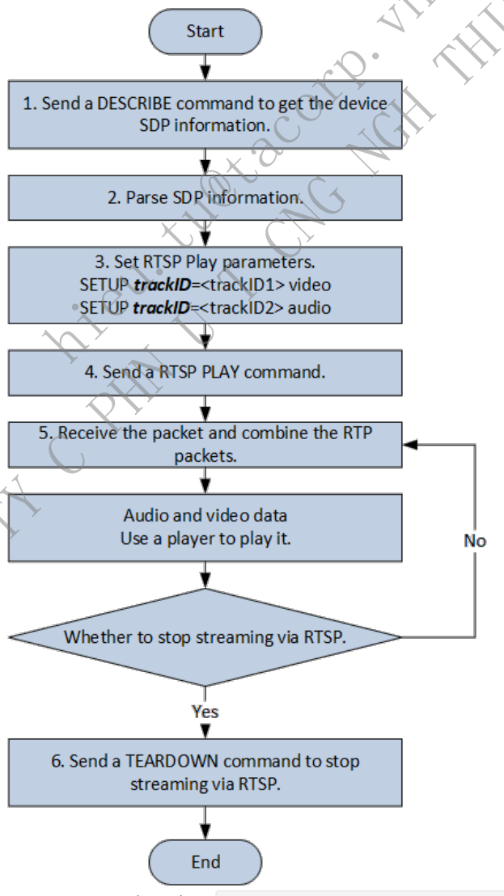
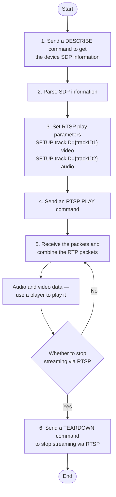
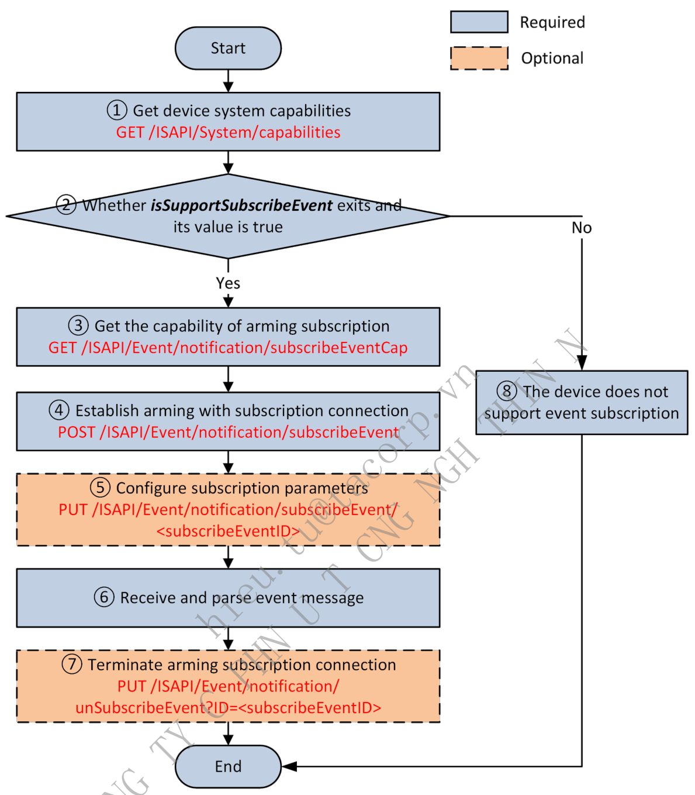
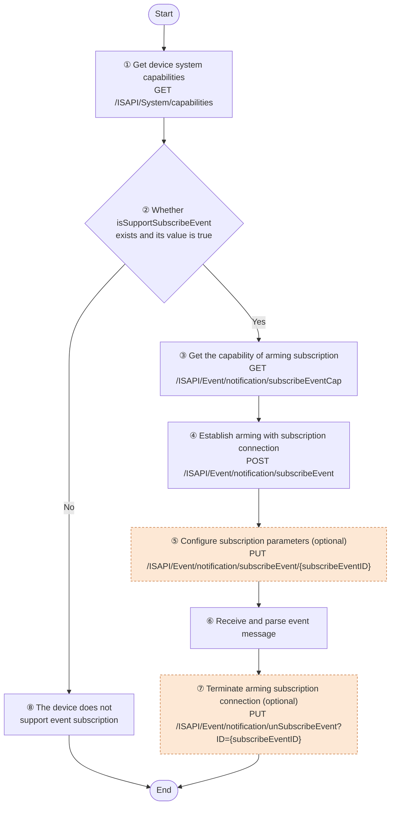
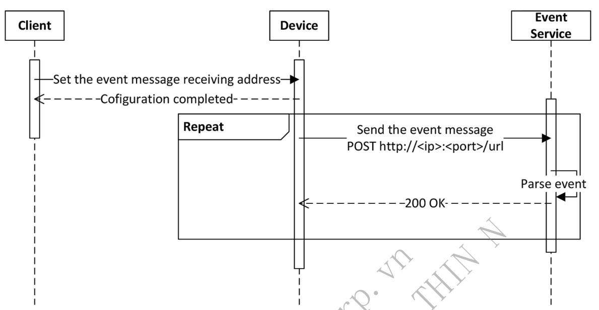
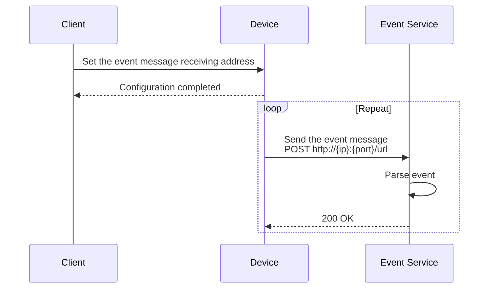
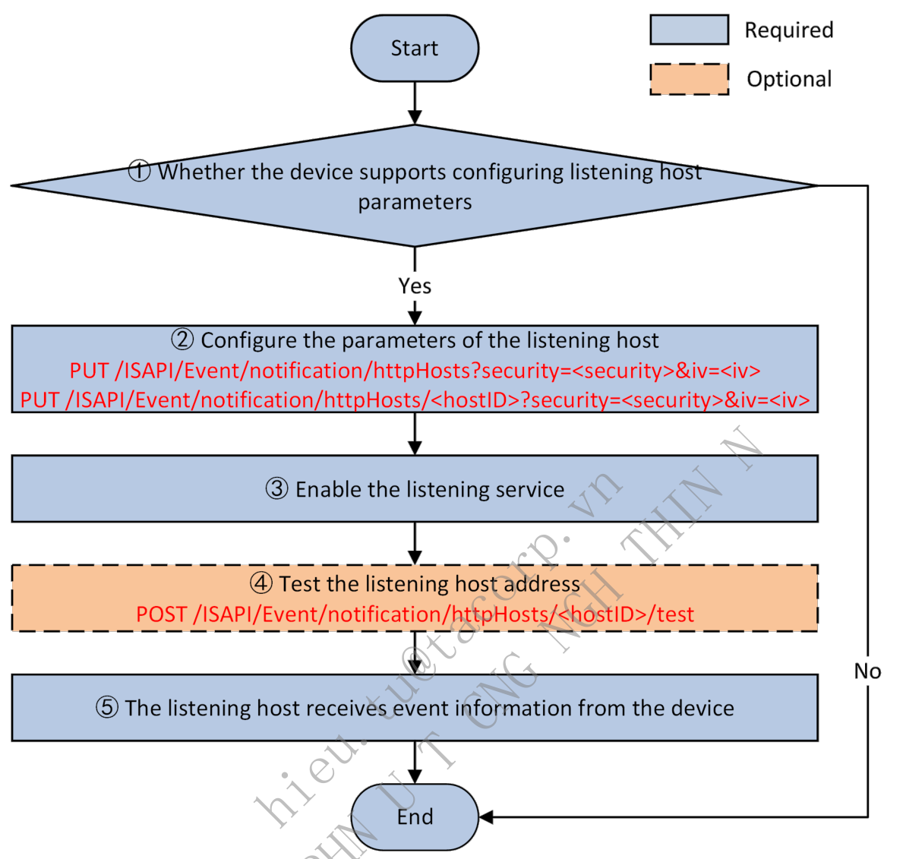
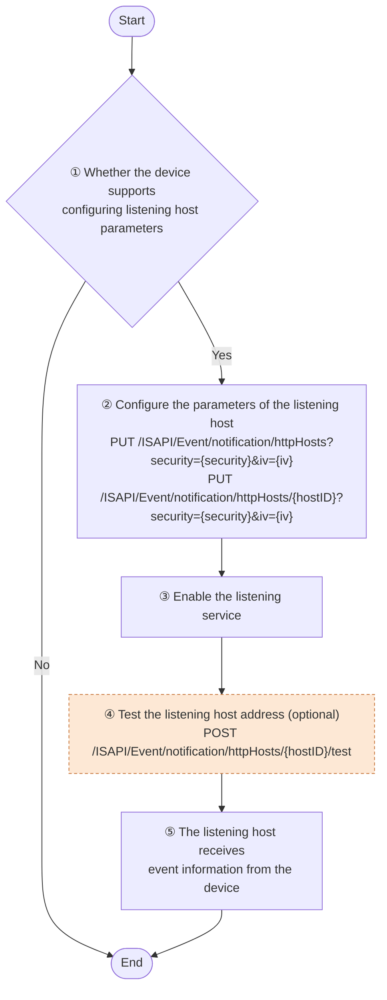

# 4. Quick Start Guide

> Part of the **ISAPI — Videowall Controller** developer guide. See [README.md](README.md) for the full index.

## Contents

- [4.1 Authentication](#41-authentication)
  - [4.1.1 C/C++ (libcurl)](#411-cc-libcurl)
  - [4.1.2 C# (WebClient)](#412-c-webclient)
  - [4.1.3 Java (HttpClient)](#413-java-httpclient)
  - [4.1.4 Python (requests)](#414-python-requests)
- [4.2 Message Parsing](#42-message-parsing)
  - [4.2.1 Message Format](#421-message-format)
  - [4.2.2 Annotation](#422-annotation)
  - [4.2.3 Capability Set](#423-capability-set)
  - [4.2.4 Time Format](#424-time-format)
  - [4.2.5 Character Set](#425-character-set)
  - [4.2.6 Error Processing](#426-error-processing)
- [4.3 Real-Time Live View](#43-real-time-live-view)
  - [4.3.1 Introduction to the Function](#431-introduction-to-the-function)
  - [4.3.2 API Calling Flow](#432-api-calling-flow)
  - [4.3.3 Example](#433-example)
- [4.4 Playback](#44-playback)
  - [4.4.1 Introduction to the Function](#441-introduction-to-the-function)
  - [4.4.2 API Calling Flow](#442-api-calling-flow)
  - [4.4.3 Example](#443-example)
- [4.5 Event Uploading](#45-event-uploading)
  - [4.5.1 Arming](#451-arming)
  - [4.5.2 Listening](#452-listening)

---


### 4.1 Authentication

When the client applications send requests to the devices, they need to use digest authentication (see details in RFC

7616. for identity authentication.

Client applications only need to call APIs of the class library to implement the digest authentication. The sample code is shown below.

#### 4.1.1 C/C++ (libcurl)

```text
// #include <curl/curl.h>
// Callback Function
static size_t OnWriteData(void* buffer, size_t size, size_t nmemb, void* lpVoid)
{
    std::string* str = dynamic_cast<std::string*>((std::string *)lpVoid);
    if( NULL == str || NULL == buffer )
    {
        return -1;
    }
    char* pData = (char*)buffer;
    str->append(pData, size * nmemb);
    return nmemb;
}
std::string strUrl = "http://192.168.18.84:80/ISAPI/System/deviceInfo";
std::string strResponseData;
CURL *pCurlHandle = curl_easy_init();
curl_easy_setopt(pCurlHandle, CURLOPT_CUSTOMREQUEST, "GET");
curl_easy_setopt(pCurlHandle, CURLOPT_URL, strUrl.c_str());
// Set the user name and password
curl_easy_setopt(pCurlHandle, CURLOPT_USERPWD, "admin:admin12345");
// Set the authentication method to the digest authentication
curl_easy_setopt(pCurlHandle, CURLOPT_HTTPAUTH, CURLAUTH_DIGEST);
// Set the callback function
curl_easy_setopt(pCurlHandle, CURLOPT_WRITEFUNCTION, OnWriteData);
// Set the parameters of the callback function to get the returned information
curl_easy_setopt(pCurlHandle, CURLOPT_WRITEDATA, &strResponseData);
// Timeout settings for receiving the data. If receiving data is not completed within 5 seconds, the application will exit directly
curl_easy_setopt(pCurlHandle, CURLOPT_TIMEOUT, 5);
// Set the redirection times to avoid too many redirections
curl_easy_setopt(pCurlHandle, CURLOPT_MAXREDIRS, 1);
// Connection timeout duration. If the duration is too short, the client application will be disconnected before the data request sent by the application
reaches the device
curl_easy_setopt(pCurlHandle, CURLOPT_CONNECTTIMEOUT, 5);
CURLcode nRet = curl_easy_perform(pCurlHandle);
if (0 == nRet)
{
    // Output the received message
    std::cout << strResponseData << std::endl;
}
curl_easy_cleanup(pCurlHandle);
```

#### 4.1.2 C# (WebClient)

```text
// using System.Net;
// using System.Net.Security;
try
{
    string strUrl = "http://192.168.18.84:80/ISAPI/System/deviceInfo";
    WebClient client = new WebClient();
    // Set the user name and password
    client.Credentials = new NetworkCredential("admin", "admin12345");
    byte[] responseData = client.DownloadData(strUrl);
    string strResponseData = Encoding.UTF8.GetString(responseData);
    // Output received information
    Console.WriteLine(strResponseData);
}
catch (Exception ex)
{
    Console.WriteLine(ex.Message);
}
```

#### 4.1.3 Java (HttpClient)

```text
// import org.apache.commons.httpclient.HttpClient;
String url = "http://192.168.18.84:80/ISAPI/System/deviceInfo";
HttpClient client = new HttpClient();
// Set the user name and password
UsernamePasswordCredentials creds = new UsernamePasswordCredentials("admin", "admin12345");
client.getState().setCredentials(AuthScope.ANY, creds);
GetMethod method = new GetMethod(url);
method.setDoAuthentication(true);
int statusCode = client.executeMethod(method);
byte[] responseData = method.getResponseBodyAsString().getBytes(method.getResponseCharSet());
String strResponseData = new String(responseData, "utf-8");
method.releaseConnection();
// Output received information
System.out.println(strResponseData);
```

#### 4.1.4 Python (requests)

```text
# - *- coding: utf-8 -*-
import requests
request_url = 'http://192.168.18.84:80/ISAPI/System/deviceInfo'
# Set the authentication information
auth = requests.auth.HTTPDigestAuth('admin', 'admin12345')
# Send the request and receive response
response = requests.get(request_url, auth=auth)
# Output response content
print(response.text)
```

### 4.2 Message Parsing

#### 4.2.1 Message Format

During the process of communication and interaction via ISAPI, the request and response messages are often text data in XML or JSON format. Besides that, the data of firmware packages and configuration files is in binary format. A request can also be in form format with multiple formats of data (multipart/form-data).

##### 4.2.1.1 XML

Generally, the `Content-Type` in the headers of the HTTP request is `application/xml; charset="UTF-8"`. Request and response messages in XML format are all encoded with UTF-8 standards in ISAPI. The namespace `http://www.isapi.org/ver20/XMLSchema` and ISAPI version number `2.0` of XML messages are configured by default, see the example below.

```xml
<?xml version="1.0" encoding="UTF-8"?>
<NodeList xmlns="http://www.isapi.org/ver20/XMLSchema" version="2.0">
  <Node>
    <id>1</id>
    <enabled>true</enabled>
    <nodeName>nodeName</nodeName>
    <level>level1</level>
  </Node>
</NodeList>
```

##### 4.2.1.2 JSON

The `Content-Type` in the headers of the HTTP request is often `application/json`. To distinguish between APIs with XML messages and those with JSON messages, ISAPI adds the query parameter format=json to all request URLs with JSON messages, e.g., `http://192.168.1.1:80/ISAPI/System/Sensor/thermometrySensor?format=json` . Messages of request URLs without the query parameter format=json are usually in XML format. However, there may be some exceptions, and the message format is subject to the API definition. Request and response messages in JSON format are all encoded by UTF-8 in ISAPI.

##### 4.2.1.3 Binary Data

For the firmware and configuration files, the `Content-Type` in the header of an HTTP request is often `application/octet-stream`.

##### 4.2.1.4 Form (multipart/form-data)

When multiple pieces of data are submitted at the same time in an ISAPI request (e.g., the person information and face picture need to be submitted at the same time when a face record is added to the face picture library), the `Content-`

| d is added to the face picture library), the C | Content- |  |
| --- | --- | --- |
| multipart/form-data, boundary=AaB03x | x, where the |  |

`Type` in the header of the corresponding HTTP request is usually `multipart/form-data, boundary=AaB03x`, where the

| T | Type |
| --- | --- |

boundary is a variable used to separate the entire HTTP body into multiple units and each unit is a piece of data with its own headers and body. In `Content-Disposition` of form unit headers, the `name` property refers to the form unit name, which is required for all form units; the `filename` property refers to the file name of form unit body, which is required only when the form unit body is a file. In headers of form units, `Content-Length` refers to the body length, which starts after CRLF(`\r\n`) and ends before two hyphens (`--`) of next form. There should be a CRLF used as the delimiter of two form units before two hyphens (`--`), and the `Content-Length` of previous form unit does not include the CRLF length. For the detailed format description, refer to RFC 1867 (Form-Based File Upload in HTML). Pay attention to two hyphens (`--`) before and after the boundary.

**Notes**

In RFC specifications, it is strongly recommended to contain the field `Content-Length` in the entity header, and there is no requirement that the field `Content-Length` should be contained in the header of each form element. The absence of field `Content-Length` in the header should be considered when the client and device programs parse the form data. To avoid the conflict between message content and boundary value, it is recommended to use a longer and more complex string as the boundary value.

The example of ISAPI form data submitted by a client to a device is as follows.

```http
POST /ISAPI/Intelligent/FDLib/pictureUpload
Content-Type: multipart/form-data; boundary=e5c2f8c5461142aea117791dade6414d
Content-Length: 56789
--e5c2f8c5461142aea117791dade6414d
Content-Disposition: form-data; name="PictureUploadData";
Content-Type: application/xml
Content-Length: 1234
<PictureUploadData/>
--e5c2f8c5461142aea117791dade6414d
Content-Disposition: form-data; name="face_picture"; filename="face_picture.jpg";
Content-Type: image/jpeg
Content-Length: 34567
Picture Data
--e5c2f8c5461142aea117791dade6414d--
```

The example of ISAPI form data responded from a device to a client is as follows. In ISAPI messages, when there are multiple form units, three nodes (`pid`, `contentid`, and `filename`) are used for linking form units. The corresponding relations are as follows:

| Node Name | Form Field | Description |
| --- | --- | --- |
| pid | name | pid in XML/JSON messages corresponds to the name property of Content-Disposition in form headers. |
| contentid | Content- ID | contentid in XML/JSON messages corresponds to Content-ID in form headers. |
| filename | filename | filename in XML/JSON messages corresponds to filename property of Content-Disposition in form headers. |

```http
HTTP/1.1 200 OK
Content-Type: multipart/form-data; boundary=136a73438ecc4618834b999409d05bb9
Content-Length: 56789
--136a73438ecc4618834b999409d05bb9
Content-Disposition: form-data; name="mixedTargetDetection";
Content-Type: application/json
Content-Length: 811
{
    "ipAddress": "172.6.64.7",
    "macAddress": "01:17:24:45:D9:F4",
    "channelID": 1,
    "dateTime": "2009-11-14T15:27+08:00",
    "eventType": "mixedTargetDetection",
    "eventDescription": "Mixed target detection",
    "deviceID": "123456789",
    "CaptureResult": [{
        "targetID": 1,
        "Human": {
            "Rect": {
                "height": 1.0,
                "width": 1.0,
                "x": 0.0,
                "y": 0.0
            },
            "contentID1": "humanImage", /*human body thumbnail*/
            "contentID2": "humanBackgroundImage", /*human body background picture*/
            "pId1": "9d48a26f7b8b4f2390c16808f93f3534", /*human body thumbnail ID */
            "pId2": "5EE7078E07BB47CF860DE8E4E9A85F28" /*ID of human body background picture*/
        }
    }]
}
--136a73438ecc4618834b999409d05bb9
Content-Disposition: form-data; name="9d48a26f7b8b4f2390c16808f93f3534"; filename="humanImage.jpg";
Content-Type: image/jpeg
Content-Length: 34567
Content-ID: humanImage
Picture Data
--136a73438ecc4618834b999409d05bb9
Content-Disposition: form-data; name="5EE7078E07BB47CF860DE8E4E9A85F28"; filename="humanBackgroundImage.jpg";
Content-Type: image/jpeg
Content-Length: 345678
Content-ID: humanBackgroundImage
Picture Data
--136a73438ecc4618834b999409d05bb9--
```

#### 4.2.2 Annotation

The field descriptions of ISAPI request and response messages are marked as annotations in the example messages as shown below.

```xml
<?xml version="1.0" encoding="UTF-8"?>
<NodeList xmlns="http://www.isapi.org/ver20/XMLSchema" version="2.0">
  <!--ro, req, object, node list, attr:version{req, string, version No., range:[,]}-->
  <Node>
    <!--ro, opt, object, node information-->
    <id>
      <!--ro, req, int, node No., range:[,], step:, unit:, unitType:-->1
    </id>
    <enabled>
      <!--ro, opt, bool, whether to enable-->true
    </enabled>
    <nodeName>
      <!--ro, req, string, node name, range:[1,32]-->test
    </nodeName>
    <level>
      <!--ro, opt, enum, level, subType:string,
      [level1#level 1,level2#level 2,level3#level 3]-->level1
    </level>
  </Node>
</NodeList>
{
    "name":  "test",
    /*ro, req, string, name, range:[1,32]*/
    "type":  "type1",
    /*ro, req, enum, type, subType:string, [type1#type 1,type2#type 2]*/
    "enabled":  true,
    /*ro, opt, bool, enable or not, desc:xxxxxxx*/
    "NodeList": {
    /*opt, object, node list, dep:and,{$.enabled,eq,true}*/
        "scene":  1,
        /*req, enum, scene, subType:int, [1#scene 1; 2#scene 2; 3#scene 3]*/
        "ID":  1
        /*req, int, No., range:[1,8], step:, unit:, unitType:*/
    }
}
```

Key annotations are shown in the table below.

| Annotation | Description | Remark |
| --- | --- | --- |
| ro | Attribute: Read- Only | This field can only be obtained and cannot be edited. |
| wo | Attribute: Write- Only | This field can only be edited and cannot be obtained. |
| req | Attribute: Required | This field is required for request messages sent to the device and response messages returned from the device. |
| opt | Attribute: Optional | This field is optional for request messages sent to the device and response messages returned from the device. |
| dep | Attribute: Dependent | This field is valid and required when specific conditions are satisfied. |
| object | Field Type: Object | The field of type object contains multiple sub-fields. |
| list | Field Type: List | The subType following it refers to the data type of sub-items in the list. |
| subType | Field Type: String | The range following it refers to the maximum and the minimum string size of the field. |
| int | Field Type: Int | The range following it refers to the maximum and the minimum value of the field. |
| float | Field Type: Float | The range following it refers to the maximum and the minimum value of the field. |
| bool | Field Type: Boolean | The value can be true or false. |
| enum | Field Type: Enumeration | The subType following it indicates that the enumerators are of type string or int. The [] following the subType contains all enumerators. |
| subType | Sub-Type of Field | When the type of field is list or enum, the value of subType is the data type of each sub-object. |
| desc | Field Description | The detailed description of the field. |

#### 4.2.3 Capability Set

ISAPI has designed capability sets for almost all functions, APIs, and fields. URLs for getting the capability set end with `/capabilities`. Some URLs may contain query parameters in the format: `/capabilities?format=json&type=xxx`. There are two types of fields in the capability message of ISAPI: whether the device supports a function and the value range of a field in an API. Whether the device supports a function: it is often in the format `isSupportXxxxxxxx`, which indicates that whether the device supports a function and a set of APIs for implementing this function. The capability message example in JSON format is shown below:

```json
{
    "isSupportMap":  true,
    /*ro, opt, bool, whether it supports the e-map function, desc:/ISAPI/SDT/Management/map/capabilities?format=json*/
    "isSupportAlgTrainResourceInfo":  true,
    /*ro, opt, bool, whether it supports only getting the resource information of the algorithm training platform,
desc:/ISAPI/SDT/algorithmTraining/ResourceInfo?format=json*/
    "isSupportAlgTrainAuthInfo":  true,
    /*ro, opt, bool, whether it supports ony getting the authorization information of the algorithm training platform,
desc:/ISAPI/SDT/algorithmTraining/SoftLock/AuthInfo?format=json*/
    "isSupportAlgTrainNodeList":  true,
    /*ro, opt, bool, whether it supports only getting the node information of the algorithm training platform, desc:/ISAPI/SDT/algorithmTraining/NodeList?
format=json*/
    "isSupportNAS":  true
    /*ro, opt, bool, whether it supports mounting and unmounting NAS, desc:/ISAPI/SDT/Management/NAS/capabilities?format=json*/
}
```

The capability message example in XML format is shown below:

```xml
<isSupportNetworkStatus>
    <!--ro, opt, bool, whether it supports searching the network status, desc: related API (/ISAPI/System/Network/status?format=json)-->true
</isSupportNetworkStatus>
```

The value range of the field: the maximum value, minimum value, the maximum size, the minimum size, options, and so on of each field of the API. The example of JSON format is shown below:

```json
{
    "boolType": {
        /*req, object, example of the capability of type bool*/
        "@opt": [true, false]
        /*req, array, options, subType: bool*/
    },
    "integerType": {
        /*req, object, example of the capability of type integer*/
        "@min": 0,
        /*ro, req, int, the minimum value*/
        "@max": 100
        /*ro, req, int, the maximum value*/
    },
    "stringType": {
        /*req, object, example of the capability of type string*/
        "@min": 0,
        /*ro, req, int, the minimum string size*/
        "@max": 32
        /*ro, req, int, the maximum string size*/
    },
    "enumType": {
        /*req, object, capability example of type enum*/
        "@opt": ["enum1", "enum2", "enum3"]
        /*req, array, options, subType: string*/
    }
}
```

The example of XML format is shown below:

```xml
<boolType opt="true,false" def="true">
    <!--ro, opt, bool, example of the capability of type bool-->true
</boolType>
<integerType min="0" max="100">
    <!--ro, opt, int, example of the capability of type int-->50
</integerType>
<stringType min="0" max="64">
    <!--ro, opt, string, example of the capability of type string-->test
</stringType>
<enumType opt="red,white,black" def="red">
    <!--ro, opt, string, example of the capability of type enum-->white
</enumType>
```

Note: For the same capability set, devices of different models and versions may return different results. The values shown in this document are only examples for reference. The capability set actually returned by the device takes precedence.

#### 4.2.4 Time Format

ISAPI adopts ISO 8601 Standard Time Format, which is the same as W3C Standard Date and Time Formats.

Format: `YYYY-MM-DDThh:mm:ss.sTZD`

```text
YYYY = the year consisting of four decimal digits
MM = the month consisting of two decimal digits (01-January, 02-February, and so forth)
DD = the day consisting of two decimal digits (01 to 31)
hh = the hour consisting of two decimal digits (00 to 23, a.m. and p.m. are not allowed)
mm = the minute consisting of two decimal digits (00 to 59)
ss = the second consisting of two decimal digits (00 to 59)
s = one or more digits representing the fractional part of a second
TZD = time zone identifier (Z or +hh:mm or -hh:mm)
```

Example: 2017-08-16T20:17:06.123+08:00 refers to 20:17:06.123 on August 16, 2017 (local time which is 8 hours ahead of UTC). The plus sign (+) indicates that the local time is ahead of UTC, and the minus sign (-) means that the local time is behind UTC. After the DST is enabled, the local time and time difference will change compared with UTC, and the values of related fields also need to be changed. Disabling the DST will bring into the opposite effect. Example: In 1986, the DST was in effect from May 4 at 2:00 a.m. (GMT+8). During the DST period, the clocks were moved one hour ahead, which means that there was one less hour on that day. When the DST ends at 2:00 a.m. on September 14, 1986, the clocks were moved one hour back and there was an extra hour on that day. The changes of the time are as follows:

DST Starts: 1986-05-04T02:00:00+08:00 --> 1986-05-04T03:00:00+09:00

DST Ends: 1986-09-14T02:00:00+09:00 --> 1986-09-14T01:00:00+08:00

**Notes:**

The time difference cannot be simply used to determine the time zone. Because when the DST starts, the time difference will change and it cannot represent the actual time zone. Both TZ (UTC time, e.g., 1986-05-03T18:00:00Z) and TD (local time and time difference, e.g., 1986-05- 04T02:00:00+08:00) meet the time format standards of ISO 8601. In ISAPI, the TD format is recommended to be used in messages sent from the user applications and the devices. A few old-version devices will return the time in TZ format. For representing the time difference information and forward compatibility, an extra field `timeDiff` is added as shown in the example below. User applications need to support both TD format and TZ format when parsing the time in the messages returned by devices.

```json
{
    "dateTime": "1986-05-03T18:00:00Z", /*device time. The value in TZ format is the UTC time and the value in TD format is the time difference between the
device's local time and UTC*/
    "timeDiff": "+08:00" /*optional, time difference between the local time and UTC time. If this field does not exist, the user application will convert
the dateTime into the local time for use*/
}
```

#### 4.2.5 Character Set

To prevent characters not commonly used from resulting in exceptions in device programs and user applications, ISAPI limits the valid field values of type string to a specific range of characters. Character sets allowed to be used in the fields of type string in ISAPI are listed below. Single-byte character set: lowercase letters (`a-z`), uppercase letters (`A-Z`), digits (`0-9`), and special characters (see details in the table below). Multi-byte character set: language characters based on Unicode and encoded by UTF-8 (UTF-8 encoding is a transformation format of Unicode character set. For details, refer to RFC 2044).

| No. | Name | Special Character | No. | Name | Special Character |
| --- | --- | --- | --- | --- | --- |
| 1 | Open Parenthesis | ( | 18 | Dollar Sign | $ |
| 2 | Close Parenthesis | ) | 19 | Percent Sign | % |
| 3 | Plus Sign | + | 20 | Ampersand | & |
| 4 | Comma | , | 21 | Close Single Quotation Mark | ' |
| 5 | Minus Sign | - | 22 | Asterisk | * |
| 6 | Period | . | 23 | Slash | / |
| 7 | Semicolon | ; | 24 | Smaller Than | < |
| 8 | Equal Sign | = | 25 | Greater Than | > |
| 9 | At Sign | @ | 26 | Question Mark | ? |
| 10 | Open Square Bracket | [ | 27 | Caret | ^ |
| 11 | Close Square Bracket | ] | 28 | Open Single Quotation Mark | ' |
| 12 | Underscore | _ | 29 | Vertical Bar | \| |
| 13 | Open Brace | { | 30 | Tilde | ~ |
| 14 | Close Brace | } | 31 | Double Quotation Marks | " |
| 15 | Space |  | 32 | Colon | : |
| 16 | Exclamation Mark | ! | 33 | Backslash | \| |
| 17 | Octothorpe | # |  |  |  |

The valid characters that can be used in some special fields are listed below. User name: lowercase letters (`a-z`), uppercase letters (`A-Z`), digits (`0-9`), and characters from No. 1 to No. 30 in the special character table. Password: User Name: lowercase letters (`a-z`), uppercase letters (`A-Z`), digits (`0-9`), and characters from No. 1 to No. 33 in the special character table. Names displayed on the UI (device name, person name, face picture library name, etc.): lowercase letters (`a-z`), uppercase letters (`A-Z`), digits (`0-9`), characters from No. 1 to No. 15 in the special character table, and multi-byte characters. Normal fields of type string support lowercase letters (`a-z`), uppercase letters (`A-Z`), digits (`0-9`), characters from No. 1 to No. 15 in the special character table, and multi-byte characters by default.

#### 4.2.6 Error Processing

When requesting via ISAPI failed (the HTTP status code is not 200), the device will return the HTTP status code and ISAPI error code. For HTTP status codes, refer to 10 Status Code Definitions in RFC 2616. For ISAPI error codes, refer to Error Code Dictionary. Message Example:

```http
HTTP/1.1 403 Forbidden
Content-Type: application/json; charset="UTF-8"
Date: Thu, 15 Jul 2021 20:43:30 GMT
Content-Length: 229
Connection: Keep-Alive
{
    "requestURL": "/ISAPI/Event/triggers/notifications/channels/whiteLightAlarm",
    "statusCode": 4,
    "statusString": "Invalid Operation",
    "subStatusCode": "notSupport",
    "errorCode": 1073741825,
    "errorMsg": "notSupport"
}
```

### 4.3 Real-Time Live View

#### 4.3.1 Introduction to the Function

Supports getting and setting stream media parameters of devices such as resolution, coding format, and stream type. Supports streaming from products via RTSP (Real Time Streaming Protocol, see details in RFC 7826).

#### 4.3.2 API Calling Flow

| CRIBE commands such as | DESCRIBE /ISAPI/Streaming/channels/101 RTSP/1.0 |  |
| --- | --- | --- |


*Figure 6 — source page 16*

**Figure 6 redrawn — Real-time live view via RTSP**



authentication with devices is required before this step.

2. The client parses the media SDP information returned by the device.

3. Set RTSP play parameters, that is to set the track ID parsed from SDP information via SETUP commands. For

example, trackID=1 indicates videos while trackID=2 indicates audios.

4. The client sends an RTSP PLAY command, and the device will send audio stream, video stream, and metadata in

the format of `PLAY /ISAPI/Streaming/channels/101 RTSP/1.0`.

5. The client receives the RTP packet sent by the device. Divided RTP packets should be assembled on the client

before being parsed.

6. The client sends the command RTSP TEARDOWN to stop streaming.

**Notes:**

Digest authentication is required in RTSP playback. The method is the same as that of ISAPI digest authentication. The address format for streaming from devices is `rtsp:// <host>[:port]/ISAPI/Streaming/channels/<ID>`, of which `<host>` is the device IP address; `[:port]` is optional, and 554 by default; `<ID>` is the device channel ID * 100 + stream type (1-main stream, 2-sub-stream, 3-third stream). For example, the IP address of the target device is

| 172.7.203.11 | 1, and the streaming address of main stream for |
| --- | --- |
| rtsp://172.7.203.11:554/ISAPI/Streaming/channels/1701 |  |

RTSP also supports containing user names and passwords in URL. The format is

| rtsp://username:password@[address]:[port]/Streaming/Channels/[id](?parm1=value1&parm2-=value2…) |  |  |
| --- | --- | --- |
| such as | /Streaming/Channels/101?transportmode=unicast | . |

#### 4.3.3 Example

1. A client sends an RTSP DESCRIBE command.

```http
DESCRIBE rtsp://10.21.84.147:554/ISAPI/Streaming/channels/101 RTSP/1.0
CSeq:0
Accept:application/sdp
User-Agent:NKPlayer-1.00.00.081112
```

2. Server responds that authentication is required.

```text
RTSP/1.0 401 Unauthorized
CSeq: 0
WWW-Authenticate: Digest realm="3521781c29acb312330dd668", nonce="026019333", algorithm="MD5"
```

3. The client sends an RTSP DESCRIBE request with authentication information again.

```http
DESCRIBE rtsp://10.21.84.147:554/ISAPI/Streaming/channels/101 RTSP/1.0
CSeq:1
Accept:application/sdp
Authorization: Digest username="admin", realm="3521781c29acb312330dd668", nonce="026019333", uri="rtsp://10.21.84.147:554/ISAPI/Streaming/channels/101",
response="76a2c9c5b8edbd49838013cf1cf27941"
User-Agent:NKPlayer-1.00.00.081112
```

4. The device responds to SDP information.

```text
RTSP/1.0 200 OK
CSeq: 1
Content-Type: application/sdp
Content-Length: 571
Date: Tue, 17 Nov 2020 02:09:45 GMT
v=0
o=- 1109162014219182 0 IN IP4 0.0.0.0
s= Media Server V4.22.126
i= Media Server Session Description : standard
e=NONE
c=IN IP4 0.0.0.0
t=0 0
a=control:*
b=AS:6154
a=range:npt=now-
m=video 0 RTP/AVP 96
i=Video Media
a=rtpmap:96 H264/90000
a=fmtp:96 profile-level-id=4D0014;packetization-mode=0
a=control:trackID=1
b=AS:6144
m=audio 0 RTP/AVP 8
i=Audio Media
a=rtpmap:8 PCMA/8000
a=control:trackID=2
b=AS:10
a=Media_header:MEDIAINFO=494D4B48020100000200000111710110401F000000FA000000000000000000000000000000000000;
a=appversion:1.0
```

5. The client sends RTSP SETUP requests, and the server responds to them.

```http
SETUP rtsp://10.21.84.147:554/ISAPI/Streaming/channels/101/trackID=1 RTSP/1.0
CSeq:2
Authorization: Digest username="admin", realm="3521781c29acb312330dd668", nonce="026019333", uri="rtsp://10.21.84.147:554/ISAPI/Streaming/channels/101",
response="ff343f5ff82deb028dd9b4932cc44201"
Transport:RTP/AVP/TCP;unicast;interleaved=0-1;ssrc=0
User-Agent:NKPlayer-1.00.00.081112
RTSP/1.0 200 OK
Session: 1127293610;timeout=60
Transport: RTP/AVP/TCP;unicast;interleaved=0-1;ssrc=433122aa
CSeq: 2
Accept-Ranges: NPT
Media-Properties: No-Seeking, Time-Progressing, Time-Duration=0
Date: Tue, 17 Nov 2020 02:09:45 GMT
SETUP rtsp://10.21.84.147:554/ISAPI/Streaming/channels/101/trackID=2 RTSP/1.0
CSeq:3
Authorization: Digest username="admin", realm="3521781c29acb312330dd668", nonce="026019333", uri="rtsp://10.21.84.147:554/ISAPI/Streaming/channels/101",
response="ff343f5ff82deb028dd9b4932cc44201"
Session:1127293610;timeout=60
Transport:RTP/AVP/TCP;unicast;interleaved=2-3;ssrc=0
User-Agent:NKPlayer-1.00.00.081112
RTSP/1.0 200 OK
Session: 1127293610;timeout=60
Transport: RTP/AVP/TCP;unicast;interleaved=2-3;ssrc=433122ab
CSeq: 3
Accept-Ranges: NPT
Media-Properties: No-Seeking, Time-Progressing, Time-Duration=0
Date: Tue, 17 Nov 2020 02:09:45 GMT
```

6. The client sends an RTSP PLAY request.

```http
PLAY rtsp://10.21.84.147:554/ISAPI/Streaming/channels/101 RTSP/1.0
CSeq:4
Authorization: Digest username="admin", realm="3521781c29acb312330dd668", nonce="026019333", uri="rtsp://10.21.84.147:554/ISAPI/Streaming/channels/101",
response="24edf8a6ff3ef767f7c49d1c847200bd"
Session:1127293610;timeout=60
Range:npt=0.000000-0.000000
User-Agent:NKPlayer-1.00.00.081112
```

7. The server sends audio and video stream data.

```text
RTSP/1.0 200 OK
Session: 1127293610
CSeq: 4
Date: Tue, 17 Nov 2020 02:09:45 GMT
$. .....d1.w....c....".T....g....).i.........a....7.S..~J............X....X.
```

8. The client sends an RTSP TEARDOWN request, and the server responds to it.

```http
TEARDOWN rtsp://10.21.84.147:554/ISAPI/Streaming/channels/101 RTSP/1.0
CSeq:5
Authorization: Digest username="admin", realm="3521781c29acb312330dd668", nonce="026019333", uri="rtsp://10.21.84.147:554/ISAPI/Streaming/channels/101",
response="24edf8a6ff3ef767f7c49d1c847200bd"
Session:1127293610;timeout=60
Range:npt=0.000000-0.000000
User-Agent:NKPlayer-1.00.00.081112
RTSP/1.0 200 OK
Session: 1127293610
CSeq: 5
Date: Tue, 17 Nov 2020 02:09:50 GMT
```

### 4.4 Playback

#### 4.4.1 Introduction to the Function

Devices such as cameras and NVRs can store videos. Storage mediums such as SD card, TF card and HDDs are needed before recording videos. The process of playback starts with searching for footages and then getting video stream via RTSP (Real Time Streaming Protocol, see details in RFC 7826). Below is an example of playback on a web client. The calendar in the bottom-left corner shows the results of searching for videos. Dates with videos are shown on the calendar and you can click a date to play back searched videos of the corresponding day.


*Figure 7 — source page 19*

#### 4.4.2 API Calling Flow

| 1. (Optional) Check the calendar to find dates with stored videos: |  | POST |  |  |
| --- | --- | --- | --- | --- |
|  | /ISAPI/ContentMgmt/record/tracks/<trackStreamID>/dailyDistribution |  | . | <trackStreamID> |

* 100 + stream type (1-main stream, 2-sub-stream, 3-third stream). For example, The rackStreamID of the main stream for channel 17 is 1701.

2. Searching for videos by parsing the `playbackURI` of the device to get the RTSP address `POST`

| POST |  |
| --- | --- |

|  | /ISAPI/ContentMgmt/search |
| --- | --- |

3. Play videos back via RTSP. Steps of playback via RTSP is the same as that of real-time live view. Refer to streaming

via RTSP in real-time streaming. See details in RFC 7826 (Real Time Streaming Protocol).

**Notes:**

Playback via RTSP needs digest authentication. The method is the same as the one of ISAPI digest authentication. Send PAUSE command to pause playback. Send PLAY command to continue. If you want to perform fast forward and slow forward, you can send a PLAY command and set Scale in headers. See details in 10.6 PAUSE and 12.34 Scale in RFC 7826 (Real Time Streaming Protocol).

#### 4.4.3 Example

##### 4.4.3.1 Search for Videos According to Calendar

**Request from Client**

```http
POST /ISAPI/ContentMgmt/record/tracks/101/dailyDistribution HTTP/1.1
Host: 10.14.97.40
Connection: keep-alive
Content-Length: 119
Cache-Control: max-age=0
Accept: */*
X-Requested-With: XMLHttpRequest
If-Modified-Since: 0
User-Agent: Mozilla/5.0 (Windows NT 6.1; Win64; x64) AppleWebKit/537.36 (KHTML, like Gecko) Chrome/92.0.4515.131 Safari/537.36
Content-Type: application/x-www-form-urlencoded; charset=UTF-8
Origin: http://10.14.97.40
Referer: http://10.14.97.40/doc/index.html
Accept-Encoding: gzip, deflate
Accept-Language: zh-CN,zh;q=0.9
Cookie: WebSession_78aedfcc66=3b451c9d37cb637827da0815086e7ecfd9984b0095b3cb7198e8197a424a3279
<?xml version="1.0" encoding="utf-8"?>
<trackDailyParam>
    <year>2021</year>
    <monthOfYear>08</monthOfYear>
</trackDailyParam>
```

**Response from Device**

```http
HTTP/1.1 200 OK
Vary: Accept-Encoding
X-Frame-Options: SAMEORIGIN
Content-Type: application/xml; charset="UTF-8"
X-Content-Type-Options: nosniff
Date: Wed, 18 Aug 2021 15:47:43 GMT
Content-Length: 2915
X-XSS-Protection: 1; mode=block
Connection: Keep-Alive
Accept-Ranges: bytes
<?xml version="1.0" encoding="UTF-8" ?>
<trackDailyDistribution version="2.0" xmlns="http://www.isapi.org/ver20/XMLSchema">
    <dayList>
        <day><id>1</id><dayOfMonth>1</dayOfMonth><record>true</record><recordType>time</recordType></day>
        <day><id>2</id><dayOfMonth>2</dayOfMonth><record>true</record><recordType>time</recordType></day>
        <day><id>3</id><dayOfMonth>3</dayOfMonth><record>true</record><recordType>time</recordType></day>
        <day><id>4</id><dayOfMonth>4</dayOfMonth><record>true</record><recordType>time</recordType></day>
        <day><id>5</id><dayOfMonth>5</dayOfMonth><record>true</record><recordType>time</recordType></day>
        <day><id>6</id><dayOfMonth>6</dayOfMonth><record>true</record><recordType>time</recordType></day>
        <day><id>7</id><dayOfMonth>7</dayOfMonth><record>true</record><recordType>time</recordType></day>
        <day><id>8</id><dayOfMonth>8</dayOfMonth><record>true</record><recordType>time</recordType></day>
        <day><id>9</id><dayOfMonth>9</dayOfMonth><record>true</record><recordType>time</recordType></day>
        <day><id>10</id><dayOfMonth>10</dayOfMonth><record>true</record><recordType>time</recordType></day>
        <day><id>11</id><dayOfMonth>11</dayOfMonth><record>true</record><recordType>time</recordType></day>
        <day><id>12</id><dayOfMonth>12</dayOfMonth><record>true</record><recordType>time</recordType></day>
        <day><id>13</id><dayOfMonth>13</dayOfMonth><record>true</record><recordType>time</recordType></day>
        <day><id>14</id><dayOfMonth>14</dayOfMonth><record>false</record></day>
        <day><id>15</id><dayOfMonth>15</dayOfMonth><record>false</record></day>
        <day><id>16</id><dayOfMonth>16</dayOfMonth><record>false</record></day>
        <day><id>17</id><dayOfMonth>17</dayOfMonth><record>false</record></day>
        <day><id>18</id><dayOfMonth>18</dayOfMonth><record>true</record><recordType>time</recordType></day>
        <day><id>19</id><dayOfMonth>19</dayOfMonth><record>false</record></day>
        <day><id>20</id><dayOfMonth>20</dayOfMonth><record>false</record></day>
        <day><id>21</id><dayOfMonth>21</dayOfMonth><record>false</record></day>
        <day><id>22</id><dayOfMonth>22</dayOfMonth><record>false</record></day>
        <day><id>23</id><dayOfMonth>23</dayOfMonth><record>false</record></day>
        <day><id>24</id><dayOfMonth>24</dayOfMonth><record>false</record></day>
        <day><id>25</id><dayOfMonth>25</dayOfMonth><record>false</record></day>
        <day><id>26</id><dayOfMonth>26</dayOfMonth><record>false</record></day>
        <day><id>27</id><dayOfMonth>27</dayOfMonth><record>false</record></day>
        <day><id>28</id><dayOfMonth>28</dayOfMonth><record>false</record></day>
        <day><id>29</id><dayOfMonth>29</dayOfMonth><record>false</record></day>
        <day><id>30</id><dayOfMonth>30</dayOfMonth><record>false</record></day>
        <day><id>31</id><dayOfMonth>31</dayOfMonth><record>false</record></day>
    </dayList>
</trackDailyDistribution>
```

##### 4.4.3.2 Search for Videos

**Request from Client**

```http
POST /ISAPI/ContentMgmt/search HTTP/1.1
Host: 10.14.97.40
Connection: keep-alive
Content-Length: 486
Cache-Control: max-age=0
Accept: */*
X-Requested-With: XMLHttpRequest
If-Modified-Since: 0
User-Agent: Mozilla/5.0 (Windows NT 6.1; Win64; x64) AppleWebKit/537.36 (KHTML, like Gecko) Chrome/92.0.4515.131 Safari/537.36
Content-Type: application/x-www-form-urlencoded; charset=UTF-8
Origin: http://10.14.97.40
Referer: http://10.14.97.40/doc/index.html
Accept-Encoding: gzip, deflate
Accept-Language: zh-CN,zh;q=0.9
Cookie: WebSession_78aedfcc66=3b451c9d37cb637827da0815086e7ecfd9984b0095b3cb7198e8197a424a3279
<?xml version="1.0" encoding="utf-8"?>
<CMSearchDescription>
    <searchID>88C2CD4D-D3FA-4AD4-BD80-555C18205DCC</searchID>
    <trackList>
        <trackID>101</trackID>
    </trackList>
    <timeSpanList>
        <timeSpan>
            <startTime>2021-08-16T00:00:00Z</startTime>
            <endTime>2021-08-18T23:59:59Z</endTime>
        </timeSpan>
    </timeSpanList>
    <maxResults>100</maxResults>
    <searchResultPostion>0</searchResultPostion>
    <metadataList>
        <metadataDescriptor>//recordType.meta.std-cgi.com</metadataDescriptor>
    </metadataList>
</CMSearchDescription>
```

**Response from Device**

```http
HTTP/1.1 200 OK
Vary: Accept-Encoding
X-Frame-Options: SAMEORIGIN
Content-Type: application/xml; charset="UTF-8"
X-Content-Type-Options: nosniff
Date: Wed, 18 Aug 2021 15:19:13 GMT
Content-Length: 1021
X-XSS-Protection: 1; mode=block
Connection: Keep-Alive
Accept-Ranges: bytes
<?xml version="1.0" encoding="UTF-8" ?>
<CMSearchResult version="2.0" xmlns="http://www.isapi.org/ver20/XMLSchema">
    <searchID>{88c2cd4d-d3fa-4ad4-bd80-555c18205dcc}</searchID>
    <responseStatus>true</responseStatus>
    <responseStatusStrg>OK</responseStatusStrg>
    <numOfMatches>1</numOfMatches>
    <matchList>
        <searchMatchItem>
            <sourceID>{00000000-0000-0000-0000-000000000000}</sourceID>
            <trackID>101</trackID>
            <timeSpan>
                <startTime>2021-08-18T15:18:15Z</startTime>
                <endTime>2021-08-18T15:19:08Z</endTime>
            </timeSpan>
            <mediaSegmentDescriptor>
            <contentType>video</contentType>
            <codecType>H.264-BP</codecType>
            <playbackURI>rtsp://10.14.97.40/Streaming/tracks/101/?
starttime=20210818T151815Z&amp;endtime=20210818T151908Z&amp;name=00000004667000100&amp;size=1400788</playbackURI>
            <lockStatus>unlock</lockStatus>
            <name>00000004667000100</name>
            </mediaSegmentDescriptor>
            <metadataMatches>
                <metadataDescriptor>recordType.meta..com/timing</metadataDescriptor>
            </metadataMatches>
        </searchMatchItem>
    </matchList>
</CMSearchResult>
```

##### 4.4.3.3 Playback via RTSP

1. A client sends an RTSP DESCRIBE command.

```http
DESCRIBE rtsp://10.14.97.40:554/Streaming/tracks/101/?starttime=20210818T151815Z&endtime=20210818T151908Z&name=00000004667000100&size=1400788 RTSP/1.0
CSeq: 4
Authorization: Digest username="", realm="323852ae0234c718f2d4198b", nonce="34e30476d", uri="rtsp://10.14.97.40:554/Streaming/tracks/101/?
starttime=20210818T151815Z&endtime=20210818T151908Z&name=00000004667000100&size=1400788", response="883546f4c19dd156fb3a490266c99715"
User-Agent: LibVLC/3.0.3 (LIVE555 Streaming Media v2016.11.28)
```

2. The server responds that authentication is required.

```text
RTSP/1.0 401 Unauthorized
CSeq: 5
WWW-Authenticate: Digest realm="323852ae0234c718f2d4198b", nonce="55e5895b9", algorithm="MD5"
```

3. The client sends an RTSP DESCRIBE request with authentication information again.

```http
DESCRIBE rtsp://10.14.97.40:554/Streaming/tracks/101/?starttime=20210818T151815Z&endtime=20210818T151908Z&name=00000004667000100&size=1400788 RTSP/1.0
CSeq: 7
Authorization: Digest username="admin", realm="323852ae0234c718f2d4198b", nonce="55e5895b9", uri="rtsp://10.14.97.40:554/Streaming/tracks/101/?
starttime=20210818T151815Z&endtime=20210818T151908Z&name=00000004667000100&size=1400788", response="cf33e4dc6b86a2fdd2e5b26d25e7b99d"
User-Agent: LibVLC/3.0.3 (LIVE555 Streaming Media v2016.11.28)
Accept: application/sdp
```

4. The server responds to SDP information.

```text
RTSP/1.0 200 OK
CSeq: 7
Content-Type: application/sdp
Content-Length: 546
Date: Wed, 18 Aug 2021 07:29:25 GMT
v=0
o=- 1109162014219182 0 IN IP4 0.0.0.0
s= Media Server V4.60.000
i= Media Server Session Description : standard
e=NONE
c=IN IP4 0.0.0.0
t=0 0
a=control:*
b=AS:4106
a=range:clock=20210818T151815Z-20210818T151908Z
m=video 0 RTP/AVP 96
i=Video Media
a=rtpmap:96 H265/90000
a=control:trackID=video
b=AS:4096
m=audio 0 RTP/AVP 8
i=Audio Media
a=rtpmap:8 PCMA/8000
a=control:trackID=audio
b=AS:10
a=Media_header:MEDIAINFO=494D4B48020100000400050011710110401F000000FA000000000000000000000000000000000000;
a=appversion:1.0
```

5. The client sends RTSP SETUP commands two times, and the server responds to them.

```http
SETUP rtsp://10.14.97.40:554/Streaming/tracks/101/?starttime=20210818T151815Z&endtime=20210818T151908Z&name=00000004667000100&size=1400788/trackID=video
RTSP/1.0
CSeq: 8
Authorization: Digest username="admin", realm="323852ae0234c718f2d4198b", nonce="55e5895b9", uri="rtsp://10.14.97.40:554/Streaming/tracks/101/?
starttime=20210818T151815Z&endtime=20210818T151908Z&name=00000004667000100&size=1400788", response="44d97a3758b7f19f1a31fe042b1464b5"
User-Agent: LibVLC/3.0.3 (LIVE555 Streaming Media v2016.11.28)
Transport: RTP/AVP;unicast;client_port=61048-61049
RTSP/1.0 200 OK
Session: 225263317;timeout=60
Transport: RTP/AVP;unicast;client_port=61048-61049;server_port=62000-62001;ssrc=d6d3ed5
CSeq: 8
Accept-Ranges: UTC
Media-Properties: Random-Access=1.0s, Unlimited, Immutable,Scales="-1, 0.5, 0.25, 0.125,:1, 2, 4"
Date: Wed, 18 Aug 2021 07:29:25 GMT
SETUP rtsp://10.14.97.40:554/Streaming/tracks/101/?starttime=20210818T151815Z&endtime=20210818T151908Z&name=00000004667000100&size=1400788/trackID=audio
RTSP/1.0
CSeq: 9
Authorization: Digest username="admin", realm="323852ae0234c718f2d4198b", nonce="55e5895b9", uri="rtsp://10.14.97.40:554/Streaming/tracks/101/?
starttime=20210818T151815Z&endtime=20210818T151908Z&name=00000004667000100&size=1400788", response="44d97a3758b7f19f1a31fe042b1464b5"
User-Agent: LibVLC/3.0.3 (LIVE555 Streaming Media v2016.11.28)
Transport: RTP/AVP;unicast;client_port=61050-61051
Session: 225263317
RTSP/1.0 200 OK
Session: 225263317;timeout=60
Transport: RTP/AVP;unicast;client_port=61050-61051;server_port=62002-62003;ssrc=d6d3ed6
CSeq: 9
Accept-Ranges: UTC
Media-Properties: Random-Access=1.0s, Unlimited, Immutable,Scales="-1, 0.5, 0.25, 0.125,:1, 2, 4"
Date: Wed, 18 Aug 2021 07:29:25 GMT
```

6. The client sends an RTSP PLAY request, and the server starts to push streams for playback.

```http
PLAY rtsp://10.14.97.40:554/Streaming/tracks/101/?starttime=20210818T151815Z&endtime=20210818T151908Z&name=00000004667000100&size=1400788 RTSP/1.0
CSeq: 10
Authorization: Digest username="admin", realm="323852ae0234c718f2d4198b", nonce="55e5895b9", uri="rtsp://10.14.97.40:554/Streaming/tracks/101/?
starttime=20210818T151815Z&endtime=20210818T151908Z&name=00000004667000100&size=1400788", response="4d8b7ceb301c06b40a9ae411189a909f"
User-Agent: LibVLC/3.0.3 (LIVE555 Streaming Media v2016.11.28)
Session: 225263317
Range: npt=0.000-
RTSP/1.0 200 OK
Range: clock=20210818T151815Z-20210818T151908Z
Session: 225263317
CSeq: 10
Date: Wed, 18 Aug 2021 07:29:25 GMT
```

7. The client sends an RTSP TEARDOWN request to stop playback.

```http
TEARDOWN rtsp://10.14.97.40:554/Streaming/tracks/101/?starttime=20210818T151815Z&endtime=20210818T151908Z&name=00000004667000100&size=1400788 RTSP/1.0
CSeq: 11
Authorization: Digest username="admin", realm="323852ae0234c718f2d4198b", nonce="55e5895b9", uri="rtsp://10.14.97.40:554/Streaming/tracks/101/?
starttime=20210818T151815Z&endtime=20210818T151908Z&name=00000004667000100&size=1400788", response="1d3f6f8d07d7087d341560b125445456"
User-Agent: LibVLC/3.0.3 (LIVE555 Streaming Media v2016.11.28)
Session: 225263317
RTSP/1.0 200 OK
CSeq: 11
Date: Wed, 18 Aug 2021 07:29:38 GMT
Session: 225263317
Connection: close
```

### 4.5 Event Uploading

When the rules configured on the device are triggered, the device will generate event messages (e.g., motion detection, etc.) and actively upload them to the client. ISAPI supports three methods to receive event messages uploaded by the device, that is, in arming mode, in listening mode, and via subscription.

#### 4.5.1 Arming

The client establishes a HTTP persistent connection with the device to receive event messages from the device. There are two methods (arming with subscription and arming without subscription) to receive events from the device. The arming without subscription is to get all event messages from the device via HTTP GET method, while the arming with subscription is to get messages of subscribed events via HTTP POST method.

**Notes**

ISAPI arming (with or without subscription) uses the HTTP/HTTPS persistent connection. Due to the simplex channel communication mode of HTTP, after establishing the arming connection, the device will send event messages continuously, while it's not supported for clients to send any message to the device via the connection. When the heartbeat timed out and no message is received from the device, you should terminate the arming connection and try establishing a new one.

##### 4.5.1.1 Arming without Subscription

1. Establish the connection of arming without subscription: `GET /ISAPI/Event/notification/alertStream` and keep

the connection alive via configuring `Connection: keep-alive` in HTTP headers on the client.

2. Receive events sent by the device. The event message will be separated and parsed by boundary. For parsing

**details, see Event Message Parsing below.**

3. Terminate the arming connection when no event message needs to be received.

**Event Message Parsing:**

```http
GET /ISAPI/Event/notification/alertStream HTTP/1.1
Host: <data_gateway_ip>
Connection: Keep-Alive
HTTP/1.1 401 Unauthorized
Date: Sun, 01 Apr 2018 18:58:53 GMT
Server:
Content-Length: 178
Content-Type: text/html
Connection: keep-alive
Keep-Alive: timeout=10, max=99
WWW-Authenticate: Digest qop="auth", realm="IP Camera(C2183)", nonce="4e5468694e7a42694e7a4d364f4449354d7a6b354d54513d", stale="FALSE"
GET /ISAPI/Event/notification/alertStream HTTP/1.1
Authorization: Digest username="admin",realm="IP
Camera(C2183)",nonce="4e5468694e7a42694e7a4d364f4449354d7a6b354d54513d",uri="/ISAPI/Event/notification/alertStream",cnonce="3d183a245b8729121ae4ca3d41b90f18
",nc=00000001,qop="auth",response="f2e0728991bb031f83df557a8f185178"
Host: 10.6.165.192
HTTP/1.1 200 OK
MIME-Version: 1.0
Connection: close
Content-Type: multipart/mixed; boundary=<frontier>
--<frontier>
Content-Type: application/xml; charset="UTF-8"  <!--some event messages are uploaded in JSON format, and the upper layer needs to distinguish the message
format accroding to Content-Type when parsing event messages-->
Content-Length: text_length
<EventNotificationAlert/>
--<frontier>
Content-Disposition: form-data; name="Picture_Name"
Content-Type: image/pjpeg
Content-Length: image_length
[Picture Data]
--<frontier>
```

Note: `<data_gateway_ip>` and `<frontier>` are variables, `[Picture Data]` indicates the raw data of a picture.

##### 4.5.1.2 Arming with Subscription


*Figure 8 — source page 26*

**Figure 8 redrawn — Arming with subscription**



1. Get device system capabilities: `GET /ISAPI/System/capabilities`.

2. Check if event subscription is supported: `isSupportSubscribeEvent` exists and its value is `true`. When

`isSupportSubscribeEvent` does not exist or its value is false, the device does not support event subscription.

3. Get the capability of arming with subscription: `GET /ISAPI/Event/notification/subscribeEventCap`.

4. Establish a connection of arming with subscription: `POST /ISAPI/Event/notification/subscribeEvent`. You need

to set `Connection: keep-alive` in HTTP headers.

5. (Optional) Edit parameters of the existing subscription. You need to get the subscription parameters first: `GET`

|  | /ISAPI/Event/notification/subscribeEvent/<subscribeEventID> |
| --- | --- |

existing subscription configurations: `PUT /ISAPI/Event/notification/subscribeEvent/<subscribeEventID>`.

6. Receive events sent by the device. The event messages will be separated and parsed by the boundary. For parsing

description, see Event Messages Parsing below.

| 7. (Optional) Terminate the connection of arming with subscription: P |  | PUT |
| --- | --- | --- |
|  | /ISAPI/Event/notification/unSubscribeEvent?ID=<subscribeEventID> |  |

via HTTP directly, there is no need to call this API. You can just terminate the connection.

**Note：**

Three types of data will be transmitted on the arming link: `<SubscribeEventResponse/>`, `<EventNotificationAlert/>`,

| and picture data. <SubscribeEventResponse/> is the data of first form sent by the devi the response parameters of URL (POST /ISAPI/Event/notification/subscribeEvent <EventNotificationAlert/> is the event content or heartbeat, you can identify the eve for heartbeat, the value of eventType is heartBeat. | <SubscribeEventResponse/> |  |  | is the data of first form sent by the devi |
| --- | --- | --- | --- | --- |
|  |  |  | POST /ISAPI/Event/notification/subscribeEvent |  |
| <EventNotificationAlert/> |  |  |  |  |
| for heartbeat, the value of |  | eventType |  |  |

**Event Messages Parsing:**

**Client Creates Arming with Subscription**

```http
POST /ISAPI/Event/notification/subscribeEvent HTTP/1.1
Authorization: Digest username="admin",realm="IP
Camera(C2183)",nonce="4e5468694e7a42694e7a4d364f4449354d7a6b354d54513d",uri="/ISAPI/Event/notification/alertStream",cnonce="3d183a245b8729121ae4ca3d41b90f18
",nc=00000001,qop="auth",response="f2e0728991bb031f83df557a8f185178"
Host: device_ip
<SubscribeEvent/>
```

**Server Responds to Request and Push Event Message**

When the client sends a request to the device for establishing an arming connection, the device sends data in HTTP form format (multipart/form-data). In HTTP request headers, the `Content-Type` is `multipart/form-data,`

| multipart/form-data, |  |
| --- | --- |

`boundary=AaB03x`, of which the boundary is a variable used to divide the HTTP body into multiple units, and each unit has its headers and body. For detailed format description, see RFC 1867 (Form-based File Upload in HTML). An example is shown below. Please note two hyphens `--` before and after boundary. In normal conditions, devices will not close the

| ens | -- | befor |
| --- | --- | --- |
| --AaB03x-- |  |  |

```http
HTTP/1.1 200 OK
Content-Type: multipart/form-data; boundary=AaB03x
Connection: keep-alive
--AaB03x
Content-Disposition: form-data; name="ANPR.xml"; filename="ANPR.xml";
Content-Type: application/xml
Content-Length: 9
<ANPR/>
--AaB03x
Content-Disposition: form-data; name="licensePlatePicture.jpg"; filename="licensePlatePicture.jpg";
Content-Type: image/jpeg
Content-Length: 14
Picture Data
--AaB03x--
```

The description of some keywords are as follows:

| Keyword | Example | Description |  |  |  |
| --- | --- | --- | --- | --- | --- |
| Content- Type | multipart/form-data; boundary=AaB03x | Content type. multipart/form-data means the message is in form format. |  |  |  |
| boundary | AaB03x | Delimiter of the form message. A form message which starts with -- boundary and ends with --boundary--. |  |  |  |
|  |  |  | -- |  |  |
| Content- Disposition | form-data; name=“ANPR.xml”; filename=“ANPR.xml”; | Content description. form-data is a piece of form data. |  |  |  |
| name | "ANPR.xml" | Form name. |  |  |  |
| filename | "ANPR.xml" | File name of the form. |  |  |  |
| Content- Length | 9 | Content length, starting from the next \r\n to the next --boundary. |  |  |  |

|  | b | boundary |
| --- | --- | --- |

#### 4.5.2 Listening

After a client enables the listening service, when an event occurs, the device will send the event information actively to the configured event receiving address. The event receiving address should be valid and configured on the device.


*Figure 9 — source page 28*

**Figure 9 redrawn — Listening — event message upload**



**Notes:**

The client and event service can be the same program. In listening mode, no heartbeat information is generated on devices.

##### 4.5.2.1 API Calling Flow


*Figure 10 — source page 29*

**Figure 10 redrawn — Listening host configuration**



1. Check whether the device supports configuring listening host parameters.

Get the configuration capability of the listening host: `GET /ISAPI/Event/notification/httpHosts/capabilities`. If the node `<HttpHostNotificationCap>` is returned and its value is true, it indicates that the device supports configuring listening host parameters.

2. Configure parameters of the listening host.

| PUT /ISAPI/Event/notification/httpHosts?security= |  |
| --- | --- |

`<security>&iv=<iv>`;

| GET /ISAPI/Event/notification/httpHosts?security=<security>&iv= |  |
| --- | --- |

`<iv>`; Configure parameters of a listening host: `PUT /ISAPI/Event/notification/httpHosts/<hostID>?security=` `<security>&iv=<iv>`;

| GET /ISAPI/Event/notification/httpHosts/<hostID>?security= |  |
| --- | --- |

`<security>&iv=<iv>`.

3. Enable the listening service.

You need to enable the listening service of the listening host.

4. (Optional) Test the listening service.

The platform applies the command to the device to test whether the listening host is available for the device: `POST`

|  | /ISAPI/Event/notification/httpHosts/<hostID>/test |
| --- | --- |

5. The listening host receives event information from the device.

When an event occurs, the device creates an connection with the client and uploads alarm information actively. Meanwhile, the listening host receives data from the device. See details in Event Messages.

Note: You can also configure the listening parameters such as the time out via URL `/ISAPI/Event/notification/httpHosts/<hostID>/uploadCtrl`.

##### 4.5.2.2 Event Messages

When an event occurs or an alarm is triggered in listening mode, the event/alarm information can be uploaded with binary data (such as pictures) and without binary data.

**1. Without Binary Data:**

The `Content-Type` in headers of the HTTP request sent by the device is usually `application/xml` or `application/json` as follows:

**Alarm Message Sent by the Device**

```http
POST Request_URI HTTP/1.1 <!--Request_URI, related URI: POST /ISAPI/Event/notification/httpHosts-->
Host: data_gateway_ip:port <!--HTTP server's domain name / IP address and port No., related URI: POST /ISAPI/Event/notification/httpHosts-->
Accept-Language: en-us
Date: YourDate
Content-Type: application/xml; <!--Content Type, which is used for the upper layer to distinguish different formats when parsing the message-->
Content-Length: text_length
Connection: keep-alive  <!--maintain the connection between the device and the server for better transmission performance-->
<EventNotificationAlert/>
```

**Response by the Listening Host**

```http
HTTP/1.1 200 OK
Date: YourDate
Connection: close
```

**2. With Binary Data:**

The format of the data sent by the device is HTTP form (multipart/form-data). The `Content-Type` in headers of the HTTP request is usually `multipart/form-data, boundary=<frontier>`, of which boundary is a variable used to divide the HTTP body into multiple units, and each unit has its headers and body. See details in RFC 1867 (Form-based File Upload in HTML). An example is shown below. Please note two hyphens `--` before and after the boundary.

**Alarm Message Sent by the Device**

```http
POST Request_URI HTTP/1.1 <!--Request_URI, , related URI: POST /ISAPI/Event/notification/httpHosts-->
Host: device_ip:port <!--HTTP server's domain name / IP address and port No., related URI: POST /ISAPI/Event/notification/httpHosts-->
Accept-Language: en-us
Date: YourDate
Content-Type: multipart/form-data;boundary=<frontier>
Content-Length: text_length
Connection: keep-alive <!--maintain the connection between the device and the server for better transmission performance-->
--<frontier>
Content-Disposition: form-data; name="Event_Type"
Content-Type: text/xml <!--some event messages are uploaded in JSON format, and the upper layer needs to distinguish the message format accroding to
Content-Type when parsing event messages-->
<EventNotificationAlert/>
--<frontier>
Content-Disposition: form-data; name="Picture_Name"
Content-Length: image_length
Content-Type: image/jpeg
[Picture Data]
--<frontier>--
```

**Response by the Listening Host**

```http
HTTP/1.1 200 OK
Date: YourDate
Connection: close
```

The description of some keywords are as follows:

| Keyword | Example |  | Description |  |  |  |
| --- | --- | --- | --- | --- | --- | --- |
| Content- Type | multipart/form-data; boundary=frontier |  | Content type, multipart/form-data refers to data in form format. |  |  |  |
| boundary | frontier |  | Delimiter of the form message. A form message which starts with -- boundary and ends with --boundary--. |  |  |  |
|  |  |  |  | -- |  |  |
| Content- Disposition | form-data; name="Picture_Name"; |  | Content description. form-data is a piece of form data. |  |  |  |
| filename | "Picture_Name" |  | File name. The file refers to the form message. |  |  |  |
| Content- Length | 10 |  | Content length, starting from the next \r\n to the next --boundary. |  |  |  |

##### 4.5.2.3 Exception Handling

**Error Codes**

| statusCode | statusString | subStatusCode | errorCode | Description |
| --- | --- | --- | --- | --- |
| 6 | Invalid Content | eventNotSupport | 0x60001024 |  |


---

← [3. ISAPI Framework](03-isapi-framework.md) · [Index](README.md) · [5. Device Management (General)](05-device-management.md) →
