# 5. Device Management (General)

> Part of the **ISAPI — Videowall Controller** developer guide. See [README.md](README.md) for the full index.

## Contents

- [5.1 Calling Flow of Device Packet Capture](#51-calling-flow-of-device-packet-capture)
  - [5.1.1 Function Introduction](#511-function-introduction)
  - [5.1.2 API Calling Flow](#512-api-calling-flow)
- [5.2 Device Hardware Asset Management](#52-device-hardware-asset-management)
  - [5.2.1 Introduction to the Function](#521-introduction-to-the-function)
  - [5.2.2 API Calling Flow](#522-api-calling-flow)
- [5.3 Device Peripherals Upgrade](#53-device-peripherals-upgrade)
  - [5.3.1 Introduction to the Function](#531-introduction-to-the-function)
  - [5.3.2 API Calling Flow](#532-api-calling-flow)
- [5.4 Device Time Sync](#54-device-time-sync)
  - [5.4.1 Introduction to the Function](#541-introduction-to-the-function)
  - [5.4.2 API Calling Flow](#542-api-calling-flow)
- [5.5 Device Upgrade](#55-device-upgrade)
  - [5.5.1 Introduction to the Function](#551-introduction-to-the-function)
  - [5.5.2 API Calling Flow](#552-api-calling-flow)
- [5.6 Mutually Exclusive Functions](#56-mutually-exclusive-functions)
  - [5.6.1 Introduction to the Function](#561-introduction-to-the-function)
  - [5.6.2 API Calling Flow](#562-api-calling-flow)
- [5.7 Query Device Operation Log](#57-query-device-operation-log)
  - [5.7.1 Introduction to the Function](#571-introduction-to-the-function)
  - [5.7.2 API Calling Flow](#572-api-calling-flow)
  - [5.7.1 Introduction to the Function](#571-introduction-to-the-function)
  - [5.7.2 API Calling Flow](#572-api-calling-flow)
  - [5.7.1 Introduction to the Function](#571-introduction-to-the-function)
  - [5.7.2 API Calling Flow](#572-api-calling-flow)
- [5.8 Serial Port Accessed External Device Management](#58-serial-port-accessed-external-device-management)
  - [5.8.1 Introduction to the Function](#581-introduction-to-the-function)
  - [5.8.2 API Calling Flow](#582-api-calling-flow)
- [5.9 Serial Port Data Transparent Transmission](#59-serial-port-data-transparent-transmission)
  - [5.9.1 Introduction to the Function](#591-introduction-to-the-function)
  - [5.9.2 API Calling Flow](#592-api-calling-flow)
- [5.10 Serial Port Parameter Configuration](#510-serial-port-parameter-configuration)
  - [5.10.1 Introduction to the Function](#5101-introduction-to-the-function)
  - [5.10.2 API Calling Flow](#5102-api-calling-flow)
- [5.11 Sub-device Batch Upgrade](#511-sub-device-batch-upgrade)
  - [5.11.1 Introduction to the Function](#5111-introduction-to-the-function)
  - [5.11.2 API Calling Flow](#5112-api-calling-flow)
- [5.12 User Management](#512-user-management)
  - [5.12.1 Introduction to the Function](#5121-introduction-to-the-function)
  - [5.12.2 API Calling Flow](#5122-api-calling-flow)
  - [5.12.3 Exception Handling](#5123-exception-handling)
- [5.13 User Types Related to the Installer (supported by the security control panel)](#513-user-types-related-to-the-installer-supported-by-the-security-control-panel)
  - [5.13.1 Create the User](#5131-create-the-user)
  - [5.13.2 User Permissions](#5132-user-permissions)
  - [5.13.3 Manage User Information](#5133-manage-user-information)
  - [5.13.4 Manage User Permissions](#5134-manage-user-permissions)

---

### 5.1 Calling Flow of Device Packet Capture

#### 5.1.1 Function Introduction

When problems arise after a device is deployed on site, interaction message between the device and the external network is necessary to help developers for troubleshooting. Packet capture can be stored on the local device, and packet capture files can be exported after capture is complete. Also, packet capture files can be uploaded to cloud storage, and packet capture data can be obtained in real-time even if the device does not have the storage space.

1. Device packet capture: save packet capture files on the local device, and export the files after capture is complete.

Also, uploading packet capture files to cloud storage after capture is complete is supported. Then the client can obtain the storage URL and download packet capture files from the cloud storage.

2. Device real-time packet capture: after it is enabled, the device returns an URI for downloading packet capture data.

The client can submit this URI to the browser to download the packet data. The device transmits packet data via HTTP Chunked, and users can store the packet data through the browser.

#### 5.1.2 API Calling Flow

##### 5.1.2.1 Device Packet Capture

| e system capabilities: GET /ISAPI/System/capabilities. Get to know if the device s <isSupportNetworkCapture>true</isSupportNetworkCapture>. |  |
| --- | --- |
| <isSupportNetworkCapture>true</isSupportNetworkCapture> |  |

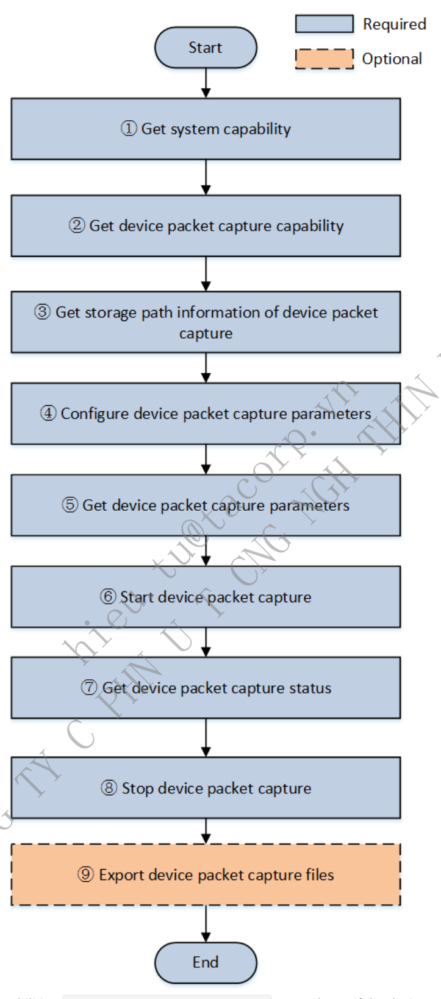
*Figure 11 — source page 32*

**Figure 11 redrawn — Device packet capture**

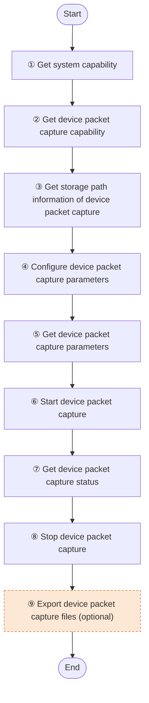
```mermaid
flowchart TD
    S([Start]) --> A1["① Get system capability"]
    A1 --> A2["② Get device packet capture capability"]
    A2 --> A3["③ Get storage path information of device packet capture"]
    A3 --> A4["④ Configure device packet capture parameters"]
    A4 --> A5["⑤ Get device packet capture parameters"]
    A5 --> A6["⑥ Start device packet capture"]
    A6 --> A7["⑦ Get device packet capture status"]
    A7 --> A8["⑧ Stop device packet capture"]
    A8 --> A9["⑨ Export device packet capture files (optional)"]
    A9 --> E([End])
    classDef opt fill:#fde8d5,stroke:#c8763a,stroke-dasharray:4 3;
    class A9 opt;
```

2. Check if the device supports packet captures: `GET /ISAPI/System/networkCapture/capabilities?format=json`. If

`isSupportManualControl` is true, the device supports packet capture. If `isSupportManualControlAsyn` is true, the device supports asynchronous packet capture.

| GET /ISAPI/System/networkCapture/StoragePathInfo? |  |
| --- | --- |

`format=json`.

4. Configure device packet capture parameters such as capture duration, storage path, port, and address: `PUT`

|  | /ISAPI/System/networkCapture/captureParams?format=json |
| --- | --- |

5. Get device packet capture parameters such as capture duration, storage path, port, and address: `GET`

|  | /ISAPI/System/networkCapture/captureParams?format=json |
| --- | --- |

6. Start device packet capture: depending on the parameters, packet capture files can be saved on the local device for

export after capture is complete, or packet capture files can be uploaded to cloud storage and downloaded via the storage URL, or the packet capture data can be returned in real-time.

| PUT /ISAPI/System/networkCapture/manualStart?format=json&asyn=<asyn>&realTime= |  |
| --- | --- |

`<realTime>`.

**Note:**

If the API does not contain URL parameters, the packet capture file is saved on the local device. If the API contains `asyn=true`, the packet capture file is automatically uploaded to cloud storage after capture is complete.

7. After starting capture, you can repeatedly get capture status, including whether the capture is ongoing, the size of the

packet capture data, and the progress and storage URL for uploading the data to cloud storage. Get status of device packet capture: `GET /ISAPI/System/networkCapture/manualStatus?format=json`.

8. Packet capture can be stopped at any time by calling the interface of stopping packet capture.

Stop device packet capture: `PUT /ISAPI/System/networkCapture/manualStop?format=json`.

9. (Optional) If packet capture data is stored on the local device, packet capture files need to be exported. If packet

capture files are saved to cloud storage or captured in real-time, there is no need to export packet capture files. Export device packet capture files: `GET /ISAPI/System/networkCapture/exportFile?format=json`.

##### 5.1.2.2 Device Real-Time Packet Capture

The process of real-time packet capture is shown as the following:

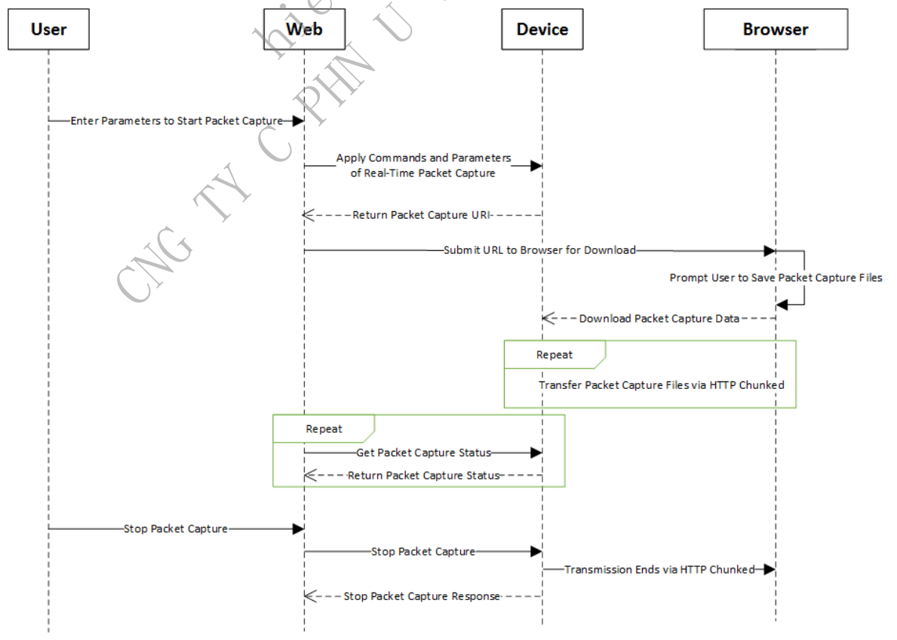
*Figure 12 — source page 33*

**Figure 12 redrawn — Real-time packet capture**

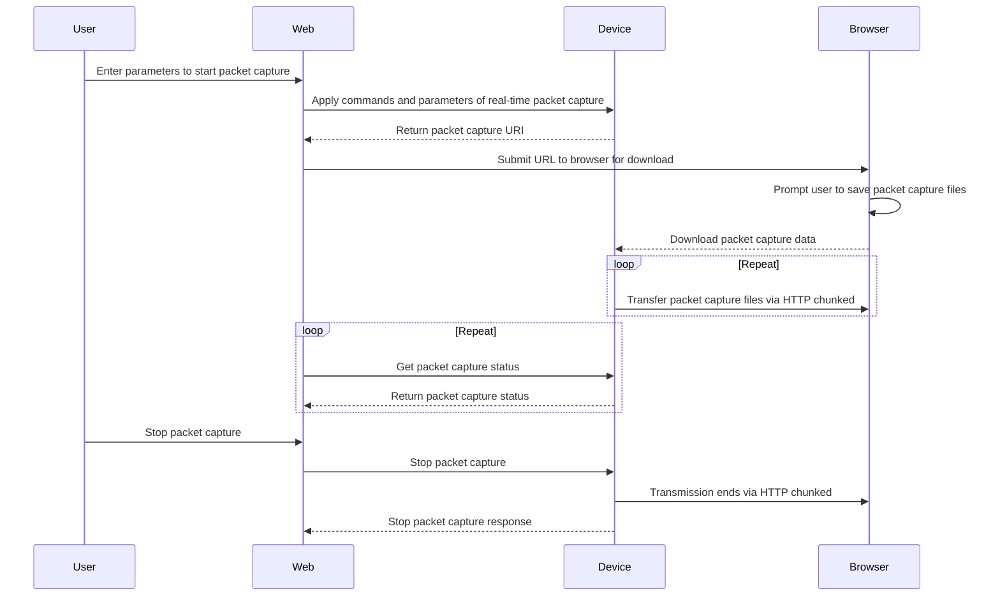
```mermaid
sequenceDiagram
    participant U as User
    participant W as Web
    participant D as Device
    participant B as Browser
    U->>W: Enter parameters to start packet capture
    W->>D: Apply commands and parameters of real-time packet capture
    D-->>W: Return packet capture URI
    W->>B: Submit URL to browser for download
    B->>B: Prompt user to save packet capture files
    B-->>D: Download packet capture data
    loop Repeat
        D->>B: Transfer packet capture files via HTTP chunked
    end
    loop Repeat
        W->>D: Get packet capture status
        D-->>W: Return packet capture status
    end
    U->>W: Stop packet capture
    W->>D: Stop packet capture
    D->>B: Transmission ends via HTTP chunked
    D-->>W: Stop packet capture response
```

See the following figure for the calling flow:

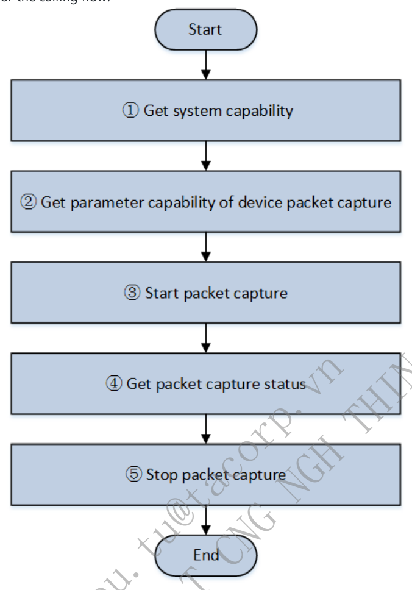
*Figure 13 — source page 34*

**Figure 13 redrawn — Packet capture calling flow**

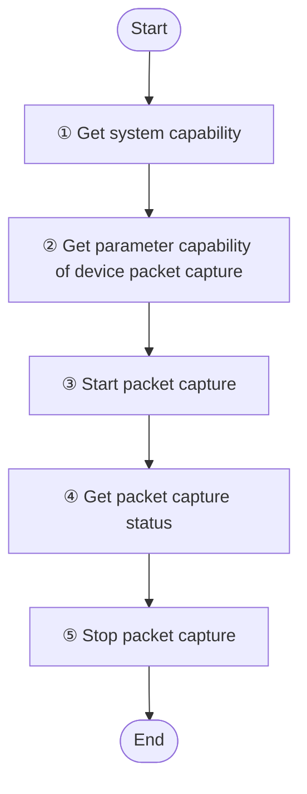
```mermaid
flowchart TD
    S([Start]) --> A1["① Get system capability"]
    A1 --> A2["② Get parameter capability of device packet capture"]
    A2 --> A3["③ Start packet capture"]
    A3 --> A4["④ Get packet capture status"]
    A4 --> A5["⑤ Stop packet capture"]
    A5 --> E([End])
```

| 1. Get device system capabilities: | GET /ISAPI/System/capabilities |
| --- | --- |
| <isSupportStartNetworkCapture>true</isSupportStartNetworkCapture> |  |

packet capture. `<isSupportStopNetworkCapture>true</isSupportStopNetworkCapture>` indicates the device supports stopping packet capture. `<isSupportGetNetworkCaptureStatus>true</isSupportGetNetworkCaptureStatus>` indicates the device supports getting packet capture status.

| GET /ISAPI/System/NetworkCaptureParams/capabilities? |  |
| --- | --- |

`format=json`. The `realTimeEnabled` field indicates whether the device supports real-time packet capture.

3. Set the field realTimeEnabled as true in the parameters applied to the device to start device packet capture. The

device returns an URI, and the client can download the real-time packet capture data from the device through a browser. Start packet capture: `POST /ISAPI/System/StartNetworkCapture?format=json&security=<security>&iv=<iv>`.

**Note:**

If `realTimeEnabled=true` is contained when starting device packet capture, it indicates packet capture data is uploaded in real-time by HTTP Chunked. The URL for downloading the returned packet capture data is valid for 30 seconds by default. If the download is attempted after this time, the device should return an HTTP 404 status code.

4. After starting packet capture, you can repeatedly get packet capture status, including whether packet capture is

ongoing and the size of the packet capture data. Get packet capture status: `GET /ISAPI/System/GetNetworkCaptureStatus?format=json`.

5. Packet capture can be stopped at any time by calling the interface of stopping packet capture.

Stop device packet capture: `POST /ISAPI/System/StopNetworkCapture?format=json`.

### 5.2 Device Hardware Asset Management

#### 5.2.1 Introduction to the Function

Hardware assets: the host assets (CPU, memory, and HDD) and peripheral assets (hardware connected to the host including camera, sensor, and USB flash drive). Typical application: financial industry, where the head office needs to regularly count the security device assets of each branch to collect the number, operation status, and other basic information of deployed host/storage/peripheral cameras. Extended application: management of industry-related service applications for assets customized by the industry platform (e.g., information and software assets, person assets, and service assets) based on the hardware asset integration.

#### 5.2.2 API Calling Flow

1. Get the search capability of the device hardware asset data via `GET /ISAPI/System/deviceInfo/capabilities`: when

`isSupportSearchHardwareAssets` is true, it indicates the device supports searching for asset data.

2. Search for device hardware asset data via `GET /ISAPI/System/deviceInfo/ExportDeviceAssets?format=json` to get

the information of hardware assets on device including host assets, connected sub-device assets, HDD assets, etc.

3. Export the device hardware asset information in binary data in Excel format.

### 5.3 Device Peripherals Upgrade

#### 5.3.1 Introduction to the Function

The platform or client software or web client under the LAN upgrades device peripherals via ISAPI.

#### 5.3.2 API Calling Flow

The sequence diagram of upgrading device peripherals by the platform is shown below.

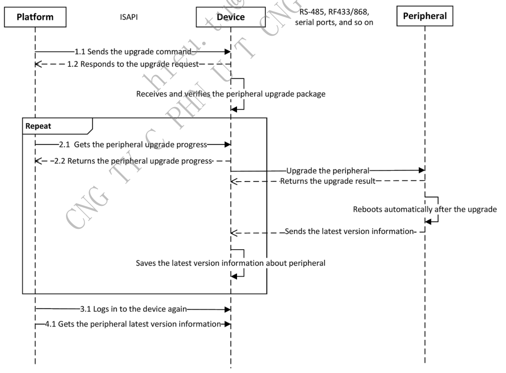
*Figure 14 — source page 35*

**Figure 14 redrawn — Peripheral upgrade**

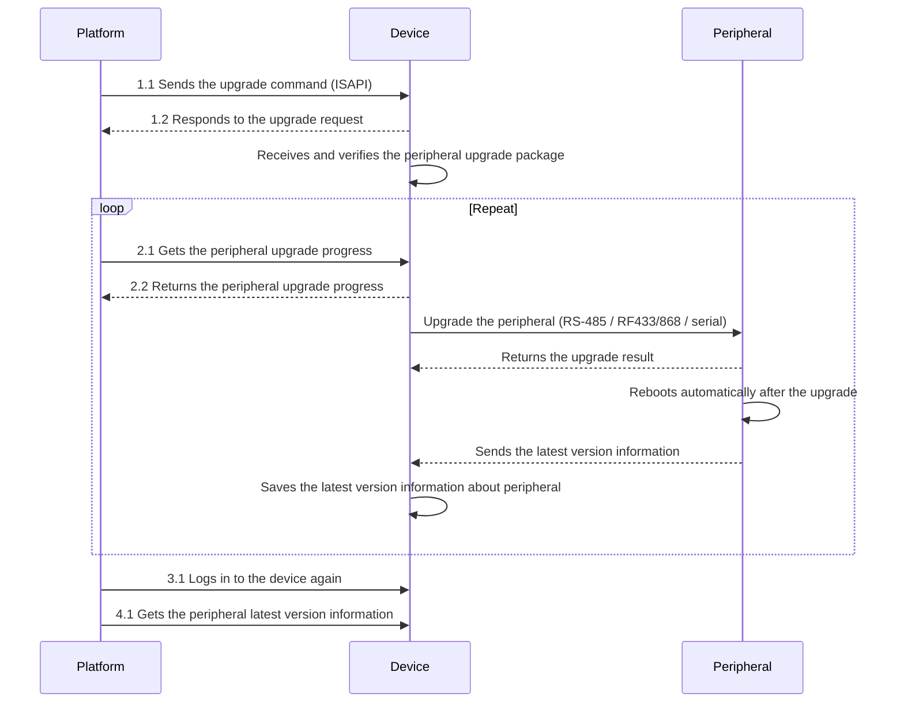
```mermaid
sequenceDiagram
    participant P as Platform
    participant D as Device
    participant R as Peripheral
    P->>D: 1.1 Sends the upgrade command (ISAPI)
    D-->>P: 1.2 Responds to the upgrade request
    D->>D: Receives and verifies the peripheral upgrade package
    loop Repeat
        P->>D: 2.1 Gets the peripheral upgrade progress
        D-->>P: 2.2 Returns the peripheral upgrade progress
        D->>R: Upgrade the peripheral (RS-485 / RF433/868 / serial)
        R-->>D: Returns the upgrade result
        R->>R: Reboots automatically after the upgrade
        R-->>D: Sends the latest version information
        D->>D: Saves the latest version information about peripheral
    end
    P->>D: 3.1 Logs in to the device again
    P->>D: 4.1 Gets the peripheral latest version information
```

| GET /ISAPI/System/capabilities |  |  |
| --- | --- | --- |
| d | isSupportAcsUpdate | is returned a |

supports this function, otherwise, the device does not support this function.

2. Get the capability of upgrading the peripherals module `GET /ISAPI/System/AcsUpdate/capabilities`, and get the

types and IDs of peripherals that support upgrading.

| POST /ISAPI/System/updateFirmware?type=<type>&moduleAddress= |  |  |  |
| --- | --- | --- | --- |
| L | type | refers to the peripheral type, | moduleAddress |

| <moduleAddress>&id=<indexID> | . In the U |
| --- | --- |
|  | indexID |

peripheral module address, and `indexID` refers to the ID of peripheral to be upgraded. The platform will apply the upgrade peripheral package to the device.

4. Get the peripheral upgrade progress `GET /ISAPI/System/upgradeStatus?type=<Type>`.

5. Log in to the device again.

6. Get the peripheral latest version information.

### 5.4 Device Time Sync

#### 5.4.1 Introduction to the Function

Time sync is a method to synchronize the time of all devices connecting to the NTP server, so that all devices can share the same clock time for providing related functions based on time. Supported time sync types: NTP time sync, manual sync, satellite time sync, platform time synchronization, etc. The following describes the method of NTP time sync.

##### 5.4.1.1 NTP Time Sync

The local system of running NTP can receive sync from other clock sources (self as client), other clocks can sync from the local system (self as server), and sync with other devices. The basic working principle of NTP is shown in the picture. Device A and Device B are connected via the network, and their systems follow their own independent system time. To auto sync their time, you can set device time auto sync via NTP. For example: Before time sync between Device A and Device B, the time of Device A is 10:00:00 am, and that of Device B is 11:00:00 am. Device B is set as the server of NTP server, so that the time of Device A should be synchronized with that of Device B. The time of NTP message transmitted between Device A and Device B is 1 second.

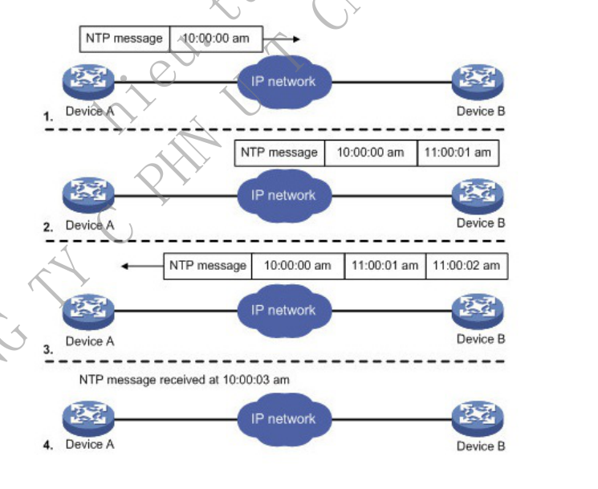
*Figure 15 — source page 36*

**Figure 15 redrawn — NTP time synchronization principle**

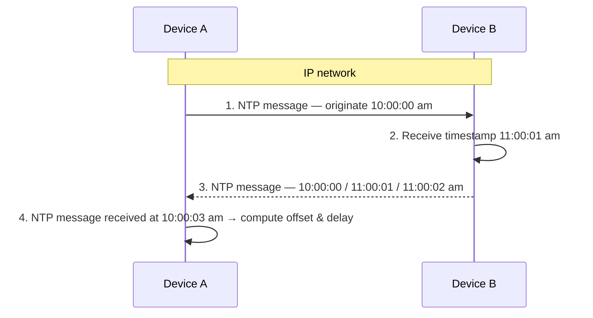
```mermaid
sequenceDiagram
    participant A as Device A
    participant B as Device B
    Note over A,B: IP network
    A->>B: 1. NTP message — originate 10:00:00 am
    B->>B: 2. Receive timestamp 11:00:01 am
    B-->>A: 3. NTP message — 10:00:00 / 11:00:01 / 11:00:02 am
    A->>A: 4. NTP message received at 10:00:03 am → compute offset & delay
```

The working process of system clock synchronization is as follows: Device A sends an NTP message to Device B with a timestamp of 10:00:00 am (T1) that is when it leaves Device A. When the NTP message reaches Device B. Device B will add its own timestamp, which is 11:00:01 am (T2). Then the NTP message leaves Device B with Device B's timestamp, which is 11:00:02 am (T3). Device A receives the response message, and the local time of Device A is 10:00:03 am (T4). Above all, Device A can calculate two important parameters: Round-trip delay of NTP message: Delay = (T4-T1) - (T3-T2) = 2 seconds. Time difference between Device A and Device B: offset = ((T2-T1)+(T3-T4))/2=1 h.

Device A can sync its own time with that of Device B according to calculation results.

#### 5.4.2 API Calling Flow

##### 5.4.2.1 Time Sync Configuration

**1. Get the Capability of Device Time synchronization Management**

You can call this API to get the time sync types currently supported by the device, such as NTP time sync, manual time sync, satellite time sync, EZ platform time sync. Get the capability: `GET /ISAPI/System/time/capabilities`.

**2. Set device time synchronization management parameters**

You can configure the time synchronization mode as follows： Get device time synchronization management parameters: `GET /ISAPI/System/time`; Set device time synchronization management parameters: `PUT /ISAPI/System/time`； NTP time synchronization: See 4.2.2 NTP Time Sync (Client). Manual time synchronization: Set the value of `timeMode` to `manual`, and set the device local time in nodes `localTime`、

| localTime、 |  |
| --- | --- |

`timeZone`. Satellite time synchronization: Set the value of `timeMode` to `satellite`, and set the device local time in nodes `satelliteInterval`. Platform time synchronization: Set the value of `timeMode` to `platform`. Note： For manual time synchronization (time offset including time zone offset): Set manual time synchronization: localTime refers to the local time on device (time offset excluded, in format like 2019-02-28T10:50:44); timeZone refers to the time offset of local time on device (time offset format with DST disabled: CST-8:00:00; time offset format with DST enabled: CST-8:00:00DST00:30:00,M4.1.0/02:00:00,M10.5.0/02:00:00); Get manual time synchronization: localTime refers to the local time on device (time offset included, in format like 2019-02-28T10:50:44+8:30); timeZone refers to the time offset of local time on device (time offset format with DST disabled: CST-8:00:00; time offset format with DST enabled: CST-8:00:00DST00:30:00,M4.1.0/02:00:00,M10.5.0/02:00:00).

##### 5.4.2.2 Time Zone Configuration

**1. Get device time zone configuration capability**

Call `GET /ISAPI/System/capabilities` to get the system capability. When `isSupportTimeZone` is returned, the time zone configuration is supported by the device.

**2. Configure time zone parameters**

Get the device's time zone parameters: `GET /ISAPI/System/time/timeZone`. Set the device's time zone parameters: `PUT`

|  | /ISAPI/System/time/timeZone |
| --- | --- |

If DST (Daylight Saving Time) is disabled, the example of returned time zone parameters is: CST-8:00:00. It refers to UTC+8, and -8:00:00 is the UTC local time. If DST (Daylight Saving Time) is enabled, the example of returned time zone parameters is: CST-8:00:00DST00:30:00,M4.1.0/02:00:00,M10.5.2/02:00:00. It refers to UTC+8, the DST time is 30 minutes ahead of local time, the DST starts at 02:00:00 on the first Sunday of April and ends at 02:00:00 on the fifth Tuesday of October. MX.Y.Z: X is the month, Y is the week number in the month, Z is the day of a week (0-Sunday, 1- Monday, 2-Tuesday, 3-Wednesday, 4-Thursday, 5-Friday, 6-Saturday).

##### 5.4.2.3 NTP Time Sync (Client)

The local system running the NTP server can receive sync information from other clock sources (self as client), sync other clocks (self as server) as clock sources, and sync with other devices. Calling flow (self as client):

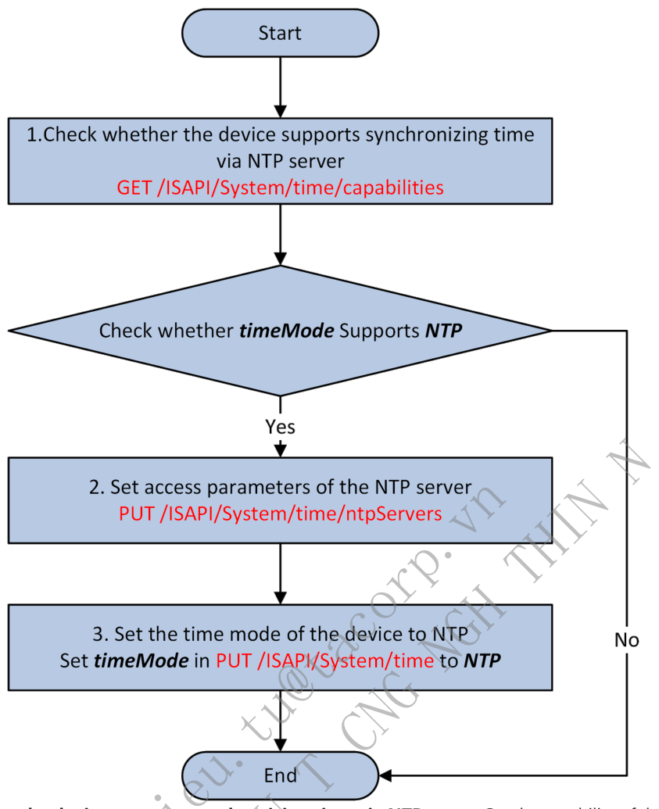
*Figure 16 — source page 38*

**Figure 16 redrawn — Synchronize time via an NTP server**

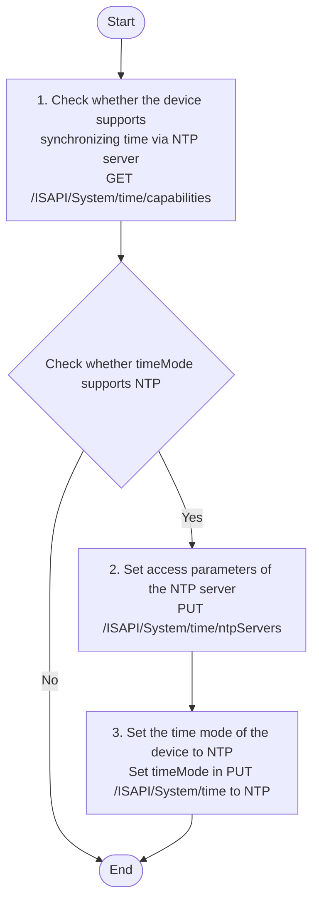
```mermaid
flowchart TD
    S([Start]) --> A1["1. Check whether the device supports<br/>synchronizing time via NTP server<br/>GET /ISAPI/System/time/capabilities"]
    A1 --> Q{"Check whether timeMode supports NTP"}
    Q -- No --> E([End])
    Q -- Yes --> A2["2. Set access parameters of the NTP server<br/>PUT /ISAPI/System/time/ntpServers"]
    A2 --> A3["3. Set the time mode of the device to NTP<br/>Set timeMode in PUT /ISAPI/System/time to NTP"]
    A3 --> E
```

**1. Check whether the device supports synchronizing time via NTP server Get the capability of the device: GET**

`/ISAPI/System/time/capabilities`; and check whether `timeMode` supports `NTP`.

|  | /ISAPI/System/time/capabilities |
| --- | --- |

**2. Set access parameters of the NTP server**

Supports accessing the NTP server by IP address to synchronize the device time. Get the access parameter capability of the NTP server: `GET /ISAPI/System/time/ntpServers/capabilities` Set access parameters of the NTP server: `PUT /ISAPI/System/time/ntpServers` Get access parameters of the NTP server: `GET /ISAPI/System/time/ntpServers`

**3. Set the time mode of the device to NTP**

Supports setting the value of `timeMode` to `NTP`. Get device time synchronization management parameters: `GET /ISAPI/System/time` Set device time synchronization management parameters: `PUT /ISAPI/System/time`

##### 5.4.2.4 NTP Time Sync (Server Mode)

The local system running the NTP server can receive sync information from other clock sources (self as client), sync other clocks (self as server) as clock sources, and sync with other devices. Calling flow (self as server):

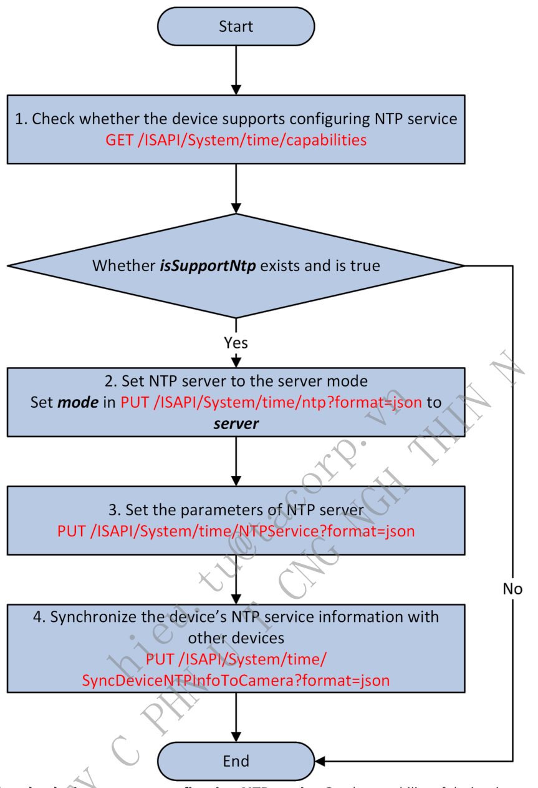
*Figure 17 — source page 39*

**Figure 17 redrawn — Configure the device as an NTP server**

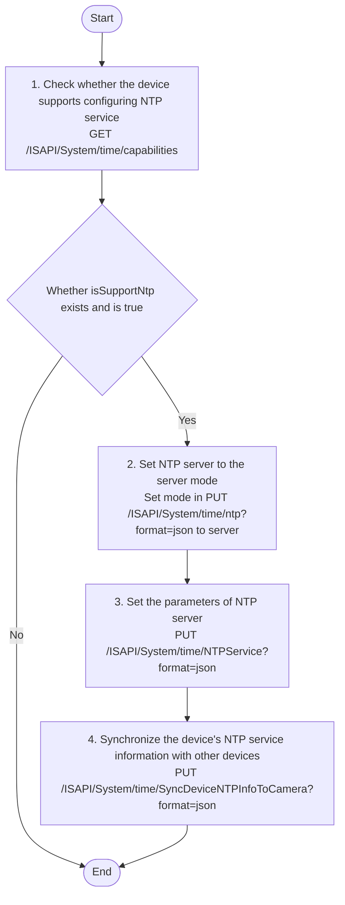
```mermaid
flowchart TD
    S([Start]) --> A1["1. Check whether the device supports configuring NTP service<br/>GET /ISAPI/System/time/capabilities"]
    A1 --> Q{"Whether isSupportNtp exists and is true"}
    Q -- No --> E([End])
    Q -- Yes --> A2["2. Set NTP server to the server mode<br/>Set mode in PUT /ISAPI/System/time/ntp?format=json to server"]
    A2 --> A3["3. Set the parameters of NTP server<br/>PUT /ISAPI/System/time/NTPService?format=json"]
    A3 --> A4["4. Synchronize the device's NTP service information with other devices<br/>PUT /ISAPI/System/time/SyncDeviceNTPInfoToCamera?format=json"]
    A4 --> E
```

**1. Check whether the device supports configuring NTP service Get the capability of device time synchronization**

management: `GET /ISAPI/System/time/capabilities`; If `isSupportNtp` is returned, it indicates that the device supports time synchronization management.

**2. Set NTP server to the server mode**

Supports setting the value of `mode` to `server`. Get the capability of server mode: `GET /ISAPI/System/time/ntp/capabilities?format=json` Set NTP to server mode: `PUT /ISAPI/System/time/ntp?format=json` Get parameters of NTP server mode: `GET /ISAPI/System/time/ntp?format=json`

**3. Set the parameters of NTP server**

Supports setting the IP address of the NTP server. Get the capability of NTP server: `GET /ISAPI/System/time/NTPService/capabilitis?format=json` Set the NTP server parameters: `PUT /ISAPI/System/time/NTPService?format=json` Get the parameters of the NTP server: `GET /ISAPI/System/time/NTPService?format=json`

**4. Synchronize the device’s NTP service information with other devices**

Supports synchronizing the time information to the camera.

Get the capability set of synchronizing device’s NTP service information with the camera: `GET`

|  | /ISAPI/System/time/SyncDeviceNTPInfoToCamera/capabilities?format=json |
| --- | --- |

| Synchronize device’s NTP service information with the camera: |  | PUT |
| --- | --- | --- |
|  | /ISAPI/System/time/SyncDeviceNTPInfoToCamera?format=json |  |

Get the progress of synchronizing device’s NTP service information with the camera: `GET`

|  | /ISAPI/System/time/SyncDeviceNTPInfoToCamera/Progress?format=json |
| --- | --- |

Search for the results of synchronizing device’s NTP service information with the camera: `POST`

|  | /ISAPI/System/time/SyncDeviceNTPInfoToCamera/SearchResult?format=json |
| --- | --- |

### 5.5 Device Upgrade

#### 5.5.1 Introduction to the Function

The platform or client software or web client under the LAN upgrades devices via ISAPI.

#### 5.5.2 API Calling Flow

The sequence diagram of upgrading devices by the platform is shown below.

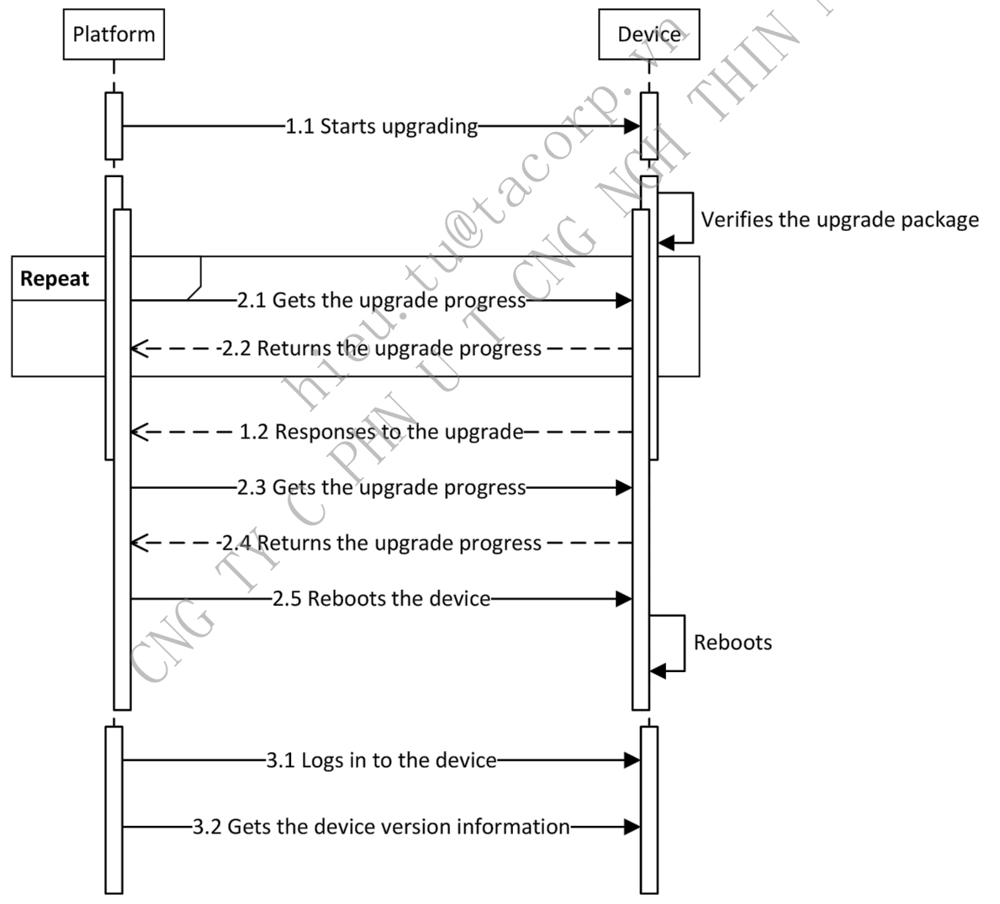
*Figure 18 — source page 40*

**Figure 18 redrawn — Device upgrade**

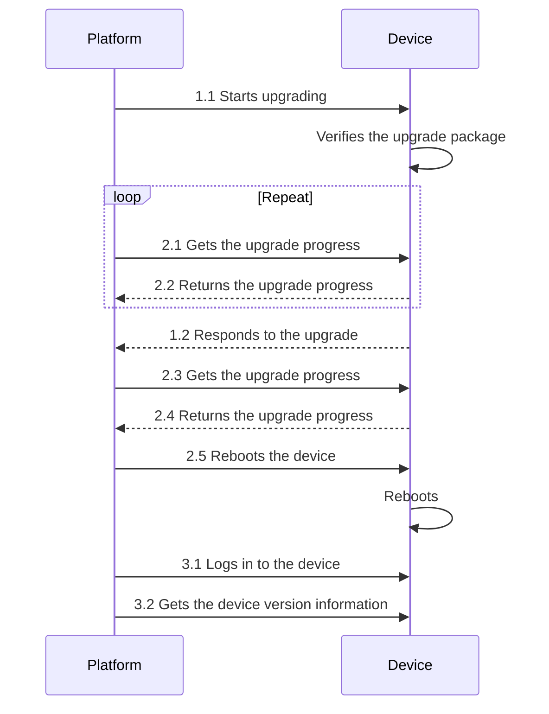
```mermaid
sequenceDiagram
    participant P as Platform
    participant D as Device
    P->>D: 1.1 Starts upgrading
    D->>D: Verifies the upgrade package
    loop Repeat
        P->>D: 2.1 Gets the upgrade progress
        D-->>P: 2.2 Returns the upgrade progress
    end
    D-->>P: 1.2 Responds to the upgrade
    P->>D: 2.3 Gets the upgrade progress
    D-->>P: 2.4 Returns the upgrade progress
    P->>D: 2.5 Reboots the device
    D->>D: Reboots
    P->>D: 3.1 Logs in to the device
    P->>D: 3.2 Gets the device version information
```

**1. Upgrade devices.**

Upgrade the device firmware: `POST /ISAPI/System/updateFirmware`.

**2. Get the device upgrade progress.**

Get the device upgrade progress: `GET /ISAPI/System/upgradeStatus`.

**3. Reboot devices.**

Reboot devices: `PUT /ISAPI/System/reboot`.

### 5.6 Mutually Exclusive Functions

#### 5.6.1 Introduction to the Function

Some functions are mutually exclusive due to the device performance (for example, function A and function B cannot run at the same time, i.e, only one of them is allowed at one time).

#### 5.6.2 API Calling Flow

The following three APIs are available for the integration of mutually exclusive functions:

1. Get the information of mutually exclusive functions: `GET /ISAPI/System/mutexFunction/capabilities?`

| GET /ISAPI/System/mutexFunction/capabilities? |  |
| --- | --- |

`format=json`. Call this URL to get the list of existing mutually exclusive functions supported by the device. Note: NVR devices only support setting exlusive function "perimeter" (perimeter protection), and do not support "linedetection" (line crossing detection), "fielddetection" (intrusion detection), "regionEntrance" (region entrance), or "regionExiting" (region exiting).

2. Search for the functions that are mutually exclusive with a specified function: `POST`

|  |  | /ISAPI/System/mutexFunction?format=json |
| --- | --- | --- |
|  |  | /ISAPI/System/mutexFunction/capabilities?format=json |

specified function and see whether to change the settings and disbale the mutually exclusive function.

3. Get the mutual exclusion information when device function exception occurs: `GET`

| GET |  |
| --- | --- |

|  | /ISAPI/System/mutexFunctionErrorMsg |
| --- | --- |

`/ISAPI/System/mutexFunctionErrorMsg`. After getting the error code, you can call this API to get the current mutually exclusive functions.

### 5.7 Query Device Operation Log

#### 5.7.1 Introduction to the Function

Device operation logs primarily include:

Operation records for the device, such as startup, restart, PTZ control, etc. Events from the device, such as the start and end of motion detection, face capture, etc. Device status exceptions, such as network disconnection, network recovery, IP address conflict, etc. Device trigger information, such as starting recording, stopping recording, and periodically recording hard drive status.

Log query functions include log query and security audit log query, which overlap to some extent. The differences are as follows:

Log query is mainly designed to query all operational status and operation records of the device. Security audit log query is mainly designed to query security-related status and operation records of the device, such as user login/logout records, device SSH service start/stop records, etc.

Operation logs can be queried and displayed item by item through the device web page, remote client, or platform. The device web page log query is shown in the following figure.

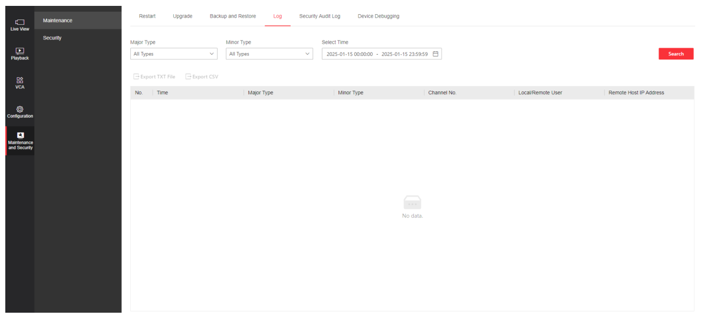
*Figure 19 — source page 42*

#### 5.7.2 API Calling Flow

1. Call `POST /ISAPI/ContentMgmt/logSearch` to query logs except security audit logs.

**Note 1:**

When you query logs of a specified type, first set the `metaId` to `log.std-cgi.com/Information`. If the total number returned is not 0, it indicates that the log query is standardized, and subsequent queries should follow

| 0, use | log.std-cgi.com/Infomation |  |
| --- | --- | --- |
| log.std-cgi.com/Infomation |  | . |

return value, subsequent queries should use `log.std-cgi.com/Infomation`.

| When you set the |  | metaId |  | to | all | , the response results sho |
| --- | --- | --- | --- | --- | --- | --- |
|  | cgi.com/Infomation |  | and | log.std-cgi.com/Information |  |  |

| log.std- |  |
| --- | --- |

When you query logs of a specified type , the recommended format for the`searchID` field is the GUID (8-4-4- 4-12) format, such as `812F04E0-4089-11A3-9A0C-0305E82C2906`.

2. Call `POST /ISAPI/ContentMgmt/security/logSearch` to query security audit logs.

**Note **: Standard definition: Query log `POST /ISAPI/ContentMgmt/logSearch`: `log.std-cgi.com/Information` indicates querying information logs.

| Device Type | Implementation Differences |
| --- | --- |
| Encoding Devices (General Cameras/Storage Devices/Traffic Cameras/Thermal Cameras/Security Inspection) | Input and output log information are log.std-cgi.com/Infomation |
| Non-Encoding Devices (Access Control Devices/Transmission Devices/Display & Control Devices) | Input and output log information are log.std-cgi.com/Information |

#### 5.7.Export Device Operation Log

#### 5.7.1 Introduction to the Function

Operation logs can be exported to a client over the network or to an external storage medium (USB drive, external hard drive, etc.) via a USB interface.

#### 5.7.2 API Calling Flow

##### 5.7.2.1 Export to Client

1. Call `POST /ISAPI/ContentMgmt/logSearch/dataPackage`to get the URL to download the exported device log.

2. The client downloads the log files via the URL returned by the device.

##### 5.7.2.2 Export to USB Storage Medium

1. Call `GET /ISAPI/System/exportLogToUSB/capabilities?format=json` to determine if the device supports log

output to a USB drive.

2. Call `PUT /ISAPI/System/exportLogToUSB/mode?format=json` to set the parameters of exporting logs to a USB

drive.

3. Call `GET /ISAPI/System/exportLogToUSB/status?format=json` to get the status of log output to a USB drive.

#### 5.7.Device Operation Log

#### 5.7.1 Introduction to the Function

Device operation logs are used in the following two scenarios: Scenario 1: View the detailed operation log files to locate the issue when a device fails. Scenario 2: Before a device fails, basic operation status information is recorded in the logs. Maintenance personnel can proactively query the device operation status to promptly identify potential issues and faults in the device.

The operation status logs generally include host information (network bandwidth, online users, video output port/USB port status), linked device information (online status, video recording schedule/status), hard disk information (capacity, status, runtime, temperature), etc. For example, to ensure the normal operation of bank equipment and facilities, and to promptly identify hidden dangers and faults in equipment operations, maintenance personnel of bank outlets are required to check the equipment operation status at regular intervals each day and manually record data for subsequent data traceability. This management approach consumes manpower and may result in data omissions. Therefore, you can configure the equipment to automatically record operational status by schedule for querying and exporting history data, thus saving labor and ensuring data integrity.

#### 5.7.2 API Calling Flow

##### 5.7.2.1 Upload to Specified FTP/HTTP(S) Server

1. Call `PUT /ISAPI/System/diagnosedData/server?format=json` to allow devices to upload operation log files to a

specified FTP/HTTP(S) Server.

2. Check the device logs on the FTP/HTTP(S) server.

**Note:**

See the "Device Operation Status Diagnosis" module for FTP/HTTP(S) Server API details. We recommend that use this method to remotely obtain device operation logs for device operation and maintenance platforms.

##### 5.7.2.2 Upload to Syslog Server

Syslog is a standard log transmission protocol widely used in system logs. It is defined in RFC 5424 (The Syslog Protocol). After you configure the Syslog service address and enable the Syslog function on the device, the device will send its operation logs to the Syslog server using the Syslog protocol. The Syslog server can manage the operation logs of multiple devices.

1. Get the Syslog management capabilities to determine if the device supports the Syslog function and the parameter

value range.

2. Call `PUT /ISAPI/System/logServer` to configure Syslog server settings such as the IP address, port No., and

certificate.

3. When the device upload logs to the Syslog server using the Syslog protocol, the logs can be viewed on the Syslog

server.

##### 5.7.2.3 Query Device Operation Status Logs

1. Call `/ISAPI/ContentMgmt/RuningLogPlan?format=json` to configure the device operation log recording schedule.

Supports configuring up to 8 time points per day. The device will automatically store and back up the operation status data at the corresponding time points for subsequent historical log viewing or export. The operation status data includes host information (network bandwidth, online users, video output port/USB port status), external device information (online status, video device recording plan/status), disk information (capacity, status, runtime, temperature).

2. Query historical device operation logs: `/ISAPI/ContentMgmt/SearchRuningLogData?format=json`.

3. Export historical device operation logs: `/ISAPI/ContentMgmt/ExportRuningLogData?format=json`. Export based on

the query conditions set in step 2.

### 5.8 Serial Port Accessed External Device Management

#### 5.8.1 Introduction to the Function

Information management of device accessed the serial are as follows: 1. Configure manufacturer, type, and model information of the specific serial port access device. 2. Search for the device type or model supported by the specific serial port.

#### 5.8.2 API Calling Flow

1. Check whether the device supports information management of serial port. Get the capability of the device serial

port: `GET /ISAPI/System/Serial/capabilities`; If `<isSupportDeviceInfo>` is returned, the device supports information configuration of devices access the serial port.

2. Set the information of serial port:

Get the capability of device information parameters of a single serial port: `GET`

| / | /ISAPI/System/Serial/ports/<portID>/deviceInfo?format=json |
| --- | --- |

Get device information parameters access single serial port: `GET`

| / | /ISAPI/System/Serial/ports/<portID>/deviceInfo?format=json |
| --- | --- |

| PUT /ISAPI/System/Serial/ports/<portID>/deviceInfo? |  |
| --- | --- |

`format=json`.

3. Check whether the device supports linking information of devices access the serial port: `GET`

|  | /ISAPI/System/Serial/capabilities |
| --- | --- |

`/ISAPI/System/Serial/capabilities`; If `<isSupportSearchDeviceInfoRelations>` is returned, it indicates that the device supports searching for linked information od devices access the serial port.

4. Search for linked information of devices access the serial port.

Get the capability of searching for linked parameters of information of devices access a single serial port: `GET`

| / | /ISAPI/System/Serial/ports/<portID>/searchDeviceInfoRelations/capabilities?format=json |
| --- | --- |

| Search for linked parameters of information of devices access a single serial port: |  | POST |
| --- | --- | --- |
| / | /ISAPI/System/Serial/ports/<portID>/searchDeviceInfoRelations?format=json |  |

### 5.9 Serial Port Data Transparent Transmission

#### 5.9.1 Introduction to the Function

RS485, RS422 and RS232 serial ports external to the device are used as transparent channels to transmit serial port data. Supports the client sending serial data to the device, which then forwards the data to the serial port; conversely, when the serial port sends data to the device, which transparently transmits the data to the client. Note that the device's transparent transmission of serial data is half-duplex communication, meaning that bidirectional communication can be implemented between the device and the client, but the communication data is not necessarily in a question-and- answer format, and the client must match the request and response relationship on its own. Since most standard HTTP request libraries do not support the persistent connection for receiving and sending data in real time, it is recommended that the client uses two TCP clients to implement the sending and receiving of transparently transmitted serial data.

#### 5.9.2 API Calling Flow

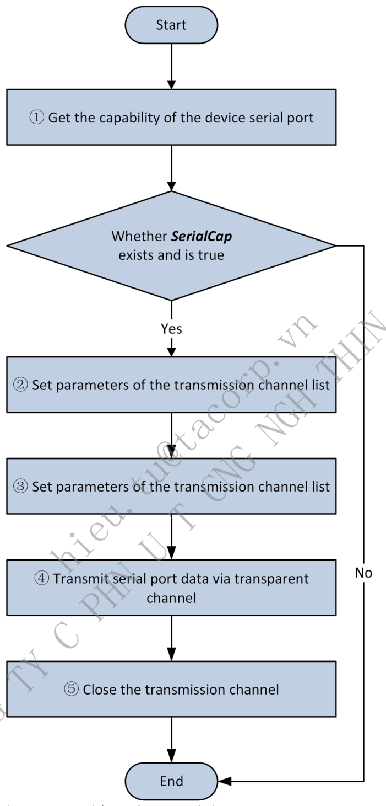
*Figure 20 — source page 45*

**Figure 20 redrawn — Serial port transparent transmission**

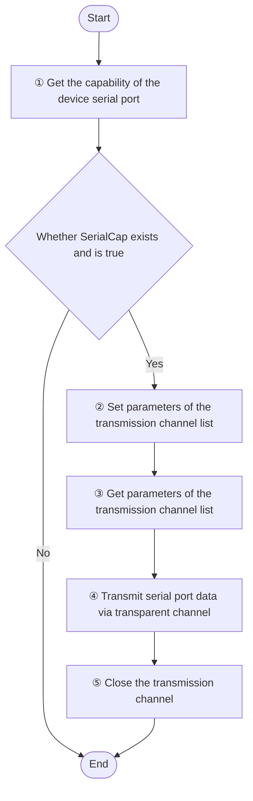
```mermaid
flowchart TD
    S([Start]) --> A1["① Get the capability of the device serial port"]
    A1 --> Q{"Whether SerialCap exists and is true"}
    Q -- No --> E([End])
    Q -- Yes --> A2["② Set parameters of the transmission channel list"]
    A2 --> A3["③ Get parameters of the transmission channel list"]
    A3 --> A4["④ Transmit serial port data via transparent channel"]
    A4 --> A5["⑤ Close the transmission channel"]
    A5 --> E
```

1. Check whether the device supports serial port data transmission.

Get the capability of the device serial port: `GET /ISAPI/System/capabilities`. If `SerialCap` is returned and the value is true, it indicates that the device supports the functions of the serial port.

2. Set parameters of the transmission channel list.

Get parameters of the specific transmission channel: `GET`

|  | /ISAPI/System/Serial/ports/<portID>/Transparent/channels/<channelID> |
| --- | --- |

Configure parameters of the specific transmission channel: `GET`

|  | /ISAPI/System/Serial/ports/<portID>/Transparent/channels/<channelID> |
| --- | --- |

| 3. Open the transmission channel: |  | PUT |  |  |
| --- | --- | --- | --- | --- |
|  | /ISAPI/System/Serial/ports/<portID>/Transparent/channels/<channelID>/open |  |  | ; |

4. Transmit serial port data via transparent channel.

| Receive data uploaded by device serial port through transmission channel: |  | GET |
| --- | --- | --- |
|  | /ISAPI/System/Serial/ports/<portID>/Transparent/channels/<channelID>/transData |  |

Send data to device serial port through transmission channel: `PUT`

|  | /ISAPI/System/Serial/ports/<portID>/Transparent/channels/<channelID>/transData |
| --- | --- |

| 5. Close the transmission channel: |  | PUT |  |  |
| --- | --- | --- | --- | --- |
|  | /ISAPI/System/Serial/ports/<portID>/Transparent/channels/<channelID>/close |  |  | . |

### 5.10 Serial Port Parameter Configuration

#### 5.10.1 Introduction to the Function

Serial port parameter configuration.

#### 5.10.2 API Calling Flow

1. Check whether the device supports configuring serial port parameters.

Get the capability of device serial port: `GET /ISAPI/System/capabilities. If is returned and its value is true, the device supports functions of serial port.

3. Get parameters of all serial ports.

Get the capability of all serial ports: `GET /ISAPI/System/Serial/capabilities`. Get control parameters of all serial ports: `GET /ISAPI/System/Serial/ports?permissionController=<indexID>`.

4. Set control parameters of a single serial port.

| GET /ISAPI/System/Serial/ports/<portID>?permissionController= |  |
| --- | --- |

`<indexID>`. Configure control parameters of single serial port: `PUT /ISAPI/System/Serial/ports/<portID>?` `permissionController=<indexID>`.

5. Get the status of single serial port:`GET /ISAPI/System/Serial/ports/<portID>/status`.

### 5.11 Sub-device Batch Upgrade

#### 5.11.1 Introduction to the Function

Sub-device Batch Upgrade (Single Task): applicable to situations of upgrading multiple sub-devices using one upgrade package. Application scenarios include: when the UWB positioning anchor connects to the web, upgrading multiple tags (sub-devices) through the positioning engine (gateway), with the same upgrade package. Management of Sub-device Batch Upgrade Tasks: There are many types of sub-devices, such as LoRa nodes, which have a slow upgrade process and different models of LoRa nodes in the field also require different upgrade packages. Therefore, it is necessary to support the creation of multiple upgrade tasks at once, entrusting the upgrade to the devices, to enhance the practicality of batch upgrading sub-devices.

#### 5.11.2 API Calling Flow

**Sub-device Batch Upgrade (Single Task)**

Get the device capability: `/ISAPI/System/capabilities`. If the node `isSupportBulkUpgradeChildDevice` exists and is true, it indicates that the device support the function. If the node `isSupportSearchBulkUpgradeChildDeviceProgress` exists and is true, it indicates that the device support getting the progress of batch upgraading sub-devices.

Sub-device batch upgrade: `POST /ISAPI/System/BulkUpgradeChildDeviceList?format=json`. Batch sub-device upgrade progress search: `POST /ISAPI/System/BulkUpgradeChildDeviceList/Search?format=json`.

**Sub-device Batch Upgrade Task Management**

Get device system capabilities `/ISAPI/System/capabilities`, If the node `isSupportBulkUpgradeChildDevice` exists and is true, it indicates that batch upgrade of sub devices is supported, If the node `isSupportSearchBulkUpgradeChildDeviceProgress` exists and is true, it indicates that progress of batch upgrading sub devices can be searched, If the node `isSupportSearchBulkUpgradeChildDeviceTask` exists and is true, it indicates that batch upgrading devices can be searched, If the node `isSupportModifyBulkUpgradeChildDeviceTask` exists and is true, it indicates that batch upgrading sub devices can be edited, If the node `isSupportDeleteBulkUpgradeChildDeviceTask` exists and is true, it indicates that task of batch upgrading sub devices can be deleted.

| GET /ISAPI/System/BulkUpgradeChildDevice/capabilities? | ? |
| --- | --- |

`format=json`. Batch upgrade sub devices: `POST /ISAPI/System/BulkUpgradeChildDeviceList?format=json`.****

| POST /ISAPI/System/ModifyBulkUpgradeChildDeviceTask? |  |
| --- | --- |

`format=json`.

**Edit tasks of batch sub-device upgrade: PUT /ISAPI/System/ModifyBulkUpgradeChildDeviceTask?format=json.******

Delete tasks of batch sub-device upgrade: `PUT /ISAPI/System/DeleteBulkUpgradeChildDeviceTask?format=json`. Note: 1. The two methods for batch upgrading child devices are the same API: `POST`

|  | /ISAPI/System/BulkUpgradeChildDeviceList?format=json. |  |
| --- | --- | --- |
| returned in |  | GET /ISAPI/System/BulkUpgradeChildDevice/capabilities?format=json |

method is supported in the sub device upgrade. 2. To determine which sub devices can be upgraded, you can use the

| API | POST /ISAPI/IoTGateway/Childmanage/SearchChild?format=json |  |  |
| --- | --- | --- | --- |
| value |  | true | indicate that the sub devices support upgrades. |

### 5.12 User Management

#### 5.12.1 Introduction to the Function

When the device is activated, you can log in to it via the `admin` account and corresponding password, and manage users as needed, including:

1. Change the password of the `admin` account. The user name cannot be edited.

2. Add, edit, and delete other users, including the user type, password, user name, and so on. A `Non-admin` user can

log in to and operate the device after being created.

**Remarks**

1. Common user types:

Administrator (`admin`): has the permission of accessing all resources supported by the device, and can operate all functions of the device. The `admin` account cannot be deleted. Operator (`operator`): has the permission to view. Their operation permissions are assigned by `admin`. Operator accounts are created by the administrator only. User (`viewer`): has the permission to view only. They have no operation permission. User accounts are created by the administrator only.

2. User types related to the installer:

Local Administrator (`localAdmin`) : Activated by the device owner on the local software side (e.g., WEB) that accompanies the device. By default, a `localAdmin` has the permission to access the device and perform all functions supported by the device.

| localAdmin |  | n. The i |
| --- | --- | --- |
| a | localInstaller |  |

functions supported by the device.

| or (l | localOperator) |  |  | ) : Created |
| --- | --- | --- | --- | --- |
| cloudAdmin |  | , | localInstaller |  |

|  | rcloudAdmin |
| --- | --- |
| installerAdmin |  |

can log in via the local keypad. A local operator’s business functions are limited, and cannot configure device parameters. By default, only arming, disarming (including alarm clearing), and relay control operations are allowed. According to the actual business needs, there can be two types of local operator: one-time local operator (can only log in once and the identity will expire after logging out), and temporary local operator (can log in within the validity period), both created by `localAdmin` or `cloudAdmin`. Cloud Administrator (`cloudAdmin`) : Created by the device owner in the mobile software that accompanies the device (e.g. HC over the cloud) and then synchronized to the device. By default, a `CloudAdmin` has the permission to access and perform all functions supported by the device. Cloud Operator (`cloudOperator`) : Created by `cloudAdmin` in the mobile software that accompanies the device (e.g. HC over the cloud) and then synchronized to the device for ordinary mobile users. A cloud operator’s business functions are limited, and cannot configure device parameters, access and view the device, arm/disarm (including alarm clearing), or operate relays. Installer Administrator (`installerAdmin`) : User on the installer business application, created on the business platform (e.g. HPC deployed in the cloud) and then synchronized to the device for remote device management by the business platform’s admin. By default, an `installerAdmin` has the permission to access the device and perform all functions supported by the device. To facilitate installation management, when the business platform sets `installerAdmin` as the highest authority and synchronizes to the device, `installerAdmin` is allowed to modify user permissions of `localAdmin` and `cloudAdmin`. Installer Employee (`installerEmployee`) : User on the installer business application, created on the business platform (e.g. HPC deployed in the cloud) and then synchronized to the device for the employees on the business platform to remotely install and debug the device. By default, an `installerEmployee` has the permission to access the device and perform all functions supported by the device.

3. User password:

To ensure the security of account information, it is recommended to create a password using eight to sixteen characters, including at least two kinds of the following categories: digits, lower case letters, upper case letters, and special characters, and the user name is not allowed in the password. Risky passwords include the following categories: less than 8 characters, containing only one type of characters, same as the user name or reversed user name. To protect user data privacy and improve security, it is recommended to use a strong password. The password strength rule is as follows:

a. Strong password: including at least three kinds of the categories (digits, lower case letters, upper case

letters, and special characters). b. Medium password: a combination of digits and special characters, lower case letters and special

characters, upper case letters and special characters, or lower case letters and upper case letters. c. Weak password: a combination of digits and lower case letters or digits and upper case letters.

#### 5.12.2 API Calling Flow

1. Get the user management capability of devices on the client: `GET`

| GET |  |
| --- | --- |

|  | /ISAPI/Security/users/<indexID>/capabilities |
| --- | --- |

2. Add device users on the client: `POST /ISAPI/Security/users?security=<security>&iv=<iv>`.

**Remarks:**

Only `admin` can create other types of users, and creating users requires login password verification

| Only admin can cre (<loginPassword> | admin | can cre |
| --- | --- | --- |

If the user account is inactivated, it's required to log in to the account and change the user password (`PUT`

| / | /ISAPI/Security/users/<indexID>?security=<security>&iv=<iv> |
| --- | --- |

password is changed. When the account is inactivated, it's not allowed to perform any operations except changing the user

password. Otherwise, an error (`0x0020000f`) will be returned.

3. Edit the user information on the client: `PUT /ISAPI/Security/users/<indexID>?security=<security>&iv=<iv>`.

**Remarks:**

It requires password verification of `admin` when `admin` changes the user password. The account turns inactivated when the user password is changed by `admin`. Once logging out, the user needs to change the password first before the next login. When `non-admin` users changed their passwords, the account remains activated.

| DELETE /ISAPI/Security/users?loginPassword=<loginPassword>&security= |  |
| --- | --- |

`<security>&iv=<iv>`.

**Remarks:**

Only `admin` can delete users, and deleting users requires login password verification of `admin`.

5. Get the user information, including user name, activation status (`<userActivationStatus>`), and so on.

Get a single user information: `GET /ISAPI/Security/users/<indexID>?security=<security>&iv=<iv>`. Get the information of all users: `GET /ISAPI/Security/users?security=<security>&iv=<iv>`. Get the information of online users: `GET /ISAPI/Security/onlineUser`. Online users refer to users who have logged in to the device. The information such as user name, user type, and IP address can be obtained.

**Remarks:**

If multiple attempts of `admin` login password verification failed in the process of adding, editing, or deleting users, the `admin` will be locked. The remaining attempts are defined by the field `retryTimes` in the response message. The new password cannot be the same as the last password. Otherwise, an error (`0x400010E8`) will be returned.

#### 5.12.3 Exception Handling

Error Code

| statusCode |  | statusString | subStatusCode | errorCode | errorMsg | Descript |  |  |  |
| --- | --- | --- | --- | --- | --- | --- | --- | --- | --- |
| 4 |  | Invalid Operation | theAccountIsNotActivated | 0x0020000f | The account is not activated. |  |  |  |  |
| 4 |  | Invalid Operation | loginPasswordError | 0x4000000C | Incorrect login password. |  |  |  |  |
| 4 |  | Invalid Operation | theAnswerToTheUserSecurityQuestionIsDuplicate | 0x4000A0B6 | The answer to the user security question is duplicate. | Please se different answer. |  |  |  |
| 4 |  | Invalid Operation | theAnswerToTheUserSecurityQuestionIsTooShort | 0x4000A0B7 | The answer to the user security question is too short. | Please se longer answer. |  |  |  |
| 4 |  | Invalid Operation | cannotSameAsOldPassword | 0x400010E8 | New password cannot be the same as the old one. | Please se different password |  |  |  |
| 6 |  | Invalid Content | administratorPasswordError | 0x60000042 | Incorrect administrator password. | Please en the correc password you forgo the password you can reset the password |  |  |  |

### 5.13 User Types Related to the Installer (supported by the security control panel)

For different application scenarios, e.g., local environment, cloud environment, and HPP installer environment, users related to the installer can be classified into seven types: `localAdmin`, `localInstaller`, `localOperator`, `cloudAdmin`, `installerAdmin`, `installEmployee`, and `cloudOperator`.

#### 5.13.1 Create the User

##### 5.13.1.1 Local Environment

| ers are involved: localAdmin, localInstaller, and localOperator localAdmin and localInstaller, but localInstaller is not enable d, but the user cannot log in as localInstaller before the user type ated by localAdmin, and can only log in via local keypad. Users who | localAdmin | , l | localInstaller, |  |  | , and | localOperator |
| --- | --- | --- | --- | --- | --- | --- | --- |
|  | localInstaller, |  |  | , but | localInstaller |  |  |

been set with the keypad password can log in via keypad.

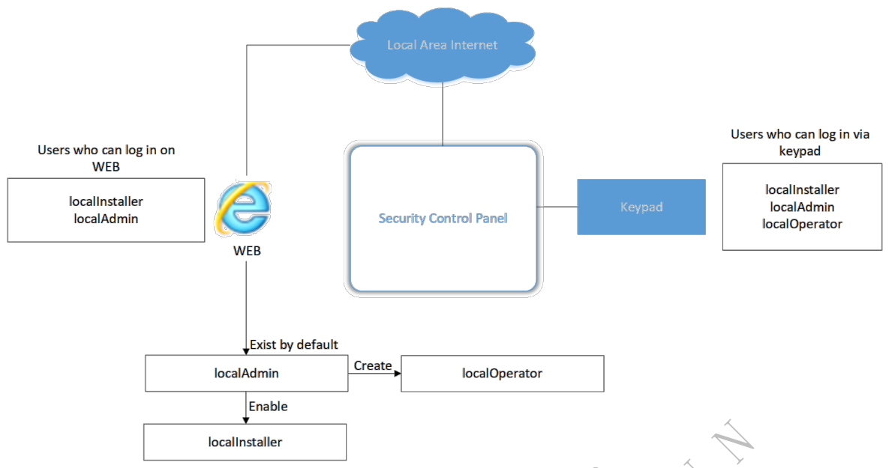
*Figure 21 — source page 51*

##### 5.13.1.2 Cloud Environment

In a cloud environment, four types of users are involved: `cloudAdmin`, `cloudOperator`, `localInstaller`, and `localOperator`. After logging in to the device on HC application via cloud, a `cloudAdmin` can be created. Then, the `cloudAdmin` can share the device to create a `cloudOperator`. Note that after a `cloudAdmin` is created, the existing `localAdmin` will expire. Users who have been set with the keypad password can log via keypad.

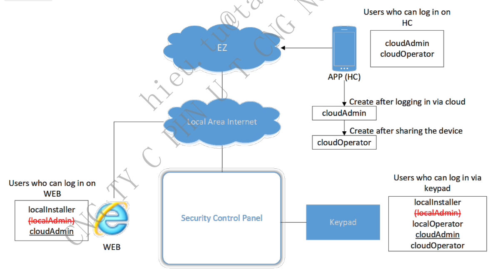
*Figure 22 — source page 51*

##### 5.13.1.3 HPP Installer Environment

In an HPP installer environment, five types of users are involved: `cloudAdmin`, `cloudOperator`, `localOperator`, `installerAdmin`, and `installerEmployee`. After a device is added to HPC, the user adding protocol will be applied, and `installerAdmin` and `installerEmployee` can be created (batch creating is supported). Note that after an `installerAdmin` is created, the existing `localInstaller` will expire. Users who have been set with the keypad password can log via keypad.

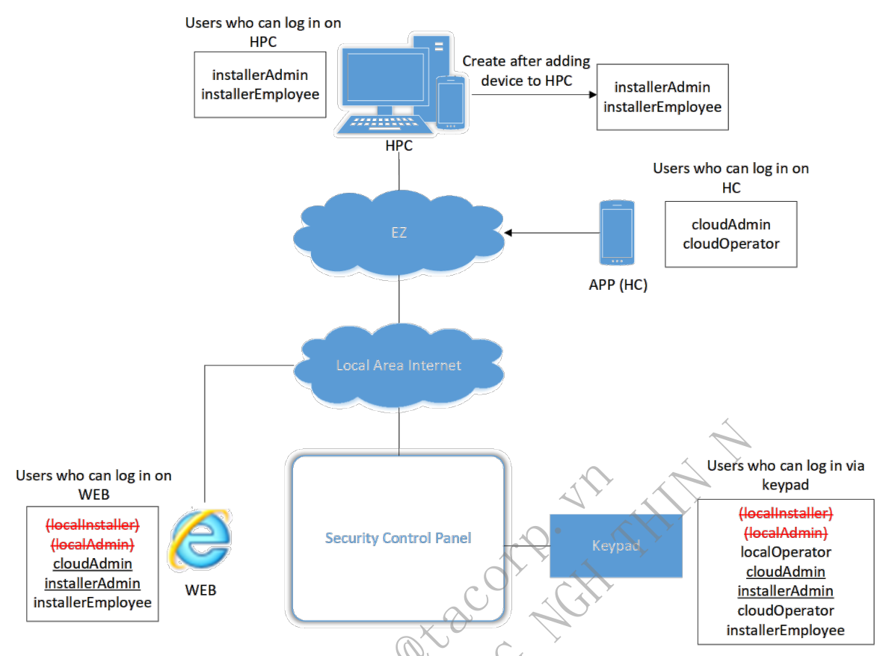
*Figure 23 — source page 52*

**Figure 23 redrawn — User types and their login entries**

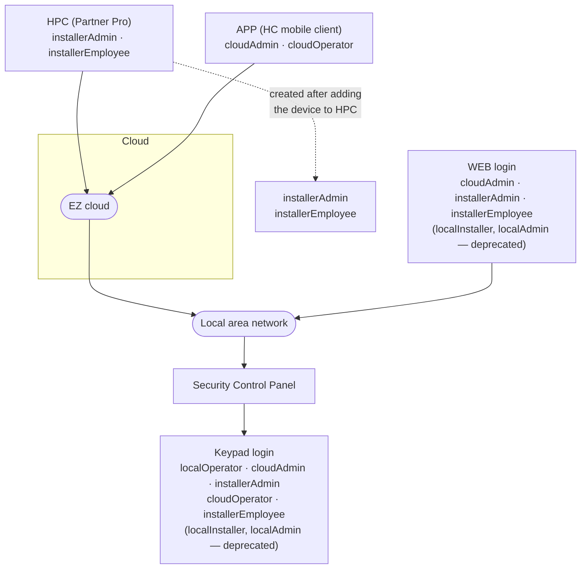
```mermaid
flowchart TB
    subgraph CLOUD["Cloud"]
        EZ(["EZ cloud"])
    end
    HPC["HPC (Partner Pro)<br/>installerAdmin · installerEmployee"] --> EZ
    HPC -. "created after adding<br/>the device to HPC" .-> HPCU["installerAdmin<br/>installerEmployee"]
    APP["APP (HC mobile client)<br/>cloudAdmin · cloudOperator"] --> EZ
    EZ --> LAN(["Local area network"])
    WEB["WEB login<br/>cloudAdmin · installerAdmin · installerEmployee<br/>(localInstaller, localAdmin — deprecated)"] --> LAN
    LAN --> SCP["Security Control Panel"]
    SCP --> KP["Keypad login<br/>localOperator · cloudAdmin · installerAdmin<br/>cloudOperator · installerEmployee<br/>(localInstaller, localAdmin — deprecated)"]
```

#### 5.13.2 User Permissions

| User Type / Permission | Local Admin | Local Installer | Local Operator | Cloud Admin | Cloud Operator | Installer Admin | Installer Employee |
| --- | --- | --- | --- | --- | --- | --- | --- |
| Arming | √ | √ | √ | √ | √ | √ | √ |
| Disarming (Alarm Clearing) | √ | √ | √ | √ | √ | √ | √ |
| Bypass | √ | √ | × | √ | √ | √ | √ |
| View logs and status | √ | √ | × | √ | √ | √ | √ |
| Configure parameters | √ | √ | × | √ | × | √ | √ |
| Manage partitions | √ | √ | × | √ | × | √ | √ |
| Operate relays | √ | √ | one-time local operator: × temporary local operator: √ | √ | √ | √ | √ |
| Edit localAdmin's keypad password | √ | √ | × | × | × | √ | √ |
| Edit cloudAdmin's keypad password | × | √ | × | √ | × | √ | √ |
| Edit localInstaller's keypad password | × | √ | × | × | × | × | × |

Edit

| d t installerAdmin's keypad password | × | × | × | × | × | √ | × |
| --- | --- | --- | --- | --- | --- | --- | --- |
| Edit installerEmployee's keypad password | × | × | × | × | × | √ | √ (only the employee's own password) |
| Edit localOperator's keypad password | √ | √ | × | √ | × | √ | √ |
| Edit cloudOperator's keypad password | × | √ | × | √ | √ (only the operator's own password) | √ | √ |
| Edit localAdmin's permission | × | × | × | × | × | × | × |
| Edit cloudAdmin's permission | × | × | × | × | × | × | × |
| Edit localInstaller's permission | √ | × | × | √ | × | × | × |
| Edit installerAdmin's permission | √ | × | × | √ | × | × | × |
| Edit installerEmployee's permission | √ | × | × | √ | × | × | × |
| Edit localOperator's permission | √ | √ | × | √ | × | √ | √ |
| Edit cloudOperator's permission | × | √ | × | √ | × | √ | √ |

Note: "Configure parameters" includes parameters of zones, sounders, keypads, card readers, keyfobs, cards, relays, repeaters, transmitters, network cameras, partitions, and so on.

#### 5.13.3 Manage User Information

##### 5.13.3.1 Local User

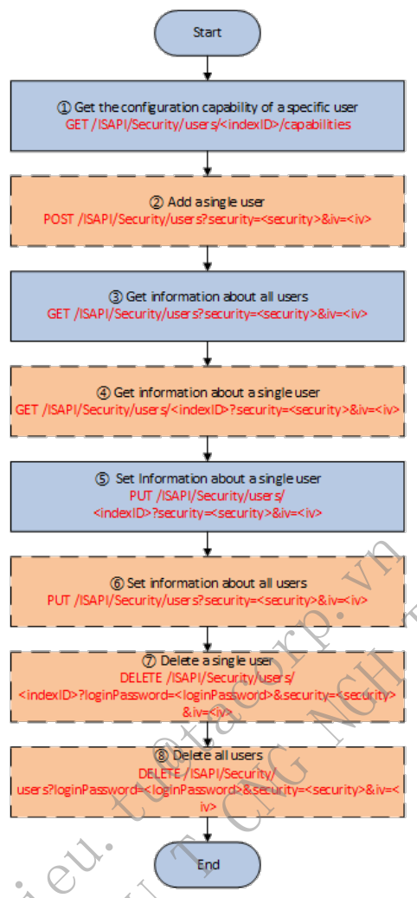
*Figure 24 — source page 54*

**Figure 24 redrawn — User management**

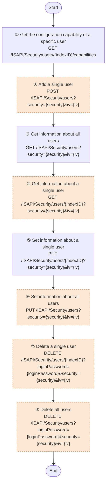
```mermaid
flowchart TD
    S([Start]) --> A1["① Get the configuration capability of a specific user<br/>GET /ISAPI/Security/users/{indexID}/capabilities"]
    A1 --> A2["② Add a single user<br/>POST /ISAPI/Security/users?security={security}&iv={iv}"]
    A2 --> A3["③ Get information about all users<br/>GET /ISAPI/Security/users?security={security}&iv={iv}"]
    A3 --> A4["④ Get information about a single user<br/>GET /ISAPI/Security/users/{indexID}?security={security}&iv={iv}"]
    A4 --> A5["⑤ Set information about a single user<br/>PUT /ISAPI/Security/users/{indexID}?security={security}&iv={iv}"]
    A5 --> A6["⑥ Set information about all users<br/>PUT /ISAPI/Security/users?security={security}&iv={iv}"]
    A6 --> A7["⑦ Delete a single user<br/>DELETE /ISAPI/Security/users/{indexID}?loginPassword={loginPassword}&security={security}&iv={iv}"]
    A7 --> A8["⑧ Delete all users<br/>DELETE /ISAPI/Security/users?loginPassword={loginPassword}&security={security}&iv={iv}"]
    A8 --> E([End])
    classDef opt fill:#fde8d5,stroke:#c8763a,stroke-dasharray:4 3;
    class A2,A4,A6,A7,A8 opt;
```

1. Get the configuration capability of a specific user: GET /ISAPI/Security/users//capabilities

2. (Optional) Add a user: POST /ISAPI/Security/users?security=&iv=. The nodes userName, password,

keypadPassword, and loginPassword in the message will be encrypted.

3. Get information of all users: GET /ISAPI/Security/users?security=&iv=. The nodes phoneNum, emailAddress,

password, duressPassword, keypadPassword, and loginPassword in the message will be encrypted.

4. Get information of a single user: GET /ISAPI/Security/users/?security=&iv=. The index in the URL is the user ID.

5. Set permissions for a single user: PUT /ISAPI/Security/users/?security=&iv=. The index in the URL is the user ID.

6. (Optional) Set information of all users: PUT /ISAPI/Security/users?security=&iv=. This API can be called for batch

configuring user information.

7. (Optional) Delete a single user: DELETE /ISAPI/Security/users/?loginPassword=&security=&iv=. Delete the user by

indexID, and loginPassword is required for deleting the user. The loginPassword should be encrypted.

8. (Optional) Delete all users: DELETE /ISAPI/Security/users?loginPassword=&security=&iv=. loginPassword should

be encrypted.

##### 5.13.3.2 Cloud User

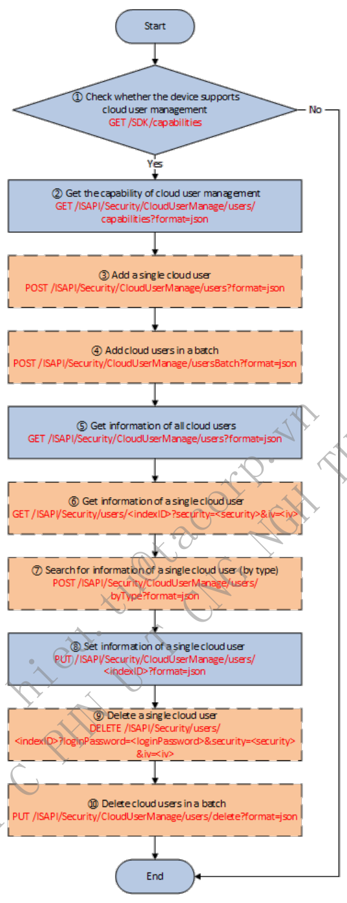
*Figure 25 — source page 55*

**Figure 25 redrawn — Cloud user management**

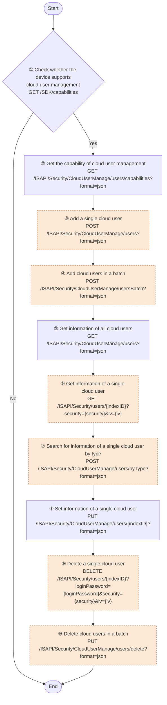
```mermaid
flowchart TD
    S([Start]) --> Q{"① Check whether the device supports<br/>cloud user management<br/>GET /SDK/capabilities"}
    Q -- No --> E([End])
    Q -- Yes --> A2["② Get the capability of cloud user management<br/>GET /ISAPI/Security/CloudUserManage/users/capabilities?format=json"]
    A2 --> A3["③ Add a single cloud user<br/>POST /ISAPI/Security/CloudUserManage/users?format=json"]
    A3 --> A4["④ Add cloud users in a batch<br/>POST /ISAPI/Security/CloudUserManage/usersBatch?format=json"]
    A4 --> A5["⑤ Get information of all cloud users<br/>GET /ISAPI/Security/CloudUserManage/users?format=json"]
    A5 --> A6["⑥ Get information of a single cloud user<br/>GET /ISAPI/Security/users/{indexID}?security={security}&iv={iv}"]
    A6 --> A7["⑦ Search for information of a single cloud user by type<br/>POST /ISAPI/Security/CloudUserManage/users/byType?format=json"]
    A7 --> A8["⑧ Set information of a single cloud user<br/>PUT /ISAPI/Security/CloudUserManage/users/{indexID}?format=json"]
    A8 --> A9["⑨ Delete a single cloud user<br/>DELETE /ISAPI/Security/users/{indexID}?loginPassword={loginPassword}&security={security}&iv={iv}"]
    A9 --> A10["⑩ Delete cloud users in a batch<br/>PUT /ISAPI/Security/CloudUserManage/users/delete?format=json"]
    A10 --> E
    classDef opt fill:#fde8d5,stroke:#c8763a,stroke-dasharray:4 3;
    class A3,A4,A6,A7,A9,A10 opt;
```

1. Check whether the device supports cloud user management: GET /SDK/capabilities. If the node value of

isSupportCloudUserManage is true, cloud user management is supported in these URLs:

/ISAPI/Security/CloudUserManage/users/capabilities?format=json

/ISAPI/Security/CloudUserManage/users/?format=json

/ISAPI/Security/CloudUserManage/users?format=json

2. Get the capability of cloud user management: GET /ISAPI/Security/CloudUserManage/users/capabilities?

format=json. If the node value of isSupportAddCloudUserList is true, it supports batch adding cloud users.

3. Add a single cloud user: POST /ISAPI/Security/CloudUserManage/users?format=json. The following cloud users

need to create the user accounts on their own: coludAdmin, installerAdmin, installerEmployee, and cloudOperator, which is different from localOperator who needs to be created by admin users. Enter information such as user

name, password, e-mail, and phone number to create a user account and put into use.

4. (Optional) Add cloud users in a batch: POST /ISAPI/Security/CloudUserManage/usersBatch?format=json. For

installerEmployee users that has been created on HPC, use this URL to apply them to the device and synchronize user information.

5. Get information of all cloud users: GET /ISAPI/Security/CloudUserManage/users?format=json

6. Get information of a single cloud user: GET /ISAPI/Security/CloudUserManage/users/?format=json

7. Search for information of a single cloud user (by type): /ISAPI/Security/CloudUserManage/users/byType?

format=json. Support searching by e-mail, phone number, and user name.

8. Set information of a single cloud user: PUT /ISAPI/Security/CloudUserManage/users/?format=json

9. Delete a single cloud user: DELETE /ISAPI/Security/CloudUserManage/users/?format=json. Delete the user by

specifying the user's indexID.

10. Delete cloud users in a batch: PUT /ISAPI/Security/CloudUserManage/users/delete?format=json. Support batch

deleting by user names, user types, phone numbers, and e-mails.

#### 5.13.4 Manage User Permissions

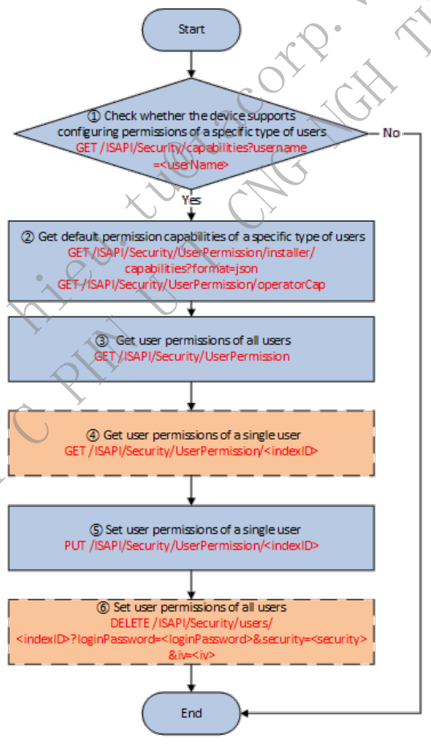
*Figure 26 — source page 56*

**Figure 26 redrawn — User permission management**

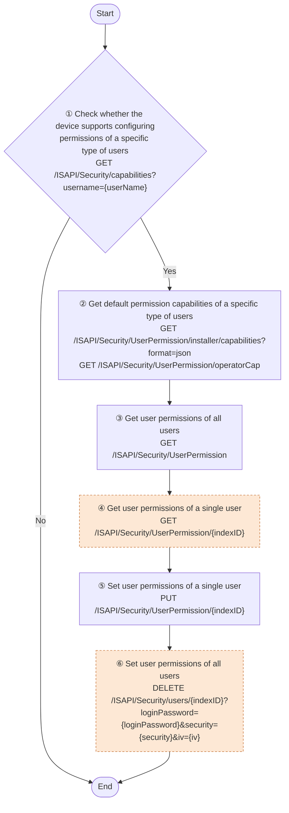
```mermaid
flowchart TD
    S([Start]) --> Q{"① Check whether the device supports configuring<br/>permissions of a specific type of users<br/>GET /ISAPI/Security/capabilities?username={userName}"}
    Q -- No --> E([End])
    Q -- Yes --> A2["② Get default permission capabilities of a specific type of users<br/>GET /ISAPI/Security/UserPermission/installer/capabilities?format=json<br/>GET /ISAPI/Security/UserPermission/operatorCap"]
    A2 --> A3["③ Get user permissions of all users<br/>GET /ISAPI/Security/UserPermission"]
    A3 --> A4["④ Get user permissions of a single user<br/>GET /ISAPI/Security/UserPermission/{indexID}"]
    A4 --> A5["⑤ Set user permissions of a single user<br/>PUT /ISAPI/Security/UserPermission/{indexID}"]
    A5 --> A6["⑥ Set user permissions of all users<br/>DELETE /ISAPI/Security/users/{indexID}?loginPassword={loginPassword}&security={security}&iv={iv}"]
    A6 --> E
    classDef opt fill:#fde8d5,stroke:#c8763a,stroke-dasharray:4 3;
    class A4,A6 opt;
```

1. Check whether the device supports configuring permissions of a specific type of users: GET

/ISAPI/Security/capabilities?username=. If the node value of isSupportInstallerCap is true, the installer users' permissions can be configured. There is no specific capability node for operator type users, and by default their permissions can be configured.

2. Get the default permission capabilities of a specific type of users.

For installer users: GET /ISAPI/Security/UserPermission/installer/capabilities?format=json

For operator users: GET /ISAPI/Security/UserPermission/operatorCap

3. Get user permissions of all users: GET /ISAPI/Security/UserPermission

4. (Optional) Get user permissions of a single user: GET /ISAPI/Security/UserPermission/. The index in the URL is the

user ID.

5. Set user permissions of a single user: PUT /ISAPI/Security/UserPermission/

6. (Optional) Set user permissions of all users: PUT /ISAPI/Security/UserPermission

---

← [4. Quick Start Guide](04-quick-start-guide.md) · [Index](README.md) · [6. Information Security](06-information-security.md) →
