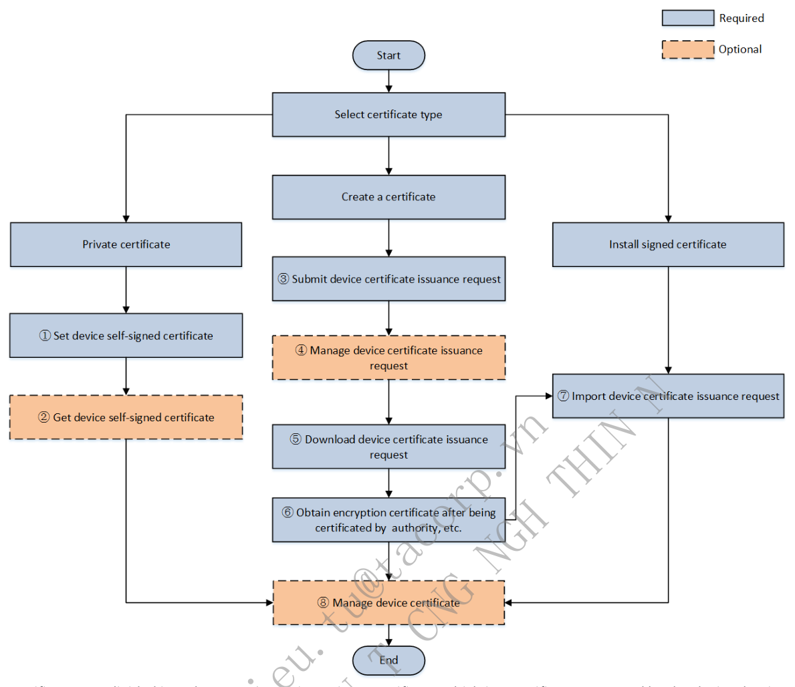
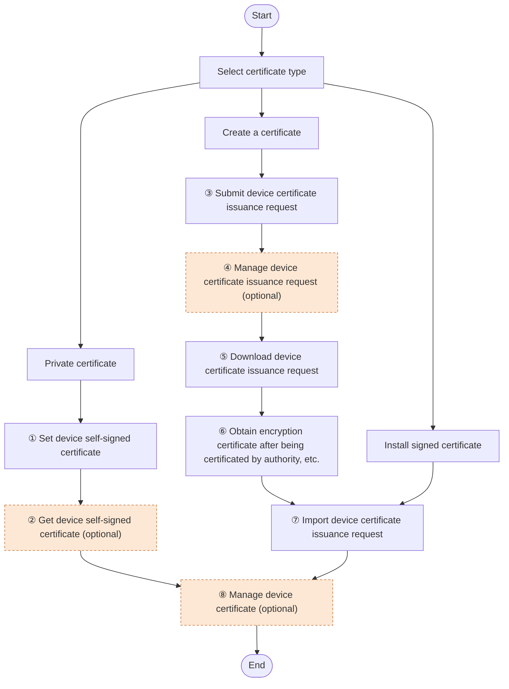

# 6. Information Security

> Part of the **ISAPI — Videowall Controller** developer guide. See [README.md](README.md) for the full index.

## Contents

- [6.1 . Certificate Management](#61-certificate-management)
  - [6.1.1 Introduction to the Function](#611-introduction-to-the-function)
  - [6.1.2 API Calling Flow](#612-api-calling-flow)

---

### 6.1 . Certificate Management

#### 6.1.1 Introduction to the Function

Certificate management is for device encryption, where certificates are used to verify the identities of the two communication sides. Certificates here are divided into client certificates and server certificates based on the direction of verification. The certificate contains the public key of the server, and the encryption protocol uses this public key to encrypt the communication content. The client uses the certificate to verify the server's identity and obtain the server's public key. The client and server use the encryption protocol to negotiate a symmetric encryption key for the following operations including encryption and decryption. Certificate management mainly involves creating, deleting, editing, and searching for certificates, as well as the request and import of various certificates.

#### 6.1.2 API Calling Flow

*Figure 27 — source page 58*

**Figure 27 redrawn — Certificate management**

Certificates are divided into three types: one is a private certificate, which is a certificate generated by the device that is not issued by an official certification authority, and it generates public and private keys; one is a custom certificate, which has been certified by another platform or authority. For this type of certificate, users need to create a certificate on the device, upload the generated certificate to the authority or platform for certification issuance, and then import the issued certificate into the device; one is to install a signed certificate, which has already been certified and can be installed directly. Private Certificate

1. Set device self-signed certificate: `PUT /ISAPI/Security/serverCertificate/selfSignCert`.

2. Get device self-signed certificate: `GET /ISAPI/Security/serverCertificate/selfSignCert`.

Create Certificate

3. Submit a request for device certificate issuance: `POST /ISAPI/Security/serverCertificate/certSignReq?`

`platformNo=<platformNo>&type=<type>&security=<security>&iv=<iv>`. Note: `type` indicates certificate types.

4. Manage device certificate issuance request

Get device certificate issuance request: `GET /ISAPI/Security/serverCertificate/certSignReq?platformNo=` `<platformNo>&type=<type>&security=<security>&iv=<iv>`. Generate device certificate issuance request: `PUT /ISAPI/Security/serverCertificate/certSignReq?` `platformNo=<platformNo>&type=<type>&security=<security>&iv=<iv>`.

| DELETE /ISAPI/Security/serverCertificate/certSignReq&type= | = |
| --- | --- |

`<type>`.

5. Request for downloading device certificate issuance: `GET`

`/ISAPI/Security/serverCertificate/downloadCertSignReq?type=<type>&platformNo=<platformNo>&customID=` `<certificateID>`.

6. Obtain encryption certificate after being certificated by the authority

Upload the downloaded device certificate assurance request to the corresponding authority for authentication to obtain an encryption certificate, the private key and other files.

Install a Signed Certificate

7. Import device certificate issuance

Import device certificate issuance (binary): `PUT /ISAPI/Security/serverCertificate/certificate?type=` `<type>&platformNo=<platformNo>`. Import device certificate issuance: `POST /ISAPI/Security/serverCertificate/certificate?customID=` `<certificateID>&security=<security>&iv=<iv>`. `type` indicates certificate types, allowing to import different certificate types.

8. Device certificate management

Manage certificates such as getting and deleting after importing them to the device. Get certificate information of all devices: `GET /ISAPI/Security/serverCertificate/certificate?type=` `<type>&platformNo=<platformNo>`. Get certificate information of a single device: `GET`

|  | /ISAPI/Security/serverCertificate/certificates/<certificateID>?format=json |
| --- | --- |

Delete certificate information of a single device: `DELETE`

|  | /ISAPI/Security/serverCertificate/certificates/<certificateID>?format=json |
| --- | --- |

| DELETE /ISAPI/Security/serverCertificate/certificate?type=<type>&platformNo= |  |
| --- | --- |

`<platformNo>`. Certificate Expiration Get device system capabilities `/ISAPI/System/capabilities`, if node `isSupportCertificateRevocation` exists and is true, the device supports this feature.

| Get the capability of configuring certificate expiration: G |  | GET |
| --- | --- | --- |
|  | /ISAPI/Security/deviceCertificate/certificateRevocation/capabilities?format=json |  |

| GET /ISAPI/Security/deviceCertificate/certificateRevocation? |  |
| --- | --- |

`format=json`.

| PUT /ISAPI/Security/deviceCertificate/certificateRevocation? |  |
| --- | --- |

`format=json`. Get linkage parameters of certificate expiration: `GET /ISAPI/Event/triggers/certificateRevocation-<channelID>`. Set linkage parameters of certificate expiration: `PUT /ISAPI/Event/triggers/certificateRevocation-<channelID>`. Get triggering method of certificate expiration linkage: `GET /ISAPI/Event/triggers/certificateRevocation-` `<channelID>/notifications`. Set triggering method of certificate expiration linkage: `PUT /ISAPI/Event/triggers/certificateRevocation-` `<channelID>/notifications`. Relate event: `"eventType": "certificateRevocation"`.

---

← [5. Device Management (General)](05-device-management.md) · [Index](README.md) · [7. Video (General)](07-video-general.md) →
