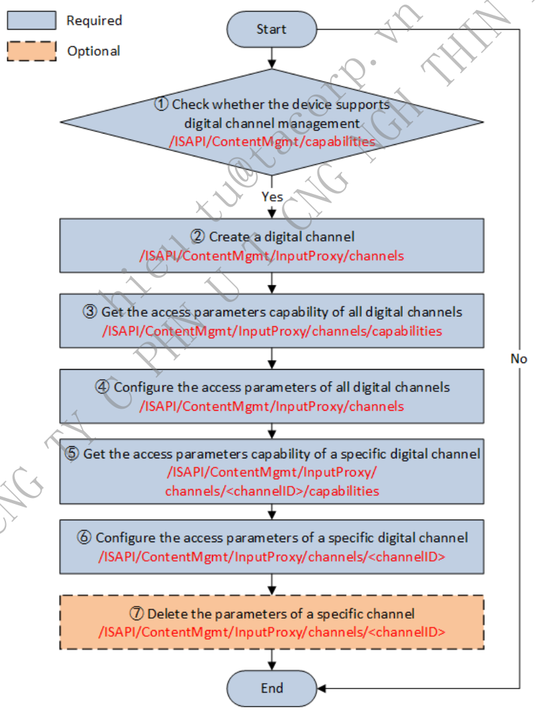
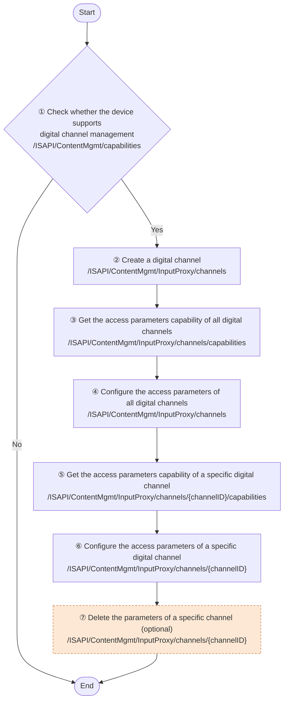
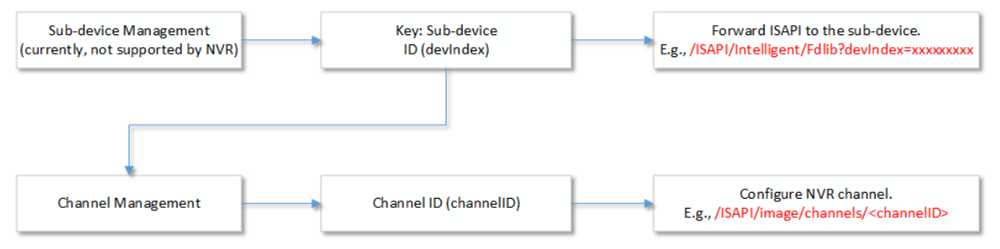
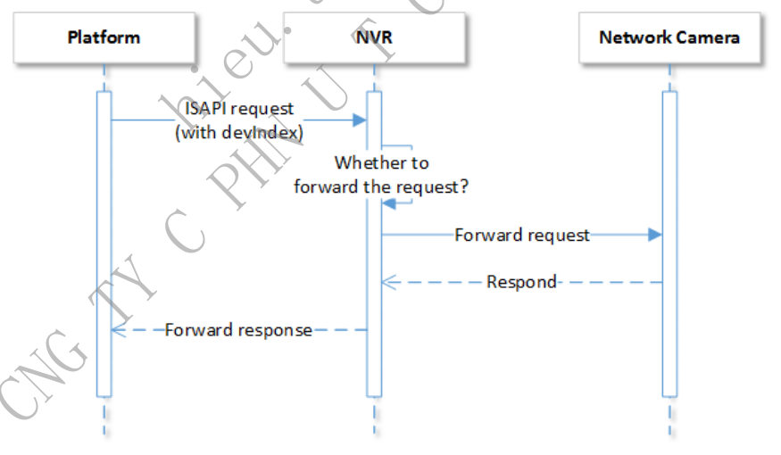
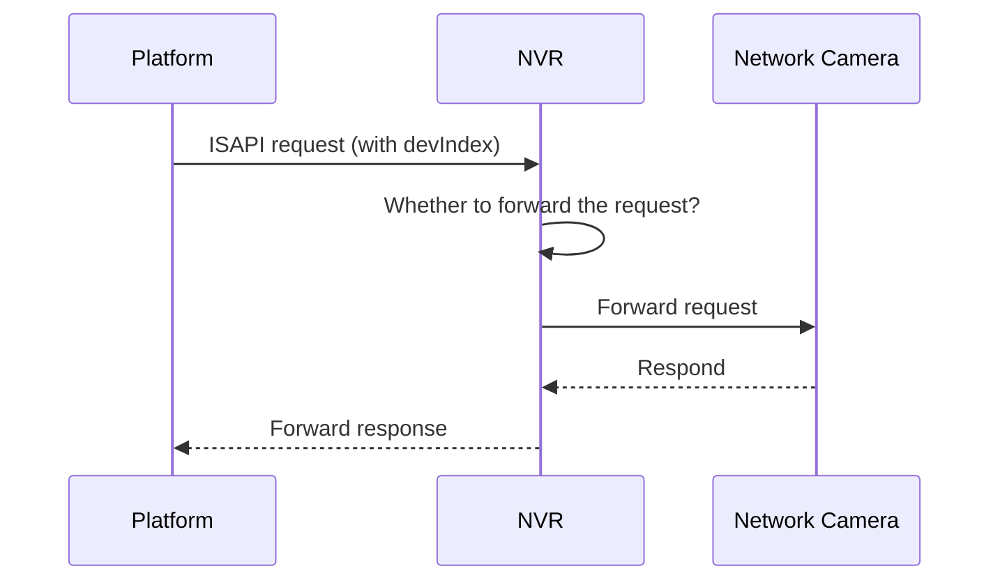
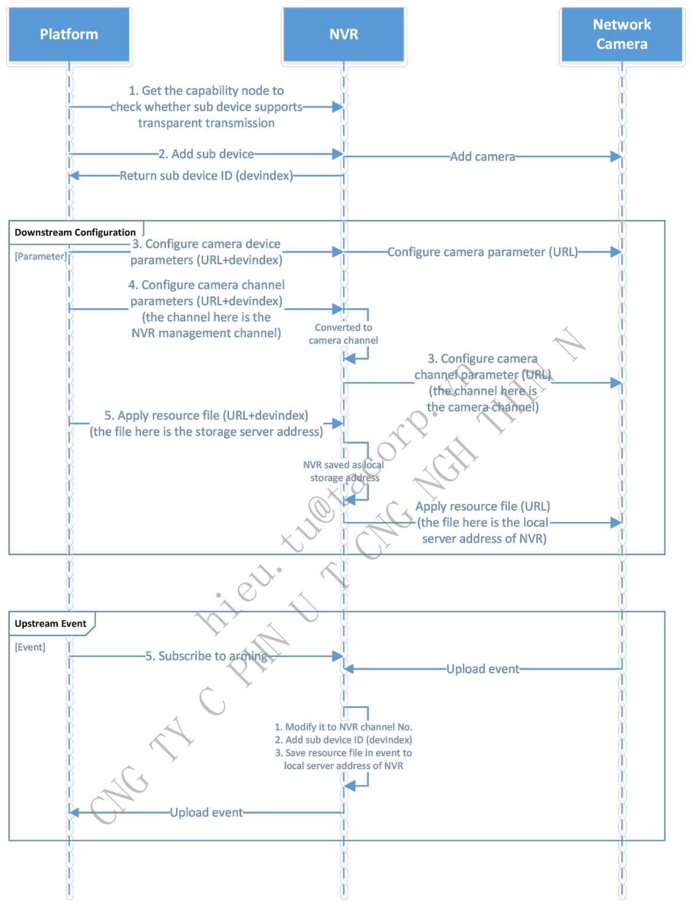
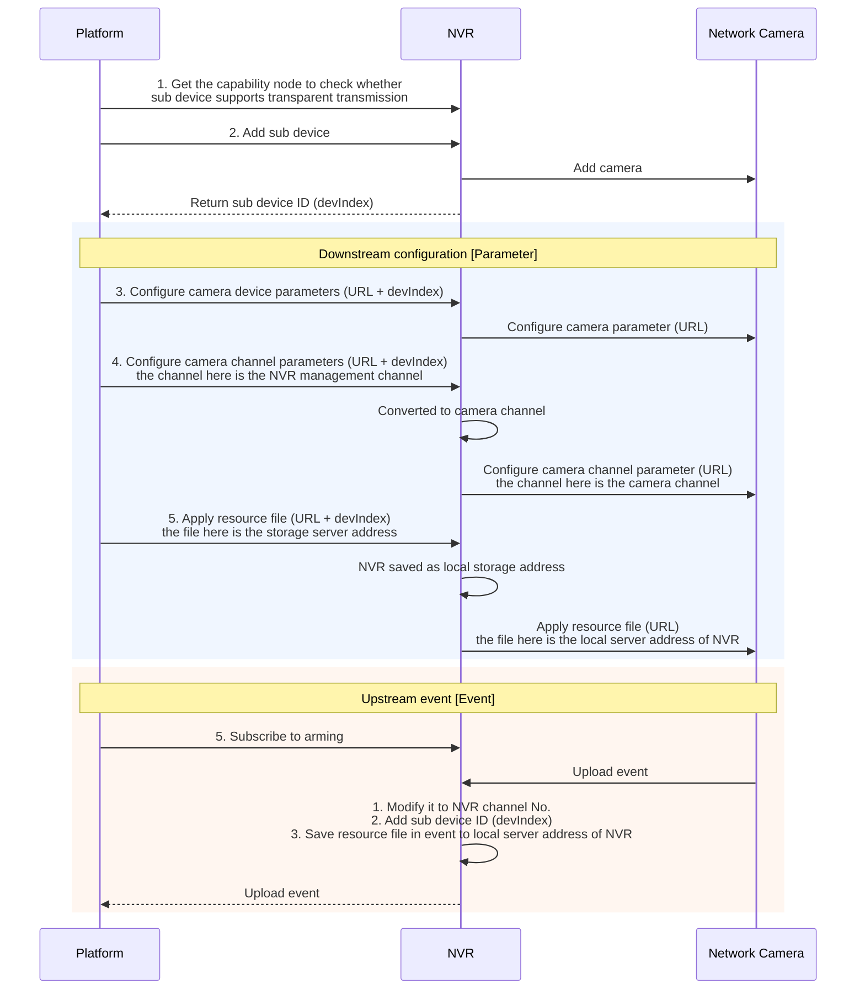

# 7. Video (General)

> Part of the **ISAPI — Videowall Controller** developer guide. See [README.md](README.md) for the full index.

## Contents

- [7.1 Digital Channel Access Management](#71-digital-channel-access-management)
  - [7.1.1 Introduction to the Function](#711-introduction-to-the-function)
  - [7.1.2 API Calling Flow](#712-api-calling-flow)
  - [7.1.3 Video Channel Application](#713-video-channel-application)
- [7.2 Sub-device's Transparent Transmission](#72-sub-devices-transparent-transmission)
  - [7.2.1 Introduction to the Function](#721-introduction-to-the-function)
  - [7.2.2 API Calling Flow](#722-api-calling-flow)

---

### 7.1 Digital Channel Access Management

#### 7.1.1 Introduction to the Function

Video channel includes analog channel and digital channel. The service involves channel access protocols, streaming protocols, address information, version No. of channel access firmware, and so on. Analog channel refers to the local video channels of the device. Digital channel refers to the video channels accessed by the device by IP address or POE port (e.g., NVR accessing the video channel of network camera). Analog channel No. and digital channel No. are unique. Devices that do not support digital channels will only return analog channel No. For example, analog channel No. ranges from 1 to 8 (determined by the number of analog channel ports of the device), digital channel No. ranges from 9 to 32 (within the maximum number of digital channels, determined by the number of added network cameras).

#### 7.1.2 API Calling Flow

*Figure 28 — source page 60*

**Figure 28 redrawn — Digital channel management**

1. Get the capability node to check whether the device supports digital channel management: `GET`

`/ISAPI/ContentMgmt/capabilities`. If the value of the node `iSptInputProxyChanCap` is true, it indicates that the

|  | /ISAPI/ContentMgmt/capabilities |
| --- | --- |

device supports digital channel management.

2. Add digital channels: `POST /ISAPI/ContentMgmt/InputProxy/channels?security=<security>&iv=<iv>`.

| 3. Get the access parameters capability of all digital channels: |  | GET |
| --- | --- | --- |
|  | /ISAPI/ContentMgmt/InputProxy/channels/capabilities?security=<security>&iv=<iv>. |  |

4. Configure the access parameters of all digital channels:

Get: `GET /ISAPI/ContentMgmt/InputProxy/channels?security=<security>&iv=<iv>`. Configure: `PUT /ISAPI/ContentMgmt/InputProxy/channels?security=<security>&iv=<iv>`.

5. Get the capability of configuring the access parameters of a specific digital channel: `GET`

|  | /ISAPI/ContentMgmt/InputProxy/channels/<channelID>/capabilities |
| --- | --- |

6. Configure the access parameters of a specific digital channel:

Get: `GET /ISAPI/ContentMgmt/InputProxy/channels/<channelID>?security=<security>&iv=<iv>`. Configure: `PUT /ISAPI/ContentMgmt/InputProxy/channels/<channelID>?security=<security>&iv=<iv>`.

| 7. Delete the parameters of a specific digital channel: |  | DELETE |  |
| --- | --- | --- | --- |
|  | /ISAPI/ContentMgmt/InputProxy/channels/<channelID> |  | . |

#### 7.1.3 Video Channel Application

1.Get the list of video channels, which is the sum of digital channels and analog channels. Digital channels and analog channels need to be obtained separately:

1. Call "Get all video input channel parameters" to get all analog channels via GET

/ISAPI/System/Video/inputs/channels and VideoInputChannelList parameter is returned. The id represents the analog channel No.

2. Call the "Get all digital channel access parameters" to get all digital channels via GET

/ISAPI/ContentMgmt/InputProxy/channels?security=&iv= and InputProxyChannelList parameter is returned. The id represents the digital channel No.

2. Video channel function configuration supports unified configuration of analog and digital channels. Both the analog

| face starting with | /ISAPI/System/Video/inputs/channels/<channelID>/ |  |
| --- | --- | --- |
| /ISAPI/ContentMgmt/InputProxy/channels/<channelID>/ |  |  |
| configuration interface starting with |  | /ISAPI/System/Video/inputs/channels/<channelID>/, |

**<channelID> represents all channel No.s supported by the device, including analog channels and digital**

**channels.**

|  |  | /ISAPI/System/Video/inputs/channels/<channelID>/overlays |
| --- | --- | --- |
|  |  | /ISAPI/ContentMgmt/InputProxy/channels/<channelID>/overlays |
|  |  | /ISAPI/System/Video/inputs/channels/<channelID>/overlays |

### 7.2 Sub-device's Transparent Transmission

#### 7.2.1 Introduction to the Function

In actual application scenarios, the NVR being used is generally not the latest version, if an IPC with latest functions is added to the system, the NVR will fail to recognize the IPC's new functions due to version incompatibility, so the platform (including device access platforms, client softwares, device's web plug-ins, etc, hereinafter referred to as the platform) will fail to operate new functions of the IPC. Besides, in video channel resource management, the platform can only get information about digital channels (also known as IP channels) added to the NVR, but not the device that the channels belong to. For example, two video channels (channel 13 and channel 18) of a dual-lens people counting camera are added to the NVR. The platform can only get that digital channel 13 and 18 are added to the NVR, but not that the two channels belong to one camera. Such information loss may lead to repeated operations, which will further cause problems in actual practices. For example, users may fail to upgrade IPC via digital channel No. if not knowing the relationship between camera and digital channel.

To settle above problems, the sub-device's transmission function is introduced to the video channel resources management. In this way, users can directly access to the device of the digital channels via the devIndex (sub-device index) allocated to the device by NVR. Notably, despite the introduction of the sub-device's transparent transmission function, the NVR does not function as an access gateway, and so it does not function with sub-device management on gateway. Refer to the Sub-device Management of Device Management for details.

*Figure 29 — source page 62*

Steps are as follows:

1. First, the platform will check whether the NVR supports sub-device's transparent transmission. If it is supported,

follow the next step. Second, add devIndex to the request URL.

2. For the ISAPI request sent to the NVR by the platform, if it contains devIndex, it will be forwarded to the specific

sub-device; otherwise, the NVR will respond to the request.

3. When the request is forwarded to the sub-device by the NVR, delete the devIndex in the request URL so as to

realize ISAPI interaction.

For example:

1. Send the request URL (`GET /ISAPI/System/deviceInfo`) to get the information of the platform's NVR device.

2. Send the request URL (`GET /ISAPI/System/deviceInfo?devIndex=<devIndex>`) to get the information of a specific

sub-device of the NVR.

*Figure 30 — source page 62*

**Figure 30 redrawn — NVR request forwarding**

**Note:**

1. This function is applicable to transitory connections, while inapplicable to persistent connections (e.g., arming

subscription, two-way audio).

2. It is required to delete the devIndex in the URL before NVR forwards the ISAPI request.

3. For the VCA function of NVR, the transmission solution of sub-devices is not adopted. You can switch the analysis

unit by the following URI: /ISAPI/Smart/analysisUnitSwitch/channels/`<channelID>`/event/`<EventType>`.

#### 7.2.2 API Calling Flow

*Figure 31 — source page 63*

**Figure 31 redrawn — Transparent transmission via NVR**

1. Get the capability node to check whether the device supports transparent transmission. If the value of the node

`isSupportDevIndex` is true, it indicates that the device supports transparent transmission.

2. Create digital channels: `POST /ISAPI/ContentMgmt/InputProxy/channels?security=<security>&iv=<iv>`. The

sub device ID`devindex` will be returned.

| GET /ISAPI/ContentMgmt/InputProxy/channels?security= |  |
| --- | --- |

`<security>&iv=<iv>`. Each digital channel information contains one parameter `devIndex`, which is the same for digital channels of a same physical device.

|  |  |  |  | devIndex=<devIndex> |
| --- | --- | --- | --- | --- |
| For example, you can send |  | 12345678 | (the request |  |
|  | /ISAPI/System/deviceInfo?devIndex=12345678 |  |  |  |

of a video channel, the platform will apply the channel managed by NVR, and before applying, the NVR will transform channel into the video channel. 2) When the platform applies the storage address of resource files, the camera cannot access the storage service to get resource files because of the network isolation between the camera and platform, so the storage address must be saved as a local storage address by the NVR before being applied.

---

← [6. Information Security](06-information-security.md) · [Index](README.md) · [8. Decoding and Video Wall](08-decoding-and-video-wall.md) →
