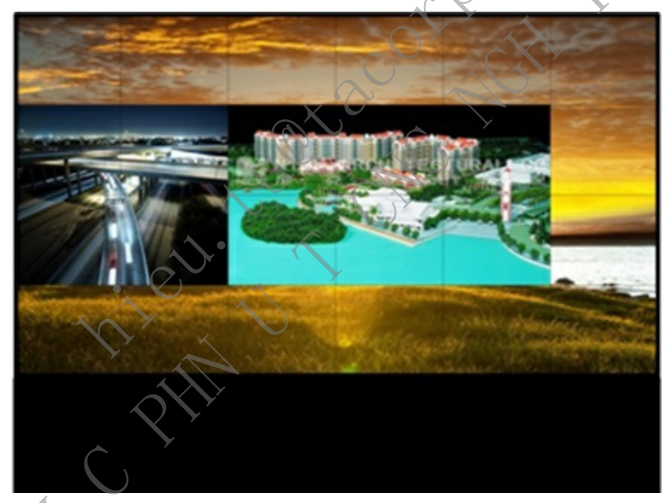
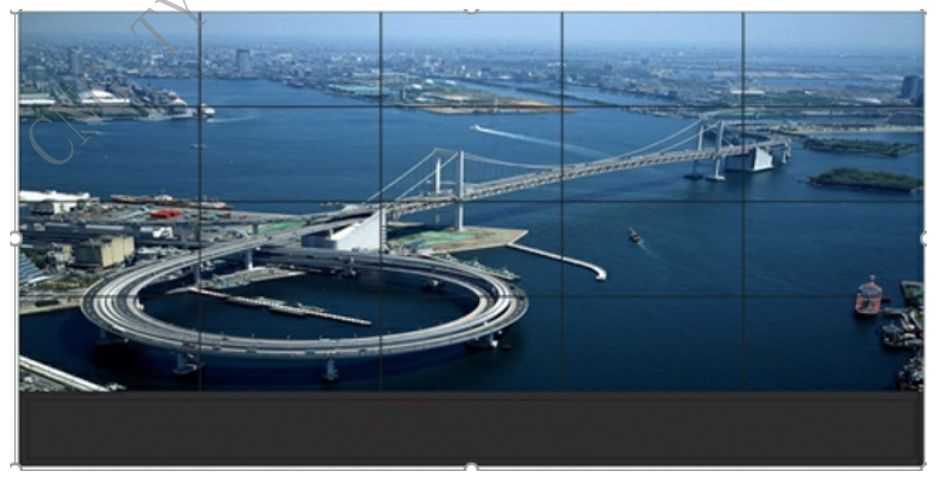
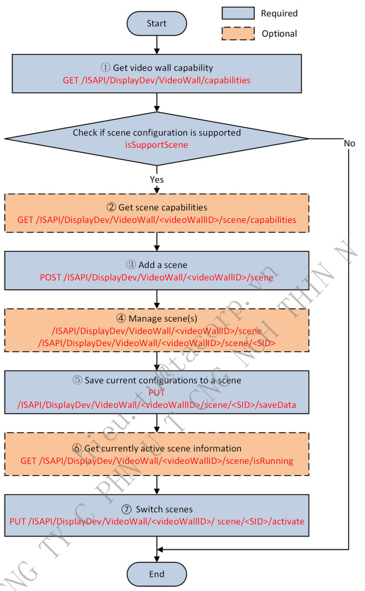
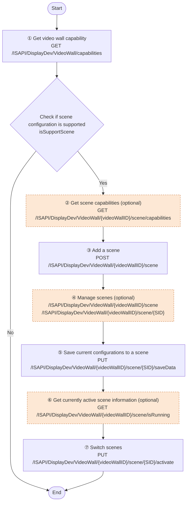
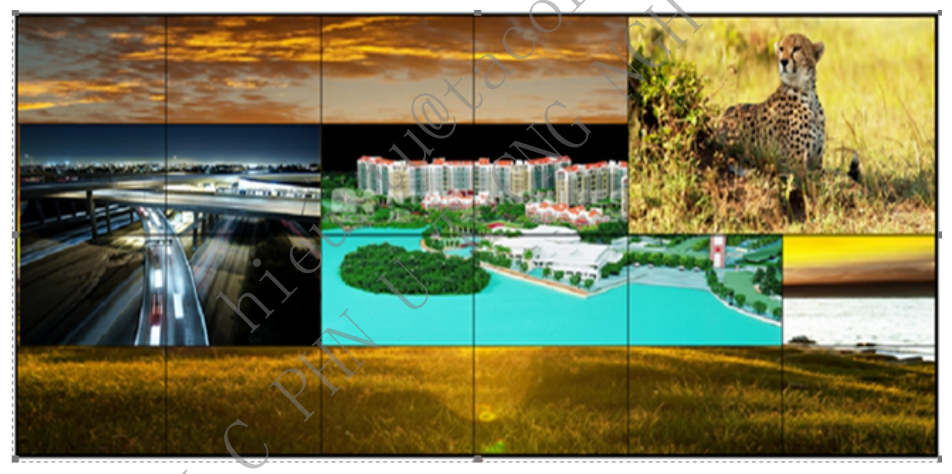
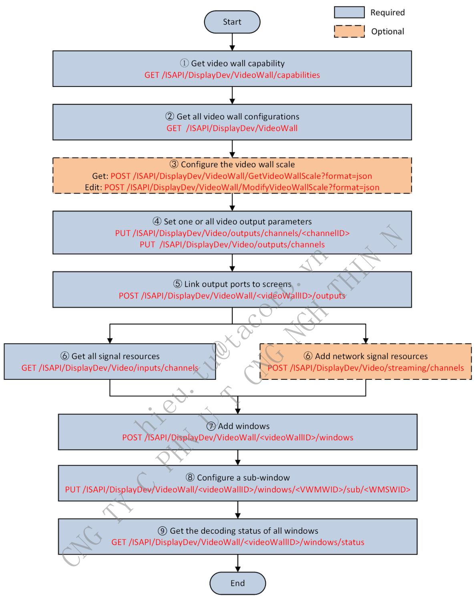
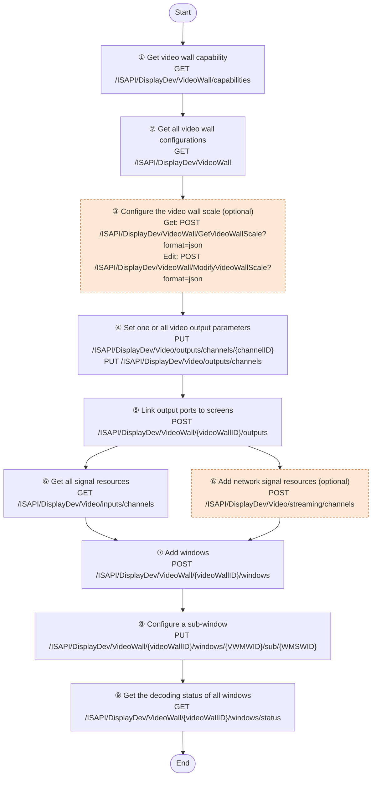

# 8. Decoding and Video Wall

> Part of the **ISAPI — Videowall Controller** developer guide. See [README.md](README.md) for the full index.

## Contents

- [8.1 Video Wall Scenes](#81-video-wall-scenes)
  - [8.1.1 Function Introduction](#811-function-introduction)
  - [8.1.2 API Calling Flow](#812-api-calling-flow)
- [8.2 Window Opening on Video Wall](#82-window-opening-on-video-wall)
  - [8.2.1 Function Introduction](#821-function-introduction)
  - [8.2.2 API Calling Flow](#822-api-calling-flow)

---

### 8.1 Video Wall Scenes

#### 8.1.1 Function Introduction

For example: A security monitoring center needs to view two different monitoring feeds.

Save Feed 1 as Scene 1

Save Feed 2 as Scene 2

Switching between feeds is implemented via scene switching.

*Figure 32 — source page 64*

Feed 1

*Figure 33 — source page 64*

Feed 2

#### 8.1.2 API Calling Flow

*Figure 34 — source page 65*

**Figure 34 redrawn — Video wall scene configuration and switching**

1. Get video wall capability.

URL: `GET /ISAPI/DisplayDev/VideoWall/capabilities` . If `isSupportScene` is returned with `true` value, the device supports scene configuration and switching.

2. (Optional) Get scene capabilities.

URL: `GET /ISAPI/DisplayDev/VideoWall/<videoWallID>/scene/capabilities`. The maximum scenes supported by device is defined by field (`maxSceneNums`) .

3. Add a scene.

URL: `POST /ISAPI/DisplayDev/VideoWall/<ID>/scene`. If succeeded, the new created scene ID is returned in `ResponseStatus`.

4. (Optional) Scene management.

Get, set, or delete all scenes of a specified video wall: `GET` or `PUT` or `DELETE` `/ISAPI/DisplayDev/VideoWall/<videoWallID>/scene`. Get, set, or delete a single scene: `GET` or `PUT` or `DELETE` `/ISAPI/DisplayDev/VideoWall/<videoWallID>/scene/<SID>`.

5. Save current configurations to a scene.

URL: `PUT /ISAPI/DisplayDev/VideoWall/<videoWallID>/scene/<SID>/saveData`.

6. (Optional) Get the information about currently active scene on the video wall.

URL: `GET /ISAPI/DisplayDev/VideoWall/<videoWallID>/scene/isRunning`.

7. Switch scenes.

URL: `PUT /ISAPI/DisplayDev/VideoWall/<videoWallID>/scene/<SID>/activate`.

### 8.2 Window Opening on Video Wall

#### 8.2.1 Function Introduction

Security monitoring centers display real-time videos from multiple cameras or local signal sources on video wall. The image below shows the effect of displaying multiple signal sources via window layouts on a video wall.

*Figure 35 — source page 66*

#### 8.2.2 API Calling Flow

*Figure 36 — source page 67*

**Figure 36 redrawn — Window opening on video wall**

1. Get video wall capabilities.

URL: `GET /ISAPI/DisplayDev/VideoWall/capabilities`. The supported maximum video walls is returned in field (`maxWallNums`), and maximum windows is (`maxWindowNums`).

2. Get all video wall configurations.

URL: `GET /ISAPI/DisplayDev/VideoWall`.

3. (Optional) Configure the video wall scale (such as the video wall row count, column count, row height, and column

width).

Get the video wall scale: `POST /ISAPI/DisplayDev/VideoWall/GetVideoWallScale?format=json`. Edit the video wall scale: `POST /ISAPI/DisplayDev/VideoWall/ModifyVideoWallScale?format=json` .

4. Set one or all video output parameters.

Get or set all video output parameters: `GET` or `PUT` `/ISAPI/DisplayDev/Video/outputs/channels`. Get or set a video output parameters: `GET` or `PUT` `/ISAPI/DisplayDev/Video/outputs/channels/<channelID>`.

5. Link output ports to screens.

URL: `POST /ISAPI/DisplayDev/VideoWall/<videoWallID>/outputs`.

6. Manage signal sources, including local and network signal sources.

Get all signal resources from devices: `POST /ISAPI/DisplayDev/Video/streaming/channels`. (Optional) Add network signal resources: `POST /ISAPI/DisplayDev/Video/streaming/channels`.

7. Add windows. Specify a signal resource, and open windows on a specified video wall.

URL: `POST /ISAPI/DisplayDev/VideoWall/<videoWallID>/windows`.

8. Configure a sub-window. Link a signal resource to a sub-window to get, decode, and display the stream.

URL: `PUT /ISAPI/DisplayDev/VideoWall/<videoWallID>/windows/<VWMWID>/sub/<WMSWID>`.

9. Get the decoding status of all windows.

URL: `GET /ISAPI/DisplayDev/VideoWall/<videoWallID>/windows/status`.

---

← [7. Video (General)](07-video-general.md) · [Index](README.md) · [9A. API Reference](09A-api-reference.md) →
