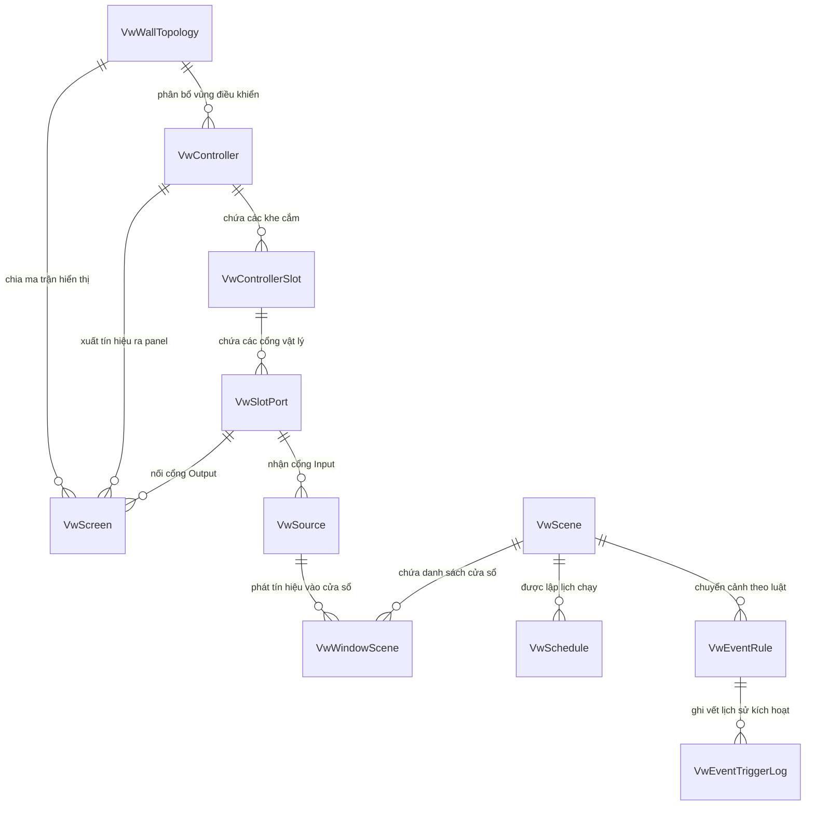

# BÁO CÁO PHÂN TÍCH TOÀN BỘ CƠ SỞ DỮ LIỆU PHÂN HỆ VIDEO WALL (TIỀN TỐ `Vw`)
> **Môi trường:** Staging Database (`10.10.8.30:1433 / DEV_ITS10`)  
> **Phân hệ nghiệp vụ:** Quản lý Tường Màn Hình Trung Tâm Điều Hành (Video Wall Management System - VWMS)  
> **Mục tiêu:** Phân tích chi tiết toàn bộ các bảng, các trường dữ liệu, quan hệ thực thể (ERD), nghiệp vụ vận hành và kiến trúc điều khiển Video Wall.

---

## 1. TỔNG QUAN HỆ THỐNG & DANH SÁCH BẢNG (`Vw%`)

Hệ thống quản trị Video Wall bao gồm **11 bảng thực thể chính** chịu trách nhiệm toàn trình từ cấu hình phần cứng (Controller, Card, Slot, Port, Màn hình), nguồn cấp tín hiệu (Camera RTSP, Web URL, HDMI...), quản lý bố cục kịch bản phát (Scene, Window), tự động hóa lập lịch (Schedule) và tự động chuyển đổi cảnh báo thời gian thực theo sự kiện giao thông ITS (Event Rule & Log).

### Danh mục tổng hợp 11 bảng:

| STT | Tên bảng | Số lượng cột | Số bản ghi (Staging) | Chức năng nghiệp vụ chính |
|:---:|:---|:---:|:---:|:---|
| 1 | `VwWallTopology` | 15 | 1 | Cấu hình ma trận kích thước và bố cục tổng thể của bức tường màn hình (Rows x Cols) |
| 2 | `VwController` | 29 | 4 | Quản lý thiết bị phần cứng bộ điều khiển Matrix/Video Wall Controller (IP, Account, Vùng phụ trách) |
| 3 | `VwControllerSlot` | 18 | 48 | Quản lý các khe cắm card mở rộng trên Controller (Input Card, Output Card) |
| 4 | `VwSlotPort` | 17 | 0 | Quản lý chi tiết từng cổng kết nối vật lý trên Card mở rộng (HDMI, DVI, IP Stream...) |
| 5 | `VwScreen` | 31 | 32 | Quản lý từng tấm màn hình hiển thị đơn lẻ (Screen Panel) ghép thành bức tường Video Wall |
| 6 | `VwSource` | 23 | 10 | Danh mục nguồn cấp tín hiệu đầu vào (Camera RTSP, Web URL GIS/Bản đồ, HDMI Decoder...) |
| 7 | `VwScene` | 19 | 12 | Kịch bản / Layout trình chiếu mẫu trên Video Wall (Giám sát thường, Sự cố, Giờ cao điểm...) |
| 8 | `VwWindowScene` | 22 | 176 | Chi tiết từng cửa sổ hiển thị nguồn phát trong mỗi kịch bản (Tọa độ X, Y, Kích thước W, H, ZIndex) |
| 9 | `VwSchedule` | 20 | 5 | Lập lịch tự động chuyển đổi kịch bản theo thời gian, ngày trong tuần hoặc biểu thức Cron |
| 10 | `VwEventRule` | 15 | 5 | Cấu hình quy tắc tự động đổi kịch bản phản ứng theo sự kiện giao thông/sự cố ITS tức thời |
| 11 | `VwEventTriggerLog` | 13 | 252 | Nhật ký vết (Audit Log) ghi nhận các lần kích hoạt chuyển kịch bản tự động theo sự kiện |

---

## 2. SƠ ĐỒ MỐI QUAN HỆ THỰC THỂ (ERD & ARCHITECTURE)

---

## 3. PHÂN TÍCH CHI TIẾT TỪNG BẢNG & TỪNG TRƯỜNG DỮ LIỆU (FIELD-BY-FIELD ANALYSIS)

---

### 3.1. Bảng `VwWallTopology` (Cấu hình Bức tường màn hình)
* **Ý nghĩa nghiệp vụ:** Định nghĩa thông số tổng quan của toàn bộ bức tường màn hình lớn trong trung tâm điều hành (Operation Center). Xác định số lượng hàng, số lượng cột tấm màn hình ghép và độ phân giải chuẩn của mỗi tấm màn hình.

| Tên trường (Column) | Kiểu dữ liệu | Nullable | Khóa | Diễn giải nghiệp vụ & Ý nghĩa chi tiết |
|:---|:---|:---:|:---:|:---|
| `ID` | `nvarchar(128)` | NOT NULL | **PK** | Mã định danh duy nhất của cấu hình Video Wall (vd: `vw-wall-default`) |
| `Name` | `nvarchar(256)` | NULL | | Tên mô tả bức tường màn hình (vd: `Tường màn hình trung tâm điều hành`) |
| `Rows` | `int` | NULL | | Tổng số hàng màn hình ghép vật lý (vd: `4` hàng) |
| `Cols` | `int` | NULL | | Tổng số cột màn hình ghép vật lý (vd: `8` cột $\rightarrow$ Ma trận $4 \times 8 = 32$ màn hình) |
| `ScreenWidth` | `int` | NULL | | Độ rộng hiển thị tính bằng pixel của 1 màn hình đơn vị chuẩn (vd: `3840` px) |
| `ScreenHeight` | `int` | NULL | | Chiều cao hiển thị tính bằng pixel của 1 màn hình đơn vị chuẩn (vd: `2160` px) |
| `Remark` | `nvarchar(512)` | NULL | | Ghi chú thêm (vd: `4 x 8 panel 55 inch viền siêu mỏng`) |
| `TenantId` | `nvarchar(128)` | NULL | | Mã định danh phân vùng dữ liệu tổ chức đa người thuê (Tenant) |
| `Code` | `nvarchar(128)` | NULL | | Mã nghiệp vụ/Mã ký hiệu của tường màn hình (vd: `WALL-01`) |
| `CreateTime` | `datetime` | NULL | | Thời điểm tạo bản ghi trên hệ thống |
| `CreateUId` | `nvarchar(128)` | NULL | | Người dùng khởi tạo bản ghi |
| `UpdateTime` | `datetime` | NULL | | Thời điểm cập nhật dữ liệu gần nhất |
| `UpdateUId` | `nvarchar(128)` | NULL | | Người dùng thực hiện cập nhật gần nhất |
| `RowStatus` | `nvarchar(64)` | NULL | | Trạng thái dòng dữ liệu |
| `IsDelete` | `datetime` | NULL | | Thời điểm xóa mềm (Soft Delete) |

---

### 3.2. Bảng `VwController` (Bộ điều khiển Video Wall)
* **Ý nghĩa nghiệp vụ:** Quản lý các thiết bị điều khiển phần cứng chuyên dụng (như Hikvision Matrix Video Wall Controller DS-C66S series). Thiết bị này phụ trách giải mã luồng video, chia ghép màn hình và điều khiển hiển thị trên từng cụm màn hình cụ thể.

| Tên trường (Column) | Kiểu dữ liệu | Nullable | Khóa | Diễn giải nghiệp vụ & Ý nghĩa chi tiết |
|:---|:---|:---:|:---:|:---|
| `ID` | `nvarchar(128)` | NOT NULL | **PK** | Mã định danh duy nhất của bộ điều khiển (vd: `vw-ctrl-c1`, `vw-ctrl-c2`) |
| `Name` | `nvarchar(128)` | NULL | | Tên hiển thị của bộ điều khiển (vd: `Bộ điều khiển C1`, `Bộ điều khiển C2`) |
| `Model` | `nvarchar(128)` | NULL | | Dòng model phần cứng thiết bị (vd: `DS-C66S-S12`) |
| `Chasis` | `nvarchar(128)` | NULL | | Kích thước khung vỏ tiêu chuẩn tủ Rack (vd: `4U`, `8U`, `12U`) |
| `Status` | `int` | NULL | | Trạng thái kết nối phần cứng (`1`: Đang hoạt động Online, `0`: Mất kết nối Offline) |
| `OrgId` | `nvarchar(128)` | NULL | | Mã đơn vị / Phòng ban vận hành sở hữu thiết bị (`SysOrg.ID`) |
| `ColorHex` | `nvarchar(128)` | NULL | | Mã màu nhận diện hiển thị trên giao diện đồ họa Topology (vd: `primary`, `success`, `#28a745`) |
| `OriginCol` | `int` | NULL | | Chỉ số cột ma trận bắt đầu do Controller này phụ trách quản lý (index từ 0) |
| `OriginRow` | `int` | NULL | | Chỉ số hàng ma trận bắt đầu do Controller này phụ trách quản lý (index từ 0) |
| `CoverCols` | `int` | NULL | | Số lượng cột màn hình mà Controller này bao phủ điều khiển (vd: `2` cột) |
| `CoverRows` | `int` | NULL | | Số lượng hàng màn hình mà Controller này bao phủ điều khiển (vd: `4` hàng) |
| `InputSlotsNumber`| `int` | NULL | | Số lượng khe cắm card đầu vào tín hiệu (Input Slots) |
| `SlotsNumber` | `int` | NULL | | Tổng số khe cắm card mở rộng trên thân máy Controller |
| `GenlockInConnected`| `int` | NULL | | Trạng thái cắm cáp đồng bộ tín hiệu quét hình Genlock Input (`1`: Có cắm, `0`: Không) |
| `GenlockOutConnected`| `int` | NULL | | Trạng thái nối tầng đồng bộ tín hiệu Genlock Output sang Controller tiếp theo |
| `IP` | `nvarchar(64)` | NULL | | Địa chỉ IP mạng LAN nội bộ của Controller (vd: `10.0.0.11`) |
| `Account` | `nvarchar(128)` | NULL | | Tài khoản quản trị đăng nhập vào Controller qua giao thức SDK/Web |
| `PassWord` | `nvarchar(128)` | NULL | | Mật khẩu xác thực điều khiển thiết bị phần cứng |
| `ActiveSceneId` | `nvarchar(128)` | NULL | | Mã kịch bản hiện tại đang được nạp và trình chiếu trên Controller này (`VwScene.ID`) |
| `ActiveSceneAt` | `datetime` | NULL | | Thời điểm gần nhất kích hoạt nạp kịch bản vào Controller |
| `Remark` | `nvarchar(512)` | NULL | | Ghi chú vị trí lắp đặt / vùng phụ trách |
| `TenantId` | `nvarchar(128)` | NULL | | Mã định danh Tenant |
| `Code` | `nvarchar(128)` | NULL | | Mã ký hiệu thiết bị (vd: `C1`, `C2`, `C3`, `C4`) |
| `CreateTime` | `datetime` | NULL | | Thời điểm tạo |
| `CreateUId` | `nvarchar(128)` | NULL | | Người tạo |
| `UpdateTime` | `datetime` | NULL | | Thời điểm sửa |
| `UpdateUId` | `nvarchar(128)` | NULL | | Người sửa |
| `RowStatus` | `nvarchar(64)` | NULL | | Trạng thái bản ghi |
| `IsDelete` | `datetime` | NULL | | Thời điểm xóa mềm |

---

### 3.3. Bảng `VwControllerSlot` (Khe cắm Card mở rộng Controller)
* **Ý nghĩa nghiệp vụ:** Quản lý các khe cắm (Slots) vật lý và các card gắn rời (Input Card nhận tín hiệu, Output Card xuất hình ảnh) trên thân bộ điều khiển.

| Tên trường (Column) | Kiểu dữ liệu | Nullable | Khóa | Diễn giải nghiệp vụ & Ý nghĩa chi tiết |
|:---|:---|:---:|:---:|:---|
| `ID` | `nvarchar(128)` | NOT NULL | **PK** | Mã định danh khe cắm card (vd: `vw-slot-c1-i1`) |
| `Name` | `nvarchar(128)` | NULL | | Tên gọi gợi nhớ của khe (vd: `C1 khe vào 1`, `C1 khe ra 2`) |
| `ControllerId` | `nvarchar(128)` | NOT NULL | **FK** | Khóa ngoại liên kết tới bộ điều khiển `VwController.ID` |
| `SlotsType` | `nvarchar(128)` | NULL | | Phân loại chức năng khe (`input`: Nhận nguồn tín hiệu vào, `output`: Xuất hình ra màn hình) |
| `CardModel` | `nvarchar(128)` | NULL | | Model của card mở rộng cắm trong khe (vd: `DS-C66S-02HI/4K`) |
| `CardType` | `nvarchar(128)` | NULL | | Loại chuẩn card (vd: `input_hdmi4k`, `output_dvi`, `ip_decode`) |
| `CardName` | `nvarchar(128)` | NULL | | Tên hiển thị của card (vd: `4K HDMI Input Card`, `DVI Output Card`) |
| `SlotsNo` | `int` | NULL | | Số thứ tự khe cắm trên khung máy (Slot 1, Slot 2, ...) |
| `PortNumber` | `int` | NULL | | Số lượng cổng kết nối vật lý tích hợp sẵn trên card (vd: `2` cổng) |
| `Remark` | `nvarchar(512)` | NULL | | Ghi chú thông số card |
| `TenantId` | `nvarchar(128)` | NULL | | Mã Tenant |
| `Code` | `nvarchar(128)` | NULL | | Mã ký hiệu khe cắm (vd: `C1-IS1`, `C1-OS1`) |
| `CreateTime` | `datetime` | NULL | | Thời điểm tạo |
| `CreateUId` | `nvarchar(128)` | NULL | | Người tạo |
| `UpdateTime` | `datetime` | NULL | | Thời điểm cập nhật |
| `UpdateUId` | `nvarchar(128)` | NULL | | Người cập nhật |
| `RowStatus` | `nvarchar(64)` | NULL | | Trạng thái dòng |
| `IsDelete` | `datetime` | NULL | | Thời điểm xóa mềm |

---

### 3.4. Bảng `VwSlotPort` (Cổng giao tiếp vật lý trên Card)
* **Ý nghĩa nghiệp vụ:** Quản lý chi tiết từng cổng vật lý (Port HDMI, DVI, SDI, DisplayPort...) trên mỗi Card mở rộng, cho phép đấu nối dây cáp đến màn hình vật lý (`VwScreen`) hoặc nguồn tín hiệu phần cứng (`VwSource`).

| Tên trường (Column) | Kiểu dữ liệu | Nullable | Khóa | Diễn giải nghiệp vụ & Ý nghĩa chi tiết |
|:---|:---|:---:|:---:|:---|
| `ID` | `nvarchar(128)` | NOT NULL | **PK** | Mã định danh cổng giao tiếp |
| `Name` | `nvarchar(128)` | NULL | | Tên gọi cổng (vd: `Port HDMI 1 - Card Input 1`) |
| `PortNo` | `nvarchar(128)` | NULL | | Số hiệu cổng trên card (Port 1, Port 2...) |
| `PortType` | `nvarchar(128)` | NULL | | Chuẩn giao tiếp cổng (`HDMI`, `DVI`, `DP`, `SDI`, `RJ45_IP`) |
| `GlobalIndex` | `int` | NULL | | Chỉ số thứ tự cổng toàn cục trên Controller để điều khiển qua SDK |
| `Status` | `int` | NULL | | Trạng thái tín hiệu cổng (`1`: Đã cắm cáp & có tín hiệu, `0`: Chưa cắm/Không tín hiệu) |
| `Resolution` | `nvarchar(256)` | NULL | | Độ phân giải và tần số quét cổng hỗ trợ (vd: `3840x2160@60Hz`) |
| `ConnectedScreenId` | `nvarchar(128)` | NULL | **FK** | Khóa ngoại liên kết tới màn hình đích `VwScreen.ID` (đối với cổng Output) |
| `ConnectedSourcecId`| `nvarchar(128)` | NULL | **FK** | Khóa ngoại liên kết tới nguồn cấp tín hiệu `VwSource.ID` (đối với cổng Input) |
| `TenantId` | `nvarchar(128)` | NULL | | Mã Tenant |
| `Code` | `nvarchar(128)` | NULL | | Mã ký hiệu cổng |
| `CreateTime` | `datetime` | NULL | | Thời điểm tạo |
| `CreateUId` | `nvarchar(128)` | NULL | | Người tạo |
| `UpdateTime` | `datetime` | NULL | | Thời điểm cập nhật |
| `UpdateUId` | `nvarchar(128)` | NULL | | Người cập nhật |
| `RowStatus` | `nvarchar(64)` | NULL | | Trạng thái dòng |
| `IsDelete` | `datetime` | NULL | | Thời điểm xóa mềm |

---

### 3.5. Bảng `VwScreen` (Màn hình hiển thị đơn vị ghép)
* **Ý nghĩa nghiệp vụ:** Quản lý từng tấm màn hình ghép vật lý (LCD/LED Display Panel 55 inch) tạo nên bức tường Video Wall. Lưu trữ thông số tọa độ hiển thị, cổng tín hiệu kết nối và các chỉ số sức khỏe phần cứng (Nhiệt độ, Giờ chạy, Độ sáng, Tuổi thọ đèn nền).

| Tên trường (Column) | Kiểu dữ liệu | Nullable | Khóa | Diễn giải nghiệp vụ & Ý nghĩa chi tiết |
|:---|:---|:---:|:---:|:---|
| `ID` | `nvarchar(128)` | NOT NULL | **PK** | Mã định danh tấm màn hình (vd: `vw-scr-01`, `vw-scr-02`) |
| `Name` | `nvarchar(128)` | NULL | | Tên tấm màn hình (vd: `Màn hình 1`, `Màn hình 2`...) |
| `ControllerId` | `nvarchar(128)` | NULL | **FK** | Mã Controller phụ trách xuất tín hiệu ra tấm màn hình này (`VwController.ID`) |
| `OutPutPort` | `nvarchar(128)` | NULL | | Cổng xuất hình ảnh vật lý trên Controller cắm vào màn hình này |
| `OutputId` | `nvarchar(128)` | NULL | | Mã định danh kênh output logic |
| `GridCol` | `int` | NULL | | Vị trí cột của tấm màn hình trên ma trận tường (Index từ 0 đến Cols - 1, vd: `0..7`) |
| `GridRow` | `int` | NULL | | Vị trí hàng của tấm màn hình trên ma trận tường (Index từ 0 đến Rows - 1, vd: `0..3`) |
| `PosX` | `int` | NULL | | Tọa độ điểm bắt đầu X tính bằng pixel trên toàn bộ tường (vd: `0`, `3840`, `7680`...) |
| `PosY` | `int` | NULL | | Tọa độ điểm bắt đầu Y tính bằng pixel trên toàn bộ tường (vd: `0`, `2160`, `4320`...) |
| `Resolution` | `nvarchar(256)` | NULL | | Độ phân giải hiển thị thiết lập (vd: `3840x2160@30Hz`) |
| `WidthPx` | `nvarchar(256)` | NULL | | Chiều rộng hiển thị (pixel) của màn hình (vd: `3840`) |
| `HeightPx` | `nvarchar(256)` | NULL | | Chiều cao hiển thị (pixel) của màn hình (vd: `2160`) |
| `PanelType` | `nvarchar(256)` | NULL | | Công nghệ tấm nền màn hình (vd: `LCD`, `LED Direct-View`, `DLP`, `OLED`) |
| `PanelModel` | `nvarchar(256)` | NULL | | Model sản phẩm của tấm màn hình (vd: `Samsung UD55E-B`) |
| `PanelSize` | `nvarchar(256)` | NULL | | Kích thước đường chéo màn hình tính bằng inch (vd: `55`) |
| `Status` | `int` | NULL | | Trạng thái hoạt động (`1`: Đang bật & hoạt động bình thường, `0`: Đang tắt/Lỗi) |
| `ScreenState` | `varchar(MAX)` | NULL | | Dữ liệu JSON lưu trữ trạng thái telemetry mở rộng từ phần cứng |
| `Temperature` | `nvarchar(128)` | NULL | | Nhiệt độ vận hành đo được từ cảm biến nhiệt màn hình (°C) |
| `RunTimeHours` | `nvarchar(128)` | NULL | | Tổng thời gian màn hình đã chạy tính bằng giờ |
| `Brightness` | `nvarchar(128)` | NULL | | Mức độ sáng thiết lập hiện tại (nits hoặc %) |
| `LampLifeHours` | `nvarchar(128)` | NULL | | Tuổi thọ đèn nền / bóng LED còn lại tính bằng giờ |
| `OrderNo` | `int` | NULL | | Thứ tự sắp xếp / hiển thị trên sơ đồ |
| `Remark` | `nvarchar(512)` | NULL | | Ghi chú kỹ thuật |
| `TenantId` | `nvarchar(128)` | NULL | | Mã Tenant |
| `Code` | `nvarchar(128)` | NULL | | Mã ký hiệu màn hình (vd: `SCR-1`, `SCR-02`) |
| `CreateTime` | `datetime` | NULL | | Thời điểm tạo |
| `CreateUId` | `nvarchar(128)` | NULL | | Người tạo |
| `UpdateTime` | `datetime` | NULL | | Thời điểm cập nhật |
| `UpdateUId` | `nvarchar(128)` | NULL | | Người cập nhật |
| `RowStatus` | `nvarchar(64)` | NULL | | Trạng thái dòng |
| `IsDelete` | `datetime` | NULL | | Thời điểm xóa mềm |

---

### 3.6. Bảng `VwSource` (Nguồn tín hiệu đầu vào)
* **Ý nghĩa nghiệp vụ:** Quản lý kho nguồn phát tín hiệu đa phương tiện sẵn sàng chiếu lên Video Wall (Luồng camera giao thông RTSP, Bản đồ số GIS Web URL, Dashboard thống kê lưu lượng, Giao diện SCADA, Đầu thu HDMI máy tính điều hành...).

| Tên trường (Column) | Kiểu dữ liệu | Nullable | Khóa | Diễn giải nghiệp vụ & Ý nghĩa chi tiết |
|:---|:---|:---:|:---:|:---|
| `ID` | `nvarchar(128)` | NOT NULL | **PK** | Mã định danh nguồn tín hiệu (vd: `vw-src-01`, `vw-src-02`) |
| `Name` | `nvarchar(128)` | NULL | | Tên hiển thị của nguồn (vd: `CCTV1 - Cầu vượt Mai Dịch`, `Bản đồ giao thông`) |
| `ControllerId` | `nvarchar(128)` | NULL | **FK** | Bộ điều khiển tiếp nhận nguồn cứng (nếu là kết nối cáp vật lý trực tiếp) |
| `SourceType` | `nvarchar(128)` | NULL | | Loại nguồn tín hiệu (`ip_stream`: Luồng camera mạng, `web_url`: Trang web/Dashboard, `hdmi_in`: Cổng HDMI, `video_file`: Video clip) |
| `SignalType` | `nvarchar(128)` | NULL | | Chuẩn giao thức tín hiệu (`RTSP`, `HTTP_STREAM`, `HDMI`, `HLS`, `ONVIF`) |
| `Url` | `nvarchar(256)` | NULL | | Địa chỉ đường dẫn kết nối nguồn (vd: `rtsp://10.10.20.11:554/stream1`, `http://10.10.30.5/traffic-map`) |
| `InputPort` | `nvarchar(128)` | NULL | | Tên cổng cắm đầu vào (nếu là nguồn cứng) |
| `SignalNo` | `int` | NULL | | Số hiệu kênh tín hiệu |
| `Thumbnail` | `int` | NULL | | ID hoặc cờ quản lý ảnh thumbnail xem trước của nguồn |
| `MaxResolution` | `nvarchar(256)` | NULL | | Độ phân giải tối đa của luồng nguồn (vd: `3840x2160@60Hz`, `1920x1080@30Hz`) |
| `AspectRatio` | `nvarchar(256)` | NULL | | Tỷ lệ khung hình chuẩn của nguồn (vd: `16:9`, `4:3`, `21:9`) |
| `Status` | `int` | NULL | | Trạng thái cấu hình nguồn (`1`: Đang kích hoạt, `0`: Tạm ngưng sử dụng) |
| `SignalStatus` | `int` | NULL | | Trạng thái tín hiệu truyền dẫn thời gian thực (`1`: Có tín hiệu/Online, `0`: Mất tín hiệu/No Signal) |
| `OrderNo` | `int` | NULL | | Thứ tự sắp xếp trong danh bạ nguồn phát |
| `Remark` | `nvarchar(512)` | NULL | | Ghi chú thêm |
| `TenantId` | `nvarchar(128)` | NULL | | Mã Tenant |
| `Code` | `nvarchar(128)` | NULL | | Mã ký hiệu nguồn (vd: `SRC-01`, `SRC-02`) |
| `CreateTime` | `datetime` | NULL | | Thời điểm tạo |
| `CreateUId` | `nvarchar(128)` | NULL | | Người tạo |
| `UpdateTime` | `datetime` | NULL | | Thời điểm cập nhật |
| `UpdateUId` | `nvarchar(128)` | NULL | | Người cập nhật |
| `RowStatus` | `nvarchar(64)` | NULL | | Trạng thái dòng |
| `IsDelete` | `datetime` | NULL | | Thời điểm xóa mềm |

---

### 3.7. Bảng `VwScene` (Kịch bản / Bố cục hiển thị mẫu)
* **Ý nghĩa nghiệp vụ:** Lưu trữ các kịch bản trình chiếu (Presets/Layout Scenes) được thiết kế sẵn. Mỗi kịch bản quy định bố cục phân chia các cửa sổ (Windows) trên toàn bộ tường màn hình để phục vụ từng tình huống vận hành (Giờ cao điểm, Tai nạn giao thông, Giám sát ban đêm, Tiếp đoàn công tác...).

| Tên trường (Column) | Kiểu dữ liệu | Nullable | Khóa | Diễn giải nghiệp vụ & Ý nghĩa chi tiết |
|:---|:---|:---:|:---:|:---|
| `ID` | `nvarchar(128)` | NOT NULL | **PK** | Mã định danh kịch bản (GUID, vd: `19f9e7da-451c-45f3-90d9-07a9d34069cc`) |
| `Name` | `nvarchar(128)` | NULL | | Tên kịch bản (vd: `Giám sát bình thường`, `Sự cố Tai nạn nghiêm trọng`, `Trực ca đêm`) |
| `IsDefault` | `int` | NULL | | Đánh dấu kịch bản mặc định hệ thống tự nạp khi khởi động (`1`: Mặc định, `0`: Không) |
| `OutputId` | `nvarchar(128)` | NULL | | Mã định danh kênh xuất đầu ra tương ứng |
| `GridCols` | `int` | NULL | | Số cột lưới bố cục kịch bản áp dụng (vd: `8` cột) |
| `GridRows` | `int` | NULL | | Số hàng lưới bố cục kịch bản áp dụng (vd: `4` hàng) |
| `Thumbnail` | `nvarchar(256)` | NULL | | Đường dẫn ảnh chụp thumbnail mô phỏng layout kịch bản (vd: `/uploads/vw/scene-incident.png`) |
| `Status` | `int` | NULL | | Trạng thái kịch bản (`1`: Khả dụng, `0`: Đang khóa) |
| `OrderNo` | `int` | NULL | | Thứ tự ưu tiên hiển thị kịch bản trong menu chọn nhanh |
| `Remark` | `nvarchar(512)` | NULL | | Mô tả mục đích kịch bản (vd: `Phóng to camera khu vực xảy ra sự cố kết hợp bản đồ giao thông`) |
| `ActiveScene` | `int` | NULL | | Cờ đánh dấu kịch bản này có đang được kích hoạt phát trực tiếp trên tường màn hình hay không (`1`: Đang phát, `0`: Không) |
| `ControllerId` | `nvarchar(128)` | NULL | **FK** | Bộ điều khiển áp dụng kịch bản (nếu áp dụng riêng cho từng bộ điều khiển) |
| `TenantId` | `nvarchar(128)` | NULL | | Mã Tenant |
| `Code` | `nvarchar(128)` | NULL | | Mã ký hiệu kịch bản (vd: `SC-19F9E7DA`) |
| `CreateTime` | `datetime` | NULL | | Thời điểm tạo |
| `CreateUId` | `nvarchar(128)` | NULL | | Người tạo |
| `UpdateTime` | `datetime` | NULL | | Thời điểm sửa |
| `UpdateUId` | `nvarchar(128)` | NULL | | Người sửa |
| `RowStatus` | `nvarchar(64)` | NULL | | Trạng thái dòng |
| `IsDelete` | `datetime` | NULL | | Thời điểm xóa mềm |

---

### 3.8. Bảng `VwWindowScene` (Cửa sổ hiển thị trong Kịch bản)
* **Ý nghĩa nghiệp vụ:** Định nghĩa chi tiết từng khung hình/cửa sổ (Window / Picture-in-Picture / Multi-screen Window) nằm trong một kịch bản (`VwScene`). Xác định vị trí pixel $(X, Y)$, kích thước chiều rộng $(W)$, chiều cao $(H)$, lớp đè $(ZIndex)$, độ mờ $(Opacity)$ và nguồn phát $(SourceId)$.

| Tên trường (Column) | Kiểu dữ liệu | Nullable | Khóa | Diễn giải nghiệp vụ & Ý nghĩa chi tiết |
|:---|:---|:---:|:---:|:---|
| `ID` | `nvarchar(128)` | NOT NULL | **PK** | Mã định danh cửa sổ (GUID, vd: `00aad329-8f66-42ba-8e75-2e54ab5c3616`) |
| `Name` | `nvarchar(128)` | NULL | | Tên gọi cửa sổ (vd: `CCTV2`, `Bản đồ luồng xe`, `Bảng VMS`) |
| `SceneId` | `nvarchar(128)` | NULL | **FK** | Khóa ngoại liên kết tới kịch bản chứa cửa sổ này (`VwScene.ID`) |
| `SourceId` | `nvarchar(128)` | NULL | **FK** | Khóa ngoại liên kết tới nguồn tín hiệu phát trong cửa sổ này (`VwSource.ID`) |
| `X` | `int` | NULL | | Tọa độ pixel góc trên bên trái theo trục ngang $X$ trên toàn bộ tường (vd: `0`, `3840`, `23040`...) |
| `Y` | `int` | NULL | | Tọa độ pixel góc trên bên trái theo trục dọc $Y$ trên toàn bộ tường (vd: `0`, `2160`, `6480`...) |
| `W` | `int` | NULL | | Chiều rộng cửa sổ tính bằng pixel (Width, vd: `3840`, `7680` $\rightarrow$ Phủ ngang 2 màn hình) |
| `H` | `int` | NULL | | Chiều cao cửa sổ tính bằng pixel (Height, vd: `2160`, `8640` $\rightarrow$ Phủ dọc 4 màn hình) |
| `ZIndex` | `int` | NULL | | Thứ tự lớp hiển thị đè (Layer Depth: Giá trị lớn hơn sẽ nằm đè lên trên các cửa sổ có giá trị nhỏ hơn) |
| `Label` | `nvarchar(512)` | NULL | | Nhãn phụ đề OSD (On-Screen Display) in trực tiếp lên góc cửa sổ (vd: `Camera Km15+200 - Hướng Hà Nội`) |
| `Opacity` | `nvarchar(512)` | NULL | | Mức độ trong suốt / mờ của cửa sổ (vd: `1` = 100% hiển thị rõ, `0.8` = 80%) |
| `Visible` | `int` | NULL | | Trạng thái hiển thị (`1`: Hiển thị, `0`: Ẩn cửa sổ) |
| `OrderNo` | `int` | NULL | | Số thứ tự quản lý cửa sổ |
| `Remark` | `nvarchar(512)` | NULL | | Ghi chú thêm |
| `TenantId` | `nvarchar(128)` | NULL | | Mã Tenant |
| `Code` | `nvarchar(128)` | NULL | | Mã ký hiệu cửa sổ (vd: `WIN-00AAD329`) |
| `CreateTime` | `datetime` | NULL | | Thời điểm tạo |
| `CreateUId` | `nvarchar(128)` | NULL | | Người tạo |
| `UpdateTime` | `datetime` | NULL | | Thời điểm sửa |
| `UpdateUId` | `nvarchar(128)` | NULL | | Người sửa |
| `RowStatus` | `nvarchar(64)` | NULL | | Trạng thái dòng |
| `IsDelete` | `datetime` | NULL | | Thời điểm xóa mềm |

---

### 3.9. Bảng `VwSchedule` (Lập lịch tự động chuyển Kịch bản)
* **Ý nghĩa nghiệp vụ:** Cấu hình lập lịch tự động kích hoạt chuyển đổi kịch bản Video Wall theo mốc thời gian định kỳ (Hằng ngày, Theo ngày trong tuần, Lịch chạy 1 lần hoặc Biểu thức Cron chuẩn).

| Tên trường (Column) | Kiểu dữ liệu | Nullable | Khóa | Diễn giải nghiệp vụ & Ý nghĩa chi tiết |
|:---|:---|:---:|:---:|:---|
| `ID` | `nvarchar(128)` | NOT NULL | **PK** | Mã định danh lịch trình (GUID, vd: `11111111-0000-4000-8000-000000000001`) |
| `Name` | `nvarchar(128)` | NULL | | Tên lịch trình (vd: `Chuyển kịch bản mặc định buổi sáng`, `Chuyển kịch bản ban đêm`) |
| `TargetSceneId` | `nvarchar(128)` | NULL | **FK** | Khóa ngoại trỏ đến kịch bản cần chuyển tới khi đến giờ (`VwScene.ID`) |
| `ScheduleType` | `nvarchar(128)` | NULL | | Phân loại lịch (`1`: Lặp lại định kỳ theo ngày/tuần, `2`: Chạy một lần duy nhất - Once) |
| `Time` | `nvarchar(128)` | NULL | | Giờ kích hoạt trong ngày (định dạng `HH:mm`, vd: `06:00`, `18:30`) |
| `Weekdays` | `nvarchar(128)` | NULL | | Các ngày trong tuần áp dụng (vd: `MON,TUE,WED,THU,FRI` hoặc `MON,TUE,WED,THU,FRI,SAT,SUN`) |
| `OnceDate` | `nvarchar(128)` | NULL | | Ngày kích hoạt nếu là lịch chạy 1 lần (định dạng `YYYY-MM-DD`, vd: `2026-08-15`) |
| `CronExpr` | `nvarchar(128)` | NULL | | Biểu thức Cron nâng cao (vd: `0 0 6 ? * MON-FRI`, `0 30 18 * * ?`) |
| `Action` | `nvarchar(128)` | NULL | | Hành động thực thi (vd: `SWITCH_SCENE`) |
| `Status` | `nvarchar(128)` | NULL | | Trạng thái hiệu lực của lịch (`1`: Đang bật lịch, `0`: Đang tạm dừng) |
| `NextRun` | `datetime` | NULL | | Thời điểm dự kiến chạy lần tiếp theo do Scheduler tính toán |
| `LastRun` | `datetime` | NULL | | Thời điểm thực thi thành công gần nhất |
| `Remark` | `nvarchar(512)` | NULL | | Mô tả chi tiết ghi chú lịch chạy |
| `TenantId` | `nvarchar(128)` | NULL | | Mã Tenant |
| `Code` | `nvarchar(128)` | NULL | | Mã ký hiệu lịch trình (vd: `VWSCH-001`, `VWSCH-002`) |
| `CreateTime` | `datetime` | NULL | | Thời điểm tạo |
| `CreateUId` | `nvarchar(128)` | NULL | | Người tạo |
| `UpdateTime` | `datetime` | NULL | | Thời điểm sửa |
| `UpdateUId` | `nvarchar(128)` | NULL | | Người sửa |
| `RowStatus` | `nvarchar(64)` | NULL | | Trạng thái dòng |
| `IsDelete` | `datetime` | NULL | | Thời điểm xóa mềm |

---

### 3.10. Bảng `VwEventRule` (Quy tắc chuyển Kịch bản theo Sự kiện ITS)
* **Ý nghĩa nghiệp vụ:** Cấu hình tự động hóa phản ứng tức thời theo sự kiện (Event-Driven Automation). Khi hệ thống ITS phát hiện sự kiện giao thông (Tai nạn, Ùn tắc, Cháy xe, Động vật trên đường, Thời tiết xấu...), Video Wall tự động bật kịch bản phản ứng sự cố khẩn cấp tương ứng.

| Tên trường (Column) | Kiểu dữ liệu | Nullable | Khóa | Diễn giải nghiệp vụ & Ý nghĩa chi tiết |
|:---|:---|:---:|:---:|:---|
| `ID` | `nvarchar(128)` | NOT NULL | **PK** | Mã định danh quy tắc (GUID, vd: `22222222-0000-4000-8000-000000000001`) |
| `EventTypeId` | `nvarchar(128)` | NULL | **FK** | Mã loại sự kiện kích hoạt (liên kết tới `TmsEventType.ID` trong phân hệ ITS) |
| `TargetSceneId` | `nvarchar(128)` | NULL | **FK** | Khóa ngoại trỏ đến kịch bản cần chuyển tới khi có sự kiện (`VwScene.ID`) |
| `EventSource` | `nvarchar(256)` | NULL | | Nguồn phát sinh sự kiện (vd: `ITS_EVENT`, `VDS_INCIDENT`, `FIRE_ALARM`, `MANUAL`) |
| `Priority` | `nvarchar(128)` | NULL | | Mức độ ưu tiên của quy tắc (`CRITICAL`, `HIGH`, `NORMAL`, `LOW` - Để xử lý xung đột khi nhiều sự kiện xảy ra đồng thời) |
| `Status` | `int` | NULL | | Trạng thái bật/tắt quy tắc (`1`: Đang hiệu lực, `0`: Đang vô hiệu hóa) |
| `Remark` | `nvarchar(512)` | NULL | | Diễn giải quy tắc (vd: `Có tai nạn thì chuyển sang kịch bản sự cố zoom camera khu vực`) |
| `TenantId` | `nvarchar(128)` | NULL | | Mã Tenant |
| `Code` | `nvarchar(128)` | NULL | | Mã ký hiệu quy tắc (vd: `EVTRULE-01`) |
| `CreateTime` | `datetime` | NULL | | Thời điểm tạo |
| `CreateUId` | `nvarchar(128)` | NULL | | Người tạo |
| `UpdateTime` | `datetime` | NULL | | Thời điểm sửa |
| `UpdateUId` | `nvarchar(128)` | NULL | | Người sửa |
| `RowStatus` | `nvarchar(64)` | NULL | | Trạng thái dòng |
| `IsDelete` | `datetime` | NULL | | Thời điểm xóa mềm |

---

### 3.11. Bảng `VwEventTriggerLog` (Nhật ký kích hoạt chuyển Kịch bản theo Sự kiện)
* **Ý nghĩa nghiệp vụ:** Lưu lại lịch sử vết (Audit Log) toàn bộ các lần Video Wall được chuyển kịch bản do sự kiện hoặc lịch trình kích hoạt, phục vụ giám sát, thống kê và hậu kiểm.

| Tên trường (Column) | Kiểu dữ liệu | Nullable | Khóa | Diễn giải nghiệp vụ & Ý nghĩa chi tiết |
|:---|:---|:---:|:---:|:---|
| `ID` | `nvarchar(128)` | NOT NULL | **PK** | Mã định danh bản ghi nhật ký (GUID) |
| `RuleId` | `nvarchar(128)` | NULL | **FK** | Khóa ngoại trỏ đến quy tắc đã kích hoạt (`VwEventRule.ID`, có thể NULL nếu chuyển thủ công/do lịch) |
| `EventTypeId` | `nvarchar(128)` | NULL | **FK** | Mã loại sự kiện phát sinh (`TmsEventType.ID`) |
| `TargetSceneId` | `nvarchar(128)` | NULL | **FK** | Mã kịch bản đã chuyển tới (`VwScene.ID`) |
| `TriggeredAt` | `datetime` | NULL | | Thời điểm chính xác sự kiện kích hoạt chuyển kịch bản |
| `Success` | `int` | NULL | | Trạng thái thực thi lệnh chuyển kịch bản (`1`: Thành công, `0`: Thất bại) |
| `TenantId` | `nvarchar(128)` | NULL | | Mã Tenant |
| `Code` | `nvarchar(128)` | NULL | | Mã ký hiệu |
| `CreateTime` | `datetime` | NULL | | Thời điểm ghi log vào CSDL |
| `CreateUId` | `nvarchar(128)` | NULL | | Tác nhân kích hoạt (vd: `system`, `superadmin`, `nvgs`) |
| `UpdateTime` | `datetime` | NULL | | Thời điểm cập nhật |
| `UpdateUId` | `nvarchar(128)` | NULL | | Người cập nhật |
| `RowStatus` | `nvarchar(64)` | NULL | | Trạng thái dòng |
| `IsDelete` | `datetime` | NULL | | Thời điểm xóa mềm |

---

## 4. TỔNG HỢP CÁC TRƯỜNG CHUẨN HỆ THỐNG (AUDIT BASE ENTITY FIELDS)

Tất cả các bảng trong phân hệ `Vw` đều kế thừa cấu trúc trường kiểm toán cơ sở (Base Entity Audit Fields) chuẩn của nền tảng Thiên An ITS:

| Tên trường | Kiểu dữ liệu | Nullable | Mục đích sử dụng |
|:---|:---|:---:|:---|
| `TenantId` | `nvarchar(128)` | NULL | Phân quyền và cô lập dữ liệu theo từng đơn vị/khách hàng thuê hệ thống (Multi-Tenancy) |
| `Code` | `nvarchar(128)` | NULL | Mã nghiệp vụ người dùng dễ đọc và quản lý (vd: `WALL-01`, `SCR-01`, `SRC-01`, `SC-01`) |
| `CreateTime` | `datetime` | NULL | Timestamp ghi nhận thời điểm bản ghi được tạo ra trong CSDL |
| `CreateUId` | `nvarchar(128)` | NULL | User ID / Account của người dùng hoặc tiến trình khởi tạo bản ghi |
| `UpdateTime` | `datetime` | NULL | Timestamp ghi nhận thời điểm bản ghi được chỉnh sửa lần cuối |
| `UpdateUId` | `nvarchar(128)` | NULL | User ID / Account của người dùng chỉnh sửa lần cuối |
| `RowStatus` | `nvarchar(64)` | NULL | Trạng thái nghiệp vụ của dòng dữ liệu |
| `IsDelete` | `datetime` | NULL | Thời điểm xóa logic (Soft Delete). Nếu `NULL` = Bản ghi đang hoạt động; Nếu có giá trị ngày giờ = Bản ghi đã bị xóa |

---

## 5. ĐÁNH GIÁ & ĐỀ XUẤT NÂNG CAO CHO THIẾT KẾ CSDL & BACKEND (RECOMMENDATIONS)

1. **Khóa ngoại và Ràng buộc toàn vẹn (Foreign Key Constraints):**
   - Hiện tại trên CSDL Staging, các ràng buộc khóa ngoại vật lý giữa các bảng `Vw` (`SceneId` $\rightarrow$ `VwScene`, `SourceId` $\rightarrow$ `VwSource`, `ControllerId` $\rightarrow$ `VwController`) chưa được tạo ràng buộc vật lý ở mức database mà đang xử lý bằng logic ứng dụng.
   - *Đề xuất:* Đảm bảo trong C# backend (SqlSugar Entity / Service) luôn validate ràng buộc toàn vẹn khi thao tác CRUD hoặc kích hoạt chuyển Scene.

2. **Tối ưu hóa chỉ mục (Index Optimization):**
   - Các bảng có tần suất truy vấn cao như `VwWindowScene` (tìm kiếm theo `SceneId`), `VwEventTriggerLog` (tìm kiếm theo `TriggeredAt`, `RuleId`), `VwSchedule` (tìm kiếm theo `Status`, `NextRun`) cần được bổ sung Index trên các cột tìm kiếm kết hợp `IsDelete IS NULL`.

3. **Cơ chế Soft Delete (`IsDelete`):**
   - Tất cả các câu truy vấn nghiệp vụ luôn cần điều kiện `.Where(x => x.IsDelete == null)` (hoặc sử dụng Global Query Filter của SqlSugar/ORM) để tránh tải dữ liệu đã xóa mềm.

4. **Quản lý phân giải và Tọa độ (Coordinate & Resolution System):**
   - Tọa độ $X, Y, W, H$ trong `VwWindowScene` sử dụng đơn vị Pixel tuyệt đối dựa trên tổng thể bức tường màn hình (`VwWallTopology`), giúp backend dễ dàng chuyển đổi sang tập lệnh điều khiển Matrix Controller SDK (Hikvision, Barco, Datapath...) mà không bị sai lệch tỷ lệ.
