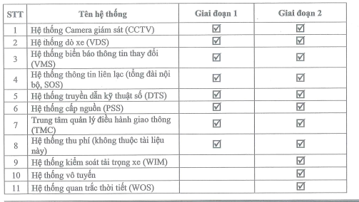
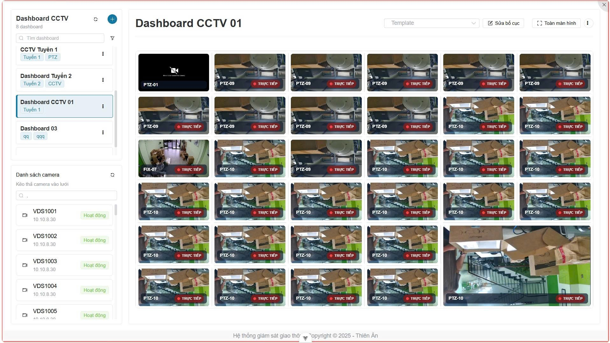
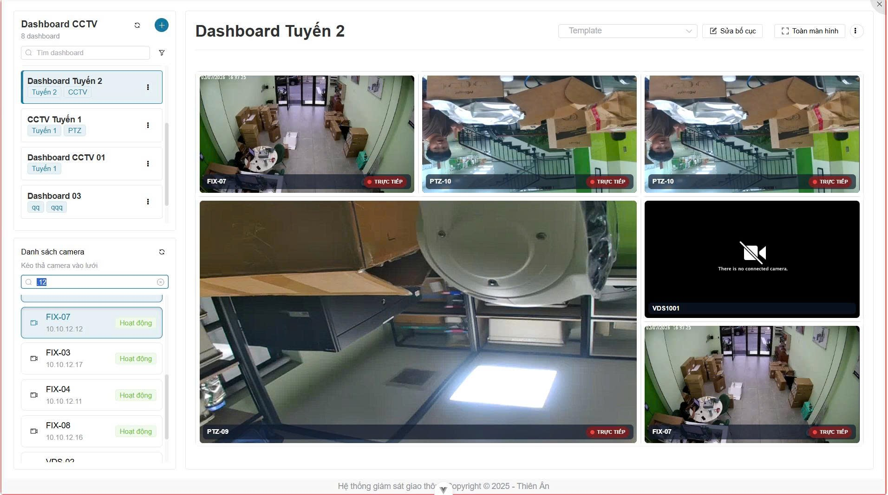
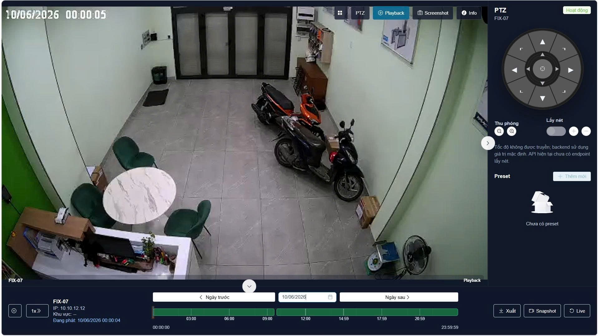

# Business Analysis – HN–CL (2)

> Chuyển đổi từ `Business Analysis  HN  CL 2.xlsx`

## Mục lục

- [TKKT HN-CL](#tkkt-hn-cl)
- [PM ITS Lõi](#pm-its-lõi)
- [PM TMC-TMS](#pm-tmc-tms)
- [PM VMS](#pm-vms)
- [PM VDS](#pm-vds)
- [PM CCTV](#pm-cctv)
- [PM dịch vụ Web](#pm-dịch-vụ-web)
- [PM chia sẻ dữ liệu](#pm-chia-sẻ-dữ-liệu)
- [PM Tường màn hình](#pm-tường-màn-hình)
- [PM Quản lý, giám sát mạng](#pm-quản-lý-giám-sát-mạng)
- [PM Thu phí](#pm-thu-phí)
- [TMC-TMS](#tmc-tms)
- [VMS](#vms)
- [VDS](#vds)
- [CCTV](#cctv)
- [Kết nối chia sẻ](#kết-nối-chia-sẻ)

---

## TKKT HN-CL

| # | Page | Page (2) | Items | Function | Function (2) | Function (3) |
|---|---|---|---|---|---|---|
| 1 |  |  | Chức năng quản lý hệ thống: phân quyền cho người kiểm tra, xử lý phân tán? | Phân quyền kiểm tra |  | Mở, phân tán, ổn định, mở rộng |
| 2 |  |  | Chức năng phân vùng | Bản tin sự kiện, sàng lọc nhằm ưu tiên sự kiện |  |  |
| 3 |  |  | Quản lý truy cập: AD |  |  |  |
| 4 |  |  | Giám sát, quản lý thiết bị | Quản lý video tích hợp |  |  |
| 5 |  |  | Thư điện tử? |  |  |  |
| 6 |  |  | Theo dõi, xử lý thông tin xe quá tải, quá khổ | Hiển thị tên trạm, mã trạm số lượt cân, số lượt quá tải |  |  |
| 7 |  |  | Tìm kiếm sự kiện theo đoạn, tuyến |  |  |  |
| 8 |  |  | Hiển thị thông tin trạng thái làn, thay đổi, trạng thái giao thông đoạn/tuyến: thoáng, ùn tắc or ùn tắc nghiêm trọng |  |  |  |
| 9 |  |  | Hiển thị thông tin đơn vị liên kết |  |  |  |
| 10 |  |  | Biểu đồ thống kê sự kiện, lưu lượng theo đoạn tuyến, tỷ lệ % |  |  |  |
| 11 |  |  | danh sách cột thiết bị, thay đổi lý trình |  |  |  |
| 12 |  |  | Công việc: thời gian xử lý, gắn nhiệm vụ với người, báo cáo kết quả |  |  |  |
| 13 |  |  | Danh sách hồ sơ |  |  |  |
| 14 |  |  | Lịch sử di chuyển |  |  |  |
| 15 |  |  | Lịch tuần đường |  |  |  |
| 16 |  |  | Thiết lập: thông tin đoạn, tuyến & hiên thị lên bản đồ, đơn vị, liên hệ, nhân sự, |  |  |  |
| 17 |  |  | VDS: thời gian di chuyển trung bình? |  |  |  |
| 18 |  |  | VMS: thông điệp theo chủ đề |  |  |  |
| 19 |  |  | VMS: chèn thêm ký tự vào thông điệp xây dựng trước |  |  |  |
| 20 |  |  | VMS: nhận nguyên nhân sự kiện từ TMS, tự động tạo lịch trình |  |  |  |
| 21 |  |  | VMS: Mã hóa bản tin |  |  |  |
| 22 |  |  | VMS: Cấu hình độ ưu tiên |  |  |  |
| 23 |  |  | FMS: nhận cảnh báo qua email, TCVN 13599-2.2022 |  |  |  |
| 24 |  |  | Phân hệ chia sẻ dữ liệu (TIS) ra ngoài: Thông tin tuyến cao tốc |  |  |  |
| 25 |  |  | TIS: Dữ liệu dò xe, định danh phương tiện |  |  |  |
| 26 |  |  | TIS: Hình ảnh giao thông |  |  |  |
| 27 |  |  | TIS: Trong đổi với người tham gia giao thông |  |  |  |
| 28 |  |  | TIS: Sự kiện giao thông, hạn chế |  |  |  |
| 29 |  |  | TIS: Tải trọng xe |  |  |  |
| 30 |  |  | OMS: kiểm soát tải trọng |  |  |  |
| 31 |  |  | Quản lý thu phí |  |  |  |
| 32 |  |  | Quản lý Hầm |  |  |  |
| 33 |  |  | Website cung cấp thông tin giao thông -> cloud |  |  |  |
| 34 |  |  | Ứng dụng di động |  |  |  |
| 35 |  |  | Cloud |  |  |  |
| 36 |  |  |  |  |  |  |
| 37 |  |  | Kiểm soát truy cập |  |  |  |
| 38 |  |  |  |  |  |  |
| 39 |  |  | SOS có kết nối với ITS ko? |  |  |  |
| Danh sách các phân hệ phần mềm |  |  |  |  |  |  |
| # | Page |  | Phân hệ | Ghi chú |  |  |
| 1 | 1417-7 | 430/711 | Phân hệ phần mềm lõi ITS | Thực hiện |  |  |
| 2 | 1417-7 | 430/711 | Phân hệ quản lý giao thông (TMS) | Thực hiện |  |  |
| 3 | 1417-7 | 430/711 | Phân hệ bảng thông tin điện tử thay đổi (VMS) | Thực hiện. Chainzone? |  |  |
| 4 | 1417-7 | 430/711 | Phân hệ dò xe (VDS) | Thực hiện. Milesight? |  |  |
| 5 | 1417-7 | 430/711 | Phân hệ camera giám sát (CCTV) | Phần mềm hãng? Hikvision |  |  |
| 6 | 1417-7 | 430/711 | Phân hệ cung cấp dịch vụ Web | Thực hiện? Web portal |  |  |
| 7 | 1417-7 | 430/711 | Phân hệ phần mềm chia sẻ dữ liệu (DS) | Có thực hiện không? Chia sẻ dữ liệu tuyến quốc gia và các tuyến khác |  |  |
| 8 | 1417-7 | 430/711 | Phân hệ tích hợp tường màn hình (TV Wall) | Tích hợp thiết bị? Hãng/Tài liệu liên quan |  |  |
| 9 | 1417-7 | 430/711 | Phân hệ tích hợp quản lý, giám sát thiết bị (FMS) | Tích hợp thiết bị (Solarwind)? Hãng/ Tài liệu liên quan |  |  |
| 9 | 1417-7 | 430/711 | Phân hệ tích hợp quản lý mạng (NMS) | Tích hợp thiết bị (Solarwind)? Hãng/ Tài liệu liên quan |  |  |
| 10 | 1417-8 | 431/711 | Phân hệ tích hợp quản lý dữ liệu thu phí (TCS) | Có thực hiện tích hợp dữ liệu? |  |  |
| 11 | 1417-7 | 430/711 | Phân hệ giám sát tải trọng phương tiện (OMS/WIM) | Không |  |  |
| 12 | 1417-7 | 430/711 | Phân hệ phần mềm theo dõi và ghi nhật ký tác vụ bảo trì duy tu | Có thực hiện không? |  |  |
| 13 | 1417-7 | 430/711 | Phân hệ phần mềm máy trạm truy cập | Giao diện phần mềm thao tác hệ thống, không phải hệ độc lập |  |  |
|  |  |  |  |  |  | Trang 26, Quyển VI.3 |
| Đặc tính của hệ thống phần mềm (Y/c phi chức năng) |  |  |  |  |  |  |
| # | Đặc tính |  |  |  |  |  |
| 1 |  |  |  |  |  |  |
| 2 | Giao diện đơn giản, thân thiện. Tương tác, tương hỗ giữa các module rõ ràng và giữ ở mức tối thiểu. Dữ liệu và thông số được lưu trong CSDL, tách riêng khỏi chương trình |  |  |  |  |  |
| 3 | Kết nối, chia sẻ dữ liệu ITS dùng chung thực hiên liên tuyến |  |  |  |  |  |
| 4 | Mang tính mở phù hợp cho việc ứng dụng ITS về mặt chức năng, tốc độ, giao diện.. Đảm bảo hoạt động liên tục và không cần bảo trì định kỳ. Dễ dàng nâng cấp mở rộng |  |  |  |  |  |
| 5 | Giao diện và báo cáo song ngữ: English, Tiếng Việt |  |  |  |  |  |
| 6 |  |  |  |  |  |  |
| 7 | Đảm bảo hoạt động trên đa nền tảng phần cứng (của nhiều hãng) |  |  |  |  |  |
| 8 | Đảm bảo sẵn sàng đáp ứng chia sẻ dữ liệu, kết nối với Hệ thống kết nối chia sẽ dữ liệu ITS dùng chung (Tích hợp các hệ thống ITS thành phần với trung tâm QLĐHGT (TMC) |  |  |  |  |  |
| 9 |  |  |  |  |  |  |
| 10 |  |  |  |  |  |  |
| 11 |  |  |  |  |  |  |
| 12 |  |  |  |  |  |  |
| 1 | Phần mềm lõi |  | - Yêu cầu chung: Phần mềm hệ thống ITS Core phải có thiết kế mở, không có tính độc quyền và được triển khai rộng rãi trên thế giới; Phần mềm ITS Core phải có khả năng quản lý đồng thời giao thông trên đường cao tốc cũng như giao thông trong đường hầm; Giao diện mở sẵn sàng giao tiếp SCADA cơ điện hầm; - Yêu cầu đối với kiến trúc hệ thống ITS Core: • Phần mềm phải đảm bảo an toàn, bảo mật, hiệu năng phù hợp với yêu cầu sử dụng và quản trị tập trung, ứng dụng các công nghệ hiện đại như ảo hóa, điện toán đám mây dùng riêng; • Kiến trúc được xây dựng theo mô hình hướng dịch vụ SOA (Service Oriented Architecture), đảm bảo tất cả các thành phần trong kiến trúc giao tiếp với nhau thông qua một trục tích hợp dịch vụ; • Kiến trúc phân tầng rõ ràng, đảm bảo các thành phần dùng chung được đóng gói như các dịch vụ để cung cấp các chức năng cho các ứng dụng ở tầng trên; • Hệ thống dữ liệu được thu thập từ nhiều nguồn, trong đó có các nguồn dữ liệu cập nhật trực tuyến và thời gian thực; • Đáp ứng khả năng mở rộng hệ thống ở tất cả các tầng mà không ảnh hưởng đến các ứng dụng đã được triển khai trước; • Mô hình dữ liệu được thiết kế tích hợp ngay từ đầu, đảm bảo khả năng chuẩn hóa dữ liệu cho hiện tại và có thể mở rộng dễ dàng trong tương lai; • Đáp ứng truy cập đa kênh từ web, thiết bị di động và thiết bị chuyên dụng với số lượng người sử dụng lớn; - Yêu cầu về giao diện và kết nối: • Cung cấp chức năng kết nối thiết bị, chuẩn hóa/ đồng bộ hóa giao thức của thiết bị; - Các giao diện kết nối: • Xử lý và chuyển đổi dữ liệu thành định dạng tin nhắn chuẩn để xử lý; - Các giao thức TLS được chuẩn hóa: • Hỗ trợ các giao thức thiết bị tích hợp như HTTP, TCP, UDP; • Chuyển phát tin nhắn; • Xử lý nguồn thông tin: xử lý thông tin giao thông từ các nguồn thu thập thông tin, lọc ra thông tin về lỗi, xử lý thông tin ban đầu; • Truyền dữ liệu với các thiết bị (bộ sưu tập, kiểm soát, giám sát); • Phần mềm lõi có thể cung cấp các giao diện tiêu chuẩn như TLS để phát hiện lưu lượng truy cập và kiểm soát dấu hiệu, OPC UA cho các thiết bị đường hầm hoặc Profibus/Profinet cho các ứng dụng đường hầm; - Yêu cầu đối với giao diện & quản lý người dùng (User Interface): • Phần mềm lõi sẽ cho phép chuyển đổi giữa các ngôn ngữ, trong đó tối thiểu phải hỗ trợ Tiếng Việt và Tiếng Anh; • Phần mềm lõi sẽ có thể quản lý người dùng và các quyền của người dùng riêng; - Yêu cầu về lưu trữ dữ liệu: * Phần mềm lõi phải có khả năng lưu trữ dữ liệu trên CSDL hoặc trên 1 file duy nhất; * Các dữ liệu sau đây (bao gồm nhưng không giới hạn) phải được lưu trữ: Tất cả dữ liệu về môi trường, mức độ ô nhiễm giao thông thu nhận được từ các đầu thu; Dữ liệu báo cáo từ các hệ thống bên ngoài; Ghi nhật ký của các giao diện; Các phản ứng người dùng như thay đổi chiến lược, kích hoạt các kế hoạch tín hiệu, kích hoạt các kế hoạch đường hầm; Các sự kiện giao thông và các sự cố giao thông (bao gồm cả tai nạn giao thông); Các bản tin cảnh báo, thông báo lỗi của thiết bị; Các quyết định chiến lược, các module ra quyết định; Kết quả phân tích môi trường và giao thông. **- Yêu cầu đối với quản lý sự kiện:** * Tất cả các cảnh báo phải được chuyển đến màn hình giám sát của người vận hành hệ thống. Người vận hành phải có khả năng chấp nhận và xác nhận các cảnh báo này. * Hệ thống phải cho phép tìm kiếm và lọc các cảnh báo. * Một sự kiện có thể được kích hoạt tự động bằng cách định nghĩa trước các ngưỡng để cảnh báo (predefined trigger) hoặc kích hoạt thủ công bởi người vận hành. * Người vận hành phải có khả năng bổ sung thêm thông tin vào một sự kiện. * Người quản lý sự kiện phải có khả năng tạo ra một kế hoạch điều khiển tín hiệu cho LUS và SUS phù hợp với tình hình (loại sự kiện, địa chỉ, làn đường khép kín). Các kế hoạch điều khiển tín hiệu có thể được sửa đổi và điều chỉnh nếu cần thiết. * Hệ thống phải cho phép bắt đầu một sự kiện bằng cách nhấn vào đường trong bản đồ của giao diện người dùng. * Các chức năng tiện xử lý dữ liệu: Kiểm tra về tính đúng đắn; Điều chỉnh các phép đo bị thiếu; Làm mịn dữ liệu; Dự báo thời hạn ngắn; Tập hợp. * Phân tích tình hình giao thông, có khả năng phân tích tình hình giao thông với các thuật toán tiêu chuẩn khác nhau: LOS; Lưu lượng dày đặc; Dự đoán tốc độ; Tải trọng xe tải; Tính toán thời gian di lại trung bình cho liên kết giữa hai trạm dò. |  |  |  |
| 2 | Phần mềm quản lý giao thông |  | - Yêu cầu chung: Thu thập, xử lý và khai thác dữ liệu thu thập từ thiết bị lắp đặt ngoài đường để giám sát, quản lí và vận hành giao thông trên cao tốc; • Quản lý, giám sát hình ảnh, điều khiển quay quét, thiết lập chế độ ghi âm, tìm kiếm và đánh giá hình ảnh của camera giám sát giao thông; • Biểu đồ theo dõi trực tuyến, thống kê giao thông thu thập từ thiết bị đo xe lắp đặt trên đường cao tốc; • Giám sát và xử lý các cảnh báo được tạo ra bởi hệ thống, phân tích và phát hiện sự kiện tự động; • Thiết lập và quản lý thông tin xuất bản qua các dấu hiệu giao thông điện tử trên đường cao tốc; • Quản lý nội dung Hiển thị trên các biển điều khiển giao thông; • Quản lý và giám sát giao thông của các phương tiện vào/ra cổng trạm thu phí; • Theo dõi và xử lý thông tin phương tiện quá tải, quá khổ đã được xác minh bởi hệ thống kiểm tra tải trọng xe; • Chia sẻ và cung cấp thông tin cho các cơ quan liên quan theo quy định; • Chức năng lập chiến lược và kế hoạch đáp trả (Strategies and Response Plans); • Phần mềm phải có khả năng cấp quyền cho người dùng tương ứng để xác định chiến lược và kế hoạch đáp trả (response plan); • Một chiến lược phải có khả năng hành động khi có bất kỳ trigger nào và thực hiện các hành động cụ thể. Một hành động có thể là bất kỳ loại phản ứng của hệ thống; • Một kế hoạch đáp trả là một chiến lược cho phép người dùng tương tác và thực thi các hành động nhỏ; • Hệ thống phải có khả năng xác định lái xe ngược chiều. - Chức năng điều khiển giao thông và cấu hình các loại thiết bị bên đường khác nhau như: • Biển báo thông tin thay đổi (VMS, LCS); • Đèn tín hiệu giao thông tại đường hầm; • Cần chắn tự động (Barriers); • Phần mềm phải đảm bảo rằng các thiết lập của các biển báo phải luôn an toàn, tin cậy cho lái xe và tuân thủ theo các luật lệ, qui định của địa phương; • Phần mềm phải có khả năng cấp quyền tương ứng để định nghĩa kế hoạch tín hiệu (ví dụ cấu hình các thiết bị đã được kết nối) để lưu trữ kế hoạch tín hiệu và kích hoạt chúng khi có yêu cầu; • Phần mềm phải cho phép kỹ sư giao thông thiết lập trước chương trình quản lý đường hầm cụ thể cho việc vận hành an toàn mà đã được thử nghiệm bởi chính quyền địa phương và không thể thay đổi mà không có một quá trình ủy quyền bổ sung. Những chương trình đường hầm liên quan đến tình huống nghiêm trọng như đóng cửa đường hầm hoặc tạm thời dừng lưu thông hai chiều. • Phần mềm được sử dụng để kiểm soát các thiết bị kiểm soát giao thông phải có khả năng xử lý yêu cầu tự động để chuyển đổi các thiết bị theo yêu cầu thủ công của nhà điều hành; - Chức năng điều khiển lưu lượng, xử lý, kiểm soát các thiết bị, kiểm soát giao thông: • Các ưu tiên khác nhau của các dấu hiệu giao thông (ví dụ: chữ thập đỏ phải có mức ưu tiên cao hơn mũi tên màu xanh lá cây). • Quy tắc để cân bằng theo chiều dọc và ngang loạt các thiết bị (ví dụ: chữ thập đỏ phải được trước bởi một mũi tên hồ phách thượng nguồn). • Khóa kết hợp các khía cạnh không được phép hoặc dẫn đến các tình huống nguy hiểm. • Việc lồng vào các kế hoạch tín hiệu khác nhau ví dụ như trong một đường hầm. • Việc chuyển đổi các khía cạnh trên một thiết bị (ví dụ: trước khi kích hoạt một chữ thập đỏ mũi tên hồ phách phải được hiển thị trong một thời gian xác định trước). - Phần mềm phải có khả năng mô tả trình tự kiểm soát đường hầm. Các chuỗi này phải có thể chứa: • Yêu cầu của các kế hoạch tín hiệu; • Kích hoạt camera chụp ảnh; • Can thiệp của các nhà khai thác. |  |  |  |
| 3 | Phần mềm quản lý dò xe (VDS) |  | Yêu cầu chung:  Các tính năng phát hiện xe: Lưu lượng giao thông; Mật độ giao thông; Tốc độ trung bình của phương tiện; Biển số xe phương tiện đi qua vùng quan sát; Phân loại xe: loại xe, màu xe, nhãn hiệu xe;  Phát hiện sự kiện: Xe dừng hoặc taỉ nạn giao thông; xe chạy thành hàng và di chuyển chậm; xe chạy ngược chiều; xe dừng trên vị trí dừng khẩn cấp; người đi bộ; khói, hạn chế tầm nhìn; vật rơi; xe chạy quá tốc độ;  Hệ thống hỗ trợ các chức năng sau:  Kết nổi & thu nhận dữ liệu từ các hệ thống camera dò xe gửi về;  Xử lý dữ liệu và lưu dữ liệu trong CSDL;  Chức năng lưu trữ: Tất cả cảc dữ liệu thu được từ camera được ghi lại vả lưu trữ trong cơ sở dữ liệu. Các thông tin lưu trữ bao gồm:  Lưu lượng giao thông;  Lưu lượng phương tiện giao thông kích cỡ lớn  Tỷ lệ thời gian chiếm dụng đường  Tốc độ phương tiện trung bình  Tốc độ dữ liệu trung bình "n" phút (n có thể thiết lập tùy chỉnh)  Thông tin trạng thái thiết bị lắp đặt trên đường (bình thường/ hỏng hóc) lỗi thiết bị  Tổng hợp, thóng kê, tạo biểu đồ về: lưu lượng giao thông theo thời gian, mật độ chiếm dụng mặt đường tốc độ trung bình,....  Cảnh báo sự kiện: thiết lập các ngưỡng giám sát giao thông, đưa ra các cảnh báo vượt ngưỡng, sự kiện bất thường (ùn tắc, di chuyển chậm, xe dừng đỗ, xe đi ngược chiều,...)  Giám sát phương tiện: Thu thập dữ liệu thông tin xe, làm giàu thông tin phương tiện (kết nối với CSDL đăng kiểm), cảnh báo xe thuộc danh sách đen/trắng;  Cung cấp giao diện tích họp với phần mềm Quản lý giao thông & cấc phần mềm ITS Core. |  |  |  |
| 4 | Phần mềm phần mềm hệ thống camera giám sát (CCTV) |  | Yêu cầu chung:  Linh hoạt, có khả năng mở rộng thêm camera và thiết bị lưu trữ;  Cho phép đăng nhập, xem hình ảnh trực tiếp từ máy tính vận hành, trình duyệt wed,…;  Hỗ trợ lập trình kịch bản lưu trữ Video khác nhau theo lịch định sẵn hoặc theo sự kiện;  Có khả năng thiết lập phân quyền quản lý theo từng người dùng như: kết nối camera, điều khiển PTZ, truy xuất dữ liệu lưu trữ...;  Quản lý việc hiển thị tín hiệu Video trực tiếp từ các Camera lên các màn hình giám sát;  Cho phép chuyển tải hình ảnh lên tường màn hình;  Hỗ trợ phân tích hình ảnh và tạo báo động;  Tương thích chuẩn ONVIF.  Các tính năng:  Kiến trúc: Client Sever hoặc Web Server;  Cho phép quản lý, ghi hình ảnh, tìm kiếm, phát lại hình ảnh camera IP;  Tích hợp bản đồ để giám sát vị trí camera;  Hỗ trợ khả năng tùy biến màn hình theo thiết kế người dùng;  Có thể hiển thị toàn màn hình và tùy biến lưới hiển thị camera theo các ô với dạng và số lượng thay đổi;  Hỗ trợ tiêu chuẩn ONVIF và PSIA;  Hoạt động theo cơ chế Server-Client, không giới hạn số lượng user truy cập quan sát và xcm lạí đồng thời;  Hỗ trợ hình ảnh chuẩn H265, H264, MJPEG,...;  Chế độ ghi hình: Alway, Schedule, Manual trigger vả event detection...;  Phát hiện chuyển động (VMD) ghi hình khi phát hiện khu vực có vật thể chuyển động, điều khiển PTZ Camera, Schedule, Privacy masking, …  Cảnh báo sự kiện bằng Email, SMS , kích hoạt camera PTZ quan sát khu vực xảy ra sự kiện;  Tìm kiếm hình ảnh/video: Theo thời gian, sự kiện, theo hình ảnh gợi ý trước,...;  Khả năng mở rộng linh hoạt: Không giới hạn số lượng camera kết nối; Không giới hạn số lượng máy chủ;  Hỗ trợ tính năng backup dự phòng;  Hiển thị theo kịch bản trên tường màn hình: hỗ trợ nội dung video linh hoạt tự động hoặc điều khiển bằng tay đối với nội dung   Hỗ trợ một loạt các loại nội dung đa dạng, bao gồm video trực tiếp và phát lại, bản đồ, báo thức, dấu trang, các trang HTML, tin nhắn văn bản,…  Phần mềm tương thích với các hệ điều hành Windows (x86, x64), Linux...;   Hỗ trợ các ứng dụng khai thác trên các thiết bị di động chạy hên nền tảng Android, iOS, Windows phone...;  Hỗ trợ khả năng xử lý hình ảnh card màn hình,...để tăng tốc độ giải mã video;  Tính mở của hệ thống: hỗ trợ SDK/API cho phép tích hợp với các phần mềm xử lý hình ảnh của hãng thứ 3;  Cung cấp giao diện tích hợp với phần mềm Quản lý giao thông & các phần mềm ITS Core.  Tương thích với máy chủ ghi video và bộ sao lưu dữ liệu  Hỗ trợ xuất hình ảnh/video: MPGE, AVI, WMV, MP4…  Khả năng xem lại trực tiếp trên phần mềm lên đến 180 ngày   Đáp ứng thiết kế kỹ thuật |  |  |  |
| 5 | Phần mềm bảng thông tin giao thông điện tử (VMS) |  | • Kết nối & điều khiển biển thông tin điện tử VMS, LCS; • Tạo và sửa đổi nội dung hiển thị trên VMS, LCS, hỗ trợ ba chế độ gồm: Nhập thông tin thủ công, kết hợp các cụm từ đã được định nghĩa trước, lựa chọn các thông báo đã được thiết kế sẵn; • Kiểm duyệt thông tin: Tự động kiểm duyệt tính tương thích cho biển VMS, LCS được sử dụng; Xem trước nội dung, màu sắc của nội dung sẽ hiển thị trên biển VMS, LCS; gợi ý điều chỉnh cho phù hợp; • Hiển thị và khai thác thông tin: Thiết lập/thay đổi thông tin hiển thị trên biển VMS, LCS từ xa, cho phép điều khiển thủ công hoặc theo ngữ cảnh thiết lập trước; • Quản lý thời gian hiển thị: Mỗi thông báo hiển thị trên VMS, LCS được gắn với một mốc giá trị thời gian tồn tại, khi hết thời gian, hệ thống sẽ tự động tắt thông báo trên biển VMS; • Giám sát & quản lý trạng thái VMS, LCS: Giám sát kết nối, cảnh báo mất kết nối; Giám sát trạng thái biển VMS, LCS (vị trí, thông tin đang hiển thị trên biển VMS, các thông tin khác do biển VMS, LCS cung cấp như nhiệt độ môi trường, tình trạng module LED...); • Lưu trữ dữ liệu: Toàn bộ dữ liệu trao đổi giữa các bảng VMS, LCS trên đường và trung tâm điều khiển, đều được máy chủ quản lý dữ liệu lưu trữ lại phục vụ mục đích phân tích và sử dụng trong tương lai, lại. Các dữ liệu về trạng thái hoạt động của các thiết bị bên đường (hoạt động bình thường hay lỗi) cũng được lưu lại thành nhật ký vận hành cho việc theo dõi và phân tích về sau; • Quản lý hiển thị và báo cáo: Vị trí và trạng thái hoạt động bảng VMS, LCS (vị trí Bảng VMS, LCS; Trạng thái hoạt động; Đang hiển thị thông báo/không hiển thị thông báo; Hoạt động bình thường/xảy ra lỗi); • Thông báo: Nội dung thông tin hiển thị trên bảng VMS, LCS (thời gian bắt đầu hiển thị, thời gian dự kiến kết thúc; Các từ hoặc cụm từ định nghĩa trước; Những bảng thông báo được thiết kế sẵn; Các biểu tượng đồ họa); • Vận hành: Danh sách bảng VMS, LCS trên tuyến đường không hoạt động; Bản ghi nhớ thông số vận hành và bản ghi nhớ các trường hợp lỗi (ngày, giờ hiện hành của hệ thống); • Cung cấp giao diện tích hợp với phần mềm lõi ITS (ITS Core), quản lý giao thông. |  |  |  |
| 6 | Phần mềm quản lý dữ liệu thu phí (TCS) |  | • Hệ thống trung tâm thu phí (TCS), các chức năng chính của hệ thống này, nhưng không giới hạn, quản lý một cách thống nhất và được quy định như sau: • Có khả năng truyền dẫn chính xác đến các làn, trạm thu phí trên toàn tuyến thông tin thống nhất về thời gian, biểu mức thu phí, quy tắc phân loại xe v.v..; • Tiếp nhận và xử lý một cách chính xác tất cả các loại dữ liệu có thể chuyển lên từ các trạm thu phí trên toàn tuyến, đồng thời lưu trữ vào cơ sở dữ liệu. Tiến hành xử lý chính xác tất cả các dữ liệu và yêu cầu kiểm soát có thể của các trạm thu phí trên toàn tuyến; • Định kỳ tiến hành sao lưu lịch sử; • Tự động hoặc thủ công in báo cáo thống kê tình hình thu phí; báo cáo tình hình lưu lượng giao thông và báo cáo quản lý theo ngày, tháng, quý, năm; • Có khả năng quản lý tình hình sử dụng và duy tu của tất cả thiết bị thu phí của đoạn quản lý; • Theo dõi và tổng hợp tất cả các giao dịch thu phí tại các trạm; • Giám sát tình trạng vận hành của hệ thống thu phí tại tất cả các trạm. Có kiểm soát tình hình vào ca làm việc của nhân viên thu phí đoạn đường, theo cấp phân quyền; • Quản trị các dữ liệu tài khoản khách hàng (vé lượt, vé tháng,...); |  |  |  |
| 7 | Phần mềm bản đồ tường màn hình |  | • Bộ phần mềm quản lý hệ thống video wall sẽ thực hiện chức năng điều khiển các ứng dụng đang chạy trên hệ thống màn hình lớn, các tín hiệu video (DVI/HDMI/VGA), IP streaming trực tiếp từ một số nguồn khác nhau; • Bộ phần mềm quản lý hệ thống được thiết kế dạng mô đun, cho phép thiết lập giải pháp điện toán phân tán. Các thành phần thuộc mô đun cho máy chủ của bộ phần mềm quản lý hệ thống có thể được cài đặt trên các máy chủ riêng biệt và các mô đun cho máy trạm cũng có thể được cài đặt trên bất kỳ máy trạm nào, do đó sẽ giảm tải cho bộ điều khiển; • Bộ phần mềm quản lý hệ thống sẽ bao gồm các đặc tính quản lý người khai thác cho phép cấp các quyền, cấp bậc quản lý và phân bố trong một số khu vực, điều chỉnh cho mỗi khai thác viên. Các người khai thác phải có khả năng chỉ định khu vực của hệ thống màn hình lớn cho việc hiển thị các ứng dụng, thay đổi kích cỡ, sắp đặt vị trí và cấu hình. Người khai thác hệ thống sẽ chỉ có quyền trong các khu vực của hệ thống màn hình lớn. Người khai thác hệ thống sẽ không có quyền thực thi bất kỳ. công việc nào trong các khu vực không thuộc sự quản lý của họ trên hệ thống màn hình lớn; • Bộ phần mềm quản lý hệ thống kết hợp chặt chẽ với tính năng cài đặt qua mạng với việc phân bố phần mềm/bộ cài đặt của máy trạm trên toàn mạng; • Phần mềm điều khiển phải có chức năng điều khiển các khối màn hình, cho phép người khai thác có thể điều khiển, kiểm tra trạng thái của các khối màn hình (thông tin về tuổi thọ đèn, nhiệt độ...); • Bộ phần mềm quản lý hệ thống sẽ cho phép thiết lập lịch trên bộ điều khiển. Nó sẽ tự động khởi động các ứng dụng đã được thiết lập trước đặt trên hệ thống màn hình lớn như bật hoặc tắt các khối màn hình. Nó cũng cho phép điều khiển, sắp đặt vị trí các ứng dụng, đầu vào composite video hoặc VGA trên hệ thống màn hình lớn trong lịch sự kiện; • Bộ phần mềm quản lý hệ thống sẽ cung cấp kịch bản cấu hình bằng cách chuyển đổi giữa các layout trong khoảng thời gian định trước hoặc khi sự kiện xảy ra. Nói cách khác, nó có thể mô đun hóa cấu trúc cho mỗi chức năng. Kết hợp chặt chẽ với việc thiết lập các sắp đặt trước (preset); • Bộ phần mềm quản lý hệ thống cho phép tối thiểu 2 người khai thác hệ thống làm việc đồng thời trong hệ thống; • Bộ phần mềm quản lý hệ thống sẽ có đặc tính bảng điều khiển để điều khiển từ xa qua các máy tính trạm với tính năng con trỏ từ xa có thể điều khiển chuột của bộ điều khiển thông qua điều khiển chuột của một máy trạm ở xa; • Bộ phần mềm quản lý hệ thống phải có tính năng dễ sử dụng, đồ họa trực giác với khả năng kéo thả (Drag and Drop); • Bộ phần mềm quản lý hệ thống phải cho phép quản lý và điều khiển nhiều hơn 2 màn hình lớn đồng thời; • Cung cấp giao diện tích hợp với phần mềm ITS Core. |  |  |  |
| 8 | Phần mềm quản lý, giám sát thiết bị và mạng truyền dẫn |  | • Hỗ trợ giám sát thiết bị mạng của nhiều hãng (Multi-vendor network monitoring); • Hỗ trợ các giao thức quản lý mạng khác nhau một cách đồng thời SNMP V1, V2, V3, FLOW, ...; • Tự động phát hiện các thiết bị trên mạng; • Hỗ trợ lập bản đồ cấu trúc mạng; • Phân tích hop-by-hop dọc theo các đường dẫn chính; • Liên tục theo dõi các sự cố xảy ra trên thiết bị, Tính sẵn sàng và lỗ hổng tiềm ẩn; • Có khả năng đo hiệu suất thiết bị của các nhà sản xuất thiết bị hàng đầu trên thế giới; • Theo dõi sức khỏe phần cứng: theo dõi, cảnh báo và báo cáo về các số liệu chính của thiết bị, bao gồm nhiệt độ, tốc độ quạt và nguồn điện; • Hỗ trợ các dạng đồ thị khác nhau như biểu đồ đường, biểu đồ cột, biểu đồ hình tròn; • Cảnh báo thông minh: o Truy cập vào nguyên nhân gốc nhanh hơn với các cảnh báo mạng thông minh, dependency và topology-aware; o Giảm thiểu các cảnh báo mạng không cần thiết. Tạo các cảnh báo dựa trên các điều kiện kích hoạt lồng nhau đơn giản hoặc phức tạp, các phụ thuộc cha/con được xác định và cấu trúc liên kết mạng; o Hỗ trợ quản lý 500 thành phần, thiết bị (có thể mở rộng trong tương lai). |  |  |  |
| 9 | Phần mềm cung cấp dịch vụ Web |  | • Phần mềm Web cung cấp cho người dùng các thông tin (nhưng không giới hạn) như sau: o Thông tin chọn lọc từ các hệ thống CCTV, VMS, VDS...; o Thông tin giao thông trên bản đồ; o Sự kiện và sự cố thông tin trên bản đồ; o Quy định giao thông trên bản đồ; o Bản đồ sơ đồ chung cho thấy tất cả các thông tin trên; o Các quy định về giao thông bằng văn bản; |  |  |  |
| 10 | Phần mềm chia sẻ dữ liệu |  | - Quản lý giao diện chia sẻ dữ liệu tịa Trung tâm điều hành; - Quản lý lịch sử chia sẻ. |  |  |  |

---

## PM ITS Lõi

**Phần mềm lõi ITS**

| # | Page | Page (2) | Items | Requirement – Functional | Requirement – Nonfunctional | Comment | Checklist |
|---|---|---|---|---|---|---|---|
| **I** |  |  | **KIẾN TRÚC & NỀN TẢNG** |  |  |  |  |
| 1 | 1404-88 |  | Đặc tính kiến trúc mở |  | Thiết kế mở, không có tính độc quyền và được triển khai rộng rãi trên thế giới => sử dung CN sử dụng rộng rãi trên TG (.NET, vue, …) |  |  |
| 2 | 1404-88 |  | Kiến trúc hướng dịch vụ (SOA) |  | Xây dựng theo mô hình hướng dịch vụ SOA, tất cả các thành phần giao tiếp qua một trục tích hợp dịch vụ | Phân tầng rõ ràng, đóng gói dưới dạng dịch vụ | x |
| 3 | 1417-10 |  | Cấu hình xử lý phân tán (Distributed) |  | Hệ thống phải có cấu hình xử lý phân tán, đảm bảo hoạt động liên tục và ổn định | Phù hợp với đặc thù trải dài của cao tốc |  |
| 4 | 1417-4 |  | Cô lập lỗi (Fault Isolation) | Ngăn chặn khuyết tật trong một mô-đun ảnh hưởng đến các mô-đun khác | Cô lập lỗi, không để lại lan truyền trong hệ thống | Tương tác giữa các mô-đun phải rõ ràng và giữ ở mức tối thiể |  |
| 5 | 1404-88 |  | Khả năng mở rộng | Đăng ký thu nhận thiết bị mới mà không cần cập nhật thiết bị riêng lẻ | Mở rộng ở tất cả các tầng mà không ảnh hưởng đến ứng dụng đã triển khai Hỗ trợ Scale-up và Scale-out | Không thay đổi kiến trúc cốt lõi | x |
| 6 | 1404-88 |  | Công nghệ hiện đại |  | Ứng dụng công nghệ ảo hóa, điện toán đám mây dùng riêng | Tối ưu hóa nguồn lực tính toán, lưu trữ |  |
| 7 | 1417-3, 1417-4 |  | Tính sẵn sàng & Tự khôi phục | Tự khôi phục khi có gián đoạn. Khởi động "nóng" tự động không cần can thiệp thủ công | Cấu hình HA (Active/active hoặc Active/standby), tránh điểm lỗi đơn |  |  |
| 8 | 1417-4 |  | Bảo mật đa lớp |  | Bảo mật ở tầng mô-đun, tầng hệ thống, đối với dữ liệu lưu/tĩnh và dữ liệu trên đường truyền | hình ảnh, CSDL? |  |
| **II** |  |  | **GIAO DIỆN & KẾT NỐI** |  |  |  |  |
| 9 | 1404-88 |  | Quản lý đồng thời đa hạ tầng | Khả năng quản lý đồng thời giao thông trên cao tốc và trong đường hầm |  | Sẵn sàng giao tiếp SCADA cơ điện hầm |  |
| 10 | 1404-88 |  | Chuẩn hóa giao thức thiết bị | Kết nối thiết bị, chuẩn hóa/đồng bộ hóa giao thức của thiết bị | Hỗ trợ các giao thức mạng phổ biến HTTP, TCP, UDP | Lớp Adapter chuyển đổi | x |
| 11 | 1404-88 |  | Giao thức truyền thông đặc thù | Cung cấp giao diện tiêu chuẩn TLS, OPC UA, Profibus/Profinet |  | Phục vụ SCADA hầm và thiết bị ngoại vi đặc biệt |  |
| 12 | 1404-80 |  | Đồng bộ thời gian hệ thống (Time Sync) | Cung cấp đồng hồ chuẩn và đồng bộ hóa thời gian cho toàn bộ thiết bị, máy chủ, máy trạm trong hệ thống | Chính xác, liên tục qua NTP/GPS | Cơ sở để khớp chuỗi sự kiện | x |
| 13 | 1404-88 |  | Hỗ trợ đa kênh | Cung cấp dịch vụ cho web, thiết bị di động, thiết bị chuyên dụng | Đáp ứng số lượng người sử dụng lớn đồng thời. |  |  |
| **III** |  |  | **THU THẬP & TIỀN XỬ LÝ** |  |  |  |  |
| 14 | 1404-88 |  | Đa nguồn dữ liệu | Thu thập dữ liệu từ nhiều nguồn khác nhau (VDS, CCTV, Thu phí, Trạm cân...) | Hỗ trợ cập nhật trực tuyến, thời gian thực | Mô hình dữ liệu chuẩn hóa | x |
| 15 | 1404-88 |  | Chuyển đổi và Thể hiện | Xử lý, chuyển đổi dữ liệu thô thành định dạng tin nhắn chuẩn. Thể hiện lại và truyền phát |  |  | x |
| 16 | 1404-89 |  | Tiền xử lý dữ liệu | Kiểm tra tính đúng đắn; Điều chỉnh phép đo bị thiếu; Làm mịn dữ liệu |  | Loại bỏ nhiễu trước khi phân tích | x |
| 17 | 1404-89, 1417-10 |  | Dự báo & Tập hợp | Tập hợp dữ liệu theo chu kỳ, dự báo thời hạn ngắn về dòng giao thông |  | Chu kỳ 1 phút hoặc n phút LUS và SUS là gì? |  |
| **IV** |  |  | **NGƯỜI DÙNG, PHÂN QUYỀN & BẢO MẬT** |  |  |  |  |
| 18 | 1404-89 |  | Giao diện đa ngôn ngữ | Cho phép chuyển đổi linh hoạt giữa các ngôn ngữ trên giao diện | Tối thiểu hỗ trợ Tiếng Việt và Tiếng Anh |  | x |
| 19 | 1417-20 |  | Tích hợp Active Directory (AD) | Quản lý tài khoản người dùng hệ thống tập trung trên máy chủ Danh bạ linh động (AD) | Đăng nhập một lần (SSO) cho tất cả hệ thống | Đơn giản hóa cấp quyền |  |
| 20 | 1404-89 |  | Quản lý phân quyền | Phân quyền 3 cấp (Nhân viên, Trưởng ca/Lãnh đạo, Đơn vị cấp trên). Chỉ xem, thay đổi vận hành, hoặc thay đổi hệ thống | Quản lý người dùng và các quyền riêng biệt. |  | x |
| 21 | 1404-101 |  | Ghi Nhật ký hệ thống (Audit Log) | Ghi lưu tất cả các thao tác vận hành, đăng nhập, lỗi hệ thống, truy cập trái phép vào cơ sở dữ liệu | Thuận tiện rà soát, phát hiện lỗ hổng. | Dữ liệu không thể chối bỏ | x |
| **V** |  |  | **CƠ SỞ DỮ LIỆU & LƯU TRỮ** |  |  |  |  |
| 22 | 1404-89 |  | Kiến trúc lưu trữ CSDL | Khả năng lưu trữ tập trung dữ liệu trên CSDL hoặc lưu trữ trên 1 file duy nhất | Không bị gián đoạn dịch vụ trong lúc lưu trữ | DB thương mại uy tín | x |
| 23 | 1404-89 |  | Các dữ liệu hệ thống bắt buộc | Lưu trữ dữ liệu môi trường, báo cáo ngoại vi, nhật ký giao diện, phản ứng người dùng (đổi chiến lược, kích hoạt tín hiệu/hầm) |  |  | x |
| 24 | 1404-89 |  | Các dữ liệu nghiệp vụ bắt buộc | Lưu trữ các sự kiện, sự cố (tai nạn), bản tin cảnh báo, lỗi thiết bị, quyết định chiến lược, kết quả phân tích | Thời gian lưu trữ tối thiểu cấu hình linh hoạt (2 năm cho sự cố) |  | x |
| 25 | 1417-5 |  | Chức năng Sao lưu (Backup) | Cung cấp chức năng sao lưu toàn bộ gói CSDL và khôi phục (Restore) bản dự phòng. | Thuận tiện thay đổi dung lượng động. Phục hồi nhanh chóng |  | x |
| 26 | 1417-5 |  | Tính toàn vẹn CSDL | Đảm bảo tính toàn vẹn cơ sở dữ liệu và duy trì truy cập mạng liên tục trong quá trình sao lưu hoặc thay thế ổ cứnh | Hỗ trợ cấu hình mảng đĩa dự phòng (RAID). |  | x |
| **VI** |  |  | **QUẢN LÝ CẤU HÌNH THIẾT BỊ** |  |  |  |  |
| 27 | 1417-8 |  | Quản lý thiết bị động | Quản lý thêm mới hoặc loại bỏ thiết bị được kết nối với các hệ thống thành phần | Cập nhật qua CSDL, không cần cập nhật mã nguồn phần mềm riêng lẻ | Thiết kế mở. | x |
| 28 | 1417-8 |  | Quản lý thông số | Định nghĩa và thay đổi các thông số ngưỡng (trigger) lưu trong CSDL | Giao diện quản lý thông số thân thiện | Thiết lập ngưỡng |  |
| 29 | 1417-5 |  | Tách biệt phần mềm và cấu hình | Thuận tiện để phân tách phần mềm khỏi môi trường vận hành (lưu trữ file config riêng) trong trường hợp có lỗi để dễ phục hồi | Dữ liệu và thông số được lưu tách riêng khỏi chương trình | Giảm tối đa sự cố sập toàn hệ thống. | x |
| Vấn đề làm rõ |  |  |  |  |  |  |  |
|  |  |  | Vấn đề |  | Giải đáp |  |  |
| 1 |  |  | Hệ thống scada không có trong này, nhưng có code từ hệ cũ. Nếu thực hiện > tăng thêm thời gian thực hiện. Xem xét có thực hiện hay không? |  |  |  |  |
| 2 |  |  |  |  |  |  |  |
|  |  |  | Yêu cầu |  | Rà soát | Ghi chú |  |
| 1 | N |  | Phần mềm hệ thống ITS Core phải có thiết kế mở, không có tính độc quyền và được triển khai rộng rãi trên thế giới; |  | Chỉ sử dụng công nghệ sử dụng rộng rãi (.NET 10, nats.io, vue) |  |  |
| 2 | F |  | Phần mềm ITS Core phải có khả năng quản lý đồng thời giao thông trên đường cao tốc cũng như giao thông trong đường hầm; Giao diện mở sẵn sàng giao tiếp SCADA cơ điện hầm; |  | Hệ thống scada không có trong này, nhưng có code từ hệ cũ. Nếu thực hiện > tăng thêm thời gian thực hiện |  |  |
| 3 |  |  | - Yêu cầu đối với kiến trúc hệ thống ITS Core: |  |  |  |  |
| 4 | N |  | • Phần mềm phải đảm bảo an toàn, bảo mật, hiệu năng phù hợp với yêu cầu sử dụng và quản trị tập trung, ứng dụng các công nghệ hiện đại như ảo hóa, điện toán đám mây dùng riêng; |  | Server sử dụng ảo hoá |  |  |
| 5 | N |  | • Kiến trúc được xây dựng theo mô hình hướng dịch vụ SOA (Service Oriented Architecture), đảm bảo tất cả các thành phần trong kiến trúc giao tiếp với nhau thông qua một trục tích hợp dịch vụ; |  | Giao tiếp qua nats.io, chưa tới mức là trục xử lý |  |  |
| 6 | T |  | • Kiến trúc phân tầng rõ ràng, đảm bảo các thành phần dùng chung được đóng gói như các dịch vụ để cung cấp các chức năng cho các ứng dụng ở tầng trên; |  | Có phân tách thành các module |  |  |
| 7 | N |  | • Hệ thống dữ liệu được thu thập từ nhiều nguồn, trong đó có các nguồn dữ liệu cập nhật trực tuyến và thời gian thực; |  | Tích hợp các hệ thogn61 khác (vds, share) |  |  |
| 8 | T |  | • Đáp ứng khả năng mở rộng hệ thống ở tất cả các tầng mà không ảnh hưởng đến các ứng dụng đã được triển khai trước; |  | Mở rộng theo từng module |  |  |
| 9 | N |  | • Mô hình dữ liệu được thiết kế tích hợp ngay từ đầu, đảm bảo khả năng chuẩn hóa dữ liệu cho hiện tại và có thể mở rộng dễ dàng trong tương lai; |  | Check lại |  |  |
| 10 | N |  | • Đáp ứng truy cập đa kênh từ web, thiết bị di động và thiết bị chuyên dụng với số lượng người sử dụng lớn; |  | Chưa phù hợp giao diện mobile |  |  |
| 11 |  |  | - Yêu cầu về giao diện và kết nối: |  |  |  |  |
| 12 | T |  | • Cung cấp chức năng kết nối thiết bị, chuẩn hóa/ đồng bộ hóa giao thức của thiết bị; |  | Bổ sung theo thiết bị |  |  |
| 13 |  |  | - Các giao diện kết nối: |  |  |  |  |
| 14 | N |  | • Xử lý và chuyển đổi dữ liệu thành định dạng tin nhắn chuẩn để xử lý; |  |  |  |  |
| 15 | N |  | - Các giao thức TLS được chuẩn hóa: |  |  |  |  |
| 16 | T |  | • Hỗ trợ các giao thức thiết bị tích hợp như HTTP, TCP, UDP; |  | Bổ sung theo thiết bị |  |  |
| 17 | N |  | • Chuyển phát tin nhắn; |  | Truyền nhận dữ liệu |  |  |
| 18 | N |  | • Xử lý nguồn thông tin: xử lý thông tin giao thông từ các nguồn thu thập thông tin, lọc ra thông tin về lỗi, xử lý thông tin ban đầu; |  | Có xử lý chuyển đổi và lọc dữ liệu phù hợp |  |  |
| 19 | N |  | • Truyền dữ liệu với các thiết bị (bộ sưu tập, kiểm soát, giám sát); |  |  |  |  |
| 20 | F |  | • Phần mềm lõi có thể cung cấp các giao diện tiêu chuẩn như TLS để phát hiện lưu lượng truy cập và kiểm soát dấu hiệu, OPC UA cho các thiết bị đường hầm hoặc Profibus/Profinet cho các ứng dụng đường hầm; |  | Không có code sẵn cho các giao thức thiết bị về hầm (OPC,..) |  |  |
| 21 |  |  | - Yêu cầu đối với giao diện & quản lý người dùng (User Interface): |  |  |  |  |
| 22 | T |  | • Phần mềm lõi sẽ cho phép chuyển đổi giữa các ngôn ngữ, trong đó tối thiểu phải hỗ trợ Tiếng Việt và Tiếng Anh; |  | Đã có |  |  |
| 23 | T |  | • Phần mềm lõi sẽ có thể quản lý người dùng và các quyền của người dùng riêng; |  | Đã có phân quyền theo nhóm |  |  |
| 24 |  |  | - Yêu cầu về lưu trữ dữ liệu: |  |  |  |  |
| 25 | T |  | * Phần mềm lõi phải có khả năng lưu trữ dữ liệu trên CSDL hoặc trên 1 file duy nhất; |  | Đã có |  |  |
| 26 | N |  | * Các dữ liệu sau đây (bao gồm nhưng không giới hạn) phải được lưu trữ: Tất cả dữ liệu về môi trường, mức độ ô nhiễm giao thông thu nhận được từ các đầu thu; Dữ liệu báo cáo từ các hệ thống bên ngoài; Ghi nhật ký của các giao diện; Các phản ứng người dùng như thay đổi chiến lược, kích hoạt các kế hoạch tín hiệu, kích hoạt các kế hoạch đường hầm; Các sự kiện giao thông và các sự cố giao thông (bao gồm cả tai nạn giao thông); Các bản tin cảnh báo, thông báo lỗi của thiết bị; Các quyết định chiến lược, các module ra quyết định; Kết quả phân tích môi trường và giao thông. |  | Check lại |  |  |
| 27 |  |  | **- Yêu cầu đối với quản lý sự kiện:** |  |  |  |  |
| 28 | T |  | * Tất cả các cảnh báo phải được chuyển đến màn hình giám sát của người vận hành hệ thống. Người vận hành phải có khả năng chấp nhận và xác nhận các cảnh báo này. |  | Modal confirm |  |  |
| 29 | T |  | * Hệ thống phải cho phép tìm kiếm và lọc các cảnh báo. |  | Tìm kiếm |  |  |
| 30 | N |  | * Một sự kiện có thể được kích hoạt tự động bằng cách định nghĩa trước các ngưỡng để cảnh báo (predefined trigger) hoặc kích hoạt thủ công bởi người vận hành. |  | Có 1 số ngưỡng thôi: ví dụ tốc độ tối thiểu, tối đa |  |  |
| 31 | T |  | * Người vận hành phải có khả năng bổ sung thêm thông tin vào một sự kiện. |  | Các thông tin khác, ghi chú |  |  |
| 32 | N |  | * Người quản lý sự kiện phải có khả năng tạo ra một kế hoạch điều khiển tín hiệu cho LUS và SUS phù hợp với tình hình (loại sự kiện, địa chỉ, làn đường khép kín). Các kế hoạch điều khiển tín hiệu có thể được sửa đổi và điều chỉnh nếu cần thiết. |  | Check lại, có thực hiện 1 phần |  |  |
| 33 | T |  | * Hệ thống phải cho phép bắt đầu một sự kiện bằng cách nhấn vào đường trong bản đồ của giao diện người dùng. |  | Bản đồ có chức năng tương tác |  |  |
| 34 | T |  | * Các chức năng tiện xử lý dữ liệu: Kiểm tra về tính đúng đắn; Điều chỉnh các phép đo bị thiếu; Làm mịn dữ liệu; Dự báo thời hạn ngắn; Tập hợp. |  | Xử lý lọc dữ liệu (VDS) |  |  |
| 35 | N |  | * Phân tích tình hình giao thông, có khả năng phân tích tình hình giao thông với các thuật toán tiêu chuẩn khác nhau: LOS; Lưu lượng dày đặc; Dự đoán tốc độ; Tải trọng xe tải; Tính toán thời gian di lại trung bình cho liên kết giữa hai trạm dò. |  | Check lại thuật toán, đã có 1 số báo cáo |  |  |
|  | Tổng |  |  |  |  |  |  |
|  | Có |  |  |  |  |  |  |
|  | Chưa |  |  |  |  |  |  |
|  | Check lại |  |  |  |  |  |  |
| Giao diện |  |  |  |  |  |  |  |

---

## PM TMC-TMS

**TMC-TMS**

| # | Page | Page (2) | Items | Requirement – Functional | Requirement – Nonfunctional | Comment | Checklist |
|---|---|---|---|---|---|---|---|
| **I** |  |  | **THU THẬP & PHÂN TÍCH DỮ LIỆU GIAO THÔNG** |  |  |  |  |
| 1 | 1404-90 |  | Thu thập dữ liệu toàn diện | Thu thập, xử lý và khai thác dữ liệu từ thiết bị lắp đặt ngoài đường cao tốc và trong hầm | Dữ liệu thời gian thực | Kết hợp PR.TMS. | x |
| 2 | 1417-10 |  | Tính toán thông số dòng xe | Đo lường lưu lượng giao thông, tỷ lệ thời gian lấp đầy, tốc độ trung bình, phương tiện quá khổ | Chu kỳ cập nhật dữ liệu gốc mỗi 1 phút (cho cả làn đơn và nhiều làn) | Phục vụ phân tích LOS | điều chỉnh |
| 3 | 1417-12 |  | Thuật toán phân tích ùn tắc | Tính toán ùn tắc dựa trên công thức kết hợp giữa Tốc độ trung bình (V) và Tỷ lệ chiếm dụng (Occ) | Chu kỳ tính toán mặc định là 5 phút (có thể thiết lập từ 1-5 phút) | Phân tích tự động 24/7. |  |
| 4 | 1417-12 |  | Xử lý dữ liệu ngoại lệ/bị mất | Nếu mất dữ liệu từ VDS, kết quả phân tích trước đó sẽ được lặp lại duy trì trong 30 phút. Quá 30 phút, trạng thái reset về "Thông thoáng" | Khả năng tự động nội suy dữ liệu | Đảm bảo hệ thống không báo động sai. |  |
| 5 | 1417-13 |  | Chuyển đổi dữ liệu | Tích lũy dòng dữ liệu giao thông theo chu kỳ "n-phút" và chuyển đổi tự động sang dữ liệu từng giờ |  | Phục vụ báo cáo dài hạn. |  |
| **II** |  |  | **PHÁT HIỆN & QUẢN LÝ SỰ CỐ** |  |  |  |  |
| 6 | 1417-11 |  | Nguồn dữ liệu sự cố | Tiếp nhận sự cố tự động (ùn tắc nghiêm trọng từ hệ thống) hoặc thủ công (từ đường dây nóng, tuần đường: tai nạn, xe hỏng, chướng ngại vật, thảm họa) |  | Có thể click trực tiếp trên bản đồ để tạo sự kiện. | x |
| 7 | 1404-90 |  | Phát hiện vi phạm giao thông | Hệ thống có khả năng tự động xác định lái xe ngược chiều. |  | VDS | x |
| 8 | 1417-28 |  | Tích hợp cảnh báo cháy hầm | Tiếp nhận dữ liệu cảnh báo cháy (Yes/No, vị trí) từ MasterSCADA. Tự động điều khiển camera tập trung vào vị trí đám cháy để hiển thị | Rất quan trọng (Critical) để nhà vận hành chứng thực. |  |  |
| 9 | 1417-28 |  | Quy trình thẩm tra sự cố | Yêu cầu nhân viên vận hành (TM operator) phải xác nhận (Ack) và thẩm tra sự cố thủ công thông qua hệ thống CCTV trước khi thực thi lệnh. |  | Tránh hệ thống tự động phản ứng sai do nhiễu cảm biến => bán tự động? | x |
| 10 | 1417-28 |  | Bổ sung dữ liệu sự cố | Cung cấp giao diện cho phép người vận hành nhập thêm và cập nhật các thông tin chi tiết (nguyên nhân, thiệt hại) vào một sự kiện |  |  | x |
| **III** |  |  | **CHIẾN LƯỢC & KẾ HOẠCH ĐÁP TRẢ** |  |  |  |  |
| 11 | 1404-90 |  | Lập chiến lược (Strategies) | Khả năng hành động tự động khi có bất kỳ "trigger" nào bị vi phạm để thực hiện chuỗi phản ứng | Yêu cầu cấp quyền chuyên biệt để tạo chiến lược |  | x |
| 12 | 1404-90 |  | Kế hoạch đáp trả (Response Plan) | Đề xuất một "Kế hoạch đáp trả" (gồm các bước và lệnh điều khiển nhỏ định nghĩa sẵn) cho người vận hành | Người dùng phải tương tác để thực thi |  | x |
| 13 | 1417-28 |  | Thực thi & Hủy bỏ Kế hoạch | Cho phép người vận hành xác nhận (Accept), hủy bỏ (Cancel) kế hoạch được đề xuất, hoặc chuyển sang thao tác thủ công hoàn toàn | Hệ thống cung cấp phản hồi thực tế từ hiện trường sau khi ra lệnh |  | x |
| 14 | 1417-18 |  | Tạo tin nhắn VMS tự động | Tự động tạo ra các bản tin khuyến nghị, cảnh báo vị trí, loại sự cố để hiển thị lên bảng VMS khi có sự kiện |  |  | Điều chỉnh |
| 15 | 1417-18 |  | Phân vùng & Sàng lọc thông tin | Tự động lựa chọn VMS theo vùng phù hợp. Sàng lọc để chọn sự kiện ưu tiên hiển thị khi có nhiều sự cố xảy ra cùng lúc |  | Xử lý xung đột thông tin trên VMS | Điều chỉnh |
| **IV** |  |  | **ĐIỀU KHIỂN THIẾT BỊ & TÍN HIỆU GIAO THÔNG** |  |  |  |  |
| 16 | 1404-90 |  | Điều khiển đa thiết bị | Điều khiển cấu hình Biển báo thông tin thay đổi (VMS, LCS), Đèn tín hiệu hầm, Cần chắn tự động (Barriers) | Tuân thủ tuyệt đối an toàn và luật giao thông địa phương |  | x |
| 17 | 1404-91 |  | Khóa liên động | Khóa các kết hợp tín hiệu không được phép hoặc có thể dẫn đến nguy hiểm (VD: cho phép 2 chiều xe chạy ngược nhau vào 1 làn) |  | Tương tự #17,#18,#19 1. Nghiệp vụ Khóa liên động Cực kỳ an toàn: hệ thống không cho phép nhân viên vận hành "muốn bật đèn gì thì bật". Nó được hard-code các quy tắc an toàn sinh mạng: Không thể bật Mũi tên Xanh nếu trước đó chưa bật Đèn Hổ phách cảnh báo. |  |
| 18 | 1404-91 |  | Mức ưu tiên tín hiệu | Thiết lập mức ưu tiên bắt buộc (Ví dụ: Chữ thập đỏ phải có ưu tiên cao hơn Mũi tên xanh lá cây) |  | Đảm bảo tính logic giao thông VMS Tương tự #17,#18,#19 | x |
| 19 | 1404-91 |  | Cân bằng tín hiệu dọc/ngang | Ép buộc quy tắc chuyển đổi (Ví dụ: Trước khi kích hoạt Chữ thập đỏ, một Mũi tên hổ phách cảnh báo phải được hiển thị ở thượng nguồn trước đó) | Có độ trễ thời gian xác định trước khi chuyển đổi | VMS Tương tự #17,#18,#19 |  |
| 20 | 1404-91 |  | Chương trình kiểm soát hầm | Thiết lập trước các kịch bản hầm (yêu cầu kế hoạch tín hiệu, kích hoạt camera, đóng hầm, dừng lưu thông 2 chiều) | Kịch bản phải được chính quyền thử nghiệm, không thể tự ý thay đổi |  |  |
| **V** |  |  | **GIÁM SÁT TRỰC QUAN & GIAO DIỆN** |  |  |  |  |
| 21 | 1417-16 |  | Bản đồ số tuyến đường | Cung cấp sơ đồ bản đồ đường cao tốc, hiển thị tên nút giao, trạm thu phí, trạm dịch vụ |  |  | Điều chỉnh |
| 22 | 1417-16 |  | Lớp (Layer) hiển thị trạng thái | Hiển thị vị trí thực tế của CCTV, VDS, VMS, OMS. Hiển thị bằng ký hiệu các sự cố, ùn tắc, thời tiết, đóng làn | Cập nhật tự động theo thời gian thực | Giao tiếp với FMS - Trạng thái | x |
| 23 | 1404-90 |  | Quản lý Video Camera trực tiếp | Cho phép chọn hình ảnh video từ bất kỳ camera CCTV nào hiển thị ngay trên màn hình giám sát hoặc Tường màn hình | Hỗ trợ điều khiển quay, quét, phóng to (PTZ) |  | x |
| **VI** |  |  | **LƯU TRỮ, BÁO CÁO & TÍCH HỢP** |  |  |  |  |
| 24 | 1417-28 |  | Lưu trữ hành động/lệnh (Audit) | Lưu trữ tất cả các hành động, điều khiển, và các lệnh của người vận hành vào cơ sở dữ liệu sự cố và sự kiện | Cấp quyền 3 mức: Nhân viên, Lãnh đạo, Cấp trên | Đảm bảo không thể chối bỏ trách nhiệm. | x |
| 25 | 1417-15 |  | Dữ liệu lưu trữ bắt buộc | Lưu trữ dữ liệu 1 phút tại chỗ, kết quả phân tích ùn tắc (Lưu lượng, tốc độ, mật độ), video/ảnh sự cố, tin nhắn VMS | Thời gian lưu trữ cấu hình linh hoạt (tối thiểu 2 năm cho dữ liệu sự cố) 30. |  | x |
| 26 | 1417-20 |  | Báo cáo thống kê | Lập báo cáo hàng ngày/tháng/năm về điều kiện giao thông, phương tiện quá tốc độ, hoạt động VMS, lịch sử sự | Xuất file PDF, Excel. Ngôn ngữ Anh/Việt | Hỗ trợ in tự động theo lịch hoặc thủ công | Điều chỉnh |
| 27 | 1404-90 |  | Tích hợp Trạm thu phí (TCS) | Quản lý và giám sát giao thông của phương tiện vào/ra cổng trạm thu phí |  | Liên kết hệ thống TCS? |  |
| 28 | 1404-90 |  | Tích hợp Trạm cân (WIM/OMS) | Theo dõi và xử lý thông tin phương tiện quá tải, quá khổ được xác minh bởi hệ thống kiểm tra tải trọng |  |  |  |
| 29 | 1404-90 |  | Chia sẻ dữ liệu | Cung cấp và chia sẻ thông tin giao thông cho các cơ quan liên quan (CSGT, Trung tâm Quốc gia) theo quy định | Tuân thủ các tiêu chuẩn ISO 14827 và DATEX-ASN | Mục DS |  |
| Vấn đề làm rõ |  |  |  |  |  |  |  |
|  |  |  | Vấn đề |  | Giải đáp |  |  |
|  |  |  | Yêu cầu |  | Rà soát | Ghi chú |  |
| 1 |  |  | Thu thập, xử lý và khai thác dữ liệu thu thập từ thiết bị lắp đặt ngoài đường để giám sát, quản lí và vận hành giao thông trên cao tốc; |  |  |  |  |
| 2 | N |  |  | Quản lý, giám sát hình ảnh, điều khiển quay quét, thiết lập chế độ ghi âm, tìm kiếm và đánh giá hình ảnh của camera giám sát giao thông; | Live cam, chưa có control trực tiếp từ TMS (xoay, playback,..), phải sử dụng pm hãng |  |  |
| 3 | T |  |  | Biểu đồ theo dõi trực tuyến, thống kê giao thông thu thập từ thiết bị đo xe lắp đặt trên đường cao tốc; | Bản đồ |  |  |
| 4 | T |  |  | Giám sát và xử lý các cảnh báo được tạo ra bởi hệ thống, phân tích và phát hiện sự kiện tự động; | Xử lý VDS + sự kiện sự cố |  |  |
| 5 | T |  |  | Thiết lập và quản lý thông tin xuất bản qua các dấu hiệu giao thông điện tử trên đường cao tốc; | quản lý nội dụng VMS |  |  |
| 6 | T |  |  | Quản lý nội dung Hiển thị trên các biển điều khiển giao thông; | Bản đồ hiển thị nội dụng VMS |  |  |
| 7 | F |  |  | Quản lý và giám sát giao thông của các phương tiện vào/ra cổng trạm thu phí; | Cần tích hợp thu phí |  |  |
| 8 | F |  |  | Theo dõi và xử lý thông tin phương tiện quá tải, quá khổ đã được xác minh bởi hệ thống kiểm tra tải trọng xe; | Thiết bị có hỗ trợ?. Quá tải quá khổ trên tiêu chí nào | Chưa đầu tư hệ thống tải trọng >> chỉ ra 1 số màn hình demo chức năng. Không xử lý chính thức |  |
| 9 | N |  |  | Chia sẻ và cung cấp thông tin cho các cơ quan liên quan theo quy định; | Xuất nội dung (Báo cáo hình ảnh), chưa có sẵn các keiu63 khác (api,..) | Tùy biến theo yêu cầu Mẫu báo cáo, cách thức nhận |  |
| 10 | T |  |  | Chức năng lập chiến lược và kế hoạch đáp trả (Strategies and Response Plans); | Kịch bản |  |  |
| 11 | T |  |  | Phần mềm phải có khả năng cấp quyền cho người dùng tương ứng để xác định chiến lược và kế hoạch đáp trả (response plan); | Tạo kịch bản > phân công công việc vào nhóm |  |  |
| 12 | T |  |  | Một chiến lược phải có khả năng hành động khi có bất kỳ trigger nào và thực hiện các hành động cụ thể. Một hành động có thể là bất kỳ loại phản ứng của hệ thống; | Theo loại công việc |  |  |
| 13 | T |  |  | Một kế hoạch đáp trả là một chiến lược cho phép người dùng tương tác và thực thi các hành động nhỏ; | Công việc trong kịch bản, thực hiện/bỏ qua |  |  |
| 14 | F |  |  | Hệ thống phải có khả năng xác định lái xe ngược chiều. | Theo thiết bị VDS | Khá: có chức năng |  |
| 15 |  |  | - Chức năng điều khiển giao thông và cấu hình các loại thiết bị bên đường khác nhau như: |  |  |  |  |
| 16 | T |  |  | Biển báo thông tin thay đổi (VMS, LCS); | Tích hợp VMS |  |  |
| 17 | F |  |  | Đèn tín hiệu giao thông tại đường hầm; | Check lại ko có hầm và đèn tín hiệu | làm giao diện demo để chứng minh |  |
| 18 | F |  |  | Cần chắn tự động (Barriers); | Check lại không có barrier | làm giao diện demo để chứng minh |  |
| 19 | N |  |  | Phần mềm phải đảm bảo rằng các thiết lập của các biển báo phải luôn an toàn, tin cậy cho lái xe và tuân thủ theo các luật lệ, qui định của địa phương; | Hiển thị preview và xác nhận trước với người dùng trước khi gửi |  |  |
| 20 | T |  |  | Phần mềm phải có khả năng cấp quyền tương ứng để định nghĩa kế hoạch tín hiệu (ví dụ cấu hình các thiết bị đã được kết nối) để lưu trữ kế hoạch tín hiệu và kích hoạt chúng khi có yêu cầu; | Quản lý thiết bị, bật tắt sử dụng. |  |  |
| 21 | F |  |  | Phần mềm phải cho phép kỹ sư giao thông thiết lập trước chương trình quản lý đường hầm cụ thể cho việc vận hành an toàn mà đã được thử nghiệm bởi chính quyền địa phương và không thể thay đổi mà không có một quá trình ủy quyền bổ sung. Những chương trình đường hầm liên quan đến tình huống nghiêm trọng như đóng cửa đường hầm hoặc tạm thời dừng lưu thông hai chiều. | Không có hầm Tạo kịch bản >> yêu cầu xác nhận từ trưởng ca/… ? | Check lại sau |  |
| 22 | T |  |  | Phần mềm được sử dụng để kiểm soát các thiết bị kiểm soát giao thông phải có khả năng xử lý yêu cầu tự động để chuyển đổi các thiết bị theo yêu cầu thủ công của nhà điều hành; |  |  |  |
| 23 |  |  | - Chức năng điều khiển lưu lượng, xử lý, kiểm soát các thiết bị, kiểm soát giao thông: |  |  |  |  |
| 24 | F |  |  | Các ưu tiên khác nhau của các dấu hiệu giao thông (ví dụ: chữ thập đỏ phải có mức ưu tiên cao hơn mũi tên màu xanh lá cây). | Hiển thị preview và xác nhận trước với người dùng trước khi gửi |  |  |
| 25 | F |  |  | Quy tắc để cân bằng theo chiều dọc và ngang loạt các thiết bị (ví dụ: chữ thập đỏ phải được trước bởi một mũi tên hồ phách thượng nguồn). | Hiển thị preview và xác nhận trước với người dùng trước khi gửi |  |  |
| 26 | F |  |  | Khóa kết hợp các khía cạnh không được phép hoặc dẫn đến các tình huống nguy hiểm. | Hiển thị preview và xác nhận trước với người dùng trước khi gửi |  |  |
| 27 | F |  |  | Việc lồng vào các kế hoạch tín hiệu khác nhau ví dụ như trong một đường hầm. | Hiển thị preview và xác nhận trước với người dùng trước khi gửi |  |  |
| 28 | F |  |  | Việc chuyển đổi các khía cạnh trên một thiết bị (ví dụ: trước khi kích hoạt một chữ thập đỏ mũi tên hồ phách phải được hiển thị trong một thời gian xác định trước). | Hiển thị preview và xác nhận trước với người dùng trước khi gửi |  |  |
| 29 |  |  | - Phần mềm phải có khả năng mô tả trình tự kiểm soát đường hầm. Các chuỗi này phải có thể chứa: |  | Check lại mô tả đường hầm |  |  |
| 30 | T |  |  | Yêu cầu của các kế hoạch tín hiệu; | Thông tin |  |  |
| 31 | T |  |  | Kích hoạt camera chụp ảnh; | Có chụp ảnh |  |  |
| 32 | T |  |  | Can thiệp của các nhà khai thác. | Xác nhận, thực hiện |  |  |
|  | Tổng |  |  |  |  |  |  |
|  | Có |  |  |  |  |  |  |
|  | Chưa |  |  |  |  |  |  |
|  | Check lại |  |  |  |  |  |  |
|  | Giao diện |  |  |  |  |  |  |

---

## PM VMS

| # | Page | Page (2) | Items | Requirement – Functional | Requirement – Nonfunctional | Comment | Checklist |
|---|---|---|---|---|---|---|---|
| **I** |  |  | **KẾT NỐI VÀ TÍCH HỢP HỆ THỐNG** |  |  |  |  |
| 1 | 1404-92 |  | Kết nối & Điều khiển | Kết nối và điều khiển hoạt động của các biển thông tin điện tử VMS, LCS trên tuyến |  |  | Điều chỉnh |
| 2 | 1404-93 |  | Tích hợp ITS Core | Cung cấp giao diện tích hợp với phần mềm lõi ITS (ITS Core) và phần mềm quản lý giao thông (TMS) | Đảm bảo đồng bộ dữ liệu tập trung |  | x |
| **II** |  |  | **TẠO LẬP & KIỂM DUYỆT THÔNG ĐIỆP** |  |  |  |  |
| 1 | 1417-37, Ref |  | Định dạng thông điệp | Hiển thị thông tin giao thông dưới dạng ký tự, hình vẽ đồ họa, hoặc kết hợp cả ký tự và hình ảnh | Mã hóa thông tin giao tiếp ra dạng điểm ảnh (dot pattern) | Dễ dàng nhận biết khi chạy tốc độ cao | x |
| 3 | 1404-92 |  | Chế độ tạo thông báo | Hỗ trợ 3 chế độ: (1) Nhập thủ công, (2) Kết hợp các cụm từ định nghĩa trước, (3) Lựa chọn thông báo thiết kế sẵn |  | Cho phép linh hoạt trong mọi tình huống | x |
| 4 | 1417-37 |  | Đa ngôn ngữ & Ký hiệu | Hỗ trợ hiển thị Tiếng Việt, Tiếng Anh và kết hợp các biểu tượng đồ họa (ma trận điểm) | Có bộ gõ Tiếng Việt tiêu chuẩn |  | x |
| 5 | 1417-42 |  | Hiển thị tuần tự | Khả năng thiết lập hiển thị tuần tự (luân phiên) tối đa 02 bộ thông báo trên cùng 1 biển | Hình A (hiện thị 5s) -> B (3s) -> A (5s) ->…. |  | x |
| 6 | 1404-92 |  | Kiểm duyệt tính tương thích (Preview) | Tự động kiểm duyệt tính tương thích của nội dung so với kích thước biển VMS/LCS thực tế | Thiết bị thực tế | Cảnh báo nếu text quá dài | x |
| 7 | 1404-92 |  | Xem trước & Gợi ý (WYSIWYG) | Cho phép xem trước (Preview) nội dung, màu sắc sẽ hiển thị trên biển; hệ thống đưa ra gợi ý điều chỉnh cho phù hợp |  | Ngăn chặn lỗi hiển thị mất chữ | x |
| **III** |  |  | **ĐIỀU KHIỂN & VẬN HÀNH HIỂN THỊ** |  |  |  |  |
| 8 | 1404-92 |  | Điều khiển hiển thị từ xa | Thiết lập/thay đổi thông tin hiển thị trên biển VMS, LCS từ xa. Cho phép điều khiển thủ công hoặc tự động theo ngữ cảnh |  |  | x |
|  | 1404-57 |  | Điều khiển tại chỗ | Có thể vận hành thủ công bộ điều khiển và bảng VMS, LCS ngay tại hiện trường. |  |  |  |
| 9 | 1417-39 |  | Ma trận ưu tiên sự kiện | Hệ thống tự động sàng lọc và cho phép hiển thị nội dung theo mức độ ưu tiên (VD: Đóng đường > Tai nạn > Thời tiết...) | Tránh xung đột khi có nhiều sự cố cùng lúc | Độ ưu tiên | x |
| 10 | 1404-92 |  | Quản lý thời gian sống (TTL) | Mỗi thông báo được gán một giá trị "Thời gian tồn tại" (Time-to-live). Tự động tắt thông báo trên biển khi hết hạn |  | Chống việc để quên biển báo sai sự thật | x |
| 11 | 1417-47 |  | Điều khiển riêng LCS | Phân hệ LCS phải hỗ trợ hiển thị quy định tốc độ giới hạn, hướng mũi tên, điều khiển đóng/mở làn xe |  |  | x |
| **IV** |  |  | **GIÁM SÁT TRẠNG THÁI & LƯU TRỮ** |  |  |  |  |
| 12 | 1404-92 |  | Giám sát kết nối | Giám sát tình trạng kết nối mạng tới các biển, đưa ra cảnh báo tức thời khi mất kết nối | Theo thời gian thực |  | Điều chỉnh |
| 13 | 1404-92 |  | Giám sát phần cứng | Giám sát vị trí, thông tin đang hiển thị thực tế, nhiệt độ môi trường, và tình trạng lỗi của các module LED… |  | Dữ liệu lấy trực tiếp từ biển | Điều chỉnh |
| 14 | 1404-92 |  | Lưu trữ dữ liệu hệ thống | Lưu trữ toàn bộ dữ liệu trao đổi giữa VMS/LCS và trung tâm vào CSDL để phục vụ phân tích tương lai |  | Tích hợp với DB của ITS Core | x |
| 15 | 1404-92 |  | Ghi nhật ký vận hành (Log) | Ghi lại mọi dữ liệu về trạng thái hoạt động (Bình thường/Lỗi) và các lệnh thao tác thành Nhật ký vận hành | Không cho phép xóa/sửa log |  | x |
| **V** |  |  | **BÁO CÁO & THỐNG KÊ** |  |  |  |  |
| 16 | 1404-92 |  | Báo cáo Vị trí & Trạng thái | Báo cáo chi tiết: Vị trí biển; Trạng thái (Đang hiển thị/Không hiển thị); Tình trạng (Bình thường/Lỗi) | Có thể xuất ra file |  | x |
| 17 | 1404-93 |  | Báo cáo Nội dung thông báo | Báo cáo chi tiết nội dung đã phát: Thời gian bắt đầu, dự kiến kết thúc, nguồn tạo thông báo (từ định nghĩa trước/thiết kế sẵn/đồ họa) |  |  | x |
| 18 | 1404-93 |  | Báo cáo Lỗi & Thiết bị offline | Lập danh sách các bảng VMS, LCS không hoạt động; Bản ghi nhớ thông số vận hành và các trường hợp lỗi kèm Ngày/Giờ hệ thống |  |  | x |
| Vấn đề làm rõ |  |  |  |  |  |  |  |
|  |  |  | Vấn đề |  | Giải đáp |  |  |
| 1 |  |  | Hãng phần cứng sử dụng |  | Chainzone |  |  |
| 2 |  |  | Điều khiển tại chỗ => làm rõ để xem xét về việc lắp đặt thi công |  |  |  |  |
| 3 |  |  | Thời gian đáp ứng thiết bị/phần mềm hãng/tài liệu/sdk |  | ra hiện trường test |  |  |
| 4 |  |  | Model |  | VMS20M-64x384-RGB LCS10M-128x128-RGB |  |  |
|  |  |  | Yêu cầu |  | Rà soát | Ghi chú |  |
| 1 | T |  | • Kết nối & điều khiển biển thông tin điện tử VMS, LCS; |  | Đã có, check lại với thiết bị thực tế |  |  |
| 2 | T |  | • Tạo và sửa đổi nội dung hiển thị trên VMS, LCS, hỗ trợ ba chế độ gồm: Nhập thông tin thủ công, kết hợp các cụm từ đã được định nghĩa trước, lựa chọn các thông báo đã được thiết kế sẵn; |  | Đã có, check lại chức năng |  |  |
| 3 | F |  | • Kiểm duyệt thông tin: Tự động kiểm duyệt tính tương thích cho biển VMS, LCS được sử dụng; Xem trước nội dung, màu sắc của nội dung sẽ hiển thị trên biển VMS, LCS; gợi ý điều chỉnh cho phù hợp; |  | Bổ sung thêm |  |  |
| 4 | T |  | • Hiển thị và khai thác thông tin: Thiết lập/thay đổi thông tin hiển thị trên biển VMS, LCS từ xa, cho phép điều khiển thủ công hoặc theo ngữ cảnh thiết lập trước; |  | Đã có, check lại |  |  |
| 5 | F |  | • Quản lý thời gian hiển thị: Mỗi thông báo hiển thị trên VMS, LCS được gắn với một mốc giá trị thời gian tồn tại, khi hết thời gian, hệ thống sẽ tự động tắt thông báo trên biển VMS; |  | Check và bổ sung thêm nếu cần thiết |  |  |
| 6 | T |  | , |  | Đã có 1 phần, bổ sung thêm |  |  |
| 7 | T |  | • Lưu trữ dữ liệu: Toàn bộ dữ liệu trao đổi giữa các bảng VMS, LCS trên đường và trung tâm điều khiển, đều được máy chủ quản lý dữ liệu lưu trữ lại phục vụ mục đích phân tích và sử dụng trong tương lai, lại. Các dữ liệu về trạng thái hoạt động của các thiết bị bên đường (hoạt động bình thường hay lỗi) cũng được lưu lại thành nhật ký vận hành cho việc theo dõi và phân tích về sau; |  | Đã có, check lại |  |  |
| 8 | T |  | • Quản lý hiển thị và báo cáo: Vị trí và trạng thái hoạt động bảng VMS, LCS (vị trí Bảng VMS, LCS; Trạng thái hoạt động; Đang hiển thị thông báo/không hiển thị thông báo; Hoạt động bình thường/xảy ra lỗi); |  | Đã có |  |  |
| 9 | T |  | • Thông báo: Nội dung thông tin hiển thị trên bảng VMS, LCS (thời gian bắt đầu hiển thị, thời gian dự kiến kết thúc; Các từ hoặc cụm từ định nghĩa trước; Những bảng thông báo được thiết kế sẵn; Các biểu tượng đồ họa); |  | Đã có |  |  |
| 10 | T |  | • Vận hành: Danh sách bảng VMS, LCS trên tuyến đường không hoạt động; Bản ghi nhớ thông số vận hành và bản ghi nhớ các trường hợp lỗi (ngày, giờ hiện hành của hệ thống); |  | Đã có |  |  |
| 11 | T |  | • Cung cấp giao diện tích hợp với phần mềm lõi ITS (ITS Core), quản lý giao thông. |  | Đã tích hợp |  |  |
|  | Tổng |  |  |  |  |  |  |
|  | Có |  | T |  |  |  |  |
|  | Chưa |  | F |  |  |  |  |
|  | Check lại |  | N |  |  |  |  |
| Giao diện |  |  |  |  |  |  |  |

---

## PM VDS

| # | Page | Page (2) | Items | Requirement – Functional | Requirement – Nonfunctional | Comment | Checklist |
|---|---|---|---|---|---|---|---|
| **I** |  |  | **KẾT NỐI & THU THẬP DỮ LIỆU** |  |  |  |  |
| 1 | 1404-37, 1404-30 |  | Thu nhận dữ liệu VDS | Kết nối và thu nhận dữ liệu giao thông thô, hình ảnh từ các hệ thống camera dò xe gửi về. | Thời gian thực (Real-time). | Giao tiếp qua mạng truyền dẫn cáp quang. | Điều chỉnh |
| 2 | 1404-38 |  | Giao thức truyền thông | Giao tiếp thông tin liên lạc thông qua chuẩn TCP/IP, đảm bảo tương thích với các phân hệ ITS khác. |  | Phân bổ bit truyền dữ liệu chuẩn hóa. | Điều chỉnh |
| 3 | 1404-31 |  | Phạm vi quan sát (Vùng dò) | Phần mềm phải cấu hình để tiếp nhận dữ liệu từ camera có khả năng bao quát tối đa 03 làn đường trên tuyến. | Thiết lập các vùng nhận diện ảo trên camera. | Cấu hình cho đường cao tốc. | Thiết bị Điều chỉnh |
| 4 | 1404-31 |  | Chuẩn Camera | Tương thích và tích hợp được với các Camera VDS IP đạt chuẩn ONVIF. | Hoạt động 24/7. |  | Thiết bị Điều chỉnh |
| 5 | 1418-24 |  | Trích xuất hình ảnh (Snapshot) | Phần mềm có khả năng gửi lệnh "Yêu cầu cung cấp thông tin ảnh chụp từ video" tại một thời điểm tức thời từ Camera VDS. | Trả về hình ảnh tĩnh (JPEG/PNG) có độ phân giải tối đa. |  | Thiết bị Điều chỉnh |
| **II** |  |  | **ĐO ĐẾM & PHÂN TÍCH LƯU LƯỢNG** |  |  |  |  |
| 6 | 1417-30 |  | Thu thập số liệu dòng xe | Đo lường và thu thập các dữ liệu: Lưu lượng xe, tốc độ trung bình, tỷ lệ thời gian chiếm dụng đường (Occupancy rate), chiều dài phương tiện. |  |  | Thiết bị Điều chỉnh |
| 7 | 1417-32 |  | Phân loại phương tiện | Tự động phân loại xe dựa trên chiều dài (L) thu thập được: - Xe nhỏ (Xe con/Khách nhỏ/Tải nhẹ): L < 6m- Xe lớn (Khách lớn/Tải lớn): 6m <= L < 12m- Xe rất lớn (Tải nặng/Container): L >= 12m | Độ chính xác cao, tự động cập nhật vào CSDL. | Thông số phân loại rất quan trọng cho báo cáo. | Thiết bị Điều chỉnh |
| 8 | 1404-36 |  | Độ chính xác thuật toán đo đếm | Phần mềm phải đảm bảo sai số phân tích dữ liệu đạt chuẩn: - Lưu lượng xe: Sai số ≤ ±5% - Tốc độ lưu thông: Sai số ≤±10% | Thuật toán phân tích hình ảnh AI phải được tối ưu. |  | Thiết bị Điều chỉnh |
| 9 | 1404-36 |  | Nhận diện biển số (OCR) | Nhận dạng quang học biển số xe định danh phương tiện đi qua vùng quan sát. | Độ chính xác ≥90% (trong điều kiện ánh sáng tốt). |  | Thiết bị Điều chỉnh |
| 10 | 1417-32 |  | Tổng hợp dữ liệu định kỳ | Tự động tính toán tổng hợp dữ liệu giao thông tích lũy tại các mốc: 1 phút, 5 phút, 15 phút, giờ, ngày, tháng, năm. |  | Cung cấp dữ liệu gốc cho Hệ thống TMS phân tích ùn tắc. | Thiết bị Điều chỉnh |
| 11 | 1417-32 |  | Lọc dữ liệu ngoại lệ | Thuật toán tự động nhận biết và khôi phục/loại bỏ dữ liệu bất thường (do nhiễu, lỗi mạng) để không làm sai lệch kết quả tính toán trung bình. | Cơ chế chống sai số nội suy. |  | Điều chỉnh |
| **III** |  |  | **PHÁT HIỆN SỰ CỐ TỰ ĐỘNG (AID - AUTOMATIC INCIDENT DETECTION)** |  |  |  |  |
| 12 | 1417-30 |  | Cảnh báo xe dừng đỗ / Tai nạn | Tự động phát hiện phương tiện dừng đỗ trái phép, xe gặp tai nạn trên các làn xe chạy. | Thời gian phát hiện tính bằng giây. |  | Thiết bị Điều chỉnh |
| 13 | 1417-30 |  | Cảnh báo xe đi chậm / Ùn tắc | Tự động phát hiện các xe chạy thành hàng nối đuôi nhau và di chuyển chậm (tốc độ dưới ngưỡng cài đặt). |  |  | Thiết bị Điều chỉnh |
| 14 | 1417-30 |  | Cảnh báo xe chạy ngược chiều | Tự động phát hiện phương tiện đi ngược chiều so với luồng giao thông quy định trên từng làn. | Cảnh báo mức độ Ưu tiên cao nhất (Critical). |  | Thiết bị Điều chỉnh |
| 15 | 1417-30 |  | Cảnh báo lỗi hành vi khác | Tự động phát hiện: Xe chạy trên làn dừng khẩn cấp; Người đi bộ lọt vào cao tốc; Khói hoặc hạn chế tầm nhìn; Vật rơi trên đường. |  |  | Thiết bị Điều chỉnh |
| 16 | 1417-30 |  | Cơ chế báo động trực quan | Khi phát hiện sự cố, phần mềm lập tức gửi cảnh báo, hiển thị hình ảnh/video popup tại vị trí camera xảy ra sự cố lên màn hình người vận hành. | Giao diện đồ họa (GUI) có chức năng báo cáo. |  | Thiết bị Điều chỉnh |
| 17 | 1417-31 |  | Quy trình xác nhận sự cố (Ack) | Yêu cầu nhân viên vận hành (Operator) phải xác nhận sự cố thủ công thông qua hình ảnh CCTV trước khi hệ thống ghi nhận chính thức. | Tránh báo động giả (False Alarm) làm hệ thống TMS hiểu sai. |  | x |
| **IV** |  |  | **LƯU TRỮ CƠ SỞ DỮ LIỆU & LOGGING** |  |  |  |  |
| 18 | 1404-37, 1417-14 |  | Lưu trữ dữ liệu giao thông | Ghi lại và lưu trữ trong CSDL các dữ liệu: Lưu lượng (tổng/lớn), tỷ lệ lấp đầy, tốc độ trung bình theo chu kỳ 1 phút. |  | Dữ liệu chia theo làn (single-lane) và nhiều làn (multi-lane). | Điều chỉnh |
| 19 | 1417-14 |  | Thời gian lưu trữ | Lưu trữ các dữ liệu về phương tiện dừng, phương tiện đi chậm, chướng ngại vật... | Thời gian lưu trữ bắt buộc tối thiểu: 02 năm. |  | x |
| 20 | 1418-26 |  | Nhật ký truyền dẫn lỗi mạng | Tự động ghi lại "Nhật ký truyền dẫn" (Truyền dẫn gói tin Timeout) và "Nhật ký kết nối CSDL thất bại". |  | Khắc phục lỗi truyền thông nội bộ. | x |
| **V** |  |  | **HIỂN THỊ, QUẢN TRỊ & GIAO DIỆN** |  |  |  |  |
| 21 | 1418-22 |  | Hiển thị trạng thái kết nối | Cung cấp giao diện (Dashboard) hiển thị: Trạng thái cấu hình gốc, Trạng thái truyền dẫn (Đi/Đến), Trạng thái dò hình ảnh. | Cập nhật trực quan liên tục. | FMS | x |
| 22 | 1417-32 |  | Quản lý thông tin vi phạm | Hỗ trợ cung cấp hình ảnh phương tiện vi phạm (đi sai làn, ngược chiều...) dưới dạng bằng chứng hình ảnh (snapshot). | Gửi thông tin định danh phương tiện cho cơ quan An ninh, CSGT. |  | x |
| 23 | 1404-37 |  | Chia sẻ dữ liệu | Chia sẻ dữ liệu lưu lượng, sự kiện đã được phân tích với Trung tâm QLĐHGT (TMS), các cơ quan quản lý nhà nước (qua Internet). | Dữ liệu đóng gói XML/DATEX-ASN. | DS |  |
| Vấn đề làm rõ |  |  |  |  |  |  |  |
|  |  |  | Vấn đề |  | Giải đáp |  |  |
|  |  |  | Hãng thiết bị |  | Milesight /AID: Máy tinh nhúng Nvidia + pm tích hợp |  |  |
|  |  |  | Chu kỳ 1 phút >> dữ liệu phát sinh và lưu trữ nhiều |  |  |  |  |
|  |  |  | Thời gian đáp ứng thiết bị/phần mềm hãng/tài liệu/sdk |  | A công xử lý và phân phối |  |  |
|  |  |  | Model |  | TS5510-VDS |  |  |
|  |  |  | Yêu cầu |  | Rà soát | Ghi chú |  |
| 1 | F |  | Các tính năng phát hiện xe: Lưu lượng giao thông; Mật độ giao thông; Tốc độ trung bình của phương tiện; Biển số xe phương tiện đi qua vùng quan sát; Phân loại xe: loại xe, màu xe, nhãn hiệu xe; |  | Thiết bị |  |  |
| 2 | F |  | Phát hiện sự kiện: Xe dừng hoặc taỉ nạn giao thông; xe chạy thành hàng và di chuyển chậm; xe chạy ngược chiều; xe dừng trên vị trí dừng khẩn cấp; người đi bộ; khói, hạn chế tầm nhìn; vật rơi; xe chạy quá tốc độ; |  | Thiết bị |  |  |
| 3 |  |  | Hệ thống hỗ trợ các chức năng sau: |  |  |  |  |
| 4 | F |  | Kết nổi & thu nhận dữ liệu từ các hệ thống camera dò xe gửi về; |  | Thiết bị |  |  |
| 5 | N |  | Xử lý dữ liệu và lưu dữ liệu trong CSDL; |  |  |  |  |
| 6 | T |  | Chức năng lưu trữ: Tất cả cảc dữ liệu thu được từ camera được ghi lại vả lưu trữ trong cơ sở dữ liệu. Các thông tin lưu trữ bao gồm: |  | Tích hợp |  |  |
| 7 | F |  | Lưu lượng giao thông; |  | Thiết bị |  |  |
| 8 | F |  | Lưu lượng phương tiện giao thông kích cỡ lớn |  | Thiết bị + code |  |  |
| 9 | F |  | Tỷ lệ thời gian chiếm dụng đường |  | Thiết bị + code |  |  |
| 10 | F |  | Tốc độ phương tiện trung bình |  | Thiết bị + code |  |  |
| 11 | F |  | Tốc độ dữ liệu trung bình "n" phút (n có thể thiết lập tùy chỉnh) |  | Thiết bị + code |  |  |
| 12 | N |  | Thông tin trạng thái thiết bị lắp đặt trên đường (bình thường/ hỏng hóc) lỗi thiết bị |  | Kết nối/Mất kết nối (tự động qua hệ FMS/NMS). Các trạng thái khác thiết lập thủ công |  |  |
| 13 | N |  | Tổng hợp, thóng kê, tạo biểu đồ về: lưu lượng giao thông theo thời gian, mật độ chiếm dụng mặt đường tốc độ trung bình,.... |  | Có một số mẫu báo cáo, check lại |  |  |
| 14 | F |  | Cảnh báo sự kiện: thiết lập các ngưỡng giám sát giao thông, đưa ra các cảnh báo vượt ngưỡng, sự kiện bất thường (ùn tắc, di chuyển chậm, xe dừng đỗ, xe đi ngược chiều,...) |  | Có chỗ thiết lập, chưa thực hiện |  |  |
| 15 | N |  | Giám sát phương tiện: Thu thập dữ liệu thông tin xe, làm giàu thông tin phương tiện (kết nối với CSDL đăng kiểm), cảnh báo xe thuộc danh sách đen/trắng; |  | Có chức năng nhập thủ công, ko có kết nối đến đăng kiểm |  |  |
| 16 | T |  | Cung cấp giao diện tích họp với phần mềm Quản lý giao thông & cấc phần mềm ITS Core. |  | Bản đồ cho cam VDS |  |  |
|  | Tổng |  |  |  |  |  |  |
|  | Có |  | T |  |  |  |  |
|  | Chưa |  | F |  |  |  |  |
|  | Check lại |  | N |  |  |  |  |
| Giao diện |  |  |  |  |  |  |  |

---

## PM CCTV

| # | Page | Page (2) | Items | Requirement – Functional | Requirement – Nonfunctional | Comment | Checklist |
|---|---|---|---|---|---|---|---|
| **I** |  |  | **KẾT NỐI, GIAO THỨC & ĐIỀU KHIỂN THIẾT BỊ** |  |  |  |  |
| 1 | 1404-18 |  | Chuẩn kết nối Camera | Hỗ trợ và tương thích với hầu hết các camera trên thị trường thông qua chuẩn ONVIF và PSIA. | Không phân biệt nhãn hiệu, chủng loại camera. | Tính mở của hệ thống. |  |
| 2 | 1404-8 |  | Giám sát trực quan | Thu thập hình ảnh theo thời gian thực; bao quát toàn tuyến, không có điểm mù. | Hoạt động 24/7/365. Dữ liệu truyền trên mạng cáp quang. |  |  |
| 3 | 1404-10, 1404-15 |  | Điều khiển PTZ (Quay-Quét-Phóng) | Hỗ trợ điều khiển quay ngang (Pan 360), góc ngẩng (Tilt 90 độ), phóng to thu nhỏ (Zoom 20x) qua phần mềm hoặc 3D Joystick. | Độ trễ thao tác cực thấp. |  |  |
| 4 | 1404-13 |  | Chế độ ngày/đêm | Tự động chuyển đổi hình ảnh Ngày/Đêm; hỗ trợ kích hoạt đèn hồng ngoại (IR) quan sát ban đêm. |  |  |  |
| 5 | 1404-18 |  | Đa luồng & Chuẩn nén | Hỗ trợ giải mã các chuẩn video: H.265, H.264, MPEG-4, MJPEG. Hỗ trợ đa luồng hình ảnh (Multi-streaming). | Tối đa 4 đường truyền đơn hướng/đa hướng. | Tối ưu hóa băng thông. |  |
| **II** |  |  | **GIAO DIỆN GIÁM SÁT & HIỂN THỊ** |  |  |  |  |
| 6 | 1404-18 |  | Kiến trúc phần mềm | Hoạt động theo cơ chế Server-Client hoặc Web Server. Cho phép truy cập qua phần mềm cài đặt hoặc Trình duyệt Web. | Không giới hạn số lượng user truy cập đồng thời. |  |  |
| 7 | 1404-18 |  | Tích hợp Bản đồ số (GIS) | Tích hợp bản đồ tuyến đường để giám sát vị trí camera; click vào icon camera trên bản đồ để xem hình ảnh trực tiếp. | Giao diện đồ họa trực quan. |  | Điều chỉnh |
| 8 | 1404-8, 1417-32 |  | Hiển thị tuần tự (Sequence / Tour) | Cho phép thiết lập hiển thị video từ nhiều camera luân phiên nhau theo một khoảng thời gian được định sẵn. | Tự động chuyển camera theo kịch bản. | Giúp 1 nhân viên giám sát được nhiều vùng. |  |
| 9 | 1404-18 |  | Tùy biến màn hình (Grid Layout) | Có thể hiển thị toàn màn hình hoặc tùy biến lưới hiển thị camera theo nhiều ô (Ví dụ: chia 4, 8, 16 ô). | Hỗ trợ tính năng kéo-thả (Drag & Drop). |  |  |
| 10 | 1404-8 |  | Chèn thông tin OSD (On-screen Display) | Chèn văn bản trực tiếp lên video: Tên camera, địa điểm đặt camera, ID và Dấu thời gian (Timestamp). |  | Rất quan trọng để xác định bằng chứng. |  |
| **III** |  |  | **GHI HÌNH, LƯU TRỮ & XEM LẠI** |  |  |  |  |
| 11 | 1417-36 |  | Chế độ ghi hình linh hoạt | Hỗ trợ các chế độ ghi: Liên tục (Always), Thủ công (Manual), Theo lịch (Schedule), hoặc Theo sự kiện (Event trigger). |  |  |  |
| 12 | 1404-9, 1417-34 |  | Thời gian & Tối ưu lưu trữ | Lưu trữ Video CCTV tối thiểu 45 ngày. Lưu trữ hình ảnh tĩnh và sự cố tối thiểu 02 năm. | Cho phép giảm tỷ lệ khung hình xuống 1 fps hoặc 1 fpm để tiết kiệm dung lượng. | Khung hình lưu trữ do Admin cấu hình. |  |
| 13 | 1417-35 |  | Chống giả mạo (Watermark) | Tích hợp chứng nhận số hóa hoặc hình mờ (Watermark) để đảm bảo các bản ghi không thể bị sửa chữa, giả mạo. | Đảm bảo tính nguyên vẹn để làm bằng chứng pháp lý. |  |  |
| 14 | 1417-36 |  | Tìm kiếm & Phát lại | Khả năng tìm kiếm và phát lại video theo: Thời gian, Ngày tháng, Địa chỉ (ID) camera, hoặc theo sự kiện. | Hỗ trợ 3 tác vụ đồng thời: Ghi, Phát lại, Sao lưu. |  |  |
| 15 | 1417-36 |  | Xuất dữ liệu (Export/Backup) | Cho phép sao lưu đoạn video/hình ảnh ra thiết bị ngoài (CD/DVD, USB, thẻ nhớ) dưới định dạng phổ thông xem được trên PC chuẩn. | Giữ nguyên Timestamp và ID trên video xuất ra. |  |  |
| **IV** |  |  | **TÍNH NĂNG THÔNG MINH, CẢNH BÁO & CHẨN ĐOÁN** |  |  |  |  |
| 16 | 1404-18 |  | Phát hiện chuyển động (VMD) | Tự động phát hiện khu vực có vật thể chuyển động; cho phép che vùng riêng tư (Privacy masking). | Gửi tín hiệu kích hoạt chức năng lưu trữ. |  |  |
| 17 | 1404-18 |  | Cảnh báo sự kiện (Alarms) | Cảnh báo sự kiện bằng Email, SMS, popup màn hình, và tự động kích hoạt camera PTZ quay về khu vực xảy ra sự kiện. | Tương tác thời gian thực với nhân viên. |  |  |
| 18 | 1417-36 |  | Lưu trữ trước/sau sự kiện (Pre/Post-record) | Cấu hình giữ lại đoạn video trước khi sự kiện xảy ra (Pre-alarm) và sau khi sự kiện kết thúc (Post-alarm). | Cấu hình linh hoạt từ 0 giây đến 5 phút. | Giúp xem nguyên nhân gốc của tai nạn. |  |
| 19 | 1404-9 |  | Tự chẩn đoán (Health Check) | Thiết bị điều khiển trung tâm tự động gửi tín hiệu kết nối (ping) định kỳ 5 phút/lần tới camera. Nếu không phản hồi sẽ báo động. | Ghi mã lỗi vào nhật ký hoạt động. | Kịp thời phát hiện camera hỏng/đứt cáp. |  |
| **V** |  |  | **QUẢN TRỊ HỆ THỐNG & TÍCH HỢP** |  |  |  |  |
| 20 | 1417-35 |  | Phân quyền truy cập | Cấu hình quyền truy cập trên mỗi thiết bị/nhóm thiết bị: Xem trực tiếp, xem lại, điều khiển PTZ, quản trị hệ thống. | Bảo vệ file âm thanh/hình ảnh khỏi truy cập trái phép. |  |  |
| 21 | 1417-35 |  | Chiếm quyền điều khiển (PTZ Lock) | Cho phép người dùng yêu cầu chiếm quyền điều khiển PTZ trong một khoảng thời gian đặt trước. Sau đó quyền được giải phóng. | Xử lý xung đột khi 2 người cùng muốn quay 1 camera. |  |  |
| 22 | 1417-36 |  | Đồng bộ thời gian (NTP) | Máy chủ NVR cung cấp chức năng máy chủ thời gian mạng (NTP) để đồng bộ hóa chính xác thời gian cho toàn bộ camera. |  | Cơ sở để khớp chuỗi sự kiện giao thông. |  |
| 23 | 1404-10 |  | Lập báo cáo | Tạo báo cáo/nhật ký lỗi: Danh sách camera hiện không hoạt động, các bản ghi lỗi. | Xuất ra file tài liệu thông dụng (Excel, PDF). |  |  |
| 24 | 1404-19 |  | Cổng giao tiếp mở (API/SDK) | Cung cấp SDK/API cho phép tích hợp với các phần mềm xử lý hình ảnh của hãng thứ 3 và phần mềm TMS/ITS Core. | Kiến trúc mở, dễ dàng nâng cấp. |  |  |
| Vấn đề làm rõ |  |  |  |  |  |  |  |
|  |  |  | Vấn đề |  | Giải đáp |  |  |
|  |  |  | Thiết bị sử dụng/ hãng/ tài liệu liên quan |  | Hikvision /Phần mềm quản lý,ghi hình nxvms |  |  |
|  |  |  | Các chức năng khác có cần thực hiện, hay sử dụng phần mềm của hãng. Hiện tại hệ CCTV chỉ tích hợp phần live cam từ link rtsp. Các chức năng khác (playback, zoom, trích xuất, …) không có tích hợp |  | Gọi API để xử lý các chức năng của hệ thống cctv |  |  |
|  |  |  | Thời gian đáp ứng thiết bị/phần mềm hãng/tài liệu/sdk |  | đăng ký thông tin để lấy các tài liệu cần thiết |  |  |
|  |  |  | Sử dụng chức năng phần mềm hãng hay tự thực hiện/mức độ đáp ứng |  | Phát triển thêm |  |  |
|  |  |  | Mức độ đáp ứng |  | Gọi API để xử lý các chức năng của hệ thống cctv |  |  |
|  |  |  |  |  | https://meta.nxvms.com/doc/developers/api-tool/main?type=1&system=21 |  |  |
|  |  |  | Model |  | Model MS-C5331-X42PE (TS), hãng Milesight Model TS8266-X4RIPG1 (TS), hãng Milesight Model MS-C5375-FPD (TS), hãng Milesight MS-K01 (TS), hãng Milesight |  |  |
|  |  |  | Lôi khi live stream liên tục =>> cần check lại với hãng |  | license ?  Mở nhiều kết nối tới cam - cùng stream/giao thức ? |  |  |
|  |  |  | Yêu cầu |  | Rà soát | Ghi chú |  |
| 1 | T |  | Linh hoạt, có khả năng mở rộng thêm camera và thiết bị lưu trữ; |  | Theo thiết bị + pm hãng | Hãng |  |
| 2 | T |  | Cho phép đăng nhập, xem hình ảnh trực tiếp từ máy tính vận hành, trình duyệt wed,…; |  | Theo thiết bị + pm hãng | Hãng |  |
| 3 | T |  | Hỗ trợ lập trình kịch bản lưu trữ Video khác nhau theo lịch định sẵn hoặc theo sự kiện; |  | Theo thiết bị + pm hãng | Hãng > recording |  |
| 4 | T |  | Có khả năng thiết lập phân quyền quản lý theo từng người dùng như: kết nối camera, điều khiển PTZ, truy xuất dữ liệu lưu trữ...; |  | Theo thiết bị + pm hãng | Web + hãng |  |
| 5 | T |  | Quản lý việc hiển thị tín hiệu Video trực tiếp từ các Camera lên các màn hình giám sát; |  | Theo thiết bị + pm hãng | Livestream + layout |  |
| 6 | N |  | Cho phép chuyển tải hình ảnh lên tường màn hình; |  | Theo thiết bị + pm hãng | Videowall |  |
| 7 | T |  | Hỗ trợ phân tích hình ảnh và tạo báo động; |  | Theo thiết bị + pm hãng | Hãng tích hợp api event |  |
| 8 | T |  | Tương thích chuẩn ONVIF. |  | Theo thiết bị + pm hãng | NXVMS Hãng |  |
| 9 |  |  | Các tính năng: |  | Theo thiết bị + pm hãng |  |  |
| 10 | T |  | Kiến trúc: Client Sever hoặc Web Server; |  | Theo thiết bị + pm hãng |  |  |
| 11 | T |  | Cho phép quản lý, ghi hình ảnh, tìm kiếm, phát lại hình ảnh camera IP; |  | Theo thiết bị + pm hãng |  |  |
| 12 | T |  | Tích hợp bản đồ để giám sát vị trí camera; |  | Có thiết lập bản đồ |  |  |
| 13 | T |  | Hỗ trợ khả năng tùy biến màn hình theo thiết kế người dùng; |  | Theo thiết bị + pm hãng |  |  |
| 14 | T |  | Có thể hiển thị toàn màn hình và tùy biến lưới hiển thị camera theo các ô với dạng và số lượng thay đổi; |  | Theo thiết bị + pm hãng |  |  |
| 15 | N |  | Hỗ trợ tiêu chuẩn ONVIF và PSIA; |  | Theo thiết bị + pm hãng | Hãng, check lại PSIA |  |
| 16 | N |  | Hoạt động theo cơ chế Server-Client, không giới hạn số lượng user truy cập quan sát và xcm lạí đồng thời; |  | Theo thiết bị + pm hãng | Chưa đánh giá số cam x số người Hãng + PM |  |
| 17 | T |  | Hỗ trợ hình ảnh chuẩn H265, H264, MJPEG,...; |  | Theo thiết bị + pm hãng | Hãng |  |
| 18 | T |  | Chế độ ghi hình: Alway, Schedule, Manual trigger vả event detection...; |  | Theo thiết bị + pm hãng | Recording >> hãng hỗ trợ Check |  |
| 19 | N |  | Phát hiện chuyển động (VMD) ghi hình khi phát hiện khu vực có vật thể chuyển động, điều khiển PTZ Camera, Schedule, Privacy masking, … |  | Theo thiết bị + pm hãng | Hãng > có 1 số tính năng |  |
| 20 | T |  | Cảnh báo sự kiện bằng Email, SMS , kích hoạt camera PTZ quan sát khu vực xảy ra sự kiện; |  | Theo thiết bị + pm hãng | Hãng nxvms >> check lại |  |
| 21 | N |  | Tìm kiếm hình ảnh/video: Theo thời gian, sự kiện, theo hình ảnh gợi ý trước,...; |  | Theo thiết bị + pm hãng | Check lại hãng |  |
| 22 | N |  | Khả năng mở rộng linh hoạt: Không giới hạn số lượng camera kết nối; Không giới hạn số lượng máy chủ; |  | Theo thiết bị + pm hãng | Đánh giá lại |  |
| 23 | N |  | Hỗ trợ tính năng backup dự phòng; |  | Theo thiết bị + pm hãng | Hãng PM >> cluster |  |
| 24 | N |  | Hiển thị theo kịch bản trên tường màn hình: hỗ trợ nội dung video linh hoạt tự động hoặc điều khiển bằng tay đối với nội dung |  | Theo thiết bị + pm hãng | Layout layout1: cam 1 > 1 layout2: cam1 > 2 Tích hip75 thêm api videowall + layout |  |
| 25 | T |  | Hỗ trợ một loạt các loại nội dung đa dạng, bao gồm video trực tiếp và phát lại, bản đồ, báo thức, dấu trang, các trang HTML, tin nhắn văn bản,… |  | Theo thiết bị + pm hãng | Hãng |  |
| 26 | T |  | Phần mềm tương thích với các hệ điều hành Windows (x86, x64), Linux...; |  | Theo thiết bị + pm hãng | Hãng |  |
| 27 | F |  | Hỗ trợ các ứng dụng khai thác trên các thiết bị di động chạy hên nền tảng Android, iOS, Windows phone...; |  | Theo thiết bị + pm hãng | Check lại hãng |  |
| 28 | T |  | Hỗ trợ khả năng xử lý hình ảnh card màn hình,...để tăng tốc độ giải mã video; |  | Theo thiết bị + pm hãng | Hãng |  |
| 29 | T |  | Tính mở của hệ thống: hỗ trợ SDK/API cho phép tích hợp với các phần mềm xử lý hình ảnh của hãng thứ 3; |  | Theo thiết bị + pm hãng | Hãnt |  |
| 30 | T |  | Cung cấp giao diện tích hợp với phần mềm Quản lý giao thông & các phần mềm ITS Core. |  | Theo thiết bị + pm hãng | API hãng có |  |
| 31 | T |  | Tương thích với máy chủ ghi video và bộ sao lưu dữ liệu |  | Theo thiết bị + pm hãng | hãng |  |
| 32 | T |  | Hỗ trợ xuất hình ảnh/video: MPGE, AVI, WMV, MP4… |  | Theo thiết bị + pm hãng | PM + Hãng |  |
| 33 | N |  | Khả năng xem lại trực tiếp trên phần mềm lên đến 180 ngày |  | Theo thiết bị + pm hãng | 1. PM hãng quản lý 2. thời gian lưu trữ dữ liệu (dung lượng lưu trữ/chất lượng video) |  |
| 34 | N |  | Đáp ứng thiết kế kỹ thuật |  | Theo thiết bị + pm hãng | Theo hồ sơ |  |
|  | Tổng |  |  |  |  |  |  |
|  | Có |  | T |  |  |  |  |
|  | Chưa |  | F |  |  |  |  |
|  | Check lại |  | N |  |  |  |  |
| Giao diện |  |  |  |  |  |  |  |

---

## PM dịch vụ Web

| # | Page | Page (2) | Items | Requirement – Functional | Requirement – Nonfunctional | Comment | Checklist |
|---|---|---|---|---|---|---|---|
| **I** |  |  | **BẢN ĐỒ & THÔNG TIN GIAO THÔNG TRỰC QUAN** |  |  |  |  |
| 1 | 1404-95, 1417-67 |  | Bản đồ số toàn tuyến | Cung cấp bản đồ sơ đồ chung, hiển thị toàn bộ tình trạng giao thông trên tuyến cao tốc | Cập nhật dữ liệu tự động theo thời gian thực | Tích hợp bản đồ |  |
| 2 | 1418-40, 1417-67 |  | Hiển thị mức độ ùn tắc | Nhận diện và hiển thị tình trạng lưu thông (ùn tắc, thông thoáng) và mức độ thời gian chờ trên từng đoạn tuyến | Giao diện đồ họa trực quan (màu sắc Xanh/Vàng/Đỏ) |  |  |
| 3 | 1404-95, 1418-40 |  | Hiển thị sự kiện, sự cố | Hiển thị chính xác các vị trí có ùn tắc, tai nạn, sự cố, công trường đang thi công bằng các ký hiệu (icon) trên bản đồ |  |  |  |
| 4 | 1417-67, 1418-40 |  | Hiển thị quy định điều tiết | Thể hiện các khu vực đang bị hạn chế giao thông, đóng làn, cấm đường do sự cố |  |  |  |
| 5 | 1418-40 |  | Cảnh báo "Điểm đen" | Đánh dấu và cảnh báo các khu vực thường xuyên xảy ra tai nạn để tài xế lưu ý |  |  |  |
| **II** |  |  | **TÍCH HỢP & HIỂN THỊ DỮ LIỆU THIẾT BỊ ITS** |  |  |  |  |
| 6 | 1404-95, 1417-58 |  | Chọn lọc dữ liệu thiết bị | Cung cấp thông tin chọn lọc từ các hệ thống giám sát lõi như CCTV, VMS, VDS | Chỉ trích xuất dữ liệu được phép công bố (Public). | Bảo mật dữ liệu nội bộ. |  |
| 7 | 1404-95, 1418-39 |  | Tích hợp Camera (CCTV) | Cho phép người dùng click vào icon camera trên bản đồ để xem hình ảnh trực tiếp hoặc hình ảnh dòng streaming từ camera CCTV trên tuyến | Tối ưu hóa băng thông để tránh sập máy chủ khi nhiều người cùng xem |  |  |
| 8 | 1417-67 |  | Tích hợp biển báo (VMS) | Hiển thị các thông tin chỉ dẫn quan trọng đang được công bố qua hệ thống biển báo thông tin điện tử (VMS/LCS) dọc đường cao tốc | Đồng bộ tuyệt đối với nội dung VMS ngoài hiện trường |  |  |
| 9 | 1417-67 |  | Thông tin thời tiết | Hiển thị tình hình thời tiết hiện tại diễn ra trên vùng, tuyến đường cao tốc (mưa, sương mù, gió lớn...) | (Nếu có lắp đặt trạm quan trắc thời tiết). |  |  |
| **III** |  |  | **TƯ VẤN HÀNH TRÌNH & TIỆN ÍCH NGƯỜI DÙNG** |  |  |  |  |
| 10 | 1417-67 |  | Tư vấn thời gian lộ trình | Tư vấn cho người dùng về hành trình, tính toán thời gian chạy xe dự kiến dựa trên tình trạng giao thông thực tế | Sai số thời gian ở mức tối thiểu. |  |  |
| 11 | 1417-67 |  | Tư vấn phí giao thông | Tính toán và cung cấp thông tin về mức phí giao thông (Toll fee) mà người dùng phải trả cho lộ trình đã chọn | Lấy dữ liệu biểu phí từ hệ thống Back-end thu phí |  |  |
| 12 | 1418-39 |  | Hướng dẫn liên hệ | Cung cấp sơ đồ hướng đi đến trung tâm, các thông tin dịch vụ hành chính và biểu mẫu "Hãy liên lạc với chúng tôi" |  |  |  |
| **IV** |  |  | **QUẢN TRỊ NỘI DUNG & VẬN HÀNH WEBSITE** |  |  |  |  |
| 13 | 1418-42, 1417-67 |  | Quản trị Pop-up khẩn cấp | Cho phép Admin tạo, tìm kiếm, thêm và xóa các cửa sổ nổi (Pop-up) thông báo khẩn cấp (tai nạn, bão) bật lên khi người dùng vào web | Pop-up phải hiển thị không độ trễ khi có lệnh |  |  |
| 14 | 1418-41, 1404-95 |  | Quản lý thông báo / Tin tức | Hệ thống quản trị cho phép Admin đăng tải, chỉnh sửa, xóa các bảng thông báo, quy định giao thông bằng văn bản |  |  |  |
| 15 | 1418-42 |  | Thống kê số liệu truy cập | Lập báo cáo thống kê số liệu đăng nhập, truy cập của cộng đồng theo thời gian thực: Theo giờ, ngày, các ngày trong tuần và theo tháng | Xuất báo cáo dạng biểu đồ. | Phục vụ đánh giá hiệu năng tải của Web |  |
| 16 | 1418-38 |  | Quản lý Giới thiệu chung | Cho phép Admin cập nhật các bài viết giới thiệu về Trung tâm điều hành, giới thiệu hệ thống giao thông thông minh |  |  |  |
| **V** |  |  | **YÊU CẦU PHI CHỨC NĂNG & BẢO MẬT** |  |  |  |  |
| 17 | 1417-23 |  | Kiến trúc ứng dụng Web | Ứng dụng Web phải được lưu trữ trên các máy chủ dịch vụ Web riêng biệt, sử dụng giao thức TCP/IP tiêu chuẩn công nghiệp |  |  |  |
| 18 | 1404-88 |  | Khả năng chịu tải đồng thời | Phải đáp ứng khả năng truy cập đa kênh từ trình duyệt web máy tính, thiết bị di động (Mobile) với số lượng người dùng truy cập đồng thời rất lớn | Trang bị cơ chế cân bằng tải (Load Balancing) | Rất quan trọng khi có bão/tai nạn lớn. |  |
| 19 | 1404-114 |  | Tách biệt vùng an ninh (DMZ) | Máy chủ Web phải được đặt trong vùng phi quân sự (DMZ) tách biệt hoàn toàn với CSDL lõi của hệ thống điều hành giao thông |  | Chống Hacker xâm nhập từ Web vào hệ thống điều khiển. |  |
| 20 | 1404-114 |  | Bảo vệ bằng Tường lửa | Tất cả các kết nối từ Internet vào Website phải được kiểm soát, lọc và bảo vệ bởi hệ thống tường lửa (Firewall) và IPS |  |  |  |
| 21 | 1417-5 |  | Tự động nâng cấp / Cập nhật | Tiện lợi để tải về và cập nhật các bản vá lỗi bảo mật, lỗ hổng kỹ thuật thông qua mạng Internet mà không làm sập web |  |  |  |
| Vấn đề làm rõ |  |  |  |  |  |  |  |
|  |  |  | Vấn đề |  | Giải đáp |  |  |
|  |  |  | Streaming camera >> gây nghẽn băng thông. Dề xuất ảnh chụp cách khoảng thời gian (5-10s) |  |  |  |  |
|  |  |  | Thông tin thời tiết => Thông tin lấy từ đâu khi không có hệ thời tiết |  |  |  |  |
|  |  |  | Yêu cầu |  | Rà soát | Ghi chú |  |
| 1 | T |  | Thông tin chọn lọc từ các hệ thống CCTV, VMS, VDS...; |  | Đang thực hiện |  |  |
| 2 | T |  | Thông tin giao thông trên bản đồ; |  | Đang thực hiện |  |  |
| 3 | T |  | Sự kiện và sự cố thông tin trên bản đồ; |  | Đang thực hiện |  |  |
| 4 | T |  | Quy định giao thông trên bản đồ; |  | Đang thực hiện |  |  |
| 5 | T |  | Bản đồ sơ đồ chung cho thấy tất cả các thông tin trên; |  | Đang thực hiện | Giao diện chức năng lớn |  |
| 6 | T |  | Các quy định về giao thông bằng văn bản; |  | Đang thực hiện |  |  |
|  | Tổng |  |  |  |  |  |  |
|  | Có |  | T |  |  |  |  |
|  | Chưa |  | F |  |  |  |  |
|  | Check lại |  | N |  |  |  |  |
| Giao diện |  |  |  |  |  |  |  |

---

## PM chia sẻ dữ liệu

| # | Page | Page (2) | Items | Requirement – Functional | Requirement – Nonfunctional | Comment | Checklist |
|---|---|---|---|---|---|---|---|
| **I** |  |  | **QUẢN LÝ LÕI VÀ GIAO DIỆN** |  |  |  |  |
| 1 | 1404-96, 1417-62 |  | Quản lý giao diện chia sẻ | Cung cấp và quản lý các giao diện kết nối chia sẻ dữ liệu (API/Web Service) tại trung tâm điều hành. | Kiến trúc mở, đáp ứng truy cập đồng thời lớn. |  |  |
| 2 | 1404-96, 1417-62 |  | Quản lý lịch sử chia sẻ | Ghi nhận và lưu vết toàn bộ lịch sử các phiên giao dịch, các gói dữ liệu đã được gửi đi hoặc nhận về từ trung tâm khác. | Lưu trữ không thể chối bỏ (Non-repudiation). | Phục vụ hậu kiểm dữ liệu. |  |
| **II** |  |  | **NỘI DUNG & TẦN SUẤT DỮ LIỆU TRAO ĐỔI** |  |  |  |  |
| 3 | 1418-8, 1419-6 |  | Chia sẻ Hình ảnh giao thông | Đóng gói và trao đổi dữ liệu hình ảnh tuyến, hình ảnh sự cố. | Tần suất cập nhật/Độ trễ: Dưới 30s. | Mã ID thông tin: 102. |  |
| 4 | 1418-8, 1419-6 |  | Chia sẻ Dữ liệu dò xe | Đóng gói và trao đổi dữ liệu VDS (lưu lượng, tốc độ, mật độ, chiều dài hàng đợi). | Tần suất cập nhật/Độ trễ: Dưới 30s hoặc liên tục theo chu kỳ. | Mã ID thông tin: 108, 109. |  |
| 5 | 1418-8, 1419-6 |  | Chia sẻ Sự kiện giao thông | Đóng gói và cảnh báo thông tin sự cố (vị trí, thời gian, thương vong, loại sự cố, trạng thái xử lý). | Tần suất cập nhật: Ngay khi phát hiện, < 1 phút. | Mã ID thông tin: 103. |  |
| 6 | 1418-8, 1419-6 |  | Chia sẻ Thông tin hiển thị (VMS) | Chia sẻ trạng thái và nội dung các thông điệp đang được phát trên biển báo VMS dọc tuyến. | Tần suất cập nhật: Không quá 1 phút khi có sự thay đổi. | Mã ID thông tin: 108. |  |
| 7 | 1418-8, 1419-6 |  | Chia sẻ Dữ liệu Thu phí | Báo cáo doanh thu, lưu lượng qua trạm, dữ liệu giao dịch ETC/MTC. | Định kỳ: Cập nhật báo cáo 1 lần/ngày. | Mã ID thông tin: 109. |  |
| 8 | 1418-8, 1419-6 |  | Chia sẻ Dữ liệu Thời tiết & Hạ tầng | Cung cấp thông tin quan trắc (nhiệt độ, tầm nhìn, lượng mưa) và tình trạng mặt đường, đóng làn. | Tần suất cập nhật: Khi có yêu cầu hoặc < 5 phút. | Mã ID thông tin: 104, 105. |  |
| **III** |  |  | **TIÊU CHUẨN GIAO THỨC & THÔNG ĐIỆP** |  |  |  |  |
| 9 | 1415-4, 1418-12 |  | Tiêu chuẩn ISO 14827 | Tuân thủ tuyệt đối chuẩn ISO 14827 (1,2,3) về Giao diện dữ liệu giữa các Trung tâm (C2C). | Tương thích chuẩn TCVN 13600:2022. |  |  |
| 10 | 1418-16, 1415-7 |  | Giao thức DATEX II | Sử dụng cấu trúc giao thức DATEX II và các dịch vụ Web dựa trên XML / ASN.1 để trao đổi thông tin. | Đảm bảo tính linh hoạt và mở rộng mạng. |  |  |
| 11 | 1419-20, 1414-23 |  | Định dạng cấu trúc thông điệp | Thông điệp phải gồm 3 phần: Thuộc tính siêu dữ liệu (Metadata), Thuộc tính thông điệp, và Phần chính của thông điệp (Message body). | Mã hóa sử dụng cú pháp ASN.1 (Ký hiệu cú pháp trừu tượng). |  |  |
| 12 | 1415-7, 1418-16 |  | Giao thức truyền tải mạng | Sử dụng bộ giao thức mạng TCP/IP tiêu chuẩn để trao đổi các gói tin (PDUs). |  |  |  |
| **IV** |  |  | **QUẢN LÝ PHIÊN TRUYỀN DỮ LIỆU C2C** |  |  |  |  |
| 13 | 1418-17, 1415-8 |  | Khởi tạo phiên (Login) | Máy khách gửi gói Login (Start Request) với thông tin: tên miền, user, password, mã hóa quy tắc... | Hệ thống kiểm duyệt tính hợp lệ của tài khoản. |  |  |
| 14 | 1418-17, 1415-8 |  | Phản hồi khởi tạo (Accept/Reject) | Máy chủ phản hồi gói Accept nếu hợp lệ, kèm danh sách luật mã hóa; hoặc trả về gói Reject (từ chối). |  | Nếu từ chối do an ninh, có thể drop không trả lời. |  |
| 15 | 1418-18, 1415-9 |  | Duy trì phiên bằng Xung nhịp (Heartbeat/FrED) | Giữ kết nối liên tục bằng cách trao đổi gói dữ liệu FrED (Heartbeat). Gói tin chứa thông số thời gian trôi qua. | Nếu mất gói FrED vượt quá "Maximum Heartbeat time", phiên lập tức bị hủy. | Cơ chế sinh tồn của đường truyền. |  |
| 16 | 1418-18, 1415-9 |  | Chấm dứt phiên (Terminate/Logout) | Máy chủ/Máy khách gửi gói Terminate-request hoặc Logout khi muốn kết thúc trao đổi dữ liệu an toàn. | Đóng phiên giải phóng tài nguyên cổng mạng. |  |  |
| **V** |  |  | **QUY TRÌNH ĐĂNG KÝ VÀ XUẤT BẢN DỮ LIỆU** |  |  |  |  |
| 17 | 1418-19, 1415-10 |  | Đăng ký nhận tin (Subscription) | Máy khách gửi gói tin Subscription để yêu cầu nhận một loại dữ liệu cụ thể (VD: Xin luồng dữ liệu sự cố). | Hỗ trợ 2 chế độ: Đơn (1 lần) hoặc Thường xuyên. |  |  |
| 18 | 1418-19, 1415-10 |  | Hủy đăng ký (Cancel Subscription) | Máy khách gửi lệnh hủy bỏ với trường mã datexSubscribe-Canceldo-CD chỉ rõ nguyên nhân hủy. |  |  |  |
| 19 | 1418-19, 1415-11 |  | Công bố/Xuất bản thông tin (Publication) | Máy chủ tạo gói dữ liệu Publication tương ứng với luồng thông tin đã được đăng ký và đẩy về cho máy khách. | Nếu dữ liệu lớn hơn datagram tối đa, gửi kèm đường dẫn tệp tin. |  |  |
| 20 | 1419-27 |  | Thông báo hoàn tất (TransferDone) | Gửi gói TransferDone kèm tên tệp tin để xác nhận việc truyền tải một khối dữ liệu lớn đã hoàn thành. | Cấu trúc Boolean (Success: True/False). |  |  |
| **VI** |  |  | **BẢO MẬT & AN TOÀN THÔNG TIN C2C** |  |  |  |  |
| 21 | 1404-116, 1418-6 |  | Xác thực mạnh (Authentication) | Yêu cầu chứng thực đầu cuối bằng Username/Password hoặc công nghệ xác thực mạnh (Token, Certificate số). | Chống giả mạo thiết bị máy khách. |  |  |
| 22 | 1404-116 |  | Mã hóa đường truyền (VPN/IPSec) | Kết nối giữa Trung tâm Tuyến và Quốc gia phải được mã hóa ở cấp độ cao nhất thông qua VPN IPSec. | Đảm bảo tính bí mật (Confidentiality). |  |  |
| 23 | 1404-116 |  | Đảm bảo toàn vẹn dữ liệu (Integrity) | Toàn bộ dữ liệu truyền tải phải có cơ chế kiểm tra (Checksum/Hash) để đảm bảo không bị chỉnh sửa trên đường truyền. |  |  |  |
| 24 | 1404-114 |  | Cách ly vùng mạng (DMZ) | Cổng chia sẻ dữ liệu/Máy chủ chia sẻ phải được đặt ở vùng DMZ và bảo vệ sau hệ thống tường lửa (Firewall). | Không cho phép mạng ngoài truy xuất thẳng vào Core DB. |  |  |
| 25 | 1419-21 |  | Đóng gói mã lỗi (Error Handling) | Cung cấp mã lỗi chi tiết khi giao dịch thất bại: serverShutdown, clientCommProblems, invalidPublicationMsg... |  | Hỗ trợ debug liên trung tâm. |  |
| Vấn đề làm rõ |  |  |  |  |  |  |  |
|  |  |  | Vấn đề |  | Giải đáp |  |  |
|  |  |  | Có tích hợp hay không. Hệ ITS CL-VH không có tích hợp |  |  |  |  |
|  |  |  | Chia sẻ Dữ liệu Thu phí => có cần thiết thực hiện không, vì hệ thu phí đã có đồng bộ với server BE riêng thu phí |  |  |  |  |
|  |  |  | Chia sẻ Dữ liệu Thời tiết & Hạ tầng => Không có hệ thời tiết >> có thực hiện không |  |  |  |  |
|  |  |  | Yêu cầu |  | Rà soát | Ghi chú |  |
| 1 | F |  | - Quản lý giao diện chia sẻ dữ liệu tịa Trung tâm điều hành; |  | Chưa có |  |  |
| 2 | F |  | - Quản lý lịch sử chia sẻ. |  | Chưa có |  |  |
|  | Tổng |  |  |  |  |  |  |
|  | Có |  | T |  |  |  |  |
|  | Chưa |  | F |  |  |  |  |
|  | Check lại |  | N |  |  |  |  |
| Giao diện |  |  |  |  |  |  |  |
|  |  |  | Cấu hình |  |  |  |  |
|  |  |  | Lịch sử log |  |  |  |  |

---

## PM Tường màn hình

| # | Page | Page (2) | Items | Requirement – Functional | Requirement – Nonfunctional | Comment | Checklist |
|---|---|---|---|---|---|---|---|
| **I** |  |  | **KIẾN TRÚC & KẾT NỐI** |  |  |  |  |
| 1 | 1404-93 |  | Kiến trúc phần mềm | Thiết kế dưới dạng mô-đun, cho phép thiết lập giải pháp điện toán phân tán 1. Các thành phần máy chủ và máy trạm có thể cài đặt trên các máy riêng biệt | Giảm tải xử lý cho bộ điều khiển trung tâm |  |  |
| 2 | 1404-93 |  | Nguồn cấp tín hiệu (Inputs) | Có khả năng điều khiển các ứng dụng đang chạy, xử lý các tín hiệu video vật lý (DVI/HDMI/VGA), và các luồng IP streaming trực tiếp từ nhiều nguồn khác nhau | Hoạt động đồng thời không có độ trễ. |  |  |
| 3 | 1404-94 |  | Tích hợp hệ thống lõi | Cung cấp giao diện tích hợp trực tiếp với phần mềm lõi ITS (ITS Core) và phần mềm quản lý giao thông (TMS) |  | Phục vụ chức năng gọi kịch bản tự động. |  |
| 4 | 1404-94 |  | Quản lý đa màn hình | Phần mềm phải cho phép quản lý và điều khiển nhiều hơn 02 hệ thống màn hình lớn một cách đồng thời |  |  |  |
| 5 | 1404-94 |  | Cài đặt qua mạng | Kết hợp chặt chẽ tính năng cài đặt qua mạng, cho phép phân bố phần mềm/bộ cài đặt tới các máy trạm (client) trên toàn mạng | Thuận tiện cho việc triển khai số lượng lớn. |  |  |
| **II** |  |  | **QUẢN LÝ KHÔNG GIAN & GIAO DIỆN** |  |  |  |  |
| 6 | 1404-94 |  | Giao diện kéo thả (GUI) | Giao diện điều khiển phải trực quan, dễ sử dụng với tính năng kéo thả (Drag and Drop) hình ảnh/cửa sổ | Thân thiện với người dùng (User-friendly). |  |  |
| 7 | 1404-93 |  | Quản lý bố cục (Layout) | Có khả năng thay đổi kích cỡ, sắp đặt vị trí, thay đổi cấu hình hiển thị của các ứng dụng, luồng video trên hệ thống màn hình lớn |  |  |  |
| 8 | 1417-16, 1418-50 |  | Nội dung hiển thị bắt buộc | Cho phép cấu hình hiển thị: Bản đồ số tuyến đường, vị trí và trạng thái thiết bị (CCTV, VDS, VMS), hình ảnh video CCTV, hiển thị thông tin số liệu, ngày giờ | Cập nhật dữ liệu thời gian thực. |  |  |
| 9 | 1404-94 |  | Chức năng con trỏ từ xa (Remote Cursor) | Cung cấp đặc tính "bảng điều khiển từ xa" qua các máy tính trạm, cho phép điều khiển chuột của bộ điều khiển tường màn hình thông qua chuột của một máy trạm ở xa | Rất quan trọng để thao tác nhanh từ bàn làm việc. |  |  |
| **III** |  |  | **TỰ ĐỘNG HÓA & KỊCH BẢN** |  |  |  |  |
| 10 | 1404-94 |  | Lập lịch sự kiện (Scheduling) | Cho phép thiết lập lịch trên bộ điều khiển để tự động khởi động ứng dụng, bật/tắt khối màn hình, sắp đặt vị trí ứng dụng/video theo lịch trình | Tự động hóa cao. |  |  |
| 11 | 1404-94, 1417-32 |  | Chuyển đổi kịch bản (Presets) | Cung cấp các kịch bản cấu hình có sẵn (presets). Tự động chuyển đổi giữa các layout (bố cục) trong khoảng thời gian định trước hoặc khi có sự kiện giao thông xảy ra. |  | Ví dụ: Chế độ bình thường, Chế độ tai nạn |  |
| 12 | 1417-32 |  | Tương tác sự cố | Có khả năng nhận thông tin về các sự kiện giao thông, sự cố thiết bị qua mạng và tự động gọi một cấu hình hiển thị riêng biệt phù hợp với sự kiện đó. | Phản ứng theo thời gian thực (Real-time response) |  |  |
| 13 | 1418-43 |  | Phản hồi thông tin điều khiển | Trực tiếp xử lý thông tin truyền dẫn nội bộ, nhận thông tin dự báo, thông tin trạng thái từ CSDL để hiển thị lên tường màn hình |  | Thuộc quy trình PR.WALL. |  |
| **IV** |  |  | **PHÂN QUYỀN, VẬN HÀNH & BẢO TRÌ** |  |  |  |  |
| 14 | 1404-93 |  | Phân quyền khai thác viên | Cho phép cấp quyền, cấp bậc quản lý và phân bổ màn hình thành một số khu vực (zone) điều chỉnh riêng cho mỗi khai thác viên | Đảm bảo an ninh và trật tự điều hành |  |  |
| 15 | 1404-93 |  | Phân vùng điều khiển độc lập | Người khai thác chỉ có quyền thao tác trên các khu vực màn hình được chỉ định cho họ. Không có quyền thực thi công việc ở các khu vực không thuộc sự quản lý của mình | Tránh xung đột điều khiển giữa các nhân viên |  |  |
| 16 | 1404-94 |  | Đa người dùng đồng thời | Hệ thống phải cho phép tối thiểu 02 người khai thác hệ thống làm việc, thao tác đồng thời trên Tường màn hình | Hoạt động đa nhiệm cường độ cao |  |  |
| 17 | 1404-94 |  | Giám sát trạng thái phần cứng | Có chức năng điều khiển và kiểm tra trạng thái sức khỏe của từng khối màn hình vật lý (thông tin về tuổi thọ đèn nền, nhiệt độ hoạt động, ...) | Giao tiếp với hệ thống FMS. | Hỗ trợ bảo trì chủ động. |  |
| Vấn đề làm rõ |  |  |  |  |  |  |  |
|  |  |  | Vấn đề |  | Giải đáp |  |  |
|  |  |  | Thiết bị sử dụng/ hãng/ tài liệu liên quan |  | Bộ điều khiển tường màn hình: DS-C66S-H88-CL - Xin tài liệu API (22/6) |  |  |
|  |  |  | Thời gian đáp ứng thiết bị/phần mềm hãng/tài liệu/sdk |  | Trao đổi qua nhóm wechat (daisy)/ thiết bị : ~ 8 tuần (cuối tháng 7) |  |  |
|  |  |  | Sử dụng chức năng phần mềm hãng hay tự thực hiện/mức độ đáp ứng |  | Có tích hợp |  |  |
|  |  |  | Số lượng màn hình quản lý |  | 32 màn hình 55 inch DS-D2055RL-CL (Sắp xếp 8x4) |  |  |
|  |  |  | Yêu cầu |  | Rà soát | Ghi chú |  |
| 1 | F |  | Bộ phần mềm quản lý hệ thống video wall sẽ thực hiện chức năng điều khiển các ứng dụng đang chạy trên hệ thống màn hình lớn, các tín hiệu video (DVI/HDMI/VGA), IP streaming trực tiếp từ một số nguồn khác nhau; |  | Theo thiết bị |  |  |
| 2 | F |  | Bộ phần mềm quản lý hệ thống được thiết kế dạng mô đun, cho phép thiết lập giải pháp điện toán phân tán. Các thành phần thuộc mô đun cho máy chủ của bộ phần mềm quản lý hệ thống có thể được cài đặt trên các máy chủ riêng biệt và các mô đun cho máy trạm cũng có thể được cài đặt trên bất kỳ máy trạm nào, do đó sẽ giảm tải cho bộ điều khiển; |  | Theo thiết bị |  |  |
| 3 | F |  | Bộ phần mềm quản lý hệ thống sẽ bao gồm các đặc tính quản lý người khai thác cho phép cấp các quyền, cấp bậc quản lý và phân bố trong một số khu vực, điều chỉnh cho mỗi khai thác viên. Các người khai thác phải có khả năng chỉ định khu vực của hệ thống màn hình lớn cho việc hiển thị các ứng dụng, thay đổi kích cỡ, sắp đặt vị trí và cấu hình. Người khai thác hệ thống sẽ chỉ có quyền trong các khu vực của hệ thống màn hình lớn. Người khai thác hệ thống sẽ không có quyền thực thi bất kỳ. công việc nào trong các khu vực không thuộc sự quản lý của họ trên hệ thống màn hình lớn; |  | Theo thiết bị |  |  |
| 4 | F |  | Bộ phần mềm quản lý hệ thống kết hợp chặt chẽ với tính năng cài đặt qua mạng với việc phân bố phần mềm/bộ cài đặt của máy trạm trên toàn mạng; |  | Theo thiết bị |  |  |
| 5 | F |  | Phần mềm điều khiển phải có chức năng điều khiển các khối màn hình, cho phép người khai thác có thể điều khiển, kiểm tra trạng thái của các khối màn hình (thông tin về tuổi thọ đèn, nhiệt độ...); |  | Theo thiết bị |  |  |
| 6 | F |  | Bộ phần mềm quản lý hệ thống sẽ cho phép thiết lập lịch trên bộ điều khiển. Nó sẽ tự động khởi động các ứng dụng đã được thiết lập trước đặt trên hệ thống màn hình lớn như bật hoặc tắt các khối màn hình. Nó cũng cho phép điều khiển, sắp đặt vị trí các ứng dụng, đầu vào composite video hoặc VGA trên hệ thống màn hình lớn trong lịch sự kiện; |  | Theo thiết bị |  |  |
| 7 | F |  | Bộ phần mềm quản lý hệ thống sẽ cung cấp kịch bản cấu hình bằng cách chuyển đổi giữa các layout trong khoảng thời gian định trước hoặc khi sự kiện xảy ra. Nói cách khác, nó có thể mô đun hóa cấu trúc cho mỗi chức năng. Kết hợp chặt chẽ với việc thiết lập các sắp đặt trước (preset); |  | Theo thiết bị |  |  |
| 8 | F |  | Bộ phần mềm quản lý hệ thống cho phép tối thiểu 2 người khai thác hệ thống làm việc đồng thời trong hệ thống; |  | Theo thiết bị |  |  |
| 9 | F |  | Bộ phần mềm quản lý hệ thống sẽ có đặc tính bảng điều khiển để điều khiển từ xa qua các máy tính trạm với tính năng con trỏ từ xa có thể điều khiển chuột của bộ điều khiển thông qua điều khiển chuột của một máy trạm ở xa; |  | Theo thiết bị |  |  |
| 10 | F |  | Bộ phần mềm quản lý hệ thống phải có tính năng dễ sử dụng, đồ họa trực giác với khả năng kéo thả (Drag and Drop); |  | Theo thiết bị |  |  |
| 11 | F |  | Bộ phần mềm quản lý hệ thống phải cho phép quản lý và điều khiển nhiều hơn 2 màn hình lớn đồng thời; |  | Theo thiết bị |  |  |
| 12 | F |  | Cung cấp giao diện tích hợp với phần mềm ITS Core. |  | Chưa có thực hiện trước đó |  |  |
|  | Tổng |  |  |  |  |  |  |
|  | Có |  | T |  |  |  |  |
|  | Chưa |  | F |  |  |  |  |
|  | Check lại |  | N |  |  |  |  |
| Giao diện |  |  |  |  |  |  |  |
|  |  |  |  | API liên quan đến thiết lập preset/window/subwindow |  |  |  |
|  |  |  | Thiết lập kịch bản tường man 2hinh2 |  |  |  |  |
|  |  |  | Cấu hình (input/output/màn hình), thông tin thiết bị (độ sáng, thời gian tuổi thọ) | input (4) -->>> 1: màn hình 1:1 -> 1:4 |  |  |  |
|  |  |  |  | Thư viện grid cho phép overlay | https://docs.muuri.dev/item-methods.html |  |  |
|  |  |  |  |  | https://interactjs.io/ | 16:9 4x8 |  |
|  |  |  |  | Serivce |  |  |  |
|  |  |  |  | Đầu vào: preset |  |  |  |
|  |  |  |  | incident | output1 :: màn 3,4,5 |  |  |

---

## PM Quản lý, giám sát mạng

| # | Page | Page (2) | Items | Requirement – Functional | Requirement – Nonfunctional | Comment | Checklist |
|---|---|---|---|---|---|---|---|
| **I** |  |  | **GIAO THỨC & TỰ ĐỘNG NHẬN DIỆN MẠNG** |  |  |  |  |
| 1 | 1404-95, 1417-18 |  | Đa giao thức quản lý mạng | Hỗ trợ đồng thời các giao thức quản lý mạng tiêu chuẩn như SNMP v1, v2, v3 và FLOW | Hoạt động thời gian thực |  | Thiết bị |
| 2 | 1404-95, 1417-18 |  | Hỗ trợ đa nhà cung cấp (Multi-vendor) | Có khả năng theo dõi đồng thời hoạt động và lỗi của các thiết bị mạng từ nhiều nhà sản xuất khác nhau |  | Thiết kế kiến trúc mở. | Thiết bị |
| 3 | 1404-95 |  | Tự động phát hiện (Auto-discovery) | Tự động quét và phát hiện các thiết bị mới được kết nối trên mạng lưới |  | Giảm thao tác thủ công. | Thiết bị |
| **II** |  |  | **GIÁM SÁT MẠNG TRUYỀN DẪN (NMS - NETWORK MANAGEMENT)** |  |  |  |  |
| 4 | 1417-18 |  | Giám sát thiết bị L2, L3 | Liên tục theo dõi tình trạng của các thiết bị chuyển mạch lớp 2 (Access) và lớp 3 (Core/Backbone) | Giám sát từ mức thấp nhất đến cao nhất |  | Thiết bị |
| 5 | 1404-95 |  | Phân tích Hop-by-hop | Phân tích chi tiết từng trạm trung chuyển (hop-by-hop) dọc theo các đường dẫn chính của mạng |  |  | Thiết bị |
| 6 | 1404-95, 1417-18 |  | Bản đồ cấu trúc mạng (Topology) | Cung cấp bản đồ mạng trực quan để theo dõi cấu trúc mạng phức hợp, giúp xác định nhanh điểm gặp lỗi và khu vực thiết bị thứ cấp | Giao diện đồ họa (GUI) dễ dàng tóm tắt thực trạng |  | Thiết bị |
| 7 | 1417-19 |  | Đa dạng biểu đồ thống kê | Hỗ trợ hiển thị dữ liệu giám sát dưới các dạng biểu đồ: đường thẳng, dạng thanh (cột), biểu đồ hình tròn (miếng) tùy nhu cầu |  |  | Điều chỉnh |
| **III** |  |  | **GIÁM SÁT SỨC KHỎE THIẾT BỊ PHẦN CỨNG** |  |  |  |  |
| 8 | 1417-21 |  | Phạm vi thiết bị giám sát | Giám sát trạng thái hoạt động của: Hệ thống CCTV, VDS, VMS, Máy chủ trung tâm (TMC), Truyền dẫn số (DTS), Điện thoại (IPX), Cấp nguồn/Năng lượng mặt trời | Hỗ trợ quản lý tối thiểu 500 thành phần, có khả năng mở rộng |  | Thiết bị |
| 9 | 1404-95, 1417-18 |  | Giám sát chỉ số sinh tồn phần cứng | Theo dõi, cảnh báo và báo cáo về các số liệu chính của thiết bị bao gồm: Nhiệt độ, Tốc độ quạt, Nguồn điện, CPU, Bộ nhớ RAM, Ổ cứng lưu trữ... | Hỗ trợ đa nền tảng OS (AIX, HPUX, Windows, Linux) |  | Thiết bị |
| 10 | 1417-21 |  | Phân loại trạng thái hệ thống | Phân loại rõ ràng các trạng thái thiết bị: Bình thường (Tại chỗ/Từ xa/Tự động), Kiểm thử, Lỗi (Truyền thông/Điện/Xử lý), Không phản hồi (Timeout) |  | Dễ dàng cho nhân viên nắm bắt. | Thiết bị Điều chỉnh |
| 11 | 1417-22 |  | Tự chẩn đoán (Self-test) | Hệ thống có chức năng tự kiểm tra chính nó định kỳ bằng cách gửi lệnh ping/kiểm tra mà không ảnh hưởng đến hoạt động bình thường | Tần suất kiểm tra được điều chỉnh riêng cho từng thiết bị |  | Thiết bị |
| **IV** |  |  | **CẢNH BÁO THÔNG MINH & NHẬT KÝ VẬN HÀNH** |  |  |  |  |
| 12 | 1404-95 |  | Cảnh báo mạng thông minh | Tạo các cảnh báo dựa trên các điều kiện kích hoạt lồng nhau đơn giản hoặc phức tạp (phụ thuộc cha/con và cấu trúc liên kết mạng). Giảm thiểu cảnh báo rác | Topology-aware (Cảnh báo nhận thức được cấu trúc mạng) | Rất quan trọng để tránh "bão cảnh báo". | Thiết bị |
| 13 | 1417-21 |  | Mức độ cảnh báo sự cố | Phân loại mức độ nghiêm trọng: Lỗi nhỏ (chỉ ghi log), Lỗi nghiêm trọng (mất kết nối mạch) sẽ tự động bật popup báo động, hiển thị vị trí sự cố lên màn hình | Báo động phát ra tức thời, giảm thiểu sự chậm trễ |  | Thiết bị |
| 14 | 1417-22 |  | Nhật ký vận hành (Audit Log) | Lưu hồ sơ hoạt động và trạng thái của tất cả các hệ thống/thiết bị vào CSDL. Mọi sự cố, sự kiện, lỗi đều phải được ghi lại với dấu thời gian (timestamp) | Lưu trữ tối thiểu 2 năm. Dữ liệu không thể bị xóa sửa. |  | x |
| 15 | 1417-22 |  | Tính toán chỉ số tin cậy (MTBF / MTTR) | Sử dụng cơ sở dữ liệu lưu trữ để tự động tính toán các chỉ số tin cậy của thiết bị bao gồm: MTBF (Thời gian trung bình giữa các sự cố) và MTTR (Thời gian trung bình để sửa chữa) |  | Báo cáo phục vụ công tác bảo hành, bảo trì. |  |
| Vấn đề làm rõ |  |  |  |  |  |  |  |
|  |  |  | Vấn đề |  | Giải đáp |  |  |
| 1 |  |  | Hãng thiết bị |  | Nagios XI => Nghiên cứu https://assets.nagios.com/downloads/nagiosxi/guides/administrator/developertools.php |  |  |
| 2 |  |  | Cấp nguồn/Năng lượng mặt trời => hệ thống quản lý mạng thường không hỗ trợ >> phần mềm thử 3 khác? Có cần tích hợp không> |  | Không có hệ thống này >> ko cần tích hợp |  |  |
| 3 |  |  | Theo dõi, cảnh báo và báo cáo về các số liệu chính của thiết bị bao gồm: Nhiệt độ, Tốc độ quạt, Nguồn điện, CPU, Bộ nhớ RAM, Ổ cứng lưu trữ... => tương tự 2 |  | Check lại qua giao thức SNMP |  |  |
| 4 |  |  | Thời gian đáp ứng thiết bị/phần mềm hãng/tài liệu/sdk |  | Tài liệu web |  |  |
|  |  |  | Sử dụng chức năng phần mềm hãng hay tự thực hiện/mức độ đáp ứng |  |  |  |  |
|  |  |  | Yêu cầu |  | Rà soát | Ghi chú |  |
| 1 | T |  | Hỗ trợ giám sát thiết bị mạng của nhiều hãng (Multi-vendor network monitoring); |  | Theo nagios |  |  |
| 2 | T |  | Hỗ trợ các giao thức quản lý mạng khác nhau một cách đồng thời SNMP V1, V2, V3, FLOW, ...; |  | Theo nagios | Rà soát FLOW >> NetFlow |  |
| 3 | N |  | Tự động phát hiện các thiết bị trên mạng; |  | Theo nagios | Check lại bản nagios XI có không?.  Bản enterprise thì có hỗ trợ |  |
| 4 | T |  | Hỗ trợ lập bản đồ cấu trúc mạng; |  | Theo nagios |  |  |
| 5 | F |  | Phân tích hop-by-hop dọc theo các đường dẫn chính; |  | Cần rà soát theo nagios | Tự động detect các thiết bị liên quan với nhau (đầu - cuối) |  |
| 6 | T |  | Liên tục theo dõi các sự cố xảy ra trên thiết bị, Tính sẵn sàng và lỗ hổng tiềm ẩn; |  | Theo thiết bị | Tính sẵn sàng và lỗ hổng tiềm ẩn; => cập nhật phần mềm vá lỗ hổng Thiết lập HA, kiểm tra thiết bị |  |
| 7 | T |  | Có khả năng đo hiệu suất thiết bị của các nhà sản xuất thiết bị hàng đầu trên thế giới; |  | Theo nagios, qua các agemt client | Cần check lại |  |
| 8 | T |  | Theo dõi sức khỏe phần cứng: theo dõi, cảnh báo và báo cáo về các số liệu chính của thiết bị, bao gồm nhiệt độ, tốc độ quạt và nguồn điện; |  | Theo nagios, qua các agemt client | Cần check lại |  |
| 9 | T |  | Hỗ trợ các dạng đồ thị khác nhau như biểu đồ đường, biểu đồ cột, biểu đồ hình tròn; |  | ITS tích hợp và hiển thị |  |  |
| 10 | N |  | Cảnh báo thông minh: |  | Theo nagios |  |  |
| 11 | F |  | Truy cập vào nguyên nhân gốc nhanh hơn với các cảnh báo mạng thông minh, dependency và topology-aware; |  | Theo nagios |  |  |
| 12 | F |  | Giảm thiểu các cảnh báo mạng không cần thiết. Tạo các cảnh báo dựa trên các điều kiện kích hoạt lồng nhau đơn giản hoặc phức tạp, các phụ thuộc cha/con được xác định và cấu trúc liên kết mạng; |  | Theo nagios |  |  |
| 13 | T |  | Hỗ trợ quản lý 500 thành phần, thiết bị (có thể mở rộng trong tương lai). |  | Theo nagios |  |  |
|  | Tổng |  |  |  |  |  |  |
|  | Có |  | T |  |  |  |  |
|  | Chưa |  | F |  |  |  |  |
|  | Check lại |  | N |  |  |  |  |
| Rà soát Nagios |  |  |  |  |  |  |  |
|  |  |  | Yêu cầu | Rà soát | Chức năng/Tài liệu | Ghi chú |  |
|  | N |  | 1. Hỗ trợ giám sát thiết bị mạng của nhiều hãng (Multi-vendor network monitoring) | Đánh giá: Đáp ứng. |  |  |  |
|  |  |  |  | Trang liên quan: Mục Agents (hỗ trợ đa hệ điều hành: Windows, Linux, MacOSX, Solaris, AIX) 1. Mục Monitoring Configuration cung cấp danh sách giám sát thiết bị và nền tảng của rất nhiều hãng như Monitoring VMware, Monitoring Meraki Switches, Monitoring WatchGuard, Monitoring Nutanix CE, Monitoring Amazon EC2, v.v 1. |  |  |  |
|  | N |  | 2. Hỗ trợ các giao thức quản lý mạng khác nhau một cách đồng thời SNMP V1, V2, V3, FLOW, ... | Đánh giá: Đáp ứng một phần (Hỗ trợ mạnh mẽ SNMP, nhưng tài liệu không nhắc đến giao thức FLOW). |  |  |  |
|  |  |  |  | Trang liên quan: Mục Monitoring Configuration có liệt kê Using The SNMP Walk Wizard, Monitoring SNMP OIDs và Monitoring SNMP Traps 1. |  |  |  |
|  | T |  | 3. Tự động phát hiện các thiết bị trên mạng | Đánh giá: Đáp ứng. |  |  |  |
|  |  |  |  | Trang liên quan: Mục Monitoring Configuration -> Using Auto-Discovery 1. |  |  |  |
|  | T |  | 4. Hỗ trợ lập bản đồ cấu trúc mạng | Đánh giá: Đáp ứng. |  |  |  |
|  |  |  |  | Trang liên quan: Mục Visualizations -> Using the World Map và Using NagVis 2. |  |  |  |
|  | F |  | 5. Phân tích hop-by-hop dọc theo các đường dẫn chính | Đánh giá: Không đáp ứng. Tài liệu hiện tại không đề cập đến tính năng phân tích tuyến đường hop-by-hop. |  |  |  |
|  | T |  | 6. Liên tục theo dõi các sự cố xảy ra trên thiết bị, Tính sẵn sàng và lỗ hổng tiềm ẩn | Đánh giá: Đáp ứng. |  |  |  |
|  |  |  |  | Trang liên quan: Mục Monitoring Configuration -> Changing Host Alive Check (kiểm tra trạng thái sống của máy chủ) và Passive Monitoring (giám sát thụ động) 1. |  |  |  |
|  | T |  | 7. Có khả năng đo hiệu suất thiết bị của các nhà sản xuất thiết bị hàng đầu trên thế giới | Đánh giá: Đáp ứng. |  |  |  |
|  |  |  |  | Trang liên quan: Mục Visualizations -> Using Capacity Planning (Quy hoạch dung lượng tài nguyên) 2. Ngoài ra hệ thống hỗ trợ đo lường hiệu suất các thiết bị từ hãng lớn thông qua các mục như Monitoring Oracle Databases, Monitoring MS 365, Monitoring VMware, v.v 1, 2. |  |  |  |
|  | T |  | 8. Theo dõi sức khỏe phần cứng: theo dõi, cảnh báo và báo cáo về các số liệu chính của thiết bị, bao gồm nhiệt độ, tốc độ quạt và nguồn điện | Đánh giá: Đáp ứng. |  |  |  |
|  |  |  |  | Trang liên quan: Mục Monitoring Configuration -> Monitoring Switches and Routers và Monitoring Websensor EM08 (dành cho cảm biến môi trường vật lý) 1. |  |  |  |
|  | T |  | 9. Hỗ trợ các dạng đồ thị khác nhau như biểu đồ đường, biểu đồ cột, biểu đồ hình tròn | Đánh giá: Đáp ứng. |  |  |  |
|  |  |  |  | Trang liên quan: Mục Visualizations -> Generating Graphs, XI Dashboards, XI Views và Generating Reports 2. |  |  |  |
|  | T |  | 10. Cảnh báo thông minh: Truy cập vào nguyên nhân gốc nhanh hơn; Giảm thiểu các cảnh báo mạng không cần thiết; Tạo các cảnh báo dựa trên các điều kiện kích hoạt lồng nhau đơn giản hoặc phức tạp, các phụ thuộc cha/con và cấu trúc mạng. | Đánh giá: Đáp ứng. |  |  |  |
|  |  |  |  | Trang liên quan: Mục Monitoring Configuration -> Business Process Intelligence (BPI) (giúp tạo các logic/điều kiện lồng nhau) 1; Mục System Configuration -> Notification Escalations (leo thang để giảm thiểu cảnh báo) 3. |  |  |  |
|  |  |  |  | API liên quan: Global Event Handlers (cho phép chạy các tập lệnh tùy chỉnh để xử lý tự động nguyên nhân gốc dựa trên thay đổi trạng thái dịch vụ) 4, 5; và Actions Component (thực thi mã shell/php nhanh) 6. |  |  |  |
|  | T |  | 11. Hỗ trợ quản lý 500 thành phần, thiết bị (có thể mở rộng trong tương lai) | Đánh giá: Đáp ứng tốt. |  |  |  |
|  |  |  |  | Trang liên quan: Mục Monitoring Configuration -> Bulk Host Import Wizard Usage (để thêm thiết bị số lượng lớn) 1. Để mở rộng trong tương lai, hệ thống hỗ trợ cấu trúc tại mục Advanced Topics -> Distributed Monitoring (giám sát phân tán) và High Availability (Sẵn sàng cao) 7. |  |  |  |
| Giao diện |  |  |  |  |  |  |  |
|  |  |  | Chưởng + Sơn |  |  |  |  |
|  |  |  | Topology | Api lấy danh sách này | Comoinent tree https://primevue.dev/organizationchart/ Echart | Gọi API |  |
|  |  |  |  |  |  | Client Server >> qiuet1 d8 liệu/ tjhiet61 b5 |  |
|  |  |  |  |  |  | Web UI + API 50 worker >> Hạ tầng >> check cấu hình worker >> thời gian nhả xử lý |  |
|  |  |  |  |  |  | API gọi top 1 >> còn còn Api nào khác ko/ít dữ liệu/ giới hạn nội dung gọi |  |

---

## PM Thu phí

| # | Page | Page (2) | Items | Requirement – Functional | Requirement – Nonfunctional | Comment | Checklist |
|---|---|---|---|---|---|---|---|
| **I** |  |  | **QUẢN LÝ THU PHÍ TẠI TRUNG TÂM TUYẾN** |  |  |  |  |
| 1 | 1404-93 |  | Truyền dẫn thông số cấu hình | Truyền dẫn chính xác đến các làn, trạm thu phí trên toàn tuyến thông tin thống nhất về thời gian, biểu mức thu phí, quy tắc phân loại xe | Hệ thống phải đảm bảo đồng bộ toàn tuyến. |  | Thuộc thu phí |
| 2 | 1404-93 |  | Tiếp nhận & Xử lý giao dịch | Tiếp nhận và xử lý chính xác tất cả các loại dữ liệu/giao dịch chuyển lên từ các trạm thu phí trên toàn tuyến |  | Khả năng xử lý số lượng giao dịch khổng lồ. | Thuộc thu phí |
| 3 | 1420-59 |  | Quản trị phân quyền tập trung | Phân quyền và quản lý tập trung người dùng các ứng dụng phần mềm trung tâm. Giám sát nhân viên thu phí tại các trạm |  | Quản lý ca kíp làm việc | Thuộc thu phí |
| 4 | 1420-59 |  | Giám sát đơn vị cung cấp (Service Provider) | Giám sát hoạt động thu phí của Nhà cung cấp dịch vụ thu phí (Back-end) |  |  |  |
| **II** |  |  | **QUẢN LÝ THU PHÍ TẠI TRẠM** |  |  |  |  |
| 5 | 1420-59 |  | Quản trị tài khoản trạm | Hỗ trợ tìm kiếm, xem thông tin tài khoản người dùng, phân nhóm, phân quyền cho nhân viên tại trạm |  |  | Thuộc thu phí |
| 6 | 1404-93 |  | Giám sát thiết bị thu phí | Quản lý tình hình sử dụng và duy tu của tất cả thiết bị thu phí thuộc đoạn quản lý. Giám sát tình trạng vận hành thiết bị | Cảnh báo trạng thái lỗi. | Tích hợp giám sát FMS. | Thuộc thu phí |
| 7 | 1420-60 |  | Giám sát & Hậu kiểm (Audit) | Theo dõi các giao dịch theo thời gian thực (xem ảnh xe qua làn, ảnh biển số, video). Phát hiện giao dịch lỗi bằng cách xem lại hình ảnh/thông tin |  | Phòng chống tiêu cực, thất thoát. | Thuộc thu phí |
| 8 | 1420-70 |  | Xử lý xe vi phạm | Lưu thông tin, ghi nhận xe chạy quá tốc độ, không có thẻ eTag cố tình vào làn, biển số giả, vượt tải, nợ quá hạn. |  | Đồng bộ blacklist giữa các trạm. |  |
| **III** |  |  | **ĐIỀU KHIỂN & SOÁT VÉ TẠI LÀN** |  |  |  |  |
| 9 | 1420-62 |  | Điều khiển thiết bị tự động | Điều khiển camera chụp hình biển số xe trên giá long môn và tại làn. Ghi trạng thái các thiết bị tự động tại làn | Thời gian đáp ứng cực nhanh < 1/800s |  | Thuộc thu phí |
| 10 | 1420-62 |  | Xử lý hình ảnh & Nhận dạng | Gửi yêu cầu và nhận kết quả nhận dạng biển số xe tự động (OCR). Ghi chèn thông tin giao dịch (số xe, tiền phí, thời gian) lên hình ảnh (OSD) | Tỷ lệ nhận dạng biển số > 93% | Xử lý ngay cả khi xe chạy 120km/h | Thuộc thu phí |
| 11 | 1420-62 |  | Xác thực thẻ eTag RFID | Đọc thông tin ID thẻ eTag, kiểm tra tính hợp lệ và đối chiếu xem có thuộc danh sách Ưu tiên/Cấm (Whitelist/Blacklist) không |  | Sử dụng công nghệ RFID chuẩn ISO 18000-63 | Thuộc thu phí |
| 12 | 1420-52 |  | Chế độ thu phí ngoại tuyến (Offline) | Máy tính thu phí có khả năng lưu dữ liệu vận hành tối thiểu 1 tuần khi mất kết nối với máy chủ. Tự động đồng bộ lại khi có mạng | Đảm bảo không thất thoát dữ liệu |  | Thuộc thu phí |
| **IV** |  |  | **ĐỒNG BỘ DỮ LIỆU & TÍCH HỢP LIÊN TUYẾN** |  |  |  |  |
| 13 | 1420-61 |  | Đồng bộ nội bộ (TLSS - TOSS) | Đồng bộ dữ liệu thu phí, giao dịch, hình ảnh giữa phần mềm tại làn (TLSS) và phần mềm tại trạm (TOSS) | Dịch vụ chạy ngầm |  | Thuộc thu phí |
| 14 | 1420-61 |  | Đồng bộ Back-end & Front-end | Đồng bộ dữ liệu thẻ eTag tháng, xe ưu tiên, xe vi phạm từ Back-end về Front-end và ngược lại | Thời gian phản hồi < 200ms |  | Thuộc thu phí |
| 15 | 1420-58 |  | Liên thông trạm thu phí (Interoperability) | Đảm bảo khả năng liên thông với hệ thống phần mềm thu phí của các tuyến cao tốc khác (thu phí kín liên tuyến) | Dùng giao thức chung thống nhất |  | Thuộc thu phí |
| 16 | 1420-68 |  | Đối soát thanh toán (Clearing) | Cung cấp cơ chế đối soát và thanh toán bù trừ tự động giữa các nhà cung cấp dịch vụ thu phí (Service Providers) khác nhau | Xử lý dòng tiền độc lập và minh bạch |  | Thuộc thu phí |
| **V** |  |  | **CSDL, LƯU TRỮ VÀ BÁO CÁO THỐNG KÊ** |  |  |  |  |
| 17 | 1420-61 |  | Quản lý Cơ sở dữ liệu | Hỗ trợ thực hiện chức năng quản trị dữ liệu như cấu hình tham số, dự phòng, phục hồi và xuất/nhập dữ liệu | Database lưu trữ phân tán |  | Thuộc thu phí |
| 18 | 1404-93 |  | Sao lưu dữ liệu lịch sử | Định kỳ tiến hành sao lưu dữ liệu lịch sử (Backup) | Dữ liệu CSDL, hình ảnh lưu tối thiểu 5 năm. Video lưu tối thiểu 1 năm | Tuân thủ quy định của Tổng cục ĐBVN. | Thuộc thu phí |
| 19 | 1404-93 |  | Báo cáo thống kê | Tự động hoặc thủ công in báo cáo thống kê tình hình thu phí, lưu lượng giao thông, báo cáo quản lý theo ngày/tháng/quý/năm | Xuất ra file Word, Excel, PDF |  | Thuộc thu phí |
|  |  |  |  |  |  |  | Thuộc thu phí |
| **IV** |  |  | **TÍCH HỢP ITS (Xem xét)** |  |  |  |  |
|  |  |  | Trạng thái thiết bị/làn |  |  | Theo dõi |  |
|  |  |  | Dữ liệu thống kê theo các điều kiện (loại xe, làn, ..) từng ngày/giờ… |  |  | Báo cáo |  |
|  |  |  | Thông tin trạm thu phí (số làn, tình trạng hoạt động, hướng/loại thu phí, lưu ý) |  |  | Phục vụ dịch vụ chia sẻ web |  |
| Vấn đề làm rõ |  |  |  |  |  |  |  |
|  |  |  | Vấn đề |  | Giải đáp |  |  |
|  |  |  | Các chức năng thuộc hệ thu phí. Hệ thống ITS chỉ lấy các DL về để theo dõi /thông tin,/ báo cáo hay sao. |  |  |  |  |
|  |  |  | Yêu cầu |  | Rà soát | Ghi chú |  |
| 1 | F |  | Hệ thống trung tâm thu phí (TCS), các chức năng chính của hệ thống này, nhưng không giới hạn, quản lý một cách thống nhất và được quy định như sau: |  | Chưa thực hiện trước đó |  |  |
| 2 | F |  | Có khả năng truyền dẫn chính xác đến các làn, trạm thu phí trên toàn tuyến thông tin thống nhất về thời gian, biểu mức thu phí, quy tắc phân loại xe v.v..; |  | Chưa thực hiện trước đó |  |  |
| 3 | F |  | Tiếp nhận và xử lý một cách chính xác tất cả các loại dữ liệu có thể chuyển lên từ các trạm thu phí trên toàn tuyến, đồng thời lưu trữ vào cơ sở dữ liệu. Tiến hành xử lý chính xác tất cả các dữ liệu và yêu cầu kiểm soát có thể của các trạm thu phí trên toàn tuyến; |  | Chưa thực hiện trước đó |  |  |
| 4 | F |  | Định kỳ tiến hành sao lưu lịch sử; |  | Chưa thực hiện trước đó |  |  |
| 5 | F |  | Tự động hoặc thủ công in báo cáo thống kê tình hình thu phí; báo cáo tình hình lưu lượng giao thông và báo cáo quản lý theo ngày, tháng, quý, năm; |  | Chưa thực hiện trước đó |  |  |
| 6 | F |  | Có khả năng quản lý tình hình sử dụng và duy tu của tất cả thiết bị thu phí của đoạn quản lý; |  | Chưa thực hiện trước đó |  |  |
| 7 | F |  | Theo dõi và tổng hợp tất cả các giao dịch thu phí tại các trạm; |  | Chưa thực hiện trước đó |  |  |
| 8 | F |  | Giám sát tình trạng vận hành của hệ thống thu phí tại tất cả các trạm. Có kiểm soát tình hình vào ca làm việc của nhân viên thu phí đoạn đường, theo cấp phân quyền; |  | Chưa thực hiện trước đó |  |  |
| 9 | F |  | Quản trị các dữ liệu tài khoản khách hàng (vé lượt, vé tháng,...); |  | Chưa thực hiện trước đó |  |  |
|  | Tổng |  |  |  |  |  |  |
|  | Có |  | T |  |  |  |  |
|  | Chưa |  | F |  |  |  |  |
|  | Check lại |  | N |  |  |  |  |
| Giao diện |  |  |  |  |  |  |  |
|  |  |  |  | Hiếu + Chưởng |  |  |  |
|  |  |  | dữ liệu | ĐỒng bộ bên Thu phí >> ko có cho phép chỉnh sửa | Làm sau |  |  |
|  |  |  | Bảng | Tham khảo thu phí >> điều chỉnh theo cấu trúc bn6 ITS |  |  |  |
|  |  |  | Báo cáo | Có mau476 bên thu phí >> điều chỉnh lại 1 số nội dung theo its |  |  |  |
|  |  |  | Các trang quản lý dữ liệu (trạm, bảng giá,làn,….) | Giao diện (tìm kiếm + đồng bộ) (ko có thêm xóa sửa) |  |  |  |

---

## TMC-TMS

**Trung tâm điều hành giao thông (TMC)**

| # | Page | Page (2) | Items | Requirement – Functional | Requirement – Nonfunctional | Comment | Comment (2) | Comment (3) |
|---|---|---|---|---|---|---|---|---|
| 1 | 3-55 | 76/412 | Thu thập dữ liệu | Thu thập dữ liệu giao thông |  |  |  |  |
| 2 |  |  |  | Quản lý dữ liệu giao thông |  |  |  |  |
| 3 |  |  |  | Tích hợp dữ liệu giao thông?? |  |  |  |  |
| 4 | 3-55 | 76/412 | Xử lý, lưu trữ dữ liệu | Xử lý dữ liệu phục vụ vận hành, duy tu đường CT |  | MNT |  |  |
| 5 | 3-55 | 76/412 | Hiển thị thông tin | Hiển thị thông tin trong TMC | xử lý theo thời gian thực |  |  |  |
| 6 |  |  |  | Chia sẻ thông tin với đơn vị liên quan |  | DS |  |  |
| 7 | 3-55 | 76/412 | Cung cấp thông tin giao thông | Cung cấp thông tin cho lái xe |  | VMS |  |  |
| 8 | 3-55 | 76/412 | Quản lý tổng thể | Quản lý điều khiển giao thông |  |  |  |  |
| 9 |  |  |  | Quản lý dữ liệu thu phí |  | TMS of TOLL? |  |  |
| 10 | 3-56 | 77/412 | Trao đổi dữ liệu | Trao đổi dữ liệu phát hiện xe |  | DS |  |  |
| 11 |  |  |  | Trao đổi dữ liệu thời tiết |  |  |  |  |
| 12 |  |  |  | Trao đổi dữ liệu định danh phương tiện |  |  |  |  |
| 13 |  |  |  | Trao đổi dữ liệu sự kiện giao thông |  |  |  |  |
| 14 |  |  |  | Tần suất cập nhật thông tin |  |  |  |  |
| 15 | 3-57 | 78/412 | Đảm bảo an toàn thông tin |  | v |  |  |  |
| 16 | 3-57 | 78/412 | Thu thập và xử lý thông tin | Thu thập và xử lý thông tin |  | Trùng với #1 |  |  |
| 17 |  |  |  | Quản lý và tích hợp dữ liệu | v | Trùng với #2 |  |  |
| 18 | 3-57 | 78/412 | Xử lý, lưu trữ dữ liệu |  |  | Trùng với #4 |  |  |
| 19 | 3-57 | 78/412 | Hiển thị thông tin |  |  | Trùng với #5 |  |  |
| 20 | 3-57 | 78/412 | Cung cấp thông tin |  |  | Trùng với #7 |  |  |
| 21 | 3-57 | 78/412 | Tiếp nhận thông tin | Tiếp nhận thông tin sự cố, tai nạn |  |  |  |  |
| 22 | 3-57 | 78/412 | Quản lý cơ sở dữ liệu |  |  | Trùng 1 phần với #??? |  |  |
| 23 | 3-58 | 79/412 | Lưu trữ dữ liệu |  |  |  |  |  |
| 24 | 3-58 | 79/412 | Giao diện thu nhận dữ liệu | Giao diện thu nhận dữ liệu thu phí |  |  |  |  |
| 25 | 3-58, 63 | 79, 84/412 | Quản lý hệ thống | Cấu hình hệ thống |  |  |  |  |
| 26 | 3-63 |  |  | Thêm, loại bỏ thiết bị |  |  |  |  |
| 27 |  |  |  | Quản lý thông số |  |  |  |  |
| 28 |  |  |  | Phân quyền |  |  |  |  |
| 29 |  |  |  |  | Hiệu quả, đa nền tảng, kiến trúc mở, phân tán, ổn định... |  |  |  |
| 30 | 3-58, 63 | 79/412 | Thu thập dữ liệu | Dữ liệu giao thông |  | Trùng với #1 |  |  |
| 31 | 3-63 |  |  | Dữ liệu xe đi sai làn, dừng đỗ |  |  |  |  |
| 32 | 3-63 |  |  | Vật rơi, ùn tắc |  |  |  |  |
| 33 | 3-63 |  |  | Hình ảnh VDS |  |  |  |  |
| 34 | 3-63 |  |  | Hình ảnh giao thông trên đường, thời tiết |  |  |  |  |
| 35 | 3-63 |  |  | Hình ảnh CCTV |  |  |  |  |
| 36 | 3-64 | 79/412 | Quản lý dữ liệu sự cố | Dữ liệu sự cố: tai nạn, xe hỏng, chướng ngại, thảm họa |  | Trùng với #2 |  |  |
| 37 |  |  |  | Tắ nghẽn giao thông |  |  |  |  |
| 38 | 3-58, 65 | 79/412 | Quản lý cơ sở dữ liệu | Dữ liệu CCTV |  | Trùng với #22 |  |  |
| 39 | 3-65 |  |  | Dữ liệu VDS |  |  |  |  |
| 40 |  |  |  | Dữ liệu VMS |  |  |  |  |
| 41 |  |  |  | Dữ liệu TMS |  |  |  |  |
| 42 |  |  |  | Dữ liệu DTX |  |  |  |  |
| 43 |  |  |  | Dữ liệu IPX (điện thoại) |  |  |  |  |
| 44 | 3-58, 66 | 79/412 | Quản lý và điều khiển mạng??? |  |  | NMS |  |  |
| 45 | 3-58, 65 | 79/412 | Hiển thị và giám sát | Bản đồ tuyến, trạm, nút giao |  | Trùng với #5 |  |  |
| 46 |  |  |  | Vị trí, trạng thái thiết bị: CCTV, VDS, VMS, OMS |  | TMS, FMS |  |  |
| 47 |  |  |  | Hình ảnh CCTV |  |  |  |  |
| 48 |  |  |  | Màn hình được chọn |  |  |  |  |
| 49 |  |  |  | Số liệu |  |  |  |  |
| 50 |  |  |  | Thời gian |  |  |  |  |
| 51 | 3-58, 87 | 79/412 | Cung cấp thông tin |  |  | Trùng với #20, VMS |  |  |
| 52 | 3-58 | 79/412 | Giao diện người máy |  |  |  |  |  |
| 53 | 3-58, 70 | 79/412 | Đồng bộ thời gian hệ thống |  |  |  |  |  |
| 54 | 3-58, 69 | 79/412 | Nhậ ký vận hành |  |  |  |  |  |
| 55 | 3-58, 69 | 79/412 | Báo cáo |  |  |  |  |  |
| 56 | 3-58, 69 | 79/412 | Kiểm soát truy cập | Quản lý thông qua AD |  |  |  |  |
| 57 | 3-59 |  |  | Cấp quyền | Đơn giản hóa |  |  |  |
| 58 | 3-58, 69 | 79/412 | Gián sát và quản lý thiết bị | Thiết bị CCTV |  | FMS |  |  |
| 59 |  |  |  | Thiết bị VDS |  |  |  |  |
| 60 |  |  |  | Thiết bị WIM |  |  |  |  |
| 61 |  |  |  | Thiết bị VMS |  |  |  |  |
| 62 |  |  |  | Thiết bị TMC |  |  |  |  |
| 63 |  |  |  | Thiết bị DTS |  |  |  |  |
| 64 |  |  |  | Thiết bị IPX |  |  |  |  |
| 65 |  |  |  | Thiết bị Radio |  |  |  |  |
| 66 |  |  |  | Thiết bị nguồn năng lượng tái tạo |  |  |  |  |
| 67 | 3-70 |  |  | Trạng thái hoạt động |  |  |  |  |
| 68 | 3-71 |  |  | Giám sát thiết bị |  |  |  |  |
| 69 | 3-71 |  |  | Nhật ký vận hành |  |  |  |  |
| 70 | 3-71 |  |  | Giám sát giao diện |  |  |  |  |
| 71 | 3-71 |  |  | Quản lý video tích hợp |  |  |  |  |
| 72 | 3-58 | 79/412 | Giao diện trao đổi dữ liệu | Giao diện trao đổi dữ liệu với: thu phí, cân... |  | DS |  |  |
| 73 | 3-71 |  | Dịch vụ thư điện tử |  |  |  |  |  |
| 74 | 3-58, 72 | 79/412 | Giao diện trao đổi dữ liệu | Giao diện trao đổi dữ liệu với: thu phí, cân... |  |  |  |  |
| Phân hệ TMS |  |  |  |  |  |  |  |  |
| # | Page |  | Functional |  |  |  | Nonfunctional | Notification |
|  |  |  | Level 1 | Level 2 | Level 3 | Level 4 |  |  |
|  | 3-105 | 126/412 | Thu thập, quản lý và phân tích dữ liệu | Dữ liệu liên quan đến tuyến đường |  |  |  |  |
|  |  |  |  | Dữ liệu sự kiện giao thông, tai nạn |  |  |  |  |
|  |  |  | Vận hành, giám sát thiết bị |  |  |  |  |  |
|  |  |  | Hiển thị, xử lý và phân tích | Thông tin giao thông |  |  | Thời gian thực |  |
|  |  |  |  | Chia sẻ thông tin trong trung tâm, và đơn vị liên quan |  |  |  |  |
|  |  |  | Gửi thông điệp tới VMS |  |  |  |  |  |
|  |  |  | Cung cấp kịch bản giao thông |  |  |  |  |  |
|  |  |  | Cung cấp thông tin giao thông | Kết nối chia sẻ dữ liệu ITS dùng chung |  |  |  |  |
|  | 3-106 | 127/412 | Theo dõi trực tuyến | Màn hình hiển thị và giám sát | Bản đồ tuyến |  |  |  |
|  |  |  |  |  | Vị trí thiết bị |  |  |  |
|  |  |  |  |  | Hình ảnh video CCTV: | Được chọn |  |  |
|  |  |  |  |  |  | Từ thiết bị lưu trữ |  |  |
|  |  |  |  |  | Màn hình điều khiển được chọn |  |  |  |
|  |  |  |  |  | Số liệu |  |  |  |
|  |  |  |  |  | Ngày và giờ |  |  |  |
|  |  |  |  | Theo dõi sự kiện mới nhất trên bản đồ |  |  |  |  |
|  |  |  |  | Tìm kiếm sự kiện theo: | Theo đoạn tuyến |  |  |  |
|  |  |  |  |  | Cài đặt hiển thị cho các loại sự kiện, thiết lập đoạn tuyến và các thiết bị được hiển thị trên bản đồ |  |  |  |
|  |  |  |  | Cập nhật hiển thị | Tốc độ trung bình |  |  |  |
|  |  |  |  |  | Lưu lượng trên đoạn tuyến |  |  |  |
|  |  |  |  |  | Mật độ trên đoạn tuyến |  |  |  |
|  |  |  |  |  | Lưu lượng từng loại phương tiện trong ngày |  |  |  |
|  |  |  |  |  | Tình trạng thời tiết, tốc độ gió |  |  |  |
|  |  |  |  | Hiển thị thông tin các trạm cân |  |  |  |  |
|  |  |  |  | Hiển thị thông tin các đơn vị liên kết |  |  |  |  |
|  |  |  |  | Hiển thị các loại camera và trạng thái |  |  |  |  |
|  |  |  |  | Hiển thị các biển báo VMS |  |  |  |  |
|  |  |  |  | Thiết lập tình trạng giao thông | Thông thoáng, ùn tắc, ùn tắc nghiêm trọng |  |  |  |
|  |  |  |  | Hiển thị thông tin trạng thái làn |  |  |  |  |
|  | 3-107 | 128/412 | Báo cáo thống kê tình trạng giao thông | Biểu đồ tổng quan | Mô tả chi tiết |  |  |  |
|  |  |  |  | Báo cáo theo | Loại phương tiện | Theo chiều dài phương tiện |  |  |
|  |  |  |  |  | Đoạn tuyến hoặc thời gian |  |  |  |
|  |  |  |  |  | Sự kiện | Từng loại sự kiện |  |  |
|  |  |  |  |  |  | % số lượng sự cố |  |  |
|  |  | 128/412 | Thông tin thết bị | Thông tin camera | Dạng bảng |  |  |  |
|  |  |  |  |  | Tìm kiếm | Tên camera |  |  |
|  |  |  |  | Thông tin VMS | Thông tin chi tiết | Mã, kiểu, địa chỉ, tọa độ, trạng thái thiết bị |  |  |
|  |  |  |  |  |  | Chỉnh sửa tọa độ thiết bị |  |  |
|  |  |  |  | Danh sách cột thiết bị | Thêm, sửa, xóa, thay đổi lý trình |  |  |  |
|  |  |  |  | Nhật ký trạng thái thiết bị | Camera |  |  |  |
|  |  | 129/412 | Báo cáo thống kê | Báo cáo sự kiện, lưu lượng, dò xe... => từ VDS |  |  |  |  |
|  |  |  |  | Báo cáo sự kiện hiển thị |  |  |  |  |
|  |  |  |  | Báo cáo lưu lượng hiển thị |  |  |  |  |
|  |  |  |  | Báo cáo dò xe |  |  |  |  |
|  |  |  |  | Báo cáo tốc độ trung bình, tỷ lệ chiếm dụng |  |  |  |  |
|  |  |  |  | Báo cáo tình trạng giao thông |  |  |  |  |
|  |  | 129/412 | Quản lý sự kiện | Danh sách sự kiện | Hiển thị |  |  |  |
|  |  |  |  |  | Thêm, sửa xóa -> hủy |  |  | Có lưu video |
|  |  |  |  |  | Tìm kiếm |  |  |  |
|  |  |  |  | Tổng quan xử lý sự kiện | các bước xử lý sự kiện |  |  |  |
|  |  |  |  | Xử lý sự kiện đã được xác minh | Công việc có sẵn |  |  |  |
|  |  |  |  |  | Tạo mới công việc |  |  |  |
|  |  |  |  | Công việc | Danh sách công việc |  |  |  |
|  |  |  |  |  | Gắn nhiệm vụ cho đội hoặc người |  |  |  |
|  |  |  |  |  | Gửi thông báo tới đội thực hiện |  |  |  |
|  |  |  |  |  | Nhận báo cáo kết quả |  |  |  |
|  |  |  |  | Lịch sử | Hiển thị lịch sử xử lý sự kiện |  |  |  |
|  |  |  |  |  | Các hành động cơ bản được ghi lại |  |  |  |
|  |  |  |  | Danh sách hồ sơ | Hiên thị chi tiết sự kiện |  |  |  |
|  |  |  |  |  | Tìm kiếm |  |  |  |
|  |  | 130/412 | Lịch sử di chuyển | Xác định và ghi lại thông tin xe | biển số xe, hình ảnh, loại, chiều dài,... camera ghi nhận |  |  | Lấy từ VDS hay TOLL? |
|  |  |  |  | Dữ liệu lịch sử di chuyển |  |  |  |  |
|  |  | 130/412 | Lịch trực tuần đường | Thêm sửa xóa lịch |  |  |  |  |
|  |  |  |  | Hiển thị lịch trực |  |  |  |  |
|  |  |  |  | Điều chỉnh lịch (khác gì sửa?) |  |  |  |  |
|  |  | 130/412 | Nhật ký vận hành | Thao tác của nhân viên | Đăng nhập |  |  |  |
|  |  |  |  |  | Hành động (điều khiển) |  |  |  |
|  |  |  |  | Sự cố thiết bị |  |  |  | FMS? |
|  |  | 130/412 | Thiết lập | Thông tin đoạn tuyến, đơn vị, nhân sự, loại sự kiện, thông điệp |  |  |  |  |
|  |  |  |  | Tạo mới đoạn tuyến và hiển thị lên vùng bản đồ |  |  |  |  |
|  |  |  |  | Thêm, sửa, xóa thông tin đoạn tuyến, đơn vị... |  |  |  |  |
|  |  |  |  | Danh sách đầu mối liên hệ | Thêm, sửa, xóa |  |  |  |
|  |  |  |  | Hiển thị danh sách nhân sự |  |  |  |  |
|  |  |  |  | Loại sự kiện, sự cố | Thêm, sửa, xóa |  |  |  |

---

## VMS

| # | Page | Page (2) | Items | Requirement – Functional | Requirement – Nonfunctional | Comment |
|---|---|---|---|---|---|---|
| 1 | 3-21 | 42/411 | Định dạng thông điệp | Ký tự, hình vẽ (ảnh) |  |  |
| 2 | 3-21 | 42/411 | Đa ngôn ngữ | Hiển thị bằng 2 ngôn ngữ: EN, Tiếng Việt |  |  |
| 3 | 3-20 | 41/412 | Cung cấp thông tin | Thông tin cho người sử dụng đường… | Mở, phân tán, ổn định, thời gian thực |  |
| 4 | 3-20 | 41/412 |  | Phương án thay thế… |  |  |
| 5 | 3-20 | 41/412 |  | Tình trạng giao thông |  | Trung một phần với #3 |
| 6 | 3-22 | 43/412 | Điều khiển | Thủ công hoặc bán tự động |  |  |
| 7 | 3-21 | 42/411 |  | Thay đổi thông tin trên VMS | Từ TMC or tại chỗ, 'thời gian thực', 'an toàn và chống tấn công an ninh mạng' |  |
| 8 | 3-24 | 45/412 | Chuyển đổi/gửi thông báo |  | Trong vòng 3 giây |  |
| 9 | 3-24 | 45/412 | Giám sát tình trạng |  |  |  |
| 10 | 3-113 | 135/412 | Quản lý hình ảnh | Tạo lập, cấu hình, quản lý hình ảnh. |  |  |
| 11 | 3-113 | 135/412 | Quản lý thông điệp | Tạo lập, cấu hình thông báo theo kịch bản, chủ đề |  |  |
| 12 | 3-113 | 135/412 |  | Xây dựng thông báo mới từ thông điệp cũ |  |  |
| 13 | 3-113 | 135/412 |  | Hiển thị hình ảnh khi người sử dụng nhập |  |  |
| 14 | 3-114 | 136/412 | Điều khiển biển VMS | Thiết lập, chỉnh sửa lịch trình hiển thị thông báo |  |  |
| 15 | 3-114 | 136/412 |  | Nhận nguyên nhân sự kiện từ TMS -> tạo lịch trình |  |  |
| 16 | 3-114 | 136/412 |  | Thiết lập nhiều thông báo trong một lịch trình | Mã hóa thông tin giao tiếp với ITS? | Truyền DL qua bộ giải mã/mã hoá (mini pc) >> tại chỗ ? (thông qua pm, giao diện?) |
| 17 | 3-114 | 136/412 | Điều hành VMS | Xem thông báo đang hiển thị, lịch trình sắp hiển thị |  |  |
| 18 | 3-114 | 136/412 | Quản lý biển VMS, LCS | Quản lý thông tin thiết bị |  |  |
| 19 | 3-114 | 136/412 | Cấu hình độ ưu tiên | Thiết lập thứ tự ưu tiên: sự kiện, nguyên nhân |  |  |
| 20 | 3-114 | 136/412 |  | Cung cấp thông tin theo mức độ nghiêm trọng của sự kiện |  |  |
| 21 | 3-114 | 136/412 | Nhật ký hoạt động | Ghi lại tình trạng hoạt động |  | Trùng với #9 |
| 22 | 3-114 | 136/412 |  | Tìm kiếm |  |  |
| 23 | 3-66 | 87/412 | TMC/S cung cấp thông tin qua VMS? | Tạo tin nhắn tự động |  | Trùng với #6 |
| 24 |  |  |  | Phân vùng lựa chọn VMS khi xảy ra sự kiện |  |  |
| 25 |  |  |  | Sàng lọc sự kiên 'ưu tiên' |  | Trùng với #20 |
| 26 | 3-212 | 233/412 | VMS trạm cân | Thông báo chuẩn (tải trọng) |  |  |
| 27 |  |  |  | Thông báo kích thước |  |  |
| 28 |  |  |  | Báo hiệu hướng đi thích hợp |  |  |
| 29 |  |  | VMS thu phí? | Trạng thái thiết bị VMS thu phí? |  | thuộc về TOLL |

---

## VDS

| # | Page | Page (2) | Items | Requirement – Functional | Requirement – Nonfunctional | Comment |
|---|---|---|---|---|---|---|
| 1 |  |  |  |  |  |  |
| 2 |  |  |  |  |  |  |
| 3 |  |  |  |  |  |  |
| 4 |  |  |  |  |  |  |
| 5 |  |  |  |  |  |  |
| 6 |  |  |  |  |  |  |
| 7 |  |  |  |  |  |  |
| 8 |  |  |  |  |  |  |
| 9 |  |  |  |  |  |  |
| 10 |  |  |  |  |  |  |
| 11 |  |  |  |  |  |  |
| 12 |  |  |  |  |  |  |
| 13 |  |  |  |  |  |  |
| 14 |  |  |  |  |  |  |
| 15 |  |  |  |  |  |  |
| 16 |  |  |  |  |  |  |
| 17 |  |  |  |  |  |  |
| 18 |  |  |  |  |  |  |
| 19 |  |  |  |  |  |  |
| 20 |  |  |  |  |  |  |
| 21 |  |  |  |  |  |  |
| 22 |  |  |  |  |  |  |
| 23 |  |  |  |  |  |  |
| 24 |  |  |  |  |  |  |
| 25 |  |  |  |  |  |  |
| 26 |  |  |  |  |  |  |
| 27 |  |  |  |  |  |  |
| 28 |  |  |  |  |  |  |
| 29 |  |  |  |  |  |  |

---

## CCTV

| # | Page | Page (2) | Items | Requirement – Functional | Requirement – Nonfunctional | Comment |
|---|---|---|---|---|---|---|
| 1 |  |  |  |  |  |  |
| 2 |  |  |  |  |  |  |
| 3 |  |  |  |  |  |  |
| 4 |  |  |  |  |  |  |
| 5 |  |  |  |  |  |  |
| 6 |  |  |  |  |  |  |
| 7 |  |  |  |  |  |  |
| 8 |  |  |  |  |  |  |
| 9 |  |  |  |  |  |  |
| 10 |  |  |  |  |  |  |
| 11 |  |  |  |  |  |  |
| 12 |  |  |  |  |  |  |
| 13 |  |  |  |  |  |  |
| 14 |  |  |  |  |  |  |
| 15 |  |  |  |  |  |  |
| 16 |  |  |  |  |  |  |
| 17 |  |  |  |  |  |  |
| 18 |  |  |  |  |  |  |
| 19 |  |  |  |  |  |  |
| 20 |  |  |  |  |  |  |
| 21 |  |  |  |  |  |  |
| 22 |  |  |  |  |  |  |
| 23 |  |  |  |  |  |  |
| 24 |  |  |  |  |  |  |
| 25 |  |  |  |  |  |  |
| 26 |  |  |  |  |  |  |
| 27 |  |  |  |  |  |  |
| 28 |  |  |  |  |  |  |
| 29 |  |  |  |  |  |  |

---

## Kết nối chia sẻ

| # | Page | Page (2) | Items | Requirement – Functional | Requirement – Nonfunctional | Comment |
|---|---|---|---|---|---|---|
| 1 | 3-21 | 42/411 | Định dạng thông điệp | Ký tự, hình vẽ (ảnh) |  |  |
| 2 | 3-21 | 42/411 | Đa ngôn ngữ | Hiển thị bằng 2 ngôn ngữ: EN, Tiếng Việt |  |  |
| 3 | 3-20 | 41/412 | Cung cấp thông tin | Thông tin cho người sử dụng đường… | Mở, phân tán, ổn định, thời gian thực |  |
| 4 | 3-20 | 41/412 |  | Phương án thay thế… |  |  |
| 5 | 3-20 | 41/412 |  | Tình trạng giao thông |  | Trung một phần với #3 |
| 6 | 3-22 | 43/412 | Điều khiển | Thủ công hoặc bán tự động |  |  |
| 7 | 3-21 | 42/411 |  | Thay đổi thông tin trên VMS | Từ TMC or tại chỗ, 'thời gian thực', 'an toàn và chống tấn công an ninh mạng' |  |
| 8 | 3-24 | 45/412 | Chuyển đổi/gửi thông báo |  | Trong vòng 3 giây |  |
| 9 | 3-24 | 45/412 | Giám sát tình trạng |  |  |  |
| 10 | 3-113 | 135/412 | Quản lý hình ảnh | Tạo lập, cấu hình, quản lý hình ảnh. |  |  |
| 11 | 3-113 | 135/412 | Quản lý thông điệp | Tạo lập, cấu hình thông báo theo kịch bản, chủ đề |  |  |
| 12 | 3-113 | 135/412 |  | Xây dựng thông báo mới từ thông điệp cũ |  |  |
| 13 | 3-113 | 135/412 |  | Hiển thị hình ảnh khi người sử dụng nhập |  |  |
| 14 | 3-114 | 136/412 | Điều khiển biển VMS | Thiết lập, chỉnh sửa lịch trình hiển thị thông báo |  |  |
| 15 | 3-114 | 136/412 |  | Nhận nguyên nhân sự kiện từ TMS -> tạo lịch trình |  |  |
| 16 | 3-114 | 136/412 |  | Thiết lập nhiều thông báo trong một lịch trình | Mã hóa thông tin giao tiếp với ITS? | Truyền DL qua bộ giải mã/mã hoá (mini pc) >> tại chỗ ? (thông qua pm, giao diện?) |
| 17 | 3-114 | 136/412 | Điều hành VMS | Xem thông báo đang hiển thị, lịch trình sắp hiển thị |  |  |
| 18 | 3-114 | 136/412 | Quản lý biển VMS, LCS | Quản lý thông tin thiết bị |  |  |
| 19 | 3-114 | 136/412 | Cấu hình độ ưu tiên | Thiết lập thứ tự ưu tiên: sự kiện, nguyên nhân |  |  |
| 20 | 3-114 | 136/412 |  | Cung cấp thông tin theo mức độ nghiêm trọng của sự kiện |  |  |
| 21 | 3-114 | 136/412 | Nhật ký hoạt động | Ghi lại tình trạng hoạt động |  | Trùng với #9 |
| 22 | 3-114 | 136/412 |  | Tìm kiếm |  |  |
| 23 | 3-66 | 87/412 | TMC/S cung cấp thông tin qua VMS? | Tạo tin nhắn tự động |  | Trùng với #6 |
| 24 |  |  |  | Phân vùng lựa chọn VMS khi xảy ra sự kiện |  |  |
| 25 |  |  |  | Sàng lọc sự kiên 'ưu tiên' |  | Trùng với #20 |
| 26 | 3-212 | 233/412 | VMS trạm cân | Thông báo chuẩn (tải trọng) |  |  |
| 27 |  |  |  | Thông báo kích thước |  |  |
| 28 |  |  |  | Báo hiệu hướng đi thích hợp |  |  |
| 29 |  |  | VMS thu phí? |  |  | thuộc về TOLL |
|  |  |  | 12-TMS. 15h.00~15.45 |  |  |  |
