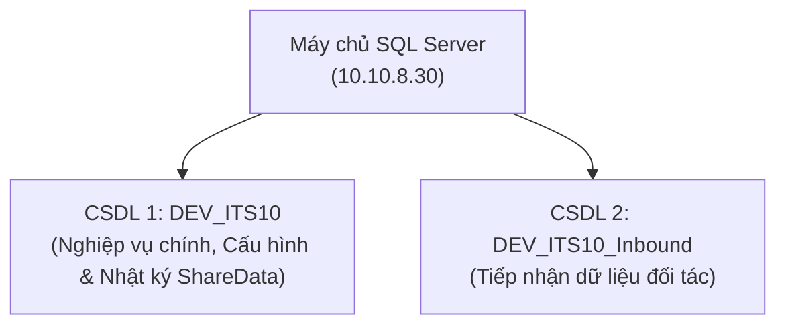
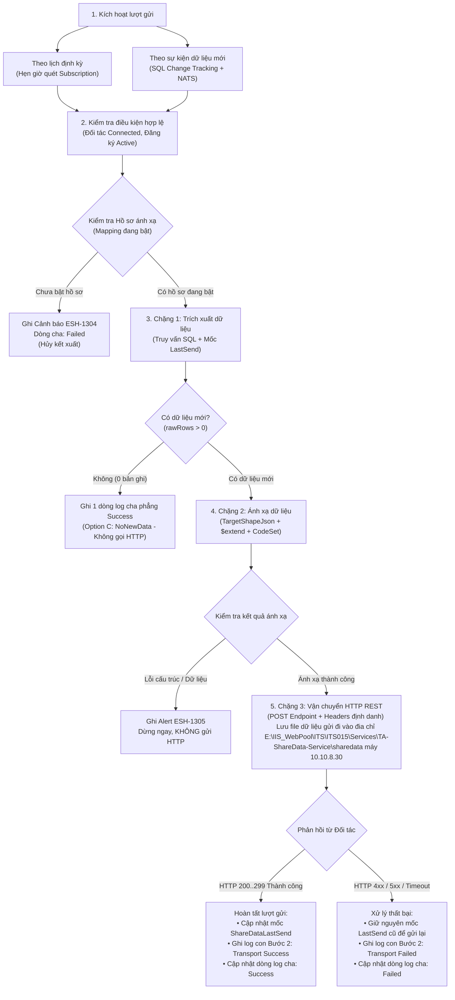
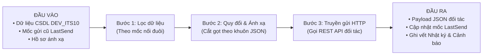
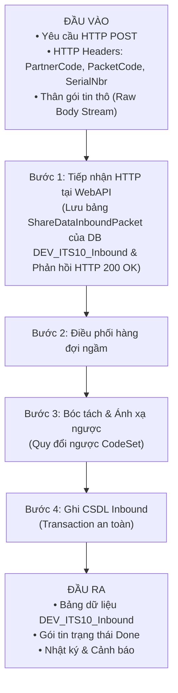

# Đặc tả Kỹ thuật & Nghiệp vụ: Luồng Gửi và Nhận Dữ liệu (ShareData / ESHARE)

> **Phiên bản:** 1.0 · **Ngày lập:** 06/10/2026  
> **Phân hệ:** Chia sẻ Dữ liệu — Dự án Cao tốc Hữu Nghị – Chi Lăng  
> **Dịch vụ & Ứng dụng thực thi:**  
> - **Backend WebAPI:** Tiếp nhận gói tin từ đối tác qua giao thức HTTP và cung cấp các API quản trị cấu hình hệ thống.  
> - **Background Worker:** Dịch vụ xử lý ngầm (`ShareDataWorker`) chịu trách nhiệm trích xuất dữ liệu, ánh xạ, truyền gửi HTTP (chiều gửi) và bóc tách ghi CSDL đích (chiều nhận).  
> - **Máy chủ Cơ sở Dữ liệu:** SQL Server tại địa chỉ `10.10.8.30` (gồm 2 CSDL nghiệp vụ: `DEV_ITS10` và `DEV_ITS10_Inbound`).  

---

## Mục lục

1. [Tổng quan & Mục tiêu tính năng](#1-tổng-quan--mục-tiêu-tính-năng)
   - 1.1 [Danh mục Cơ sở Dữ liệu & Bảng sử dụng (Database & Tables)](#11-danh-mục-cơ-sở-dữ-liệu--bảng-sử-dụng-database--tables)
2. [Kiến trúc luồng tổng thể](#2-kiến-trúc-luồng-tổng-thể)
   - 2.1 [Luồng Gửi dữ liệu (Outbound Pipeline)](#21-luồng-gửi-dữ-liệu-outbound-pipeline)
   - 2.2 [Luồng Nhận dữ liệu (Inbound Pipeline)](#22-luồng-nhận-dữ-liệu-inbound-pipeline)
3. [Đặc tả Luồng Gửi (Outbound Business Flow)](#3-đặc-tả-luồng-gửi-outbound-business-flow)
   - 3.1 [Điều kiện tiên quyết (Prerequisites)](#31-điều-kiện-tiên-quyết-prerequisites)
   - 3.2 [Đầu vào (Inputs)](#32-đầu-vào-inputs)
   - 3.3 [Quá trình xử lý (Processing & Business Logic)](#33-quá-trình-xử-lý-processing--business-logic)
   - 3.4 [Đầu ra (Outputs & Results)](#34-đầu-ra-outputs--results)
4. [Đặc tả Luồng Nhận (Inbound Business Flow)](#4-đặc-tả-luồng-nhận-inbound-business-flow)
   - 4.1 [Điều kiện tiên quyết (Prerequisites)](#41-điều-kiện-tiên-quyết-prerequisites)
   - 4.2 [Đầu vào (Inputs)](#42-đầu-vào-inputs)
   - 4.3 [Quá trình xử lý (Processing & Business Logic)](#43-quá-trình-xử-lý-processing--business-logic)
   - 4.4 [Đầu ra (Results)](#44-đầu-ra-results)
5. [Tiêu chí Nghiệm thu & Ma trận Kiểm thử (Acceptance Criteria)](#5-tiêu-chí-nghiệm-thu--ma-trận-kiểm-thử-acceptance-criteria)
   - 5.1 [Tiêu chí nghiệm thu Luồng Gửi (Outbound)](#51-tiêu-chí-nghiệm-thu-luồng-gửi-outbound)
   - 5.2 [Tiêu chí nghiệm thu Luồng Nhận (Inbound)](#52-tiêu-chí-nghiệm-thu-luồng-nhận-inbound)

---

## 1. Tổng quan & Mục tiêu tính năng

Phân hệ **Chia sẻ Dữ liệu (ShareData)** chịu trách nhiệm giao tiếp, tích hợp và trao đổi thông tin giao thông thông minh (ITS) giữa trung tâm điều hành tuyến Cao tốc Hữu Nghị – Chi Lăng với các đối tác bên ngoài (Cục Đường bộ, Đơn vị vận hành lân cận, CSGT, Nhà cung cấp dịch vụ thu phí/thời tiết/cứu hộ...).

Hệ thống hoạt động theo hai luồng nghiệp vụ độc lập nhưng đối xứng:

1. **Chiều Gửi (Outbound / Publication):**
   - Định kỳ theo lịch hoặc ngay khi phát sinh sự kiện mới trong CSDL nội bộ (`DEV_ITS10`).
   - Tự động trích xuất dữ liệu của 10 nhóm gói tin (101–110).
   - Biến đổi (mapping) hình dạng dữ liệu theo đúng khuôn JSON đối tác yêu cầu thông qua hồ sơ ánh xạ.
   - Đẩy trực tiếp qua giao thức HTTP REST API tới máy chủ đối tác, đồng thời lưu bản sao tệp cục bộ (đối với môi trường dev/kiểm thử).
2. **Chiều Nhận (Inbound / Tiếp nhận qua HTTP POST):**
   - Tiếp nhận gói tin trực tiếp từ đối tác thông qua giao thức **HTTP POST**.
   - Nhận diện định danh đối tác, mã loại gói tin và số thứ tự thông qua các **HTTP Request Headers** (`PartnerCode`, `PacketCode`, `SerialNbr`).
   - Đọc luồng thân gói tin HTTP (Raw Body Stream), lưu nguyên văn chuỗi JSON vào bảng đệm `ShareDataInboundPacket` (CSDL `DEV_ITS10_Inbound`) với trạng thái chờ xử lý (`Pending`) và phản hồi `HTTP 200 OK` ngay lập tức cho đối tác.
   - Dịch vụ ngầm (`DataInboundWorker` trong `ShareDataWorker`) định kỳ quét bảng đệm theo thứ tự `SerialNbr ASC`, thực hiện ánh xạ ngược và ghi dữ liệu an toàn vào các bảng nghiệp vụ trong CSDL `DEV_ITS10_Inbound`.

---

### 1.1 Danh mục Cơ sở Dữ liệu & Bảng sử dụng (Database & Tables)

Để phục vụ công tác kiểm tra, đối soát dữ liệu của QC và BA, toàn bộ các bảng CSDL được phân định rõ ràng trên máy chủ SQL Server `10.10.8.30`:

#### 1. CSDL `DEV_ITS10` (Nghiệp vụ chính, Cấu hình, Nhật ký & Nguồn chiều Gửi)
- **Nhóm bảng cấu hình phân hệ ShareData:**
  - `ShareDataPartner`: Danh mục đối tác kết nối, địa chỉ IP, cổng, URL nhận, trạng thái phiên kết nối.
  - `ShareDataSubscription`: Đăng ký chia sẻ dữ liệu (gói tin nào, chiều nào, chu kỳ lịch gửi, cờ gửi theo sự kiện).
  - `ShareDataMapping`: Hồ sơ ánh xạ cấu trúc JSON đối tác (`TargetShapeJson`).
  - `ShareDataCodeSet`: Bảng mã quy đổi giá trị nội bộ ⇄ đối tác.
  - `ShareDataPacket`: Danh mục 10 loại gói tin (101–110).
  - `ShareDataPacketField`: Danh mục các trường dữ liệu của từng gói tin.
  - `ShareDataPacketSql`: Danh mục bí danh và câu truy vấn mẫu.
- **Nhóm bảng nhật ký & giám sát (Lưu trực tiếp trong `DEV_ITS10`):**
  - `ShareDataActivityLog`: Nhật ký truyền nhận (dòng cha và các bước con).
  - `ShareDataAlertLog`: Cảnh báo sự cố (mã lỗi ESH).
  - `ShareDataLastSend`: Lưu mốc thời gian và ID gửi gần nhất của từng đối tác và gói tin (cursor nối đuôi).
  - `ShareDataTrackVersion`: Giám sát nhịp sống và trạng thái bắt biến động Change Tracking.
- **Nhóm bảng dữ liệu nguồn trích xuất (chiều Gửi đi):**
  - **Gói 101** (Giao thông chung): `TmsZoneStatus`, `TmsZone`, `TmsTrafficStatistic`
  - **Gói 102** (Camera CCTV): `CctvDevice`, `TmsEquipment` *(Hiện tại gói này không có data: Bảng CctvDevice chỉ có 1 camera mẫu, không có hình ảnh snapshot thực tế)*
  - **Gói 103** (Thiết bị dò xe VDS): `TmsTrafficData`, `TmsEquipment`
  - **Gói 104** (Trạm thời tiết Campbell): `TmsWeather`
  - **Gói 105** (Nhận dạng xe RFID): `TollTransactionOut`, `TmsVehicleRegistration` *(Hiện tại gói này không có data: Bảng nguồn có dữ liệu nhưng cấu hình danh mục trường đang bị lệch ID)*
  - **Gói 106** (Cân tải trọng động WIM): `TmsTrafficData` *(Hiện tại gói này không có data về tải trọng cân xe do chưa có bảng cân chuyên biệt)*
  - **Gói 107** (Sự cố giao thông): `TmsIncident`, `TmsEventType`
  - **Gói 108** (Biển báo điện tử VMS): `VmsCurrent`, `TmsEquipment`
  - **Gói 109** (Thu phí không dừng ETC): `TollTransactionOut`, `TollLane`, `TollStation` *(Có xe và trạm, nhưng không có data về giá cước tollPrice)*
  - **Gói 110** (Cảnh báo phát hành WP): `TmsIncident`, `VmsCurrent`, `TmsEquipment` *(Hiện tại gói này không có data do hầu hết sự cố trên CSDL đã kết thúc State='4', cần tạo sự cố mới đang mở để test)*

#### 2. CSDL `DEV_ITS10_Inbound` (Tiếp nhận dữ liệu đối tác - CSDL độc lập)
- **Nhóm bảng điều phối tiếp nhận:**
  - `ShareDataInboundPacket`: Hàng đợi lưu trữ nguyên văn chuỗi JSON thô do đối tác gửi lên, trạng thái xử lý (`Pending`, `Done`, `Failed`), kèm `ReceiveLogId` liên kết dòng log cha.
  - `ShareDataPacketWrite`: Cấu hình danh sách các bảng đích và câu lệnh SQL `MERGE` / `OPENJSON` để ghi dữ liệu.
- **Nhóm bảng lưu trữ dữ liệu nhận nghiệp vụ:**
  - `TmsZone`, `TmsTrafficStatistic`, `TmsZoneStatus` (Dữ liệu giao thông nhận về)
  - `TmsEquipment`, `CctvDevice` (Dữ liệu camera nhận về)
  - `TmsEquipment`, `TmsTrafficData` (Dữ liệu dò xe và cân xe nhận về)
  - `TmsVehicleRegistration`, `TollTransactionOut` (Dữ liệu RFID và ETC nhận về)
  - `TmsWeather` (Dữ liệu thời tiết nhận về)
  - `TmsEventType`, `TmsIncident` (Dữ liệu sự cố nhận về)
  - `TmsEquipment`, `VmsCurrent` (Dữ liệu biển báo nhận về)

---

## 2. Kiến trúc luồng tổng thể

Nhằm bảo đảm tính trực quan, luồng kiến trúc được tách thành 2 sơ đồ tuần tự theo chiều dọc:

### 2.1 Luồng Gửi dữ liệu (Outbound Pipeline)

---

## 3. Đặc tả Luồng Gửi (Outbound Business Flow)

### 3.1 Điều kiện tiên quyết (Prerequisites)
Để một lượt gửi được diễn ra, hệ thống kiểm tra 4 điều kiện nghiệp vụ:
1. **Đối tác (Partner):** Trạng thái `Kích hoạt` (Enable) và phiên kết nối đang mở (`Connected`).
2. **Hồ sơ ánh xạ (Mapping):** Bắt buộc phải có **đúng 1 hồ sơ đang BẬT (`Đang dùng`)** cho cặp `(Đối tác × Gói tin × Chiều Gửi)`. *(Nếu chưa có hoặc chưa bật, hệ thống sẽ chặn không gửi và ghi mã cảnh báo ESH-1304)*.
3. **Đăng ký chia sẻ (Subscription):** Đang ở trạng thái `Hoạt động` (Active).
4. **Điều kiện kích hoạt:**
   - **Kỳ lịch đến hạn:** Đến thời điểm gửi đã cấu hình (ví dụ: mỗi 60 giây, hoặc 09:00 hàng ngày).
   - **HOẶC Phát sinh dữ liệu mới (Theo sự kiện):** Bật cờ *Theo sự kiện* (`SendOnNewData`) và có dữ liệu mới phát sinh trong các bảng nghiệp vụ.

---

### 3.2 Đầu vào (Inputs)

| Thành phần đầu vào | Ý nghĩa nghiệp vụ | Nguồn cung cấp |
|---|---|---|
| **Dữ liệu nguồn nghiệp vụ** | Các bảng dữ liệu ITS nội bộ tương ứng 10 loại gói tin (vận tốc, sự cố, camera, thời tiết...). | CSDL `DEV_ITS10` |
| **Mốc gửi gần nhất (LastSend)** | Thời điểm và ID của bản ghi đã gửi thành công lần trước (dành cho 5 gói dữ liệu biến động). | Bảng `ShareDataLastSend` |
| **Hồ sơ ánh xạ (`TargetShapeJson`)** | Khuôn mẫu JSON đối tác yêu cầu, danh sách trường cần lấy, luật quy đổi mã và phép tính tổng hợp. | Bảng `ShareDataMapping` |
| **Bộ mã quy đổi (CodeSet)** | Danh mục đối chiếu giá trị nội bộ sang giá trị đối tác (ví dụ: `1` ⇄ `"CONGESTION"`). | Bảng `ShareDataCodeSet` |
| **Địa chỉ nhận của đối tác** | IP/Domain, Port, Endpoint URL tiếp nhận của đối tác. | Bảng `ShareDataPartner` |

---

### 3.3 Quá trình xử lý (Processing & Business Logic)

#### Bước 1: Lọc & Trích xuất dữ liệu (Extraction)
- Hệ thống truy vấn CSDL nội bộ `DEV_ITS10` để lấy dữ liệu theo từng loại gói tin:
  - **Với 5 gói biến động (103, 104, 106, 107, 109):** Trích xuất theo cơ chế nối đuôi tăng dần dựa trên mốc `ShareDataLastSend` (`UpdateTime > LastTime` và `ID > LastKey`), **tuyệt đối không gửi lại bản ghi đã gửi thành công trước đó**. Phân trang tối đa 100 bản ghi/lô.
  - **Với 5 gói hiện trạng/danh mục (101, 102, 105, 108, 110):** Luôn lấy toàn bộ trạng thái hiện tại của hệ thống (Snapshot) để đối tác cập nhật hiện trạng tức thời.
- 🛑 **Quy tắc kiểm tra rỗng:** Nếu CSDL **không có dữ liệu mới (0 bản ghi)** $\rightarrow$ Dừng xử lý ngay tại Bước 1, **không** gọi gửi API đối tác để chống spam mạng. Hệ thống ghi 1 dòng nhật ký Thành công phẳng (0 bản ghi, thông điệp `NoNewData`) để báo hiệu phiên quét bình thường.

#### Bước 2: Quy đổi giá trị & Đóng gói khuôn JSON (Mapping)
- **Điền 4 giá trị hệ thống tự động vào JSON:** Thời điểm gửi (`Now`), Số thứ tự gói (`Serial`), Mã gói tin (`PacketCode`), Mã đối tác (`PartnerCode`).
- **Quy đổi mã (CodeSet):** Đổi giá trị nội bộ sang mã của đối tác (ví dụ: trạng thái `1` $\rightarrow$ `"ON"`). Nếu giá trị nguồn rỗng thì áp dụng giá trị mặc định (`defaultPartnerValue`).
- **Định dạng dữ liệu:** Ép kiểu chuỗi, số thập phân, định dạng ngày giờ theo đúng mẫu đối tác yêu cầu.
- 🛑 **Chốt chặn an toàn:** Nếu phát hiện dữ liệu thiếu trường bắt buộc (`IsRequired`) hoặc cấu hình JSON bị lỗi $\rightarrow$ Dừng ngay lập tức, **không** gửi sang đối tác và ghi cảnh báo lỗi `ESH-1305` hoặc `ESH-1306`.

#### Bước 3: Truyền gửi dữ liệu (Transport)
- Đóng gói thành HTTP POST Request với Body là JSON đối tác.
- Đính kèm các HTTP Headers định danh: `PartnerCode`, `PacketCode`, `SerialNbr`.
- Gửi tới Endpoint của đối tác qua mạng. *(Đồng thời lưu 1 bản sao file backup tại thư mục máy chủ để kiểm toán)*. E:\IIS_WebPool\ITS\ITS015\Services\TA-ShareData-Service\sharedata

---

### 3.4 Đầu ra (Outputs & Results)

| Thành phần đầu ra | Kết quả mong đợi | Nơi kiểm tra cho QC & BA |
|---|---|---|
| **Gói tin gửi đối tác** | HTTP Request gửi thành công, máy chủ đối tác phản hồi mã HTTP `200..299`. | Log mạng / Phần mềm Mock Receiver |
| **Mốc gửi nối đuôi (`LastSend`)** | Cập nhật thời gian và ID mới nhất vào bảng `ShareDataLastSend`. Các lượt gửi sau sẽ nối tiếp từ mốc này. | Bảng CSDL `ShareDataLastSend` |
| **Nhật ký truyền nhận** | Xuất hiện 1 phiên gửi thành công gồm: Dòng Cha tổng quan + 2 dòng Con chi tiết (Bước 1: Trích xuất & Ánh xạ, Bước 2: Vận chuyển HTTP). | Màn hình **Nhật ký** (Tab *Truyền nhận*) |
| **Cảnh báo lỗi (khi thất bại)** | Nếu đối tác trả về HTTP 4xx/5xx hoặc mạng Timeout: Hệ thống đánh dấu phiên Thất bại, **giữ nguyên mốc LastSend cũ** (để gửi lại ở kỳ sau), và bắn mã cảnh báo `ESH-1302`/`ESH-1303`. | Màn hình **Cảnh báo lỗi** |

---

## 4. Đặc tả Luồng Nhận (Inbound Business Flow)

Dành cho BA và QC kiểm tra toàn bộ vòng đời khi đối tác bên ngoài đẩy dữ liệu vào hệ thống ITS.

### 4.1 Điều kiện tiên quyết (Prerequisites)
1. **Đối tác (Partner):** Đã khai báo mã định danh `PartnerCode` trong hệ thống.
2. **Hồ sơ ánh xạ (Mapping):** Bắt buộc phải có **đúng 1 hồ sơ chiều Nhận về (`Inbound`) hoặc Hai chiều (`Both`) đang BẬT (`Đang dùng`)**.
3. **Cấu hình câu ghi (PacketWrite):** Đã khai báo cấu hình bảng đích trong CSDL Inbound cho gói tin tương ứng.

---

### 4.2 Đầu vào (Inputs)

| Thành phần đầu vào | Ý nghĩa nghiệp vụ | Quy chuẩn bắt buộc |
|---|---|---|
| **Yêu cầu HTTP POST từ Đối tác** | Tiếp nhận gói tin gửi lên qua giao thức HTTP POST. | Giao thức HTTP (POST) |
| **HTTP Headers định danh** | Đọc trực tiếp từ `HttpRequest.Headers` để xác định đối tác và gói tin. | • `PartnerCode`: Mã đối tác (vd: `DRVN`) • `PacketCode`: Mã gói (vd: `107_incidentData`) • `SerialNbr`: Số thứ tự gói tin |
| **HTTP Body (Dữ liệu)** | Luồng dữ liệu thô (Raw Body Stream) chứa chuỗi JSON bản tin đối tác gửi lên. | Chuỗi văn bản UTF-8 (JSON hợp lệ) |

---

### 4.3 Quá trình xử lý (Processing & Business Logic)

#### Bước 1: Tiếp nhận qua giao thức HTTP tại WebAPI
- **Đọc Header thủ công:** WebAPI đọc trực tiếp từ `HttpRequest.Headers` gồm:
  - `PartnerCode`: Mã định danh đối tác (bắt buộc).
  - `PacketCode`: Mã loại gói tin (bắt buộc).
  - `SerialNbr`: Số thứ tự gói tin (dạng số nguyên, tùy chọn).
- **Đọc luồng dữ liệu thô (HTTP Body Stream):** Đọc toàn bộ nội dung body qua `StreamReader` dạng chuỗi UTF-8 (`RawContent`) và tính kích thước `ByteSize`.
- **Kiểm tra Đối tác (`ShareDataPartner`):**
  - Tìm đối tác theo `PartnerCode`. Nếu không tìm thấy $\rightarrow$ Ném ngoại lệ `DataNotExist` (báo lỗi HTTP).
  - Nếu đối tác đang bị khóa (`Status != Enable`) $\rightarrow$ Ném ngoại lệ `PartnerDisabled` (báo lỗi HTTP).
- **Kiểm tra Đăng ký (`ShareDataSubscription`):**
  - Tìm gói tin trong `ShareDataPacket` và tra cứu đăng ký nhận (`Direction = Inbound`).
  - Nếu có đăng ký hợp lệ $\rightarrow$ Gán trạng thái gói `ProcessState = Pending`.
  - Nếu chưa có đăng ký hoặc mã gói tin chưa khai báo $\rightarrow$ Gán `ProcessState = NoSubscription` kèm lý do lỗi.
- **Lưu CSDL đệm:** Lưu nguyên văn bản ghi vào bảng `ShareDataInboundPacket` trên CSDL `DEV_ITS10_Inbound` cùng mã `ReceiveLogId`.
- **Ghi nhật ký Bước 1:** Ghi dòng log Cha (`Queued`) và dòng con Bước 1 (`ReceiveRaw`) vào `ShareDataActivityLog` trên CSDL `DEV_ITS10`.
- ⚡ **Phản hồi tức thì `HTTP 200 OK` cho đối tác:** Xác nhận máy chủ đã tiếp nhận và lưu đệm an toàn. Dịch vụ WebAPI giải phóng kết nối HTTP ngay lập tức, chuyển giao toàn bộ công đoạn bóc tách, mapping và nạp dữ liệu cho Background Worker xử lý bất đồng bộ.

#### Bước 2: Bóc tách cấu trúc & Quy đổi ngược (Reverse Mapping)
- Tra cứu hồ sơ ánh xạ chiều nhận đang bật. *(Nếu không có hồ sơ $\rightarrow$ Đánh dấu gói tin Thất bại và bắn cảnh báo `ESH-1304`)*.
- Phân tích cú pháp JSON đối tác, trích xuất từng trường dữ liệu và map ngược về đúng tên cột nội bộ (`FieldKey`).
- **Quy đổi mã ngược (CodeSet):** Chuyển đổi mã đối tác sang giá trị nội bộ (ví dụ: `"CONGESTION"` $\rightarrow$ `1`). Nếu đối tác không gửi giá trị thì điền giá trị nội bộ mặc định (`defaultSourceValue`).

#### Bước 3: Thực thi ghi dữ liệu vào CSDL Inbound
- Chạy các câu lệnh ghi tương ứng theo thứ tự khai báo trong `ShareDataPacketWrite`.
- 🔒 **Nguyên tắc an toàn dữ liệu:** Toàn bộ dữ liệu nhận về **chỉ được ghi vào CSDL riêng biệt `DEV_ITS10_Inbound`**, tuyệt đối **không** ghi trực tiếp vào CSDL vận hành chính `DEV_ITS10`.
- **Giao dịch toàn vẹn (Transaction):** Mọi thao tác ghi của một gói tin được bọc trong 1 Transaction duy nhất:
  - Nếu thành công: Xác nhận lưu dữ liệu vào các bảng đích, chuyển trạng thái gói tin sang `Done`.
  - Nếu lỗi SQL hoặc sai kiểu dữ liệu: Rollback toàn bộ, chuyển trạng thái gói tin sang `Failed`, ghi nhận cảnh báo lỗi `ESH-1307`.

---

### 4.4 Đầu ra (Results)

| Thành phần đầu ra | Kết quả mong đợi | Nơi kiểm tra cho QC & BA |
|---|---|---|
| **Dữ liệu được lưu trữ** | Dữ liệu hoàn chỉnh xuất hiện tại các bảng nghiệp vụ tương ứng (sự cố, đo đếm xe, thời tiết...) & lưu file trên máy thư mục server. | CSDL `DEV_ITS10_Inbound` & `E:\IIS_WebPool\ITS\ITS015\Services\TA-ShareData-Service\sharedata` |
| **Trạng thái gói tin** | Bản ghi trong hàng đợi chuyển từ `Pending` $\rightarrow$ `Done` (hoặc `Failed` nếu lỗi). | Bảng CSDL `ShareDataInboundPacket` |
| **Nhật ký truyền nhận** | Cập nhật dòng Cha sang Thành công + ghi nhận dòng Con Bước 2 (Bóc tách & Lưu trữ CSDL). | Màn hình **Nhật ký** (Tab *Truyền nhận*) |
| **Cảnh báo lỗi (khi thất bại)** | Nếu JSON sai cấu trúc, thiếu hồ sơ ánh xạ hoặc lỗi câu lệnh SQL: Gói tin đánh dấu `Failed` và xuất hiện dòng cảnh báo tương ứng. | Màn hình **Cảnh báo lỗi** |

---
