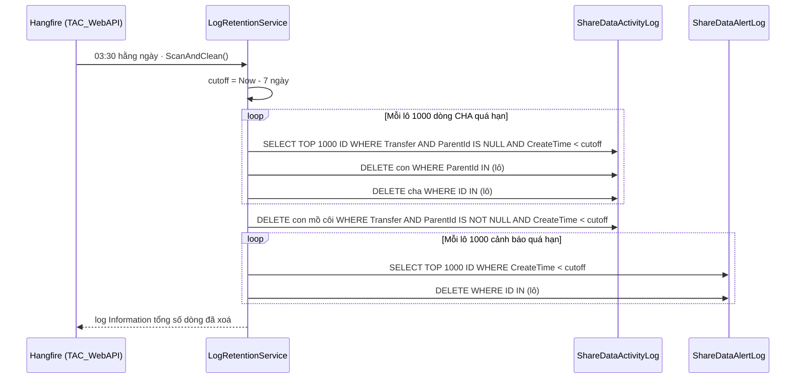

# SV-13 mở rộng · Dọn nhật ký nghiệp vụ ShareData — giữ tối đa 7 ngày

**Tệp prompt:** `DocBusinessThienAn/HữuNghị-ChiLăng/ShareData/Prompt/sharedata-sv13-don-log-nghiep-vu-7-ngay-prompt.md`

> 📌 Soạn 05/10/2026 theo chỉ đạo: **làm luôn**, tham khảo khuôn có sẵn, giữ log **tối đa 7 ngày**. Thay cho quyết định "tạm bỏ qua" ngày 02/10/2026 (MasterPlan dòng `SV-13`, §10).
> 🔴 **Nhánh gốc BẮT BUỘC:** tách từ `feat/20261002-XD001.5.6-service-tich-hop-du-lieu-2` (PR chưa merge vào `dev`). Cột `ShareDataActivityLog.ParentId` / `StepNbr` **chỉ có ở nhánh này** — tách từ `dev` sẽ không biên dịch.
> Nhánh đề xuất: `feat/20261006-XD001.5.6-sharedata-sv13-don-log-nghiep-vu`.

## 1. Mục tiêu

Hai bảng nhật ký đang phình không giới hạn (đo staging 02/10/2026: `ShareDataActivityLog` 61.596 dòng, `ShareDataAlertLog` 13.706 dòng; log cha–con nhân ×3 mỗi trang gửi). Thêm **một job Hangfire duy nhất** chạy mỗi đêm, xoá hard dòng cũ hơn **7 ngày**.

## 2. Khuôn tham khảo (đã đối chiếu code 05/10/2026)

| Khuôn | Vị trí | Lấy gì |
| --- | --- | --- |
| `NotiRetentionService` | `Modules/Notification/Module.Notification/Infrastructure/Services/NotiRetentionService.cs` | Service `IScoped`, hàm Hangfire gọi trực tiếp, `ClearFilter()`, **xoá con trước – cha sau** để không sót mồ côi khi process chết giữa chừng |
| Đăng ký job | `TAC_WebAPI/Startup.cs:221-229` (khối `if Hangfire:Enable`) | `RecurringJob.AddOrUpdate<T>(jobId, ..., cron, TimeZone.Local)` — 1 job cho cả phân hệ |
| `ShareDataTransferLog.CleanTrackingLogs` | `ShareDataWorker/Infrastructure/Logging/ShareDataTransferLog.cs` (nhánh PR) | Vòng lặp `Take(1000)` lấy ID → `Deleteable` theo lô, tránh khoá bảng |

📌 Khác khuôn Noti có chủ đích: **không** đọc cron từ `SysOpConfig` (ShareData chưa có nhóm cấu hình, thêm vào phải kèm script seed) ⇒ cron + số ngày là **hằng số**. Cần đổi thì sửa hằng.

## 3. Luồng dữ liệu



**Giải thích từng bước:**

1. **Ai ghi log?** ShareDataWorker ghi trong lúc gửi/nhận (`ShareDataTransferLog.WriteActivityAsync` / `WriteAlertAsync`). Một trang gửi = **1 dòng cha** (`ParentId = null`) + các **dòng con** (`ParentId = ID cha`, `StepNbr = 1, 2…`). Lượt không có dữ liệu = 1 dòng phẳng (`ParentId = null`, không con).
2. **Ai dọn?** TAC_WebAPI (nơi đã có Hangfire) — ⛔ **không** thêm worker mới trong ShareDataWorker (giữ đúng tinh thần quyết định 02/10). Worker chỉ ghi, API dọn, hai bên không chạm nhau.
3. **Chọn dòng nào?** Chỉ `LogType = Transfer` (gửi/nhận + hạ tầng `ESH-16xx`). Dòng `LogType = CONFIG` (ai sửa đối tác, gói tin, ánh xạ…) là **nhật ký kiểm toán** ⇒ **giữ nguyên**, khối lượng nhỏ.
4. **Tại sao xoá theo CHA?** Nếu xoá thuần theo `CreateTime`, ở mép 7 ngày có thể xoá cha mà con (ghi chậm vài giây) còn sót. Lấy cha quá hạn rồi xoá **cả cây** ⇒ màn Nhật ký không bao giờ hiện con mất cha.
5. **Tại sao xoá con TRƯỚC?** Nếu process chết giữa hai lệnh, còn lại cha không con (vẫn hiển thị được) chứ không còn con mồ côi. Bước vét mồ côi ở cuối dọn nốt phần sót từ lần chết trước — an toàn vì con luôn sinh **sau** cha, con quá hạn ⇒ cha chắc chắn đã quá hạn.
6. **Cột thời gian:** `CreateTime` — SqlSugar `EntityTenant` luôn ép `CreateTime = GETDATE()` khi insert (đã ghi nhận ở test `CleanupTrackingLogs_...` dòng 2859), và `ShareDataActivityLog` có index `index_{table}_OA` trên cột này.
7. **`ShareDataAlertLog`:** xoá mọi dòng quá 7 ngày, **không** phân biệt đã/chưa xác nhận (`Acknowledged`) — "tối đa 7 ngày" là trần cứng.
8. ⛔ **Không đụng** `ShareDataInboundPacket` (bằng chứng đối soát — MasterPlan §10).

📌 `CleanTrackingLogs` của worker (chạy 1 lần lúc khởi động, xoá `ESH-16xx` quá 7 ngày) **giữ nguyên** — trùng phạm vi nhưng vô hại, gỡ là việc khác.

## 4. Ràng buộc

- ⛔ Không hậu tố `Async` cho hàm mới (rule 7). Không magic number/string — dùng hằng (rule 7).
- ⛔ Không thêm `using` trùng `GlobalUsings.cs` (rule 4.12) — chép đúng bộ `using` của `ActivityLoggerService.cs` rồi bỏ cái không dùng.
- ORM (`Queryable`/`Deleteable`), ⛔ không SQL thô trong code chạy thật.
- ⛔ AI không chạy DDL/DML; tính năng này **không** đổi schema ⇒ không có script `.sql`.

## 5. Thay đổi

### TĐ1 · [MODIFY] `Module.ShareData.Core/Constants/ShareDataConst.cs`

Thêm lớp con trong `ShareDataConst` (cạnh `SubStateGroup`):

```csharp
/// <summary>
/// Author: <tên người áp>
/// Description: Cấu hình job dọn nhật ký nghiệp vụ ShareData (Hangfire trong TAC_WebAPI).
///              Sửa cron/số ngày phải khởi động lại API — job chỉ đăng ký lúc Startup.Configure.
/// Created date: 06/10/2026
/// </summary>
public static class LogRetention
{
    public const string JobId = "sharedata-log-retention-scan";

    /// <summary>03:30 hằng ngày — lệch 30 phút so với noti-retention-scan (03:00) để không dồn tải.</summary>
    public const string Cron = "30 3 * * *";

    /// <summary>Số ngày giữ tối đa cho nhật ký truyền nhận và cảnh báo.</summary>
    public const int Days = 7;

    /// <summary>Số dòng mỗi lô xoá — giữ mệnh đề IN nhỏ, tránh khoá bảng lâu.</summary>
    public const int BatchSize = 1000;
}
```

### TĐ2 · [NEW] `Module.ShareData/Infrastructure/Services/ShareDataLogRetention/LogRetentionService.cs`

📌 Quy ước namespace: thư mục `ShareDataX/` ↔ `...Services.ShareDataXService` (giống `ShareDataActivity` → `ShareDataActivityService`).

```csharp
namespace Module.ShareData.Infrastructure.Services.ShareDataLogRetentionService
{
    /// <summary>
    /// Author: <tên người áp>
    /// Description: Job dọn nhật ký nghiệp vụ ShareData quá hạn — Hangfire gọi trực tiếp ScanAndClean.
    ///              Phạm vi: ShareDataActivityLog nhóm Transfer (xoá nguyên cây cha–con) và toàn bộ ShareDataAlertLog.
    ///              Giữ nguyên nhật ký CONFIG (kiểm toán) và ShareDataInboundPacket (bằng chứng đối soát).
    /// Created date: 06/10/2026
    /// </summary>
    public class LogRetentionService : IScoped
    {
        private readonly BaseRepository<ShareDataActivityLog> _activityLogRep;
        private readonly BaseRepository<ShareDataAlertLog> _alertLogRep;
        private readonly ILogger<LogRetentionService> _logger;

        public LogRetentionService(
            BaseRepository<ShareDataActivityLog> activityLogRep,
            BaseRepository<ShareDataAlertLog> alertLogRep,
            ILogger<LogRetentionService> logger)
        {
            _activityLogRep = activityLogRep;
            _alertLogRep = alertLogRep;
            _logger = logger;
        }

        /// <summary>
        /// Author: <tên người áp>
        /// Description: Xoá hard nhật ký cũ hơn ShareDataConst.LogRetention.Days ngày.
        /// Created date: 06/10/2026
        /// </summary>
        public async Task ScanAndClean(CancellationToken cancellationToken)
        {
            var cutoff = DateTime.Now.AddDays(-ShareDataConst.LogRetention.Days);

            var activityDeleted = await CleanActivityLogs(cutoff, cancellationToken);
            var alertDeleted = await CleanAlertLogs(cutoff, cancellationToken);

            if (activityDeleted + alertDeleted > 0)
                _logger.LogInformation("🧹 ShareData log retention: xoá {Activity} dòng nhật ký truyền nhận, {Alert} dòng cảnh báo, cutoff={Cutoff}",
                    activityDeleted, alertDeleted, cutoff);
        }

        /// <summary>Xoá theo cây: lấy lô dòng cha quá hạn, xoá con trước rồi tới cha; cuối cùng vét con mồ côi.</summary>
        private async Task<int> CleanActivityLogs(DateTime cutoff, CancellationToken cancellationToken)
        {
            var deleted = 0;

            while (true)
            {
                cancellationToken.ThrowIfCancellationRequested();

                // ClearFilter: retention là bước cuối, phải dọn cả dòng đã soft-delete — giống NotiRetentionService.
                var parentIds = await _activityLogRep.AsQueryable()
                    .ClearFilter()
                    .Where(x => x.LogType == BaseEnums.LogTypeEnum.Transfer && x.ParentId == null && x.CreateTime < cutoff)
                    .Select(x => x.ID)
                    .Take(ShareDataConst.LogRetention.BatchSize)
                    .ToListAsync();

                if (parentIds.Count == 0)
                    break;

                // Con trước — xoá cha trước sẽ để lại con mồ côi nếu process chết giữa chừng.
                deleted += await _activityLogRep.Context.Deleteable<ShareDataActivityLog>()
                    .Where(x => parentIds.Contains(x.ParentId))
                    .ExecuteCommandAsync();

                deleted += await _activityLogRep.Context.Deleteable<ShareDataActivityLog>()
                    .Where(x => parentIds.Contains(x.ID))
                    .ExecuteCommandAsync();
            }

            // Con luôn sinh sau cha: con quá hạn thì cha chắc chắn đã quá hạn và đã bị xoá ở vòng trên.
            deleted += await _activityLogRep.Context.Deleteable<ShareDataActivityLog>()
                .Where(x => x.LogType == BaseEnums.LogTypeEnum.Transfer && x.ParentId != null && x.CreateTime < cutoff)
                .ExecuteCommandAsync();

            return deleted;
        }

        /// <summary>Xoá cảnh báo quá hạn theo lô, không phân biệt đã/chưa xác nhận.</summary>
        private async Task<int> CleanAlertLogs(DateTime cutoff, CancellationToken cancellationToken)
        {
            var deleted = 0;

            while (true)
            {
                cancellationToken.ThrowIfCancellationRequested();

                var ids = await _alertLogRep.AsQueryable()
                    .ClearFilter()
                    .Where(x => x.CreateTime < cutoff)
                    .Select(x => x.ID)
                    .Take(ShareDataConst.LogRetention.BatchSize)
                    .ToListAsync();

                if (ids.Count == 0)
                    break;

                deleted += await _alertLogRep.Context.Deleteable<ShareDataAlertLog>()
                    .Where(x => ids.Contains(x.ID))
                    .ExecuteCommandAsync();
            }

            return deleted;
        }
    }
}
```

⚠️ Khi áp: kiểm `parentIds.Contains(x.ParentId)` (List<string> vs `string?`) SqlSugar dịch đúng `IN`; nếu báo lỗi kiểu thì dùng `SqlFunc.ContainsArray(parentIds, x.ParentId)`.

### TĐ3 · [MODIFY] `TAC_WebAPI/Startup.cs` — ngay sau khối `noti-retention-scan` (dòng 225-229)

```csharp
                // Quét ShareDataActivityLog (nhóm truyền nhận) + ShareDataAlertLog, xoá hard dòng quá 7 ngày.
                // MỘT job duy nhất cho phân hệ, cron là hằng số (ShareData chưa có nhóm SysOpConfig).
                RecurringJob.AddOrUpdate<LogRetentionService>(
                    recurringJobId: ShareDataConst.LogRetention.JobId,
                    methodCall: service => service.ScanAndClean(CancellationToken.None),
                    cronExpression: ShareDataConst.LogRetention.Cron,
                    options: new RecurringJobOptions { TimeZone = TimeZoneInfo.Local });
```

Thêm `using Module.ShareData.Core.Constants;` và `using Module.ShareData.Infrastructure.Services.ShareDataLogRetentionService;` (xếp theo thứ tự chữ cái cạnh `using Module.ShareData.Extensions;`).

## 6. Kiểm thử — [NEW] `tests/BE/ITS/ShareData/Services/LogRetentionServiceTests.cs`

Khuôn: `[Collection("api")]`, ctor nhận `Host`, lấy `LogRetentionService` + `ISqlSugarClient` qua `_host.Services.CreateScope()`. ⛔ Không mock, ⛔ không `try-finally`. Rà `tests/BE/appsettings.Test.json` trỏ **local** trước khi chạy (rule 11).

🔴 Làm già dữ liệu: `EntityTenant` ép `CreateTime = GETDATE()` khi insert ⇒ sau insert phải UPDATE lại `CreateTime`. Thử `Updateable().SetColumns(x => x.CreateTime == old)` trước; nếu AOP ghi đè thì dùng câu UPDATE như test `CleanupTrackingLogs_...` (dòng 2860).

| # | Tên test | Arrange | Assert |
| --- | --- | --- | --- |
| 1 | `ScanAndClean_ExpiredParent_DeletesWholeTree_Test` | Cha Transfer 10 ngày + 2 con: 1 con 10 ngày, 1 con **6 ngày** (mép hạn) | Cả 3 dòng bị xoá |
| 2 | `ScanAndClean_RecentTreeAndConfigLog_AreKept_Test` | Cha + con Transfer 3 ngày; 1 dòng `CONFIG` 30 ngày | Cả 3 dòng còn nguyên |
| 3 | `ScanAndClean_OrphanChild_IsDeleted_Test` | 1 dòng con Transfer 10 ngày, `ParentId` trỏ ID không tồn tại | Bị xoá |
| 4 | `ScanAndClean_AlertLog_DeletesOnlyExpired_Test` | Cảnh báo 10 ngày `Acknowledged = false`, 10 ngày `true`, 3 ngày | 2 dòng cũ bị xoá, dòng 3 ngày còn |

```powershell
dotnet build TA-ITS015-WEBAPI-V1.0/src/TAC_WebAPI/TAC_WebAPI.csproj
dotnet test tests/BE/test.csproj --filter "FullyQualifiedName~LogRetentionServiceTests"
dotnet test tests/BE/test.csproj --filter "FullyQualifiedName~ShareData"
```

## 7. Hậu kiểm thủ công

- Bật `Hangfire:Enable = true` local → mở `/jobs` → Recurring Jobs có `sharedata-log-retention-scan` cron `30 3 * * *` → bấm **Trigger now** → xem log `🧹 ShareData log retention…`.
- Màn Nhật ký hoạt động: không còn dòng truyền nhận quá 7 ngày; dòng CONFIG cũ vẫn hiện.

## 8. Cập nhật tài liệu sau khi xong

- `Sharedata_MasterPlan.md` dòng `SV-13` (gạch ⚠️ "CHƯA LÀM" dọn log nghiệp vụ → ✅) và dòng §10 "Thêm worker riêng dọn nhật ký nghiệp vụ" (ghi: làm bằng Hangfire trong API, không thêm worker).

**Commit gợi ý:** `feat(sharedata): XD001.5.6 - job Hangfire dọn nhật ký nghiệp vụ giữ tối đa 7 ngày (SV-13)`
