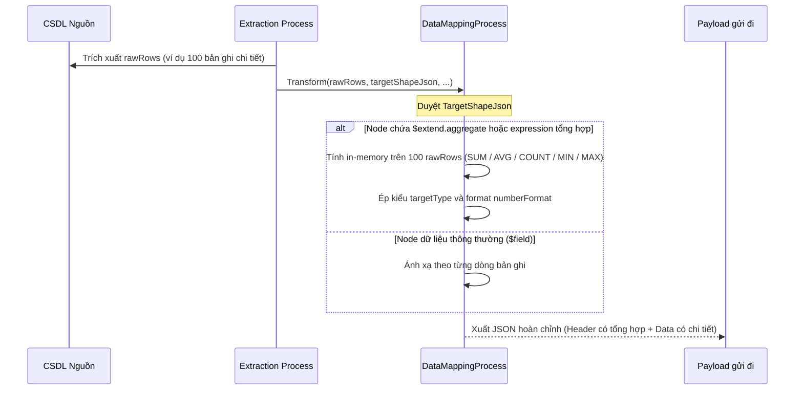

# SV-14 · Hàm tổng hợp `SUM` · `AVG` · `COUNT` · `MIN` · `MAX` trong Ánh xạ dữ liệu

**Tệp prompt:** `DocBusinessThienAn/HữuNghị-ChiLăng/ShareData/Prompt/sharedata-sv14-ham-tong-hop-mapping-prompt.md`

> 📌 Soạn 05/10/2026 theo chỉ đạo: thi công theo **Hướng B** (Mapping Worker tính in-memory trên tập `rawRows` đã trích xuất). Bổ sung cả FE (`editMapping.vue`) và Worker Outbound (`DataMappingProcess.cs`).
> Nguồn: `Sharedata_MasterPlan.md` dòng `SV-14` + `11-09-2026-sharedata-script.md` dòng 90 & 132.
> Nhánh đề xuất: `feat/20261006-XD001.5.6-sharedata-sv14-ham-tong-hop` (tách từ `dev` hoặc nhánh PR).

## 1. Mục tiêu

Cho phép cấu hình các phép tính tổng hợp (`SUM`, `AVG`, `COUNT`, `MIN`, `MAX`) trên giao diện Ánh xạ dữ liệu (`editMapping.vue`). Worker Outbound (`DataMappingProcess.cs`) khi render gói tin sẽ tự động tính toán giá trị tổng hợp trên toàn bộ tập dữ liệu thô (`rawRows`) vừa lấy lên và điền vào trường tương ứng (ví dụ: trường `totalVehicles`, `avgSpeed` ở Header gói tin).

## 2. Kiến trúc giải pháp (Hướng B — In-Memory Mapping)



**Tại sao chọn Hướng B?**
1. **Bảo toàn dữ liệu chi tiết:** Không dùng `GROUP BY` ở SQL nên vẫn gửi được danh sách chi tiết từng xe/thiết bị kèm theo giá trị tổng hợp ở Header.
2. **Không sửa SQL của 11 gói tin:** Các hàm trích xuất `QueryPacket101` – `QueryPacket111` giữ nguyên cấu trúc gốc, không lo nguy cơ SQL Injection.
3. **Linh hoạt tối đa:** Người dùng có thể cấu hình hàm tổng hợp ở bất kỳ vị trí nào trên cây JSON (Header, Footer, hoặc dòng lặp) chỉ bằng vài thao tác trên giao diện Ánh xạ.

## 3. Ràng buộc & Tiêu chuẩn

- **Phép tính hỗ trợ:** `SUM` (tổng), `AVG` (trung bình), `COUNT` (đếm bản ghi), `MIN` (nhỏ nhất), `MAX` (lớn nhất).
- **Quy tắc an toàn tính toán (Edge cases):**
  - Tập `rawRows` rỗng (0 dòng): `COUNT` trả `0`, `SUM` trả `0`, `AVG` trả `null` (hoặc `0` nếu kiểu số bắt buộc), tuyệt đối không để lỗi chia cho 0 (`DivideByZeroException`).
  - Dòng có giá trị `null` hoặc không phải số: Tự động bỏ qua khi tính `SUM`/`AVG`/`MIN`/`MAX`. `COUNT` đếm số dòng có giá trị khác null của `$field` (nếu `$field` rỗng thì đếm tổng số dòng).
  - Làm tròn: Nếu có `$extend.numberFormat` (hoặc `targetType` là số thực), kết quả `AVG` được format tương ứng.
- **Quy ước mã nguồn:** Không magic strings, dùng hằng số hoặc enum rõ ràng; không thêm `using` thừa.

---

## 4. Chi tiết thay đổi

### TĐ1 · [MODIFY] Backend: `DataMappingProcess.cs`
**Vị trí:** `src/Services/ShareData/ShareDataWorker/Infrastructure/Services/DataOutbound/Mapping/DataMappingProcess.cs`

1. **Bổ sung hàm tính tổng hợp in-memory:**
```csharp
/// <summary>
/// Author: <tên người áp>
/// Description: Tính toán giá trị tổng hợp (SUM, AVG, COUNT, MIN, MAX) trên danh sách bản ghi thô.
/// Created date: 06/10/2026
/// </summary>
private static object? ComputeAggregate(
    string aggregateFunc,
    string? sourceFieldKey,
    IReadOnlyList<IDictionary<string, object?>> rows)
{
    if (string.IsNullOrWhiteSpace(aggregateFunc))
        return null;

    var func = aggregateFunc.Trim().ToUpperInvariant();

    if (func == "COUNT")
    {
        if (string.IsNullOrWhiteSpace(sourceFieldKey))
            return rows.Count;
        return rows.Count(r => r.TryGetValue(sourceFieldKey, out var v) && v != null && !string.IsNullOrWhiteSpace(v.ToString()));
    }

    var numbers = new List<double>();
    if (!string.IsNullOrWhiteSpace(sourceFieldKey))
    {
        foreach (var r in rows)
        {
            if (r.TryGetValue(sourceFieldKey, out var v) && v != null)
            {
                if (double.TryParse(v.ToString(), NumberStyles.Any, CultureInfo.InvariantCulture, out var num))
                {
                    numbers.Add(num);
                }
            }
        }
    }

    if (numbers.Count == 0)
    {
        return func switch
        {
            "SUM" => 0.0,
            "AVG" => null,
            _ => null
        };
    }

    return func switch
    {
        "SUM" => numbers.Sum(),
        "AVG" => numbers.Average(),
        "MIN" => numbers.Min(),
        "MAX" => numbers.Max(),
        _ => null
    };
}
```

2. **Cập nhật `RenderShapeAggregate`:**
Tại vị trí xử lý node có `$field` ở tầng aggregate (khoảng dòng 576–590):
Kiểm tra nếu node có `$extend.aggregate`:
- Đọc `aggregate` (ví dụ `"SUM"`, `"AVG"`).
- Gọi `ComputeAggregate(aggregate, sourceFieldKey, allRows)`.
- Áp dụng tiếp quy tắc ép kiểu (`targetType`) và định dạng số (`numberFormat`) nếu có.

3. **Hỗ trợ trong `$extend.expression` (tùy chọn mở rộng):**
Nếu node có `$extend.expression` dạng `AVG(fieldName)` hoặc `SUM(fieldName)`: Parse tên hàm và tên trường để chuyển về `ComputeAggregate`.

---

### TĐ2 · [MODIFY] Frontend: `editMapping.vue`
**Vị trí:** `src/src/views/sharedata/mapping/component/editMapping.vue`

1. **Thêm trường `aggregate` vào model cấu hình lá (`editingCfg`):**
```typescript
interface LeafConfig {
    fieldKey?: string;
    sourceField?: string;
    targetType?: string;
    codeSet?: string;
    dateFormat?: string;
    numberFormat?: string;
    defaultPartnerValue?: string;
    defaultSourceValue?: string;
    aggregate?: string; // Bổ sung: '', 'SUM', 'AVG', 'COUNT', 'MIN', 'MAX'
    // ...
}
```

2. **Bổ sung Form Item trong Modal cấu hình lá (sau dropdown Loại dữ liệu `targetType`):**
```html
<el-form-item :label="$t('lz.label.sharedataMapping.aggregate') || 'Phép tính tổng hợp'">
    <el-select v-model="editingCfg.aggregate" size="small" clearable placeholder="Không (mặc định)" @change="refreshShape">
        <el-option label="Không" value="" />
        <el-option label="SUM - Tính tổng" value="SUM" />
        <el-option label="AVG - Tính trung bình" value="AVG" />
        <el-option label="COUNT - Đếm số lượng" value="COUNT" />
        <el-option label="MIN - Nhỏ nhất" value="MIN" />
        <el-option label="MAX - Lớn nhất" value="MAX" />
    </el-select>
</el-form-item>
```

3. **Cập nhật logic `buildShape` và `parseShape`:**
- Khi mở modal cấu hình trường: Đọc `$extend.aggregate` gán vào `editingCfg.aggregate`.
- Khi đóng modal / lưu: Ghi `aggregate` vào object `$extend` trong `TargetShapeJson` (nếu rỗng thì bỏ qua để JSON gọn).
- Cập nhật hàm xem trước (`previewLeafValue`) nếu có để hiển thị kết quả giả lập khi có hàm tổng hợp.

4. **Bổ sung i18n:**
Thêm nhãn `lz.label.sharedataMapping.aggregate`: `"Phép tính tổng hợp"` trong các tệp ngôn ngữ (`vi.json`, `en.json`).

---

## 5. Kế hoạch kiểm thử tự động (Unit & Integration Tests)

Tạo mới tệp kiểm thử: `tests/BE/ITS/ShareData/Services/DataMappingAggregateTests.cs` (hoặc bổ sung vào `DataOutboundServiceTests.cs`).

| STT | Kịch bản kiểm thử | Dữ liệu đầu vào | Kết quả mong đợi |
| --- | --- | --- | --- |
| 1 | Tính `SUM` và `AVG` trên Header gói tin phân cấp | 5 dòng dữ liệu có `speed = [50, 60, 70, 80, 90]` | Header có `totalSpeed = 350`, `avgSpeed = 70.0` |
| 2 | Tính `COUNT` bản ghi | 5 dòng dữ liệu | Header có `recordCount = 5` |
| 3 | Xử lý tập dữ liệu rỗng (0 dòng) | `rawRows = []` | Không ném ngoại lệ; `COUNT = 0`, `SUM = 0`, `AVG = null` |
| 4 | Xử lý dữ liệu chứa `null` và giá trị không phải số | `speed = [100, null, "abc", 50]` | Bỏ qua null và "abc"; `SUM = 150`, `AVG = 75.0` |
| 5 | Kết hợp định dạng số `numberFormat` | `speed = [10, 20, 25]` -> `AVG = 18.3333...`, format `0.00` | Kết quả xuất ra `18.33` |

---

## 6. Kiểm thử thủ công

1. Mở màn hình **Ánh xạ dữ liệu** (`mapping/index.vue`) -> Chọn một hồ sơ ánh xạ Outbound dạng Header + Data.
2. Bấm cấu hình trường tại Header (ví dụ trường `soLuongXe`, `tocDoTrungBinh`).
3. Chọn phép tính `COUNT` cho trường số lượng và `AVG` cho trường tốc độ -> Bấm Lưu.
4. Mở lại cấu hình kiểm tra xem giá trị `aggregate` có được lưu chuẩn xác trong `TargetShapeJson`.
5. Kích hoạt gửi gói tin thử nghiệm và xem JSON đầu ra đối tác nhận được: Kiểm tra giá trị ở Header được tính đúng theo các bản ghi chi tiết trong mảng `data`.

**Commit gợi ý:** `feat(sharedata): XD001.5.6 - bổ sung hàm tổng hợp SUM, AVG, COUNT trong ánh xạ dữ liệu (SV-14)`
