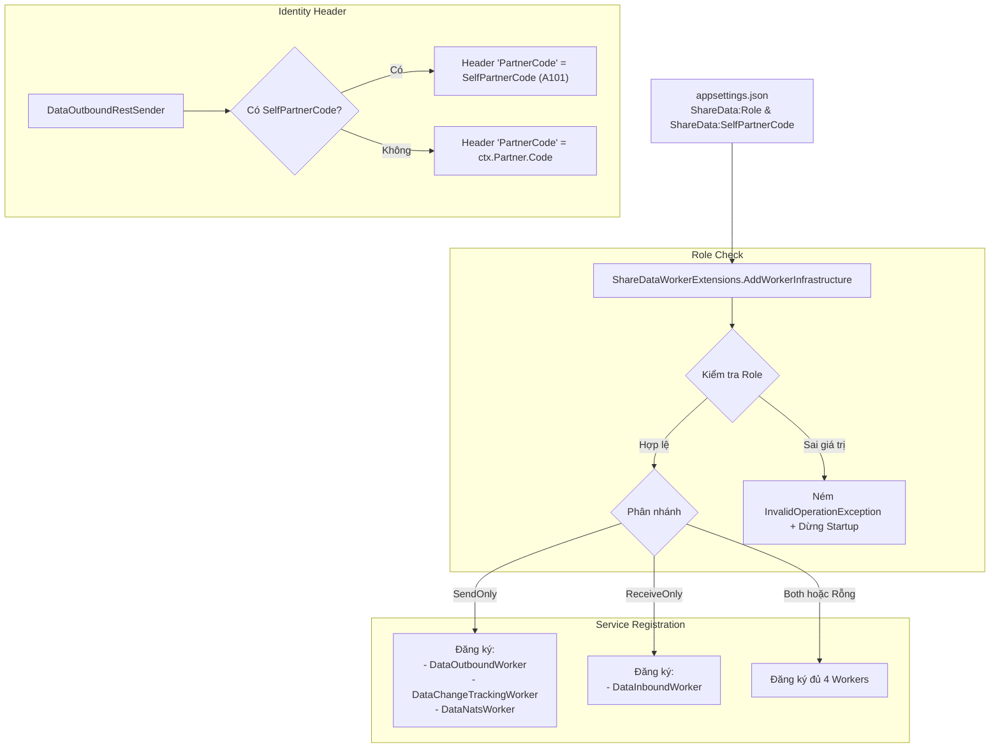

# SV-4 · Cấu hình vai trò instance & mã định danh của mình

**Tệp prompt:** `DocBusinessThienAn/HữuNghị-ChiLăng/ShareData/Prompt/sharedata-sv4-vai-tro-instance-prompt.md`

> 📌 Soạn 05/10/2026 · Nguồn: `Sharedata_MasterPlan.md` dòng `SV-4` (§I.A) + phục vụ kịch bản kiểm thử đa đối tác `SV-5`.
> Nhánh đề xuất: `feat/20261006-XD001.5.6-sharedata-sv4-vai-tro-instance` (tách từ `dev` hoặc nhánh PR).

## 1. Mục tiêu

1. **Phân tách vai trò instance (`ShareData:Role`)**: Cho phép một tiến trình `ShareDataWorker` chạy độc lập ở chế độ **chỉ gửi** (`SendOnly`), **chỉ nhận** (`ReceiveOnly`), hoặc **cả hai** (`Both` / để trống mặc định). Nhờ đó, hệ thống có thể scale độc lập luồng gửi và luồng nhận, hoặc chạy nhiều instance đóng vai các đối tác khác nhau mà không bị xung đột tiến trình nền.
2. **Định danh instance tự gửi (`ShareData:SelfPartnerCode`)**: Khi chạy nhiều instance clone gửi dữ liệu (ví dụ 4 instance A101–A104 gửi về 1 server nhận chung theo `SV-5`), instance gửi tự đóng dấu mã đối tác của chính mình vào HTTP Header `PartnerCode` để bên nhận phân biệt chính xác nguồn gốc gói tin.

## 2. Thiết kế kỹ thuật



## 3. Ràng buộc

- **Hằng số chuẩn hóa**: Toàn bộ giá trị Role (`SendOnly`, `ReceiveOnly`, `Both`) phải đặt trong class hằng `ShareDataRole`, ⛔ tuyệt đối không dùng magic string trong code (rule 7).
- **Fail-fast khi sai cấu hình**: Nếu `ShareData:Role` được cấu hình nhưng chứa giá trị lạ không thuộc danh sách hằng -> ném `InvalidOperationException` ngay lúc khởi động để ngăn chặn cấu hình sai sót âm thầm (rule 7).
- **Tương thích ngược 100%**:
  - Nếu `ShareData:Role` không được khai báo hoặc là rỗng/`Both` -> Hoạt động y hệt hiện tại (đăng ký cả 4 worker).
  - Nếu `ShareData:SelfPartnerCode` không được khai báo hoặc rỗng -> `DataOutboundRestSender` tiếp tục lấy `ctx.Partner?.Code` như cũ.
  - `DataOutboundRestSender` thêm `IConfiguration? configuration = null` vào primary constructor dưới dạng tham số tùy chọn (optional) để **không làm hỏng bất kỳ bài test hiện có nào** đang khởi tạo `new DataOutboundRestSender(...)`.
  - `AddShareDataWorkerCoreServices` giữ nguyên đăng ký các service singleton để `tests/BE/Host.cs` hoạt động bình thường.

---

## 4. Chi tiết thay đổi

### TĐ1 · [NEW] `src/Services/ShareData/ShareDataWorker.Core/Constants/ShareDataRole.cs`

Tạo mới tệp định nghĩa hằng số vai trò instance:

```csharp
namespace ShareDataWorker.Core.Constants
{
    /// <summary>
    /// Author: <tên người áp>
    /// Description: Danh mục các vai trò hoạt động của tiến trình ShareDataWorker (cấu hình qua ShareData:Role).
    /// Created date: 06/10/2026
    /// </summary>
    public static class ShareDataRole
    {
        /// <summary>Chỉ chạy các tiến trình gửi (DataOutboundWorker, DataChangeTrackingWorker, DataNatsWorker).</summary>
        public const string SendOnly = "SendOnly";

        /// <summary>Chỉ chạy tiến trình nhận và lưu trữ CSDL (DataInboundWorker).</summary>
        public const string ReceiveOnly = "ReceiveOnly";

        /// <summary>Chạy đồng thời cả hai luồng gửi và nhận (chế độ mặc định của production).</summary>
        public const string Both = "Both";
    }
}
```

---

### TĐ2 · [MODIFY] `src/Services/ShareData/ShareDataWorker/Extensions/ShareDataWorkerExtensions.cs`

Thêm `using ShareDataWorker.Core.Constants;` và cập nhật logic đăng ký HostedService tại `AddWorkerInfrastructure`:

```csharp
            services.AddShareDataWorkerCoreServices();

            // Đọc và kiểm tra vai trò hoạt động của instance (SV-4)
            var role = configuration["ShareData:Role"]?.Trim();

            if (!string.IsNullOrEmpty(role) &&
                !string.Equals(role, ShareDataRole.SendOnly, StringComparison.OrdinalIgnoreCase) &&
                !string.Equals(role, ShareDataRole.ReceiveOnly, StringComparison.OrdinalIgnoreCase) &&
                !string.Equals(role, ShareDataRole.Both, StringComparison.OrdinalIgnoreCase))
            {
                throw new InvalidOperationException(
                    $"Cấu hình ShareData:Role giá trị '{role}' không hợp lệ. " +
                    $"Chỉ chấp nhận '{ShareDataRole.SendOnly}', '{ShareDataRole.ReceiveOnly}', hoặc để trống / '{ShareDataRole.Both}'.");
            }

            var isSendOnly = string.Equals(role, ShareDataRole.SendOnly, StringComparison.OrdinalIgnoreCase);
            var isReceiveOnly = string.Equals(role, ShareDataRole.ReceiveOnly, StringComparison.OrdinalIgnoreCase);

            // Đăng ký Master Workers theo vai trò cấu hình
            if (!isReceiveOnly)
            {
                services.AddHostedService<DataOutboundWorker>();
                services.AddHostedService<DataChangeTrackingWorker>();
                services.AddHostedService<DataNatsWorker>();
            }

            if (!isSendOnly)
            {
                services.AddHostedService<DataInboundWorker>();
            }

            return services;
```

---

### TĐ3 · [MODIFY] `src/Services/ShareData/ShareDataWorker/Infrastructure/Services/DataOutbound/Transport/DataOutboundRestSender.cs`

1. Bổ sung `Microsoft.Extensions.Configuration` và cập nhật primary constructor nhận thêm `IConfiguration? configuration = null`:
```csharp
    public class DataOutboundRestSender(
        IHttpClientFactory? httpClientFactory = null,
        ILogger<DataOutboundRestSender>? logger = null,
        IConfiguration? configuration = null) : IDataOutboundRestSender
```

2. Cập nhật phương thức `AddIdentityHeaders`:
```csharp
        private void AddIdentityHeaders(HttpRequestMessage request, DataOutboundContext ctx)
        {
            // Ưu tiên mã định danh của chính instance gửi nếu có cấu hình SelfPartnerCode (SV-4 phục vụ test đa đối tác SV-5)
            var selfPartnerCode = configuration?["ShareData:SelfPartnerCode"]?.Trim();
            var partnerCode = !string.IsNullOrEmpty(selfPartnerCode) ? selfPartnerCode : ctx.Partner?.Code;

            if (!string.IsNullOrEmpty(partnerCode))
                request.Headers.Add("PartnerCode", partnerCode);

            if (!string.IsNullOrEmpty(ctx.PacketCode))
                request.Headers.Add("PacketCode", ctx.PacketCode);

            if (ctx.Subscription?.SerialNbr != null)
                request.Headers.Add("SerialNbr", ctx.Subscription.SerialNbr.Value.ToString(CultureInfo.InvariantCulture));

            if (ctx.ExportedAt != default)
                request.Headers.Add("ProcessedAt", ctx.ExportedAt.ToString("O", CultureInfo.InvariantCulture));
        }
```
*(Lưu ý: Đổi `AddIdentityHeaders` từ `private static` thành `private` để truy cập được field `configuration` do primary constructor tạo ra).*

---

### TĐ4 · [MODIFY] `src/Services/ShareData/ShareDataWorker/appsettings.json`

Bổ sung khối cấu hình mẫu `ShareData` (mặc định để trống/Both):

```json
  "ShareData": {
    "Role": "Both",
    "SelfPartnerCode": ""
  },
```

---

## 5. Kiểm thử tự động — [NEW] `tests/BE/ITS/ShareData/Workers/ShareDataWorkerRoleTests.cs`

Tạo mới tệp kiểm thử để bao phủ toàn bộ các trường hợp cấu hình:

```csharp
using Microsoft.Extensions.Configuration;
using Microsoft.Extensions.DependencyInjection;
using Microsoft.Extensions.Hosting;
using ShareDataWorker.Core.Constants;
using ShareDataWorker.Extensions;
using ShareDataWorker.Infrastructure.Workers;
using ShareDataWorker.Infrastructure.Services.DataOutbound.Transport;
using ShareDataWorker.Core.Models.DataOutbound;
using Module.ShareData.Core.Entities;

namespace Tests.ITS.ShareData.Workers
{
    [Collection("api")]
    public class ShareDataWorkerRoleTests
    {
        private readonly Host _host;

        public ShareDataWorkerRoleTests(Host host)
        {
            _host = host;
        }

        [Theory]
        [InlineData(null)]
        [InlineData("")]
        [InlineData("Both")]
        [InlineData("both")]
        public void AddWorkerInfrastructure_WhenRoleBothOrEmpty_RegistersAllFourWorkers_Test(string? role)
        {
            // Arrange
            var configData = new Dictionary<string, string?>
            {
                ["ConnectionStrings:DefaultConnection"] = "Server=localhost;Database=dev_test;",
                ["ShareData:Role"] = role
            };
            var config = new ConfigurationBuilder().AddInMemoryCollection(configData).Build();
            var services = new ServiceCollection();

            // Act
            services.AddWorkerInfrastructure(config);

            // Assert
            var hostedServices = services.Where(s => s.ServiceType == typeof(IHostedService)).Select(s => s.ImplementationType).ToList();
            Assert.Contains(typeof(DataOutboundWorker), hostedServices);
            Assert.Contains(typeof(DataChangeTrackingWorker), hostedServices);
            Assert.Contains(typeof(DataNatsWorker), hostedServices);
            Assert.Contains(typeof(DataInboundWorker), hostedServices);
            Assert.Equal(4, hostedServices.Count);
        }

        [Fact]
        public void AddWorkerInfrastructure_WhenRoleSendOnly_RegistersOnlySendWorkers_Test()
        {
            // Arrange
            var configData = new Dictionary<string, string?>
            {
                ["ConnectionStrings:DefaultConnection"] = "Server=localhost;Database=dev_test;",
                ["ShareData:Role"] = ShareDataRole.SendOnly
            };
            var config = new ConfigurationBuilder().AddInMemoryCollection(configData).Build();
            var services = new ServiceCollection();

            // Act
            services.AddWorkerInfrastructure(config);

            // Assert
            var hostedServices = services.Where(s => s.ServiceType == typeof(IHostedService)).Select(s => s.ImplementationType).ToList();
            Assert.Contains(typeof(DataOutboundWorker), hostedServices);
            Assert.Contains(typeof(DataChangeTrackingWorker), hostedServices);
            Assert.Contains(typeof(DataNatsWorker), hostedServices);
            Assert.DoesNotContain(typeof(DataInboundWorker), hostedServices);
            Assert.Equal(3, hostedServices.Count);
        }

        [Fact]
        public void AddWorkerInfrastructure_WhenRoleReceiveOnly_RegistersOnlyInboundWorker_Test()
        {
            // Arrange
            var configData = new Dictionary<string, string?>
            {
                ["ConnectionStrings:DefaultConnection"] = "Server=localhost;Database=dev_test;",
                ["ShareData:Role"] = ShareDataRole.ReceiveOnly
            };
            var config = new ConfigurationBuilder().AddInMemoryCollection(configData).Build();
            var services = new ServiceCollection();

            // Act
            services.AddWorkerInfrastructure(config);

            // Assert
            var hostedServices = services.Where(s => s.ServiceType == typeof(IHostedService)).Select(s => s.ImplementationType).ToList();
            Assert.Contains(typeof(DataInboundWorker), hostedServices);
            Assert.DoesNotContain(typeof(DataOutboundWorker), hostedServices);
            Assert.DoesNotContain(typeof(DataChangeTrackingWorker), hostedServices);
            Assert.DoesNotContain(typeof(DataNatsWorker), hostedServices);
            Assert.Single(hostedServices);
        }

        [Fact]
        public void AddWorkerInfrastructure_WhenRoleInvalid_ThrowsInvalidOperationException_Test()
        {
            // Arrange
            var configData = new Dictionary<string, string?>
            {
                ["ConnectionStrings:DefaultConnection"] = "Server=localhost;Database=dev_test;",
                ["ShareData:Role"] = "UnsupportedRole123"
            };
            var config = new ConfigurationBuilder().AddInMemoryCollection(configData).Build();
            var services = new ServiceCollection();

            // Act & Assert
            var ex = Assert.Throws<InvalidOperationException>(() => services.AddWorkerInfrastructure(config));
            Assert.Contains("không hợp lệ", ex.Message);
        }

        [Fact]
        public async Task DataOutboundRestSender_WhenSelfPartnerCodeConfigured_UsesItInHeader_Test()
        {
            // Arrange
            var config = new ConfigurationBuilder().AddInMemoryCollection(new Dictionary<string, string?>
            {
                ["ShareData:SelfPartnerCode"] = "A101"
            }).Build();

            var sender = new DataOutboundRestSender(configuration: config);

            // Giả lập gửi tới Mock Server đối tác sẵn có trong test host
            var partner = new ShareDataPartner
            {
                Code = "DEST_PARTNER",
                Address = "127.0.0.1",
                Port = 18090,
                EndPointApiUrl = "/api/receive"
            };
            var sub = new ShareDataSubscription { PartnerId = partner.ID, SerialNbr = 1 };
            var ctx = new DataOutboundContext(sub, partner, new ShareDataPacket { Code = "101" }, new ShareDataMapping(), DateTime.Now);

            // Bắt request tại Mock Server
            _host.PartnerServer.SetResponse(18090, 200, "{\"success\":true}");
            var mappingResult = new DataMappingResult(true, "[]"u8.ToArray(), 0);

            // Act
            await sender.Send(mappingResult, ctx, CancellationToken.None);

            // Assert
            var requests = _host.PartnerServer.GetReceivedRequests(18090);
            Assert.NotEmpty(requests);
            var lastReq = requests.Last();
            Assert.Equal("A101", lastReq.Headers["PartnerCode"]);
        }
    }
}
```

### Lệnh chạy kiểm thử

```powershell
dotnet build TA-ITS015-WEBAPI-V1.0/src/Services/ShareData/ShareDataWorker/ShareDataWorker.csproj
dotnet test tests/BE/test.csproj --filter "FullyQualifiedName~ShareDataWorkerRoleTests"
dotnet test tests/BE/test.csproj --filter "FullyQualifiedName~ShareData"
```

---

## 6. Hậu kiểm thủ công

1. Chỉnh sửa `ShareDataWorker/appsettings.json` thử nghiệm:
   - Đặt `"Role": "SendOnly"` -> Chạy `dotnet run` từ thư mục `ShareDataWorker` -> Quan sát log Console chỉ thấy thông báo khởi động của Outbound / Nats / Tracking, không thấy log Inbound.
   - Đặt `"Role": "ReceiveOnly"` -> Quan sát Console chỉ thấy log của Inbound.
   - Đặt `"Role": "WrongValue"` -> Ứng dụng lập tức dừng lại kèm thông báo lỗi `InvalidOperationException` rõ ràng.

**Commit gợi ý:** `feat(sharedata): XD001.5.6 - cấu hình vai trò instance SendOnly/ReceiveOnly và SelfPartnerCode (SV-4)`
