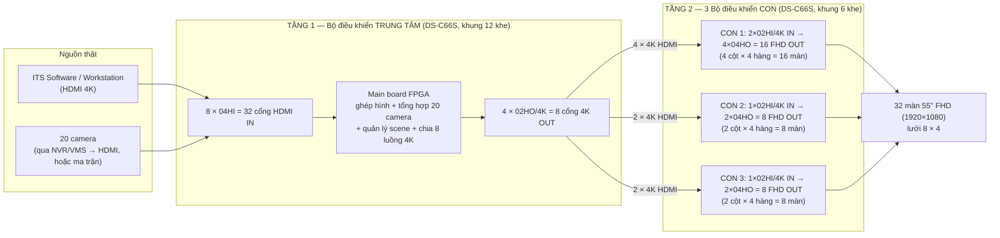
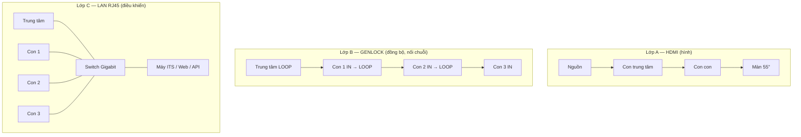

# Giải thích sơ đồ kết nối Video Wall DS-C66S-H88-CL

> Bổ sung cho [SoDoCauHinh_VideoWall_DS-C66S-H88-CL.md](SoDoCauHinh_VideoWall_DS-C66S-H88-CL.md).
> Trả lời trực tiếp mấy câu hỏi trong chat ngày 07/09:
> - *"Output con center là input của mấy con con à?"* → **Đúng.**
> - *"Đấu hết input vào con chính"* → **Đúng, mọi nguồn thật chỉ cắm vào con trung tâm.**
> - *"Quan trọng mấy vụ kết nối qua lại"* → giải thích ở [mục 2](#2-ba-lớp-kết-nối--mấu-chốt-của-kết-nối-qua-lại).

---

## 1. TL;DR — kiến trúc là "cascade 2 tầng"



**Nói bằng lời:**

1. **Tầng 1 — con trung tâm** nhận **toàn bộ** nguồn thật (máy ITS, 20 camera, CCTV). Nó decode/ghép/tổng hợp thành **8 "lát" ảnh 4K** — mỗi lát là một mảng lớn của bức tường đã dựng sẵn layout + scene.
2. **Tầng 2 — 3 con con** **không nhìn thấy** camera hay máy ITS. Mỗi con con chỉ nhận vài **cổng HDMI 4K từ con trung tâm** làm **nguồn đầu vào của nó**, rồi "bung" (fan-out) lát 4K đó ra nhiều màn 55" FHD.
3. Con trung tâm là "bộ não" (ghép hình, đổi scene, gán nguồn). Con con chỉ là "bộ nối dài + chia nhỏ" cho từng vùng màn vật lý.

> ⚠️ **"DS-C66S-H88-CL" không phải mã sản phẩm chính hãng.** Catalog Hikvision chỉ có khung **DS-C66S-S12** (12 khe) và **DS-C66S-S6** (6 khe) + các card rời. "H88-CL" là tên gọi tắt trong sơ đồ này. Suy từ số card: **con trung tâm = khung S12**, **3 con con = khung S6**. → [Cần xác nhận với NCC](#6-những-điểm-phải-xác-nhận-với-hikvision--nhà-cung-cấp).

---

## 2. Ba lớp kết nối — mấu chốt của "kết nối qua lại"

Chỗ khó hiểu là vì **3 loại dây chạy song song** giữa 4 cái khung máy, mỗi loại làm một việc khác nhau. Đừng gộp chung.

| Lớp | Dây gì | Đi từ → đến | Để làm gì |
|---|---|---|---|
| **A. Tín hiệu hình** | HDMI (4K và FHD) | Nguồn → **IN con trung tâm**; **OUT con trung tâm → IN con con**; **OUT con con → màn** | Truyền hình ảnh thật. Đây là cái "output center = input con con". |
| **B. Đồng bộ khung hình** | Cáp GENLOCK (đầu nối riêng trên main board) | **GENLOCK LOOP** con trung tâm → **GENLOCK IN** con 1 → **LOOP** con 1 → **IN** con 2 → **LOOP** con 2 → **IN** con 3 (nối chuỗi) | Ép cả 4 khung máy chạy **cùng một nhịp quét**. Không có nó, cửa sổ nào vắt qua ranh giới giữa vùng CON 1 và CON 2 sẽ bị **xé hình / lệch dòng**. |
| **C. Điều khiển / quản lý** | LAN RJ45 (Cat6/Cat6A) → 1 switch Gigabit | Con trung tâm + 3 con con → switch → máy ITS / Web UI / phần mềm (ISAPI/API) | Đăng nhập, cấu hình lưới, mở cửa sổ, gán nguồn, đổi **scene**. Camera IP (nếu dùng board decode) cũng chạy trên lớp này. |



> 3 lớp này **độc lập**. Khi anh Hiếu hỏi "output center là input con con à" — đó **chỉ là lớp A**. Còn lớp B và lớp C vẫn phải đấu đủ thì tường mới chạy khớp và điều khiển được.

---

## 3. Đi theo một tín hiệu cho dễ hình dung

### 3a. Một camera lên tường

```
Camera 12  →  NVR/VMS xuất HDMI (hoặc qua ma trận HDMI)
           →  cắm vào 1 cổng của board 04HI trên CON TRUNG TÂM   (lớp A)
           →  main board center: đưa vào cửa sổ, đặt vào ô (vị trí) trong layout/scene
           →  vùng ảnh đó rơi vào 1 trong 8 "lát 4K"
           →  lát 4K xuất qua board 02HO/4K của center
           →  cắm vào board 02HI/4K của CON CON phụ trách vùng đó   (lớp A — "qua lại")
           →  con con bung ra các cổng 04HO
           →  tới 1..n màn 55'' FHD
```

### 3b. Màn hình phần mềm ITS (bản đồ / ITS-MAP)

```
Workstation ITS  →  HDMI 4K  →  board 02HI/4K hoặc 04HI trên CON TRUNG TÂM
                 →  center đặt cửa sổ ITS phủ vùng 6 cột × 2 hàng (12 màn giữa)
                 →  vùng đó nằm vắt qua nhiều "lát 4K" → nhiều con con cùng nhận phần của mình
                 →  các con con render đồng bộ (nhờ GENLOCK) → 12 màn giữa ghép liền 1 ảnh
```

### 3c. Đổi scene (từ phần mềm / API)

```
Phần mềm  →  LAN  →  gọi ISAPI tới CON TRUNG TÂM: PUT .../VideoWall/1/scene/<SID>/activate
          →  center dựng lại toàn bộ cửa sổ + nguồn cho 8 lát 4K
          →  hình mới tự chảy xuống 3 con con (không cần gọi lệnh riêng cho từng con con,
             NẾU tường được cấu hình là 1 wall logic trên center)
```
> Có đúng "một wall logic trên center" hay không → [Cần xác nhận](#6-những-điểm-phải-xác-nhận-với-hikvision--nhà-cung-cấp). Đây là câu hỏi quan trọng nhất cho phần code/tool.

---

## 4. Vì sao phải "cascade" mà không dùng 1 con duy nhất?

| Lý do | Chi tiết |
|---|---|
| **Giới hạn quy mô 1 khung** | 1 khung S6 ghép tối đa ~20 màn; S12 tối đa ~40 màn. 32 màn + tải 4K nặng + 20 camera là quá sát trần nếu dồn 1 khung. |
| **Chia 3 vùng điều khiển độc lập** | Yêu cầu thiết kế: KV1 (16 màn), KV2 (8 màn), KV3 (8 màn) tách riêng để vận hành/bảo trì từng vùng không ảnh hưởng vùng khác. |
| **Giảm số card đắt tiền ở tầng dưới** | Con con chỉ cần board vào 4K (02HI/4K) + board ra FHD (04HO) rẻ hơn; không cần board decode, không cần nhiều cổng vào. |
| **Tập trung "bộ não" 1 chỗ** | Toàn bộ logic ghép hình, quản lý scene, tổng hợp camera nằm ở center → phần mềm chủ yếu nói chuyện với 1 IP. |

**Đánh đổi:** mỗi lần "nhảy" qua 1 tầng cascade cộng thêm ~1 khung hình trễ; ranh giới giữa 2 con con phải canh chỉnh GENLOCK + bezel kỹ. Với đúng 32 màn, **1 khung DS-C66S-S12 (đủ sức 40 màn) là phương án đơn giản hơn** — việc tách 3 con ở đây là do yêu cầu "3 vùng điều khiển", không phải do thiếu năng lực phần cứng.

---

## 5. Bảng "ngân sách cổng" từng khung

| Khung | Khe | Card vào | Cổng vào | Card ra | Cổng ra | Nhận từ | Xuất tới |
|---|---|---|---|---|---|---|---|
| **Trung tâm** (S12) | 12 | 8 × 04HI | **32 × HDMI** | 4 × 02HO/4K | **8 × 4K** | Nguồn thật (ITS, 20 camera, CCTV) | 3 con con |
| **Con 1** (S6) | 6 | 2 × 02HI/4K | 4 × 4K | 4 × 04HO | **16 × FHD** | Center (4 × 4K) | 16 màn (4×4) |
| **Con 2** (S6) | 3/6 | 1 × 02HI/4K | 2 × 4K | 2 × 04HO | **8 × FHD** | Center (2 × 4K) | 8 màn (2×4) |
| **Con 3** (S6) | 3/6 | 1 × 02HI/4K | 2 × 4K | 2 × 04HO | **8 × FHD** | Center (2 × 4K) | 8 màn (2×4) |

Kiểm tra khớp: center xuất **8 × 4K** = tổng đầu vào 3 con con (4 + 2 + 2). 3 con con xuất **32 × FHD** = 32 màn. ✔

Nguồn cấp: **4 × DS-C66S-PWR** (mỗi khung 1 bộ) + **1 switch Gigabit** dùng chung cho lớp C.

---

## 6. Những điểm phải xác nhận với Hikvision / nhà cung cấp

1. **Mã khung thật.** "H88-CL" không có trong catalog. Xác nhận: center có phải **DS-C66S-S12**, 3 con có phải **DS-C66S-S6** không.
2. **20 camera vào bằng đường nào?** Sơ đồ vẽ CCTV vào bằng **HDMI** ("từ NVR/VMS hoặc ma trận") và bảng card **không có board decode DS-C66S-DEC**. Nghĩa là phải có NVR/ma trận xuất được ~20 luồng HDMI đồng thời. Phương án khác: gắn **board DS-C66S-DEC** cho center để kéo thẳng 20 stream IP — đỡ 20 sợi HDMI nhưng tốn khe + tải decode. **Chốt phương án này trước vì nó quyết định số board vào của center.**
3. **Tường là 1 wall logic hay 4 wall rời?**
   - *1 wall logic trên center*: phần mềm/tool chủ yếu gọi API tới **1 IP** (center); con con "trong suốt". Đơn giản cho code.
   - *4 wall rời*: tool phải quản lý **4 IP**, mỗi con tự có `videoWallID`, scene riêng, phải điều phối đổi scene 4 chỗ cho khớp. Phức tạp hơn nhiều.
4. **Hikvision có chính thức support kiểu HDMI-out→HDMI-in cascade cho 1 bức tường liền không**, hay khuyến nghị 1 khung S12? Hỏi rõ về trễ (latency) cộng dồn và cách canh mép giữa 3 vùng.
5. **GENLOCK nối chuỗi 4 khung**: xác nhận có đủ cáp GENLOCK và thứ tự nối (center LOOP → con 1 IN → …).

---

## 7. Ảnh hưởng tới phần code / tool test API

- Hiện tại tài liệu kịch bản chuẩn ([KichBan_VideoWall_DS-C30S-S11_12Man.md](../KichBan_VideoWall_DS-C30S-S11_12Man.md)) viết cho **1 controller DS-C30S-S11 / 12 màn**. Cấu hình mới là **DS-C66S, 4 khung, 32 màn** → phải rà lại.
- **Nếu là 1 wall logic**: giữ nguyên bộ API `/ISAPI/DisplayDev/VideoWall/<id>/...` nhưng đổi:
  - lưới **8 × 4**, canvas ảo `baseOutputSize × 8` rộng × `baseOutputSize × 4` cao (vd `15360 × 7680` nếu base = 1920).
  - số output = 32, `outputID` đọc từ `/outputs/channels` (đừng đoán).
- **Nếu là 4 wall rời**: tool cần lớp "điều phối" — 1 kết nối / IP, map "scene tổng" → tổ hợp scene của từng con, activate gần như đồng thời rồi poll `scene/isRunning` cả 4.
- Cấu hình cứng giai đoạn 1 (theo [videowall_plan.md](../videowall_plan.md)): thêm mục `controllers[]` trong file config (ip, port, vai trò `center|sub`, `videoWallID`, dải `outputID`).

---

## Nguồn tham khảo

- Tài liệu phần cứng đã convert: [Controller-phan-cung.md](../Controller-phan-cung/Controller-phan-cung.md) — mục *1.2.2 Main Control Board* (cổng GENLOCK IN / GENLOCK LOOP: *"Connect to the GENLOCK port of other devices of the same type ... for signal looping"*), *1.2.3 / 1.2.4* (input/output board).
- [ISAPI Overview](../ISAPI-Videowall-Controller/02-overview.md) — mục *2.2 Product Scope* liệt kê card họ DS-C66S (02HI/4K, 04HI, 04HO, 02HO/4K, PWR, DEC, S6, S12…). Không có mã "H88-CL".
- [DS-C66S Series Video Wall Controller — Datasheet 2025-09-16 (Hikvision)](https://assets.hikvision.com/prd/normal/all/doc/m000173958/DS-C66S-Series-Video-Wall-Controller_Datasheet_20250916.pdf)
- [DS-C66S-S6 — Hikvision Commercial Display](https://display.hikvision.com/en/products/led-displays/video-wall-controllers/video-wall-controller/ds-c66s-s6/) — khung 6 khe, tối đa 20 màn khi đủ card; frame synchronization.
- [DS-C66S-04HI — Hikvision Commercial Display](https://display.hikvision.com/en/products/led-displays/video-wall-controllers/video-wall-controller/ds-c66s-04hi/)
- [Video Wall Controllers — Hikvision](https://www.hikvision.com/en/products/display-and-control/controllers/Video-Wall-Controller/)
- GENLOCK nối chuỗi: chuẩn genlock loop-through cho phép cascade nhiều thiết bị về chung 1 nguồn nhịp; xem [Genlock — Wikipedia](https://en.wikipedia.org/wiki/Genlock).
