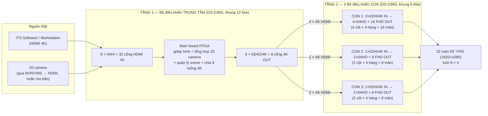
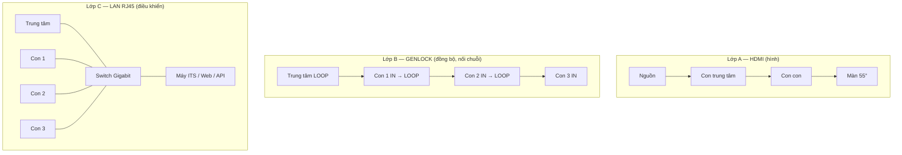
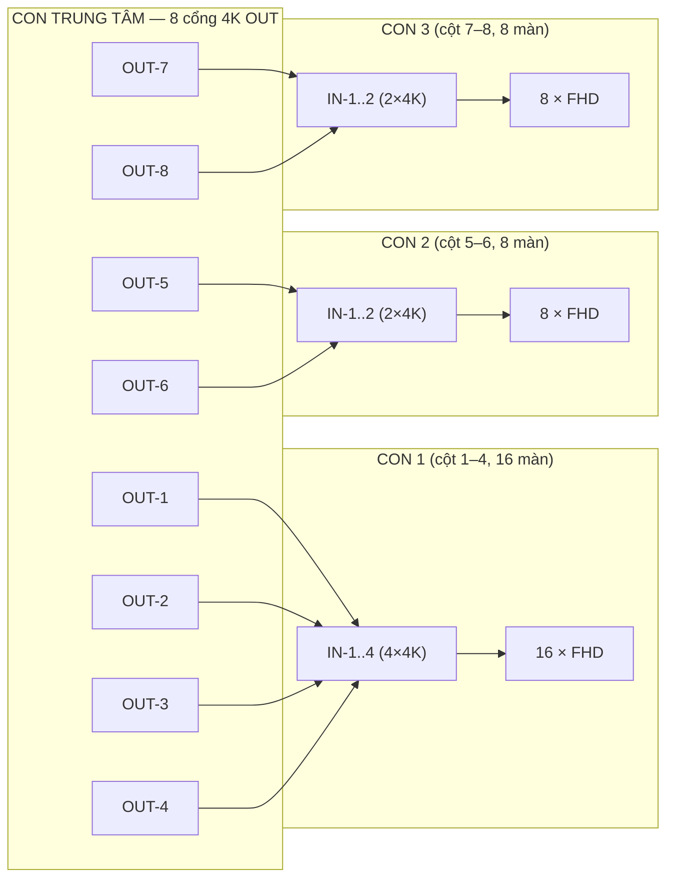
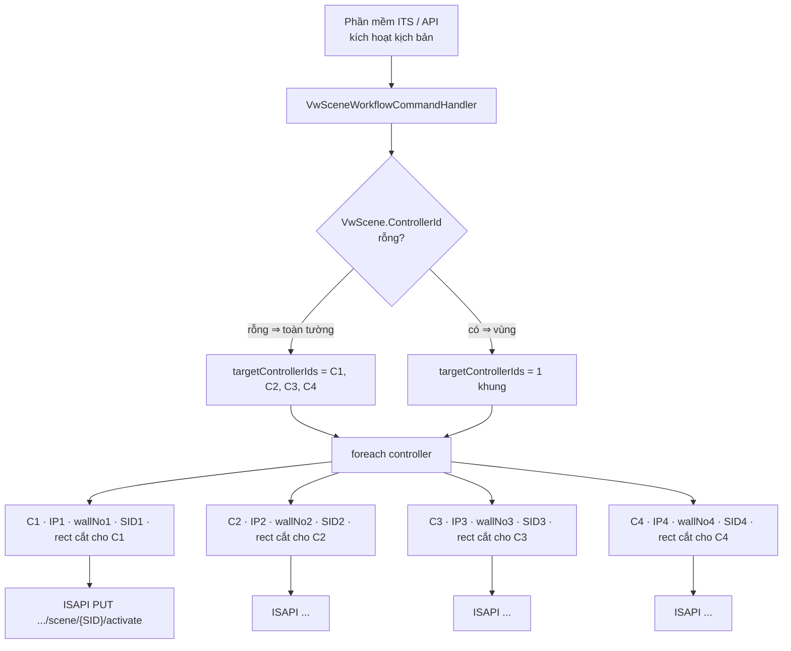

# Giải thích sơ đồ kết nối Video Wall DS-C66S-H88-CL

> Bổ sung cho [SoDoCauHinh_VideoWall_DS-C66S-H88-CL.md](SoDoCauHinh_VideoWall_DS-C66S-H88-CL.md).
> Trả lời trực tiếp mấy câu hỏi trong chat ngày 07/09:
> - *"Output con center là input của mấy con con à?"* → **Đúng.**
> - *"Đấu hết input vào con chính"* → **Đúng, mọi nguồn thật chỉ cắm vào con trung tâm.**
> - *"Quan trọng mấy vụ kết nối qua lại"* → 3 lớp dây ở [mục 2](#2-ba-lớp-kết-nối--mấu-chốt-của-kết-nối-qua-lại), bóc từng sợi ở [mục 2B](#2b-kết-nối-qua-lại--bóc-từng-sợi-dây-ra).
> - *"Trước test 1 controller, giờ 4 controller, gọi API như nào?"* → [mục 2C](#2c-gọi-api-cho-4-controller-như-thế-nào-backend-đã-làm-sẵn) (backend `Module.VideoWall` đã làm sẵn tầng điều phối).

---

## 1. TL;DR — kiến trúc là "cascade 2 tầng"



**Nói bằng lời:**

1. **Tầng 1 — con trung tâm** nhận **toàn bộ** nguồn thật (máy ITS, 20 camera, CCTV). Nó decode/ghép/tổng hợp thành **8 "lát" ảnh 4K** — mỗi lát là một mảng lớn của bức tường đã dựng sẵn layout + scene.
2. **Tầng 2 — 3 con con** **không nhìn thấy** camera hay máy ITS. Mỗi con con chỉ nhận vài **cổng HDMI 4K từ con trung tâm** làm **nguồn đầu vào của nó**, rồi "bung" (fan-out) lát 4K đó ra nhiều màn 55" FHD.
3. Con trung tâm là "bộ não" (ghép hình, đổi scene, gán nguồn). Con con chỉ là "bộ nối dài + chia nhỏ" cho từng vùng màn vật lý.

> ⚠️ **"DS-C66S-H88-CL" không phải mã sản phẩm chính hãng.** Catalog Hikvision chỉ có khung **DS-C66S-S12** (12 khe) và **DS-C66S-S6** (6 khe) + các card rời. "H88-CL" là tên gọi tắt trong sơ đồ này. Suy từ số card: **con trung tâm = khung S12**, **3 con con = khung S6**. → [Cần xác nhận với NCC](#6-những-điểm-phải-xác-nhận-với-hikvision--nhà-cung-cấp).

---

## 2. Ba lớp kết nối — mấu chốt của "kết nối qua lại"

Chỗ khó hiểu là vì **3 loại dây chạy song song** giữa 4 cái khung máy, mỗi loại làm một việc khác nhau. Đừng gộp chung.

| Lớp | Dây gì | Đi từ → đến | Để làm gì |
|---|---|---|---|
| **A. Tín hiệu hình** | HDMI (4K và FHD) | Nguồn → **IN con trung tâm**; **OUT con trung tâm → IN con con**; **OUT con con → màn** | Truyền hình ảnh thật. Đây là cái "output center = input con con". |
| **B. Đồng bộ khung hình** | Cáp GENLOCK (đầu nối riêng trên main board) | **GENLOCK LOOP** con trung tâm → **GENLOCK IN** con 1 → **LOOP** con 1 → **IN** con 2 → **LOOP** con 2 → **IN** con 3 (nối chuỗi) | Ép cả 4 khung máy chạy **cùng một nhịp quét**. Không có nó, cửa sổ nào vắt qua ranh giới giữa vùng CON 1 và CON 2 sẽ bị **xé hình / lệch dòng**. |
| **C. Điều khiển / quản lý** | LAN RJ45 (Cat6/Cat6A) → 1 switch Gigabit | Con trung tâm + 3 con con → switch → máy ITS / Web UI / phần mềm (ISAPI/API) | Đăng nhập, cấu hình lưới, mở cửa sổ, gán nguồn, đổi **scene**. Camera IP (nếu dùng board decode) cũng chạy trên lớp này. |



> 3 lớp này **độc lập**. Khi anh Hiếu hỏi "output center là input con con à" — đó **chỉ là lớp A**. Còn lớp B và lớp C vẫn phải đấu đủ thì tường mới chạy khớp và điều khiển được.

---

## 2B. "Kết nối qua lại" — bóc từng sợi dây ra

Phần này giải cái chỗ "chịu": **8 sợi HDMI 4K giữa center và 3 con con — sợi nào đi đâu, mang cái gì.**

### 2B.1. Chốt tư duy: mỗi sợi 4K = đúng 1 mảng 2×2 màn (một "quad")

Làm phép tính pixel để hết mơ hồ:

| | Rộng × Cao | Tổng điểm ảnh |
|---|---|---|
| Cả bức tường (8 màn × 4 màn, mỗi màn 1920×1080) | 15360 × 4320 | **66,355,200** |
| 8 cổng 4K OUT của center (mỗi cổng 3840 × 2160) | 8 × (3840×2160) | **66,355,200** |

Bằng **chằn chặn** → ánh xạ **1:1, không co kéo, không mất nét**. Và vì `3840 = 2 × 1920`, `2160 = 2 × 1080`:

> **1 cổng 4K OUT của center = 1 hình 3840×2160 = đúng 4 màn xếp 2×2.**

Bức tường 8×4 chia sạch thành **8 quad** (mảng 2×2). Mỗi quad đi bằng **1 sợi HDMI 4K** xuống con con phụ trách. Con con nhận sợi đó rồi **cắt làm 4 góc → 4 cổng FHD → 4 màn**.

### 2B.2. Bảng 8 sợi 4K — sợi nào đi đâu

Đánh số cột 1→8 (trái→phải), hàng 1→4 (trên→xuống). Ranh giới vùng: **CON 1 = cột 1–4**, **CON 2 = cột 5–6**, **CON 3 = cột 7–8**.

| Sợi | Center OUT | Vùng tường sợi này mang (cột × hàng) | Xuống | Vào cổng | Con con cắt ra 4 màn |
|---|---|---|---|---|---|
| ① | OUT-1 | cột 1–2, hàng 1–2 | CON 1 | IN-1 | (1,1)(2,1)(1,2)(2,2) |
| ② | OUT-2 | cột 3–4, hàng 1–2 | CON 1 | IN-2 | (3,1)(4,1)(3,2)(4,2) |
| ③ | OUT-3 | cột 1–2, hàng 3–4 | CON 1 | IN-3 | (1,3)(2,3)(1,4)(2,4) |
| ④ | OUT-4 | cột 3–4, hàng 3–4 | CON 1 | IN-4 | (3,3)(4,3)(3,4)(4,4) |
| ⑤ | OUT-5 | cột 5–6, hàng 1–2 | CON 2 | IN-1 | (5,1)(6,1)(5,2)(6,2) |
| ⑥ | OUT-6 | cột 5–6, hàng 3–4 | CON 2 | IN-2 | (5,3)(6,3)(5,4)(6,4) |
| ⑦ | OUT-7 | cột 7–8, hàng 1–2 | CON 3 | IN-1 | (7,1)(8,1)(7,2)(8,2) |
| ⑧ | OUT-8 | cột 7–8, hàng 3–4 | CON 3 | IN-2 | (7,3)(8,3)(7,4)(8,4) |

CON 1 nhận 4 sợi (①②③④) → 16 màn. CON 2 nhận 2 sợi (⑤⑥) → 8 màn. CON 3 nhận 2 sợi (⑦⑧) → 8 màn. Khớp 8 sợi / 32 màn.



> 🔧 **Đấu sợi nào vào cổng nào là do mình chọn lúc lắp** — miễn dán nhãn nhất quán. Cái "biết" nằm ở **cấu hình**, không phải ở dây:
> - Trên **center**: khai báo "output logic #k ↔ cổng vật lý (board B, port P)" và "output #k phủ hình chữ nhật (x, y, rộng, cao) trên tường" — chính là bước ISAPI *Link output ports to screens* (`POST /ISAPI/DisplayDev/VideoWall/<id>/outputs`).
> - Trên **mỗi con con**: cấu hình 1 "video wall con" cho từng cổng 4K vào = lưới **2×2**, gán 4 cổng FHD ra 4 ô. Cấu hình **một lần, tĩnh**, sau đó không đụng nữa.

### 2B.3. Cửa sổ vắt qua ranh giới 2–3 con con (ca khó nhất)

Ví dụ **cửa sổ ITS-MAP** phủ cột 2–7 × hàng 2–3 (12 màn giữa). Rơi vào:
- CON 1: phần cột 2–4, hàng 2–3
- CON 2: phần cột 5–6, hàng 2–3
- CON 3: phần cột 7, hàng 2–3

**Ai ghép cửa sổ này?** → **100% ở center.** Center có nguyên nguồn ITS 4K là 1 input, vẽ cửa sổ ở toạ độ tường phủ cột 2–7. Rồi center **render 8 quad OUT**, mỗi quad chỉ chứa **đúng phần** cửa sổ ITS rơi vào chữ nhật của quad đó.

Con con **không hề biết "có cửa sổ ITS"** — nó chỉ nhận 1 hình 3840×2160 đã đúng pixel, cắt 4 góc, đẩy ra 4 màn. Toàn bộ chuyện "cắt cửa sổ cho đúng mép" là việc của center.

→ **Đây chính là lý do GENLOCK (lớp B) bắt buộc:** các mảnh của cùng 1 cửa sổ động đi qua **3 con con khác nhau**, ra **tới 8 sợi HDMI khác nhau**. Muốn mép giữa màn (4,2) [CON 1] và màn (5,2) [CON 2] không bị xé khi video chạy → cả 4 khung phải quét cùng dòng pixel cùng một thời điểm. Không genlock = thấy vệt xé dọc ngay đường ghép CON 1 | CON 2.

### 2B.4. Làm rõ chữ "qua lại"

Đường **hình** là **một chiều tuyệt đối**:

```
nguồn  →  center  →  con con  →  màn
```

**Không có** sợi nào chạy ngược từ con con về center, **không có** vòng lặp/hồi tiếp. "Qua lại" ở đây chỉ là cách nói — thực chất là "**output của khung này = input của khung kia**", vẫn xuôi một chiều.

Chiều **hai chiều** duy nhất là **lớp C (LAN)** — vì đó là mạng: phần mềm hỏi ↔ thiết bị trả lời (đọc trạng thái, poll scene, đọc `signalStatus`…). Nhưng lớp C **không mang hình bức tường**, chỉ mang lệnh + trạng thái (+ stream camera IP nếu có board decode).

### 2B.5. Nếu KHÔNG map "quad sạch"

Bảng trên là cách chuẩn (tận dụng 100% mỗi sợi 4K). Các biến thể có thể gặp khi khảo sát thực tế:

| Tình huống | Hệ quả |
|---|---|
| Con con nhận 4K nhưng vùng nó phụ trách chỉ 2 màn ngang (1920×2160) | Phí ~½ băng thông sợi 4K. Chấp nhận được, hoặc để center xuất **FHD** cho vùng đó thay vì 4K. |
| Center xuất mỗi cổng phủ **2 màn** (không phải 4) | Cần **nhiều cổng OUT hơn** → nhiều board 02HO/4K hơn → có thể không đủ 12 khe. |
| 1 quad vắt qua ranh giới 2 con con (vd cột 4–5) | **Không được** — ranh giới vùng phải trùng ranh giới quad. Vì vậy CON 1 = cột 1–4 (số chẵn), không phải cột 1–3. |

---

## 2C. Gọi API cho 4 controller như thế nào (backend ĐÃ làm sẵn)

> Trả lời câu "trước test 1 con, giờ 4 con, gọi API như nào chưa hình dung".
> **Backend `Module.VideoWall` đã implement xong tầng điều phối 4 khung** — chưa chạy với 4 khung
> thật (còn `// TODO: Chưa đấu nối thiết bị thật` ở `VwSceneWorkflowCommandHandler`), nhưng logic
> cắt cửa sổ + loop từng khung đã có đủ. Không phải viết mới.

### 2C.1. ISAPI Hikvision KHÔNG có "lệnh nhóm thiết bị"

- Mỗi khung = **1 HTTP server độc lập**: IP riêng, tài khoản Digest riêng, cây
  `/ISAPI/DisplayDev/VideoWall/{wallNo}/...` riêng, SID scene riêng, `baseOutputSize` riêng.
- Thậm chí **1 khung C66S có tới 8 "wall logic"** `VideoWall1..VideoWall8` (`maxWallNums = 8`,
  đo thật trong `LogsAPI/session-20260904-real.json`). Phải hỏi khung xem wall nào đang `bound`
  (có cắm màn) — **không mặc định là 1** (tường 1 trên máy thật là sandbox chưa gắn màn).

⇒ "Gọi API cho 4 controller" = **chạy đúng luồng đã test với 1 con DS-C30S-S11, lặp cho từng
khung**, mỗi khung dùng IP + credential + `wallNo` + lát cắt cửa sổ của riêng nó.

### 2C.2. Mô hình: 1 tường trong DB, N cuộc hội thoại lúc chạy

| Tầng | Cái gì | Đơn vị toạ độ |
|---|---|---|
| DB | `VwWallTopology` (1 dòng) — tường tổng, lưới `Rows×Cols` | pixel **tuyệt đối toàn tường** |
| DB | `VwController` (staging đã có **4 dòng** C1..C4) — mỗi khung: `IP`, `Account`, `PassWord`, vùng phụ trách (`OriginCol/CoverCols/...`), `ActiveSceneId` | — |
| DB | `VwScreen` (32 dòng) — mỗi màn: `ControllerId` + `GridCol/GridRow` → **bản đồ màn nào thuộc khung nào** | — |
| DB | `VwScene` — `ControllerId` **rỗng** ⇒ kịch bản **toàn tường** (đẩy xuống mọi khung); **có giá trị** ⇒ kịch bản **vùng** (1 khung) | — |
| DB | `VwWindowScene` (176 dòng) — mỗi cửa sổ: `X/Y/W/H` + `SourceId` + `ZIndex` | pixel **tuyệt đối toàn tường** |
| Runtime | Lúc đẩy xuống thiết bị: cắt cửa sổ theo vùng panel từng khung, quy đổi sang toạ độ ISAPI cục bộ | `uniformCoordinate` (ô vuông `baseOutputSize`) |

Cắt & quy đổi: `Infrastructure/Services/Scene/VwSceneRegionService.cs` — `SliceWindowForControllers`
+ `ToIsapiLocalRect`:

```
localX  = X_tường_tuyệt_đối − originCol × panelWidthPx
X_ISAPI = localX × baseOutputSize / panelWidthPx        (tương tự Y, W, H)
```

`originCol/originRow` = min `GridCol/GridRow` của các màn thuộc khung đó (lấy từ `VwScreen`,
**không** lấy `VwController.OriginCol` — số đó chỉ là khung bao do người nhập tay, có thể lệch).

> ⚠️ **`panelWidthPx` / `panelHeightPx` trong code hiện là `3840 × 2160`** (`VwWallProfile.cs`,
> suy từ thiết bị test cũ) — **KHÁC** sơ đồ .jpg ghi màn 55" là **1920×1080**. Giá trị thật
> phải đọc tại hiện trường từ `GET .../{wallNo}/outputs` (`Rect`) + `GET .../capabilities`
> (`baseOutputSize`), rồi override qua `DeviceIntegration.json`. Xem [mục 6 điểm 3](#6-những-điểm-phải-xác-nhận-với-hikvision--nhà-cung-cấp).

### 2C.3. Luồng "đổi scene" cho 4 khung = KB-14 nhân 4

`VwSceneWorkflowCommandHandler.HandleAsync` → `VwISAPIDeviceService.ActivateScene`
(`Infrastructure/Services/ISAPIDevice/VwISAPIDeviceService.cs`):

```
targetControllerIds = (VwScene.ControllerId rỗng) ? [C1,C2,C3,C4] : [khung sở hữu]
foreach controllerId in targetControllerIds:
    GET  .../VideoWall/capabilities          → kiểm isSupportScene (không hỗ trợ ⇒ bỏ qua khung này)
    ResolveWall(controller)                  → GET .../VideoWall, lấy wall 'bound' đầu tiên (cache 30')
    PUT  .../VideoWall/{wallNo}/scene/{SID}/activate
gom succeededControllerIds
thiếu khung nào ⇒ phát cảnh báo HardwareOutOfSync (FE hiển thị "3/4 vùng đã đổi")
```

### 2C.4. Luồng "dựng lại cửa sổ" cho 4 khung = KB-05..KB-12 nhân 4

`VwISAPIDeviceService.SyncSceneWindowsToDevice`:

```
targetControllers = ResolveTargetControllers(scene)   // vùng ⇒ 1 khung; toàn tường ⇒ mọi khung lái panel
foreach ctrl in targetControllers:
    GET    .../VideoWall/capabilities        → baseOutputSize CỦA KHUNG NÀY
    ResolveWall(ctrl)
    DELETE .../VideoWall/{wallNo}/windows                        (xoá sạch cửa sổ)
    foreach window (VwWindowScene, toạ độ tuyệt đối toàn tường):
        slices = SliceForControllerAsync(scene.ControllerId, ctrl.ID, X,Y,W,H, baseOutputSize)
        foreach (x,y,w,h) in slices:            // cửa sổ toàn tường bị cắt nhiều mảnh; vùng thì 1
            signalNo = VwSource.SignalNo của nguồn trong cửa sổ
            POST .../VideoWall/{wallNo}/windows   (Rect cục bộ + signalNo)
    (nếu scene.OutputId có) PUT .../VideoWall/{wallNo}/scene/{SID}/saveData
```

### 2C.5. Sơ đồ fan-out (1 lệnh nghiệp vụ → 4 nhánh ISAPI)



### 2C.6. "1 con hôm trước → 4 con bây giờ": bảng đổi

| Bước (bản 1 controller DS-C30S-S11) | Bản 4 controller DS-C66S |
|---|---|
| 1 kết nối tới 1 IP | Lặp theo 4 dòng `VwController` — 4 IP, 4 bộ Digest riêng |
| Lưới cứng 4×3, canvas ảo `7680×5760` | Lưới **8×4**; canvas ảo **suy từ `GET .../{wallNo}/outputs`** (sắp theo `Rect.Coordinate`), KHÔNG hardcode |
| 1 `wallNo` (tường `bound` duy nhất) | Mỗi khung `ResolveWall` **riêng** — có thể ra số khác nhau |
| `outputID` đọc từ `/outputs/channels` | Y hệt, nhưng **mỗi khung một danh sách** |
| `Rect` cửa sổ = toạ độ ảo toàn tường | **Phải cắt** qua `SliceForControllerAsync` → toạ độ cục bộ từng khung |
| Activate 1 SID | Activate SID **trên từng khung**; chờ 2–3s rồi verify `scene/isRunning` **cả 4**; 3/4 OK ⇒ `HardwareOutOfSync` |
| `baseOutputSize` đọc 1 lần | Đọc **theo từng khung** (đo thật = 1920, nhưng đừng giả định) |

### 2C.7. Chống khoá IP — giờ là 4 IP

`VwWallProfile.MaxConsecutiveFailures = 2`, `BlockMinutes = 5`. Circuit-breaker **theo từng IP**
(`VwISAPIDeviceService.cs`, vùng *Circuit Breaker*): sai mật khẩu 1 khung 2 lần ⇒ chỉ khoá IP
khung đó, 3 khung kia vẫn chạy. **Không thử mật khẩu sai trên thiết bị thật** (bẫy `stale=FALSE`
— khoá IP không mở lại được qua LAN); muốn test Digest sai thì trỏ mock server nội bộ.

---

## 3. Đi theo một tín hiệu cho dễ hình dung

### 3a. Một camera lên tường

```
Camera 12  →  NVR/VMS xuất HDMI (hoặc qua ma trận HDMI)
           →  cắm vào 1 cổng của board 04HI trên CON TRUNG TÂM   (lớp A)
           →  main board center: đưa vào cửa sổ, đặt vào ô (vị trí) trong layout/scene
           →  vùng ảnh đó rơi vào 1 trong 8 "lát 4K"
           →  lát 4K xuất qua board 02HO/4K của center
           →  cắm vào board 02HI/4K của CON CON phụ trách vùng đó   (lớp A — "qua lại")
           →  con con bung ra các cổng 04HO
           →  tới 1..n màn 55'' FHD
```

### 3b. Màn hình phần mềm ITS (bản đồ / ITS-MAP)

```
Workstation ITS  →  HDMI 4K  →  board 02HI/4K hoặc 04HI trên CON TRUNG TÂM
                 →  center đặt cửa sổ ITS phủ vùng 6 cột × 2 hàng (12 màn giữa)
                 →  vùng đó nằm vắt qua nhiều "lát 4K" → nhiều con con cùng nhận phần của mình
                 →  các con con render đồng bộ (nhờ GENLOCK) → 12 màn giữa ghép liền 1 ảnh
```

### 3c. Đổi scene (từ phần mềm / API)

```
Phần mềm  →  LAN  →  backend Module.VideoWall nhận 1 lệnh "kích hoạt kịch bản"
          →  backend loop 4 khung: mỗi khung gọi ISAPI PUT .../VideoWall/{wallNo}/scene/{SID}/activate
          →  mỗi khung tự dựng lại cửa sổ cho vùng của nó (đã lưu trong SID)
          →  hình đổi trên cả 32 màn
```
> **Ở mức vận hành:** operator/phần mềm chỉ ra **1 lệnh** cho **1 tường**.
> **Ở mức kỹ thuật:** backend gửi lệnh ISAPI **riêng cho từng khung** — chi tiết ở
> [mục 2C](#2c-gọi-api-cho-4-controller-như-thế-nào-backend-đã-làm-sẵn). Đây **không còn là câu
> hỏi mở** — code đã chọn mô hình "1 tường DB + fan-out từng khung".

---

## 4. Vì sao phải "cascade" mà không dùng 1 con duy nhất?

| Lý do | Chi tiết |
|---|---|
| **Giới hạn quy mô 1 khung** | 1 khung S6 ghép tối đa ~20 màn; S12 tối đa ~40 màn. 32 màn + tải 4K nặng + 20 camera là quá sát trần nếu dồn 1 khung. |
| **Chia 3 vùng điều khiển độc lập** | Yêu cầu thiết kế: KV1 (16 màn), KV2 (8 màn), KV3 (8 màn) tách riêng để vận hành/bảo trì từng vùng không ảnh hưởng vùng khác. |
| **Giảm số card đắt tiền ở tầng dưới** | Con con chỉ cần board vào 4K (02HI/4K) + board ra FHD (04HO) rẻ hơn; không cần board decode, không cần nhiều cổng vào. |
| **Tập trung "bộ não" 1 chỗ** | Toàn bộ logic ghép hình, quản lý scene, tổng hợp camera nằm ở center → phần mềm chủ yếu nói chuyện với 1 IP. |

**Đánh đổi:** mỗi lần "nhảy" qua 1 tầng cascade cộng thêm ~1 khung hình trễ; ranh giới giữa 2 con con phải canh chỉnh GENLOCK + bezel kỹ. Với đúng 32 màn, **1 khung DS-C66S-S12 (đủ sức 40 màn) là phương án đơn giản hơn** — việc tách 3 con ở đây là do yêu cầu "3 vùng điều khiển", không phải do thiếu năng lực phần cứng.

---

## 5. Bảng "ngân sách cổng" từng khung

| Khung | Khe | Card vào | Cổng vào | Card ra | Cổng ra | Nhận từ | Xuất tới |
|---|---|---|---|---|---|---|---|
| **Trung tâm** (S12) | 12 | 8 × 04HI | **32 × HDMI** | 4 × 02HO/4K | **8 × 4K** | Nguồn thật (ITS, 20 camera, CCTV) | 3 con con |
| **Con 1** (S6) | 6 | 2 × 02HI/4K | 4 × 4K | 4 × 04HO | **16 × FHD** | Center (4 × 4K) | 16 màn (4×4) |
| **Con 2** (S6) | 3/6 | 1 × 02HI/4K | 2 × 4K | 2 × 04HO | **8 × FHD** | Center (2 × 4K) | 8 màn (2×4) |
| **Con 3** (S6) | 3/6 | 1 × 02HI/4K | 2 × 4K | 2 × 04HO | **8 × FHD** | Center (2 × 4K) | 8 màn (2×4) |

Kiểm tra khớp: center xuất **8 × 4K** = tổng đầu vào 3 con con (4 + 2 + 2). 3 con con xuất **32 × FHD** = 32 màn. ✔

Nguồn cấp: **4 × DS-C66S-PWR** (mỗi khung 1 bộ) + **1 switch Gigabit** dùng chung cho lớp C.

---

## 6. Những điểm phải xác nhận với Hikvision / nhà cung cấp

> Việc "1 wall logic hay 4 wall rời" **KHÔNG còn** trong danh sách này — code đã chốt (mục 2C).
> Phần còn lại chỉ là ẩn số ở **mức thiết bị**, đo được bằng KB-00 của
> [kịch bản test 4 khung](KichBan/KichBan_VideoWall_DS-C66S_4Controller_32Man.md).

1. **Mã khung thật.** "DS-C66S-H88-CL" **không phải SKU Hikvision** — catalog chỉ có khung
   **DS-C66S-S12** (12 khe) / **DS-C66S-S6** (6 khe) + card rời (danh sách card ở
   [ISAPI Overview §2.2](ISAPI-Videowall-Controller/02-overview.md)). Lấy BOM nhà cung cấp
   để điền `VwController.Model` / `Chasis` / bố trí khe từng khung (suy đoán: center = S12, 3 con
   = S6). → đọc `GET /ISAPI/System/deviceInfo` từng khung.
2. **20 camera vào bằng HDMI hay IP — "có thể cả 2".**
   - **HDMI**: camera → NVR/VMS HDMI-out hoặc ma trận HDMI → card `04HI` của center. Trong DB:
     `VwSource.SourceType = 'hdmi_in'` gắn `VwSlotPort`.
   - **IP**: gắn card `DS-C66S-DEC` cho center, kéo thẳng RTSP/ONVIF. Trong DB:
     `VwSource.SourceType = 'ip_stream'`, thêm nguồn qua `POST /ISAPI/DisplayDev/Video/streaming/channels`.
   - Quyết định **số/loại card input của center**, KHÔNG đổi shape API điều khiển. → đọc
     `GET /ISAPI/DisplayDev/Video/inputs/channels` + `.../streaming/channels`.
3. **Độ phân giải panel thật: 1920×1080 hay 3840×2160?** Sơ đồ .jpg ghi màn 55" là **FHD**;
   code hiện đặt `VwWallProfile.PanelWidthPx/HeightPx = 3840×2160` (suy từ thiết bị test cũ).
   Sai giá trị này ⇒ **mọi phép `ToIsapiLocalRect` lệch**. → đọc `GET .../{wallNo}/outputs`
   (`Rect`) + `GET .../capabilities` (`baseOutputSize`), rồi override qua `DeviceIntegration.json`.
4. **SID scene có độc lập theo từng wall logic trong 1 khung không** (1 khung có 8 wall
   `VideoWall1..8`). Ảnh hưởng cách map `VwScene.OutputId`. → đọc
   `GET .../VideoWall/{wallNo}/scene` trên vài wall.
5. **GENLOCK nối chuỗi 4 khung**: đủ cáp chưa, thứ tự nối (center LOOP → con 1 IN → …); khớp
   `VwController.GenlockInConnected/GenlockOutConnected`.
6. **Hikvision có chính thức support HDMI-out→HDMI-in cascade cho 1 bức tường liền không**, hay
   khuyến nghị 1 khung S12? Hỏi trễ (latency) cộng dồn + cách canh mép giữa 3 vùng.

---

## 7. Ảnh hưởng tới phần code / tool test API

**Backend `Module.VideoWall` đã có sẵn tầng điều phối 4 khung** (xem mục 2C) — không phải viết
mới. Việc còn lại:

- **Kịch bản test**: bản chuẩn hiện tại
  ([KichBan_VideoWall_DS-C30S-S11_12Man.md](KichBan/KichBan_VideoWall_DS-C30S-S11_12Man.md)) viết
  cho **1 con / 12 màn**. Đã có bản 4 khung:
  [KichBan_VideoWall_DS-C66S_4Controller_32Man.md](KichBan/KichBan_VideoWall_DS-C66S_4Controller_32Man.md)
  — chạy **KB-00 (probe read-only)** tại hiện trường trước để chốt 6 ẩn số ở mục 6.
- **Seed dữ liệu thật**: `VwController` 4 dòng (IP/Account/PassWord/vùng); `VwScreen` 32 dòng
  (`ControllerId` + `GridCol/GridRow` đúng bản đồ); `VwScene.OutputId` = SID tạo trên từng khung.
- **Rà code**: `// TODO: Chưa đấu nối thiết bị thật` trong `VwSceneWorkflowCommandHandler` (~dòng
  137) — thực ra `ActivateOnDevice` đã được gọi khi `scene.OutputId` có giá trị; review lại khi
  có 4 khung thật.
- **Override profile**: `PanelWidthPx/HeightPx` + `baseOutputSize` + `WallNo` qua
  `DeviceIntegration.json` theo số đo hiện trường (từ KB-00).
- **Cấu hình cứng giai đoạn 1** (theo [videowall_plan.md](Plan/videowall_plan.md)): bảng
  `VwController` đã đóng vai trò "danh sách controller" — không cần thêm mục `controllers[]` ở
  file config nữa.

> 📌 Nguồn sự thật cho response ISAPI thật: **`../data/logs-api/`** (đo trực tiếp trên thiết bị) + code
> `Module.VideoWall` + tài liệu ISAPI đã convert (`ISAPI-Videowall-Controller/`). Thư mục
> `VideoWall/API/` (Postman collection do người khác đưa, chưa kiểm chứng) **đã xoá** để tránh nhầm.

---

## Nguồn tham khảo

- Tài liệu phần cứng đã convert: [Controller-phan-cung.md](Controller-phan-cung/Controller-phan-cung.md) — mục *1.2.2 Main Control Board* (cổng GENLOCK IN / GENLOCK LOOP: *"Connect to the GENLOCK port of other devices of the same type ... for signal looping"*), *1.2.3 / 1.2.4* (input/output board).
- [ISAPI Overview](ISAPI-Videowall-Controller/02-overview.md) — mục *2.2 Product Scope* liệt kê card họ DS-C66S (02HI/4K, 04HI, 04HO, 02HO/4K, PWR, DEC, S6, S12…). Không có mã "H88-CL".
- [DS-C66S Series Video Wall Controller — Datasheet 2025-09-16 (Hikvision)](https://assets.hikvision.com/prd/normal/all/doc/m000173958/DS-C66S-Series-Video-Wall-Controller_Datasheet_20250916.pdf)
- [DS-C66S-S6 — Hikvision Commercial Display](https://display.hikvision.com/en/products/led-displays/video-wall-controllers/video-wall-controller/ds-c66s-s6/) — khung 6 khe, tối đa 20 màn khi đủ card; frame synchronization.
- [DS-C66S-04HI — Hikvision Commercial Display](https://display.hikvision.com/en/products/led-displays/video-wall-controllers/video-wall-controller/ds-c66s-04hi/)
- [Video Wall Controllers — Hikvision](https://www.hikvision.com/en/products/display-and-control/controllers/Video-Wall-Controller/)
- GENLOCK nối chuỗi: chuẩn genlock loop-through cho phép cascade nhiều thiết bị về chung 1 nguồn nhịp; xem [Genlock — Wikipedia](https://en.wikipedia.org/wiki/Genlock).
