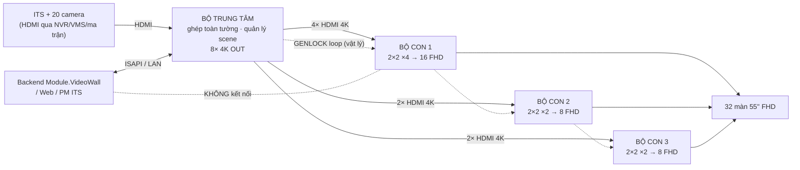

# Kiến trúc Video Wall DS-C66S — Cascade 2 tầng

> **Nguồn sự thật: ảnh gốc [`_source/img/thietkevideowall.jpg`](../_source/img/thietkevideowall.jpg).**
> File này gộp và thay hai file cũ `SoDoCauHinh_...` (chép phần cứng) và `GiaiThich_KetNoi_...`
> (mô tả **sai** mô hình phần mềm — xem [mục 5](#5-4-khung-nối-nhau-bằng-gì)).

---

## TL;DR

- Tường **8×4 = 32 màn** 55″ 1920×1080. Canvas tuyệt đối **15360 × 4320 px**.
- **1 bộ trung tâm** (DS-C66S-S12) nhận **toàn bộ** nguồn (ITS + 20 camera qua HDMI), ghép layout
  toàn tường, quản lý scene, xuất **8 luồng 4K**.
- **3 bộ con** (DS-C66S-S6) chỉ nhận 4K từ trung tâm rồi **bung ra FHD** (16 / 8 / 8 màn). Cấu hình
  tĩnh **một lần**, không đụng nữa.
- **4 khung KHÔNG giao tiếp điều khiển với nhau.** Liên kết chỉ gồm: cáp video HDMI 4K (1 chiều) +
  cáp GENLOCK (đồng bộ nhịp quét, vật lý). Không có lệnh ISAPI trung tâm↔bộ con.
- ⇒ **Backend chỉ tích hợp ISAPI với 1 thiết bị = bộ trung tâm.** Không fan-out, không cắt cửa sổ
  cho bộ con, không SID theo từng khung.

---

## 1. Bức tường

- **8 cột × 4 hàng = 32 màn** LCD 55″, mỗi màn **1920 × 1080**.
- Canvas pixel tuyệt đối toàn tường: **15360 × 4320** (`= 8·1920 × 4·1080`).
- **Vùng ITS/MAP** — 1 cửa sổ phủ **cột 2–7 × hàng 2–3** (6×2 = 12 màn giữa).
- **Vùng CCTV** — **20 màn viền** (hàng 1, hàng 4, cột 1 & cột 8 ở hàng 2–3), **mỗi màn 1 cửa sổ =
  1 camera** ⇒ 20 cửa sổ.
- 12 + 20 = 32. ✔

```
cột:  1    2    3    4    5    6    7    8
    ┌────┬────┬────┬────┬────┬────┬────┬────┐
h1  │CCTV│CCTV│CCTV│CCTV│CCTV│CCTV│CCTV│CCTV│
    ├────┼────┼────┼────┼────┼────┼────┼────┤
h2  │CCTV│        ITS / MAP (6×2)      │CCTV│
    ├────┤     1 cửa sổ, 12 màn        ├────┤
h3  │CCTV│                            │CCTV│
    ├────┼────┬────┬────┬────┬────┬────┼────┤
h4  │CCTV│CCTV│CCTV│CCTV│CCTV│CCTV│CCTV│CCTV│
    └────┴────┴────┴────┴────┴────┴────┴────┘
```

### Toạ độ tuyệt đối (px, gốc trên-trái, panel 1920×1080)

| Vùng | X | Y | W | H |
|---|---:|---:|---:|---:|
| Cửa sổ ITS/MAP | 1920 | 1080 | 11520 | 2160 |
| Màn `(col, row)` bất kỳ (index từ 0) | `col·1920` | `row·1080` | 1920 | 1080 |

### Phép tính pixel (vì sao 8 luồng 4K khớp chằn chặn)

| | Rộng × Cao | Tổng điểm ảnh |
|---|---|---|
| Cả tường (8×4 màn 1920×1080) | 15360 × 4320 | **66 355 200** |
| 8 cổng 4K OUT của trung tâm (mỗi cổng 3840×2160) | 8 × (3840×2160) | **66 355 200** |

Bằng nhau ⇒ ánh xạ **1:1**. Và `3840 = 2·1920`, `2160 = 2·1080` ⇒ **1 cổng 4K OUT = đúng 1 quad
2×2 màn**.

---

## 2. Bộ điều khiển TRUNG TÂM (1 khung)

| Mục | Giá trị |
|---|---|
| Khung (suy từ số card) | **DS-C66S-S12** — 12 khe (8 + 4). "H88-CL" là tên gọi tắt của dự án, không phải SKU Hikvision. |
| Card vào | **8 × DS-C66S-04HI** → 32 cổng HDMI IN |
| Card ra | **4 × DS-C66S-02HO/4K** → **8 cổng 4K OUT** |
| Card DEC | **Không có** trong BOM ⇒ camera vào bằng **HDMI** (qua NVR/VMS HDMI-out hoặc ma trận HDMI), không phải RTSP/IP |
| Nguồn vào | ITS Software/Workstation (HDMI 4K local) + 20 camera CCTV + LAN/Web quản lý |
| Việc | Tổng hợp 20 camera, ghép layout **toàn tường**, quản lý **scene**, **chia 8 luồng 4K OUT** |

---

## 3. Ba bộ điều khiển CON

| Bộ con | Khung | Card vào | 4K in | Card ra | FHD out | Vùng phụ trách |
|---|---|---|---:|---|---:|---|
| Con 1 | DS-C66S-S6 | 2 × DS-C66S-02HI/4K | 4 | 4 × DS-C66S-04HO | 16 | **cột 1–4 × hàng 1–4** = 16 màn |
| Con 2 | DS-C66S-S6 | 1 × DS-C66S-02HI/4K | 2 | 2 × DS-C66S-04HO | 8 | **cột 5–6 × hàng 1–4** = 8 màn |
| Con 3 | DS-C66S-S6 | 1 × DS-C66S-02HI/4K | 2 | 2 × DS-C66S-04HO | 8 | **cột 7–8 × hàng 1–4** = 8 màn |

Mỗi cổng **4K in** của bộ con = **1 quad = 2×2 màn = 3840×2160**. Bộ con bung 1 quad → 4 cổng FHD →
4 màn. Lưới 2×2 này **tĩnh**, người lắp đặt đặt **một lần** qua Web UI / ISAPI **của chính bộ con
đó**, sau đó không đụng.

### 8 luồng 4K từ bộ trung tâm → quad nào

| Center OUT | Quad (cột × hàng) | Xuống | Center OUT | Quad (cột × hàng) | Xuống |
|---|---|---|---|---|---|
| 1 | 1–2 × 1–2 | Con 1 | 5 | 5–6 × 1–2 | Con 2 |
| 2 | 3–4 × 1–2 | Con 1 | 6 | 5–6 × 3–4 | Con 2 |
| 3 | 1–2 × 3–4 | Con 1 | 7 | 7–8 × 1–2 | Con 3 |
| 4 | 3–4 × 3–4 | Con 1 | 8 | 7–8 × 3–4 | Con 3 |

Kiểm tra: 8 × 4K OUT = 4 (Con 1) + 2 (Con 2) + 2 (Con 3). 3 bộ con xuất 32 × FHD = 32 màn. ✔

> **Ranh giới vùng phải trùng ranh giới quad.** Vì vậy Con 1 = cột 1–4 (số chẵn), không phải 1–3.
> Đấu sợi 4K nào vào cổng nào là chọn lúc lắp — miễn dán nhãn nhất quán; cái "biết" nằm ở cấu hình
> tường của bộ trung tâm, không ở dây.

---

## 4. Ba lớp dây giữa các khung

| Lớp | Dây | Đi từ → đến | Để làm gì |
|---|---|---|---|
| **A. Tín hiệu hình** | HDMI 4K & FHD | nguồn → **IN trung tâm**; **OUT trung tâm → IN bộ con**; **OUT bộ con → màn** | Truyền hình thật. "Output trung tâm = input bộ con". |
| **B. Đồng bộ khung hình** | Cáp **GENLOCK** (đầu nối riêng trên main board) | `trung tâm LOOP → Con1 IN → Con1 LOOP → Con2 IN → Con2 LOOP → Con3 IN` (nối chuỗi) | Ép 4 khung quét **cùng nhịp**. Thiếu nó ⇒ cửa sổ vắt mép giữa 2 bộ con bị **xé hình / lệch dòng**. |
| **C. Điều khiển / quản lý** | LAN RJ45 → 1 switch Gigabit | trung tâm + 3 bộ con → switch → PM ITS / Web / API | Đăng nhập, cấu hình lưới, mở cửa sổ, gán nguồn, đổi scene. **Nhưng xem [mục 5](#5-4-khung-nối-nhau-bằng-gì) — backend chỉ nói chuyện với trung tâm.** |

3 lớp **độc lập**. "Output trung tâm là input bộ con" chỉ là **lớp A**.

---

## 5. 4 khung "nối" nhau bằng gì

> Đây là câu hỏi mà tài liệu ISAPI gốc **không trả lời** — vì **không có gì để trả lời**.

| Lớp | Phương tiện | Chiều | Giao thức / API? |
|---|---|---|---|
| **Video** | 8 sợi **HDMI 4K** (trung tâm OUT → bộ con IN) | 1 chiều | **KHÔNG.** Trung tâm chỉ xuất 8 tín hiệu 4K. Bộ con cắm vào **y hệt cắm màn hình**. Trung tâm không "biết" đầu kia là bộ con. |
| **Điều khiển** | — | — | **KHÔNG CÓ.** Không lệnh ISAPI, không bản tin mạng nào từ trung tâm sang bộ con. Không có master/slave trong ISAPI DS-C66S. |
| **Đồng bộ nhịp quét** | Cáp **GENLOCK** daisy-chain (lớp B ở trên) | vật lý | Không phải API. |
| **Quản lý** | 4 sợi RJ45 → 1 switch Gigabit → PM/Web | 2 chiều | ISAPI/Web — **mỗi khung là 1 ISAPI server ĐỘC LẬP** (`/ISAPI/DisplayDev/VideoWall/{wallNo}/...` riêng, tài khoản riêng, SID riêng). Không có lệnh "nhóm 4 khung". |

**Kết luận:** cascade DS-C66S = **topo cáp video + GENLOCK**, không phải cụm phần mềm. ISAPI của mỗi
DS-C66S chỉ điều khiển **tường của chính khung đó**. Cửa sổ vắt ranh giới 2–3 bộ con ⇒ **100% do bộ
trung tâm ghép**; bộ con không hề biết "có cửa sổ ITS", nó chỉ nhận 1 hình 3840×2160 đã đúng pixel,
cắt 4 góc, đẩy ra 4 màn.



---

## 6. Hệ quả cho phần mềm (`Module.VideoWall`)

1. **Backend chỉ nói ISAPI với 1 thiết bị: bộ TRUNG TÂM.** Không kết nối 3 bộ con trong luồng
   scene/window.
2. Bộ trung tâm có **1 wall-logic ISAPI** phủ **toàn bộ 32 màn**, gồm **8 output** (mỗi output = 1
   quad, xuống 1 cổng vào của 1 bộ con). *Số output & cách xếp phải đo bằng KB-00 —* [mục 11](#11-phải-đo--xác-nhận-tại-hiện-trường).
3. Đặt / di chuyển / resize / xoá cửa sổ, đổi scene, đổi nguồn → **chỉ gọi ISAPI tới bộ trung tâm**,
   toạ độ theo **hệ toạ độ tường của bộ trung tâm**. Firmware trung tâm tự lo phần cửa sổ nào rơi
   vào output nào rồi render ra 8 luồng 4K.
4. Backend **KHÔNG** cắt cửa sổ theo từng bộ con · **KHÔNG** `foreach controller` · **KHÔNG** cần SID
   theo từng khung · **KHÔNG** cần đồng bộ pha 4 khung ở tầng phần mềm.
5. 3 bộ con trong DB chỉ là **bản ghi kiểm kê**: vẽ "màn nào thuộc bộ con nào" trên sơ đồ, và (tuỳ
   chọn) ping đọc trạng thái. Không có traffic ISAPI điều khiển.
6. `VwController.GenlockInConnected/OutConnected` là dữ liệu người nhập tay + hiển thị, không có API.

> **Ngoại lệ duy nhất về "lặp":** nếu firmware bộ trung tâm không gộp được 8 output vào 1 wall-logic
> (giới hạn số output/tường), bộ trung tâm khai **nhiều wall-logic** (vd 2 tường × 4 output). Khi đó
> backend loop **các wall-logic của CÙNG bộ trung tâm** — **vẫn 1 IP, 1 thiết bị**, chỉ khác `wallNo`.

### Chống khoá IP (giữ nguyên từ code hiện tại)

Circuit-breaker theo **từng IP** (`VwWallProfile.MaxConsecutiveFailures = 2`, `BlockMinutes = 30`
khớp `maxIllegalLoginLockTime` thiết bị). **Không thử mật khẩu sai trên thiết bị thật** — bẫy
`stale=FALSE`, khoá IP không mở lại được qua LAN. Muốn test Digest sai thì trỏ mock server.

---

## 7. Vì sao cascade mà không dùng 1 khung S12 duy nhất

| Lý do | Chi tiết |
|---|---|
| **Yêu cầu 3 vùng điều khiển độc lập** | KV1 (16 màn) / KV2 (8 màn) / KV3 (8 màn) tách riêng để vận hành – bảo trì từng vùng không ảnh hưởng vùng khác. **Đây là lý do chính.** |
| **Giảm card đắt ở tầng dưới** | Bộ con chỉ cần 02HI/4K (vào) + 04HO (ra FHD) rẻ hơn; không cần card decode, không cần nhiều cổng vào. |
| **Tập trung "bộ não" 1 chỗ** | Toàn bộ logic ghép hình / scene / tổng hợp camera nằm ở trung tâm → phần mềm chủ yếu nói chuyện 1 IP. |

**Đánh đổi:** mỗi lần "nhảy" tầng cascade cộng ~1 khung hình trễ; mép giữa 2 bộ con phải canh GENLOCK
+ bezel kỹ. Với đúng 32 màn, 1 khung DS-C66S-S12 (đủ sức ~40 màn) là phương án đơn giản hơn về kỹ
thuật — tách 3 con ở đây là do **yêu cầu vận hành**, không phải thiếu năng lực phần cứng.

---

## 8. Tổng cấu hình thiết bị (BOM)

| Thiết bị | SL | Phân bổ |
|---|---:|---|
| DS-C66S chassis ("H88-CL") | 4 | 1 trung tâm (S12) + 3 con (S6) |
| DS-C66S-PWR | 4 | mỗi khung 1 bộ |
| DS-C66S-04HI (4× HDMI in) | 8 card | **tất cả ở bộ trung tâm** → 32 HDMI IN |
| DS-C66S-02HO/4K (2× 4K out) | 4 card | **tất cả ở bộ trung tâm** → 8× 4K OUT |
| DS-C66S-02HI/4K (2× 4K in) | 4 card | Con 1: 2 · Con 2: 1 · Con 3: 1 → 8× 4K IN |
| DS-C66S-04HO (4× FHD out) | 8 card | Con 1: 4 · Con 2: 2 · Con 3: 2 → 32× FHD OUT |
| Switch mạng Gigabit | 1 | lớp quản lý dùng chung |

**Cáp & phụ kiện:** 8 sợi HDMI 4K (trung tâm → 3 con: 4/2/2) · 32 sợi HDMI FHD (3 con → 32 màn) ·
HDMI nguồn vào ITS/NVR/VMS theo thực tế · 4 sợi Cat6/6A quản lý + 1 uplink từ switch · 4 dây nguồn AC
+ 32 dây nguồn màn · patch cord / nhãn cáp / PDU / tủ rack nếu lắp tủ.

---

## 9. Luồng tín hiệu

```
ITS Software + 20 camera / NVR-VMS
        │  (HDMI, qua switch LAN / ma trận HDMI)
        ▼
BỘ TRUNG TÂM DS-C66S-S12  ── ghép toàn tường + scene ──►  chia 8 luồng 4K
        │
        ├─ 4× 4K ─►  BỘ CON 1  ─► 16 màn (cột 1–4)
        ├─ 2× 4K ─►  BỘ CON 2  ─► 8 màn  (cột 5–6)
        └─ 2× 4K ─►  BỘ CON 3  ─► 8 màn  (cột 7–8)
```

Một chiều tuyệt đối: `nguồn → trung tâm → bộ con → màn`. Không có sợi nào chạy ngược.

- **1 camera lên tường:** camera → NVR/VMS xuất HDMI → cổng 04HI bộ trung tâm → trung tâm đặt vào
  cửa sổ trong layout/scene → vùng ảnh rơi vào 1 quad 4K → 4K OUT → 4K IN bộ con phụ trách → bộ con
  bung 4 cổng FHD → tới màn.
- **Màn hình phần mềm ITS:** Workstation ITS → HDMI 4K → bộ trung tâm đặt cửa sổ ITS phủ cột 2–7 ×
  hàng 2–3 → vùng đó vắt nhiều quad → nhiều bộ con cùng nhận phần của mình → GENLOCK giữ 12 màn giữa
  ghép liền 1 ảnh.
- **Đổi scene (từ PM/API):** PM → LAN → backend nhận 1 lệnh "kích hoạt kịch bản" → backend gọi ISAPI
  `PUT .../VideoWall/{wallNo}/scene/{SID}/activate` **chỉ trên bộ trung tâm** → hình đổi trên cả 32
  màn (bộ con không nhận lệnh nào).

---

## 10. Nếu KHÔNG map "quad sạch" (biến thể khi khảo sát)

| Tình huống | Hệ quả |
|---|---|
| Bộ con nhận 4K nhưng vùng chỉ 2 màn ngang (1920×2160) | Phí ~½ băng thông sợi 4K. Chấp nhận được, hoặc để trung tâm xuất FHD cho vùng đó. |
| Trung tâm xuất mỗi cổng phủ 2 màn (không phải 4) | Cần nhiều cổng OUT hơn → nhiều card 02HO/4K hơn → có thể không đủ 12 khe. |
| 1 quad vắt ranh giới 2 bộ con | **Không được.** Ranh giới vùng phải trùng ranh giới quad. |

---

## 11. Phải đo / xác nhận tại hiện trường

### KB-00 — probe read-only trên **bộ trung tâm**

| # | Endpoint | Lấy gì | Vì sao |
|---|---|---|---|
| 1 | `GET /ISAPI/System/deviceInfo` | `model`, `serialNumber`, `firmwareVersion` | Mã khung thật (S12?) — **chưa từng đo** trong log. |
| 2 | `GET /ISAPI/DisplayDev/VideoWall` | danh sách `VideoWall1..N` + tường nào `bound` | **Đừng mặc định `wallNo = 1`.** |
| 3 | `GET /ISAPI/DisplayDev/VideoWall/{wall}/capabilities` | `baseOutputSize`, `maxWindowNums`, `isSupportScene/Roam` | Ô toạ độ ảo (đo trên bench = **1920**). |
| 4 | `GET /ISAPI/DisplayDev/VideoWall/{wall}/outputs` | `Rect` mỗi output | **Suy ra lưới bộ trung tâm:** mấy output, xếp mấy cột × hàng, mỗi ô mấy `baseOutputSize` → tham số `centerGrid`. |
| 5 | `GET /ISAPI/DisplayDev/Video/inputs/channels` | `id`, `portType`, `signalStatus` | Bản đồ `VwSource.SignalNo` (ITS + 20 camera). Xác nhận **HDMI** (không phải IP). |
| 6 | `GET /ISAPI/DisplayDev/VideoWall/{wall}/scene` | dãy SID | SID là số nguyên nhỏ đếm theo từng wall. |

### 6 điểm hỏi Hikvision / nhà cung cấp

1. **Mã khung thật** — "DS-C66S-H88-CL" không phải SKU; catalog chỉ có S12 / S6 + card rời. Lấy BOM
   NCC điền `VwController.Model` / bố trí khe.
2. **20 camera vào HDMI hay IP** — BOM không có card DEC ⇒ suy ra HDMI; xác nhận lại (nếu IP thì phải
   thêm `DS-C66S-DEC` cho bộ trung tâm).
3. **Độ phân giải panel thật 1920×1080** — khớp .jpg; sai giá trị này ⇒ lệch phép quy đổi toạ độ.
4. **SID scene có độc lập theo từng wall-logic trong 1 khung không** (1 khung có tới 8 wall
   `VideoWall1..8`).
5. **GENLOCK nối chuỗi** — đủ cáp chưa, thứ tự (trung tâm LOOP → Con1 IN → …), khớp
   `VwController.GenlockInConnected/OutConnected`.
6. **Hikvision có chính thức support HDMI-out→HDMI-in cascade cho 1 tường liền không** — hỏi trễ cộng
   dồn + cách canh mép giữa 3 vùng.

---

## Tham chiếu

- Ảnh gốc: [`_source/img/thietkevideowall.jpg`](../_source/img/thietkevideowall.jpg)
- Số liệu đo thiết bị thật (bench DS-C66S): [`../data/logs-api/`](../data/logs-api/README.md) —
  `baseOutputSize=1920`, `maxWallNums=8`, `maxWindowNums=512`, `isSupportScene=true`,
  `isSupportRoam=true`, `isSupportPlan=false` (⇒ **không có API bật nguồn màn**).
- Phần cứng cổng GENLOCK: [`Controller-phan-cung/Controller-phan-cung.md`](Controller-phan-cung/Controller-phan-cung.md) §1.2.2
  (*"Connect to the GENLOCK port of other devices of the same type … for signal looping"*).
- ISAPI: [`ISAPI-Videowall-Controller/`](ISAPI-Videowall-Controller/) (danh mục card họ DS-C66S ở §2.2 — không có mã "H88-CL").
- Kịch bản test API: [`KichBan/`](KichBan/).
