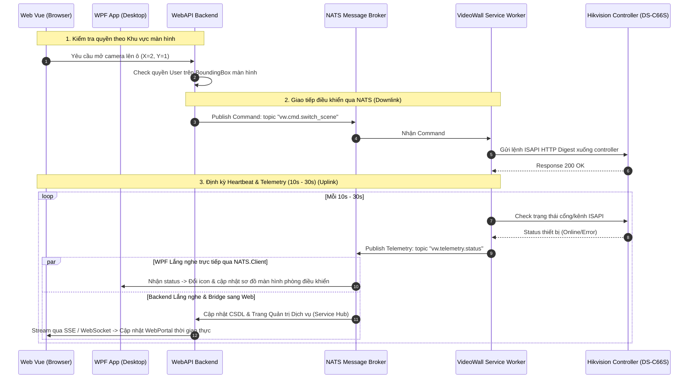

# Thảo luận VideoWall — Phân quyền Khu vực hiển thị, Kiến trúc NATS & Điều khiển Màn hình

**Ngôn ngữ:** Tiếng Việt  
**Thời lượng:** 10:37  
**File nguồn:** `_source/audio/2026-09-09-videowall-phan-quyen-va-layout.m4a`  
**Chủ đề:** Phân quyền theo khu vực hiển thị màn hình (rào phạm vi), kiến trúc giao tiếp microservice qua NATS, nguyên tắc mở rộng Entity, tối ưu SqlSugar ToTree và trang quản trị dịch vụ tập trung.

---

## 1. Tóm tắt nội dung toàn diện (Executive Summary)

Buổi họp chốt các định hướng quan trọng về kiến trúc phần mềm cho phân hệ **VideoWall**:

### 1.1. Nguyên tắc mở rộng Cơ sở dữ liệu & Entity
- **Hạn chế tối đa việc sửa đổi Entity cũ:** Không xóa hoặc sửa đổi cấu trúc các cột/field hiện có trong các entity `Vw*` của CSDL để tránh xung đột mã nguồn và migration cũ.
- **Quy tắc mở rộng an toàn:** Nếu cần bổ sung tính năng mới, **chỉ thêm field mới** vào entity hiện tại, tận dụng tối đa các bảng đã có.
- **Bổ sung trường cấu hình thông tin màn hình:** Bổ sung trực tiếp trường cấu hình (`ConfigJson` / `ScreenConfig`) vào bảng màn hình để lưu trữ metadata mở rộng.

### 1.2. Phân quyền hiển thị theo Màn hình & Khu vực (Display Area Bounding)
- **Không phân quyền trên Controller phần cứng:** Controller phần cứng (Hikvision DS-C66S / DS-C30S) chỉ là thiết bị đầu cuối bên dưới; tuyệt đối không gắn logic phân quyền người dùng vào controller.
- **Phân quyền dựa trên Tọa độ / Vị trí màn hình hiển thị (Screen Coordinates / Display Area):**
  - Hệ thống kiểm tra và rào phạm vi thao tác của User theo từng ô/khu vực màn hình.
  - **Bố cục ma trận 8x5 (hoặc 8x4):** Màn hình lớn được chia thành lưới tọa độ. User chỉ được phân quyền trong phạm vi các ô được cấp phép; khi kéo thả nguồn tín hiệu hoặc đổi layout, phần mềm tự động chặn nếu người dùng thao tác ngoài ranh giới được rào.
- **3 tầng phân quyền VideoWall hoàn chỉnh:**
  1. Phân quyền theo **Tổ chức (Organization / Department)** làm gốc (thừa hưởng mặc định).
  2. Phân quyền override theo **Người dùng (User)** cụ thể.
  3. Phân quyền theo **Khu vực hiển thị (Display Area / Bounded Region)** trên tường màn hình.

### 1.3. Mô hình giao tiếp qua NATS Messaging (Kiến trúc 2 tầng: Control & Service)
- **Tách bạch 2 thành phần:**
  - **Khối Điều khiển (Control Module / Backend WebAPI / UI):** Tiếp nhận thao tác của người dùng, kiểm tra phân quyền, tạo lệnh điều khiển.
  - **Khối Dịch vụ (Service Worker / Device Adapter):** Độc lập, chuyên trách giao tiếp socket / HTTP ISAPI với phần cứng controller Hikvision.
- **Cơ chế giao tiếp qua NATS (Pub/Sub & Request/Reply):**
  - *Luồng điều khiển (Downlink):* Backend bắn message chứa lệnh (chuyển scene, mở cửa sổ, map camera) lên NATS topic (ví dụ: `videowall.command.<controllerId>`). Service Worker lắng nghe topic này và gọi lệnh ISAPI tương ứng xuống thiết bị.
  - *Luồng dữ liệu & Heartbeat (Uplink):* Service Worker định kỳ mỗi **10s - 30s** quét trạng thái thiết bị và publish thông tin (kết nối, tình trạng kênh giải mã, trạng thái nguồn tín hiệu) lên NATS topic để Backend và UI cập nhật thời gian thực.
  - *Truy vấn thông tin (Get service thông qua NATS):* Backend có thể gửi request qua NATS pattern Request-Reply để lấy thông tin tức thì từ Service Worker.
- **Trang quản trị dịch vụ tập trung (Service Management Hub):**
  - Thiết kế 1 trang quản lý chung hiển thị toàn bộ trạng thái sống/chết (Health Check), độ trễ, và version của các service worker đang chạy trong hệ thống.

### 1.4. Tối ưu xử lý dữ liệu với SqlSugar
- Đối với danh mục phân cấp vị trí/trạm (`Zone`), bắt buộc dùng hàm `ToTree()` của **SqlSugar** (`db.Queryable<Zone>().ToTree(...)`) để sinh cấu trúc cây JSON phục vụ hiển thị TreeView ở frontend, tránh viết đệ quy thủ công gây rủi ro nghẽn CPU hoặc loop.

---

## 2. Giải thích chi tiết kiến trúc & Hướng dẫn kỹ thuật (Technical Deep-Dive)

### 2.1. Tại sao phải chia đôi thành Khối Control và Khối Dịch vụ? (Mục 5 & 8)
- **Khối Control (WebAPI Backend + Giao diện Web/WPF):** Nằm ở tầng trên (Server trung tâm/Cloud). Chuyên làm nhiệm vụ tiếp nhận click của người dùng, kiểm tra phân quyền, lưu kịch bản vào CSDL.
  - **Tuyệt đối không để WebAPI kết nối trực tiếp với thiết bị phần cứng Hikvision:** Thiết bị nằm trong mạng nội bộ phòng máy (LAN/VLAN), kết nối HTTP Digest dễ chập chờn hoặc timeout. Nếu WebAPI vừa xử lý nghiệp vụ vừa chờ thiết bị thì khi thiết bị treo, cả hệ thống WebAPI sẽ bị nghẽn theo.
- **Khối Dịch vụ (Service Worker / Device Adapter):** Nằm ở tầng dưới (chạy ngầm dạng Windows Service hoặc Console App trên máy tính điều hành đặt tại phòng máy gần thiết bị). Chuyên trách việc kết nối trực tiếp với phần cứng Hikvision DS-C66S/DS-C30S qua giao thức ISAPI.

### 2.2. NATS là gì? Gửi NATS đi / gửi về là gì? (Mục 5 & 8)
NATS đóng vai trò như một **tổng đài chuyển phát tin nhắn siêu tốc (Message Broker)** kết nối giữa WebAPI và Service Worker mà không cần hai bên biết địa chỉ IP của nhau:

```
┌────────────────────────┐                   ┌────────────────────────┐
│  WebAPI / Dashboard UI │                   │ VideoWall Device       │
│  (Khối Control)        │                   │ Service (Khối Dịch vụ) │
└──────────┬─────────────┘                   └──────────▲─────────────┘
           │ (1) Publish Lệnh                           │ (2) Lắng nghe topic
           ▼                                            │     & Gọi ISAPI
  ══════════════════════════ NATS BROKER ══════════════════════════════
           ▲                                            │ (3) Publish Heartbeat
           │ (4) Lắng nghe Status                       ▼     mỗi 10s - 30s
┌──────────┴─────────────┐                   ┌────────────────────────┐
│  Trang Quản lý dịch vụ │                   │  Thiết bị phần cứng    │
│  (Service Hub)         │                   │  Hikvision DS-C66S     │
└────────────────────────┘                   └────────────────────────┘
```

1. **Chiều Gửi đi (Downlink — Điều khiển từ trên xuống):**
   - Người dùng bấm trên Web: *"Mở camera số 5 lên ô màn hình (Col=2, Row=1)"*.
   - WebAPI check quyền xong, đóng gói lệnh thành JSON:
     `{ "action": "OPEN_WINDOW", "col": 2, "row": 1, "camId": "CAM_05" }`.
   - WebAPI **gửi (Publish)** gói tin này lên NATS vào Topic: `vw.cmd.c66s_master`.
   - Service Worker ở phòng máy đăng ký (Subscribe) topic này nhận được lệnh ngay lập tức và gọi lệnh HTTP ISAPI xuống controller Hikvision để mở camera trên màn hình thật.
2. **Chiều Gửi về (Uplink — Báo cáo trạng thái từ dưới lên):**
   - Xem chi tiết ở Mục 2.3 dưới đây.

### 2.3. Định kỳ 10s, 30s gửi giá trị tương ứng (Heartbeat & Telemetry) (Mục 6)
- **Mục đích:** Người điều hành cần biết bộ điều khiển Hikvision có đang bật không, các cổng HDMI có bị tuột dây không, màn hình nào đang sáng, màn nào mất tín hiệu. Nếu cứ mỗi giây Web/WPF lại gọi xuống thiết bị để hỏi thì thiết bị sẽ quá tải CPU và treo.
- **Giải pháp:** Service Worker ở phòng máy định kỳ **cứ 10 giây hoặc 30 giây** tự động gọi ISAPI thăm dò thiết bị 1 lần, đóng gói kết quả và **bắn (Publish) lên NATS** vào topic `vw.telemetry.c66s_master`:
  ```json
  { "controller": "ONLINE", "temp": 42, "activeWindows": 12, "lastPing": 1725964800 }
  ```
- **Cơ chế các bên "Lắng nghe Status":**
  - **Ứng dụng WPF Desktop (C#):** Nhúng thư viện `NATS.Client` (từ module `DataTransporter.Natsio`) và **lắng nghe (Subscribe) trực tiếp** topic NATS này để cập nhật sơ đồ màn hình tường, đổi icon xanh/đỏ cho người trực ca tại phòng điều khiển trung tâm ngay tức thì.
  - **Backend WebAPI:** Lắng nghe topic NATS này để kiểm tra sức khỏe (Health Check), ghi log, và cập nhật dữ liệu cho **"Trang Quản lý tất cả dịch vụ" (Service Management Hub)**.
  - **Trình duyệt Web (Web Vue Frontend):** Trình duyệt không kết nối NATS raw TCP trực tiếp, mà nhận dữ liệu trạng thái được Backend chuyển tiếp (bridge) qua **SSE (Server-Sent Events)** hoặc **WebSocket** để hiển thị trạng thái thiết bị thời gian thực lên bản đồ điều hành WebPortal.

### 2.4. Trang quản lý tất cả các dịch vụ (Service Management Hub) (Mục 7)
- Trong hệ thống Cao tốc Hữu Nghị – Chi Lăng có rất nhiều service chạy ngầm: VideoWall Controller Service, Toll Service, ShareData Worker, VDS Camera Service, VMS Service...
- **Trang quản trị dịch vụ** là 1 màn hình Dashboard tập trung dành riêng cho quản trị viên:
  - Liệt kê toàn bộ các Service đang chạy trong hệ thống.
  - Hiển thị: Tên service, Server đang chạy, Trạng thái (Online/Offline/Warning), Lần cuối gửi tin (Last Heartbeat), Phiên bản code.
  - Khi có bất kỳ service nào bị sập (quá 30s không gửi heartbeat lên NATS), trang này sẽ báo đỏ cảnh báo ngay lập tức để IT can thiệp.

### 2.5. Cấu trúc gói tin tham khảo qua NATS (Mục 9)
Đây là cấu trúc vỏ bọc (Message Envelope) chuẩn hóa khi các service gửi tin nhắn qua NATS:
```json
{
  "messageId": "msg_20260910_001",
  "type": "COMMAND",              // COMMAND (lệnh điều khiển) | TELEMETRY (báo trạng thái)
  "topic": "vw.cmd.controller_01",// Tên topic NATS
  "sender": "WebAPI_Node01",      // Nguồn gửi
  "timestamp": 1725964800,        // Thời gian phát sinh Unix timestamp
  "payload": {                    // Nội dung chi tiết bên trong (H2 data)
    "controllerId": "CTRL_C66S_01",
    "action": "SWITCH_SCENE",
    "sceneId": 2,
    "layout": "8x5",
    "windows": [
      { "windowId": 1, "col": 0, "row": 0, "width": 2, "height": 2, "sourceId": "CAM_KM20" }
    ]
  }
}
```

### 2.6. Get service thông qua NATS (Request - Reply Pattern) (Mục 10)
- **Vấn đề thông thường:** Khi WebAPI muốn lấy thông tin cấu hình từ Service Worker, WebAPI phải biết địa chỉ IP của Service (ví dụ `http://192.168.1.100:5000/status`). Nhưng nếu máy đó đổi IP hoặc đổi sang server khác thì code WebAPI bị lỗi.
- **Giải pháp qua NATS:** NATS hỗ trợ cơ chế **Request - Reply**:
  1. WebAPI gửi 1 request vào NATS topic: `nats.Request("vw.service.get_status", requestData)`.
  2. NATS tự tìm Service Worker đang sống để chuyển câu hỏi tới.
  3. Service Worker nhận được câu hỏi, trả lời thẳng về cho WebAPI.
  - 👉 **Lợi ích:** Hai bên giao tiếp độc lập, không cần biết IP của nhau, không sợ bị chặn firewall nội bộ.

### 2.7. Tận dụng SqlSugar ToTree cho bảng Zone (Mục 11)
- Bảng vị trí / đoạn đường / trạm (`Zone`) có quan hệ cha - con (`Id`, `ParentId`, `Name`).
- Thay vì tự viết hàm đệ quy trong C# dài 50-100 dòng dễ bị lỗi lặp vô tận, thư viện ORM SqlSugar có sẵn hàm `.ToTree()` cực mạnh chỉ với **đúng 1 dòng code**:
  ```csharp
  // Tự động build toàn bộ cây thư mục danh mục Zone dạng JSON lồng nhau (children: [...])
  var zoneTree = await db.Queryable<Zone>()
                         .ToTreeAsync(it => it.Children, it => it.ParentId, 0);
  ```
- Kết quả trả về thẳng cho Frontend hiển thị lên component TreeView (cây thư mục) cực nhanh và an toàn tuyệt đối.

### 2.8. Check thông tin màn hình thêm 1 trường cấu hình (Mục 12)
- Hiện trạng entity `VwScreen` đang có các cột cố định: `Name`, `ControllerId`, `OutPutPort`, `GridCol`, `GridRow`, `Resolution`, `WidthPx`, `HeightPx`...
- **Giải pháp:** Tuân thủ quy tắc số 1 (Không sửa/xóa các cột cũ), thêm trực tiếp 1 cột JSON đa năng vào bảng:
  ```csharp
  [SugarColumn(IsNullable = true, ColumnDataType = StaticConfig.CodeFirst_BigString)]
  public string? ScreenConfig { get; set; } // hoặc CustomConfig
  ```
- Khi màn hình cần lưu thêm các thông số kỹ thuật mới (bù viền Bezel, tỷ lệ zoom, thông số cân chỉnh màu sắc, ranh giới hiển thị...), chỉ việc lưu dạng JSON vào trường này mà **không cần phải chạy script ALTER TABLE CSDL hay tạo migration mới**.

### 2.9. Tầng phân quyền thứ 3: Phân quyền theo khu vực hiển thị (Mục 13 & Mục 4)
Hệ thống VideoWall hoàn chỉnh gồm **3 tầng phân quyền độc lập**:
1. **Tầng 1 — Theo Tổ chức (Organization):** Cấp quyền cho phòng ban (ví dụ: Đội Tuần tra, Đội Giám sát Trung tâm). Mọi user trong đội tự động có quyền.
2. **Tầng 2 — Theo Người dùng (User Override):** Cấp quyền riêng cho cá nhân (ví dụ: Trưởng ca được quyền điều khiển toàn quyền, nhân viên trực ca chỉ được xem).
3. **Tầng 3 — Theo Khu vực hiển thị màn hình (Display Area Grid Bounding Box):**
   - Tường màn hình ghép 8×5 (40 màn) rất lớn và phục vụ nhiều đơn vị cùng quan sát. Không thể để 1 user tùy ý kéo camera che hết toàn bộ tường màn hình của người khác.
   - Hệ thống phân chia ranh giới hiển thị dạng Bounding Box trên lưới tọa độ:
     ```json
     {
       "userId": "user_01",
       "allowedArea": { "colStart": 0, "colEnd": 3, "rowStart": 0, "rowEnd": 2 }
     }
     ```
   - Khi User gửi lệnh thao tác vào tọa độ `(Col, Row, Width, Height)`, Backend chỉ cần kiểm tra logic hình học đơn giản:
     ```csharp
     bool isAllowed = window.Col >= allowed.ColStart 
                   && (window.Col + window.Width - 1) <= allowed.ColEnd
                   && window.Row >= allowed.RowStart 
                   && (window.Row + window.Height - 1) <= allowed.RowEnd;
     if (!isAllowed) throw new ForbiddenException("Thao tác ngoài khu vực màn hình được phân quyền!");
     ```

---

## 3. Sơ đồ kiến trúc giao tiếp qua NATS (Mermaid)



---

## 4. Chi tiết các nội dung thảo luận (Audio Timeline 10:37)

- **[00:00 - 03:30] Cấu trúc gói tin Wrapper & Khối Service:**
  - Định dạng gói tin vỏ bọc gồm: Type, Topic, Payload.
  - Phân tách rõ ràng giữa module Control và module Service.
- **[03:30 - 07:00] Rào khu vực hiển thị & Phân quyền theo màn hình:**
  - Nhấn mạnh: Chỉ rào theo phần mềm trên màn hình hiển thị, không ràng buộc vào controller phần cứng.
  - Ma trận lưới màn hình (ví dụ 8x5), user chỉ được thao tác trong ô/khối được chỉ định.
- **[07:00 - 10:37] SqlSugar ToTree, NATS Heartbeat & Quản lý dịch vụ:**
  - Tận dụng `ToTree()` của SqlSugar để dựng cây Zone sạch sẽ.
  - Cơ chế heartbeat 10-30s gửi qua NATS để trang quản lý dịch vụ nắm bắt trạng thái hoạt động.\n