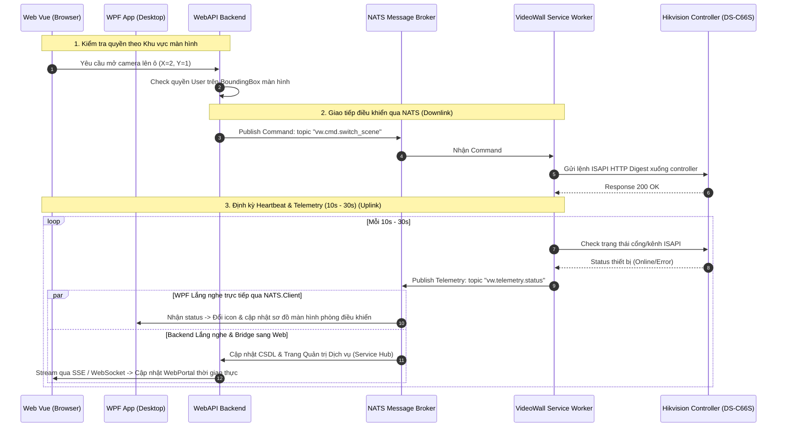

# Thảo luận VideoWall — Phân quyền Khu vực hiển thị, Kiến trúc NATS & Điều khiển Màn hình

**Ngôn ngữ:** Tiếng Việt  
**Thời lượng:** 10:37  
**File nguồn:** `_source/audio/2026-09-09-videowall-phan-quyen-va-layout.m4a`  
**Chủ đề:** Phân quyền theo khu vực hiển thị màn hình (rào phạm vi), kiến trúc giao tiếp microservice qua NATS, nguyên tắc mở rộng Entity, tối ưu SqlSugar ToTree và trang quản trị dịch vụ tập trung.

---

## 1. Tóm tắt nội dung toàn diện (Executive Summary)

Buổi họp chốt các định hướng quan trọng về kiến trúc phần mềm cho phân hệ **VideoWall**:

### 1.1. Nguyên tắc mở rộng Cơ sở dữ liệu & Entity
- **Hạn chế tối đa việc sửa đổi Entity cũ:** Không xóa hoặc sửa đổi cấu trúc các cột/field hiện có trong các entity `Vw*` của CSDL để tránh xung đột mã nguồn và migration cũ.
- **Quy tắc mở rộng an toàn:** Nếu cần bổ sung tính năng mới, **chỉ thêm field mới** vào entity hiện tại, tận dụng tối đa các bảng đã có.
- **Bổ sung trường cấu hình thông tin màn hình:** Bổ sung trực tiếp trường cấu hình (`ConfigJson` / `ScreenConfig`) vào bảng màn hình để lưu trữ metadata mở rộng.

### 1.2. Phân quyền hiển thị theo Màn hình & Khu vực (Display Area Bounding)
- **Không phân quyền trên Controller phần cứng:** Controller phần cứng (Hikvision DS-C66S / DS-C30S) chỉ là thiết bị đầu cuối bên dưới; tuyệt đối không gắn logic phân quyền người dùng vào controller.
- **Phân quyền dựa trên Tọa độ / Vị trí màn hình hiển thị (Screen Coordinates / Display Area):**
  - Hệ thống kiểm tra và rào phạm vi thao tác của User theo từng ô/khu vực màn hình.
  - **Bố cục ma trận 8x5 (hoặc 8x4):** Màn hình lớn được chia thành lưới tọa độ. User chỉ được phân quyền trong phạm vi các ô được cấp phép; khi kéo thả nguồn tín hiệu hoặc đổi layout, phần mềm tự động chặn nếu người dùng thao tác ngoài ranh giới được rào.
- **3 tầng phân quyền VideoWall hoàn chỉnh:**
  1. Phân quyền theo **Tổ chức (Organization / Department)** làm gốc (thừa hưởng mặc định).
  2. Phân quyền override theo **Người dùng (User)** cụ thể.
  3. Phân quyền theo **Khu vực hiển thị (Display Area / Bounded Region)** trên tường màn hình.

### 1.3. Mô hình giao tiếp qua NATS Messaging (Kiến trúc 2 tầng: Control & Service)
- **Tách bạch 2 thành phần:**
  - **Khối Điều khiển (Control Module / Backend WebAPI / UI):** Tiếp nhận thao tác của người dùng, kiểm tra phân quyền, tạo lệnh điều khiển.
  - **Khối Dịch vụ (Service Worker / Device Adapter):** Độc lập, chuyên trách giao tiếp socket / HTTP ISAPI với phần cứng controller Hikvision.
- **Cơ chế giao tiếp qua NATS (Pub/Sub & Request/Reply):**
  - *Luồng điều khiển (Downlink):* Backend bắn message chứa lệnh (chuyển scene, mở cửa sổ, map camera) lên NATS topic (ví dụ: `videowall.command.<controllerId>`). Service Worker lắng nghe topic này và gọi lệnh ISAPI tương ứng xuống thiết bị.
  - *Luồng dữ liệu & Heartbeat (Uplink):* Service Worker định kỳ mỗi **10s - 30s** quét trạng thái thiết bị và publish thông tin (kết nối, tình trạng kênh giải mã, trạng thái nguồn tín hiệu) lên NATS topic để Backend và UI cập nhật thời gian thực.
  - *Truy vấn thông tin (Get service thông qua NATS):* Backend có thể gửi request qua NATS pattern Request-Reply để lấy thông tin tức thì từ Service Worker.
- **Trang quản trị dịch vụ tập trung (Service Management Hub):**
  - Thiết kế 1 trang quản lý chung hiển thị toàn bộ trạng thái sống/chết (Health Check), độ trễ, và version của các service worker đang chạy trong hệ thống.

### 1.4. Tối ưu xử lý dữ liệu với SqlSugar
- Đối với danh mục phân cấp vị trí/trạm (`Zone`), bắt buộc dùng hàm `ToTree()` của **SqlSugar** (`db.Queryable<Zone>().ToTree(...)`) để sinh cấu trúc cây JSON phục vụ hiển thị TreeView ở frontend, tránh viết đệ quy thủ công gây rủi ro nghẽn CPU hoặc loop.

---

## 2. Giải thích chi tiết kiến trúc & Hướng dẫn kỹ thuật (Technical Deep-Dive)

### 2.1. Tại sao phải chia đôi thành Khối Control và Khối Dịch vụ? (Mục 5 & 8)
- **Khối Control (WebAPI Backend + Giao diện Web/WPF):** Nằm ở tầng trên (Server trung tâm/Cloud). Chuyên làm nhiệm vụ tiếp nhận click của người dùng, kiểm tra phân quyền, lưu kịch bản vào CSDL.
  - **Tuyệt đối không để WebAPI kết nối trực tiếp với thiết bị phần cứng Hikvision:** Thiết bị nằm trong mạng nội bộ phòng máy (LAN/VLAN), kết nối HTTP Digest dễ chập chờn hoặc timeout. Nếu WebAPI vừa xử lý nghiệp vụ vừa chờ thiết bị thì khi thiết bị treo, cả hệ thống WebAPI sẽ bị nghẽn theo.
- **Khối Dịch vụ (Service Worker / Device Adapter):** Nằm ở tầng dưới (chạy ngầm dạng Windows Service hoặc Console App trên máy tính điều hành đặt tại phòng máy gần thiết bị). Chuyên trách việc kết nối trực tiếp với phần cứng Hikvision DS-C66S/DS-C30S qua giao thức ISAPI.

### 2.2. NATS là gì? Gửi NATS đi / gửi về là gì? (Mục 5 & 8)
NATS đóng vai trò như một **tổng đài chuyển phát tin nhắn siêu tốc (Message Broker)** kết nối giữa WebAPI và Service Worker mà không cần hai bên biết địa chỉ IP của nhau:

```
┌────────────────────────┐                   ┌────────────────────────┐
│  WebAPI / Dashboard UI │                   │ VideoWall Device       │
│  (Khối Control)        │                   │ Service (Khối Dịch vụ) │
└──────────┬─────────────┘                   └──────────▲─────────────┘
           │ (1) Publish Lệnh                           │ (2) Lắng nghe topic
           ▼                                            │     & Gọi ISAPI
  ══════════════════════════ NATS BROKER ══════════════════════════════
           ▲                                            │ (3) Publish Heartbeat
           │ (4) Lắng nghe Status                       ▼     mỗi 10s - 30s
┌──────────┴─────────────┐                   ┌────────────────────────┐
│  Trang Quản lý dịch vụ │                   │  Thiết bị phần cứng    │
│  (Service Hub)         │                   │  Hikvision DS-C66S     │
└────────────────────────┘                   └────────────────────────┘
```

1. **Chiều Gửi đi (Downlink — Điều khiển từ trên xuống):**
   - Người dùng bấm trên Web: *"Mở camera số 5 lên ô màn hình (Col=2, Row=1)"*.
   - WebAPI check quyền xong, đóng gói lệnh thành JSON:
     `{ "action": "OPEN_WINDOW", "col": 2, "row": 1, "camId": "CAM_05" }`.
   - WebAPI **gửi (Publish)** gói tin này lên NATS vào Topic: `vw.cmd.c66s_master`.
   - Service Worker ở phòng máy đăng ký (Subscribe) topic này nhận được lệnh ngay lập tức và gọi lệnh HTTP ISAPI xuống controller Hikvision để mở camera trên màn hình thật.
2. **Chiều Gửi về (Uplink — Báo cáo trạng thái từ dưới lên):**
   - Xem chi tiết ở Mục 2.3 dưới đây.

### 2.3. Định kỳ 10s, 30s gửi giá trị tương ứng (Heartbeat & Telemetry) (Mục 6)
- **Mục đích:** Người điều hành cần biết bộ điều khiển Hikvision có đang bật không, các cổng HDMI có bị tuột dây không, màn hình nào đang sáng, màn nào mất tín hiệu. Nếu cứ mỗi giây Web/WPF lại gọi xuống thiết bị để hỏi thì thiết bị sẽ quá tải CPU và treo.
- **Giải pháp:** Service Worker ở phòng máy định kỳ **cứ 10 giây hoặc 30 giây** tự động gọi ISAPI thăm dò thiết bị 1 lần, đóng gói kết quả và **bắn (Publish) lên NATS** vào topic `vw.telemetry.c66s_master`:
  ```json
  { "controller": "ONLINE", "temp": 42, "activeWindows": 12, "lastPing": 1725964800 }
  ```
- **Cơ chế các bên "Lắng nghe Status":**
  - **Ứng dụng WPF Desktop (C#):** Nhúng thư viện `NATS.Client` (từ module `DataTransporter.Natsio`) và **lắng nghe (Subscribe) trực tiếp** topic NATS này để cập nhật sơ đồ màn hình tường, đổi icon xanh/đỏ cho người trực ca tại phòng điều khiển trung tâm ngay tức thì.
  - **Backend WebAPI:** Lắng nghe topic NATS này để kiểm tra sức khỏe (Health Check), ghi log, và cập nhật dữ liệu cho **"Trang Quản lý tất cả dịch vụ" (Service Management Hub)**.
  - **Trình duyệt Web (Web Vue Frontend):** Trình duyệt không kết nối NATS raw TCP trực tiếp, mà nhận dữ liệu trạng thái được Backend chuyển tiếp (bridge) qua **SSE (Server-Sent Events)** hoặc **WebSocket** để hiển thị trạng thái thiết bị thời gian thực lên bản đồ điều hành WebPortal.

### 2.4. Trang quản lý tất cả các dịch vụ (Service Management Hub) (Mục 7)
- Trong hệ thống Cao tốc Hữu Nghị – Chi Lăng có rất nhiều service chạy ngầm: VideoWall Controller Service, Toll Service, ShareData Worker, VDS Camera Service, VMS Service...
- **Trang quản trị dịch vụ** là 1 màn hình Dashboard tập trung dành riêng cho quản trị viên:
  - Liệt kê toàn bộ các Service đang chạy trong hệ thống.
  - Hiển thị: Tên service, Server đang chạy, Trạng thái (Online/Offline/Warning), Lần cuối gửi tin (Last Heartbeat), Phiên bản code.
  - Khi có bất kỳ service nào bị sập (quá 30s không gửi heartbeat lên NATS), trang này sẽ báo đỏ cảnh báo ngay lập tức để IT can thiệp.

### 2.5. Cấu trúc gói tin tham khảo qua NATS (Mục 9)
Đây là cấu trúc vỏ bọc (Message Envelope) chuẩn hóa khi các service gửi tin nhắn qua NATS:
```json
{
  "messageId": "msg_20260910_001",
  "type": "COMMAND",              // COMMAND (lệnh điều khiển) | TELEMETRY (báo trạng thái)
  "topic": "vw.cmd.controller_01",// Tên topic NATS
  "sender": "WebAPI_Node01",      // Nguồn gửi
  "timestamp": 1725964800,        // Thời gian phát sinh Unix timestamp
  "payload": {                    // Nội dung chi tiết bên trong (H2 data)
    "controllerId": "CTRL_C66S_01",
    "action": "SWITCH_SCENE",
    "sceneId": 2,
    "layout": "8x5",
    "windows": [
      { "windowId": 1, "col": 0, "row": 0, "width": 2, "height": 2, "sourceId": "CAM_KM20" }
    ]
  }
}
```

### 2.6. Get service thông qua NATS (Request - Reply Pattern) (Mục 10)
- **Vấn đề thông thường:** Khi WebAPI muốn lấy thông tin cấu hình từ Service Worker, WebAPI phải biết địa chỉ IP của Service (ví dụ `http://192.168.1.100:5000/status`). Nhưng nếu máy đó đổi IP hoặc đổi sang server khác thì code WebAPI bị lỗi.
- **Giải pháp qua NATS:** NATS hỗ trợ cơ chế **Request - Reply**:
  1. WebAPI gửi 1 request vào NATS topic: `nats.Request("vw.service.get_status", requestData)`.
  2. NATS tự tìm Service Worker đang sống để chuyển câu hỏi tới.
  3. Service Worker nhận được câu hỏi, trả lời thẳng về cho WebAPI.
  - 👉 **Lợi ích:** Hai bên giao tiếp độc lập, không cần biết IP của nhau, không sợ bị chặn firewall nội bộ.

### 2.7. Tận dụng SqlSugar ToTree cho bảng Zone (Mục 11)
- Bảng vị trí / đoạn đường / trạm (`Zone`) có quan hệ cha - con (`Id`, `ParentId`, `Name`).
- Thay vì tự viết hàm đệ quy trong C# dài 50-100 dòng dễ bị lỗi lặp vô tận, thư viện ORM SqlSugar có sẵn hàm `.ToTree()` cực mạnh chỉ với **đúng 1 dòng code**:
  ```csharp
  // Tự động build toàn bộ cây thư mục danh mục Zone dạng JSON lồng nhau (children: [...])
  var zoneTree = await db.Queryable<Zone>()
                         .ToTreeAsync(it => it.Children, it => it.ParentId, 0);
  ```
- Kết quả trả về thẳng cho Frontend hiển thị lên component TreeView (cây thư mục) cực nhanh và an toàn tuyệt đối.

### 2.8. Check thông tin màn hình thêm 1 trường cấu hình (Mục 12)
- Hiện trạng entity `VwScreen` đang có các cột cố định: `Name`, `ControllerId`, `OutPutPort`, `GridCol`, `GridRow`, `Resolution`, `WidthPx`, `HeightPx`...
- **Giải pháp:** Tuân thủ quy tắc số 1 (Không sửa/xóa các cột cũ), thêm trực tiếp 1 cột JSON đa năng vào bảng:
  ```csharp
  [SugarColumn(IsNullable = true, ColumnDataType = StaticConfig.CodeFirst_BigString)]
  public string? ScreenConfig { get; set; } // hoặc CustomConfig
  ```
- Khi màn hình cần lưu thêm các thông số kỹ thuật mới (bù viền Bezel, tỷ lệ zoom, thông số cân chỉnh màu sắc, ranh giới hiển thị...), chỉ việc lưu dạng JSON vào trường này mà **không cần phải chạy script ALTER TABLE CSDL hay tạo migration mới**.

### 2.9. Tầng phân quyền thứ 3: Phân quyền theo khu vực hiển thị (Mục 13 & Mục 4)
Hệ thống VideoWall hoàn chỉnh gồm **3 tầng phân quyền độc lập**:
1. **Tầng 1 — Theo Tổ chức (Organization):** Cấp quyền cho phòng ban (ví dụ: Đội Tuần tra, Đội Giám sát Trung tâm). Mọi user trong đội tự động có quyền.
2. **Tầng 2 — Theo Người dùng (User Override):** Cấp quyền riêng cho cá nhân (ví dụ: Trưởng ca được quyền điều khiển toàn quyền, nhân viên trực ca chỉ được xem).
3. **Tầng 3 — Theo Khu vực hiển thị màn hình (Display Area Grid Bounding Box):**
   - Tường màn hình ghép 8×5 (40 màn) rất lớn và phục vụ nhiều đơn vị cùng quan sát. Không thể để 1 user tùy ý kéo camera che hết toàn bộ tường màn hình của người khác.
   - Hệ thống phân chia ranh giới hiển thị dạng Bounding Box trên lưới tọa độ:
     ```json
     {
       "userId": "user_01",
       "allowedArea": { "colStart": 0, "colEnd": 3, "rowStart": 0, "rowEnd": 2 }
     }
     ```
   - Khi User gửi lệnh thao tác vào tọa độ `(Col, Row, Width, Height)`, Backend chỉ cần kiểm tra logic hình học đơn giản:
     ```csharp
     bool isAllowed = window.Col >= allowed.ColStart 
                   && (window.Col + window.Width - 1) <= allowed.ColEnd
                   && window.Row >= allowed.RowStart 
                   && (window.Row + window.Height - 1) <= allowed.RowEnd;
     if (!isAllowed) throw new ForbiddenException("Thao tác ngoài khu vực màn hình được phân quyền!");
     ```

---

## 3. Sơ đồ kiến trúc giao tiếp qua NATS (Mermaid)



---

## 4. Chi tiết các nội dung thảo luận (Audio Timeline 10:37)

- **[00:00 - 03:30] Cấu trúc gói tin Wrapper & Khối Service:**
  - Định dạng gói tin vỏ bọc gồm: Type, Topic, Payload.
  - Phân tách rõ ràng giữa module Control và module Service.
- **[03:30 - 07:00] Rào khu vực hiển thị & Phân quyền theo màn hình:**
  - Nhấn mạnh: Chỉ rào theo phần mềm trên màn hình hiển thị, không ràng buộc vào controller phần cứng.
  - Ma trận lưới màn hình (ví dụ 8x5), user chỉ được thao tác trong ô/khối được chỉ định.
- **[07:00 - 10:37] SqlSugar ToTree, NATS Heartbeat & Quản lý dịch vụ:**
  - Tận dụng `ToTree()` của SqlSugar để dựng cây Zone sạch sẽ.
  - Cơ chế heartbeat 10-30s gửi qua NATS để trang quản lý dịch vụ nắm bắt trạng thái hoạt động.

---

## 5. Toàn văn nội dung đối thoại (Full Transcript — Người 1 & Người 2)

> **Quy ước định danh người nói:**
> - **Người 1:** Lead / Senior Dev (hướng dẫn kiến trúc, chuẩn hóa gói tin wrapper, SqlSugar ToTree, cờ cấu hình thiết bị, phân quyền ma trận).
> - **Người 2:** Dev phụ trách module VideoWall / Frontend / tích hợp.

| Mốc thời gian | Người nói | Lời thoại chi tiết |
| :---: | :---: | :--- |
| **00:00** | **Người 2** | ...bữa em tính hỏi... gắn được chưa? |
| **00:04** | **Người 1** | Đang lắp rồi. Đang ráp. |
| **00:06** | **Người 2** | Chưa hả? |
| **00:08** | **Người 1** | Ừ, gửi qua rồi. |
| **00:10** | **Người 2** | Có cái gửi qua rồi hả? |
| **00:12** | **Người 2** | Ráp service ở bên chỗ Khang đó hả? |
| **00:14** | **Người 1** | Ừ. Ráp lắp đó. Trong trỏng có đó. Trong trỏng có sẵn cái... |
| **00:21** | **Người 2** | Bên đó là qua socket hả? |
| **00:24** | **Người 1** | Ừ, WebSocket. Nhưng mà cái cấu trúc gói tin là bên bển có... |
| **00:32** | **Người 1** | Còn cái cấu trúc tổng như thế nào á, nói chỗ Đỗ kìa, nó phát cho. |
| **00:39** | **Người 1** | Nó có hai cái cấu trúc. Nó có hai cái cấu trúc nhưng chưa phải là mình vô mình gửi được liền. Nó sẽ có cái wrapper ở ngoài á, bọc lại. Xong rồi bên trong là dữ liệu. |
| **00:53** | **Người 2** | Nó cũng giống vậy luôn hả? |
| **00:55** | **Người 1** | Chứ không phải là mình gửi cái kia ra. Ở trong nó phải có cái cái... cái tên đó là cái gì. Cùng một cái kênh đó nhưng mà nó sẽ có mục đích khác nhau. Chứ không phải là gởi... |
| **01:07** | **Người 2** | Tên là cái message gửi lên cái gì hả? |
| **01:10** | **Người 1** | Nó giống như cái dạng message wrapper, wrapper response của thằng API á. Nó cũng có... rồi suốt... bỏ lại cái gói, cái gói của nó. |
| **01:22** | **Người 1** | Ừ. Thì mấy cái kia bữa em lấy cái cấu trúc đó á. |
| **01:26** | **Người 2** | Vậy là cái thằng incident của em cũng phải làm theo cấu trúc đúng không? Giống như bữa gửi má phứng thấy mẹ luôn. |
| **01:31** | **Người 1** | Thì theo cấu trúc, theo cấu trúc hết chứ, đâu phải là... gửi không. Gửi để sau này frontend hoặc là bên dịch vụ hoặc bên backend còn... còn biết cái gói đó là gói của nó xử lý hay của đứa khác xử lý. Tại vì nhiều khi là nhiều thằng cùng gửi một cái kênh đó. Đúng không? |
| **01:50** | **Người 1** | Ví dụ như C2C hoặc con á, định hướng nè, đúng cái gói này của thằng dịch vụ này thì nó xử lý, còn thằng khác thì skip, không xử lý. |
| **02:02** | **Người 2** | Giống như cái chỗ FMS của em đúng không? Như là tìm kiếm để lấy, tới cái tự động thì nó cùng một cái kênh nhưng mà nó... |
| **02:11** | **Người 1** | Ừ. Rồi, sao? |
| **02:15** | **Người 2** | Về. Khỏe. Khỏe. 24 gửi... |
| **02:24** | **Người 1** | Ai biết được. Nhiều khi thử thách lòng em. Nhiều khi anh Hà muốn thử thách lòng em, cho nên có gì đâu. |
| **02:32** | **Người 1** | Rồi, cái này tính trước lại gồm những điều... cố gắng trong... tuần này: Là ghép được cái luồng hoàn chỉnh trên đây đúng không? |
| **02:44** | **Người 2** | Ủa cái bữa hôm nọ anh mock service đó xong đi xa về anh có sửa lại không? |
| **02:48** | **Người 1** | Mock service gì? |
| **02:49** | **Người 2** | Hôm nọ test nhà anh kêu là mock service để anh chạy cái form á. |
| **02:53** | **Người 1** | Có. Hôm bữa chạy mock... mock chạy dưới local, chưa lúc mà ra site thì chưa test thôi. Còn bây giờ... bây giờ ghép lại thì lại mock được cái mock đó. À thì ok, đập lại mới. |
| **03:07** | **Người 2** | Để xíu qua vác balo cho em ra một cái nè. |
| **03:10** | **Người 1** | Thì đi đi, có kẹt cẳng kẹt giò đâu mà lo. Thì công việc review lại nè, khái quát lại nè: Thứ nhất là cái gì? Ghép lại... ghép cái gì nè? Ghép service với lại web thông qua app, control. Format lại message theo cái cấu trúc tiêu chuẩn để cho web dùng ha. Dùng chung một cái định dạng. Để cho nó đi tới cái topic... Rồi cái thứ hai? Cái thứ hai là cái gì? |
| **03:50** | **Người 1** | Có. Cái thứ hai nãy mới nói đó: tree, cha con... Đúng không? |
| **03:56** | **Người 2** | À, cái đó... cái đó thì chắc em để... |
| **03:58** | **Người 1** | Kết hợp với lại cái... cái gì? Cái câu hỏi hôm nãy em thắc mắc á, làm sao để lấy được thông tin của thiết bị. Thì mình sẽ có một cái cờ để mình biết được các controller A, B, C này sẽ có gọi API thông tin hay không. |
| **04:16** | **Người 2** | Hôm qua em ngồi nói chuyện với Đạt á, là cái đó hiện tại là cứ làm theo những gì... hiện tại là cứ làm theo cái ghép... ghép vô cái web nhìn trước, web backend nhìn trước với service này. Ghép theo những gì lại test, rồi còn nếu khi nào có thiết bị thử mình remote vô được á thì mình sẽ... |
| **04:36** | **Người 1** | Chứ bây giờ em chờ đến chừng nào? Bây giờ mình đã biết được cái cấu trúc đó rồi mình sửa lại tí thôi. Bây giờ anh nói ví dụ như là cái cấu trúc cha con đi, anh chưa biết chừng nào cha con đi chẳng hạn, đang không biết chừng nào cha con, còn bây giờ ví dụ em không biết là cha con thì... nó đâu ảnh hưởng gì đâu? Còn bây giờ muốn cha con thì chuyển qua hàm cha con thôi... |
| **05:02** | **Người 1** | Chủ yếu là mục tiêu nè, cho nó theo đúng cái luồng hiện tại nó đang theo cha con rồi, mình chịu khó mình chỉnh theo cha con, để cho nó lên cái giao diện cho nó đúng trước đã. Nó giống như cái bảng zone á. |
| **05:13** | **Người 2** | Rồi rồi. Nó cũng đi theo đường... |
| **05:15** | **Người 1** | Trong trỏng viết bảng zone á, cái dùng trong SQL nó có cái `ToTree`. Nó có `ToTree` nha, xài cái đó chứ đừng có ngồi tự viết, tự viết là thằng Khang khó nha. |
| **05:28** | **Người 2** | `ToTreeAsync` của thằng Sugar hả? |
| **05:30** | **Người 1** | Ừ, của thằng Sugar. Hôm nọ em làm cái menu đó, có có... |
| **05:33** | **Người 1** | Ừ, cái đó cho nó nhanh. |
| **05:35** | **Người 2** | Thêm có dòng đúng không? |
| **05:37** | **Người 1** | Rồi. Cái thứ hai nữa là cái hồi nãy nói là cái chỗ mà... cái gì đó, cái thông tin màn hình á thì thêm một trường cấu hình thôi: một cờ 1-2 hoặc 1-0 gì đó, không biết. |
| **05:51** | **Người 2** | Chẳng hạn thằng này nó sẽ không biết đến thằng này, còn thằng này nó sẽ không biết cái nguồn gửi tới? |
| **05:54** | **Người 1** | Mới nói là bây giờ ba thằng này đúng không? Bây giờ mình muốn lấy thông tin màn hình thì mình... |
| **06:03** | **Người 2** | Biết rồi, biết câu lấy... |
| **06:05** | **Người 1** | Mình sẽ biết được là ba con này lấy nè, thì mình sẽ bật cờ ba thằng này lên là có gọi API lấy thông tin màn hình, còn không thì tắt nó đi. Thì bây giờ cấu hình sẽ dễ. |
| **06:16** | **Người 2** | Rồi. |
| **06:17** | **Người 1** | Được chưa? Rồi cái thứ ba nữa là cái gì? Cái thứ ba là... |
| **06:23** | **Người 2** | Phân quyền theo màn hình? |
| **06:25** | **Người 1** | Phân quyền theo khu vực hiển thị. Khu vực hiển thị thì chia nó ra hàng ngang... ngang với dọc á. Đánh số cho nó: 1-1, 1-2, 1-3, 1-4, 2-1, 2-2, 2-3, 2-4 gì đó. |
| **06:40** | **Người 2** | Thì thằng nè, đánh ma trận từng cái màn hình luôn á hả? |
| **06:42** | **Người 1** | Ừ. Rồi sau đó ví dụ như là mình sẽ vô mình có ví dụ như phân quyền đi, phân quyền cho thằng A đi, thì sẽ kéo... Bình thường là cho nó full hết. Nhưng mà ví dụ như là có phân quyền á thì chọn vùng A đó, kéo cái vùng của nó thôi. Xong. |
| **07:01** | **Người 2** | Y chang như kéo màn hình input output thôi, khác gì đâu. |
| **07:07** | **Người 1** | Đúng rồi, lưu sao thì kéo vậy thôi. Đúng rồi, lưu này đang lưu sao? Cúp ma trận rồi đúng không? Ma trận vị trí mà. |
| **07:19** | **Người 1** | Thì làm y chang như lưu cái input output thôi. Nhưng mà thay vì lưu theo... theo cái gì? Theo kịch bản, thì lưu theo người dùng. |
| **07:28** | **Người 2** | Lưu theo người dùng hay lưu theo tổ chức? |
| **07:32** | **Người 1** | Tổ chức hay người dùng cũng được. Rồi xui người ta muốn cài đặt cho người dùng là sao? |
| **07:36** | **Người 2** | Thì ai kêu vô tổ chức? |
| **07:39** | **Người 1** | Mắc gì phải tạo cái tổ chức nữa? Thì thôi bây giờ dễ nhất: Cả hai tiêu luôn. Nếu mà lưu tổ chức thì lưu tổ chức, để ID. Lưu người dùng thì để người dùng, vậy thôi. Còn cái danh sách em load lên á, em sẽ load theo tổ chức ở trong các danh sách người dùng. Người ta muốn chọn cái nào đó thì mình lưu cái đó. Xong. |
| **08:04** | **Người 1** | Chứ giờ lưu... giờ xui nguyên tắc... một ông này kiểu này, ông kia kiểu kia cái... Chẳng lẽ phải tạo ba bốn cái tổ chức: Nhân viên giám sát A, nhân viên giám sát B... Chứ gì nữa, nhân viên giám sát N hả? |
| **08:22** | **Người 2** | Ủa hình như bữa em nhớ là thêm tổ chức vô người... hay là thêm quyền ta? Thêm vai trò, kiểu một người dùng nhiều vai trò... |
| **08:29** | **Người 1** | Không, đang phân vân vai trò với cái... |
| **08:31** | **Người 2** | Cái đấy là hồi trước mình đang quản lý cái controller. |
| **08:34** | **Người 1** | Không, đang nói cái user này nè. Để coi có cách nào... Thôi cứ để hai ba cái option. |
| **08:40** | **Người 2** | Thôi cứ cho người đi. Chúng nó mà vẽ ra như cái xe tải chết... |
| **08:44** | **Người 1** | Thì cứ theo người theo trước thôi. Chọn tổ chức thì phân theo tổ chức, chọn theo người thì phân theo người. Nhưng mà nếu chọn theo người thì ưu tiên người. |
| **08:56** | **Người 2** | Ưu tiên người trước tại người thấp hơn... à đâu... |
| **08:59** | **Người 1** | Người thấp hơn, người thấp hơn thì ưu tiên hơn. |
| **09:04** | **Người 2** | Nếu mà vậy là đảm bảo luôn cái bảng phân quyền là... cái phân quyền là làm riêng một cái bảng luôn á. Xong rồi chồng chéo tùm lum hết. Nhiều khi nó muốn... |
| **09:14** | **Người 1** | Thì hôm bữa... hôm bữa cái phân quyền là làm tạm để đi demo. Cho nên bữa là kiếm cái cách nào chỉnh cho nó đỡ nhất. Còn bây giờ mình có thời gian mình có thể làm cho hoàn chỉnh. Đúng không? Hôm bữa đâu có thời gian, hôm bữa còn có ngày hai ngày gì đó... |
| **09:32** | **Người 2** | Hôm đó có một buổi. |
| **09:35** | **Người 1** | Kêu là thôi móc đại vô trong cái controller đi, rồi controller set cái kia cho nó rồi. |
| **09:44** | **Người 2** | Thôi nhiều quá... 1, 2, 3... Ví dụ 4 là VDS... 5, 6... 5 là cái này, 6 là... Chưa biết ăn cái gì nữa. |
| **10:08** | **Người 2** | Nãy em tính nhờ anh đặt giùm cho em, mà đặt giùm thôi thấy... Thấy cơm quá nên em đặt trước luôn. |
| **10:26** | **Người 1** | Rồi, ăn bún đậu... *(kết thúc ghi âm)* |\n