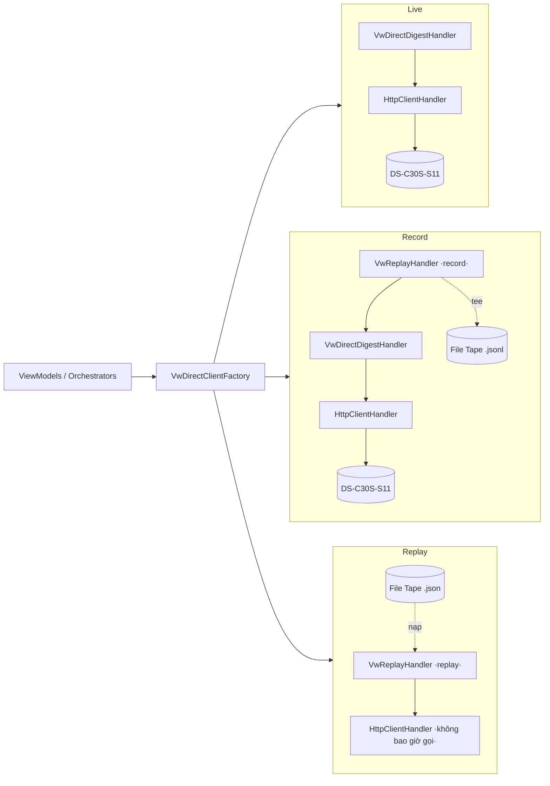

# VideoWall — Ghi / Phát lại (Record / Replay) cho công cụ WPF

> Tài liệu **gộp** (bối cảnh + thiết kế + runbook + phạm vi + kiểm thử). Nguồn: `videowall_plan.md`
> (19/08 + 25/08), `transcript-videowall-28082026.md` (28/08), datasheet
> `_source/DS-C30S-S11_Datasheet_20250324.md`, mã nguồn `Module.VideoWall.WPF`.
> Checklist đi test 2 ngày: [`videowall-test-2ngay.md`](videowall-test-2ngay.md).

---

# PHẦN A — Bối cảnh & quyết định

## A1. Bối cảnh một dòng

Đội mang công cụ **`Module.VideoWall.WPF`** + service sang khách hàng **TCB** (dự án Hữu Nghị –
Chi Lăng) kiểm thử trực tiếp trên bộ điều khiển tường ghép **Hikvision DS-C30S-S11** trong **2
ngày**, trên thiết bị khách **đang vận hành**, cam kết **không đụng phần cứng**.

## A2. Thiết bị & site

| Mục | Giá trị |
|---|---|
| Model | DS-C30S-S11 — 11-slot Video Wall Controller (Hikvision; ISAPI + Digest auth, HTTP/TCP) |
| Site TCB | **1 controller, 12 màn** (cách xếp lưới **chưa chốt** — xác nhận khi tới nơi) |
| Năng lực (datasheet) | 8 video wall · tối đa 40 màn/tường · chia ô 1/4/6/8/9/16 · layer/cổng 8×1080p hoặc 4×4K · 128 scene · 128 plan · trễ auto-switch 400 ms · 16 cửa sổ mở · trễ giải mã 50 ms (local) / 200 ms (network) |
| Kết nối | Digest auth, NAT, web client, keyboard mạng/serial, ONVIF |

## A3. Yêu cầu tiến triển qua từng buổi

- **19/08** (`videowall_plan.md`): làm **form/dịch vụ test luồng tích hợp** với thiết bị; thử split
  màn; xác định cơ chế điều khiển + giao thức. Giai đoạn 1 cho **cấu hình cứng**. Đề xuất kiểm thử
  qua TCP (chưa triển khai).
- **25/08**: công cụ **WPF** — đăng nhập; tham số controller/screen; cổng in/out; **cấu hình scene**
  (thêm/xoá/sửa/vị trí); lấy/activate scene; thời gian bật/tắt. **Log**:
  `giờ — thiết lập scene {} / Response OK / Fail {...}`. Scene setup: **output riêng rẽ** & **output
  chồng windows**.
- **28/08** (`transcript`): 2 bản plan (khách đơn giản / nội bộ kỹ thuật); 2 ngày trên thiết bị
  khách; backup trước / restore sau; **ghi mọi request/response ra file + chụp màn hình từng bước**;
  quy tắc **>1 giờ không xong → skip**; case cần có: scene không chồng / chồng / canh size 2 trigger
  / **sai tham số (thiết bị phải báo lỗi)** / mất kết nối; tổ chức lại UI (tab API + tab Kịch bản).

## A4. RÀNG BUỘC PHẠM VI — CHỈ 2 TẦNG: WPF ↔ THIẾT BỊ

Đợt này **chỉ đụng giao diện WPF và thiết bị**. Bỏ hết database, tầng service C# phía server,
**Backend mode** của công cụ.

| Bỏ qua đợt này | Vì sao |
|---|---|
| Backend mode (`VideoWallApiClient` → TAC_WebAPI) | Đi qua tầng service + DB |
| Tab **Lịch** (`ScheduleViewModel`) | Chạy hoàn toàn qua backend |
| "Bắn 2 trigger" (`ActivateSceneByEvent`) | Backend `VwEventRule` |
| Nhánh backend trong `SceneSetupViewModel` / `ScenarioViewModel` | Chỉ giữ **nhánh Direct** |
| `Module.VideoWall` / `Module.VideoWall.Core` (server) | Tầng service |

⇒ Đường duy nhất: **WPF → `VwDirectISAPIClient` (HTTP/ISAPI + Digest) → DS-C30S-S11**.

## A5. TCP vs HTTP — vì sao "kiểm thử qua TCP" CHƯA cần

- **TCP** = tầng vận chuyển: chỉ lo "byte tới nơi, đúng thứ tự, không mất". Không quy định nội dung
  byte → nói chuyện TCP thô thì 2 bên phải tự thoả thuận khung lệnh, keep-alive, cách báo OK/lỗi.
- **HTTP** = giao thức ứng dụng **chạy trên TCP**, đã định sẵn method / đường dẫn / header / body /
  mã trạng thái; mỗi request có đúng 1 response.
- **ISAPI của Hikvision = HTTP** (cổng 80, body XML/JSON, Digest auth). Công cụ WPF **đang** dùng
  HTTP/ISAPI — tức là đã đi trên TCP rồi. ⇒ "Kiểm thử qua TCP" chỉ cần khi gặp thiết bị có **cổng
  TCP thô riêng** + tài liệu bộ lệnh riêng. Hiện **không có nhu cầu đó**.

## A6. Ngoài phạm vi / hoãn lại

- **Nhiều controller ghép 1 tường** — site TCB chỉ 1 con/12 màn → **ghi chú "chưa test được", hoãn**.
- Genlock / đồng bộ thời gian giữa bộ hardware — do nhà thầu CT3, không đụng.
- Hình thật trên tường, chất lượng YUV444, trễ giải mã, băng thông 32×4K, hiệu năng viewer — chỉ
  **quan sát + chụp** tại chỗ.

---

# PHẦN B — Cơ chế & thiết kế

## B1. "Tape" là gì

Hình dung **máy ghi âm cassette**: bấm Record thu lại tiếng; bấm Play nghe lại đúng tiếng đã thu.
Ở đây "tiếng" = mỗi lần công cụ **hỏi** thiết bị và thiết bị **trả lời** (1 cặp HTTP request ↔ XML
response).

**Tape = 1 file `.json` chép lại TẤT CẢ các cặp hỏi–đáp đó** trong một buổi làm việc.

**Tape = log, chỉ khác cách dùng:**

| | Log ("Xuất log") | Tape |
|---|---|---|
| Nội dung | request + response từng bước | **giống hệt** |
| Mục đích | người **đọc lại** đối chiếu, phân tích lỗi | công cụ **nạp ngược vào** rồi "đóng vai thiết bị" |
| Định dạng | JSON | JSON (đọc thẳng file `videowall-log_*.json` ra tape được) |

Ẩn dụ: log = **biên bản** cuộc họp (đọc để nhớ). Tape = **băng ghi âm** cuộc họp (bật lại nghe y
như thật).

## B2. Ba chế độ (nút radio thanh Row 1)

| Chế độ | Hỏi ai | Trả lời từ đâu | Dùng khi |
|---|---|---|---|
| **Trực tiếp (Live)** | thiết bị thật | thiết bị thật | bình thường |
| **Ghi (Record)** | thiết bị thật | thiết bị thật **+ chép thêm vào file tape** | 2 ngày ở hiện trường |
| **Phát lại (Replay)** | *không có thiết bị* | **lấy từ file tape đã ghi** | về văn phòng, hết thiết bị |

## B3. Điểm chèn & chuỗi handler

Mọi lệnh tới thiết bị đi qua đúng một chỗ: `HttpClient.SendAsync` trong `VwDirectISAPIClient`.
`VwDirectClientFactory` dựng `HttpClient` với chuỗi handler khác nhau theo chế độ:



- **Record**: recorder đặt **ngoài** Digest → chỉ ghi lượt trao đổi cuối đã xác thực (một response
  `200` sạch), **không** ghi `401 challenge` của Digest.
- **Replay**: **không** có Digest, **không** gọi mạng. Tra tape theo khoá `METHOD + normalizedPath`
  (chuẩn hoá: trim `/`, ép tiền tố `ISAPI/`, GET bỏ query). Nhiều entry cùng khoá → con trỏ theo
  khoá: phục vụ tuần tự rồi **dính** entry cuối (hỗ trợ ảnh before/after). Không khớp → `404` +
  body `<!-- replay: no recording for … -->` + đẩy Activity mức **Warning** lên khung Log.

## B4. Định dạng tape & lưu trữ

- `VwTapeEntry` = `{ Seq, Method, Path, RequestBody?, StatusCode, ResponseBody, CapturedAtUtc, DurationMs }`.
- `VwTape` = `{ DeviceKey, CapturedAtUtc, Entries[] }`. Đọc được **cả 3 dạng**: JSON array (file
  `videowall-log_*.json` do "Xuất log" sinh), JSON object (`VwTape`), và JSONL (mỗi dòng 1 entry —
  dạng chế độ Ghi nối tiếp).
- Thư mục mặc định: `%LOCALAPPDATA%\Module.VideoWall.WPF\Tapes\`.
- **Tape mẫu** `Module.VideoWall.WPF/SampleData/sample-tape.json` (11 entry: userCheck /
  capabilities `maxSceneNums=128` `maxWindowNums=16` / 8 wall / outputs / input channels / windows
  trống→N / saveData / activate / delete / SID 999 lỗi) — để diễn tập trước chuyến đi & làm fixture
  cho test. Replay không chọn file → tự nạp tape mẫu này.

## B5. Critical files

| Việc | File |
|---|---|
| Lõi | `Module.VideoWall.WPF/Api/Direct/Replay/` — `VwDeviceIoMode`, `VwTapeEntry`, `VwTape`, `VwTapeStore`, `VwReplayHandler` |
| Factory | `Module.VideoWall.WPF/Api/Direct/VwDirectClientFactory.cs` |
| Chọn chế độ + nới guard | `ViewModels/ConnectionViewModel.cs` (`DeviceIoMode`, `TapePath`) |
| Dùng factory | `ViewModels/SceneSetupViewModel.cs`, `ViewModels/ScenarioViewModel.cs` |
| "Lưu thành tape" | `ViewModels/MainViewModel.cs` |
| UI Row 1 + chọn tape | `Views/MainWindow.xaml` (+ `.xaml.cs`) |
| Guardrail maxWindowNums | `Api/Direct/VwDirectSetupSceneOrchestrator.cs` |
| Tape mẫu | `SampleData/sample-tape.json` (+ `.csproj` CopyToOutputDirectory) |
| Test | `tests/Modules/VideoWall/Wpf/VwReplayHandlerTests.cs` |

---

# PHẦN C — Runbook vận hành

## C1. Tại hiện trường — chế độ Ghi (Record)

1. Mở `Module.VideoWall.WPF.exe`. Tại thanh Row 1: chọn radio **Ghi (Record)**.
2. Nhập IP / Port (`80`) / Account (`admin`) / Password thiết bị.
3. (Tuỳ chọn) chọn đường dẫn file tape ở ô **Bản ghi**. Để trống → tự lưu
   `%LOCALAPPDATA%\Module.VideoWall.WPF\Tapes\tape_rec_{yyyyMMdd_HHmmss}.jsonl`.
4. Làm test bình thường (Probe, thiết lập scene, chạy kịch bản…). Mọi cặp gửi/nhận tự vào tape.

**Quy ước đặt tên tape:** `tape_{yyyyMMdd}_{muc-dich}_{tinh-trang}.json`
- `tape_20260901_probetopology_ok.json` — capabilities, 8 wall, 12 output, input channels.
- `tape_20260901_scene_split4_ok.json` — luồng chia 4 cửa sổ trên Wall 1.
- `tape_20260901_error_sid999_exceedwindows.json` — response mã lỗi thật (SID sai / vượt số cửa sổ).

**Lưu nhanh từ Log:** đang ở chế độ Trực tiếp mà phát sinh luồng cần giữ → khung Log dưới màn hình
→ bấm **💾 Lưu thành tape** → file `VwTape` JSON trong thư mục Tapes.

## C2. Tại văn phòng — chế độ Phát lại (Replay)

1. Mở công cụ (không cần cắm mạng tới thiết bị). Chọn radio **Phát lại (Replay)**.
2. Banner vàng hiện: `⚠️ ĐANG PHÁT LẠI TỪ BẢN GHI — KHÔNG CHẠM THIẾT BỊ`. Nút "đẩy thật" / "Khôi
   phục mặc định" bị khoá.
3. Bấm **Chọn tape…** → file tape ghi từ hiện trường (hoặc để trống → dùng `sample-tape.json`).
4. Bấm **Probe** → nạp capabilities / 8 wall / outputs từ tape, không bắn gói tin ra mạng.
5. Sang các tab: **1–11** gửi thử lệnh ISAPI xem dữ liệu & form; **12** kiểm tra thuật toán chia
   lưới / guardrail; **13** bấm **Chạy kịch bản** hoặc **Chạy tiếp từ bước lỗi** cho luồng nhiều bước.

---

# PHẦN D — Phạm vi test: offline (Replay) vs bắt buộc tại chỗ

| # | Nghiệp vụ / tính năng | Offline qua Replay | Bắt buộc tại chỗ | Ghi chú |
|:-:|---|:-:|:-:|---|
| 1 | Bắt tay Digest Auth 401 Challenge | ❌ | ✅ | Replay bỏ qua digest challenge thật |
| 2 | Đọc Capabilities / danh sách VideoWall / Outputs / Inputs | ✅ | ❌ | Trích từ tape chính xác 100% |
| 3 | Giải thuật chia lưới bố cục cửa sổ (toạ độ pixel) | ✅ | ❌ | Tính client-side |
| 4 | Guardrail: lưới quá lớn / >16 cửa sổ / SID > 128 | ✅ | ❌ | Orchestrator chặn trước khi gửi |
| 5 | Luồng chạy kịch bản nhiều bước & "Chạy tiếp từ bước lỗi" | ✅ | ❌ | State machine + con trỏ step |
| 6 | Đồ hoạ thực tế trên tấm LED/LCD | ❌ | ✅ | Cần mắt người quan sát |
| 7 | Độ trễ giải mã video (50 ms / 200 ms) | ❌ | ✅ | Phụ thuộc RTSP + DSP phần cứng |
| 8 | Băng thông 32×4K & đồng bộ Genlock | ❌ | ✅ | Phụ thuộc card giải mã |
| 9 | Xử lý mã lỗi HTTP 400/404/500 + XML status Hikvision | ✅ | ❌ | Replay trả canned error (đã ghi) |
| 10 | Nhiều controller ghép 1 tường | ❌ | ✅ (hoãn) | Site TCB chỉ 1 controller |

---

# PHẦN E — Kiểm thử tự động (xUnit)

File: `tests/Modules/VideoWall/Wpf/VwReplayHandlerTests.cs` (tích hợp `tests/test.csproj`).

```powershell
dotnet test tests/test.csproj -f net10.0-windows --filter "FullyQualifiedName~VwReplayHandlerTests"
dotnet test tests/test.csproj -f net10.0-windows --filter "FullyQualifiedName~Tests.Modules.VideoWall.Wpf"
```

| Test | Kiểm |
|---|---|
| `ReplayMode_Probe_ReadsTopologyFromSampleTape` | Probe đọc đủ 128 scene / 16 window / 8 wall / ≥12 output từ tape mẫu |
| `ReplayMode_AddWindow_SucceedsViaTape` | Lệnh thêm cửa sổ qua Replay trả XML đúng + HTTP 200 |
| `ReplayMode_MissingEntry_Returns404AndLogsWarning` | Endpoint không có trong tape → 404 + Activity Warning |
| `ReplayMode_Orchestrator_Guardrail_ExceedingMaxWindows_BlockedBeforeSend` | >16 cửa sổ → chặn trước khi gửi |
| `TapeStore_AppendAndLoad_WorksWithJsonAndExportLog` | Đọc/ghi JSON, JSONL, và file "Xuất log" |
