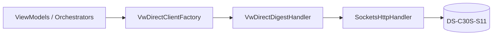

# VideoWall — Chế độ Trực tiếp (Live) + Tự động ghi Log + Kịch bản cho công cụ WPF

> Tài liệu tổng hợp (bối cảnh + thiết kế + runbook + phạm vi). Nguồn: `videowall_plan.md`
> (19/08 + 25/08), `transcript-videowall-28082026.md` (28/08), datasheet
> `_source/DS-C30S-S11_Datasheet_20250324.md`, mã nguồn `Module.VideoWall.WPF`.
> Checklist đi test 2 ngày: [`videowall-test-2ngay.md`](videowall-test-2ngay.md).

---

# PHẦN A — Bối cảnh & quyết định

## A1. Bối cảnh một dòng

Đội mang công cụ **`Module.VideoWall.WPF`** sang khách hàng **TCB** (dự án Hữu Nghị – Chi Lăng) kiểm thử trực tiếp trên bộ điều khiển tường ghép **Hikvision DS-C30S-S11** trong **2 ngày**, trên thiết bị khách **đang vận hành**, cam kết **không đụng phần cứng**.

## A2. Thiết bị & site

| Mục | Giá trị |
|---|---|
| Model | DS-C30S-S11 — 11-slot Video Wall Controller (Hikvision; ISAPI + Digest auth, HTTP/TCP) |
| Site TCB | **1 controller, 12 màn** (cách xếp lưới xác nhận khi tới nơi) |
| Năng lực (datasheet) | 8 video wall · tối đa 40 màn/tường · chia ô 1/4/6/8/9/16 · layer/cổng 8×1080p hoặc 4×4K · 128 scene · 128 plan · trễ auto-switch 400 ms · 16 cửa sổ mở · trễ giải mã 50 ms (local) / 200 ms (network) |
| Kết nối | Digest auth, NAT, web client, keyboard mạng/serial, ONVIF |

## A3. PHẠM VI — CHỈ 2 TẦNG: WPF ↔ THIẾT BỊ (đã áp dụng trong code, không còn là kỷ luật tự giác)

Ban đầu đây là quyết định phạm vi cho đợt test; giờ **đã sửa thẳng trong code** — Backend Mode không còn tồn tại như một lựa chọn nữa, không phải "cố tránh đụng" mà là **đã bị gỡ khỏi các ViewModel đang dùng**.

| Đã gỡ khỏi code | Hiện trạng |
|---|---|
| Backend mode / toggle Direct-Backend | `ConnectionViewModel.IsDirectMode` giờ là `=> true` cố định; `Controllers`/`SelectedController`/`LoadControllers` đã xoá |
| `VwBackendDeviceConnectionClient.cs` | Đã xoá file |
| `VwDeviceDefaultCaptureOrchestrator.cs` & `VwDeviceDefaultRestoreOrchestrator.cs` & `VwDeviceDefaultStore.cs` | Đã xoá sạch 3 file (bỏ hẳn tính năng "Chụp lại mặc định" / "Khôi phục mặc định" trên UI và code, dùng backup web của controller) |
| Nút "Nạp lại kết nối" (`ReloadAppCommand`) | Đã xoá sạch khỏi UI và ViewModel |
| `VideoWallApiClient` trong Tab 1/Tab 2 | Đã thay bằng `VwLocalSceneStore`/`VwLocalScreenStore` (JSON local) + `ProbeResult.InputChannels` cho nguồn tín hiệu |
| Tab **Lịch** (`ScheduleViewModel`) | Vẫn orphan, chưa từng gắn vào MainWindow — không đổi |
| "Bắn 2 trigger" (`ActivateSceneByEvent`) / "So khớp ưu tiên VwEventRule" | Đã xoá hẳn khỏi UI và ViewModel (không chỉ né, mà không còn tồn tại) |
| `VideoWallApiClient.cs` | Vẫn còn file (do `ScheduleViewModel` orphan còn phụ thuộc), nhưng không route nào đang dùng của Tab 1/2 gọi tới nữa |

⇒ Đường duy nhất: **WPF → `VwDirectISAPIClient` (HTTP/ISAPI + Digest) → DS-C30S-S11**.

---

# PHẦN B — Cơ chế & thiết kế

## B1. Tự động ghi Log liên tục ra file (Auto Session Logging)

- Mọi thao tác gửi/nhận lệnh HTTP/ISAPI và sự kiện trong phiên làm việc đều được **tự động ghi nối tiếp (append)** ngay lập tức ra file JSON Lines (`.jsonl`).
- Đường dẫn file tự động sinh theo phiên:
  `%LOCALAPPDATA%\Module.VideoWall.WPF\Logs\session_{yyyyMMdd_HHmmss}.jsonl`
- Cấu trúc mỗi dòng JSON:
  `{ Time, Stage, Level, Detail, Method, Endpoint, HttpStatus, RequestXml, ResponseXml }`
- Nút **"Xuất log"** trên giao diện vẫn được giữ nguyên để xuất snapshot gộp khi cần lưu nhanh ra file `.json` tuỳ chọn.

## B2. Chuỗi Handler kết nối trực tiếp (Live Mode)

Mọi lệnh tới thiết bị đi qua `VwDirectISAPIClient` với chuỗi handler chuẩn:

(`SocketsHttpHandler` — nâng cấp từ `HttpClientHandler` cũ, tự tune connection pool 15s/idle 5s, connect timeout 10s, để đỡ lỗi mất kết nối keep-alive khi thiết bị đóng socket giữa chừng.)

- Xác thực Digest Auth tự động thực hiện trên từng request gửi tới thiết bị.
- Guardrail `maxWindowNums` và `maxSceneNums` trong `VwDirectSetupSceneOrchestrator` bảo vệ tường ghép không bị đẩy vượt quá số lượng cửa sổ/kịch bản hỗ trợ.

## B3. Cấu trúc Layout & Khung Response Động

- **Tab 1 (Thiết lập Scene)** & **Tab 2 (Kịch bản)**: Khung Response và thanh kéo phụ tự động ẩn (`Height = 0`), nhường toàn bộ diện tích cho thiết lập và kịch bản.
- **Tab 3..13 (11 Nhóm ISAPI)**: Khung Response rộng toàn màn hình tự động hiển thị bên dưới TabControl (giữa TabControl và Bảng Logs) với thanh kéo dãn `GridSplitter` riêng.
- **Thanh GridSplitter chính**: Luôn kéo dãn giữa Khung Workspace (TabControl + Response) và Bảng Logs hoạt động mượt mà, không sinh mảng trắng.

---

# PHẦN C — Runbook vận hành & Kịch bản

## C1. Tại hiện trường

1. Mở `Module.VideoWall.WPF.exe`.
2. Nhập IP / Port (`80`) / Account (`admin`) / Password thiết bị tại thanh kết nối trên cùng (Row 0).
3. Bấm **Ping** để xác nhận kết nối và Digest Auth.
4. Bấm **Probe** để khảo sát giới hạn phần cứng (capabilities, danh sách tường, cổng ra, cổng vào). Đây là bước bắt buộc trước khi nạp dữ liệu ở Tab 1.
5. Thực hiện các bài test:
   - **Tab 1 "Thiết lập Scene"**: Bấm *"🔄 Nạp màn hình & nguồn"* (Nguồn lấy từ Probe, Màn hình & Scene nạp/lưu local JSON) → Gán màn hình theo Output → Dựng scene → Đẩy xuống thiết bị (`DryRun` hoặc đẩy thật).
   - **Tab 2 "Kịch bản"**: Tự động hoá chuỗi API, kiểm thử tranh vùng, bộ kiểm thử lỗi (có công tắc *"Gửi thật để xem mã lỗi thiết bị"*).
   - **Tab 3–13**: 11 nhóm ISAPI direct, xem phản hồi XML/JSON tức thời ở khung Response.
6. Mọi bước gửi/nhận đều tự động lưu vào file log `%LOCALAPPDATA%\Module.VideoWall.WPF\Logs\session_*.jsonl`.

## C2. Tab Kịch bản (Scenario)

- Hỗ trợ xây dựng và lưu các chuỗi gọi nhiều API liên tiếp theo thứ tự có định cấu hình thời gian chờ (`DelayBetweenStepsMs`, mặc định 400ms theo datasheet).
- Tính năng **Chạy tiếp từ bước #N (Resume)** tự động khôi phục luồng tại bước gặp lỗi kết nối/timeout mà không phải chạy lại từ đầu.
- Bộ kiểm thử lỗi tích hợp công tắc **"Gửi thật để xem mã lỗi thiết bị"** giúp linh hoạt giữa 2 chế độ: Chặn sớm an toàn bằng Probe hoặc gửi thật để ghi nhận mã lỗi thực tế của phần cứng.
