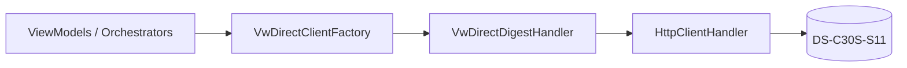

# VideoWall — Chế độ Trực tiếp (Live) + Tự động ghi Log + Kịch bản cho công cụ WPF

> Tài liệu tổng hợp (bối cảnh + thiết kế + runbook + phạm vi). Nguồn: `videowall_plan.md`
> (19/08 + 25/08), `transcript-videowall-28082026.md` (28/08), datasheet
> `_source/DS-C30S-S11_Datasheet_20250324.md`, mã nguồn `Module.VideoWall.WPF`.
> Checklist đi test 2 ngày: [`videowall-test-2ngay.md`](videowall-test-2ngay.md).

---

# PHẦN A — Bối cảnh & quyết định

## A1. Bối cảnh một dòng

Đội mang công cụ **`Module.VideoWall.WPF`** sang khách hàng **TCB** (dự án Hữu Nghị – Chi Lăng) kiểm thử trực tiếp trên bộ điều khiển tường ghép **Hikvision DS-C30S-S11** trong **2 ngày**, trên thiết bị khách **đang vận hành**, cam kết **không đụng phần cứng**.

## A2. Thiết bị & site

| Mục | Giá trị |
|---|---|
| Model | DS-C30S-S11 — 11-slot Video Wall Controller (Hikvision; ISAPI + Digest auth, HTTP/TCP) |
| Site TCB | **1 controller, 12 màn** (cách xếp lưới xác nhận khi tới nơi) |
| Năng lực (datasheet) | 8 video wall · tối đa 40 màn/tường · chia ô 1/4/6/8/9/16 · layer/cổng 8×1080p hoặc 4×4K · 128 scene · 128 plan · trễ auto-switch 400 ms · 16 cửa sổ mở · trễ giải mã 50 ms (local) / 200 ms (network) |
| Kết nối | Digest auth, NAT, web client, keyboard mạng/serial, ONVIF |

## A3. RÀNG BUỘC PHẠM VI — CHỈ 2 TẦNG: WPF ↔ THIẾT BỊ

Đợt này **chỉ đụng giao diện WPF và thiết bị**. Bỏ hết database, tầng service C# phía server, Backend mode của công cụ.

| Bỏ qua đợt này | Vì sao |
|---|---|
| Backend mode (`VideoWallApiClient` → TAC_WebAPI) | Đi qua tầng service + DB |
| Tab **Lịch** (`ScheduleViewModel`) | Chạy hoàn toàn qua backend |
| "Bắn 2 trigger" (`ActivateSceneByEvent`) | Backend `VwEventRule` |
| `Module.VideoWall` / `Module.VideoWall.Core` (server) | Tầng service |

⇒ Đường duy nhất: **WPF → `VwDirectISAPIClient` (HTTP/ISAPI + Digest) → DS-C30S-S11**.

---

# PHẦN B — Cơ chế & thiết kế

## B1. Tự động ghi Log liên tục ra file (Auto Session Logging)

- Mọi thao tác gửi/nhận lệnh HTTP/ISAPI và sự kiện trong phiên làm việc đều được **tự động ghi nối tiếp (append)** ngay lập tức ra file JSON Lines (`.jsonl`).
- Đường dẫn file tự động sinh theo phiên:
  `%LOCALAPPDATA%\Module.VideoWall.WPF\Logs\session_{yyyyMMdd_HHmmss}.jsonl`
- Cấu trúc mỗi dòng JSON:
  `{ Time, Stage, Level, Detail, Method, Endpoint, HttpStatus, RequestXml, ResponseXml }`
- Nút **"Xuất log"** trên giao diện vẫn được giữ nguyên để xuất snapshot gộp khi cần lưu nhanh ra file `.json` tuỳ chọn.

## B2. Chuỗi Handler kết nối trực tiếp (Live Mode)

Mọi lệnh tới thiết bị đi qua `VwDirectISAPIClient` với chuỗi handler chuẩn:

- Xác thực Digest Auth tự động thực hiện trên từng request gửi tới thiết bị.
- Guardrail `maxWindowNums` trong `VwDirectSetupSceneOrchestrator` bảo vệ tường ghép không bị đẩy vượt quá số lượng cửa sổ hỗ trợ.

---

# PHẦN C — Runbook vận hành & Kịch bản

## C1. Tại hiện trường

1. Mở `Module.VideoWall.WPF.exe`.
2. Nhập IP / Port (`80`) / Account (`admin`) / Password thiết bị tại thanh kết nối trên cùng.
3. Bấm **Ping** để xác nhận kết nối và Digest Auth.
4. Thực hiện các bài test (Tab 1–11 ISAPI direct, Tab 12 Dựng cửa sổ/Scene, Tab 13 Kịch bản).
5. Mọi bước gửi/nhận đều tự động lưu vào file log `%LOCALAPPDATA%\Module.VideoWall.WPF\Logs\session_*.jsonl`.

## C2. Tab Kịch bản (Scenario)

- Hỗ trợ xây dựng và lưu các chuỗi gọi nhiều API liên tiếp theo thứ tự có định cấu hình thời gian chờ (`DelayBetweenStepsMs`, mặc định 400ms theo datasheet).
- Tính năng **Chạy tiếp từ bước N (Resume)** tự động khôi phục luồng tại bước gặp lỗi kết nối/timeout mà không phải chạy lại từ đầu.
