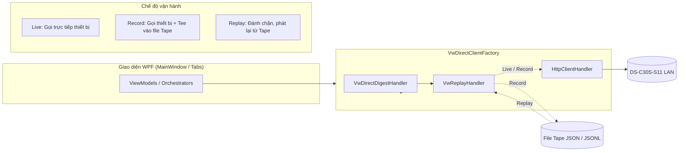

# Sổ tay vận hành (Runbook) — Ghi / Phát lại (Record / Replay) VideoWall

Tài liệu hướng dẫn kỹ sư hiện trường và đội ngũ phát triển sử dụng cơ chế **Ghi / Phát lại (Record / Replay)** cho công cụ `Module.VideoWall.WPF`.

---

## 1. Tổng quan cơ chế

Cơ chế Record/Replay giải quyết bài toán kiểm thử thiết bị phần cứng Hikvision DS-C30S-S11 khi kỹ sư rời khỏi hiện trường:
- **Chế độ Ghi (Record)**: Gửi request trực tiếp đến thiết bị thật qua mạng LAN, đồng thời tự động ghi chép (tee) toàn bộ cặp `Request ↔ Response` (bao gồm headers, XML body, status code, latency) ra file tape `.json` / `.jsonl`.
- **Chế độ Phát lại (Replay)**: Ngắt hoàn toàn kết nối socket vật lý. Mọi lệnh ISAPI từ WPF được `VwReplayHandler` đánh chặn và trả về response tương ứng từ bản ghi theo cơ chế so khớp `METHOD + normalizedPath`.



---

## 2. Hướng dẫn tại hiện trường (Chế độ Ghi - Record)

### 2.1. Bật chế độ Ghi
1. Mở ứng dụng `Module.VideoWall.WPF.exe`.
2. Tại thanh điều khiển trên cùng (Row 1):
   - Chọn Radio Button: **🔴 Ghi (Record)**.
   - Nhập thông tin kết nối thiết bị: IP (`192.168.1.x`), Port (`80`), Username (`admin`), Password.
   - (Tùy chọn) Chọn đường dẫn file tape muốn ghi nối tiếp tại ô **Đường dẫn Tape**. Nếu để trống, hệ thống tự động lưu vào `%LOCALAPPDATA%\Module.VideoWall.WPF\Tapes\tape_{yyyyMMdd_HHmmss}.jsonl`.

### 2.2. Quy ước đặt tên Tape
Nên đặt tên file tape rõ ràng theo cú pháp:
`tape_{yyyyMMdd}_{muc-dich-kiem-thu}_{tinh-trang}.json`

**Ví dụ:**
- `tape_20260901_probetopology_normal.json` — Thu thập capabilities, layout 8 wall, danh sách 12 outputs, input channels.
- `tape_20260901_pushscene_split_4windows.json` — Thu thập luồng bố cục chia 4 cửa sổ trên Wall 1.
- `tape_20260901_error_sid999_exceedwindows.json` — Thu thập các response mã lỗi thực tế từ thiết bị khi truyền SID sai hoặc vượt số cửa sổ.

### 2.3. Xuất Tape nhanh từ Activity Log
Nếu đang chạy ở chế độ **Live** mà phát sinh luồng cần lưu lại:
1. Nhìn xuống khung **Nhật ký tương tác (Activity Log)** ở góc dưới màn hình.
2. Bấm nút **💾 Lưu thành tape**.
3. File tape dạng JSON chuẩn `VwTape` sẽ được tạo ngay lập tức trong thư mục `%LOCALAPPDATA%\Module.VideoWall.WPF\Tapes\`.

---

## 3. Hướng dẫn tại văn phòng (Chế độ Phát lại - Replay)

### 3.1. Kích hoạt Phát lại
1. Mở ứng dụng `Module.VideoWall.WPF.exe` (không cần cắm dây mạng tới thiết bị).
2. Tại thanh điều khiển (Row 1):
   - Chọn Radio Button: **▶️ Phát lại (Replay)**.
   - Banner cảnh báo màu vàng sẽ hiển thị: `⚠️ ĐANG PHÁT LẠI TỪ BẢN GHI — KHÔNG CHẠM THIẾT BỊ`.
   - Bấm **Chọn tape…** để chọn file tape đã ghi từ hiện trường (hoặc để trống để ứng dụng tự nạp `SampleData/sample-tape.json` mặc định).
3. Bấm **Dò thông số (Probe)**:
   - Hệ thống tự nạp capabilities (`MaxSceneNums = 128`, `MaxWindowNums = 16`, danh sách 8 Wall, 12 Outputs) từ file tape mà không bắn gói tin ra mạng.
4. Chuyển sang các tab chức năng:
   - **Tab 1..11 (Tập lệnh ISAPI)**: Gửi thử các lệnh GET / PUT / POST để kiểm tra dữ liệu và form mapping.
   - **Tab 12 (Bố cục & Khởi tạo Scene)**: Kiểm tra thuật toán chia lưới, tính toán toạ độ pixel, kiểm tra guardrail trước khi đẩy.
   - **Tab 13 (Kịch bản điều khiển)**: Bấm **▶️ Chạy kịch bản** hoặc **Chạy tiếp từ bước lỗi** để kiểm tra trọn vẹn luồng tương tác nhiều bước.

---

## 4. Bảng phạm vi kiểm thử (Offline vs. Bắt buộc tại chỗ)

| STT | Nghiệp vụ / Tính năng kiểm thử | Kiểm thử Offline qua Replay | Bắt buộc kiểm thử tại chỗ | Ghi chú kỹ thuật |
|:---:|:---|:---:|:---:|:---|
| 1 | Bắt tay xác thực Digest Auth 401 Challenge | ❌ | ✅ | Replay bỏ qua digest challenge thực tế |
| 2 | Đọc Capabilities, danh sách VideoWall, Outputs, Inputs | ✅ | ❌ | Trích xuất từ tape chuẩn xác 100% |
| 3 | Giải thuật chia lưới bố cục cửa sổ (Grid Layout) | ✅ | ❌ | Kiểm tra toạ độ pixel toạ độ thực tế |
| 4 | Guardrail: Chặn lưới quá lớn / Quá 16 cửa sổ / SID > 128 | ✅ | ❌ | Orchestrator chặn trước khi gửi |
| 5 | Luồng chạy kịch bản nhiều bước & Resume từ bước lỗi | ✅ | ❌ | Kiểm tra state machine và con trỏ step |
| 6 | Đồ hoạ thực tế trên tấm màn LED/LCD | ❌ | ✅ | Cần mắt người quan sát hiển thị vật lý |
| 7 | Độ trễ giải mã tín hiệu video (50ms / 200ms) | ❌ | ✅ | Phụ thuộc luồng RTSP và phần cứng DSP |
| 8 | Băng thông luồng mạng 32×4K & Đồng bộ Genlock | ❌ | ✅ | Phụ thuộc card giải mã phần cứng |
| 9 | Xử lý mã lỗi HTTP 400/404/500 và XML status Hikvision | ✅ | ❌ | Replay trả về canned error response |
| 10 | Đổi cấu hình nhiều thiết bị controller cùng lúc | ❌ | ✅ | Cần mạng vật lý kết nối nhiều controller |

---

## 5. Kiểm thử tự động với xUnit Test Harness

Bộ kiểm thử tự động cho cơ chế Record/Replay được định nghĩa tại `tests/Modules/VideoWall/Wpf/VwReplayHandlerTests.cs` và tích hợp vào test suite của dự án.

### Chạy kiểm thử tự động
```powershell
# Chạy riêng bộ kiểm thử Replay Handler
dotnet test tests/test.csproj -f net10.0-windows --filter "FullyQualifiedName~VwReplayHandlerTests"

# Chạy toàn bộ kiểm thử WPF
dotnet test tests/test.csproj -f net10.0-windows --filter "FullyQualifiedName~Tests.Modules.VideoWall.Wpf"
```

### Các kịch bản test đã tự động hoá
1. `ReplayMode_Probe_ReadsTopologyFromSampleTape`: Kiểm tra `Probe` đọc đủ 128 scenes, 16 windows, 8 walls, 12 outputs từ `sample-tape.json`.
2. `ReplayMode_AddWindow_SucceedsViaTape`: Kiểm tra lệnh thêm cửa sổ qua Replay handler trả về đúng mã XML và HTTP 200.
3. `ReplayMode_MissingEntry_Returns404AndLogsWarning`: Kiểm tra khi gọi endpoint không có trong tape, handler trả về 404 và bắn cảnh báo `ActivityNotification` (Warning) lên UI.
4. `ReplayMode_Orchestrator_Guardrail_ExceedingMaxWindows_BlockedBeforeSend`: Kiểm tra guardrail ngăn chặn việc thêm quá 16 cửa sổ trước khi gửi request tới thiết bị.
5. `TapeStore_AppendAndLoad_WorksWithJsonAndExportLog`: Kiểm tra khả năng tương thích đọc/ghi của `VwTapeStore` với file JSON, JSONL và file log xuất từ `ExportLog`.
