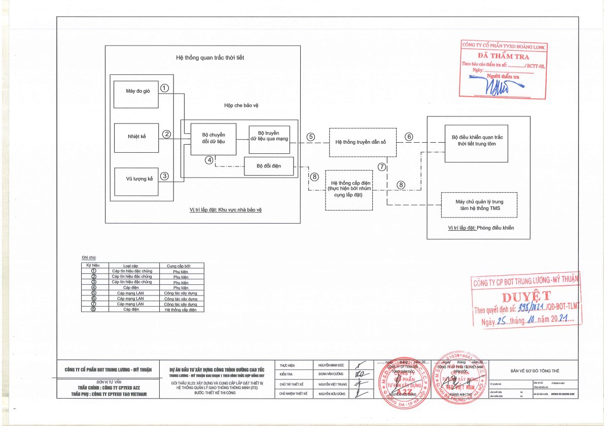
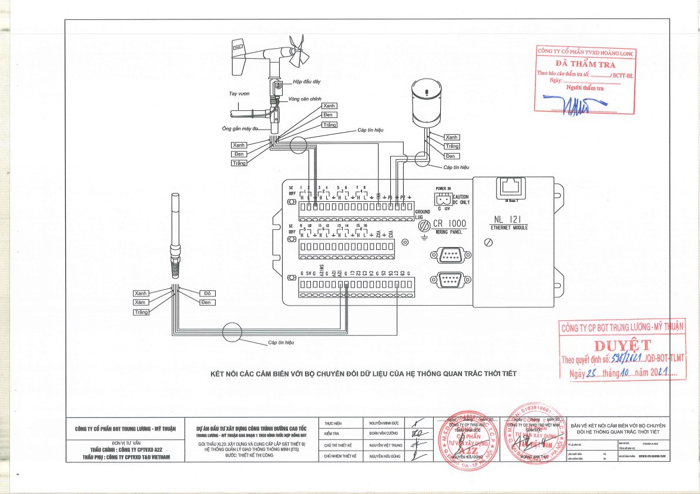
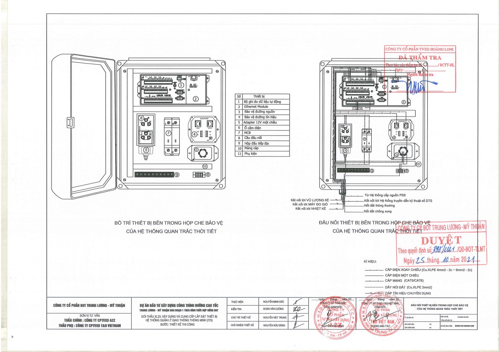
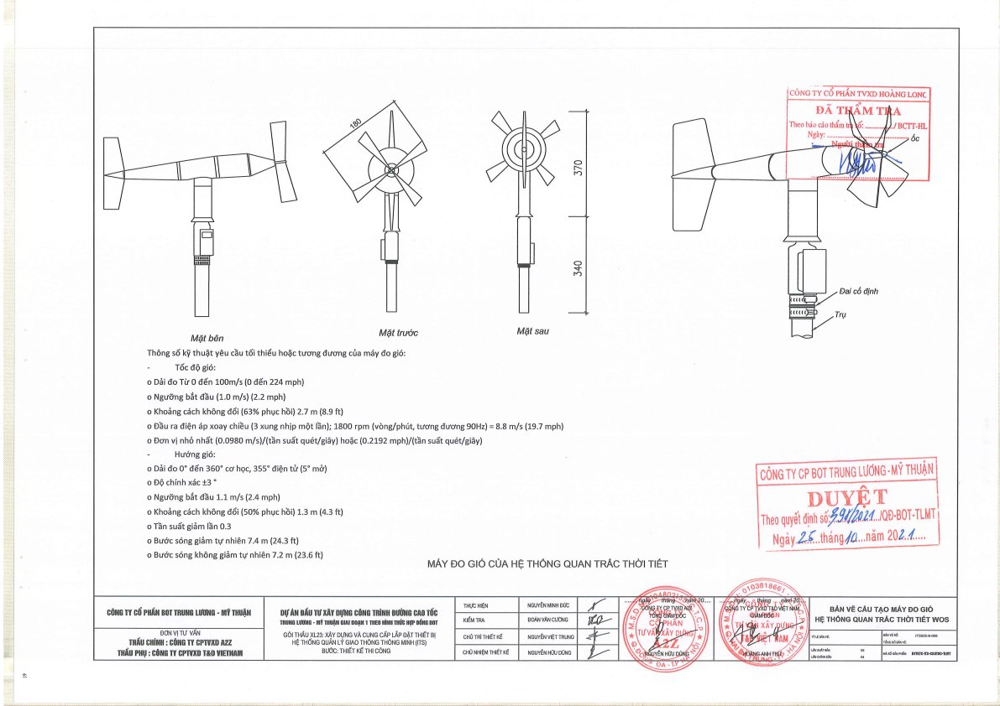
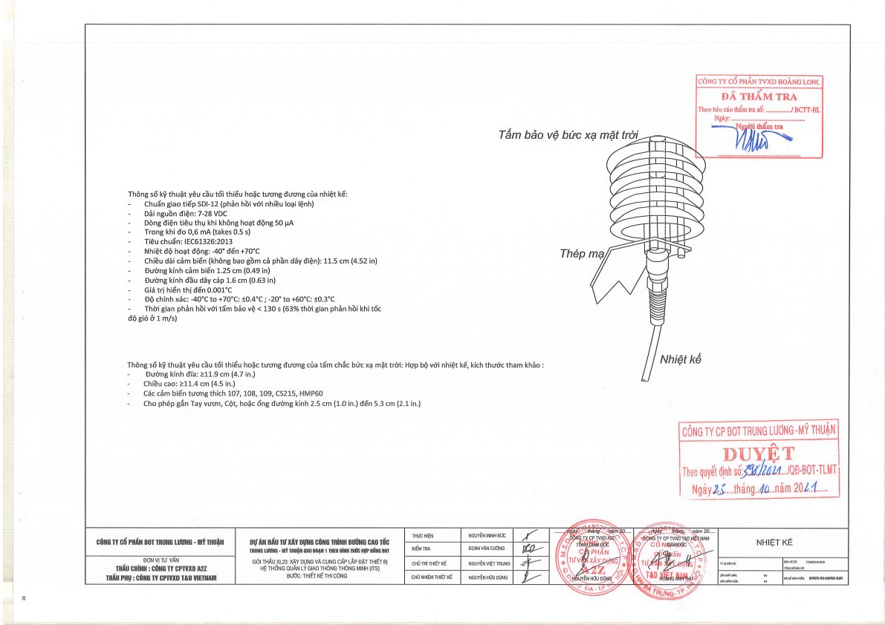
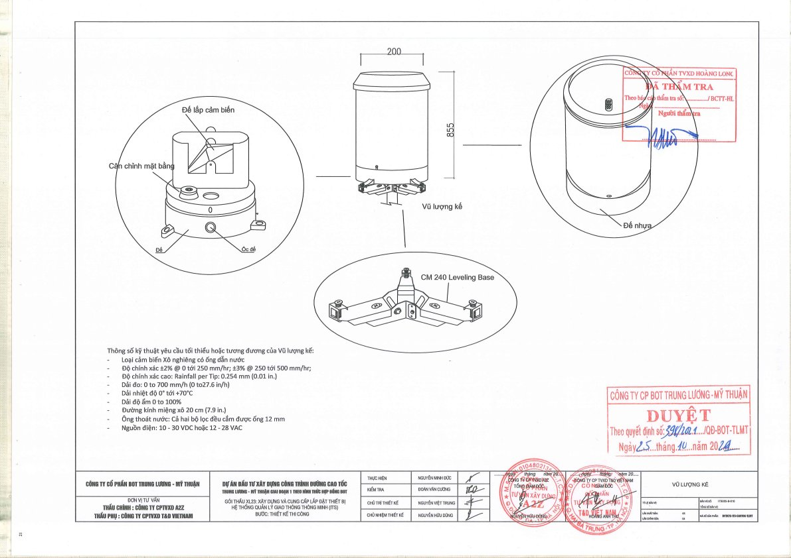

# Hồ Sơ Thiết Kế Bản Vẽ Thi Công (BVTKTC) Hệ Thống Quan Trắc Thời Tiết (WOS)
**Quyển III.5: Thiết Kế Bản Vẽ Thi Công Hệ Thống WOS — Gói Thầu XL23**

---

## 1. Tổng Quan Hồ Sơ Thiết Kế

Hồ sơ Bản vẽ thi công (BVTKTC) hệ thống Quan trắc thời tiết (WOS - Weather Observation System) thuộc gói thầu XL23 được phê duyệt chính thức theo Quyết định số **398/2021/QĐ-BOT-TLMT** ngày 25/10/2021 của Công ty Cổ phần BOT Trung Lương - Mỹ Thuận và đã qua thẩm tra kỹ thuật bởi Công ty Cổ phần TVXD Hoàng Long.

- **Mục tiêu hệ thống**: Thu thập tự động các dữ liệu khí tượng thời tiết ngoài hiện trường (tốc độ và hướng gió, lượng mưa, nhiệt độ không khí, độ ẩm tương đối), truyền dẫn liên tục thời gian thực về Trung tâm điều hành giao thông (TMC) nhằm phục vụ quản lý, cảnh báo an toàn giao thông trên tuyến cao tốc.
- **Số lượng trạm**: 03 trạm quan trắc thời tiết ngoài tuyến tại các vị trí nút giao trọng điểm:
  1. Nút giao Thân Cửu Nghĩa (Km 49+950)
  2. Nút giao Cái Bè (Km 83+000)
  3. Nút giao An Thái Trung (Km 103+000)
- **Thiết bị điều khiển trung tâm**: Đặt tại phòng máy chủ Trung tâm quản lý điều hành giao thông (TMC).

---

## 2. Danh Mục 25 Bản Vẽ Thiết Kế Thi Công WOS

Toàn bộ tập bản vẽ thi công hệ thống WOS gồm 25 bản vẽ kỹ thuật được chia thành 3 nhóm:

| STT | Mã Bản Vẽ | Tên / Mô Tả Bản Vẽ | Nội Dung Kỹ Thuật Chính |
|:---:|:---|:---|:---|
| **A** | **BẢN VẼ TỔNG QUÁT** | | |
| 1 | `ITS005-A-001` | Bản vẽ sơ đồ tổng thể | Kiến trúc mạng truyền dẫn từ cảm biến ngoài hiện trường đến TMC |
| 2 | `ITS005-A-002` | Bản vẽ kết nối cảm biến với bộ chuyển đổi hệ thống WOS | Chi tiết đấu nối từng chân tín hiệu cảm biến vào CR1000X |
| 3 | `ITS005-A-003` | Sơ đồ dây cáp hệ thống WOS tại TTQLĐHGT (TMC) | Kết nối máy chủ WOS, cáp LAN DTS, KVM Switch tại trung tâm |
| 4 | `ITS005-A-004` | Sơ đồ dây cáp hệ thống WOS tại trạm thu phí Cái Bè | Đấu nối cáp nguồn PSS và cáp truyền dẫn DTS tại trạm Cái Bè |
| 5 | `ITS005-A-005` | Sơ đồ dây cáp hệ thống WOS tại trạm thu phí cuối tuyến | Đấu nối cáp nguồn và truyền dẫn tại trạm thu phí cuối tuyến |
| **B** | **BẢN VẼ THIẾT BỊ** | | |
| 6 | `ITS005-B-001` | Bản vẽ hộp che bảo vệ của hệ thống WOS | Kích thước hình học vỏ tủ ngoài trời IP65 (406 x 356 x 140 mm) |
| 7 | `ITS005-B-002` | Đấu nối thiết bị bên trong hộp che bảo vệ | Bố trí CR1000X, NL121, SPD nguồn/tín hiệu, MCB, adapter 12V |
| 8 | `ITS005-B-003` | Bộ ghi đo tự động dữ liệu quan trắc | Thông số chi tiết Campbell Scientific CR1000X Datalogger |
| 9 | `ITS005-B-004` | Thiết bị điều khiển trạm quan trắc thời tiết | Thông số máy tính công nghiệp IPC Advantech ACP-2010MB-35D |
| 10 | `ITS005-B-005` | Thông số kỹ thuật Switch Layer 2 | Thiết bị chuyển mạch Layer 2 tích hợp (dùng chung VMS/CCTV) |
| 11 | `ITS005-B-006` | Thông số kỹ thuật bộ KVM và Tủ rack Server | KVM console 17.3" Full HD và tủ rack 42U tại TMC |
| 12 | `ITS005-B-007` | Bản vẽ cấu tạo máy đo gió hệ thống WOS | Cấu tạo & thông số cảm biến đo gió RM Young 05103-PT-L5m |
| 13 | `ITS005-B-008` | Nhiệt kế (Cảm biến nhiệt độ - độ ẩm) | Cảm biến HygroVUE5 kèm tấm chắn bức xạ RAD06 |
| 14 | `ITS005-B-009` | Vũ lượng kế (Cảm biến đo mưa) | Cảm biến xô nghiêng TB4-PT-L10m kèm bệ cân chỉnh CM240 |
| 15 | `ITS005-B-010` | Danh sách thiết bị của hệ thống WOS | Bảng tổng hợp khối lượng thiết bị, phần mềm toàn hệ thống |
| **C** | **BẢN VẼ LẮP ĐẶT** | | |
| 16 | `ITS005-C-001` | Vị trí lắp đặt WOS tại nút giao An Thái Trung | Bình đồ định vị vị trí trụ WOS nút An Thái Trung (Km 103+000) |
| 17 | `ITS005-C-001A` | Vị trí lắp đặt WOS tại nút giao Cái Bè | Bình đồ định vị vị trí trụ WOS nút Cái Bè (Km 83+000) |
| 18 | `ITS005-C-002` | Mặt đứng trụ quan trắc tại nút giao Thân Cửu Nghĩa | Chi tiết mặt đứng cột thép cao 10m và cao độ gắn thiết bị |
| 19 | `ITS005-C-003` | Bản vẽ lắp đặt hộp bảo vệ lên trụ quan trắc | Chi tiết giá treo và bulong ôm cố định tủ IP65 vào thân trụ |
| 20 | `ITS005-C-004` | Chi tiết Modun 1, Modun 2 | Kích thước 2 đoạn ống thép tròn côn mạ kẽm (5.5m + 4.5m) |
| 21 | `ITS005-C-005` | Chi tiết liên kết trụ quan trắc thời tiết | Chi tiết bản mã chân cột, bích liên kết 2 modun, sườn tăng cường |
| 22 | `ITS005-C-006` | Chi tiết mặt bằng móng | Kích thước đào móng bê tông M250, vị trí bulong neo M24 |
| 23 | `ITS005-C-007` | Bảng thống kê cốt thép cho 1 trụ WOS | Khối lượng thép phi 10, phi 16, phi 20, bu lông neo |
| 24 | `ITS005-C-008` | Bố trí thiết bị WOS trong phòng điều hành máy chủ | Mặt bằng phòng máy chủ TMC và vị trí đặt tủ rack ITS |
| 25 | `ITS005-C-009` | Sơ đồ bố trí thiết bị trong tủ rack | Định vị vị trí IPC WOS, KVM, PDU, Switch quang trên tủ rack 42U |

---

## 3. Sơ Đồ Nguyên Lý & Kiến Trúc Tổng Thể (Bản Vẽ `ITS005-A-001`)

### Nguyên lý hoạt động luồng dữ liệu:
1. **Thu thập tín hiệu ngoài hiện trường**:
   - **Máy đo gió (05103)**: Phát tín hiệu xung AC tỷ lệ với tốc độ gió đưa vào cổng xung (`P1/P2`), và điện áp tương tự tỷ lệ với góc xoay hướng gió đưa vào cổng Analog (`SE`).
   - **Vũ lượng kế (TB4)**: Mỗi lần gàu lật 0.254 mm đóng tiếp điểm reed switch đưa xung về cổng đếm xung (`P1/P2`).
   - **Cảm biến nhiệt độ - độ ẩm (HygroVUE5)**: Đo nhiệt độ và độ ẩm, chuyển đổi thành dữ liệu số và truyền qua chuẩn bus `SDI-12` vào cổng Digital I/O (`C1/C3`).
2. **Xử lý tại Datalogger CR1000X**:
   - CR1000X thu thập liên tục chu kỳ 1s - 5s, tính toán các giá trị trung bình (1 phút, 5 phút, 10 phút), giá trị cực đại (gió giật - wind gust).
   - Dữ liệu được lưu trữ trong bộ nhớ đệm (Flash 72MB / SRAM 4MB) để chống mất mát dữ liệu khi mất kết nối mạng.
3. **Truyền dẫn về Trung tâm (TMC)**:
   - Module mạng `NL121` kết nối qua CS I/O hoặc cổng Ethernet nội bộ của CR1000X, đóng gói TCP/IP (PakBus / Modbus TCP).
   - Tín hiệu qua cáp mạng Cat6 đưa vào Switch Layer 2 của hệ thống truyền dẫn kỹ thuật số DTS.
   - Dữ liệu được truyền qua mạng cáp quang trục ITS về máy tính quản lý trạm WOS đặt tại TMC chạy phần mềm **Campbell LoggerNet**.
   - Dữ liệu thời tiết được tích hợp sang phần mềm quản lý điều hành giao thông TMS phục vụ kích hoạt kịch bản giao thông (như giảm tốc độ tối đa, cảnh báo gió lớn/mưa bão trên biển báo VMS).

---

## 4. Sơ Đồ Đấu Nối Cảm Biến Chi Tiết (Bản Vẽ `ITS005-A-002`)

Đây là **tài liệu kỹ thuật căn bản (Single Source of Truth)** chỉ dẫn chi tiết cách bấm cốt, nối dây cáp từ từng loại cảm biến vào thanh domino / cổng cắm của bộ Datalogger Campbell Scientific CR1000X:

### Bảng Đấu Nối Chân Tín Hiệu Chi Tiết

| Cảm Biến / Thiết Bị | Màu Dây (Wire Color) | Cổng Đấu Nối CR1000X | Loại Tín Hiệu / Chức Năng | Ghi Chú Kỹ Thuật |
|:---|:---|:---:|:---|:---|
| **1. Máy Đo Gió (05103)** | **Black (Đen)** | `P1` (hoặc `P2`) | Tín hiệu xung tốc độ gió (Wind Speed Pulse) | Tần số xung AC chuyển đổi bởi cuộn cảm ứng |
| | **White (Trắng)** | `1H` / `SE1` | Tín hiệu hướng gió (Wind Direction Analog) | Điện áp Analog ra từ chiết áp 10kΩ |
| | **Blue (Xanh dương)** | `VX1` (hoặc `VX2`) | Điện áp kích thích (Excitation Voltage) | CR1000X cấp xung kích thích đo chiết áp |
| | **Clear / Braid** | `G` (Ground) | Vỏ bọc chống nhiễu (Shielding) | Nối trực tiếp vào thanh tiếp địa đất tương tự |
| **2. Vũ Lượng Kế (TB4)** | **Black (Đen)** | `P2` (hoặc `P1`) | Tín hiệu xung gàu lật (Pulse Input) | Tiếp điểm lưỡi gà đóng ngắt (Reed switch) |
| | **White (Trắng)** | `G` (Ground) | Tham chiếu đất tín hiệu xung | Tiếp điểm đóng về đất GND |
| | **Clear / Shield** | `G` (Ground) | Chống nhiễu cáp tín hiệu | Triệt tiêu xung sét cảm ứng trên cáp |
| **3. Cảm Biến Nhiệt Ẩm (HygroVUE5)** | **Red (Đỏ)** | `12V` / `SW12` | Nguồn cấp cảm biến (+12VDC) | Nguồn nuôi trực tiếp hoặc qua cổng ngắt tiết kiệm điện |
| | **White (Trắng)** | `C1` (hoặc `C3`) | Tín hiệu giao tiếp số `SDI-12` | Giao tiếp 2 chiều theo chuẩn bus khí tượng SDI-12 |
| | **Black (Đen)** | `G` (Ground) | Đất nguồn (Power Ground) | Cực âm nguồn nuôi |
| | **Clear / Shield** | `G` (Ground) | Vỏ bọc chống nhiễu cáp (Shield Ground) | Nối đất chống nhiễu tần số cao |
| **4. Module Ethernet NL121** | Cáp ribbon chuyên dụng | Cổng `CS I/O` | Bus truyền thông tốc độ cao Campbell | Cắm trực tiếp vào cổng CS I/O của CR1000X |
| | Cáp mạng Cat6 RJ45 | `10/100 Base-T` | Cổng mạng LAN kết nối Switch DTS | Truyền gói tin TCP/IP về Trung tâm TMC |
| **5. Nguồn Cấp Trạm** | Cáp Cu/XLPE 2x2.5mm² | `POWER IN` (+ / -) | Nguồn cấp chính 12VDC | Lấy từ bộ nguồn đổi điện (Adapter) 220VAC -> 12VDC |

---

## 5. Bố Trí Và Đấu Nối Thiết Bị Trong Hộp Che Bảo Vệ (Bản Vẽ `ITS005-B-001`, `ITS005-B-002`)

### 5.1 Cấu tạo cơ khí vỏ hộp tủ ngoài trời (Enclosure)
- **Vật liệu**: Thép sơn tĩnh điện dày 1.5 - 2.0 mm, chống ăn mòn, chịu thời tiết nhiệt đới khắc nghiệt, chống oxy hóa.
- **Kích thước ngoài**: Cao 406 mm × Rộng 356 mm × Sâu 140 mm.
- **Tiêu chuẩn bảo vệ**: Đạt chuẩn chống nước, chống bụi **IP65** theo IEC 60529. Cửa tủ trang bị gioăng cao su chịu nhiệt và khóa an toàn.

### 5.2 Danh mục bố trí linh kiện bên trong tủ:
1. **Bộ ghi đo dữ liệu tự động (Datalogger)**: Campbell Scientific CR1000X.
2. **Ethernet Module**: Campbell Scientific NL121 kết nối cổng CS I/O.
3. **Thiết bị bảo vệ chống sét đường nguồn (SPD AC)**: Cắt xung lan truyền trên đường nguồn 220VAC.
4. **Thiết bị bảo vệ chống sét đường tín hiệu (SPD Signal)**: Cắt xung quá áp lan truyền từ các đường cáp cảm biến dài ngoài trời về datalogger.
5. **Bộ đổi nguồn (Adapter 12VDC / Nguồn 24VDC 480W)**: Chuyển đổi điện áp xoay chiều sang điện áp một chiều ổn định.
6. **Ổ cắm điện đôi 220VAC**: Phục vụ bảo trì, cắm máy tính xách tay cấu hình tại chỗ.
7. **Aptomat (MCB)**: Đóng ngắt bảo vệ quá dòng và ngắn mạch đường nguồn trạm.
8. **Thanh cầu đấu nối cáp (Terminal Blocks)**: Phân phối tín hiệu và nguồn nội bộ.
9. **Thanh đồng tiếp địa (Grounding Busbar)**: Kết nối liên kết đẳng thế hệ thống chống sét và tiếp địa vỏ tủ.
10. **Máng cáp kỹ thuật (Cable Duct)**: Đi dây gọn gàng, cách ly dây động lực và dây tín hiệu đo lường.
11. **Phụ kiện đi kèm**: Cổ dê, ốc siết cáp chống nước PG gland (M16/M20/M25), ống ruột gà lõi thép bọc nhựa.

---

## 6. Thông Số Kỹ Thuật Chi Tiết Thiết Bị Cảm Biến Khí Tượng

### 6.1 Máy Đo Gió (Bản Vẽ `ITS005-B-007` — Model RM Young 05103-PT-L5m)

- **Nguyên lý hoạt động**:
  - **Tốc độ gió**: Đo bằng cánh quạt 4 cánh bằng nhựa chống vỡ (polypropylene), liên kết nam châm vĩnh cửu quay quanh cuộn dây cố định tạo ra tín hiệu điện áp hình sin có tần số tỷ lệ thuận với tốc độ gió (3 chu kỳ / vòng quay).
  - **Hướng gió**: Đo bằng cánh đuôi định hướng cân bằng trọng lượng, truyền chuyển động về trục một chiết áp chính xác (potentiometer).
- **Thông số đo tốc độ gió**:
  - Dải đo: `0 đến 100 m/s` (0 đến 224 mph).
  - Ngưỡng bắt đầu quay (Starting threshold): `1.0 m/s` (2.2 mph).
  - Khoảng cách không đổi (Distance constant, 63% phục hồi): `2.7 m` (8.9 ft).
  - Tần số đầu ra: 1800 rpm = 90 Hz = `8.8 m/s` (19.7 mph).
  - Hệ số chuyển đổi: `0.0980 m/s` trên mỗi Hz tần số quét.
- **Thông số đo hướng gió**:
  - Dải đo: `0° đến 360°` cơ học; `355°` điện tử (khoảng hở chết 5°).
  - Độ chính xác: `±3°`.
  - Ngưỡng gió bắt đầu quay (Starting threshold): `1.1 m/s` (2.4 mph) ở góc lệch 10°.
  - Hệ số giảm chấn (Damping ratio): `0.3`.
  - Bước sóng giảm tự nhiên: `7.4 m` (24.3 ft).
- **Kích thước**: Chiều cao tổng thể 370 mm, chiều dài thân 550 mm, đường kính cánh quạt 180 mm, đường kính đuôi định hướng 340 mm.

---

### 6.2 Nhiệt Kế & Tấm Chắn Bức Xạ (Bản Vẽ `ITS005-B-008` — HygroVUE5 & RAD06)

- **Cảm biến nhiệt độ - độ ẩm HygroVUE5**:
  - Chuẩn giao tiếp: Chuẩn truyền thông nối tiếp kỹ thuật số `SDI-12` (v1.3/v1.4).
  - Dải nguồn điện hoạt động: `7 - 28 VDC`.
  - Dòng tiêu thụ: Chế độ chờ cực thấp `50 µA`; trong chu kỳ đo `0.6 mA` (thời gian đo 0.5s).
  - Tiêu chuẩn tương thích điện từ: `IEC 61326:2013`.
  - Dải nhiệt độ làm việc: `-40°C đến +70°C`.
  - Độ chính xác đo nhiệt độ:
    - Trong dải `-20°C đến +60°C`: `±0.3°C`.
    - Trong dải `-40°C đến +70°C`: `±0.4°C`.
  - Độ phân giải hiển thị: `0.001°C`.
  - Dải đo độ ẩm: `0 đến 100% RH`.
  - Chiều dài cảm biến: 11.5 cm; đường kính thân 1.25 cm; đầu cáp 1.6 cm.
- **Tấm chắn bức xạ nhiệt mặt trời RAD06**:
  - Cấu tạo: Gồm 6 đĩa chắn bức xạ dạng cánh che xếp chồng bằng nhựa trắng cao cấp chống tia UV, phản xạ bức xạ mặt trời trực tiếp và bức xạ phản xạ mặt đất nhưng cho phép không khí lưu thông tự nhiên quanh đầu cảm biến.
  - Kích thước: Đường kính đĩa `≥ 119 mm` (4.7 in); Chiều cao `≥ 114 mm` (4.5 in).
  - Khả năng gắn kẹp: Tương thích với ống trụ / tay vươn đường kính từ `25 mm đến 53 mm` (1.0 - 2.1 in).
  - Thời gian đáp ứng nhiệt khi gắn tấm che: `< 130 s` (với vận tốc gió 1 m/s).

---

### 6.3 Vũ Lượng Kế Đo Lượng Mưa (Bản Vẽ `ITS005-B-009` — TB4 kèm CM240)

- **Cơ chế đo**: Kiểu xô nghiêng (Tipping bucket). Nước mưa chảy qua phễu thu vào xô cân bằng kép. Khi nước đạt mức quy định, xô nghiêng lật sang bên kia xả nước và đưa nam châm quét qua công tắc từ (reed switch) tạo xung điện.
- **Độ phân giải mỗi nhịp lật (Tip resolution)**: `0.254 mm` (0.01 inch).
- **Đường kính miệng hứng thu nước mưa**: `200 mm` (7.9 in).
- **Dải đo cường độ mưa**: `0 đến 700 mm/h` (0 đến 27.6 in/h).
- **Độ chính xác đo**:
  - Cường độ 0 đến 250 mm/h: `±2%`.
  - Cường độ 250 đến 500 mm/h: `±3%`.
- **Dải nhiệt độ hoạt động**: `0°C đến +70°C`.
- **Nguồn cấp / tín hiệu**: 10 - 30 VDC hoặc ngắt mạch thuần trở không dùng nguồn ngoài.
- **Bệ đỡ cân chỉnh bọt thủy CM 240 Leveling Base**: Giúp cân chỉnh thăng bằng tuyệt đối theo 3 trục bằng giọt nước ni-vô, đảm bảo lượng mưa hứng vào hai gàu lật chính xác 100%.

---

### 6.4 Datalogger Tự Động Campbell Scientific CR1000X (`ITS005-B-003`)

- **Bộ xử lý trung tâm**: CPU 32-bit chuyên dụng đo lường khoa học, chạy hệ điều hành thời gian thực multitasking.
- **Ngõ vào tương tự (Analog Inputs)**: 16 kênh Single-Ended (`SE1` - `SE16`) hoặc 8 kênh Differential (`DIFF1` - `DIFF8`), bộ biến đổi ADC 24-bit với độ chính xác điện thế `±0.04%`.
- **Kênh kích thích điện áp (Voltage Excitation)**: 4 kênh (`VX1` - `VX4`), dải điện áp kích thích ±4000 mV.
- **Kênh đếm xung (Pulse Counters)**: 2 kênh đếm xung chuyên dụng tần số cao (`P1`, `P2`) hỗ trợ đo điện áp xoay chiều tần số cao, xung đóng ngắt rơ le, logic level.
- **Cổng điều khiển số (Digital I/O)**: 8 cổng (`C1` - `C8`) có thể cấu hình độc lập thành vào/ra số, giao tiếp bus SDI-12, RS-232, UART.
- **Cổng nguồn điều khiển (Switched 12V)**: 2 cổng `SW12` đóng ngắt nguồn tự động cho cảm biến công suất lớn.
- **Cổng truyền thông**: Ethernet 10/100 Base-T (RJ45), USB Micro-B, CS I/O, RS-232, RS-422/RS-485.
- **Bộ nhớ lưu trữ**: 4 MB SRAM + 72 MB Flash nội bộ (hỗ trợ khe cắm thẻ nhớ MicroSD tối đa 16 GB).
- **Tiêu thụ điện năng**: Cực thấp, chỉ `< 1 mA` ở trạng thái ngủ (Sleep mode, 12VDC); `1 mA` khi quét tần số 1 Hz; `55 mA` khi quét 20 Hz.
- **Nhiệt độ vận hành**: `-40°C đến +70°C` (chuẩn công nghiệp).

---

## 7. Chi Tiết Lắp Đặt Hiện Trường: Trụ Thép, Móng & Tiếp Địa

### 7.1 Cấu tạo trụ quan trắc (Bản vẽ `ITS005-C-002`, `ITS005-C-004`, `ITS005-C-005`)
- **Chiều cao trụ**: Tổng chiều cao **10.0 mét**, chia làm 2 đoạn (Modun) ghép nối bằng bích thép liên kết:
  - **Modun 1 (Đoạn gốc)**: Dài **5.5 m**, đường kính gốc D190 mm thuôn dần lên D140 mm, chiều dày thép 4.0 mm.
  - **Modun 2 (Đoạn ngọn)**: Dài **4.5 m**, đường kính gốc D140 mm thuôn dần lên ngọn D80 mm, chiều dày thép 3.5 mm.
- **Xử lý bề mặt**: Toàn bộ thân trụ, bản mã, tay vươn, bulong liên kết đều được **mạ kẽm nhúng nóng** theo tiêu chuẩn ASTM A123 / ISO 1461, chống rỉ sét ăn mòn ngoài trời trên 25 năm.
- **Vị trí bố trí cảm biến trên trụ**:
  - **Đỉnh trụ (Cao độ +10.0m)**: Gắn giá đỡ máy đo tốc độ và hướng gió 05103, đảm bảo luồng gió tự nhiên không bị che chắn bởi công trình hoặc cây cối.
  - **Cao độ +2.0m đến +2.5m**: Tay vươn gắn cảm biến nhiệt ẩm HygroVUE5 trong tấm che RAD06 và vũ lượng kế TB4 trên bệ cân bằng CM240.
  - **Cao độ +1.5m đến +1.8m**: Gắn hộp tủ bảo vệ IP65 trạm WOS thông qua cùm ôm thép không rỉ (U-bolt) siết chặt vào thân trụ.

### 7.2 Chi tiết móng bê tông cốt thép (Bản vẽ `ITS005-C-006`, `ITS005-C-007`)
- **Kết cấu móng**: Móng đơn bê tông cốt thép đổ tại chỗ, cấp độ bền B20 (mác M250).
- **Kích thước hố móng**: Dài 1.2 m × Rộng 1.2 m × Sâu 1.5 m.
- **Bulong neo**: 04 bulong neo cường độ cao **M24 × 1000 mm**, bản mã giằng chân neo dày 10 mm, mạ kẽm ren bulong.
- **Cốt thép móng**: Thép chủ D16 mm xếp lưới đáy và đai D10 mm đan liên kết.

### 7.3 Hệ thống tiếp địa và chống sét
- **Tiếp địa an toàn thiết bị (PE)**: Điện trở tiếp địa Rđ < 10 Ohm. Sử dụng cọc thép bọc đồng D16 dài 2.4m đóng sâu vào lòng đất, liên kết bằng dây đồng trần Cu 50mm².
- **Tiếp địa chống xung sét lan truyền**: Điện trở tiếp địa xung Rxung < 4 Ohm, liên kết bình đẳng thế với hệ thống chống sét toàn tuyến của ITS.

---

## 8. Bố Trí Thiết Bị Tại Trung Tâm Điều Hành Giao Thông (TMC)

Tại phòng máy chủ Trung tâm Quản lý Điều hành Giao thông (TMC Thân Cửu Nghĩa):
1. **Máy tính điều khiển trạm WOS (Bản vẽ `ITS005-B-004`, `ITS005-C-008`)**:
   - Chủng loại: Máy tính công nghiệp Rackmount 2U Advantech **ACP-2010MB-35D**.
   - Cấu hình: CPU Intel Core thế hệ cao, RAM 16GB, ổ cứng SSD chuyên dụng chạy 24/7, nguồn kép dự phòng Redundant AC Power Supply.
   - Hệ điều hành: Windows 10 Professional 64-bit bản quyền.
   - Phần mềm ứng dụng: **Campbell Scientific LoggerNet**, thực hiện polling dữ liệu tự động theo chu kỳ định trước, giải mã dữ liệu chuỗi thời gian, ghi log và cảnh báo vượt ngưỡng.
2. **Tích hợp tủ Rack và hạ tầng mạng (Bản vẽ `ITS005-B-006`, `ITS005-C-009`)**:
   - Lắp đặt trên tủ Rack tiêu chuẩn **42U** (dùng chung hạ tầng phòng máy chủ TMC).
   - Kết nối với bộ chia màn hình - bàn phím - chuột **KVM Console 17.3" Full HD** dạng trượt 1U.
   - Kết nối mạng qua cổng quang thông qua Switch Layer 2 và mạng trục cáp quang DTS.
