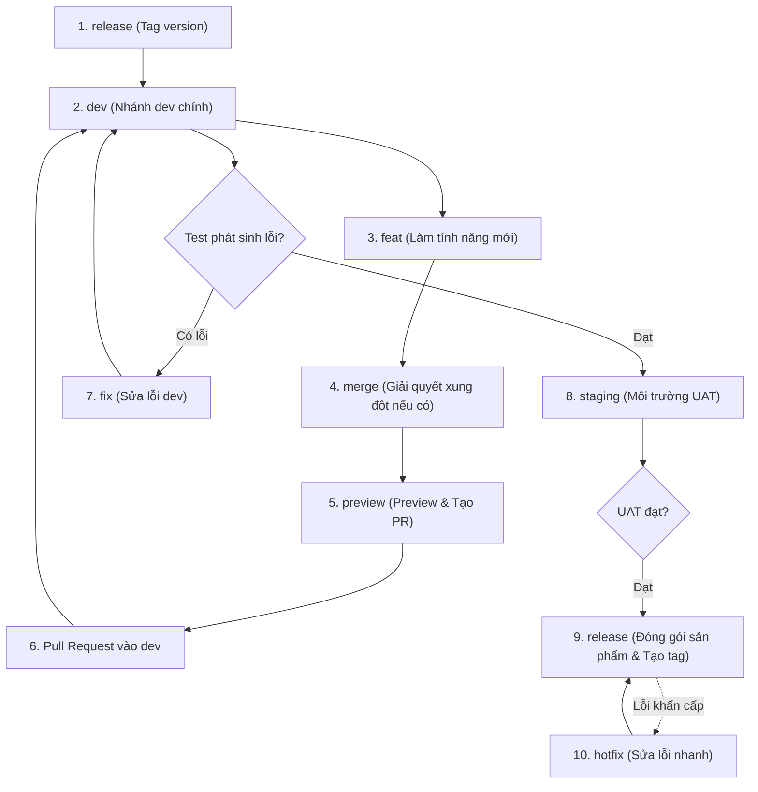
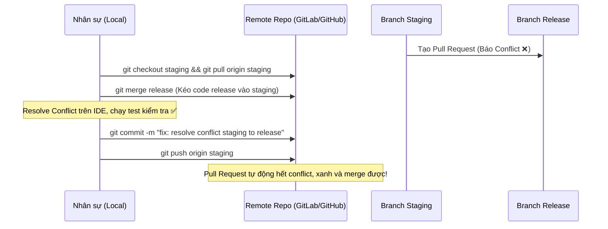

# CÔNG TY CỔ PHẦN ĐẦU TƯ CÔNG NGHỆ THIÊN ÂN

| **Mã số** | F10.TAC_CN01 |
|---|---|
| **Hiệu lực** | 01/07/2020 |
| **Lần sửa đổi** | 00 |

---

# TÀI LIỆU HƯỚNG DẪN SỬ DỤNG GIT FLOW VÀ CÁC LƯU Ý KHI COMMIT CODE

| Vai trò | Họ tên | Chức vụ | Ký tên | Ngày ký |
|---|---|---|---|---|
| **Soạn thảo** | Trần Hồng Sơn | | | |
| **Xem xét** | | | | |
| **Phê duyệt** | | | | |

---

## BẢNG THEO DÕI SỬA ĐỔI TÀI LIỆU

| Ngày | Nội dung sửa đổi | Ký xác nhận |
|---|---|---|
| 2024/11/11 | Khởi tạo tài liệu | |
| 2024/11/18 | Format lại theo mẫu | |
| 2024/01/14 | Sửa tên branch `feature` -> `feat`, `fixbug` -> `fix`. Cập nhật thêm nội dung tham khảo | |
| 2024/01/20 | Bổ sung các công việc cần kiểm tra khi commit. Bổ sung mô hình minh hoạ gitflow | |

---

## MỤC LỤC

- [I. TỔNG QUAN](#i-tổng-quan)
  - [1. Mục đích](#1-mục-đích)
  - [2. Phạm vi](#2-phạm-vi)
  - [3. Tài liệu liên quan](#3-tài-liệu-liên-quan)
  - [4. Thuật ngữ và các từ viết tắt](#4-thuật-ngữ-và-các-từ-viết-tắt)
- [II. NỘI DUNG](#ii-nội-dung)
  - [1. Quy định tài khoản commit](#1-quy-định-tài-khoản-commit)
  - [2. Cấu trúc thư mục dự án](#2-cấu-trúc-thư-mục-dự-án)
  - [3. Branch / Tạo nhánh](#3-branch--tạo-nhánh)
  - [4. Nội dung khi commit](#4-nội-dung-khi-commit)
  - [5. Công việc kiểm tra khi commit code](#5-công-việc-kiểm-tra-khi-commit-code)
  - [6. Tài liệu tham khảo & Xử lý xung đột](#6-tài-liệu-tham-khảo--xử-lý-xung-đột)

---

# I. TỔNG QUAN

## 1. Mục đích
- Hướng dẫn sử dụng git.
- Luồng và quy định khi tạo nhánh branch.
- Nội dung khi commit.
- Các công việc kiểm tra khi commit code.

## 2. Phạm vi
- Sử dụng git nội bộ trong phòng phát triển phần mềm – Công ty CP Đầu tư CN Thiên Ân.

## 3. Tài liệu liên quan

| STT | Tên tài liệu | Mã tài liệu / Nguồn |
|:---:|---|---|
| | | |

## 4. Thuật ngữ và các từ viết tắt

| STT | Thuật ngữ / chữ viết tắt | Mô tả |
|:---:|---|---|
| 1 | V | Phiên bản (Version) |

---

# II. NỘI DUNG

## 1. Quy định tài khoản commit

### Mô tả
Quy định về tài khoản sử dụng khi commit code.

### Thông tin tài khoản
- **Tên tài khoản (username):** Sử dụng phần tên trước ký tự `@tacorp.vn` trong địa chỉ email.
- **Hình đại diện (avatar):** Chọn hình ảnh chỉnh chu, phù hợp (sử dụng ảnh thẻ hoặc tương tự).
- **Bổ sung tên thật:** Cập nhật đầy đủ họ và tên vào thông tin tài khoản.
- **Email:** Sử dụng địa chỉ email công ty (`...@tacorp.vn`).

---

## 2. Cấu trúc thư mục dự án

### Mô tả
Cấu trúc thư mục source code quản lý trên git, giúp dễ dàng quản lý các thông tin, phần mềm liên quan.

### Cấu trúc thư mục

```text
├── build           # Quản lý bản build gần nhất
├── docs            # Tài liệu tham khảo liên quan
├── libs            # Thư viện sử dụng (dll, sdk, …)
├── src             # Source code chương trình
├── tests           # Các chương trình kiểm thử, auto test, test case, …
├── tools           # Các chương trình, PM hỗ trợ, giả lập dữ liệu, …
├── examples        # Các chương trình code mẫu, thực hiện thử chức năng, thư viện, ...
├── CHANGELOG.md    # Mô tả thay đổi chương trình
└── README.md       # Mô tả chung cho dự án, cách build, ...
```

---

## 3. Branch / Tạo nhánh

### Mô tả
Cách thức tạo branch / nhánh để làm việc.

### Phương thức vận hành

#### Tên các branch:
- `release`: Sản phẩm đóng gói tới khách hàng >> tạo tag đánh dấu version.
- `staging`: Test trên môi trường dàn dựng / uat.
- `hotfix`: Sửa lỗi nhanh đã release ra khách hàng.
- `dev`: Nhánh dev chính.
- `feat`: Thực hiện chức năng (feature).
- `fix`: Fix lỗi chức năng phát sinh khi review / dev (fixbug).
- `merge`: Merge code với nhau.
- `preview`: Preview code. Dùng tạo pull request quản lý issue.
- `exp`: Thử nghiệm tính năng mới (experimental).

#### Cú pháp:
- `BranchKey/TaskCode_ten-cong-viec-viet-thuong-cach-nhau-boi-dau-gach-ngang`
- `BranchKey/yyyyMMdd-TaskCode_ten-cong-viec-cach-nhau-gach-ngang`
- `BranchKey/yyyyMMdd-ten-cong-viec-cach-nhau-gach-ngang`

**Ví dụ:**
- `feat/20250101-XD1.2.2.5_map-location`
- `feat/20260922-XD1.2.2.5_map-location-dathp`
- `fix/20250102-XD1.2.2.5_fix-map-location`
- `merge/20250105-XD1.2.2.5_merge-code-dev-a-b`
- `release/20250110-v1.0.1`
- …

> **Lưu ý:**
> - Nên thêm tên nhân sự vào để dễ dàng quản lý (ví dụ: `-sonth`, `-dathp`, `-hieunv`).
> - Thời gian rule: `yyyyMMdd` hoặc `yyyyMM`.
> - Tên branch viết tiếng Việt không dấu / tiếng Anh.

#### Thứ tự thực hiện:



| Nhánh | Nhân sự phụ trách | Nhiệm vụ |
|---|---|---|
| **release** | Leader | Quản lý, tạo tag version |
| **staging** | Leader | Quản lý |
| **dev** | Leader | Quản lý |
| **feat** | Nhân sự thực hiện | Tạo mới, cập nhật, xoá |
| **fix** | Nhân sự thực hiện | Tạo mới, cập nhật, xoá |
| **merge** | Nhân sự thực hiện | Tạo mới, cập nhật, xoá |
| **preview** | Nhân sự thực hiện | Tạo mới, cập nhật, xoá |
| **hotfix** | Nhân sự thực hiện | Tạo mới, cập nhật, xoá |
| **exp** | Nhân sự thực hiện | Tạo mới, cập nhật, xoá |

**Quy trình chi tiết:**
1. Khi bắt đầu dự án, khởi tạo nhánh branch đầu tiên là **`release`** và khởi tạo code đầu tiên của dự án với cấu trúc thư mục quy định.
2. Tiến hành tạo nhánh **`dev`** tương ứng với nhánh `release`.
3. Khi nhận chức năng mới, tiến hành tạo branch **`feat`** tương ứng từ nhánh `dev`.
4. Nếu có phát sinh merge lại code, tạo nhánh branch **`merge`** để merge code liên quan.
5. Khi hoàn tất chức năng, để preview chức năng, tạo nhánh **`preview`** nếu cần thiết (đối với chức năng phức tạp, có merge code):
   - Nhân sự tiến hành tạo pull request yêu cầu merge vào nhánh `dev`. Tiến hành preview trên yêu cầu này.
6. Sau khi preview hoàn tất, merge từ các nhánh **`feat`** / **`preview`** vào `dev` (chấp thuận pull request).
7. Sau khi test ở nhánh `dev` / `test` / `staging`, nếu phát sinh lỗi, tạo nhánh **`fix`** để sửa lỗi tương ứng.
8. Khi đã test hoàn tất, tạo nhánh **`staging`** để thiết lập môi trường dàn dựng / uat cho người dùng test / test môi trường thực tế thử nghiệm.
9. Khi có lỗi ở `release`, tạo nhánh **`hotfix`** để fix lỗi gấp / nhỏ. Nếu thay đổi lớn / không gấp, xử lý như cũ.
10. Nhánh **`release`**: Sản phẩm hoàn thiện tới khách hàng, tiến hành tạo tag để đóng gói version.

---

## 4. Nội dung khi commit

### Mô tả
Nội dung khi commit code.

### Phương thức vận hành

Khi commit code, trong summary commit, bổ sung các từ khoá sau:
- `feat`: Commit thêm / huỷ chức năng
- `fix`: Fix lỗi / Thay đổi chức năng
- `refactor`: Format lại code / Tối ưu code
- `chore`: Tất cả mọi thứ khác (tài liệu HD, test case, bỏ code dư thừa, …)

> **Lưu ý:** Thêm dấu **`!`** ngay sau từ khóa (ví dụ: `feat!`, `fix!`) để nhấn mạnh thay đổi lớn có thể ảnh hưởng hệ thống / luồng xử lý cũ (Breaking Change).

#### Cú pháp Summary:
```text
Summary: Key: công việc thực hiện (sử dụng câu hành động)
# hoặc rút gọn:
Key: công việc thực hiện (sử dụng câu hành động)
```

**Ví dụ:**
- `feat: XD1.2.2.5 - add map location`
- `feat: XD1.2.2.6 - bỏ chức năng không sử dụng`
- `fix: fix map location & fix traffic info`
- `refactor: format code map location`
- `fix!: XD1.2.2.7 - thay đổi luồng gửi mail`
- ...

> **Lưu ý:** Nên thống nhất ngôn ngữ chung (tiếng Việt / tiếng Anh) xuyên suốt dự án.

#### Nội dung commit description:
- Dòng đầu tiên ghi lại nội dung summary.
- Bỏ trống 2 dòng.
- Nội dung chi tiết các công việc đã thực hiện trong lần commit này. Nên viết gạch đầu dòng các ý (`- ...`).
- Nếu có người review thì thêm: `Reviewer: xxx`
- Nếu commit từ CR nào thì thêm: `CR: mã CR`
- Nếu sửa đổi từ commit / issue log nào trước đó: thêm `Ref: mã tham chiếu`

**Ví dụ:**
```text
Summary:
fix: sửa luồng gửi mail chức năng A module A

Description:
Sửa luồng gửi mail chức năng A module A


- Thay đổi luồng thứ tự nhân sự duyệt cho phép gửi mail
- Bổ sung cấu hình thiết lập thời gian timeout
- Bỏ bớt code dư thừa

Reviewer: SonTH
CR: CR0001-thay-doi-luong-gui-mail
```

---

## 5. Công việc kiểm tra khi commit code

### Mô tả
Các công việc lưu ý cần kiểm tra lại trước khi commit và khi commit.

### Các công việc kiểm tra:

1. **Kiểm tra cú pháp và lỗi biên dịch:**
   - Đảm bảo không có lỗi cú pháp hoặc lỗi biên dịch trong code.
2. **Kiểm tra logic code:**
   - Đảm bảo logic của code đã được kiểm tra và hoạt động như mong đợi.
   - Chạy thử code trên môi trường phát triển (nếu có) để xác nhận kết quả.
3. **Kiểm tra code theo tiêu chuẩn, quy ước và quy tắc lập trình:**
   - Đảm bảo code tuân thủ các tiêu chuẩn lập trình của nhóm hoặc dự án (quy ước và quy tắc đặt tên, cấu trúc thư mục, tập tin trong dự án, …).
4. **Xóa code không cần thiết:**
   - Loại bỏ các dòng code debug, console log hoặc comment tạm thời không cần thiết.
   - Tối ưu code nếu cần thiết (giảm độ phức tạp, dùng các kỹ thuật tối ưu).
5. **Chạy các bài kiểm thử (Test cases):**
   - Chạy toàn bộ các bài kiểm thử tự động (unit test, integration test, end-to-end test).
   - Đảm bảo không có bài kiểm thử nào bị lỗi.
   - Thêm hoặc cập nhật các bài kiểm thử nếu có thay đổi logic.
6. **Kiểm tra xung đột merge (Merge conflicts):**
   - **Cập nhật branch của bạn với branch chính (dev) để đảm bảo không có xung đột với branch chính (merge branch `dev` vào branch của bạn).**
   - Tạo nhánh merge từ branch của bạn với các nhân sự khác nếu có để đảm bảo không có xung đột giữa các thành viên cùng thực hiện.
   - Giải quyết các xung đột nếu có.
7. **Kiểm tra tài liệu:**
   - Thêm hoặc cập nhật tài liệu nếu bạn thêm tính năng hoặc thay đổi logic.
   - Đảm bảo các comment và tài liệu mô tả rõ ràng.
   - Hướng dẫn cài đặt, cấu hình, sử dụng nếu có.
8. **Kiểm tra file và commit message:**
   - Đảm bảo chỉ commit các file liên quan đến thay đổi.
   - Kiểm tra xem bạn có bỏ sót file nào cần commit không (e.g., file cấu hình, script liên quan).
   - Viết commit message rõ ràng, ngắn gọn và theo chuẩn quy định.
   - Cập nhật nội dung changelog nếu có.
9. **Kiểm tra quyền truy cập và thông tin nhạy cảm:**
   - Đảm bảo không commit các thông tin nhạy cảm như API keys, mật khẩu, hoặc dữ liệu cá nhân.
   - Kiểm tra `.gitignore` để tránh commit các file không cần thiết.
10. **Chạy thử trên môi trường staging:**
    - Nếu có thể, kiểm tra lại các thay đổi trên môi trường staging để đảm bảo mọi thứ hoạt động ổn định, không xảy ra vấn đề khi chạy trên môi trường production.

---

## 6. Tài liệu tham khảo & Xử lý xung đột

- **Tham khảo Git Workflow:**  
  [https://ehkoo.com/bai-viet/git-workflow-phan-nhanh-va-chia-viec-trong-nhom](https://ehkoo.com/bai-viet/git-workflow-phan-nhanh-va-chia-viec-trong-nhom)
- **Tham khảo thêm chức năng Cherry-Pick:**  
  [https://viblo.asia/p/git-nang-cao-git-cherry-pick-RQqKLQ9pZ7z](https://viblo.asia/p/git-nang-cao-git-cherry-pick-RQqKLQ9pZ7z) *(merge commit chỉ định qua branch khác)*
- **Quy trình xử lý xung đột (Merge Conflict Resolution) khi Pull Request:**



**Các bước xử lý xung đột cụ thể:**
1. Nhánh `staging` pull request lên `release` bị xung đột.
2. Tiến hành lấy nhánh `staging` về máy local. Thực hiện merge `release` vào `staging` (`git merge release`).
3. Giải quyết xung đột ở nhánh `staging` trên local, test lại và commit lên remote.
4. Refresh lại trang pull request và hoàn tất chấp thuận (approve) pull request.
