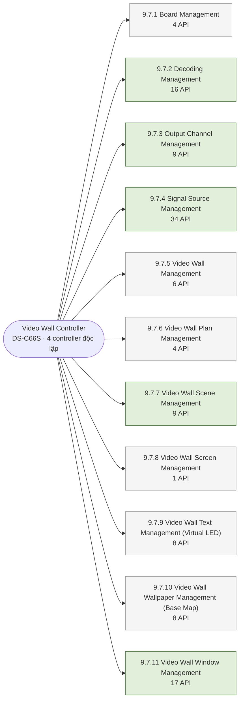

# DANH MỤC API ISAPI — QUẢN LÝ DECODING & VIDEO WALL (Hikvision DS-C66S)

> Nguồn: ISAPI Controller – Videowall Controller (chương 9.7, tr.332–499). Số trang = trang PDF gốc.
> Kiến trúc dự án: 4 controller độc lập (4 IP, digest auth) • mọi nguồn qua HDMI input • scene lưu trong DB BE • 1 window không vượt ranh giới controller.

> Nguồn dữ liệu: `VideoWall_ISAPI_API_List.xlsx`. Chi tiết request/response của từng API xem tại [09-api-reference.md](09-api-reference.md).

---

## Tổng quan các nhóm API

| # | Nhóm | Mục tài liệu | Trang | Số API | Ghi chú cho dự án |
| --- | --- | --- | --- | --- | --- |
| 1 | [Board Management](#1-board-management-971) | `9.7.1` | 332 | **4** | Health-check board — phát hiện board output lỗi kéo theo nhóm màn |
| 2 | [Decoding Management](#2-decoding-management-972) | `9.7.2` | 336 | **16** | Poll windows/status (9.7.2.8) là API giám sát lõi của màn Monitor |
| 3 | [Output Channel Management](#3-output-channel-management-973) | `9.7.3` | 360 | **9** | 32 output = tổng 4 máy; panel "Bật/Tắt" mang nghĩa kết nối logic |
| 4 | [Signal Source Management](#4-signal-source-management-974) | `9.7.4` | 373 | **34** | Chỉ dùng nhóm inputs (HDMI). Nhóm streaming/channels: ngoài phạm vi. cutOff bắt buộc cho composite window |
| 5 | [Video Wall Management](#5-video-wall-management-975) | `9.7.5` | 418 | **6** | Capability gọi đầu tiên; outputs (9.7.5.5) là bảng map lưới |
| 6 | [Video Wall Plan Management](#6-video-wall-plan-management-976) | `9.7.6` | 437 | **4** | Tùy chọn — lịch tự động; chứa openScreen/closeScreen (workaround bật/tắt màn) |
| 7 | [Video Wall Scene Management](#7-video-wall-scene-management-977) | `9.7.7` | 440 | **9** | Tùy chọn — scene chính thức nằm ở DB BE (thiết bị chỉ lưu id+name, không sửa được bố cục qua API) |
| 8 | [Video Wall Screen Management](#8-video-wall-screen-management-978) | `9.7.8` | 446 | **1** | Chỉ có closeAll — không có bật từng màn/mở tất cả |
| 9 | [Video Wall Text Management (Virtual LED)](#9-video-wall-text-management-virtual-led-979) | `9.7.9` | 446 | **8** | Chữ chạy — giai đoạn mở rộng |
| 10 | [Video Wall Wallpaper Management (Base Map)](#10-video-wall-wallpaper-management-base-map-9710) | `9.7.10` | 463 | **8** | Ảnh nền — giai đoạn mở rộng |
| 11 | [Video Wall Window Management](#11-video-wall-window-management-9711) | `9.7.11` | 469 | **17** | Nhóm lõi kéo-thả: 9.7.11.2/4/6/7 + top/bottom |
| | **TỔNG** | | | **116** | |

### Chú giải

| Ký hiệu | Ý nghĩa |
| --- | --- |
| 🟢 **Dùng chính** | API dùng chính cho dự án |
| ⚪ Tùy chọn | Tùy chọn / giai đoạn mở rộng |
| ⚫ Ngoài phạm vi | Ngoài phạm vi (đã chốt nguồn chỉ qua HDMI) |

- Get/Set parameters là lấy/thay đổi cấu hình hiện tại của các module
- Get Capability là lấy các giá trị của trường dữ liệu, trường dữ liệu những thứ có thể thay đổi được của 1 module
- Get status là kiểm tra trạng thái

### Bản đồ nhóm API

---

## 1. Board Management (9.7.1)

*Quản lý sub-board (board cắm trong khung máy, bo mạch của controller)*

| Mục | Tên API | Method | URL | Trang | Công dụng / Ghi chú dự án | Mức dùng |
| --- | --- | --- | --- | --- | --- | --- |
| [9.7.1.1](09-api-reference.md#9711-set-parameters-of-a-specified-sub-board) | Set parameters of a specified sub-board | `PUT` | `/ISAPI/System/Board/<BoardID>/config` | 332 | Cấu hình 1 sub-board theo BoardID | ⚪ Tùy chọn |
| [9.7.1.2](09-api-reference.md#9712-get-sub-board-capability) | Get sub-board capability | `GET` | `/ISAPI/System/Board/capabilities` | 332 | Khai báo cấu hình hiện tại sub-board | ⚪ Tùy chọn |
| [9.7.1.3](09-api-reference.md#9713-set-parameters-of-all-sub-boards) | Set parameters of all sub-boards | `PUT` | `/ISAPI/System/Board/config` | 333 | Cấu hình tất cả sub-board | ⚪ Tùy chọn |
| [9.7.1.4](09-api-reference.md#9714-get-capability-of-the-status-of-all-sub-boards) | Get capability of the status of all sub-boards | `GET` | `/ISAPI/System/Board/status/capabilities` | 334 | Kiểm tra capability trạng thái của các subboard | 🟢 **Dùng chính** |

[↑ Về tổng quan](#tổng-quan-các-nhóm-api)

---

## 2. Decoding Management (9.7.2)

*Quản lý giải mã: trạng thái decode, start/stop, pre-monitor, decode delay*

*Quản lý việc phát hình lên từng subwindows/window*

| Mục | Tên API | Method | URL | Trang | Công dụng / Ghi chú dự án | Mức dùng |
| --- | --- | --- | --- | --- | --- | --- |
| [9.7.2.1](09-api-reference.md#9721-get-decoding-device-status) | Get decoding device status | `GET` | `/ISAPI/DisplayDev/decoingDevice/status?format=json` | 336 | Trạng thái thiết bị giải mã, Health status của thiết bị decode (controller) | 🟢 **Dùng chính** |
| [9.7.2.2](09-api-reference.md#9722-get-network-pre-monitor-parameters-of-a-video-wall) | Get network pre-monitor parameters of a video wall | `GET` | `/ISAPI/DisplayDev/VideoWall/<videoWallID>/nPreMonitor` | 343 | Lấy cấu hình luồng preview qua mạng của videowall | ⚪ Tùy chọn |
| [9.7.2.3](09-api-reference.md#9723-set-network-pre-monitor-parameters-of-a-video-wall) | Set network pre-monitor parameters of a video wall | `PUT` | `/ISAPI/DisplayDev/VideoWall/<videoWallID>/nPreMonitor` | 343 | Thay đổi cấu hình luồng preview qua mạng của videowall — nhúng preview videoWall vào web | ⚪ Tùy chọn |
| [9.7.2.4](09-api-reference.md#9724-get-sub-window-configuration-capability) | Get sub window configuration capability | `GET` | `/ISAPI/DisplayDev/VideoWall/<videoWallID>/windows/<VWMWID>/sub/<VWSWID>/param/capabilities` | 344 | Khai báo khả năng (capabilities) của subwindow | ⚪ Tùy chọn |
| [9.7.2.5](09-api-reference.md#9725-start-dynamic-decoding) | Start dynamic decoding | `PUT` | `/ISAPI/DisplayDev/VideoWall/<videoWallID>/windows/<VWMWID>/sub/<VWSWID>/start` | 345 | Bắt đầu giải mã động — phát nguồn vào 1 sub-window | 🟢 **Dùng chính** |
| [9.7.2.6](09-api-reference.md#9726-get-decoding-status-of-all-sub-windows-of-a-specific-window) | Get decoding status of all sub windows of a specific window | `GET` | `/ISAPI/DisplayDev/VideoWall/<videoWallID>/windows/<VWMWID>/sub/<VWSWID>/status` | 347 | Khai báo trạng thái decode các sub-window của 1 window — drill-down khi click khối lỗi | 🟢 **Dùng chính** |
| [9.7.2.7](09-api-reference.md#9727-stop-dynamic-decoding) | Stop dynamic decoding | `PUT` | `/ISAPI/DisplayDev/VideoWall/<videoWallID>/windows/<VWMWID>/sub/<VWSWID>/stop` | 351 | Dừng giải mã 1 sub-window (window còn, ngừng hình) | 🟢 **Dùng chính** |
| [9.7.2.8](09-api-reference.md#9728-get-decoding-status-of-all-sub-windows-of-all-windows) | Get decoding status of all sub-windows of all windows | `GET` | `/ISAPI/DisplayDev/VideoWall/<videoWallID>/windows/status` | 352 | Khai báo Trạng thái decode TẤT CẢ window — poll 3–5s để tô màu lưới Monitor (lỗi camera/nguồn hiện gián tiếp ở đây) | 🟢 **Dùng chính** |
| [9.7.2.9](09-api-reference.md#9729-get-sub-board-stream-exporting-configurations) | Get sub-board stream exporting configurations | `GET` | `/ISAPI/DisplayDev/VideoWall/DecodeMgr/BoardStreamExportCfg?format=json` | 356 | Khai báo trạng thái stream từ các sub-board hiện đang được bật hay tắt. (/*opt, boolean, whether to enable exporting sub-board stream*/) | ⚪ Tùy chọn |
| [9.7.2.10](09-api-reference.md#97210-set-sub-board-stream-exporting-configurations) | Set sub-board stream exporting configurations | `PUT` | `/ISAPI/DisplayDev/VideoWall/DecodeMgr/BoardStreamExportCfg?format=json` | 356 | Thay đổi cấu hình của sub-board stream (true/falsse - request ) | ⚪ Tùy chọn |
| [9.7.2.11](09-api-reference.md#97211-get-capability-of-default-decoding-delay-parameters) | Get capability of default decoding delay parameters | `GET` | `/ISAPI/DisplayDev/VideoWall/DecodeMgr/DefaultDecodeDelayParams/capabilities?format=json` | 356 | Lấy các giá trị mà thiết bị cho phép cấu hình đối với tham số Default Decode Delay. | ⚪ Tùy chọn |
| [9.7.2.12](09-api-reference.md#97212-get-default-decoding-delay-parameters) | Get default decoding delay parameters | `GET` | `/ISAPI/DisplayDev/VideoWall/DecodeMgr/DefaultDecodeDelayParams?format=json` | 357 | Lấy giá trị default decoding delay | ⚪ Tùy chọn |
| [9.7.2.13](09-api-reference.md#97213-set-default-decoding-delay-parameters) | Set default decoding delay parameters | `PUT` | `/ISAPI/DisplayDev/VideoWall/DecodeMgr/DefaultDecodeDelayParams?format=json` | 357 | Thay đổi giá trị default decoding delay | ⚪ Tùy chọn |
| [9.7.2.14](09-api-reference.md#97214-get-network-pre-monitoring-parameters-of-all-video-walls) | Get network pre-monitoring parameters of all video walls | `GET` | `/ISAPI/DisplayDev/VideoWall/nPreMonitor` | 357 | Lấy cấu hình hiện tại của chức năng xem trước qua mạng cho tất cả các Video Wall. | ⚪ Tùy chọn |
| [9.7.2.15](09-api-reference.md#97215-set-network-pre-monitoring-parameters-of-all-video-walls) | Set network pre-monitoring parameters of all video walls | `PUT` | `/ISAPI/DisplayDev/VideoWall/nPreMonitor` | 358 | Thay đổi cấu hình hiện tại của chức năng xem trước qua mạng cho tất cả các Video Wall. | ⚪ Tùy chọn |
| [9.7.2.16](09-api-reference.md#97216-get-capability-of-network-pre-monitoring-parameters-of-video-wall) | Get capability of network pre-monitoring parameters of video wall | `GET` | `/ISAPI/DisplayDev/VideoWall/nPreMonitor/capabilities` | 359 | Kiểm tra khả năng của network pre-monitoring parameters of video wall | ⚪ Tùy chọn |

[↑ Về tổng quan](#tổng-quan-các-nhóm-api)

---

## 3. Output Channel Management (9.7.3)

*Quản lý kênh đầu ra (video/audio) — 32 màn hình*

| Mục | Tên API | Method | URL | Trang | Công dụng / Ghi chú dự án | Mức dùng |
| --- | --- | --- | --- | --- | --- | --- |
| [9.7.3.1](09-api-reference.md#9731-get-the-audio-output-channels-parameters) | Get the audio output channels' parameters | `GET` | `/ISAPI/DisplayDev/Audio/outputs/channels` | 360 | Lấy cấu hình hiện tại của các kênh output audio | ⚪ Tùy chọn |
| [9.7.3.2](09-api-reference.md#9732-set-parameters-of-all-audio-output-channels) | Set parameters of all audio output channels | `PUT` | `/ISAPI/DisplayDev/Audio/outputs/channels` | 361 | Thay đổi cấu hình của các kênh output audio | ⚪ Tùy chọn |
| [9.7.3.3](09-api-reference.md#9733-set-parameters-of-all-video-outputs) | Set parameters of all video outputs | `PUT` | `/ISAPI/DisplayDev/Video/outputs/channels` | 362 | Thay đổi cấu hình của các kênh video audio | ⚪ Tùy chọn |
| [9.7.3.4](09-api-reference.md#9734-get-basic-parameters-of-all-video-outputs) | Get basic parameters of all video outputs | `GET` | `/ISAPI/DisplayDev/Video/outputs/channels` | 364 | Lấy câu hình hiện tại của các kênh video output | 🟢 **Dùng chính** |
| [9.7.3.5](09-api-reference.md#9735-get-parameters-of-a-specific-video-output) | Get parameters of a specific video output | `GET` | `/ISAPI/DisplayDev/Video/outputs/channels/<channelID>` | 366 | Lấy cấu hình chi tiết 1 output (1 screen) | 🟢 **Dùng chính** |
| [9.7.3.6](09-api-reference.md#9736-set-parameters-of-a-specific-video-output) | Set parameters of a specific video output | `PUT` | `/ISAPI/DisplayDev/Video/outputs/channels/<channelID>` | 367 | Cấu hình 1 output | 🟢 **Dùng chính** |
| [9.7.3.7](09-api-reference.md#9737-get-the-capability-of-a-specific-video-output) | Get the capability of a specific video output | `GET` | `/ISAPI/DisplayDev/Video/outputs/channels/<channelID>/capabilities` | 369 | Khai báo năng lực 1 output — độ phân giải hỗ trợ | 🟢 **Dùng chính** |
| [9.7.3.8](09-api-reference.md#9738-set-parameters-of-all-video-output-channels) | Set parameters of all video output channels | `PUT` | `/ISAPI/DisplayDev/Video/outputs/channels/all` | 371 | Áp cấu hình cho toàn bộ kênh output một lần | ⚪ Tùy chọn |
| [9.7.3.9](09-api-reference.md#9739-get-the-configuration-capability-of-all-video-output-channels) | Get the configuration capability of all video output channels | `GET` | `/ISAPI/DisplayDev/Video/outputs/channels/capabilities` | 372 | Năng lực cấu hình toàn bộ output | ⚪ Tùy chọn |

[↑ Về tổng quan](#tổng-quan-các-nhóm-api)

---

## 4. Signal Source Management (9.7.4)

*Quản lý nguồn tín hiệu: input HDMI/DVI/SDI, stream mạng, crop, màu, ghép nguồn*

| Mục | Tên API | Method | URL | Trang | Công dụng / Ghi chú dự án | Mức dùng |
| --- | --- | --- | --- | --- | --- | --- |
| [9.7.4.1](09-api-reference.md#9741-get-the-audio-capabilities) | Get the audio capabilities | `GET` | `/ISAPI/DisplayDev/Audio/capabilities` | 373 | Năng lực audio | ⚪ Tùy chọn |
| [9.7.4.2](09-api-reference.md#9742-get-capability-set-of-adding-signal-source-group) | Get capability set of adding signal source group | `GET` | `/ISAPI/DisplayDev/SignalSource/AddSignalSourceGroup/capabilities?format=json` | 374 | Năng lực thêm nhóm nguồn | ⚪ Tùy chọn |
| [9.7.4.3](09-api-reference.md#9743-get-signal-source-groups) | Get signal source groups | `POST` | `/ISAPI/DisplayDev/SignalSource/GetSignalSourceGroup?format=json` | 374 | Lấy các nhóm nguồn tín hiệu (JSON, method POST) | ⚪ Tùy chọn |
| [9.7.4.4](09-api-reference.md#9744-get-capability-of-editing-signal-source-group) | Get capability of editing signal source group | `GET` | `/ISAPI/DisplayDev/SignalSource/ModifySignalSourceGroup/capabilities?format=json` | 375 | Năng lực sửa nhóm nguồn | ⚪ Tùy chọn |
| [9.7.4.5](09-api-reference.md#9745-get-capability-of-no-signal-parameters-of-signal-source) | Get capability of no signal parameters of signal source | `GET` | `/ISAPI/DisplayDev/SignalSource/SignalSourceNoSignalParams/capabilities?format=json` | 375 | Năng lực tham số "mất tín hiệu" | ⚪ Tùy chọn |
| [9.7.4.6](09-api-reference.md#9746-get-no-signal-parameters-of-signal-source) | Get no signal parameters of signal source | `GET` | `/ISAPI/DisplayDev/SignalSource/SignalSourceNoSignalParams?format=json` | 376 | Đọc tham số hiển thị khi nguồn mất tín hiệu | ⚪ Tùy chọn |
| [9.7.4.7](09-api-reference.md#9747-get-video-capabilities) | Get video capabilities | `GET` | `/ISAPI/DisplayDev/Video/capabilities` | 376 | Năng lực video (input/stream) của máy | ⚪ Tùy chọn |
| [9.7.4.8](09-api-reference.md#9748-get-parameters-of-all-video-input-channels) | Get parameters of all video input channels | `GET` | `/ISAPI/DisplayDev/Video/inputs/channels` | 378 | Khai báo cấu hình của tất cả input channel — panel "Nguồn tín hiệu" (mọi nguồn qua HDMI theo kiến trúc đã chốt) | 🟢 **Dùng chính** |
| [9.7.4.9](09-api-reference.md#9749-set-parameters-of-all-video-input-channels) | Set parameters of all video input channels | `PUT` | `/ISAPI/DisplayDev/Video/inputs/channels` | 381 | Cấu hình tất cả input | ⚪ Tùy chọn |
| [9.7.4.10](09-api-reference.md#97410-set-parameters-of-a-specified-signal-source) | Set parameters of a specified signal source | `PUT` | `/ISAPI/DisplayDev/Video/inputs/channels/<channelID>` | 383 | Cấu hình 1 nguồn — đổi tên ("Cổng 3" → "Dashboard GT") | 🟢 **Dùng chính** |
| [9.7.4.11](09-api-reference.md#97411-get-parameters-of-a-specific-signal-source) | Get parameters of a specific signal source | `GET` | `/ISAPI/DisplayDev/Video/inputs/channels/<channelID>` | 385 | Chi tiết 1 nguồn | ⚪ Tùy chọn |
| [9.7.4.12](09-api-reference.md#97412-get-color-parameters-of-a-specific-signal-source) | Get color parameters of a specific signal source | `GET` | `/ISAPI/DisplayDev/Video/inputs/channels/<channelID>/color` | 387 | Đọc tham số màu 1 nguồn | ⚪ Tùy chọn |
| [9.7.4.13](09-api-reference.md#97413-set-color-parameters-of-a-specified-signal-source) | Set color parameters of a specified signal source | `PUT` | `/ISAPI/DisplayDev/Video/inputs/channels/<channelID>/color` | 388 | Chỉnh màu 1 nguồn (sáng/tương phản...) | ⚪ Tùy chọn |
| [9.7.4.14](09-api-reference.md#97414-get-the-color-configuration-capability-of-a-signal-source) | Get the color configuration capability of a signal source | `GET` | `/ISAPI/DisplayDev/Video/inputs/channels/<channelID>/color/capabilities` | 389 | Năng lực chỉnh màu | ⚪ Tùy chọn |
| [9.7.4.15](09-api-reference.md#97415-get-picture-cropping-parameters-of-a-specific-signal-source) | Get picture cropping parameters of a specific signal source | `GET` | `/ISAPI/DisplayDev/Video/inputs/channels/<channelID>/cutOff` | 389 | Đọc tham số CROP (cắt hình) 1 nguồn | 🟢 **Dùng chính** |
| [9.7.4.16](09-api-reference.md#97416-set-picture-cropping-parameters-of-a-specified-signal-source) | Set picture cropping parameters of a specified signal source | `PUT` | `/ISAPI/DisplayDev/Video/inputs/channels/<channelID>/cutOff` | 390 | Đặt CROP 1 nguồn — BẮT BUỘC cho composite window toàn tường (mỗi máy crop 1 phần khung) | 🟢 **Dùng chính** |
| [9.7.4.17](09-api-reference.md#97417-get-the-capability-of-configuring-picture-cropping-parameters-of-a-signal-source) | Get the capability of configuring picture cropping parameters of a signal source | `GET` | `/ISAPI/DisplayDev/Video/inputs/channels/<channelID>/cutOff/capabilities` | 390 | Năng lực crop | ⚪ Tùy chọn |
| [9.7.4.18](09-api-reference.md#97418-get-captured-pictures) | Get captured pictures | `GET` | `/ISAPI/DisplayDev/Video/inputs/channels/<channelID>/picture` | 391 | Chụp snapshot 1 nguồn — thumbnail preview trên panel nguồn | 🟢 **Dùng chính** |
| [9.7.4.19](09-api-reference.md#97419-get-the-capability-of-configuring-image-position-adjustment-parameters-of-a-signal-source) | Get the capability of configuring image position adjustment parameters of a signal source | `GET` | `/ISAPI/DisplayDev/Video/inputs/channels/<channelID>/position/capabilities` | 391 | Năng lực chỉnh vị trí hình | ⚪ Tùy chọn |
| [9.7.4.20](09-api-reference.md#97420-set-the-custom-resolution-of-a-specified-signal-source) | Set the custom resolution of a specified signal source | `PUT` | `/ISAPI/DisplayDev/Video/inputs/channels/<channelID>/resolution` | 392 | Đặt độ phân giải tùy chỉnh cho 1 nguồn | ⚪ Tùy chọn |
| [9.7.4.21](09-api-reference.md#97421-get-the-capability-of-customizing-the-resolution-of-a-specified-signal-source) | Get the capability of customizing the resolution of a specified signal source | `GET` | `/ISAPI/DisplayDev/Video/inputs/channels/<channelID>/resolution/capabilities` | 393 | Năng lực độ phân giải tùy chỉnh | ⚪ Tùy chọn |
| [9.7.4.22](09-api-reference.md#97422-get-the-osd-configuration-capability-of-a-signal-source) | Get the OSD configuration capability of a signal source | `GET` | `/ISAPI/DisplayDev/Video/inputs/channels/<channelID>/text/capabilities` | 394 | Năng lực OSD của nguồn | ⚪ Tùy chọn |
| [9.7.4.23](09-api-reference.md#97423-get-the-video-input-capability) | Get the video input capability | `GET` | `/ISAPI/DisplayDev/Video/inputs/channels/capabilities` | 395 | Năng lực input tổng | ⚪ Tùy chọn |
| [9.7.4.24](09-api-reference.md#97424-get-splicing-configuration-of-all-signal-resources) | Get splicing configuration of all signal resources | `GET` | `/ISAPI/DisplayDev/Video/inputs/joinSignal` | 397 | Đọc cấu hình ghép (splicing) tất cả nguồn | ⚪ Tùy chọn |
| [9.7.4.25](09-api-reference.md#97425-set-jointing-parameters-of-a-specified-signal-source) | Set jointing parameters of a specified signal source | `PUT` | `/ISAPI/DisplayDev/Video/inputs/joinSignal/<channelID>` | 398 | Đặt tham số ghép nhiều input thành 1 nguồn lớn | ⚪ Tùy chọn |
| [9.7.4.26](09-api-reference.md#97426-get-splicing-parameters-of-a-signal-source) | Get splicing parameters of a signal source | `GET` | `/ISAPI/DisplayDev/Video/inputs/joinSignal/<channelID>` | 400 | Đọc tham số ghép 1 nguồn | ⚪ Tùy chọn |
| [9.7.4.27](09-api-reference.md#97427-get-signal-source-splicing-capability) | Get signal source splicing capability | `GET` | `/ISAPI/DisplayDev/Video/inputs/joinSignal/capabilities` | 401 | Năng lực ghép nguồn | ⚪ Tùy chọn |
| [9.7.4.28](09-api-reference.md#97428-get-all-video-streams-parameters) | Get all video streams' parameters | `GET` | `/ISAPI/DisplayDev/Video/streaming/channels` | 402 | Danh sách stream mạng (RTSP/camera IP) — NGOÀI PHẠM VI dự án (đã chốt mọi nguồn qua HDMI) | Ngoài phạm vi (nguồn chỉ HDMI) |
| [9.7.4.29](09-api-reference.md#97429-set-all-video-stream-parameters) | Set all video stream parameters | `PUT` | `/ISAPI/DisplayDev/Video/streaming/channels` | 405 | Cấu hình tất cả stream mạng — ngoài phạm vi | Ngoài phạm vi (nguồn chỉ HDMI) |
| [9.7.4.30](09-api-reference.md#97430-set-parameters-of-a-specific-video-stream) | Set parameters of a specific video stream | `PUT` | `/ISAPI/DisplayDev/Video/streaming/channels/<channelID>` | 408 | Cấu hình 1 stream mạng — ngoài phạm vi | Ngoài phạm vi (nguồn chỉ HDMI) |
| [9.7.4.31](09-api-reference.md#97431-delete-parameters-of-a-specific-video-stream) | Delete parameters of a specific video stream | `DELETE` | `/ISAPI/DisplayDev/Video/streaming/channels/<channelID>` | 411 | Xóa 1 stream mạng — ngoài phạm vi | Ngoài phạm vi (nguồn chỉ HDMI) |
| [9.7.4.32](09-api-reference.md#97432-get-parameters-of-a-specified-video-stream) | Get parameters of a specified video stream | `GET` | `/ISAPI/DisplayDev/Video/streaming/channels/<channelID>` | 412 | Chi tiết 1 stream mạng — ngoài phạm vi | Ngoài phạm vi (nguồn chỉ HDMI) |
| [9.7.4.33](09-api-reference.md#97433-get-video-stream-capability) | Get video stream capability | `GET` | `/ISAPI/DisplayDev/Video/streaming/channels/capabilities` | 415 | Năng lực stream mạng — ngoài phạm vi | Ngoài phạm vi (nguồn chỉ HDMI) |
| [9.7.4.34](09-api-reference.md#97434-get-capability-of-searching-for-network-input-source-parameters) | Get capability of searching for network input source parameters | `GET` | `/ISAPI/DisplayDev/Video/streaming/channels/search/capabilities` | 418 | Năng lực tìm kiếm nguồn mạng — ngoài phạm vi | Ngoài phạm vi (nguồn chỉ HDMI) |

[↑ Về tổng quan](#tổng-quan-các-nhóm-api)

---

## 5. Video Wall Management (9.7.5)

*Quản lý tường màn hình: capability, cấu hình wall, gán output*

| Mục | Tên API | Method | URL | Trang | Công dụng / Ghi chú dự án | Mức dùng |
| --- | --- | --- | --- | --- | --- | --- |
| [9.7.5.1](09-api-reference.md#9751-get-the-capability-of-video-wall-controller) | Get the capability of video wall controller | `GET` | `/ISAPI/DisplayDev/capabilities` | 418 | Capability toàn thiết bị — gọi ĐẦU TIÊN khi BE kết nối máy | 🟢 **Dùng chính** |
| [9.7.5.2](09-api-reference.md#9752-get-parameters-of-all-video-walls) | Get parameters of all video walls | `GET` | `/ISAPI/DisplayDev/VideoWall` | 422 | Cấu hình tất cả wall (lưới hàng×cột) — mỗi controller là 1 wall riêng biệt | 🟢 **Dùng chính** |
| [9.7.5.3](09-api-reference.md#9753-set-parameters-of-a-specific-video-wall) | Set parameters of a specific video wall | `PUT` | `/ISAPI/DisplayDev/VideoWall/<videoWallID>` | 427 | Sửa 1 wall: đổi bố cục lưới, gán output vào ô — dùng khâu setup | 🟢 **Dùng chính** |
| [9.7.5.4](09-api-reference.md#9754-get-parameters-of-a-specific-video-wall) | Get parameters of a specific video wall | `GET` | `/ISAPI/DisplayDev/VideoWall/<videoWallID>` | 432 | Đọc cấu hình 1 wall | 🟢 **Dùng chính** |
| [9.7.5.5](09-api-reference.md#9755-get-linked-screen-parameters-of-all-outputs) | Get linked screen parameters of all outputs | `GET` | `/ISAPI/DisplayDev/VideoWall/<videoWallID>/outputs` | 433 | Output đã gán lên wall + vị trí ô — nguồn sự thật map SCR-xx ↔ ô lưới ↔ channelID | 🟢 **Dùng chính** |
| [9.7.5.6](09-api-reference.md#9756-get-video-wall-capabilities) | Get video wall capabilities | `GET` | `/ISAPI/DisplayDev/VideoWall/capabilities` | 434 | Capability video wall: maxWallNums, maxWindowNums, baseOutputSize (=1920), isSupportRoam/Scene... | 🟢 **Dùng chính** |

[↑ Về tổng quan](#tổng-quan-các-nhóm-api)

---

## 6. Video Wall Plan Management (9.7.6)

*Quản lý plan — lịch trình tự động (đổi scene, bật/tắt màn theo giờ)*

| Mục | Tên API | Method | URL | Trang | Công dụng / Ghi chú dự án | Mức dùng |
| --- | --- | --- | --- | --- | --- | --- |
| [9.7.6.1](09-api-reference.md#9761-add-a-plan) | Add a plan | `POST` | `/ISAPI/DisplayDev/VideoWall/<videoWallID>/plan` | 437 | Thêm plan — lịch tự động (activateScene / closeScreen / openScreen / switchBaseMap theo giờ) | ⚪ Tùy chọn |
| [9.7.6.2](09-api-reference.md#9762-get-configuration-capability-of-a-specific-plan) | Get configuration capability of a specific plan | `GET` | `/ISAPI/DisplayDev/VideoWall/<videoWallID>/plan/<planTemplateID>/capabilities` | 438 | Năng lực 1 plan template | ⚪ Tùy chọn |
| [9.7.6.3](09-api-reference.md#9763-get-plan-configuration-capability) | Get plan configuration capability | `GET` | `/ISAPI/DisplayDev/VideoWall/<videoWallID>/plan/capabilities` | 439 | Năng lực plan (số plan tối đa) | ⚪ Tùy chọn |
| [9.7.6.4](09-api-reference.md#9764-get-the-current-plan) | Get the current plan | `GET` | `/ISAPI/DisplayDev/VideoWall/<videoWallID>/plan/isRunning` | 440 | Plan đang chạy | ⚪ Tùy chọn |

[↑ Về tổng quan](#tổng-quan-các-nhóm-api)

---

## 7. Video Wall Scene Management (9.7.7)

*Quản lý scene — kịch bản bố cục lưu trên thiết bị*

| Mục | Tên API | Method | URL | Trang | Công dụng / Ghi chú dự án | Mức dùng |
| --- | --- | --- | --- | --- | --- | --- |
| [9.7.7.1](09-api-reference.md#9771-get-all-scenes-parameters) | Get all scenes' parameters | `GET` | `/ISAPI/DisplayDev/VideoWall/<videoWallID>/scene` | 440 | Danh sách scene — CHỈ trả id + name, KHÔNG có bố cục (lý do dùng DB làm nguồn sự thật) | ⚪ Tùy chọn |
| [9.7.7.2](09-api-reference.md#9772-set-parameters-of-a-specific-scene) | Set parameters of a specific scene | `PUT` | `/ISAPI/DisplayDev/VideoWall/<videoWallID>/scene/<SID>` | 441 | Sửa scene — chỉ sửa được id/name, không sửa được bố cục | ⚪ Tùy chọn |
| [9.7.7.3](09-api-reference.md#9773-switch-to-a-specific-scene) | Switch to a specific scene | `PUT` | `/ISAPI/DisplayDev/VideoWall/<videoWallID>/scene/<SID>/activate` | 441 | KÍCH HOẠT scene — chỉ gọi từ hành động "đưa lên tường" ở màn Monitor. Lỗi: inSceneSwitchingPleaseDoNotOperate | ⚪ Tùy chọn |
| [9.7.7.4](09-api-reference.md#9774-save-the-current-scene) | Save the current scene | `PUT` | `/ISAPI/DisplayDev/VideoWall/<videoWallID>/scene/<SID>/saveData` | 442 | Lưu bố cục ĐANG CHẠY trên tường vào scene — lệnh duy nhất ghi đè scene; nút "Áp dụng" không được gọi | ⚪ Tùy chọn |
| [9.7.7.5](09-api-reference.md#9775-get-scene-configuration-capability) | Get scene configuration capability | `GET` | `/ISAPI/DisplayDev/VideoWall/<videoWallID>/scene/capabilities` | 443 | Capability scene: maxSceneNums, tên 1–10 ký tự, isSupportSceneInfo/Copy/Import/Export (desc chứa URL API mở rộng) | ⚪ Tùy chọn |
| [9.7.7.6](09-api-reference.md#9776-get-the-current-scene) | Get the current scene | `GET` | `/ISAPI/DisplayDev/VideoWall/<videoWallID>/scene/isRunning` | 444 | Scene đang chạy — highlight trên FE | ⚪ Tùy chọn |
| [9.7.7.7](09-api-reference.md#9777-get-scene-control-parameters-capability) | Get scene control parameters capability | `GET` | `/ISAPI/DisplayDev/VideoWallScene/SceneControlParams/capabilities?format=json` | 444 | Năng lực tham số điều khiển scene | ⚪ Tùy chọn |
| [9.7.7.8](09-api-reference.md#9778-get-scene-control-parameters) | Get scene control parameters | `GET` | `/ISAPI/DisplayDev/VideoWallScene/SceneControlParams?format=json` | 445 | Đọc tham số điều khiển scene (JSON) | ⚪ Tùy chọn |
| [9.7.7.9](09-api-reference.md#9779-set-scene-control-parameters) | Set scene control parameters | `PUT` | `/ISAPI/DisplayDev/VideoWallScene/SceneControlParams?format=json` | 445 | Đặt tham số điều khiển scene (hành vi chuyển cảnh) | ⚪ Tùy chọn |

[↑ Về tổng quan](#tổng-quan-các-nhóm-api)

---

## 8. Video Wall Screen Management (9.7.8)

*Điều khiển màn hình (chỉ có lệnh tắt tất cả)*

| Mục | Tên API | Method | URL | Trang | Công dụng / Ghi chú dự án | Mức dùng |
| --- | --- | --- | --- | --- | --- | --- |
| [9.7.8.1](09-api-reference.md#9781-close-all-screens) | Close all screens | `PUT` | `/ISAPI/DisplayDev/ScreenCtrl/closeAll` | 446 | TẮT tất cả màn hình — nút "Tắt tất cả". LƯU Ý: không có API mở-tất-cả hay bật/tắt từng màn (cần RS-232/485 riêng) | 🟢 **Dùng chính** |

[↑ Về tổng quan](#tổng-quan-các-nhóm-api)

---

## 9. Video Wall Text Management (Virtual LED) (9.7.9)

*Chữ chạy / phụ đề ảo trên tường*

| Mục | Tên API | Method | URL | Trang | Công dụng / Ghi chú dự án | Mức dùng |
| --- | --- | --- | --- | --- | --- | --- |
| [9.7.9.1](09-api-reference.md#9791-set-parameters-of-all-virtual-leds) | Set parameters of all virtual LEDs | `PUT` | `/ISAPI/DisplayDev/VideoWall/<videoWallID>/virtualLED` | 446 | Cấu hình tất cả virtual LED (chữ chạy) | ⚪ Tùy chọn |
| [9.7.9.2](09-api-reference.md#9792-get-parameters-of-all-virtual-leds) | Get parameters of all virtual LEDs | `GET` | `/ISAPI/DisplayDev/VideoWall/<videoWallID>/virtualLED` | 448 | Đọc tất cả virtual LED | ⚪ Tùy chọn |
| [9.7.9.3](09-api-reference.md#9793-add-all-virtual-leds) | Add all virtual LEDs | `POST` | `/ISAPI/DisplayDev/VideoWall/<videoWallID>/virtualLED` | 451 | Thêm virtual LED | ⚪ Tùy chọn |
| [9.7.9.4](09-api-reference.md#9794-get-parameters-of-a-specified-led) | Get parameters of a specified LED | `GET` | `/ISAPI/DisplayDev/VideoWall/<videoWallID>/virtualLED/<SubtitlesID>` | 453 | Đọc 1 virtual LED | ⚪ Tùy chọn |
| [9.7.9.5](09-api-reference.md#9795-delete-a-specific-virtual-led) | Delete a specific virtual LED | `DELETE` | `/ISAPI/DisplayDev/VideoWall/<videoWallID>/virtualLED/<SubtitlesID>` | 456 | Xóa 1 virtual LED | ⚪ Tùy chọn |
| [9.7.9.6](09-api-reference.md#9796-set-parameters-of-a-specific-virtual-led) | Set parameters of a specific virtual LED | `PUT` | `/ISAPI/DisplayDev/VideoWall/<videoWallID>/virtualLED/<SubtitlesID>` | 456 | Sửa 1 virtual LED | ⚪ Tùy chọn |
| [9.7.9.7](09-api-reference.md#9797-get-the-virtual-led-configuration-capability) | Get the virtual LED configuration capability | `GET` | `/ISAPI/DisplayDev/VideoWall/<videoWallID>/virtualLED/<SubtitlesID>/capabilities` | 459 | Năng lực 1 virtual LED | ⚪ Tùy chọn |
| [9.7.9.8](09-api-reference.md#9798-get-configuration-capability-of-all-virtual-leds) | Get configuration capability of all virtual LEDs | `GET` | `/ISAPI/DisplayDev/VideoWall/<videoWallID>/virtualLED/capabilities` | 461 | Năng lực tất cả virtual LED | ⚪ Tùy chọn |

[↑ Về tổng quan](#tổng-quan-các-nhóm-api)

---

## 10. Video Wall Wallpaper Management (Base Map) (9.7.10)

*Ảnh nền tường*

| Mục | Tên API | Method | URL | Trang | Công dụng / Ghi chú dự án | Mức dùng |
| --- | --- | --- | --- | --- | --- | --- |
| [9.7.10.1](09-api-reference.md#97101-get-configuration-capability-of-background-picture-window) | Get configuration capability of background picture window | `GET` | `/ISAPI/DisplayDev/VideoWall/<videoWallID>/baseMap/<mapFileID>/capabilities` | 463 | Năng lực cửa sổ ảnh nền theo file | ⚪ Tùy chọn |
| [9.7.10.2](09-api-reference.md#97102-get-the-capability-of-all-background-pictures) | Get the capability of all background pictures | `GET` | `/ISAPI/DisplayDev/VideoWall/<videoWallID>/baseMap/capabilities` | 464 | Năng lực tất cả ảnh nền | ⚪ Tùy chọn |
| [9.7.10.3](09-api-reference.md#97103-set-parameters-of-all-background-pictures) | Set parameters of all background pictures | `PUT` | `/ISAPI/DisplayDev/VideoWall/baseMap` | 465 | Cấu hình tất cả ảnh nền | ⚪ Tùy chọn |
| [9.7.10.4](09-api-reference.md#97104-delete-a-specific-background-picture) | Delete a specific background picture | `DELETE` | `/ISAPI/DisplayDev/VideoWall/baseMap/<mapFileID>` | 465 | Xóa 1 ảnh nền | ⚪ Tùy chọn |
| [9.7.10.5](09-api-reference.md#97105-set-parameters-of-a-specific-background-picture) | Set parameters of a specific background picture | `PUT` | `/ISAPI/DisplayDev/VideoWall/baseMap/<mapFileID>` | 466 | Cấu hình 1 ảnh nền | ⚪ Tùy chọn |
| [9.7.10.6](09-api-reference.md#97106-get-parameters-of-a-background-picture) | Get parameters of a background picture | `GET` | `/ISAPI/DisplayDev/VideoWall/baseMap/<mapFileID>` | 467 | Đọc 1 ảnh nền | ⚪ Tùy chọn |
| [9.7.10.7](09-api-reference.md#97107-get-the-background-picture-configuration-capability) | Get the background picture configuration capability | `GET` | `/ISAPI/DisplayDev/VideoWall/baseMap/capabilities` | 467 | Năng lực ảnh nền | ⚪ Tùy chọn |
| [9.7.10.8](09-api-reference.md#97108-get-configuration-of-all-background-pictures) | Get configuration of all background pictures | `GET` | `/ISAPI/DisplayDev/VideoWall/baseMap?isGetBaseMapFile=<isGetBaseMapFile>` | 468 | Đọc cấu hình tất cả ảnh nền (kèm file nếu isGetBaseMapFile) | ⚪ Tùy chọn |

[↑ Về tổng quan](#tổng-quan-các-nhóm-api)

---

## 11. Video Wall Window Management (9.7.11)

*Quản lý cửa sổ hiển thị — lõi thao tác kéo thả*

| Mục | Tên API | Method | URL | Trang | Công dụng / Ghi chú dự án | Mức dùng |
| --- | --- | --- | --- | --- | --- | --- |
| [9.7.11.1](09-api-reference.md#97111-get-led-or-lcd-areas) | Get LED or LCD areas | `GET` | `/ISAPI/DisplayDev/VideoWall/<videoWallID>/ledArea` | 469 | Đọc vùng LED/LCD của tường hỗn hợp | ⚪ Tùy chọn |
| [9.7.11.2](09-api-reference.md#97112-get-all-windows-parameters) | Get all windows' parameters | `GET` | `/ISAPI/DisplayDev/VideoWall/<videoWallID>/windows` | 470 | Lấy TẤT CẢ window — vẽ lưới khi load, re-sync sau Áp dụng (gọi 4 máy rồi BE gộp) | 🟢 **Dùng chính** |
| [9.7.11.3](09-api-reference.md#97113-delete-all-windows) | Delete all windows | `DELETE` | `/ISAPI/DisplayDev/VideoWall/<videoWallID>/windows` | 474 | Xóa tất cả window — clear vùng của 1 máy | 🟢 **Dùng chính** |
| [9.7.11.4](09-api-reference.md#97114-add-a-window) | Add a window | `POST` | `/ISAPI/DisplayDev/VideoWall/<videoWallID>/windows` | 475 | MỞ window mới — Rect theo hệ uniformCoordinate (1 ô = 1920). Lỗi cần bắt: windowsAmountExceedLimitInSingleOutput/Screen | 🟢 **Dùng chính** |
| [9.7.11.5](09-api-reference.md#97115-get-parameters-configuration-of-a-specific-window) | Get parameters configuration of a specific window | `GET` | `/ISAPI/DisplayDev/VideoWall/<videoWallID>/windows/<VWMWID>` | 480 | Đọc 1 window — drill-down/refresh đơn lẻ | 🟢 **Dùng chính** |
| [9.7.11.6](09-api-reference.md#97116-set-parameters-of-a-specific-window) | Set parameters of a specific window | `PUT` | `/ISAPI/DisplayDev/VideoWall/<videoWallID>/windows/<VWMWID>` | 484 | SỬA window: move/resize/đổi nguồn — nút "Áp dụng" thao tác khẩn cấp (không đụng scene) | 🟢 **Dùng chính** |
| [9.7.11.7](09-api-reference.md#97117-delete-a-specific-window) | Delete a specific window | `DELETE` | `/ISAPI/DisplayDev/VideoWall/<videoWallID>/windows/<VWMWID>` | 489 | Xóa 1 window | 🟢 **Dùng chính** |
| [9.7.11.8](09-api-reference.md#97118-bottom-the-window) | Bottom the window | `PUT` | `/ISAPI/DisplayDev/VideoWall/<videoWallID>/windows/<VWMWID>/bottom` | 490 | Đưa window xuống DƯỚI CÙNG (z-order — không set số tùy ý) | 🟢 **Dùng chính** |
| [9.7.11.9](09-api-reference.md#97119-get-single-configuration-capabilities-of-sub-windows) | Get single configuration capabilities of sub-windows | `GET` | `/ISAPI/DisplayDev/VideoWall/<videoWallID>/windows/<VWMWID>/sub/<VWSWID>/capabilities` | 490 | Năng lực sub-window (chế độ chia 1/4/9/16...) | ⚪ Tùy chọn |
| [9.7.11.10](09-api-reference.md#971110-get-parameters-of-decoding-delay) | Get parameters of decoding delay | `GET` | `/ISAPI/DisplayDev/VideoWall/<videoWallID>/windows/<VWMWID>/sub/<VWSWID>/decodeDelay` | 494 | Đọc decode delay của sub-window | ⚪ Tùy chọn |
| [9.7.11.11](09-api-reference.md#971111-get-decoding-delay-capability) | Get decoding delay capability | `GET` | `/ISAPI/DisplayDev/VideoWall/<videoWallID>/windows/<VWMWID>/sub/<VWSWID>/decodeDelay/capabilities` | 494 | Năng lực decode delay | ⚪ Tùy chọn |
| [9.7.11.12](09-api-reference.md#971112-get-the-configuration-capability-of-full-frame-rate-fluent-video-mode) | Get the configuration capability of full-frame-rate fluent video mode | `GET` | `/ISAPI/DisplayDev/VideoWall/<videoWallID>/windows/<VWMWID>/sub/<VWSWID>/fullFrame/capabilities` | 494 | Năng lực chế độ video mượt full-frame-rate | ⚪ Tùy chọn |
| [9.7.11.13](09-api-reference.md#971113-top-the-window) | Top the window | `PUT` | `/ISAPI/DisplayDev/VideoWall/<videoWallID>/windows/<VWMWID>/top` | 495 | Đưa window lên TRÊN CÙNG (z-order) | 🟢 **Dùng chính** |
| [9.7.11.14](09-api-reference.md#971114-get-the-window-configuration-capability-of-the-video-wall) | Get the window configuration capability of the video wall | `GET` | `/ISAPI/DisplayDev/VideoWall/<videoWallID>/windows/capabilities` | 495 | Capability windows: windowMode, isSupportWinTopBottom. Lỗi đa client: multipleVideowallClientConflict 0x4000A4F8 | 🟢 **Dùng chính** |
| [9.7.11.15](09-api-reference.md#971115-get-the-parameters-configuration-capability-of-sub-stream-in-multi-screen-mode) | Get the parameters configuration capability of sub-stream in multi-screen mode | `GET` | `/ISAPI/DisplayDev/VideoWall/<videoWallID>/windows/subSteam/capabilities?format=json` | 497 | Năng lực sub-stream chế độ nhiều màn (JSON) | ⚪ Tùy chọn |
| [9.7.11.16](09-api-reference.md#971116-get-the-configuration-parameters-of-the-stream-type-for-streaming-when-the-number-of-windows-exceeds-the-limit) | Get the configuration parameters of the stream type for streaming when the number of windows | `GET` | `/ISAPI/DisplayDev/VideoWall/<videoWallID>/windows/subSteam?format=json` | 498 | Đọc cấu hình loại stream khi số window lớn (auto main/sub) | ⚪ Tùy chọn |
| [9.7.11.17](09-api-reference.md#971117-get-the-pre-editing-capability-of-video-wall) | Get the pre-editing capability of video wall | `GET` | `/ISAPI/DisplayDev/VideoWall/preEdit/capabilities?format=json` | 498 | Năng lực pre-editing của tường (JSON) | ⚪ Tùy chọn |

[↑ Về tổng quan](#tổng-quan-các-nhóm-api)

---

## Nguồn

- `VideoWall_ISAPI_API_List.xlsx` — danh mục API do dự án tổng hợp.
- [09-api-reference.md](09-api-reference.md) — bản Markdown đầy đủ của chương 9 (API Reference), chứa request URL, query parameter và message XML/JSON của từng API.
- [README.md](README.md) — mục lục toàn bộ tài liệu ISAPI.
